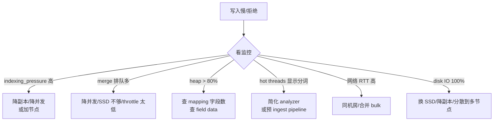
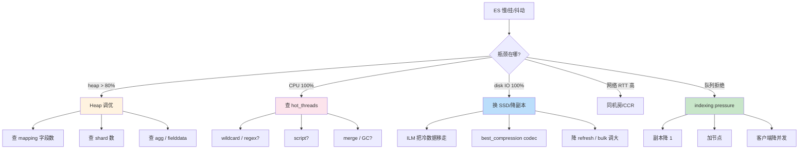

# 精通 ES 性能调优：heap、shard、hot threads 与一切慢的根因

> 关联章节：[E02 Segment 与合并](./02-精通-Segment-与合并.md)、[E04 分片与路由](./04-精通-分片与路由.md)、[E09 写入与近实时](./09-精通-写入与近实时.md)

---

## 引言：调优是一个排除游戏

ES 慢的原因有很多，但**根因模型很简单**：所有性能问题都能归到下面四类资源之一：

| 资源 | 表现 | 第一指标 |
|---|---|---|
| **CPU** | 查询/聚合慢、CPU 100% | `top` / `_nodes/hot_threads` |
| **Heap（JVM 堆）** | GC 抖动、OOM、circuit breaker 触发 | `_nodes/stats/jvm` / GC log |
| **IO**（磁盘） | 写入吞吐低、refresh 慢、merge 卡 | `iostat -x 1` |
| **网络** | 跨节点延迟高、bulk RTT 长 | `iperf3` / 客户端 P99 |

调优的本质是**先量后调**：

1. 看监控（Prometheus / Kibana / `_cat/*`）找到瓶颈资源
2. 定位是哪个分片 / 索引 / 查询导致
3. 改配置（mapping / shard / 查询）或加资源
4. 再测，对比

**永远不要"盲调"**——比如"听说 heap 给 50% 就好"，但不知道你的瓶颈是不是 heap。这章按资源维度展开，每节给你一套**诊断 → 修复 → 验证**的闭环。

读完之后你应能：

- 给一个慢集群列出五条诊断假设，并按优先级验证
- 解读 `_nodes/stats`、`_cat/thread_pool`、`hot_threads`、slow log
- 配置 indexing pressure、circuit breaker、search.max_buckets 等保护机制
- 设计针对不同场景（日志、全文、向量、聚合）的调优清单

---

## 第一章：JVM Heap —— 最常见的瓶颈

### 1.1 ES 进程的内存版图

```
┌─────────────────────────────────────────────────────────┐
│ 节点物理内存 64GB                                         │
├──────────────────────────────────┬──────────────────────┤
│ JVM Heap (30GB)                  │ 其余 ~34GB           │
│  ├─ Old Gen                      │  ├─ JVM 元数据 ~1GB  │
│  ├─ Young Gen (Eden + Survivor)  │  ├─ Direct memory    │
│  ├─ Indexing buffer (10% heap)   │  │   (Netty, Lucene) │
│  ├─ Query cache (10% heap)       │  └─ OS Page Cache    │
│  ├─ Request cache (1% heap)      │      (segment 缓存)   │
│  ├─ Field data (内存映射访问)     │                       │
│  └─ Cluster state / Mapping      │                       │
└──────────────────────────────────┴──────────────────────┘
```

**关键观察**：

- Lucene 通过 mmap 把 segment 文件映射进**虚拟地址空间**，但实际驻留在 OS Page Cache。这部分**不在 JVM 堆里**。
- 所以"内存给 ES"实际是分两块：JVM heap + 留给 page cache 的物理内存。

### 1.2 30GB 法则

**JVM heap 上限：32GB 以下，最佳值 30GB**。原因：

- **Compressed OOPs**（压缩对象指针）：堆 ≤ 32GB 时，JVM 用 32-bit 指针寻址 64-bit 对象（每对象 8 字节对齐），节省一半指针内存。
- 超过 32GB → 切回 64-bit 指针 → 对象头变大 → 实际可用 heap 反而下降。
- 实战取 30GB 留余量。

```bash
# jvm.options 或环境变量
-Xms30g
-Xmx30g
# 必须 Xms = Xmx，避免动态扩容时 GC
```

```bash
# 验证压缩指针生效
$ jcmd <pid> VM.flags | grep -i compressed
   bool UseCompressedOops = true
   bool UseCompressedClassPointers = true
```

### 1.3 Heap 该给多大

| 物理内存 | Heap | Page Cache | 备注 |
|---|---|---|---|
| 16 GB | 8 GB | 6 GB | 小节点起步 |
| 32 GB | 16 GB | 14 GB | 主流 |
| 64 GB | 30 GB | 32 GB | 数据节点甜区 |
| 128 GB | 30 GB | 95 GB | **超过这个量，建议拆两个节点** |

**为什么 128GB 物理内存只给 30GB heap？** —— ES 的查询很大一部分（filter cache、agg）走 heap，但 segment 数据走 page cache。OS 用得多越好。**128GB 单节点跑两个 30GB 实例**比一个 60GB 实例好（不会进入非压缩指针，也降低单节点故障半径）。

### 1.4 GC 算法选择

| GC | 默认版本 | 适用 | 备注 |
|---|---|---|---|
| **G1GC** | ES 7+/JDK 17 默认 | 大堆（>10GB）、稳定低暂停 | 推荐 |
| ZGC | JDK 17+ 实验 | 超大堆（>64GB，极低暂停） | ES 9 实验支持 |
| Parallel | 老版本 | 吞吐优先 | 不推荐 |
| CMS | JDK 14 废弃 | — | 历史 |

G1 的关键参数：

```bash
-XX:+UseG1GC
-XX:MaxGCPauseMillis=200   # 目标最大暂停
-XX:G1ReservePercent=25    # 保留区，防 to-space exhausted
-XX:InitiatingHeapOccupancyPercent=30  # 老年代 30% 就开 mixed GC
```

### 1.5 GC 抖动的症状与诊断

```bash
# 1. 看 GC log（jvm.options 加 -Xlog:gc*:file=/path/gc.log）
$ grep "Pause Full" gc.log
# 出现 Full GC → 老年代撑爆，danger zone

# 2. _nodes/stats
GET _nodes/stats/jvm
# 看 gc.collectors.old.collection_time_in_millis 增长速率

# 3. _cat/nodes 看 heap.percent
GET _cat/nodes?v&h=name,heap.percent,ram.percent,cpu,load_1m
```

**heap.percent > 75% 警戒线**：当 ES 检测到堆占用过高会主动拒绝请求（circuit breaker）。

### 1.6 Heap 占用的常见元凶

| 元凶 | 表现 | 修复 |
|---|---|---|
| **field data 加载（text 字段排序）** | 老年代涨得快 | 改成 keyword 用 doc_values |
| **超大聚合（terms size:100000）** | 单查询撑爆 heap | 用 composite agg 分批，加 max_buckets |
| **mapping 字段爆炸（dynamic mapping 不控）** | cluster state 几百 MB | 上限 1000 字段，关 dynamic |
| **过多 shard** | shard 元数据 ~50KB/shard 起步 | 单节点 < 600 shard，单 GB heap < 20 shard |
| **大 bulk + 副本多** | indexing buffer + transit 都吃 heap | 减 bulk 行数 / 减副本 |

### 1.7 Off-heap：Direct memory

Lucene、Netty 会用 direct memory（非堆，由 JVM 管理但绕过 GC）。默认上限 `-XX:MaxDirectMemorySize=heap_size`。

```bash
# 监控
GET _nodes/stats/jvm | jq '.nodes[].jvm.buffer_pools.direct'
# count / used_in_bytes / total_capacity_in_bytes
```

**告警阈值**：direct > 1.5 × heap 就要查 Netty / 网络层是否泄漏。

---

## 第二章：Shard 数量 —— 集群健康的另一个常见杀手

### 2.1 Shard 越多越好？错。

每个 shard：

- 在每个节点上是一个独立的 Lucene **IndexWriter** + **IndexReader**
- 占用文件句柄（每 segment 一组文件）
- 占用 cluster state 中的元数据（约几 KB / shard，但乘上千就成 MB）
- 增加查询时的 fan-out（一次搜索给 N 个 shard 都发请求）

**经验阈值**：

| 维度 | 推荐 |
|---|---|
| 单 GB heap 容纳 shard | < 20（保守），ES 官方 < 25 |
| 单节点 shard 数 | < 600（默认 cluster.max_shards_per_node 1000） |
| 单分片大小（搜索） | 10-50 GB |
| 单分片大小（日志） | 30-50 GB |
| 单索引 shard 数 | 通常 = 数据节点数 或 整数倍 |

### 2.2 诊断 shard 过多

```bash
# 1. 每节点 shard 数
GET _cat/shards?v&h=node | sort | uniq -c | sort -rn

# 2. 单节点 shard / GB heap
# 假设 30GB heap → 上限 600 shard
GET _cat/allocation?v

# 3. shard 大小分布
GET _cat/shards?v&h=index,shard,prirep,store&s=store:desc | head -20
```

### 2.3 修复路径

| 情况 | 修复 |
|---|---|
| 太多小索引 | rollover + ILM 合并到月度索引 |
| 单索引 shard 数过多 | shrink API（前置：分片都在同节点、index read-only） |
| 老索引读少 | 关索引（`_close`）/ 移到 frozen tier |
| 旧索引应删除 | ILM delete phase |

shrink 示例：

```bash
# 1. 配置：分片都在一个节点 + 只读
PUT idx_v1/_settings
{
  "index.routing.allocation.require._name": "node-1",
  "index.blocks.write": true
}

# 2. shrink 到 1 个分片
POST idx_v1/_shrink/idx_v1_shrunk
{
  "settings": {"index.number_of_shards": 1, "index.number_of_replicas": 1}
}

# 3. 别忘了换 alias 指向新索引
POST _aliases
{"actions":[
  {"remove":{"index":"idx_v1","alias":"idx"}},
  {"add":{"index":"idx_v1_shrunk","alias":"idx"}}
]}
```

### 2.4 Segment 数量

不是 shard 数，而是 **shard 内 segment 数**也影响性能。

```bash
# 看每 shard 的 segment 数
GET _cat/segments/myidx?v | awk '{print $2}' | sort | uniq -c

# 段太多（>50 / shard）的修复
POST myidx/_forcemerge?max_num_segments=5
```

**force_merge 注意事项**：

- 是同步且 IO 重的操作，**只对只读索引做**
- 不要对活跃写入的索引做（会立刻产生很多新 segment 让你白干）
- 最佳时段：业务低峰
- max_num_segments=1 适合冷数据，对热数据 3-5 更稳妥

---

## 第三章：Indexing 调优

### 3.1 检查清单

| 项目 | 默认 | 大写入场景调整 |
|---|---|---|
| `index.refresh_interval` | 1s | 30s（甚至 -1，导入完再开） |
| `index.translog.durability` | request | async（牺牲一致性换吞吐） |
| `index.translog.sync_interval` | 5s | 30s（结合 async） |
| `index.number_of_replicas` | 1 | 导入阶段设 0，完成再加回 |
| `indices.memory.index_buffer_size` | 10% heap | 20-30%（多写少读时） |
| bulk 大小 | — | 5-30 MB 或 1000-5000 docs |
| 客户端并发 | — | 取 `数据节点数 × 2` |

### 3.2 写入慢的诊断决策树



### 3.3 Indexing pressure（写入反压）

ES 7.9 引入。每个节点对"正在处理的写"占用内存有上限：

```yaml
# 默认 10% heap
indexing_pressure.memory.limit: 10%
```

超过 → 拒绝新请求，返回 429 + reason。

```bash
GET _nodes/stats/indexing_pressure
# 看 current.combined_coordinating_and_primary_in_bytes
# 看 rejections.coordinating / primary / replica
```

**有 rejection 不一定是坏事**——它防止 OOM。但**频繁 rejection 说明集群供不应求**，要么加节点，要么客户端降并发。

### 3.4 客户端侧 backoff

正确的 bulk 客户端必须实现指数退避：

```python
# Python elasticsearch.helpers.bulk 默认行为
helpers.bulk(
    client, actions,
    chunk_size=1000,
    max_retries=3,
    initial_backoff=2,    # 第一次重试 2s
    max_backoff=600,      # 上限 10 min
    retry_on_timeout=True,
)
```

**429 必须重试**（拒绝是临时的）。**400 不能重试**（格式错误，重试无意义）。

---

## 第四章：查询调优

### 4.1 查询慢的常见类型

| 类型 | 表现 | 主因 |
|---|---|---|
| **慢 query** | 单查询 P99 高 | 过宽 wildcard / regex / script |
| **fan-out 太广** | 走 100+ shard | 跨太多索引、shard 拆得碎 |
| **大 size / 深分页** | size > 1000 或 from > 5000 | 用 search_after / scroll |
| **聚合爆桶** | terms 桶数百万 | 改 composite agg 或 sampler |
| **field data 加载** | 第一次查询慢，后续快 | text 字段排序 / agg → 改 keyword |

### 4.2 查询性能诊断流程

```bash
# 1. profile 看实际耗时
POST myidx/_search?profile=true
{ "query": {...} }
# 看 query.children 里哪个 clause 耗时大

# 2. _cluster/pending_tasks 是否有阻塞
GET _cluster/pending_tasks

# 3. _cat/tasks 看长任务
GET _cat/tasks?v&detailed=true&actions=*search*

# 4. _nodes/hot_threads 看节点在干什么
GET _nodes/hot_threads?threads=10&interval=500ms&snapshots=10
```

### 4.3 hot_threads 读法

```
::: {node-1}{xx}{xx}
   Hot threads at 2026-05-13T10:00:00Z, interval=500ms, busiestThreads=10

   85.3% [cpu=85.3%, other=0.0%] (426.5ms out of 500ms) cpu usage by thread 'elasticsearch[node-1][search][T#5]'
     5/10 snapshots sharing following 20 elements
       org.apache.lucene.search.MultiTermQueryConstantScoreWrapper$ConstantScoreRewriteWrapper.rewrite(...)
       org.apache.lucene.search.WildcardQuery.rewrite(...)
```

读法：

- **百分比**：这个线程在采样区间占用了多少 CPU
- **N/M snapshots**：这个调用栈出现了 N 次（共采样 M 次），N 越大说明这线程长期卡在那
- **包名**：从 Lucene / ES 内部包名能立刻定位是 query rewrite / merge / GC 哪种问题

**例子**：上面这个例子典型是 wildcard query 在 rewrite 阶段炸了——可能因为 `*foo*` 这种前后通配查询。

### 4.4 慢查询日志

```bash
# 在索引粒度开启
PUT myidx/_settings
{
  "index.search.slowlog.threshold.query.warn": "2s",
  "index.search.slowlog.threshold.query.info": "500ms",
  "index.search.slowlog.threshold.fetch.warn": "1s",
  "index.indexing.slowlog.threshold.index.warn": "1s"
}
```

慢日志写在 `<cluster>_index_search_slowlog.json`：

```json
{
  "type":"index_search_slowlog",
  "took":"3.2s",
  "stats":["my_app"],
  "source":"{\"query\":{\"wildcard\":{\"name\":\"*foo*\"}}}"
}
```

**生产必开**——是查 P99 抖动的第一手证据。

### 4.5 Filter cache（query cache）

ES 自动缓存"重复出现的、足够选择性强"的 filter 子句的位图：

```bash
GET _nodes/stats/indices/query_cache
# hit_count / miss_count / cache_size / evictions
```

提高命中率的技巧：

- filter 条件用稳定值（如 `term`、`range`，避免 `now`）
- 把"频繁出现"的 filter 移到 must 上方的 bool filter 子句中
- 不要每次查询都拼绝对时间（`gte: "2026-05-13T10:00:00"`），可换成相对到分钟（`gte: "now-1h/m"`，让 cache key 稳定）

### 4.6 Request cache

针对**整个分片级别的请求结果**缓存（默认只缓存 `size=0` 的聚合请求）：

```bash
# 强制开启某索引的 request cache
PUT myidx/_settings { "index.requests.cache.enable": true }

# 单次请求强制使用
POST myidx/_search?request_cache=true { ... }
```

适合 **size=0 + 聚合**的仪表盘查询，结果命中可秒回。

### 4.7 doc_values 与 fielddata

| 字段类型 | doc_values 默认 | 用于 |
|---|---|---|
| keyword / numeric / date / ip / boolean | ✅ | 排序、聚合、脚本 |
| text | ❌ | 仅 BM25 评分用倒排，不能直接 agg |

**痛点**：业务想对 text 做聚合 → ES 会加载 fielddata 到 heap，超慢且吃内存。

**修复**：text 字段加 `.keyword` 子字段，agg 走 keyword：

```json
"name": {
  "type":"text",
  "fields": {"keyword":{"type":"keyword","ignore_above":256}}
}
```

聚合改 `name.keyword`。

---

## 第五章：Aggregation 调优

### 5.1 桶爆炸是头号杀手

```json
// 反例：百万 user_id × 24 小时 = 2400 万桶
{
  "aggs": {
    "by_user": {
      "terms": {"field": "user_id", "size": 1000000},
      "aggs": {
        "hourly": {"date_histogram": {"field": "@timestamp", "fixed_interval": "1h"}}
      }
    }
  }
}
```

修复策略：

| 问题 | 方案 |
|---|---|
| 桶数太多 | `composite` agg 分页拉 |
| 只要 Top N | `terms` size 限定 + `terms_set` 过滤 |
| 大基数 distinct | `cardinality` agg（HLL 近似，默认 precision_threshold=3000） |
| 时序场景 | **TSDS（time series data stream）+ TSDB index** |
| 全集采样足够 | `sampler` / `random_sampler` |

### 5.2 composite agg —— 分页聚合的正确姿势

```json
POST sales/_search
{
  "size": 0,
  "aggs": {
    "by_product": {
      "composite": {
        "size": 1000,
        "sources": [
          {"product": {"terms": {"field": "product_id"}}},
          {"date": {"date_histogram": {"field": "@timestamp", "calendar_interval": "day"}}}
        ]
      }
    }
  }
}
// 返回 after_key，下一次带上 "after": {"product":"X","date":...}
```

特点：

- 不会爆桶（每页 size 个）
- 可以**断点续传**（after_key）
- 多 source 笛卡尔积
- 适合**离线分析、数据导出**

### 5.3 global ordinals

terms 聚合在 keyword 字段上走 global ordinals 优化：

- 每个 segment 内的 ordinal 不同
- 第一次聚合时把所有 segment ordinal 合并成 global ordinal 映射
- 后续查询直接用 global ordinal 比较，O(1)

代价：**第一次查询慢**（构 global ordinals）。可预加载：

```json
PUT myidx/_mapping
{
  "properties": {
    "category": {"type": "keyword", "eager_global_ordinals": true}
  }
}
```

eager_global_ordinals 让 refresh 后立即构建，把代价从查询移到 refresh。**适合频繁聚合的热字段**。

### 5.4 max_buckets 保护

```yaml
# elasticsearch.yml 或 _cluster/settings
search.max_buckets: 65536
```

超过会抛 `too_many_buckets`。**这是好事**——逼客户端用 composite 或加 filter。

---

## 第六章：节点角色与路由

### 6.1 分离角色

| 角色 | 职责 | 推荐配置 |
|---|---|---|
| `master` | 集群状态 | 3 节点专用，4C/8G 即可 |
| `data` / `data_hot` 等 | 索引数据 | 大内存、SSD |
| `ingest` | 摄入 pipeline | CPU 强 |
| `coordinating` | 路由 + 聚合归并 | 大堆 |
| `ml` | ML 任务 | GPU/CPU 看模型 |

**关键陷阱**：master 节点不能和 data 节点混用，**master 出问题 = 全集群挂**。

### 6.2 Coordinating-only 节点的价值

```yaml
# 专 coord 节点
node.roles: []
# 实际配置（YAML 不支持空数组关键字时）：
node.master: false
node.data: false
node.ingest: false
node.ml: false
node.transform: false
```

什么时候要？

- **大聚合**：归并阶段在 coord 完成，耗 heap+CPU。隔离避免影响数据节点。
- **大量客户端**：长连接、QPS 高 → coord 是负载均衡入口
- **Kibana 后端**：Kibana 喜欢专门一个 coord 跟它配对

### 6.3 数据热温冷冻分层

| 层 | 介质 | 用途 | 索引设置 |
|---|---|---|---|
| hot | NVMe SSD | 写入 + 近期查询 | `index.routing.allocation.include._tier_preference: data_hot` |
| warm | SSD | 1-7 天前 | `data_warm,data_hot`（fallback） |
| cold | HDD | 7-30 天 | `data_cold,data_warm` |
| frozen | 对象存储 + 本地缓存 | 30+ 天，可搜索快照 | `data_frozen` |

ILM 管理整个生命周期：

```json
PUT _ilm/policy/logs
{
  "policy": {
    "phases": {
      "hot": {
        "actions": {
          "rollover": {"max_age": "1d", "max_primary_shard_size": "50gb"},
          "set_priority": {"priority": 100}
        }
      },
      "warm": {
        "min_age": "1d",
        "actions": {
          "shrink": {"number_of_shards": 1},
          "forcemerge": {"max_num_segments": 1},
          "allocate": {"include": {"_tier_preference": "data_warm"}}
        }
      },
      "cold": {
        "min_age": "7d",
        "actions": {
          "freeze": {},
          "allocate": {"include": {"_tier_preference": "data_cold"}}
        }
      },
      "frozen": {
        "min_age": "30d",
        "actions": {
          "searchable_snapshot": {"snapshot_repository": "s3_repo"}
        }
      },
      "delete": {
        "min_age": "365d",
        "actions": {"delete": {}}
      }
    }
  }
}
```

---

## 第七章：Circuit Breakers —— 防止 OOM 的最后一道闸

ES 内部多个 circuit breaker：

| 名称 | 默认上限 | 作用 |
|---|---|---|
| `parent` | 95% heap | 总线 |
| `fielddata` | 40% heap | text fielddata 加载 |
| `request` | 60% heap | 单请求（agg、query）累计 |
| `accounting` | 100% heap | Lucene segment 内存 |
| `in_flight_requests` | 100% heap | HTTP/transport 进行中的请求 |
| `script_compilation` | 75/5min | 编译脚本数限制 |

诊断：

```bash
GET _nodes/stats/breaker
# 看 breakers.parent.tripped 计数
```

**触发 circuit breaker 比 OOM 好得多**——breaker 抛 429/503 你能重试，OOM 节点直接挂。

调整 parent breaker：

```yaml
indices.breaker.total.use_real_memory: true   # 默认 true，以实际堆为准
indices.breaker.total.limit: 95%
```

**不建议提高上限**——这意味着加大 OOM 风险。先想想为什么撑到 95%。

---

## 第八章：磁盘 IO 与文件系统

### 8.1 磁盘是 ES 性能的物理上限

ES 写入路径都要落盘（translog fsync + 最终 segment）。**HDD vs SSD 写入吞吐差 10-50 倍**。

| 介质 | 写入 IOPS | 适用 |
|---|---|---|
| HDD | 100-200 | cold tier、不写入或低 QPS |
| SATA SSD | 50k-100k | warm，预算紧 |
| NVMe SSD | 500k+ | hot，所有写密集 |
| 网络盘（EBS 等） | 看规格 | 看应用，io 调优要考虑节流 |

### 8.2 关键磁盘参数

```yaml
# 关闭磁盘的 read-ahead（ES 是随机读为主）
# 文件系统层（ext4）
mount -o noatime,nodiratime /dev/nvme0n1 /var/lib/elasticsearch

# IO 调度器
echo none > /sys/block/nvme0n1/queue/scheduler  # NVMe 直接用 none
# SATA SSD 可以用 mq-deadline
```

### 8.3 page cache 重要性

ES 大部分**读路径靠 page cache**——segment 文件 mmap 进进程地址空间，操作系统决定缓存策略。

- 物理内存 / page cache 比例越大 → 命中越高 → 查询越快
- 推荐：**热索引总大小 ≤ page cache 容量**（即所有热段都能驻留在内存）

监控：

```bash
free -h
# 看 cached 字段

# Linux 看进程实际占用
cat /proc/<pid>/status | grep -i rss
```

### 8.4 磁盘 watermark

ES 根据剩余空间动态控制 shard 分配：

```yaml
cluster.routing.allocation.disk.watermark.low: 85%    # 不再分配新 shard
cluster.routing.allocation.disk.watermark.high: 90%   # 主动迁移 shard 出去
cluster.routing.allocation.disk.watermark.flood_stage: 95%  # 索引转 read-only
```

**flood_stage 触发是惨剧的开始**——索引立刻变只读，业务写入全失败。

预防：

- 监控告警提前在 80% 触发
- 配合 ILM 主动 rollover、删旧索引
- 大集群保留 15% 空间 buffer

---

## 第九章：网络与 RTT

### 9.1 网络是隐形瓶颈

ES 节点间通信：

- transport（默认 9300）：节点间二进制协议、shard 间复制、查询 fan-out
- HTTP（默认 9200）：客户端入口

**典型问题**：

- 跨 AZ / 跨 Region 部署 → RTT 50-100ms+，bulk 性能崩
- TCP keepalive 没开 → 长连接被防火墙断
- TLS 加密 → CPU 占 5-15%（视实现）

### 9.2 优化策略

```yaml
# transport 调优
transport.tcp.compress: true   # 跨网压缩 transport（但同机房不必开）
transport.publish_port: 9300
transport.profiles.default.bind_host: ...

# HTTP 调优
http.max_content_length: 100mb  # 单请求上限，bulk 大时调高
http.compression: true
```

### 9.3 同机房 / 跨机房

| 部署 | 适合 |
|---|---|
| 单机房 | 99% 场景，最简单最快 |
| 同 region 多 AZ | 需要高可用 |
| 跨 region | CCR（cross-cluster replication），不要用单集群 |

**单集群跨 region 是反模式**——quorum / 心跳 / 复制都会被 RTT 拖死。要跨 region 用 CCR 让每地一个集群。

---

## 第十章：场景化调优清单

### 10.1 日志场景

```yaml
# 写多读少、按天 rollover
index.refresh_interval: 30s
index.translog.durability: async
index.translog.sync_interval: 30s
index.number_of_replicas: 1
index.codec: best_compression  # 牺牲查询速度换磁盘
index.mapping.total_fields.limit: 2000
index.lifecycle.name: logs
```

- bulk 大小 5-15 MB
- analyzer 简化（log 字段通常用 keyword，不需要全文）
- ILM hot 1d → warm 7d → cold 30d → delete 365d
- shard 30-50GB / 个

### 10.2 全文搜索场景（电商 / 知识库）

```yaml
index.refresh_interval: 1s    # 用户需要实时性
index.number_of_replicas: 2   # 读密集
index.number_of_shards: 6     # 看数据量，单 shard 10-30GB
```

- analyzer 用 IK / Smartcn / ICU
- BM25 调 b 参数（详见 E07）
- multi_match + function_score 业务信号 boost
- 高 QPS 字段开 eager_global_ordinals
- 慢查询 threshold 200ms

### 10.3 向量检索场景（RAG）

```yaml
index.refresh_interval: 30s   # 向量查询用 HNSW 不实时
index.number_of_replicas: 1
index.number_of_shards: 数据节点数

# dense_vector
properties.embedding:
  type: dense_vector
  dims: 768
  index: true
  similarity: dot_product
  index_options:
    type: int8_hnsw   # 8-bit 量化节省 4x 内存
    m: 16
    ef_construction: 100
```

- knn 查询 num_candidates = max(100, k×10)
- 配合 BM25 hybrid + RRF
- 详见 E08

### 10.4 时序数据场景

```yaml
# Time Series Data Stream（TSDS）
index.mode: time_series
index.routing_path: [host, service]
index.time_series.start_time: 2026-05-01T00:00:00Z
index.time_series.end_time: 2026-05-02T00:00:00Z
index.codec: best_compression
```

- ES 9 的 **TSDB 模式**对时序数据压缩比 ~3-10×（同样数据省一半磁盘）
- 维度字段在 routing_path → 同一台机器的所有指标落同一 shard
- date_histogram 走优化路径

---

## 第十一章：监控与告警

### 11.1 必须监控的指标

| 指标 | 阈值 | 来源 |
|---|---|---|
| 集群健康 | yellow 容忍、red 立即告警 | `_cluster/health` |
| heap.percent | > 80% 告警 | `_cat/nodes` |
| Old GC 频率 | > 1/min | jvm stats |
| disk.used_percent | > 80% 告警，85% 紧急 | `_cat/allocation` |
| pending_tasks | > 30 异常 | `_cluster/pending_tasks` |
| unassigned_shards | > 0 | `_cluster/health` |
| indexing rejected | > 0 | `_nodes/stats/thread_pool` |
| search rejected | > 0 | 同上 |
| circuit breaker tripped | 任何 > 0 | `_nodes/stats/breaker` |
| 节点离线 | 任何变化 | `_cat/nodes` |

### 11.2 推荐工具栈

| 工具 | 用途 |
|---|---|
| **Elastic Stack 自身** | Kibana Stack Monitoring（自托管），元集群最佳实践 |
| **Prometheus + es_exporter** | 通用、便宜 |
| **Grafana** | 看板 |
| **Datadog / NewRelic** | SaaS、有 ES 模板 |

### 11.3 元集群（meta cluster）

**别把监控数据存在同一个集群里**——集群挂了你就什么都看不到。建一个**专门的 meta cluster** 接收所有生产集群的监控数据。

```yaml
# elasticsearch.yml
xpack.monitoring.exporters:
  remote:
    type: http
    host: ["https://meta-cluster:9200"]
    auth.username: monitor_user
    auth.password: ...
```

---

## 第十二章：故障案例

### 12.1 案例：所有写入突然 429

**症状**：客户端报大量 `EsRejectedExecutionException`，QPS 没明显变化。

**诊断**：

```bash
GET _cat/thread_pool?v&h=node,name,active,queue,rejected
# 看 write 线程池的 rejected
```

发现 write 线程队列满。继续：

```bash
GET _nodes/stats/indexing_pressure
# coordinating_in_bytes 接近 limit
```

**根因**：客户端开始用 5 副本的索引，每个 bulk 在 indexing_pressure 中算 (1 + 5) × size，反压触发。

**修复**：副本数降到 1（或 2），重新开。或加节点。

### 12.2 案例：聚合 OOM

**症状**：某仪表盘查询导致整个节点 OOM 重启。

**诊断**：
- slow log 显示该查询走 terms agg + script
- profile 显示 size:100000 + 2 层嵌套桶 → 千万级桶

**根因**：业务用 `terms size: max_int` 想拿全集，桶爆。

**修复**：
- 加 `search.max_buckets: 65536` 让爆桶失败而不是 OOM
- 业务改用 composite agg 分页
- 加 request circuit breaker 监控告警

### 12.3 案例：节点磁盘 100%，集群挂

**症状**：周日凌晨，告警一片。集群 status red，几十个 shard unassigned，触发 flood_stage，业务全失败。

**诊断**：
- 一个 data 节点磁盘 99%，触发 disk.watermark.flood_stage
- ILM 被卡（pending_tasks 几百个）
- 旧索引没删，rollover 在堆积

**根因**：ILM 删 phase 因为 snapshot 没完成而卡住（一个 cold-to-frozen 的 snapshot 任务失败了）。

**修复**：
- 紧急：手动 `DELETE` 几个 30 天前的旧索引腾空间
- 中期：ILM 改 retry，加监控 `_ilm/explain` 查看任务状态
- 长期：监控告警提前在 80% 触发，留 10% buffer 给紧急情况

### 12.4 案例：查询 P99 周期性飙到 5s

**症状**：平均查询 50ms，但每隔 30 分钟会有一波 P99 高峰。

**诊断**：
- hot_threads 抓到峰值时刻在 force_merge
- ILM warm phase 设置了 forcemerge max_num_segments=1，对刚 rollover 的索引执行
- 没排开业务时段

**修复**：
- ILM forcemerge phase 加 `wait_for_active_shards` 配合业务低峰
- 或临时不要 force_merge（不是必需）
- 长期：用 best_compression codec + 让 tiered merge 自然合并

### 12.5 案例：master 选主抖动

**症状**：集群每天发生 1-2 次 master 切换，期间几秒钟所有写入失败。

**诊断**：master 节点 heap 80%+，GC 时长 > 5s。

**根因**：master 节点和 data 节点混用，data 节点的大查询占满 heap 让 master 心跳超时。

**修复**：
- 拆出 3 个专用 master 节点（4C/8G，heap 4G 即可）
- data 节点不再担任 master
- 调 cluster.election.duration 给 master 选主更多 buffer

---

## 第十三章：调优的元方法

### 13.1 量化优先

任何调优在动手前先回答：

1. 当前指标是多少？（要数字，不是"很慢"）
2. 目标是多少？（"写入 10k QPS、查询 P99 200ms"）
3. 调完怎么验证？（同等负载下重测）

**没有基准就不要调**——你不知道改完是不是变好了。

### 13.2 一次只改一个变量

不要同时调 refresh_interval、bulk size、副本数。每改一个变量跑一轮基准。

### 13.3 工具：rally / esrally

Elastic 官方提供的 benchmark 工具：

```bash
# 安装
pip install esrally

# 跑标准 track
esrally race --track=nyc_taxis --target-hosts=localhost:9200

# 对比两次结果
esrally compare --baseline=<id1> --contender=<id2>
```

适合验证调参效果。

### 13.4 经验法则速查

| 症状 | 第一假设 |
|---|---|
| heap 高 + GC 频繁 | mapping 太大 / shard 太多 / 大聚合 |
| 写入 429 | indexing pressure / write 队列满 |
| 查询 P99 高 | shard fan-out 太广 / agg 大 / hot shard |
| 磁盘满 | 没 ILM 删旧 |
| 节点 unjoin | 网络 / master GC |
| force_merge 后查询慢 | 段太大 caching 没命中 |
| `[scheduler]` 调度迟到 | 整机 CPU 100% |

---

## 总结 · 调优一图流



调优心法：

1. **先量后调**——没基准就不调
2. **一次一变量**——多变量改不可分析
3. **资源维度排查**——CPU / Heap / IO / 网络，逐一排除
4. **优先改业务**——比起加 CPU，改 mapping 或 query 通常便宜得多
5. **保护机制是朋友**——circuit breaker、max_buckets、disk watermark 都是设计来"快速失败"的，关掉它们只会推迟 OOM 而不是避免

---

## 练习题

1. 节点 64GB 物理内存，应该给 JVM heap 多少？为什么不是 50%？
2. 单节点 600 shard 是上限吗？这个数从哪里来的？
3. 解释 indexing pressure 与 write 线程池 rejected 的关系。
4. 为什么 text 字段做聚合慢？应该怎么改 mapping？
5. profile API 显示某查询 80% 时间在 build_scorer，可能的原因？
6. 一个集群 heap 持续 85%，列出至少 3 个可能根因和验证方法。
7. ILM hot → warm 阶段为什么要 shrink + forcemerge？分别解决什么问题？
8. parent circuit breaker 触发时返回什么 HTTP code？客户端应该重试吗？
9. coordinating-only 节点的两个典型使用场景。
10. 跨 region 部署 ES，为什么不能放在同一个集群？

> 答案见 [QUIZ.md](./QUIZ.md)

---

> 🔁 反馈：把 rally 跑起来对比你调参前后的数字——只有数字不会骗你
