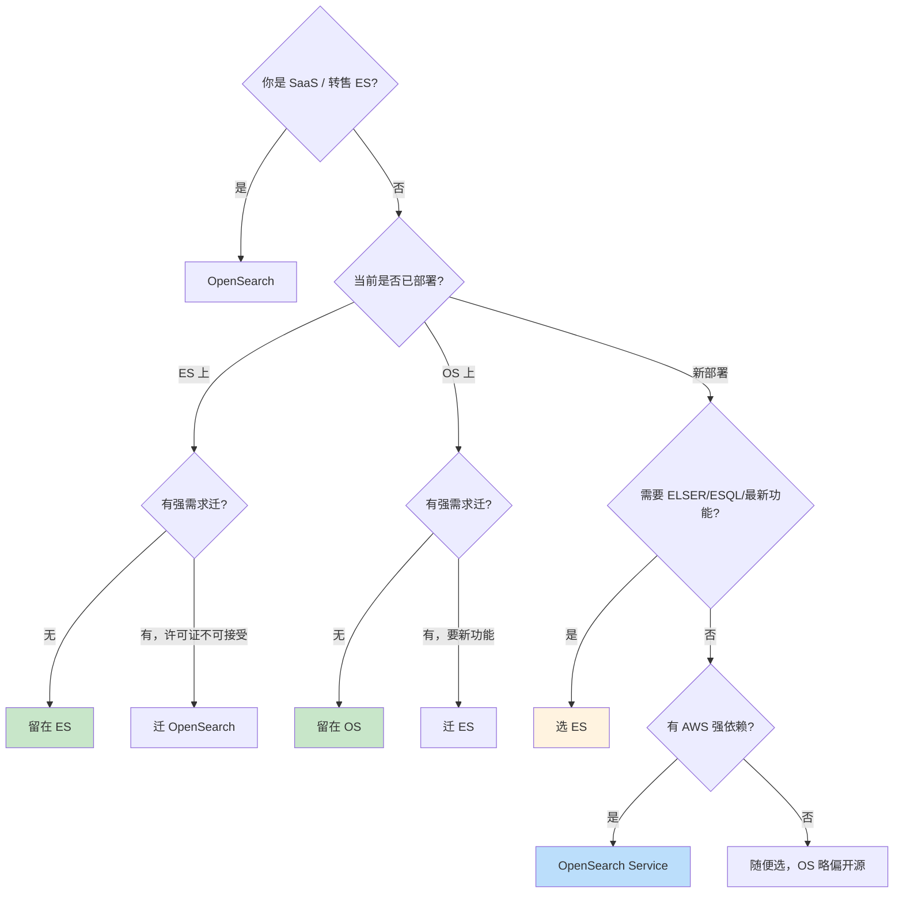
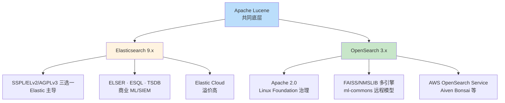

# Elasticsearch vs OpenSearch：许可证、特性差异、兼容性与迁移

> 关联章节：[E01 倒排索引与 Lucene](./01-精通-倒排索引-与-Lucene.md)、[E08 向量检索](./08-精通-向量检索.md)、[E10 性能调优](./10-精通-性能调优.md)

---

## 引言：一个分裂出来的世界

2010 年 Shay Banon 开源 Elasticsearch（Apache 2.0），到 2021 年 1 月 Elastic 把许可证改成 SSPL/ELv2 双协议，是这段历史的分水岭。AWS 立刻 fork 出 **OpenSearch**（Apache 2.0），从此搜索引擎世界一分为二。

到 2026 年的现在，两者已经各自演化了 5 年：

- **Elasticsearch 9.x**：Elastic 主导，闭源化倾向但 2024 重新引入 AGPLv3 选项；ML / 向量检索 / Kibana 商业化最完整
- **OpenSearch 3.x**：Linux Foundation 治理（2024 年从 AWS 移交），Apache 2.0，云中立

两者**底层都是 Lucene**，但上层 API、ML、向量、安全、Kibana/Dashboards 已经实质分叉。这章帮你：

- 理解为什么会分叉，今后会不会再合
- 列出主要功能差异（特别是 2024-2026 的新增）
- 评估 API 兼容性（你的客户端能不能两边都跑）
- 给出迁移决策树（什么时候该迁、怎么迁）

---

## 第一章：许可证演化史

### 1.1 时间线

```
2010 Feb   Elasticsearch 1.0 (Apache 2.0)
2015       X-Pack 商业插件出现（闭源）
2019       Open Distro for Elasticsearch by AWS（Apache 2.0 fork，加自己的 security）
2021 Jan   Elastic 改协议：7.11+ 用 SSPL 或 ELv2 双协议 ← 关键转折
2021 Apr   AWS 宣布 OpenSearch（1.0 在 6 月发布）
2022       OpenSearch 2.0 / Elasticsearch 8.0 安全默认 GA / dense_vector GA
2023       两边都加 vector / kNN
2024 Aug   Elastic 加回 AGPLv3 第三选项（"open source"标签恢复）
2024 Sep   AWS 把 OpenSearch 项目移交给 Linux Foundation
2025       Elasticsearch 9.0（Lucene 10、ESQL GA）/ OpenSearch 3.0
2026       两边都在演化，再合并已基本不可能
```

### 1.2 三种许可证对比

| 协议 | 性质 | 是否 OSI 认证 OSS | 谁用 |
|---|---|---|---|
| **Apache 2.0** | 宽松开源 | ✅ | OpenSearch、Lucene、Kafka 等 |
| **SSPL**（Server Side Public License） | "源代码可见 + 服务化必须开源" | ❌（MongoDB 发明，2018） | Elastic 7.11+ / MongoDB |
| **ELv2**（Elastic License v2） | "用就用，但不能 SaaS 转售" | ❌ | Elastic 商业产品 |
| **AGPLv3** | 强 copyleft、SaaS 也要开源 | ✅ | Elastic 8.x 后选项之一 |

Elastic 改协议的目标：**阻止云厂商（特别是 AWS）把 ES 包装成托管服务赚钱**。SSPL 要求"如果你提供 ES 为 SaaS，必须开源你整个服务栈"，这对 AWS 不可接受 → fork。

### 1.3 2024 年的 AGPLv3 转身

2024-08-29 Elastic 宣布在 9.x 加入 AGPLv3 作为**第三个**可选协议（SSPL / ELv2 / AGPLv3 三选一）。

这是个有趣的反向操作：

- AGPLv3 是 OSI 认证的开源协议 → ES 重新可以叫 "open source"
- 但 AGPLv3 同样有 SaaS copyleft 约束，对 AWS 一样不友好
- 实际效果：**对普通用户来说 ES 又是"开源"了**，但对竞争对手依然敌意

### 1.4 OpenSearch 治理变化

2024-09 AWS 把 OpenSearch 移交给 **Linux Foundation 旗下的 OpenSearch Software Foundation**，治理结构正式中立化：

- 不再"AWS 的项目"
- Aiven、SAP、Uber、Bytedance 等都进 Steering Committee
- 持续 Apache 2.0

这让"选 OpenSearch 等于选 AWS"的标签弱化了——OpenSearch 现在确实是一个多厂商共治的项目。

---

## 第二章：底层共同点

记住：**ES 与 OpenSearch 90% 是同一套代码**。

### 2.1 共享的底层

| 组件 | 状态 |
|---|---|
| Lucene（搜索引擎核心） | 两边都用，版本可能略错配 |
| 倒排索引 / segment / merge | 完全一样 |
| 分布式协议（cluster state、Zen → Cluster Coordination） | 早期一样，后续微调 |
| REST API 核心（CRUD、search、aggs） | 9x% 兼容 |
| BM25 评分 | 一样 |
| 大多数 mapping / analyzer | 一样 |

### 2.2 哪些是各自加的

| 领域 | Elastic 主导 | OpenSearch 主导 |
|---|---|---|
| 安全（auth/RBAC） | X-Pack Security（现部分免费） | 内建 security plugin |
| ML / 异常检测 | X-Pack ML（强大、商业） | OpenSearch ML Commons（追赶中） |
| SQL / ESQL | ESQL（ES 9 主推） | PPL（Piped Processing Language） |
| 仪表盘 | Kibana | OpenSearch Dashboards（Kibana fork） |
| 报警 | Kibana Alerting（部分商业） | OpenSearch Alerting（Apache 2.0） |
| 数据收集 | Beats / Elastic Agent | Data Prepper / OpenSearch Ingest |
| APM | Elastic APM | OpenSearch Observability + OTel |
| 向量 / kNN | dense_vector + Lucene HNSW + ELSER | k-NN 插件（FAISS / NMSLIB + Lucene） |

> 关键观察：**底层 Lucene 一样，所以基本搜索能力一样**；商业化和上层产品差别越来越大。

---

## 第三章：API 兼容性

### 3.1 客户端兼容性

| 客户端 | ES 8/9 | OS 2/3 |
|---|---|---|
| 官方 elasticsearch-py 7.x | ✅ | ⚠️ 兼容模式（headers 校验放宽） |
| 官方 elasticsearch-py 8.x+ | ✅ | ❌ 严格校验产品 header |
| OpenSearch-py | ❌ | ✅ |
| 通用 HTTP / curl | ✅ | ✅ |
| Spring Data ES | ✅ | ⚠️ |
| Logstash | ✅ | ⚠️（可用，但有时 header 校验问题） |

**关键转折**：ES 8.x 客户端会校验响应 header 中的 `X-Elastic-Product: Elasticsearch`，OpenSearch 不返回这个 header 所以会**直接拒绝连接**。两个补救：

1. 降级用 ES 7.x client
2. 用 OpenSearch 官方 client（fork 自 ES 7.x）

```python
# OpenSearch 官方客户端
from opensearchpy import OpenSearch
client = OpenSearch(hosts=["https://localhost:9200"],
                    http_auth=("admin","admin"))
# API 用法与 ES 7 几乎一致
client.search(index="logs", body={"query":{...}})
```

### 3.2 API 路径差异

绝大多数 CRUD / search / aggs API 完全一致。差异在新特性和管理 API：

| 功能 | Elasticsearch | OpenSearch |
|---|---|---|
| 索引模板 | `_index_template` | 一样 |
| 数据流 | `_data_stream` | 一样 |
| ILM | `_ilm/policy` | **ISM**（Index State Management）`_plugins/_ism/policies` |
| 安全用户 | `_security/user` | `_plugins/_security/api/internalusers` |
| 角色 | `_security/role` | `_plugins/_security/api/roles` |
| ML 模型 | `_ml/trained_models` | `_plugins/_ml/models` |
| SQL | `_sql` | `_plugins/_sql` |
| 异步搜索 | `_async_search` | 一样 |
| Snapshot | `_snapshot` | 一样 |
| ES SQL / ESQL | `_query` (ESQL) | ❌（用 PPL） |
| 向量 kNN | `knn` query | `knn` query（参数略不同） |

策略：**写跨兼容代码尽量走 CRUD/search 子集**，避免走特定厂商的 plugin API。

### 3.3 Query DSL 差异

DSL 几乎完全一致，但有一些边角差异：

| 子句 | ES 9 | OS 3 |
|---|---|---|
| `match` / `bool` / `term` / `range` | ✅ | ✅ |
| `knn` 顶级查询 | ✅ Lucene HNSW | ✅ kNN 插件（lucene / faiss / nmslib 引擎） |
| `dense_vector` 字段 | ✅ | ✅（参数与 ES 略不同，元数据字段命名差异） |
| `semantic_text` | ✅ ES 8.16+ | ❌ |
| `sparse_vector` / ELSER | ✅ | ⚠️ Neural Search 插件，模型不同 |
| `text_expansion` | ✅ | ⚠️ Neural Sparse |
| `rule_query`（rule-based query） | ✅ | ❌ |

---

## 第四章：向量检索差异

### 4.1 ES 9 的向量栈

- **字段类型**：`dense_vector`
- **算法**：Lucene 内置 HNSW（自版本 9.0 起）
- **量化**：int8 / int4 / bbq（binary 量化）
- **查询**：`knn`（异步组件 + filter pre/post）
- **混合**：内置 RRF（Reciprocal Rank Fusion）
- **专用模型**：ELSER（稀疏向量）开箱即用
- **Semantic search**：`semantic_text` 字段类型一键自动 embed + retrieve

```json
PUT my_index
{
  "mappings": {
    "properties": {
      "content_embedding": {
        "type": "semantic_text",
        "inference_id": ".elser_model_2"
      }
    }
  }
}
// 写入时自动 embed，查询时 semantic_query 一键
```

### 4.2 OpenSearch 3 的向量栈

- **字段类型**：`knn_vector`
- **算法引擎**：三种可选 —— Lucene、FAISS、NMSLIB（多算法多引擎是 OS 的卖点）
- **量化**：PQ / SQ（标量 / 乘积量化）
- **查询**：`knn` 查询子句
- **混合**：Neural Search 插件
- **Neural Sparse**：自有训练的稀疏模型

```json
PUT my_index
{
  "mappings": {
    "properties": {
      "embedding": {
        "type": "knn_vector",
        "dimension": 768,
        "method": {
          "name": "hnsw",
          "engine": "faiss",
          "parameters": {"m": 16, "ef_construction": 100}
        }
      }
    }
  }
}
```

### 4.3 主要差异

| 维度 | ES 9 | OS 3 |
|---|---|---|
| 默认 / 推荐引擎 | Lucene HNSW | Lucene HNSW（生产推荐），FAISS 实验性能强 |
| 量化 | int8/int4/bbq | PQ/SQ（FAISS） |
| 一键 embed | semantic_text（专有） | 要自行配置 ingest pipeline |
| 最大维度 | 4096 | 16000+（依引擎） |
| ELSER / 稀疏向量 | 内置预训练 | Neural Sparse（社区） |

**实战选择**：

- 用 RAG + 国产化 embedding 模型：OS 更灵活（自定义 pipeline）
- 用 Elastic 的 ELSER 拿"开箱即用 70% 召回"：ES
- 性能极限场景：FAISS GPU 在 OS，ES 端没有

---

## 第五章：ML 与可观测性

### 5.1 ML

| 功能 | ES | OS |
|---|---|---|
| 数据帧分析 / 分类 / 回归 | 商业（platinum） | ML Commons（Apache 2.0） |
| 异常检测（time-series） | 商业 | Anomaly Detection 插件免费 |
| LLM 集成 | 内建 inference API（Cohere / OpenAI / Hugging Face） | ml-commons connectors |
| 训练好的模型上传 | 支持 PyTorch | 支持 ONNX / TorchScript |
| Trained model 部署 | 节点 in-process | ml-commons remote inference |

OpenSearch 在 ML 上**追上速度很快**，特别是 ML Commons 支持远程模型（HTTP/gRPC call out）后，与商业 LLM 集成实际比 ES 更灵活——但 UX 还不如 Elastic 一站式。

### 5.2 SQL / 类 SQL 接口

ES 9 的杀手锏是 **ESQL**：

```sql
FROM logs-*
| WHERE @timestamp > NOW() - INTERVAL 1 DAY
| STATS count = COUNT(*) BY level
| SORT count DESC
| LIMIT 10
```

特点：
- 管道式（类似 Splunk SPL）
- 在 coord 端编译成执行计划
- 支持跨索引 join（lookup join, ES 8.13+）
- 比传统 SQL 接口（`_sql`）快很多

OS 这边对应是 **PPL（Piped Processing Language）**：

```ppl
source=logs-*
| where @timestamp > now() - 1d
| stats count() by level
| sort -count
| head 10
```

API 路径不同（`_plugins/_ppl`），语法相似度高，迁移工作量小但要改。

### 5.3 Kibana vs OpenSearch Dashboards

- OpenSearch Dashboards 是 fork 自 Kibana 7.10
- 主体功能（Discover、Visualize、Dashboard）一样
- 高级功能（Lens、Vega、机器学习视图、APM UI）Elastic 这边更强
- OpenSearch 把"高级监控"做成独立 plugins（Observability、Anomaly Detection、Alerting）

---

## 第六章：性能差异（2025-2026 实测）

基于 esrally / opensearch-benchmark 公开报告，关键趋势：

| 场景 | 谁更强 | 原因 |
|---|---|---|
| 单节点写入（小集群） | 持平 | Lucene 一样 |
| 大规模写入 | ES 略优 | indexing pressure / batch pipeline 优化更深 |
| 全文 BM25 查询 | 持平 | Lucene 一样 |
| 向量检索（HNSW） | 持平 | 都用 Lucene HNSW |
| 向量检索 + 量化 | ES 略优 | bbq 量化先进、int8 调优好 |
| 聚合（cardinality） | 持平 | 算法相同 |
| ESQL vs PPL | ES 大幅领先 | 执行引擎重新设计、向量化 |
| 时序场景（TSDS） | ES 优 | TSDB 模式压缩比、查询优化 |
| 大集群稳定性 | ES 略优 | 反压、cluster coordination 更新更频繁 |

**结论**：在通用场景两边性能差距不大；在**最新特性**（ESQL、TSDB、量化、ELSER）上 ES 领先 6-12 个月。

---

## 第七章：选型决策

### 7.1 决策矩阵

| 你的处境 | 推荐 | 理由 |
|---|---|---|
| 已在 Elastic Cloud 跑 | Elasticsearch | 别折腾，迁移成本远大于许可证溢价 |
| 已在 AWS OpenSearch Service | OpenSearch | AWS 原生集成、托管、SLA |
| 要 Apache 2.0 极简纯净 | OpenSearch | 协议无忧 |
| SaaS 公司、产品要内嵌 ES | OpenSearch | SSPL/ELv2 都禁止 SaaS 内嵌 ES 转售 |
| 要 ELSER / Semantic search 一键 | Elasticsearch | OS 还得自己拼 |
| 要 ESQL / 高级 ML | Elasticsearch | 暂时还没替代 |
| 自建大型 ML 平台 | 看情况 | ES 易用、OS 更灵活 |
| 政府 / 合规要求开源 | OpenSearch | Apache 2.0 / LF 治理 |
| 老项目（< 7.10）升级 | 两边都行 | 7.10 之前 fork 点之前两者完全兼容 |

### 7.2 SSPL/ELv2 到底约束什么

**约束**：你不能把 ES 包装成 **托管服务/SaaS 卖给别人**。
**不约束**：

- 公司内部用 ES 跑自己业务 → OK
- SaaS 公司用 ES 存自己的数据 → OK
- 产品里用 ES 做搜索，但卖产品不卖"ES 服务" → OK
- 把搜索功能开放给客户用，没卖 ES 本身 → OK

**99% 公司其实根本不受 SSPL 影响**。如果你是阿里云 / AWS / GCP 这种要卖"托管 ES"才受影响。

但 AGPLv3 不同：**网络服务一样要开源**。如果你的产品里嵌了 AGPL ES，又对外提供网络服务，理论上要开源你整个服务栈（这就是 Elastic 把 AGPLv3 作为选项的"威慑"）。

### 7.3 决策清单



---

## 第八章：迁移操作

### 8.1 迁移方向

| 方向 | 难度 | 主要工具 |
|---|---|---|
| ES 7.10- → OS | 低 | 直接 restore snapshot |
| ES 7.10+ → OS | 中 | 重建索引或用 reindex from remote |
| OS → ES | 中-高 | reindex from remote，注意 plugin API |
| 平行 → 灰度切流 | 高 | 双写、双读、流量切换 |

### 8.2 Snapshot 迁移（兼容时）

```bash
# 1. ES 端建快照
PUT _snapshot/s3_repo {"type":"s3","settings":{...}}
PUT _snapshot/s3_repo/snap_2026_05_13?wait_for_completion=true
{"indices":"logs-*"}

# 2. OS 端注册同样 repo
PUT _snapshot/s3_repo {"type":"s3","settings":{...}}

# 3. OS 端 restore
POST _snapshot/s3_repo/snap_2026_05_13/_restore
{"indices":"logs-*","rename_pattern":"logs-(.+)","rename_replacement":"logs-$1"}
```

**兼容性表**（重要）：

| 源 | 目标 | 是否能直接 restore |
|---|---|---|
| ES 7.0-7.10 | OS 1.x/2.x | ✅ |
| ES 7.11-7.17 | OS 1.x/2.x | ⚠️（部分版本可，要测） |
| ES 8.x | OS 2.x/3.x | ❌（要 reindex） |
| ES 9.x | OS 3.x | ❌ |

### 8.3 Reindex from remote

跨大版本或跨产品时唯一可靠方法：

```bash
# 在目标集群（OS 或 ES）执行
POST _reindex
{
  "source": {
    "remote": {
      "host": "https://source-cluster:9200",
      "username": "...",
      "password": "..."
    },
    "index": "logs-2026.05.*",
    "size": 5000
  },
  "dest": {"index": "logs-migrated"}
}
```

**要点**：

- 目标端 `elasticsearch.yml` / `opensearch.yml` 要加 `reindex.remote.whitelist: source-cluster:9200`
- 大索引分批做，size 调到 1000-5000 避免一次性
- 注意 mapping 差异（特别向量字段、semantic_text 这种）要先在目标手动建 mapping

### 8.4 双写灰度

零停机迁移的常见模式：

```
┌──────────┐
│  Client  │
└────┬─────┘
     │ 写
     ├─────────► Old (ES)
     └─────────► New (OS) ← 灰度阶段双写
       读 100% → 50% → 0% 渐进切换
```

关键：

1. 应用层抽象搜索接口
2. 写入双写，读取从旧切到新
3. 准备好回滚开关（kill switch）
4. 一段时间后再下线旧集群

### 8.5 客户端迁移

| 客户端 | 迁移做法 |
|---|---|
| HTTP/curl | 不用改 |
| ES 官方 client → OS | 改包名 `elasticsearch` → `opensearchpy` / `opensearch-java` |
| Logstash | 配置 output 改 host，可能要兼容 plugin |
| Beats | 改 output；OS 这边推荐换 Data Prepper |
| Kibana → OS Dashboards | 一键迁移有工具，自定义仪表盘可能要手调 |

---

## 第九章：成本对比

### 9.1 自建

| 项目 | ES | OS |
|---|---|---|
| 软件成本 | 免费（除非用商业 X-Pack） | 完全免费 |
| 必需的"基本安全"是否要付费 | ES 7.x 后 basic security 免费 | 一直免费 |
| ML / 高级监控 / SIEM | Platinum 订阅，按节点收费 | 免费但要自己集成 |
| 商业支持 | Elastic 官方 | AWS / Aiven / Bonsai 提供 |

### 9.2 托管

| 厂商 | 提供 |
|---|---|
| Elastic Cloud | 全功能 ES，溢价高 |
| AWS Elasticsearch（停止接新用户） | 老用户在用 |
| AWS OpenSearch Service | OS 托管，AWS 集成深、有 Serverless 选项 |
| Aiven for OpenSearch | 跨云、有 ELSER 替代品 |
| Bonsai | OS / ES 都有 |
| Elastic Cloud on Kubernetes (ECK) | 自部署但用 Elastic operator |

**经验**：自建 OS / ES 单节点 5-10 GB/月数据，月成本 ~$200-500（云 VM + 存储）；同等托管 $500-2000。规模上去后自建更省（人力成本要算进去）。

---

## 第十章：常见误区

### 10.1 "OpenSearch 永远落后 ES"

错。在某些领域 OS 反而领先：

- ml-commons 远程模型集成（外接 LLM）比 ES 早
- 多算法引擎（FAISS / NMSLIB）选择更多
- 路径分片均衡器（adaptive replica selection）等小特性

ES 在新概念（ESQL / TSDB / ELSER）领先，但 OS 在生态开放性更强。

### 10.2 "ES 不开源了"

不完全准确。2024 后 AGPLv3 也是 OSI 认证开源。用户视角：99% 不受影响。**只是不再"宽松"**。

### 10.3 "迁移很简单，直接 snapshot 就行"

错，越新版本越不兼容。**预算 1-3 个月**做迁移项目（含双写灰度、客户端改造、监控搭建）。

### 10.4 "向量检索 OS 比 ES 强（因为有 FAISS）"

不准。Lucene HNSW 性能已经追上 FAISS，工程稳定性 Lucene 强。ES 默认推 Lucene 路径反而是好选择。

### 10.5 "我只要搜功能，两边随便选"

短期对，长期错。**生态、客户端版本、监控告警工具链**会让你和某一边深度绑定，越拖越难换。

---

## 第十一章：未来展望

### 11.1 两边会合并吗？

**几乎不可能**。原因：

- 商业模式根本对立（Elastic 要锁、AWS / LF 要开放）
- 五年累积的特性差异已经实质分叉
- 客户基础不同（ES 偏企业 / 商业，OS 偏云 / 开源）

### 11.2 谁会赢？

不太可能"赢家通吃"。更可能：

- **企业搜索 / 安全 SIEM** → ES 继续主导
- **AWS 生态 / 云中立大客户** → OS 主导
- **国产化、地缘隔离** → OS 与各国本地 fork（如 Easysearch 等）

### 11.3 替代品威胁

| 替代 | 威胁等级 |
|---|---|
| **Vespa**（Yahoo 出，强 ML 与排序） | ↑ 在搜索/推荐领域抢市场 |
| **Typesense / Meilisearch** | 小项目搜索，分流低端 |
| **Qdrant / Weaviate / Milvus** | 纯向量数据库吃 RAG |
| **ClickHouse / Druid** | 日志/OLAP 场景蚕食 |
| **Quickwit** | 极致冷数据 / 对象存储原生 |

ES 与 OS 真正的对手已经不是彼此，而是**专用替代**——纯向量库、纯日志库、纯 SIEM 等都在切走垂直市场。

---

## 第十二章：实战故事

### 12.1 案例：SaaS 公司被迫迁 OS

**背景**：一家用 ES 6.x 的 SaaS 公司，2021 收到 Elastic 法务函——他们把 ES 集成进自己的 SaaS 产品对外提供搜索接口，被认定违反 SSPL。

**操作**：18 个月，迁到 OS 1.x，双写灰度，最终下线 ES。

**学到的**：

- 客户端从 elasticsearch-py 改成 opensearch-py 是最大工作量
- 仪表盘迁移工具 90% 能用，剩下 10% 自定义可视化要重做
- 性能差异微小（监控前后没明显变化）

### 12.2 案例：从 OS 迁回 ES 用 ELSER

**背景**：电商搜索团队，从 OS 2.x 起步，2024 想做 semantic search。OS 当时 Neural Search 没那么成熟，决定迁到 ES 8.x 用 ELSER。

**操作**：

- 新建 ES 集群（不是 in-place 升级）
- ingest pipeline 改造：原 OS 用自训 BERT embed，迁 ES 改 ELSER
- 双跑 3 个月 A/B 评估，ELSER 召回 +8%（高于自训）
- 切流，下线 OS

**学到的**：

- 迁移本质是给你机会重新评估技术栈
- ELSER 不是万能但是 "70% 解" 很有价值

### 12.3 案例：决定不迁

**背景**：金融公司，ES 7.10 上跑了 5 年，2025 评估是否迁 ES 8.x 或 OS。

**决策**：留在 7.10。

**理由**：

- 当前功能完全够用
- 升级要重测全套查询，工作量数月
- 安全策略已稳定
- 厂商支持还有 5 年

**教训**：**不动是合理选择**。技术债不主动还是债，业务稳定才是真利益。

---

## 总结 · ES vs OS 一图



**关键速记**：

| 一句话 |
|---|
| Lucene 之上的两个发行版，90% 一样 |
| 选 OS 如果：你卖 SaaS / 要 Apache 2.0 / 跑在 AWS |
| 选 ES 如果：要 ELSER ESQL TSDB / 已有 Elastic 投资 / 要一站式产品 |
| 客户端会卡你（产品 header 校验）；HTTP 直连最稳 |
| 迁移预算 1-3 个月，重活在客户端 + 仪表盘 |
| AGPLv3 加入不是"重新拥抱开源"，是"维持开源标签 + 保留商业约束" |

---

## 练习题

1. 2021 年 1 月 Elastic 改许可证的核心动机是什么？为什么是 SSPL 而不是 GPL？
2. 一个公司用 ES 做内部企业搜索，ELv2 协议下能做什么？不能做什么？
3. 为什么 ES 8 client 默认无法连 OpenSearch？两个补救方案。
4. ES 的 ILM 和 OS 的 ISM 有哪些一致和不一致？
5. semantic_text 字段类型解决了什么问题？OS 上对应的方案是什么？
6. 跨集群 reindex 时要做哪些前置配置？
7. 列出至少 3 个 ES 与 OS 在 mapping / query DSL 上的差异。
8. 一家 SaaS 公司用 ES 做产品内嵌搜索，要不要担心 SSPL？为什么？
9. AGPLv3 与 SSPL 的相同点和不同点。
10. 给一个"已在 AWS 跑 5 年 OpenSearch 的电商团队"做选型评估：要不要迁 ES？

> 答案见 [QUIZ.md](./QUIZ.md)

---

> 📁 本文位于 `/data/workspace/dp4/elasticsearch/11-ES-vs-OpenSearch.md`
> 🔁 反馈：搭一台 ES 9 + 一台 OS 3，用同一份数据跑同一组 query，看差异在哪
