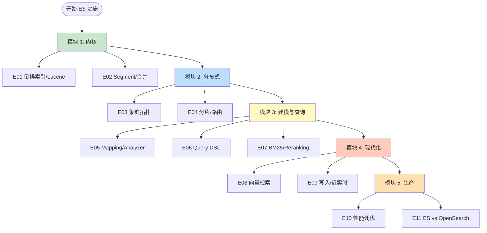
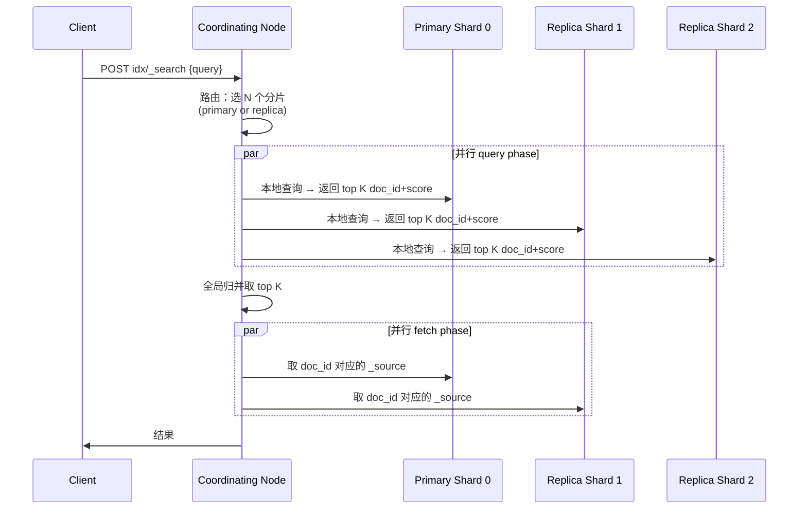
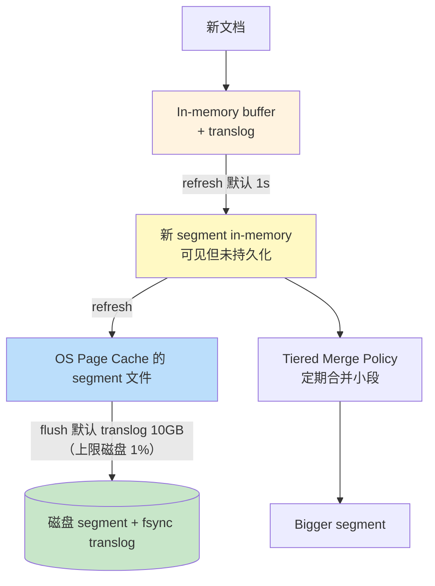
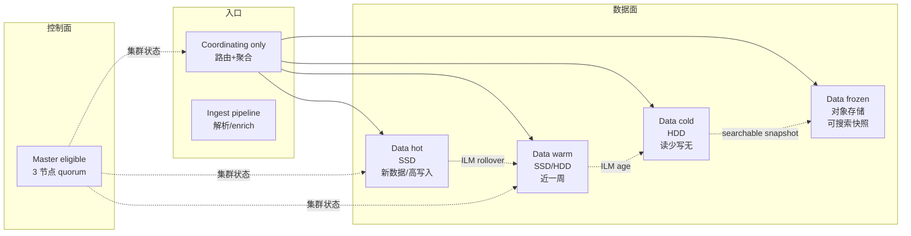
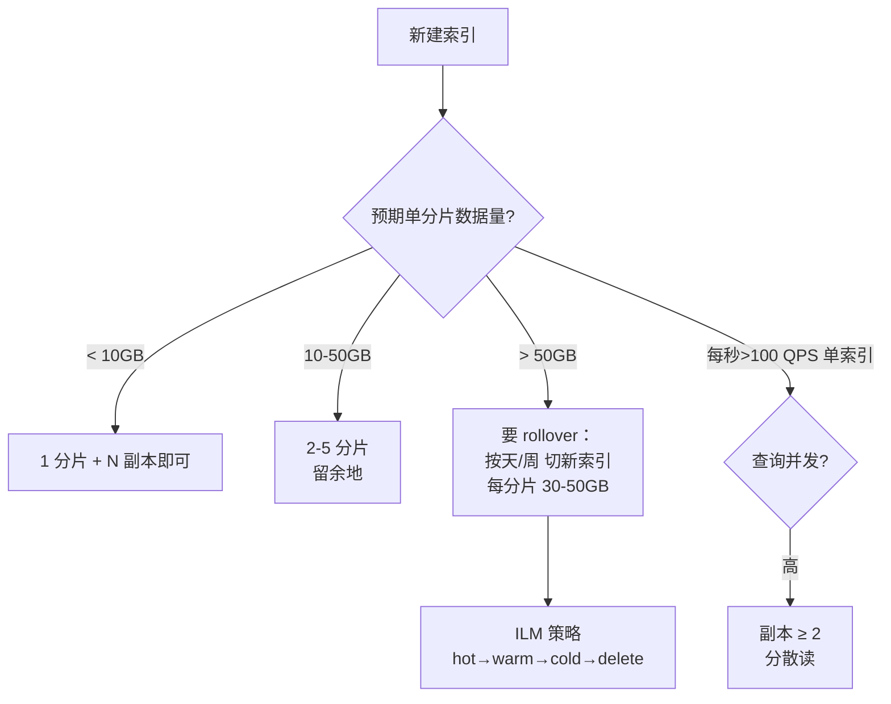
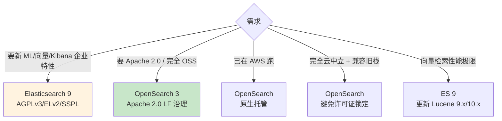
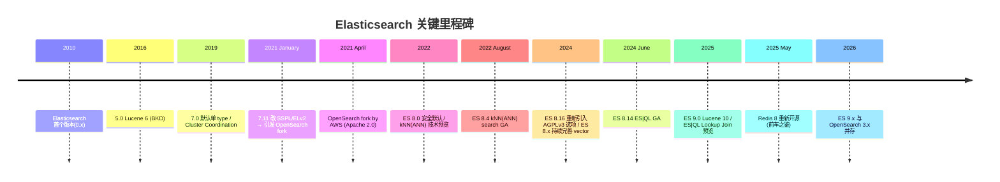

# Elasticsearch 路线图 · Mermaid 可视化

> 配合 [INDEX.md](./INDEX.md) 与 [QUIZ.md](./QUIZ.md) 使用
>
> **📅 内容基准：Elasticsearch 9.x + OpenSearch 3.x**（2026-05 时主流）

---

## 🗺️ 全景路线图

---

## 🔑 一次搜索的物理路径

**关键观察**：默认走 **query then fetch** 两阶段——query 阶段返回 doc_id + score 列表（轻量），fetch 阶段拿完整 source（重）。这是为什么"用 size:1000 翻深页"会慢到不行。

---

## 📦 Segment 与写入流水

- **refresh**：让新数据可被搜索（默认 1s，可调大降写入压力）
- **flush**：把 translog fsync + segment 落盘（保证 crash 安全）
- **merge**：把小 segment 合并成大 segment（节省文件句柄、降低查询时段扫数量）

---

## 🏗️ 集群拓扑（hot-warm-cold-frozen）

---

## 🎯 分片大小决策

> 经验值：**单分片 30-50 GB 是甜区**。再大 → segment 多、merge 重、节点恢复慢；再小 → 元数据开销占比高，集群状态膨胀。

---

## 🆚 Elasticsearch vs OpenSearch 决策

---

## 📈 ES 关键版本时间线

---

