# Go 路线图 · Mermaid 可视化

> 配合 [INDEX.md](./INDEX.md) 与 [QUIZ.md](./QUIZ.md) 使用
> 所有 Mermaid 图可在 GitHub、VS Code、Obsidian、Typora 等支持 Mermaid 的工具中直接渲染
>
> **📅 内容基准：Go 1.26**（2026-02-10 发布）。覆盖 Go 1.21–1.26 五个版本特性。

---

## 🗺️ 全景路线图

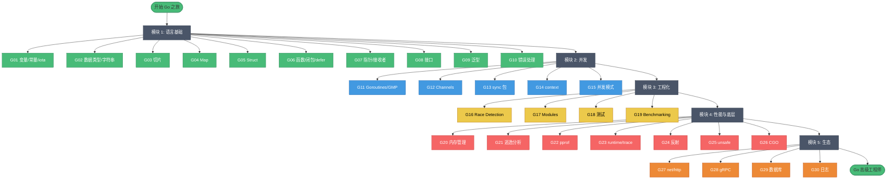

---

## 🟢 模块 1：语言基础（G01-G10）依赖图

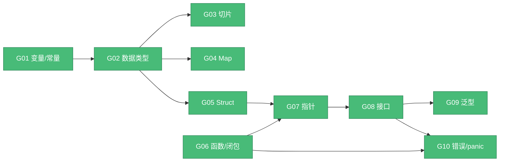

**核心知识点速记**：
- G01：var/const/iota；零值；作用域；shadowing
- G02：int 平台差异；UTF-8；StringHeader；零拷贝
- G03：SliceHeader(Data,Len,Cap)；append 扩容；别名陷阱
- G04：hmap+bucket(8 slot)；hash0 随机化；迭代乱序
- G05：内存对齐；字段重排；嵌入；noCopy
- G06：闭包按引用；defer 三种实现；命名返回值
- G07：值/指针接收者；方法集；可寻址性
- G08：iface/eface(16B)；itab 缓存；nil 装箱陷阱
- G09：类型参数；`~T`；GC shape stenciling
- G10：%w 包装；errors.Is/As/Join；panic 边界

---

## 🔵 模块 2：并发（G11-G15）依赖图

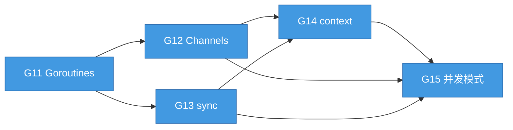

**Go 并发心智模型**：
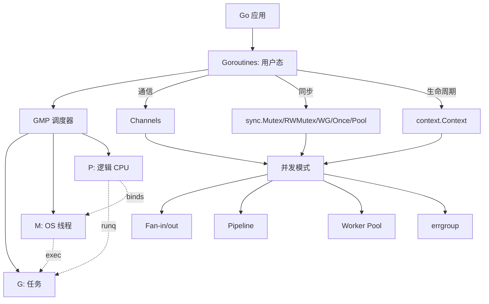

---

## 🔴 模块 4：性能与底层（G20-G26）依赖图

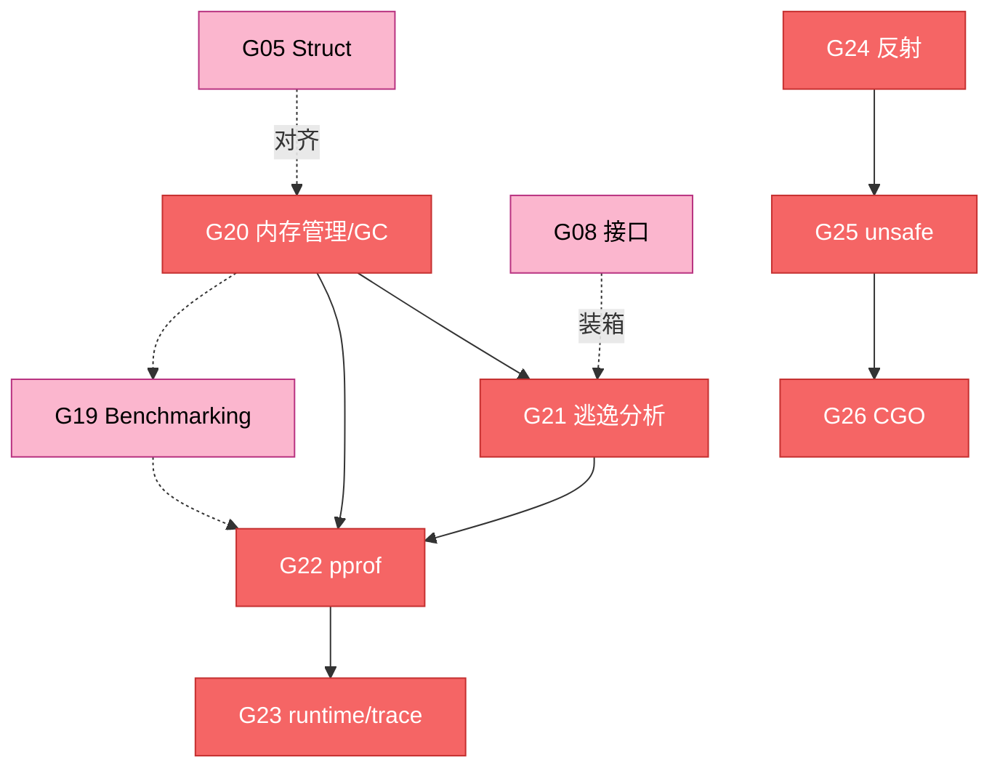

**性能调优工作流**：
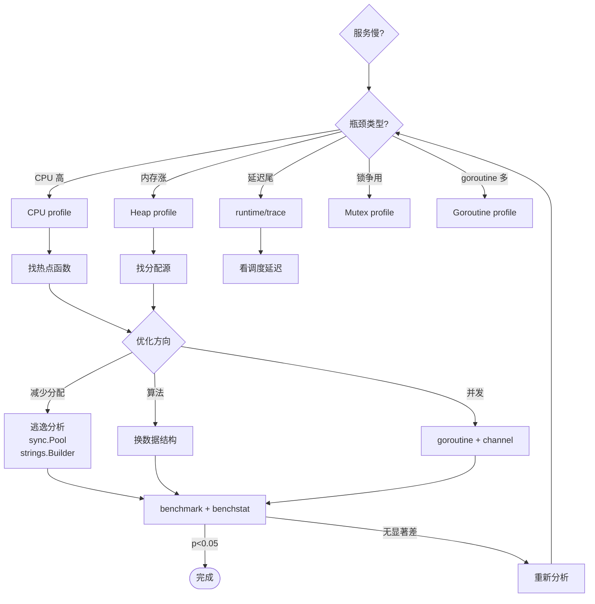

---

## 🟠 模块 5：生态（G27-G30）依赖图

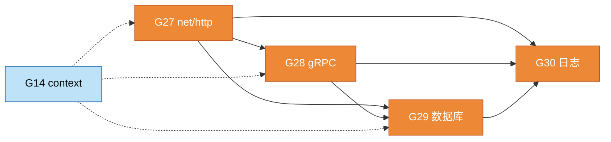

**生产级服务架构**（典型 Go 微服务）：
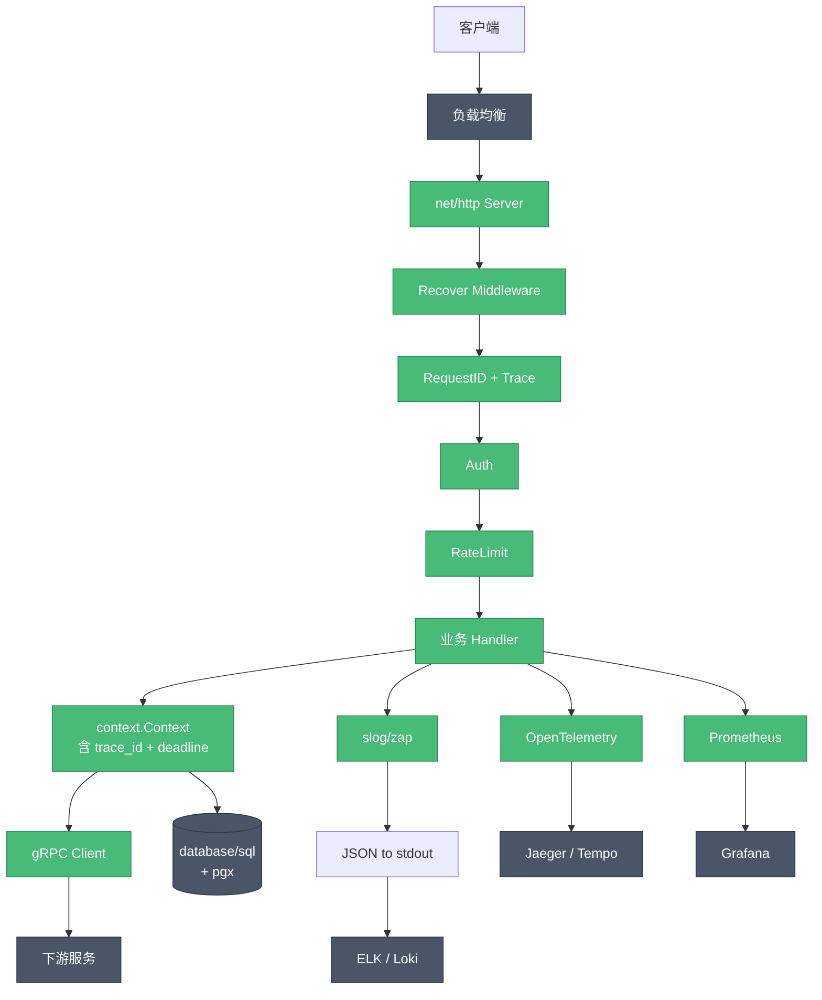

---

## 🎯 学习路径可视化

### 路径 A：完整通学（推荐）

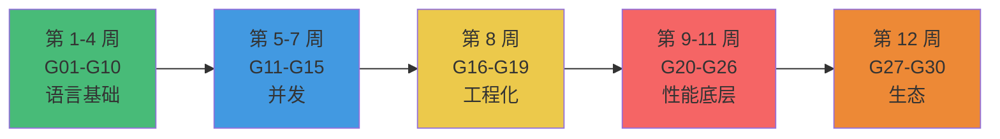

### 路径 B：性能特化

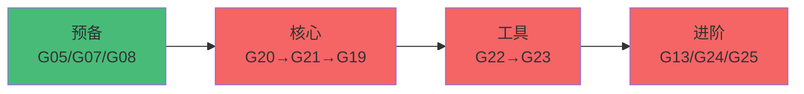

### 路径 C：并发特化

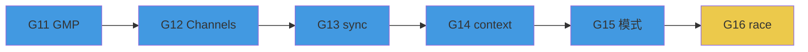

### 路径 D：后端入职急训（4 周）

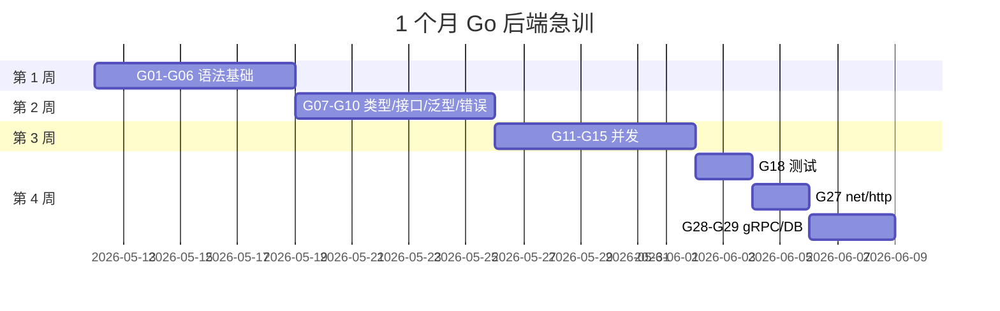

---

## 🧠 知识检索思维导图

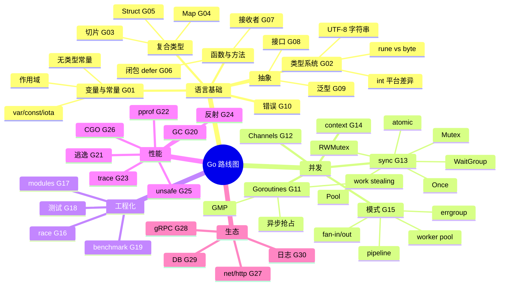

---

## 📊 难度与重要性矩阵

> Mermaid 的 `quadrantChart` 在多数渲染器（GitHub、VS Code、Hugo 等）兼容性差，这里改用表格。
> 难度：⭐ 简单 ⭐⭐ 中等 ⭐⭐⭐ 进阶 ⭐⭐⭐⭐ 难 ⭐⭐⭐⭐⭐ 极难
> 重要性：🔥🔥🔥🔥🔥 必学 → 🔥 选学

### 必学 + 难（高优先级，要花时间啃）

| 课程 | 难度 | 重要性 | 备注 |
|---|---|---|---|
| G08 接口 | ⭐⭐⭐⭐ | 🔥🔥🔥🔥🔥 | iface / eface 装箱、nil 陷阱 |
| G11 GMP | ⭐⭐⭐⭐⭐ | 🔥🔥🔥🔥🔥 | 调度器与抢占机制 |
| G12 Channel | ⭐⭐⭐⭐ | 🔥🔥🔥🔥🔥 | 死锁 / close 语义 |
| G13 sync 原语 | ⭐⭐⭐⭐ | 🔥🔥🔥🔥🔥 | Mutex / Pool / Once / Map 取舍 |
| G15 并发模式 | ⭐⭐⭐⭐ | 🔥🔥🔥🔥 | Pipeline / Fan-out / Worker pool |
| G20 GC | ⭐⭐⭐⭐⭐ | 🔥🔥🔥🔥 | 三色 + 写屏障 + STW |
| G21 逃逸分析 | ⭐⭐⭐⭐⭐ | 🔥🔥🔥🔥 | 性能调优起点 |
| G22 pprof | ⭐⭐⭐⭐ | 🔥🔥🔥🔥 | CPU / heap / goroutine 全套 |

### 必学 + 简单（性价比最高）

| 课程 | 难度 | 重要性 | 备注 |
|---|---|---|---|
| G01 变量 | ⭐ | 🔥🔥🔥🔥🔥 | 语言基础 |
| G02 类型 | ⭐⭐ | 🔥🔥🔥🔥 | type / 别名 / 转换 |
| G10 错误处理 | ⭐⭐⭐ | 🔥🔥🔥🔥🔥 | error wrap / errors.Is/As |
| G14 context | ⭐⭐⭐ | 🔥🔥🔥🔥🔥 | 取消 / 超时 / 传值规范 |
| G27 net/http | ⭐⭐⭐ | 🔥🔥🔥🔥🔥 | server / client / mux 7+ |
| G29 数据库访问 | ⭐⭐⭐ | 🔥🔥🔥🔥🔥 | database/sql + sqlx / GORM |

### 必学 + 中等

| 课程 | 难度 | 重要性 | 备注 |
|---|---|---|---|
| G03 切片 | ⭐⭐⭐ | 🔥🔥🔥🔥🔥 | append / 共享底层数组 |
| G04 Map | ⭐⭐⭐ | 🔥🔥🔥🔥🔥 | hmap 扩容 / 并发 |
| G05 Struct | ⭐⭐⭐ | 🔥🔥🔥🔥 | 内存对齐 / tag |
| G06 函数 | ⭐⭐⭐ | 🔥🔥🔥🔥 | 闭包捕获 / defer |
| G07 指针 | ⭐⭐⭐ | 🔥🔥🔥🔥 | 值 vs 引用 / receiver |
| G16 race detector | ⭐⭐⭐ | 🔥🔥🔥🔥 | 必须 -race 跑测试 |
| G18 测试 | ⭐⭐⭐ | 🔥🔥🔥🔥 | table-driven / fuzz |
| G28 gRPC | ⭐⭐⭐⭐ | 🔥🔥🔥🔥 | 流 / 拦截器 / metadata |
| G30 日志 | ⭐⭐ | 🔥🔥🔥🔥 | slog 标准化 |

### 选学（按需深入）

| 课程 | 难度 | 重要性 | 何时学 |
|---|---|---|---|
| G09 泛型 | ⭐⭐⭐⭐ | 🔥🔥🔥 | 写库 / 容器时 |
| G17 modules | ⭐⭐ | 🔥🔥🔥 | 工程化协作 |
| G19 benchmark | ⭐⭐⭐ | 🔥🔥🔥 | 性能优化前的基线 |
| G23 trace | ⭐⭐⭐⭐ | 🔥🔥 | 调度异常排查 |
| G24 反射 | ⭐⭐⭐⭐ | 🔥🔥 | 写框架时 |
| G25 unsafe | ⭐⭐⭐⭐⭐ | 🔥 | 极限性能 / 与 C 交互 |
| G26 CGO | ⭐⭐⭐⭐⭐ | 🔥 | 需要复用 C 库时 |

---

## 🔗 跨模块知识连接

某些主题会在多个章节出现——理解"为什么"比死记每章更重要。

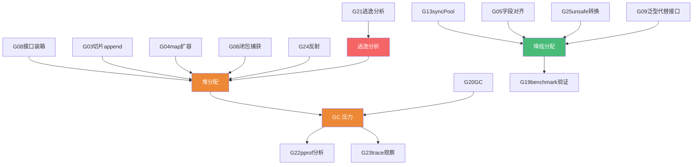

---

## ✅ 阶段性自检

每完成一个模块，应该能回答的"灵魂问题"：

### 模块 1（基础）后

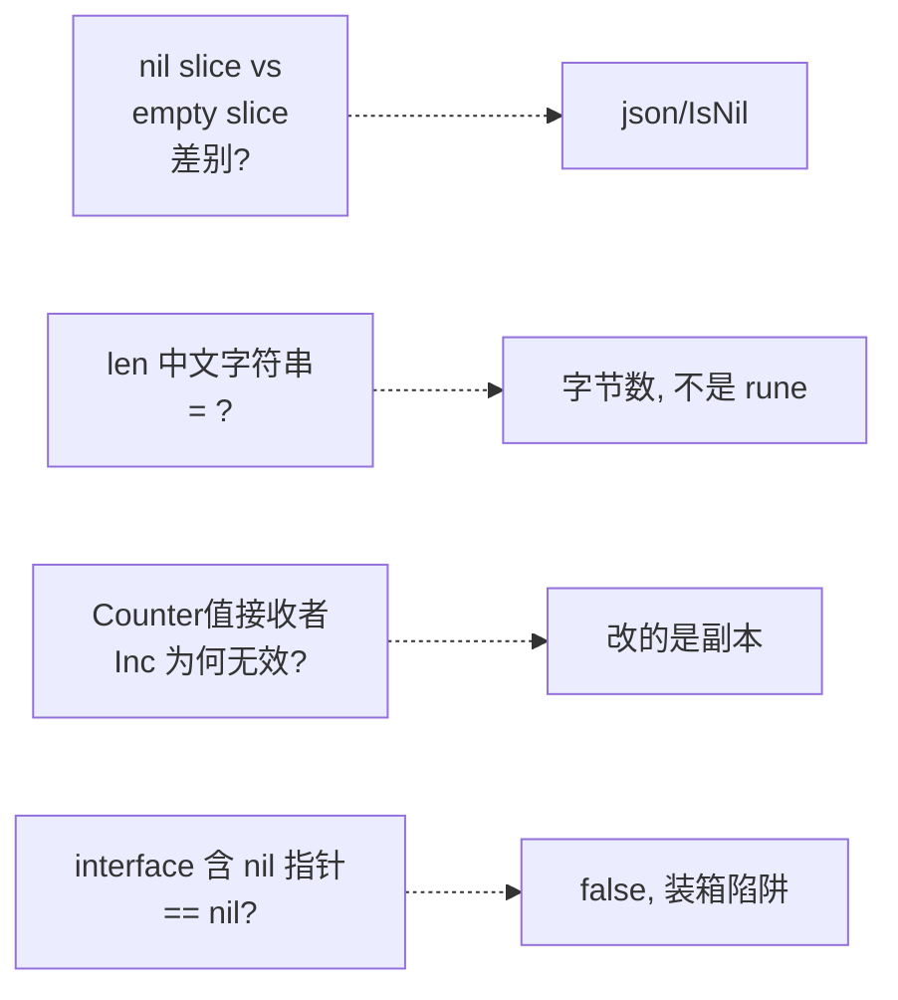

### 模块 2（并发）后

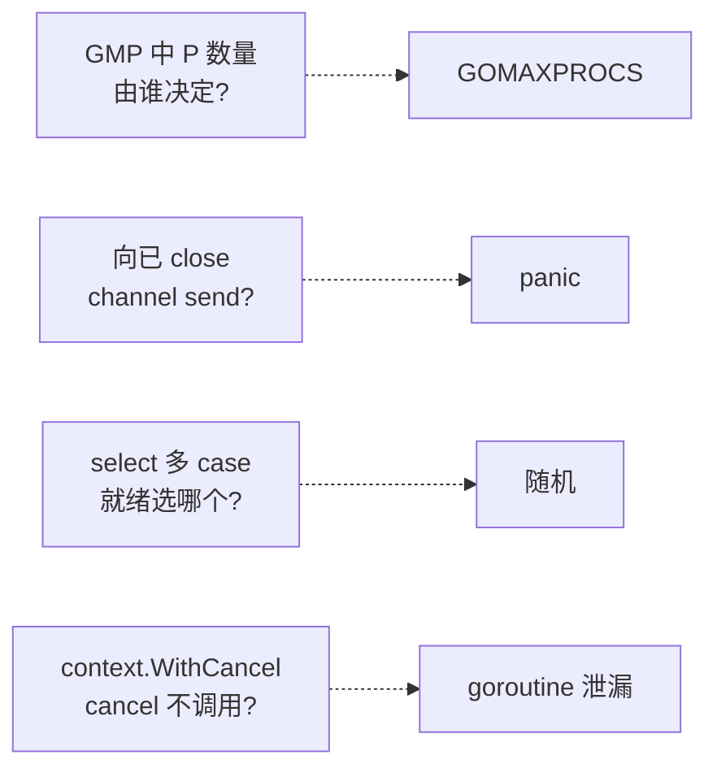

### 模块 4（性能）后

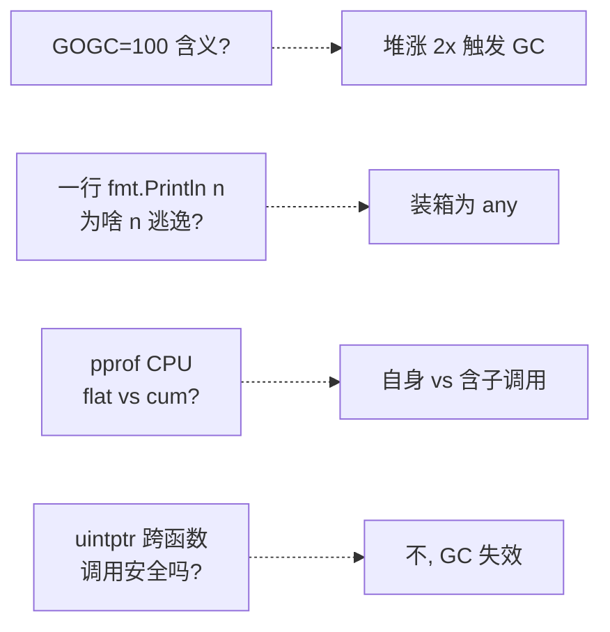

---

## 🆕 2026 新特性按版本归口

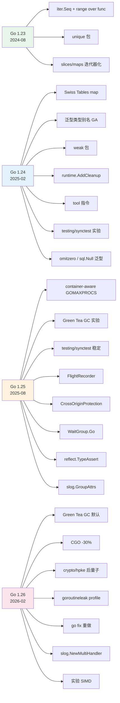

---

> 📁 本路线图位于 `/data/workspace/dp4/golang/ROADMAP.md`
> 🔁 配套：[INDEX.md](./INDEX.md) 总目录 / [QUIZ.md](./QUIZ.md) 测验题
