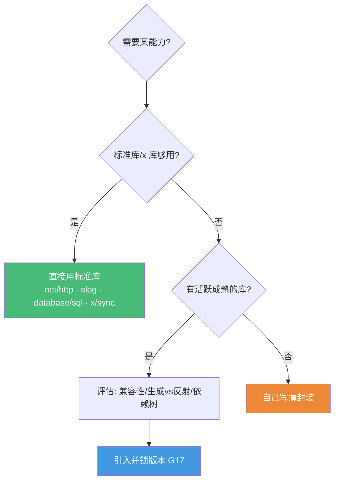

# Go 生态库选型地图 · 2026 实战精选

> 配套《Go 路线图深度课程》的生态补充篇
> **📅 内容基准：Go 1.26**（2026-06）· 标注每个库的活跃度与选型建议
> 本课程主体讲透了**标准库与语言机制**，这一篇补上"真实项目里到底该用哪些第三方库"。

---

## 选型总原则：标准库优先

Go 的标准库异常强大，很多场景**根本不需要第三方库**。引入依赖前先问三个问题：

1. **标准库够用吗？** Go 1.22+ 的 `net/http.ServeMux`（G27）、Go 1.21+ 的 `log/slog`（G30）、`database/sql`（G29）、`golang.org/x/sync`（G15）已覆盖大量需求。
2. **这个库还活着吗？** 看最近一次提交、issue 响应、是否被 archived。Go 生态有不少"明星已死"的库（如 `golang/mock`、`dep`）。
3. **它的成本是什么？** 编译期代码生成 vs 运行时反射、是否兼容 `net/http`、依赖树大小、是否绑死某个数据库。

> 📐 **黄金法则**：标准库能做到 80% 的事，第三方库帮你省掉重复的 20%。**别为了省 10 行代码引入一棵依赖树。**

---

## 1. Web 框架与路由

| 库 | 用途 | 选型建议 | 2026 现状 |
|---|---|---|---|
| **`net/http`**（标准库） | HTTP 服务 | Go 1.22+ 路由支持 `GET /users/{id}`，中小服务**首选** | 持续增强（G27）|
| **`go-chi/chi`** | 轻量路由 | **100% 兼容 `net/http`**、中间件优雅、无魔法——最推荐的第三方路由 | 活跃 |
| **`gin-gonic/gin`** | 全功能框架 | 生态最大、文档多、性能好；自带 binding/render | 活跃，事实流行款 |
| **`labstack/echo`** | 全功能框架 | 与 Gin 类似，中间件丰富、API 干净 | 活跃 |
| **`gofiber/fiber`** | 高性能框架 | 基于 `fasthttp`，**不兼容 `net/http`**（中间件生态隔离、HTTP/2 受限），慎选 | 活跃但有兼容代价 |

**一句话选型**：能用标准库 `ServeMux` 就用它（Go 1.22 后路由已够）；要中间件链/路由分组且想保持 `net/http` 兼容 → **chi**；要开箱即用的大生态 → **gin**。避免 fiber 除非确实压榨极限吞吐且不需要 `net/http` 生态。

---

## 2. HTTP 客户端

| 库 | 用途 | 选型建议 |
|---|---|---|
| **`net/http.Client`**（标准库） | HTTP 请求 | 配好超时/连接池就够用（G27）；**务必设 `Timeout`** |
| **`go-resty/resty`** | 便捷客户端 | 链式 API、自动重试、JSON 编解码、请求/响应中间件——写第三方 API 集成时省事 |

**坑**：标准库 `http.Client` 默认**无超时**（会永久挂起），且复用 `Transport` 才能用上连接池。这是 G27 的重点。

---

## 3. RPC / API / Protobuf 工具链

| 库 | 用途 | 选型建议 | 2026 现状 |
|---|---|---|---|
| **`google.golang.org/grpc`** | gRPC 官方实现 | 微服务内部通信标准（G28）| 活跃 |
| **`connectrpc.com/connect`** | Connect 协议 | **更现代**：同一份 proto 同时支持 gRPC、gRPC-Web、HTTP/1.1+JSON，浏览器可直连、无需 gateway | 活跃，强烈推荐新项目 |
| **`bufbuild/buf`** | protobuf 工具链 | 取代手写 `protoc`：lint、breaking-change 检测、远程插件、依赖管理 | 事实标准 |
| **`grpc-ecosystem/grpc-gateway`** | gRPC→REST | 给 gRPC 服务自动生成 RESTful + OpenAPI；若用 Connect 则可省掉 | 活跃 |
| **`bufbuild/protovalidate`** | 消息校验 | 在 `.proto` 里用表达式声明校验规则（取代已废弃的 protoc-gen-validate）| 活跃 |

**一句话选型**：纯内部微服务 → gRPC；需要同时服务浏览器/移动端/后端，少折腾 → **Connect**。protobuf 工具一律上 **buf**。

---

## 4. 数据库 / ORM / 迁移

| 库 | 用途 | 选型建议 | 2026 现状 |
|---|---|---|---|
| **`database/sql`**（标准库） | SQL 抽象 | 配合驱动直接用，连接池内建（G29）| — |
| **`jackc/pgx`** | PostgreSQL 驱动 | PG 项目**首选**，比 `lib/pq` 快、功能全、支持原生类型；可走 `database/sql` 也可走原生 API | 活跃，PG 生态基石 |
| **`sqlc`** | SQL→代码生成 | **强烈推荐**：写 SQL，编译期生成类型安全的 Go 代码，零运行时反射、无 ORM 魔法（G29）| 活跃 |
| **`ent`**（entgo.io） | 实体框架 | schema-as-Go-code、图遍历查询、自动迁移；适合复杂关系模型 | 活跃（Meta 出品）|
| **`sqlx`** | `database/sql` 增强 | 想要 `StructScan`、命名参数但不要 ORM 时的轻量选择 | 稳定 |
| **`gorm`** | 全功能 ORM | 最流行 ORM，快速开发友好；但有反射开销、隐式行为、N+1 风险（G29）| 活跃 |
| **`uptrace/bun`** | 轻量 ORM | 比 GORM 更显式、更接近 SQL 的折中方案 | 活跃 |

**迁移工具**：`golang-migrate/migrate`（最常用）、`pressly/goose`（嵌入 Go、支持 Go 迁移）、`ariga/atlas`（现代声明式 schema 管理，与 ent 同源）。

**一句话选型**：PG + 复杂查询、追求可控与性能 → **pgx + sqlc**（2026 主流组合）；要快速 CRUD 接受魔法 → GORM；复杂领域模型 → ent。

---

## 5. 缓存与 Redis

| 库 | 用途 | 选型建议 | 2026 现状 |
|---|---|---|---|
| **`redis/go-redis`** | Redis 客户端 | 事实标准，支持 Cluster/Sentinel/Pipeline/Pub-Sub | 活跃 |
| **`dgraph-io/ristretto`** | 本地缓存 | 高命中率、并发安全、带 TTL 与成本控制 | 活跃 |
| **`maypok86/otter`** | 本地缓存 | 新一代（S3-FIFO 淘汰），吞吐与命中率优于 ristretto | 上升期，值得关注 |
| **`allegro/bigcache`** | 大对象缓存 | 数据存堆外、**几乎不增加 GC 压力**（G20），适合海量小条目 | 稳定 |

**一句话选型**：分布式缓存 → go-redis；进程内缓存优先 **otter / ristretto**；缓存项极多且在意 GC 停顿 → bigcache。配合 `singleflight`（见 §12）防缓存击穿。

---

## 6. 消息队列与任务队列

| 库 | 用途 | 选型建议 | 2026 现状 |
|---|---|---|---|
| **`twmb/franz-go`** | Kafka 客户端 | **现代首选**：纯 Go、性能高、支持最新 KIP（事务、KRaft）| 活跃 |
| **`segmentio/kafka-go`** | Kafka 客户端 | API 简洁易上手 | 活跃 |
| **`IBM/sarama`** | Kafka 客户端 | 老牌、功能全，但 API 较底层、配置繁琐 | 维护中 |
| **`nats-io/nats.go`** | NATS | 轻量、低延迟消息/请求-响应/JetStream 持久化 | 活跃 |
| **`riverqueue/river`** | 任务队列 | **2026 推荐**：基于 PostgreSQL 的事务型任务队列，"任务与业务写在同一事务"，无需额外 Redis | 活跃 |
| **`hibiken/asynq`** | 任务队列 | 基于 Redis，自带 Web UI 与 CLI，开发体验好；但**近期维护放缓** | 提交活跃度下降 |
| **`ThreeDotsLabs/watermill`** | 事件驱动 | 统一抽象多种 broker（Kafka/NATS/Redis…）的事件库 | 活跃 |

**一句话选型**：Kafka 新项目用 **franz-go**；任务队列若已有 PostgreSQL 且要事务一致性 → **River**；要现成 Redis 队列 + UI 且能接受维护放缓 → asynq。

---

## 7. 配置管理

| 库 | 用途 | 选型建议 |
|---|---|---|
| **`spf13/viper`** | 多源配置 | 文件 + 环境变量 + flag + 远程，功能全；但依赖重、行为偏隐式 |
| **`knadh/koanf`** | 多源配置 | viper 的**更轻、更模块化**替代，依赖小、provider 可插拔——新项目推荐 |
| **`caarlos0/env`** | 环境变量绑定 | 12-factor 风格，用 struct tag 把 env 映射到结构体，极简 |

**一句话选型**：云原生 12-factor 服务 → **caarlos0/env**（最简）；需要多格式/多源 → **koanf**（优于 viper）。

---

## 8. 日志与可观测性

| 库 | 用途 | 选型建议 | 课程 |
|---|---|---|---|
| **`log/slog`**（标准库） | 结构化日志 | Go 1.21+ **首选**，统一 API，可换 handler | G30 |
| **`uber-go/zap`** | 高性能日志 | 极致性能、零分配路径，大流量服务 | G30 |
| **`rs/zerolog`** | 高性能日志 | 零分配、JSON 优先、API 链式 | G30 |
| **`go.opentelemetry.io/otel`** | 链路/指标/日志 | **可观测性事实标准**：trace + metric + log 三合一，对接 Jaeger/Prometheus/OTLP | — |
| **`prometheus/client_golang`** | 指标采集 | 暴露 `/metrics`，Counter/Gauge/Histogram | — |

**一句话选型**：新项目直接 **slog**（需要极致性能再换 zap）；可观测性统一上 **OpenTelemetry**，指标补 prometheus client。slog 可作为 OTel 的 logs 桥接。

---

## 9. CLI 与依赖注入

| 库 | 用途 | 选型建议 |
|---|---|---|
| **`spf13/cobra`** | CLI 框架 | 事实标准（kubectl、docker、gh 都用），子命令/flag/补全 |
| **`urfave/cli`** | CLI 框架 | 更轻量的替代 |
| **`alecthomas/kong`** | CLI 框架 | struct tag 声明式定义命令，简洁现代 |
| **`google/wire`** | 依赖注入 | **编译期**代码生成，零运行时开销、错误在编译期暴露——推荐 |
| **`uber-go/fx`** | 依赖注入 | **运行时** DI + 生命周期管理，适合大型长生命周期应用 |

**一句话选型**：CLI → cobra（生态最大）或 kong（更简）；DI 小项目其实**手动注入最清晰**，要框架则 wire（编译期）优于 fx（运行时反射）。

---

## 10. 测试

| 库 | 用途 | 选型建议 | 2026 现状 |
|---|---|---|---|
| **`stretchr/testify`** | 断言/mock/suite | 事实标准，`assert`/`require`/`mock`/`suite`（G18）| 活跃 |
| **`go.uber.org/mock`** | 接口 mock 生成 | `mockgen` 生成 gomock；**`golang/mock` 已废弃，迁移到此** | 活跃（v0.6, 2025-08）|
| **`testcontainers/testcontainers-go`** | 集成测试 | 用 Docker 拉起真实 PG/Redis/Kafka 做集成测试，告别脆弱的 mock | 活跃，强烈推荐 |
| **`vektra/mockery`** | mock 生成 | 为接口生成 testify 风格 mock | 活跃 |
| **`brianvoe/gofakeit`** | 假数据 | 生成姓名/邮箱/地址等测试数据 | 活跃 |
| **`onsi/ginkgo` + `gomega`** | BDD 测试 | 偏好 BDD 风格时用；多数项目标准 `testing` + testify 足矣 | 活跃 |

**一句话选型**：断言一律 **testify**；接口 mock 用 **uber-go/mock**（注意不是 `golang/mock`）；**集成测试优先 testcontainers**（真实依赖比 mock 可信得多，呼应 G18"fake vs mock"）。

---

## 11. 序列化 / JSON

| 库 | 用途 | 选型建议 | 2026 现状 |
|---|---|---|---|
| **`encoding/json`**（标准库） | JSON | 默认首选；**`encoding/json/v2`** 在 Go 1.25+ 实验（更快、行为更合理）| G29 |
| **`bytedance/sonic`** | 高性能 JSON | SIMD 加速（amd64/arm64），大 payload 显著提速 | 活跃 |
| **`goccy/go-json`** | 高性能 JSON | 近乎 drop-in 替换标准库，提速明显 | 活跃 |
| **`vmihailenco/msgpack`** | MessagePack | 比 JSON 更小更快的二进制格式 | 活跃 |
| **`json-iterator/go`** | 高性能 JSON | 曾经流行，现**维护放缓**——新项目优先 sonic/go-json | 维护放缓 |

**一句话选型**：默认 `encoding/json`（关注 v2 进展）；确证 JSON 是热点再上 **sonic** 或 **goccy/go-json**（先用 G19 benchmark 证明瓶颈，别盲目替换）。

---

## 12. 弹性、限流与并发工具

| 库 | 用途 | 选型建议 | 课程 |
|---|---|---|---|
| **`golang.org/x/time/rate`** | 限流 | 官方令牌桶限流器，标准之选 | G15 |
| **`golang.org/x/sync/errgroup`** | 并发编排 | 并发任务 + 错误传播 + ctx 取消 | G15 |
| **`golang.org/x/sync/singleflight`** | 请求合并 | 防缓存击穿/重复计算（同 key 并发只跑一次）| G15 |
| **`golang.org/x/sync/semaphore`** | 加权信号量 | 限制并发度 | G15 |
| **`sony/gobreaker`** | 熔断器 | 经典 circuit breaker 实现 | — |
| **`sourcegraph/conc`** | 结构化并发 | 更安全的 goroutine 编排，自动 recover panic、防泄漏 | G11/G15 |
| **`panjf2000/ants`** | goroutine 池 | 复用 goroutine、限制数量（多数场景其实不需要，Go 调度已很轻）| G11 |
| **`avast/retry-go`** / **`cenkalti/backoff`** | 重试退避 | 指数退避 + 抖动重试 | — |

**一句话选型**：限流/并发编排优先 **`golang.org/x/*`**（半官方、零负担）；熔断 gobreaker；想要更安全的 goroutine 管理试 **conc**。`ants` 这类池子在 Go 里**通常是过早优化**——先用 benchmark（G19）证明 goroutine 创建是瓶颈再说。

---

## 13. 通用实用工具

| 库 | 用途 | 选型建议 |
|---|---|---|
| **`samber/lo`** | 泛型工具集 | Map/Filter/Reduce/GroupBy 等 lodash 风格（Go 1.18+ 泛型，G09）；注意别滥用到牺牲可读性 |
| **`go-playground/validator`** | 结构体校验 | tag 驱动的字段校验，Web 入参校验标配（gin 内置集成）|
| **`google/uuid`** | UUID | 标准 UUID 生成 |
| **`oklog/ulid`** | ULID | 有序、可排序的唯一 ID（按时间） |
| **`bwmarrin/snowflake`** / **`sony/sonyflake`** | 雪花 ID | 分布式自增 ID |
| **`shopspring/decimal`** | 精确小数 | **涉及钱必用**——避免 `float64` 精度丢失（呼应 G02 IEEE 754）|
| **`robfig/cron`** | 定时任务 | cron 表达式调度 |
| **`golang-jwt/jwt`** | JWT | 令牌签发与校验 |

---

## 🗺️ 场景 → 首选 速查

| 场景 | 2026 首选 | 备选 |
|---|---|---|
| HTTP 服务 | `net/http`（1.22+）/ chi | gin |
| 内部 RPC | gRPC | Connect（要浏览器） |
| PG 访问 | **pgx + sqlc** | ent / GORM |
| protobuf 工具 | **buf** | protoc |
| Redis 客户端 | go-redis | — |
| 本地缓存 | otter / ristretto | bigcache |
| 任务队列 | **River**（PG）| asynq（Redis）|
| Kafka | franz-go | kafka-go |
| 配置 | koanf / caarlos0/env | viper |
| 日志 | **slog** | zap / zerolog |
| 可观测性 | OpenTelemetry | — |
| CLI | cobra | kong |
| DI | wire（编译期）| fx |
| 断言 | testify | — |
| 接口 mock | **uber-go/mock** | mockery |
| 集成测试 | **testcontainers-go** | — |
| 高性能 JSON | sonic / go-json | — |
| 限流/并发 | `golang.org/x/*` | conc |
| 钱/精确小数 | shopspring/decimal | — |

---

## ⚠️ 选型避坑清单

- ❌ **用 `github.com/golang/mock`**：已废弃，改用 `go.uber.org/mock`。
- ❌ **`lib/pq` 做 PG 驱动**：维护停滞，PG 一律用 **pgx**。
- ❌ **盲目上 ORM**：GORM 的反射与隐式行为会带来 N+1 和性能问题（G29）。多数读多写少场景 **sqlc** 更可控。
- ❌ **fiber 当默认框架**：基于 fasthttp，脱离 `net/http` 生态，HTTP/2、`context`、中间件都受限，除非确实需要极限吞吐。
- ❌ **为省几行引入大依赖**：每个依赖都是供应链风险与维护负担（G17）。
- ❌ **不做 benchmark 就换"高性能"库**：先用 pprof/benchstat（G19/G22）定位真瓶颈，再换 sonic / ants 之类。
- ❌ **`float64` 存钱**：用 `shopspring/decimal`。
- ❌ **忘记给 `http.Client` 设超时**：默认无超时会挂死（G27）。

---

## 📌 与课程章节的对应

| 课程章节 | 相关生态库 |
|---|---|
| G15 并发模式 | errgroup / singleflight / semaphore / conc / x/time/rate |
| G18 测试 | testify / uber-go/mock / testcontainers-go / mockery |
| G27 net/http | chi / gin / resty / gobreaker |
| G28 gRPC | grpc-go / connect / buf / grpc-gateway |
| G29 数据库 | pgx / sqlc / ent / GORM / migrate |
| G30 日志 | slog / zap / zerolog / OpenTelemetry |
| G20 内存 | bigcache（堆外，降 GC 压力）|
| G09 泛型 | samber/lo（泛型工具）|

---

> 🔁 **原则复述**：标准库优先 → 确有需要再引入**活跃、成熟、兼容**的库 → 用 G17 锁版本、G19 验证性能。生态会变，但"先标准库、用数据说话、控制依赖树"这套方法不变。
>
> 📅 库的活跃度会随时间变化，引入前请用 `go list -m -u all` 看更新、上 GitHub 看最近提交与 issue 响应，本篇基准为 2026-06。
