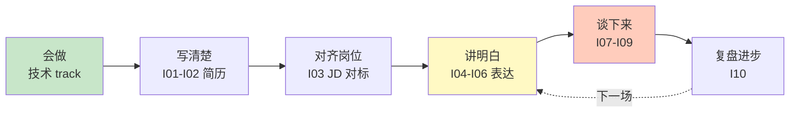

# 求职与面试软技能深度课程 · 总目录

> 面向程序员**求职全流程**的软技能专题,共 **10 篇**深度长文。
> 不是技术八股,而是**简历、JD 对标、项目深挖、行为面试、表达与谈判**——决定"会做"能不能变成"拿到 offer"的那一层。
>
> **📅 内容基准：2026 年 6 月。** AI 简历筛选(ATS/LLM)、AI 模拟面试普及、远程面试常态化、"八股→项目深挖"的考察趋势。
>
> **定位**:本专题是 OfferPilot **智能简历 / JD 对标 / AI 模拟面试**三大功能的知识底座——技术 track(Java/Go/Python/系统设计等)解决"会不会",本专题解决"**怎么讲清楚、怎么对齐岗位、怎么经得起追问**"。

---

## 📚 课程总览

| # | 课程 | 难度 | 关键词 |
|---|---|---|---|
| I01 | [精通工程师简历写作](./I01-精通-工程师简历写作.md) | ⭐⭐⭐ | 结构 / STAR / 量化 / ATS / 常见坑 |
| I02 | [精通简历项目怎么写](./I02-精通-简历项目怎么写.md) | ⭐⭐⭐⭐ | 项目描述 / 技术亮点 / 经得起追问 / 包装边界 |
| I03 | [精通 JD 对标方法](./I03-精通-JD对标方法.md) | ⭐⭐⭐⭐ | 拆解 JD / 技能匹配 / 缺口分析 / 定制简历 |
| I04 | [精通自我介绍与面试开场](./I04-精通-自我介绍与面试开场.md) | ⭐⭐⭐ | 30s/2min 版 / 结构 / 锚点 / 一面破冰 |
| I05 | [精通项目深挖应对（项目拷打）](./I05-精通-项目深挖应对.md) | ⭐⭐⭐⭐⭐ | 架构/难点/取舍/容量 / 追问应对 / 复盘 |
| I06 | [精通行为面试与 STAR](./I06-精通-行为面试与STAR.md) | ⭐⭐⭐⭐ | STAR / 协作冲突失败成长 / 领导力 / 编故事边界 |
| I07 | [精通高频 HR 问题](./I07-精通-高频HR问题.md) | ⭐⭐⭐ | 离职原因 / 职业规划 / 优缺点 / 期望薪资 |
| I08 | [精通反问环节](./I08-精通-反问环节.md) | ⭐⭐⭐ | 问什么显专业 / 反向评估 / 不同轮次 |
| I09 | [精通薪资谈判与 Offer 选择](./I09-精通-薪资谈判与Offer选择.md) | ⭐⭐⭐⭐ | 谈薪策略 / 锚定 / 多 offer 比较 / 避坑 |
| I10 | [精通面试表达与复盘方法论](./I10-精通-面试表达与复盘方法论.md) | ⭐⭐⭐⭐ | 结构化表达 / 思考出声 / 应对不会 / 面试后复盘 |

---

## 🗺️ 按模块组织

### 🟢 模块一：简历与定位（I01-I03）

> 投递前的功课——把"做过什么"翻译成"招聘方想看到什么",并对齐目标岗位。

- **I01 简历写作**：整体结构、STAR 描述法、**量化成果**、技术栈呈现、ATS(机器筛历)友好、常见致命坑
- **I02 项目怎么写**：项目描述的写法——突出技术亮点与难点、**让每一句都经得起追问**、包装的合理边界(不造假)
- **I03 JD 对标**：拆解 JD(硬技能/软技能/隐性要求)→ 匹配自己 → 找缺口 → **按岗位定制简历**(对应 OfferPilot JD 功能)

### 🔵 模块二：面试表达（I04-I06）

> 面试不是默写答案,是展示思考和沟通——这是模拟面试要练的核心。

- **I04 自我介绍**：30 秒 / 2 分钟两版、结构(现状-经历-亮点-动机)、埋"**锚点**"引导面试官往你强项问
- **I05 项目深挖应对** ⭐：面试最硬的一关——架构/难点/技术取舍/容量估算/线上问题,如何讲清并**应对层层追问**,而不露怯
- **I06 行为面试**：STAR 法则、团队协作/冲突/失败/成长/领导力类问题、**"编故事"的真实边界**

### 🟡 模块三：高频环节与收尾（I07-I10）

> 决定印象分和最终结果的"软"环节。

- **I07 高频 HR 问题**：离职原因、职业规划、优缺点、为什么选我们、期望薪资——**坦诚而不踩雷**的答法
- **I08 反问环节**："你有什么问题问我吗"——问什么**显专业、又帮你反向评估**公司;不同轮次(技术/经理/HR)问什么
- **I09 薪资谈判**：谈薪时机与策略、锚定、如何回应"期望薪资"、**多 offer 比较与决策**、常见坑
- **I10 表达与复盘方法论**：结构化表达(总分总/先结论)、"**思考出声**"、遇到不会的题怎么办、**面试后系统复盘**把每场变成进步

---

## 🎯 学习路径建议

### 路径 A：投递前急训（1 周）

```
I01 简历写作 + I02 项目怎么写（先把简历改对）
   ↓
I03 JD 对标（针对目标岗位定制）
```

### 路径 B：面试前突击（1-2 周）

```
I04 自我介绍 + I05 项目深挖（模拟面试核心，反复练）
   ↓
I06 行为面试 + I07 HR 问题 + I08 反问
   ↓
I10 表达与复盘方法论（贯穿始终）
```

### 路径 C：拿到 offer 后（按需）

```
I09 薪资谈判与 Offer 选择
```

---

## 📋 配套资源

- **Mermaid 路线图**：见 [ROADMAP.md](./ROADMAP.md)
- **综合测验**：见 [QUIZ.md](./QUIZ.md)（开放题，建议对镜/录音自答）
- **技术底座**：本专题解决"怎么讲",真功夫还看技术 track——[Java](../java/INDEX.md) / [Go](../golang/INDEX.md) / [Python](../python/INDEX.md) / [系统设计](../system-design/INDEX.md) / [算法](../algorithm/INDEX.md)
- **配合 OfferPilot**：用智能简历做 I01-I02、用 JD 对标做 I03、用 AI 模拟面试练 I04-I06

---

## 🧭 一条主线：把"会做"变成"拿 offer"



**技术是 1,软技能是后面的 0**——不会做,讲得再好也空;会做但讲不清、对不上岗、经不起追问,offer 照样飞。两者都要。

---

## ✅ 完读检查清单

读完整个系列后,应该能:

- [ ] 写出一份结构清晰、用 STAR + 量化、对 ATS 友好的工程师简历
- [ ] 让简历上每个项目都经得起"为什么这么设计/难点在哪/换个方案呢"的追问
- [ ] 拿到一份 JD 能拆出硬/软/隐性要求,评估匹配度、补缺口、定制简历
- [ ] 讲出 30 秒和 2 分钟两版自我介绍,并埋下引导提问的锚点
- [ ] 从架构、难点、取舍、容量、线上问题多个角度讲清一个项目并应对追问
- [ ] 用 STAR 讲清协作/冲突/失败/成长类行为问题,真实又有亮点
- [ ] 坦诚而不踩雷地回答离职原因、职业规划、期望薪资等 HR 问题
- [ ] 在反问环节问出既显专业又能反向评估公司的问题
- [ ] 谈薪时合理锚定、比较多个 offer 做出理性决策
- [ ] 每场面试后做结构化复盘,把弱点变成下一场的改进

---

> 🔁 反馈：发现问题或建议改进,直接 PR 改 markdown。求职因人而异,本专题给框架与范式,具体表达要结合你的真实经历。
