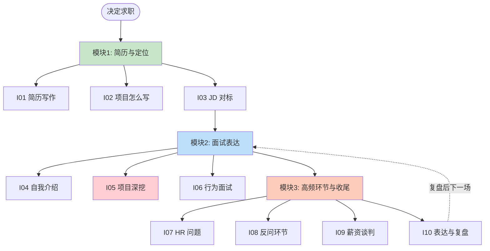
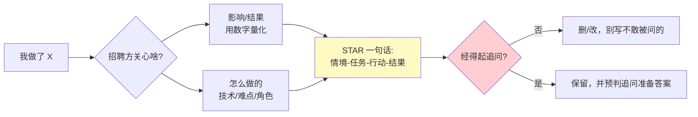
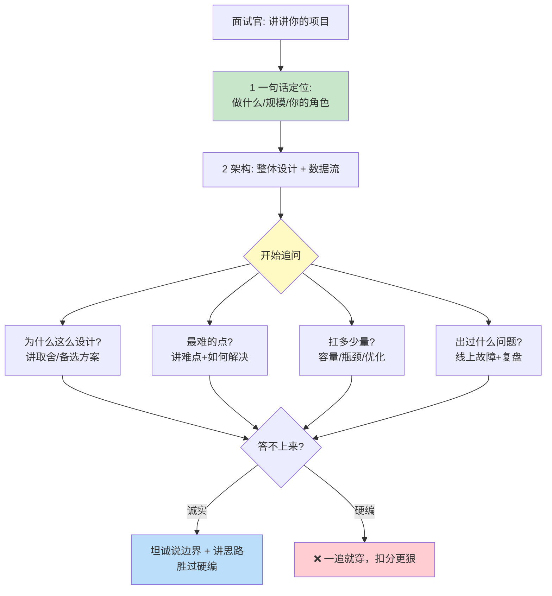
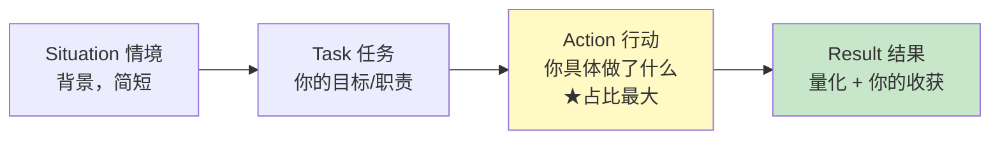
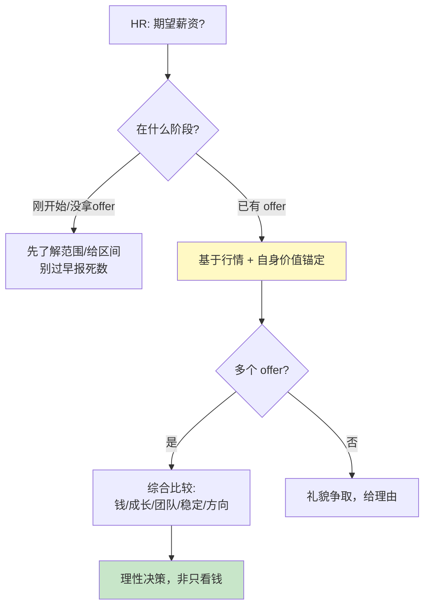
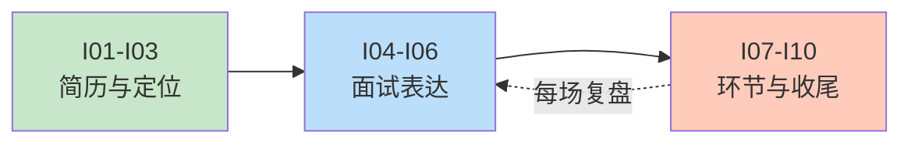

# 求职与面试软技能 路线图 · Mermaid 可视化

> 配合 [INDEX.md](./INDEX.md) 与 [QUIZ.md](./QUIZ.md) 使用
>
> **📅 内容基准：2026 年 6 月**

---

## 🗺️ 求职全流程

---

## 📄 简历的"会做→看得见"翻译（I01-I02）

---

## 🔥 项目深挖应对（I05·面试最硬一关）

---

## 🎭 STAR 法则（I06 行为面试）

> 重点在 **A(你做了什么)**——很多人花太多时间讲 S(背景),结果听不出"你"的贡献。

---

## 💰 谈薪决策（I09）

---

## 🎓 学习顺序

投递前看模块一,面试前主攻模块二 + I10,offer 阶段看 I09。
