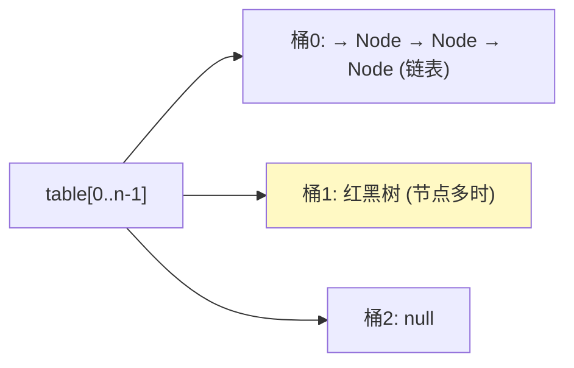
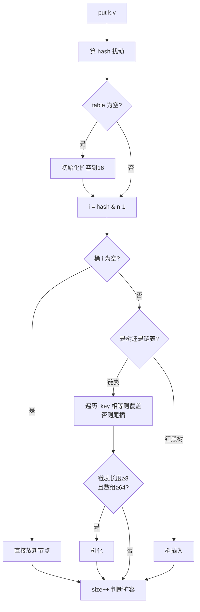

# 精通 HashMap 与 ConcurrentHashMap

> `HashMap` 是 Java 面试**出现频率最高**的源码题，没有之一。从 hash 扰动、扩容、树化，到"为什么线程不安全"，再到 `ConcurrentHashMap` 怎么保证并发安全——这一条线几乎是后端面试的标配。本篇以 **JDK 8/17/21** 为准讲透。

---

## 一、HashMap 底层结构

JDK 8 起，HashMap = **数组 + 链表 + 红黑树**：

```java
transient Node<K,V>[] table;  // 桶数组，长度总是 2 的幂
static class Node<K,V> {
    final int hash;
    final K key;
    V value;
    Node<K,V> next;           // 链表指针
}
```

- **数组（桶 table）**：每个槽位（bucket）存一条链表或一棵红黑树的头。
- **链表**：哈希冲突时，同一个桶里的元素用链表串起来。
- **红黑树**：当链表过长（≥8 且数组长度≥64）转红黑树，查询从 O(n) 降到 O(log n)。



关键参数：默认容量 16、负载因子 0.75、树化阈值 8、退化阈值 6、最小树化容量 64。

---

## 二、hash 扰动函数

定位桶 = `hash & (n-1)`（n 是数组长度）。但直接用 `hashCode()` 的低位容易冲突，所以做**扰动**：

```java
static final int hash(Object key) {
    int h;
    return (key == null) ? 0 : (h = key.hashCode()) ^ (h >>> 16);
}
```

- 把 hashCode 的**高 16 位异或到低 16 位**，让高位也参与桶定位。
- 因为 `hash & (n-1)` 当 n 较小时只用到 hash 的低几位，扰动让高位信息混入低位，**减少冲突、分布更均匀**。
- key 为 null 时 hash 为 0，固定放在桶 0——所以 **HashMap 允许一个 null key**。

---

## 三、put 流程



要点：
- key 是否"相等"：先比 `hash`，再用 `equals`。所以 **key 必须正确重写 hashCode 和 equals**。
- JDK 8 链表是**尾插**（JDK 7 是头插，并发下会成环，见第六节）。
- put 后 `++size > threshold` 触发扩容。

---

## 四、扩容机制

- **threshold（阈值）= 容量 × 负载因子**，默认 16 × 0.75 = 12，元素超 12 就扩容。
- **每次扩容容量翻倍（2 倍）**，所以容量永远是 2 的幂。

### 4.1 为什么容量是 2 的幂

因为 `hash & (n-1)`：当 n 是 2 的幂时，`n-1` 的二进制是全 1（如 16-1=0b1111），`hash & (n-1)` 等价于 `hash % n` 但**位运算更快**，且能让元素均匀分布到所有桶。如果 n 不是 2 的幂，某些桶永远分不到元素。

### 4.2 JDK 8 扩容的高低位拆分（高频考点）

扩容时要把旧桶元素重新分配到新桶。JDK 8 的巧妙之处：**不用重新计算 hash**，而是看 hash 的某一位：

```java
// 容量从 n 翻到 2n，新增的判断位是 oldCap 那一位
if ((e.hash & oldCap) == 0) {
    // 留在原位置 j
} else {
    // 移到 j + oldCap
}
```

- 元素要么留在**原索引**，要么移到**原索引 + 旧容量**，二选一。
- 因此把每个旧桶的链表拆成"低位链表"和"高位链表"两条，分别挂到新表的 j 和 j+oldCap，**无需 rehash**，效率高。
- JDK 8 拆分保持了链表内相对顺序，避免了 JDK 7 头插导致的逆序与并发成环问题。

### 4.3 负载因子 0.75

0.75 是**空间和时间的折中**：太大（如 1.0）冲突多、查询慢；太小（如 0.5）扩容频繁、浪费空间。0.75 在泊松分布下让单桶冲突概率较低（链表长度 8 的概率已极小）。

---

## 五、链表树化与退化

- **树化条件**：链表长度 ≥ **8** 且数组长度 ≥ **64**。若链表到 8 但数组 < 64，**优先扩容**而非树化（扩容能分散冲突）。
- **退化条件**：扩容或删除后，红黑树节点 ≤ **6** 退化回链表。
- 为什么阈值是 8：理想哈希下单桶达到 8 个元素的概率约为千万分之一（泊松分布），树化是兜底极端情况，正常不会触发。8 和 6 之间留缓冲（避免在临界值反复树化/退化）。

---

## 六、为什么线程不安全

HashMap **非线程安全**，并发下有两类问题：

- **JDK 7：扩容成环（死循环）**。JDK 7 用头插法，多线程同时扩容时，链表可能形成环形引用，后续 get 在环上无限循环导致 CPU 100%。
- **JDK 8：数据覆盖/丢失**。JDK 8 改尾插消除了成环，但并发 put 仍可能：两个线程同时命中空桶都判断为空、后写覆盖先写；或 `++size` 非原子导致 size 不准、丢更新。

**结论**：多线程必须用 `ConcurrentHashMap`，不能用 HashMap（也不要用 `Collections.synchronizedMap`，那是全表锁、性能差）。

---

## 七、ConcurrentHashMap（JDK 8）

JDK 8 的 ConcurrentHashMap **放弃了 JDK 7 的分段锁（Segment）**，改用 **CAS + synchronized 锁单个桶**，粒度更细、并发度更高。

```java
// put 简化逻辑
if (桶为空) {
    casTabAt(...); // CAS 无锁放入，失败重试
} else {
    synchronized (桶的头节点) { // 只锁这一个桶
        // 链表/红黑树插入
    }
}
```

- **桶为空**：用 CAS 直接放，无锁。
- **桶非空**：`synchronized` 锁住该桶的头节点，只锁一个桶，其他桶并发不受影响。
- 锁粒度从 JDK 7 的"段"（默认 16 段）细化到"每个桶"，并发度大幅提升。
- key、value **都不允许 null**（HashMap 允许 null key/value）——因为并发下 `get` 返回 null 无法区分"不存在"还是"值就是 null"。

---

## 八、ConcurrentHashMap 关键操作

- **size()**：不是简单计数。用 `baseCount` + `CounterCell[]`（类似 [LongAdder](./J13-精通-CAS与原子类.md) 的分段累加）减少并发计数的竞争，`size()` 时求和。所以 size 是**弱一致的估算**。
- **扩容协助（多线程协同扩容）**：扩容时其他线程发现正在扩容会**帮忙迁移**（`helpTransfer`），多线程并行扩容，加速。用 `ForwardingNode` 标记已迁移的桶。
- **读不加锁**：`get` 不加锁，靠 `volatile` 修饰的 `Node.val` 和 `table` 保证可见性，读性能极高。

---

## 九、HashMap 常见考点

- **key 用可变对象的坑**：如果 key 是可变对象，put 之后改了 key 的字段（影响 hashCode），就再也 get 不到了（hash 变了、定位到别的桶）。**key 应当用不可变对象**（String、Integer 等）。
- **hashCode 与 equals 必须一起重写**：只重写一个会导致放进去取不出、或重复 key。约定：equals 相等则 hashCode 必须相等。
- **遍历顺序**：HashMap 无序；`LinkedHashMap` 保持插入/访问顺序（可做 LRU）；`TreeMap` 按 key 排序。
- **容量指定**：`new HashMap<>(expectedSize)` 会取大于等于该值的最近 2 的幂作为初始容量；想容纳 n 个不扩容，建议传 `n / 0.75 + 1`。

---

## 陷阱清单

- **多线程用 HashMap**：JDK7 死循环、JDK8 数据丢失。用 ConcurrentHashMap。
- **key 用可变对象**：改了影响 hashCode 的字段后 get 不到。用不可变对象做 key。
- **只重写 equals 不重写 hashCode**：放进 HashMap/HashSet 后取不出或重复。两者必须一起重写。
- **以为扩容是 1.5 倍**：HashMap 是 2 倍翻倍；ArrayList 才是 1.5 倍。
- **以为链表到 8 就一定树化**：还要数组长度 ≥ 64，否则先扩容。
- **ConcurrentHashMap 存 null**：key/value 都不允许 null，会 NPE。
- **依赖 ConcurrentHashMap.size() 精确值**：它是弱一致估算，并发下不保证精确。
- **复合操作非原子**：`if (!map.containsKey(k)) map.put(k,v)` 在并发下仍有竞态，要用 `putIfAbsent`/`computeIfAbsent` 原子方法。

---

## 2026 现状

- **结构稳定**：HashMap/ConcurrentHashMap 的核心实现自 JDK 8 以来基本未变，仍是面试源码题的核心。
- **computeIfAbsent / merge**：Java 8 起的原子复合方法是并发场景的正确姿势（如并发计数、缓存填充），替代"先查后写"的竞态写法。
- **不可变 Map**：`Map.of()`（Java 9+）创建不可变 Map，适合常量映射。
- **GraalVM 原生镜像**：对反射构建的 Map 无影响，但若 key 依赖运行时反射需注意元数据配置（见 [J26](./J26-精通-SpringBoot自动配置.md)）。

---

## 练习题

1. HashMap 的 put 流程是怎样的？hash 扰动函数为什么要把高位异或到低位？

<details><summary>参考答案</summary>

put 流程：①对 key 算 hash（扰动）；②若 table 为空先初始化扩容到 16；③用 `i = hash & (n-1)` 定位桶；④桶为空直接放新节点；⑤桶非空则遍历：若 key 的 hash 相等且 equals 相等就覆盖 value，否则在链表尾插（或红黑树插入）；⑥若链表长度 ≥8 且数组 ≥64 则树化；⑦`++size > threshold` 则扩容。扰动函数 `(h = key.hashCode()) ^ (h >>> 16)` 把 hashCode 高 16 位异或到低 16 位：因为定位桶用 `hash & (n-1)`，当数组容量 n 较小时只用到 hash 的低几位，若不扰动则高位信息完全没参与、低位相同的 key 会大量冲突；扰动让高位参与进来，使分布更均匀、减少哈希冲突。

</details>

2. HashMap 为什么容量必须是 2 的幂？扩容时 JDK 8 如何避免重新计算 hash？

<details><summary>参考答案</summary>

容量是 2 的幂的原因：定位桶用 `hash & (n-1)`，当 n 是 2 的幂时 `n-1` 的二进制全为 1，`hash & (n-1)` 既等价于 `hash % n`（取模）又是更快的位运算，且能让 hash 的低位均匀映射到所有桶；若 n 不是 2 的幂，`n-1` 有的位为 0，导致某些桶永远分配不到元素、分布不均、冲突增多。JDK 8 扩容避免重算 hash：容量从 n 翻倍到 2n 后，每个元素的新位置只取决于 hash 在"旧容量那一位"的值——`(e.hash & oldCap) == 0` 则留在原索引 j，否则移到 `j + oldCap`。于是把旧桶链表拆成低位链表（留原位）和高位链表（移到 j+oldCap）两条直接挂过去，无需对每个 key 重新计算 hash 和取模，效率高，还保持了相对顺序、避免了 JDK7 头插的成环问题。

</details>

3. HashMap 为什么线程不安全？JDK 7 和 JDK 8 的并发问题分别是什么？

<details><summary>参考答案</summary>

HashMap 没有任何同步措施，并发读写会出问题。**JDK 7**：扩容用头插法重组链表，多线程同时扩容时，链表可能被插成环形（A→B→A），之后 get 落到这个桶会在环上无限循环，导致 CPU 飙到 100%（经典"HashMap 死循环"事故）。**JDK 8**：改成尾插法消除了成环，但仍不安全——并发 put 时，两个线程可能同时判断同一个空桶为空、各自放入导致后者覆盖前者（数据丢失）；`++size` 不是原子操作会导致 size 不准；扩容与 put 并发也可能丢数据。所以多线程场景必须用 ConcurrentHashMap，而不是 HashMap（也不推荐全表锁的 Collections.synchronizedMap）。

</details>

4. JDK 8 的 ConcurrentHashMap 如何保证并发安全？相比 JDK 7 的分段锁有什么改进？

<details><summary>参考答案</summary>

JDK 8 用 **CAS + synchronized 锁单个桶** 的方式：put 时若目标桶为空，用 CAS 无锁地放入新节点（失败则自旋重试）；若桶非空，则用 `synchronized` 锁住该桶的**头节点**，只锁这一个桶，再做链表/红黑树插入，其他桶的操作完全不受影响。读操作（get）不加锁，靠 volatile 修饰的 table 和节点 val 保证可见性，读性能极高。相比 JDK 7 的分段锁（Segment，默认把表分成 16 段、每段一把锁，并发度最多 16）：JDK 8 把锁粒度从"段"细化到"每个桶"，并发度等于桶数量（远大于 16），竞争更少、吞吐更高；同时取消了 Segment 这层结构，内存和复杂度更优。此外 JDK 8 还支持多线程协助扩容（helpTransfer），多线程并行迁移加速扩容。注意 ConcurrentHashMap key/value 都不允许 null。

</details>

5. 链表什么时候转红黑树？为什么树化阈值是 8？

<details><summary>参考答案</summary>

树化需要**同时**满足两个条件：某个桶的链表长度 ≥ **8**，且数组（table）长度 ≥ **64**。如果链表到了 8 但数组长度 < 64，HashMap 会**优先扩容**而不是树化——因为扩容能把冲突的元素重新分散到更多桶，比树化更划算。退化：当红黑树节点数 ≤ **6** 时（扩容拆分或删除后）退回链表。阈值取 8 的原因：在哈希分布均匀（负载因子 0.75）的理想情况下，单个桶里元素个数服从泊松分布，长度达到 8 的概率约为千万分之一（0.00000006），几乎不会发生；树化只是为了兜底应对哈希严重不均（如恶意构造碰撞）的极端情况，把该桶查询从 O(n) 降到 O(log n) 防止性能退化。8 和退化阈值 6 之间留 2 的缓冲，避免在临界点反复树化/退化抖动。

</details>

6. 用一个可变对象作为 HashMap 的 key 会有什么问题？为什么 hashCode 和 equals 要一起重写？

<details><summary>参考答案</summary>

**可变 key 的问题**：HashMap 在 put 时根据 key 的 hashCode 定位桶并存储。如果之后修改了这个 key 对象中参与 hashCode 计算的字段，它的 hashCode 就变了，再用它 get 时会定位到**另一个桶**，从而找不到原来存的值（数据"丢失"），甚至 contains 也返回 false。所以 key 应使用不可变对象（String、Integer、或字段不变的对象）。**hashCode 和 equals 必须一起重写**：HashMap 判断两个 key 是否相同，先比 hashCode（定位桶 + 快速筛选），再用 equals 精确比较。Java 规范约定：若 `a.equals(b)` 为 true，则 `a.hashCode() == b.hashCode()` 必须成立。如果只重写 equals 不重写 hashCode，两个逻辑相等的对象可能 hashCode 不同、被分到不同桶，导致"放进去却取不出""出现重复 key"；如果只重写 hashCode 不重写 equals，则同桶内无法正确判定相等。所以两者必须配套重写以保证一致性。

</details>

7. 并发场景下 `if (!map.containsKey(k)) map.put(k, v)` 用在 ConcurrentHashMap 上还安全吗？应该怎么写？

<details><summary>参考答案</summary>

不安全。虽然 ConcurrentHashMap 的单个方法（containsKey、put）各自是线程安全的，但把它们组合成"先检查后执行（check-then-act）"的复合操作时，两个步骤之间没有原子性：两个线程可能同时执行 containsKey 都返回 false，然后都执行 put，导致后者覆盖前者（或都以为自己是第一个）。正确做法是用 ConcurrentHashMap 提供的**原子复合方法**：`putIfAbsent(k, v)`（不存在才放入并返回 null，存在则返回旧值、不覆盖）；若 value 需要惰性计算或较重，用 `computeIfAbsent(k, key -> compute())`（保证同一 key 的计算原子且只执行一次，常用于并发缓存填充、并发计数等）。这些方法在内部用锁/CAS 保证整个"检查 + 写入"是原子的，从而避免竞态。

</details>
