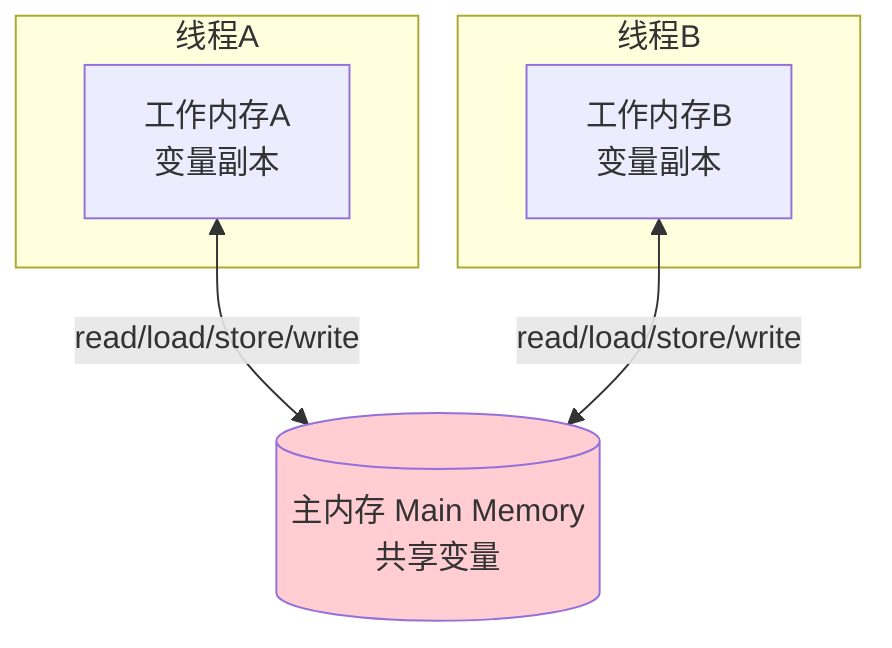

# 精通 JMM 与 happens-before

> Java 内存模型（JMM）是并发编程的**理论地基**。`volatile` 为什么能保证可见性？双重检查锁单例为什么要加 `volatile`？这些问题的答案都在 JMM 和 happens-before 里。本篇是整个并发模块（J07-J14）的总纲。
>
> **📅 基准：Java 17/21。** 对照 [Go 内存模型](../golang/G11-精通-Goroutines-与-GMP-调度.md) 思路相通但实现不同。

---

## 一、为什么需要内存模型

现代计算机为了性能，做了三件"破坏直觉"的事：

1. **多核 CPU 缓存**：每个核有自己的 L1/L2 缓存，一个线程改了变量先写进自己的缓存，别的核可能看不到 → **可见性问题**。
2. **指令重排序**：编译器和 CPU 为优化会调整指令顺序（只要不改变单线程结果）→ **有序性问题**。
3. **非原子操作**：`i++` 这种是"读-改-写"三步，并发下会交错 → **原子性问题**。

单线程下这些优化无害，但多线程下会导致难以复现的 bug。**JMM（Java Memory Model）** 就是 Java 为屏蔽底层硬件差异、定义"多线程下内存可见性和有序性规则"的规范。

---

## 二、JMM 抽象模型

JMM 规定：所有变量存在**主内存（main memory）**；每个线程有自己的**工作内存（working memory，抽象概念，对应缓存/寄存器）**。



- 线程对变量的操作都在**工作内存的副本**上进行，不直接操作主内存。
- 线程间变量传递必须经过主内存：线程 A 改的值要先写回主内存，线程 B 才能读到。
- 问题就出在"什么时候写回、什么时候重新读"——如果不加约束，B 可能一直用旧副本（可见性问题）。

JMM 定义了 8 种原子操作（read/load/use/assign/store/write/lock/unlock）来描述变量在主内存和工作内存间的流转，但面试更重要的是下面的"三大问题"和"happens-before"。

---

## 三、三大问题

JMM 要解决并发的三个核心特性：

| 特性 | 含义 | 解决手段 |
|---|---|---|
| **可见性** | 一个线程的修改，其他线程能立即看到 | volatile、synchronized、final |
| **有序性** | 程序执行顺序符合预期（防有害重排） | volatile、synchronized、happens-before |
| **原子性** | 操作不可分割，不会执行到一半被打断 | synchronized、Lock、CAS/原子类 |

经典例子——可见性问题：

```java
boolean flag = true;           // 不加 volatile
// 线程A
while (flag) { /* 空转 */ }    // 可能永远读到旧的 flag=true
// 线程B
flag = false;                  // A 可能看不到这个修改 → 死循环
```

不加 `volatile`，线程 A 可能一直用工作内存里的旧 `flag`，B 的修改对 A 不可见。加 `volatile flag` 后，A 每次读都从主内存读最新值，问题解决。

---

## 四、重排序与内存屏障

**重排序**：为了优化性能，编译器和处理器会在不改变单线程语义的前提下重排指令。

- **编译器重排**：编译期调整语句顺序。
- **CPU 重排**：处理器乱序执行、内存系统的 store buffer 等。

单线程下重排无害（遵守 **as-if-serial**：不管怎么重排，单线程结果不变）。但多线程下，重排可能让另一个线程看到"反直觉"的中间状态。

**内存屏障（Memory Barrier / Fence）** 是禁止特定重排、强制刷新缓存的 CPU 指令。JMM 通过在 volatile、synchronized 等处插入内存屏障来保证有序性和可见性。`volatile` 写后插 StoreStore/StoreLoad 屏障，读前插 LoadLoad/LoadStore 屏障。

---

## 五、happens-before 原则

**happens-before 是 JMM 的核心。** 它定义了"前一个操作的结果对后一个操作可见"的规则——如果操作 A happens-before 操作 B，那么 A 的结果对 B 可见，且 A 排在 B 前面。

八条规则（重点记前 5 条）：

1. **程序顺序规则**：单线程内，前面的操作 happens-before 后面的操作。
2. **锁规则**：对一个锁的解锁 happens-before 后续对它的加锁。
3. **volatile 规则**：对 volatile 变量的写 happens-before 后续对它的读。
4. **传递性**：A hb B、B hb C，则 A hb C。
5. **线程启动规则**：`Thread.start()` happens-before 该线程的所有操作。
6. **线程终止规则**：线程的所有操作 happens-before 其他线程检测到它终止（`join()` 返回）。
7. **中断规则**：`interrupt()` happens-before 被中断线程检测到中断。
8. **对象终结规则**：对象构造完成 happens-before `finalize()`。

**意义**：你不用关心底层重排和缓存细节，只要两个操作之间存在 happens-before 关系，JMM 就保证可见性和有序性。写并发代码就是在用这些规则建立"可见性链条"。

---

## 六、volatile 的内存语义

`volatile` 提供两个保证（**但不保证原子性**）：

1. **可见性**：volatile 写立即刷回主内存，volatile 读直接从主内存读——一个线程的修改对其他线程立即可见。
2. **禁止重排序**：通过内存屏障，禁止 volatile 变量相关的指令重排，保证有序。

**不保证原子性**：`volatile int i; i++;` 仍不安全——`i++` 是读-改-写三步，volatile 只保证每步读到最新值，不保证三步整体原子。要原子自增用 `AtomicInteger`（见 [J13 CAS](./J13-精通-CAS与原子类.md)）。

适用场景：**一写多读的状态标志**（如 `volatile boolean running`）、配合 CAS、DCL 单例（见第八节）。

---

## 七、as-if-serial 与 final 的内存语义

- **as-if-serial**：不管怎么重排，**单线程**的执行结果不能被改变。这是重排的底线，保证单线程程序员无感。
- **final 的内存语义**：正确构造的对象（this 没有在构造期逸出），其 `final` 字段在构造完成后对其他线程可见——即"看到对象引用就一定能看到其 final 字段的正确值"。这让 final 字段无需额外同步就安全发布（如不可变对象 String、见 [J03](./J03-精通-String与不可变设计.md)）。

---

## 八、常见考点：DCL 单例为什么要 volatile

双重检查锁（Double-Checked Locking）单例：

```java
public class Singleton {
    private static volatile Singleton instance; // ← 必须 volatile

    public static Singleton getInstance() {
        if (instance == null) {                 // 第一次检查（无锁，提速）
            synchronized (Singleton.class) {
                if (instance == null) {         // 第二次检查（持锁）
                    instance = new Singleton(); // ← 关键
                }
            }
        }
        return instance;
    }
}
```

**为什么 instance 必须 volatile**：`instance = new Singleton()` 不是原子的，实际三步：
1. 分配内存
2. 初始化对象
3. 把 instance 指向内存

第 2、3 步可能被**重排**成 1→3→2。若没有 volatile，线程 A 执行到"3 先于 2"——instance 已非 null 但对象还没初始化完，此时线程 B 在第一次检查 `instance != null` 直接返回了一个**半初始化的对象**，出 bug。`volatile` 禁止这个重排，保证拿到的 instance 一定是初始化完成的。这是 volatile"禁重排"语义最经典的应用。

（更简单的单例可用静态内部类或枚举，天然线程安全，无需 DCL。）

---

## 陷阱清单

- **以为 volatile 能保证原子性**：只保证可见性和有序性，`i++` 仍不安全。要原子用 Atomic 类。
- **DCL 单例不加 volatile**：可能返回半初始化对象。instance 必须 volatile。
- **用普通变量做线程间状态标志**：可见性问题，另一线程可能看不到修改、空转死循环。用 volatile。
- **以为单线程也受重排影响**：as-if-serial 保证单线程结果不变；重排只在多线程暴露问题。
- **滥用 volatile 替代锁**：volatile 不能保证复合操作原子，复合操作仍需锁/CAS。
- **以为加了同步就万事大吉，忽略可见性链条**：要靠 happens-before 建立可见性，理解规则才不会漏。

---

## 2026 现状

- **JMM 自 JSR-133（Java 5）以来稳定**，是面试并发的理论核心，长期不变。
- **VarHandle**（Java 9+）：提供比 volatile 更细粒度的内存访问语义（acquire/release/opaque/plain），是现代高性能并发的工具，逐步替代 `Unsafe`。
- **虚拟线程（Java 21）**：不改变 JMM，但海量虚拟线程下，正确的可见性/同步依然由 JMM 保证；阻塞语义变了（见 [J11](./J11-精通-线程池.md)/[J28](./J28-精通-Java版本特性演进.md)）。
- **枚举/静态内部类单例**仍是最推荐的单例写法（无需 DCL），DCL 更多作为考察 JMM 的题目存在。

---

## 练习题

1. JMM 要解决并发的哪三个核心问题？分别可以用什么手段解决？

<details><summary>参考答案</summary>

三个问题：①**可见性**——一个线程对共享变量的修改，其他线程能否及时看到（多核缓存导致可能看不到）；解决手段：volatile（读写直达主内存）、synchronized（解锁时刷回主内存、加锁时重新读）、final（构造完成后可见）。②**有序性**——程序执行顺序是否符合预期，编译器和 CPU 的重排序可能让多线程看到反直觉的中间状态；解决手段：volatile（内存屏障禁重排）、synchronized（临界区串行）、以及 happens-before 规则。③**原子性**——操作是否不可分割（如 i++ 是读-改-写三步，并发会交错）；解决手段：synchronized、显式锁（Lock）、CAS/原子类（AtomicInteger 等）。JMM 通过定义主内存/工作内存模型和 happens-before 规则，把这些底层硬件差异抽象成统一规范，让开发者用 volatile/synchronized/锁等就能写出正确的并发程序。

</details>

2. 什么是 happens-before？列举几条主要规则，并说明它的意义。

<details><summary>参考答案</summary>

happens-before 是 JMM 定义的偏序关系：若操作 A happens-before 操作 B，则 A 的执行结果对 B 可见，且在顺序上 A 排在 B 之前（注意它约束的是"可见性和顺序保证"，不一定是物理执行时间）。主要规则：①**程序顺序规则**——单线程内书写在前的操作 hb 书写在后的；②**锁规则**——对同一锁的解锁 hb 之后对它的加锁；③**volatile 规则**——对 volatile 变量的写 hb 之后对它的读；④**传递性**——A hb B 且 B hb C，则 A hb C；⑤**线程启动规则**——`thread.start()` hb 该线程内的所有操作；⑥线程终止规则——线程内操作 hb 其他线程通过 join 检测到它结束。意义：它给程序员一个无需关心底层缓存/重排细节的"可见性契约"——只要在两个操作间建立起 happens-before 关系（通过加锁、volatile、线程启动等），JMM 就保证前者结果对后者可见、顺序正确。写正确的并发代码本质就是用这些规则串起可见性链条。

</details>

3. volatile 提供哪些保证？为什么它不能保证原子性？

<details><summary>参考答案</summary>

volatile 提供两个保证：①**可见性**——对 volatile 变量的写会立即刷新回主内存，读则直接从主内存读取最新值，从而一个线程的修改对其他线程立即可见（底层靠内存屏障 + 缓存一致性）；②**有序性（禁重排）**——通过在 volatile 读写前后插入内存屏障，禁止与之相关的指令重排序，保证 volatile 写之前的操作不会重排到其后、读之后的操作不会重排到其前（这正是 DCL 单例需要它的原因）。但它**不保证原子性**：以 `i++` 为例，它是"读取 i → 加 1 → 写回 i"三个步骤的复合操作，volatile 只能保证每一次读都拿到最新值、每次写立即可见，但无法保证这三步作为一个整体不被其他线程打断——两个线程可能都读到相同的 i、各自加 1、写回，结果只加了一次。要保证自增等复合操作的原子性，必须用 synchronized、Lock 或 AtomicInteger（CAS）。所以 volatile 适合"一写多读的状态标志"，不适合"多线程累加"等复合操作。

</details>

4. 双重检查锁（DCL）单例为什么必须给 instance 加 volatile？

<details><summary>参考答案</summary>

因为 `instance = new Singleton()` 不是原子操作，底层大致分三步：①分配对象内存；②调用构造器初始化对象；③把 instance 引用指向分配的内存。由于指令重排序，步骤②和③可能被重排成①→③→②（先让 instance 指向内存，再初始化）。在没有 volatile 的情况下，多线程场景下：线程 A 执行到"③已完成但②还没完成"时，instance 已经不为 null 但对象尚未初始化完成；此时线程 B 进入 getInstance，第一次检查 `instance == null` 为 false，直接返回了这个**半初始化的对象**，B 使用它就会出现字段为默认值等错误。给 instance 加 volatile 后，其"禁止重排序"语义会禁止②③重排，保证只有当对象完全初始化后 instance 才会被赋值（且可见性保证 B 能看到完整对象），从而 DCL 才正确。这是 volatile 禁重排语义最经典的应用。补充：更简单且无需 DCL 的线程安全单例是静态内部类（利用类加载机制）或枚举单例。

</details>

5. 什么是指令重排序？as-if-serial 语义是什么？为什么单线程感觉不到重排？

<details><summary>参考答案</summary>

指令重排序是编译器和 CPU 为了优化性能（如填满流水线、隐藏内存延迟、利用乱序执行）在不改变单线程程序语义的前提下，调整指令的实际执行顺序。包括编译器重排（编译期调整语句顺序）和处理器重排（CPU 乱序执行、store buffer 等）。**as-if-serial 语义**指：无论怎样重排序，**单线程程序的执行结果都不能被改变**——编译器和处理器必须遵守这条底线，对存在数据依赖的操作不会重排（如 `a=1; b=a;` 不会颠倒）。正因为有 as-if-serial 保证，单线程程序员完全感觉不到重排的存在，结果总是符合代码书写顺序的预期。但 as-if-serial **只对单线程负责**：在多线程场景下，一个线程内被重排的操作，可能让另一个线程观察到反直觉的中间状态（如对象引用已赋值但字段未初始化），从而暴露 bug。要在多线程间禁止有害重排，需要用 volatile、synchronized 等建立 happens-before 关系。

</details>

6. 不加 volatile 的 boolean 标志位控制线程停止，为什么可能失效？

<details><summary>参考答案</summary>

经典场景：一个线程用 `while(flag){...}` 空转，另一个线程设置 `flag=false` 想让它停下。如果 flag 不是 volatile，可能失效——原因是可见性问题：循环线程会把 flag 读进自己的工作内存（缓存/寄存器）并反复使用这个副本，JMM 不保证它每次都从主内存重新读取；同时 JIT 编译器还可能把 `while(flag)` 优化成 `while(true)`（因为它看不到循环体内修改 flag、认为它不变）。于是即使另一个线程把主内存里的 flag 改成了 false，循环线程仍可能一直看到旧的 true 值，导致无法停止（死循环）。给 flag 加 volatile 后，写操作立即刷回主内存、读操作每次从主内存读最新值（并禁止 JIT 做上述激进优化），修改对循环线程立即可见，线程能正确停止。这说明跨线程的状态标志必须用 volatile（或其他同步手段）保证可见性。

</details>
