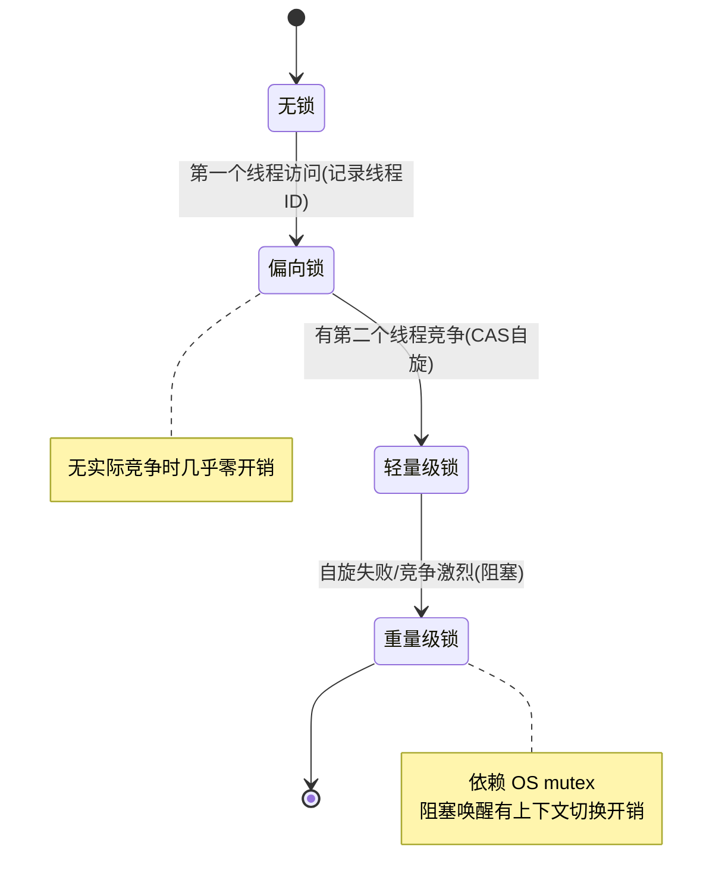

# 精通 synchronized 与 volatile

> `synchronized` 是 Java 最基础的同步手段，面试必问它的**锁升级**过程；`volatile` 在 [J07](./J07-精通-JMM与happens-before.md) 已讲内存语义，这里和 synchronized 对比收口。理解对象头、Mark Word、锁升级，是 Java 并发的硬核知识点。
>
> **📅 基准：Java 17/21。** 注意偏向锁在 JDK 15 起已默认禁用、JDK 18 起移除相关代码（JEP 374），但作为经典面试知识仍需掌握。

---

## 一、synchronized 的三种用法

```java
// ① 同步实例方法：锁的是当前实例 this
public synchronized void m1() {}

// ② 同步静态方法：锁的是类的 Class 对象
public static synchronized void m2() {}

// ③ 同步代码块：锁的是括号里指定的对象
public void m3() {
    synchronized (lock) { /* 临界区 */ }
}
```

关键：**锁的是对象**。
- 实例方法锁 `this`——同一实例的同步实例方法互斥，不同实例不互斥。
- 静态方法锁 `Class` 对象——所有实例共享，类级互斥。
- 代码块锁指定对象——粒度最细，推荐（只锁必要范围）。

**坑**：实例锁和静态锁是两把不同的锁（this vs Class），互不互斥。

---

## 二、synchronized 的实现

synchronized 基于 **monitor（监视器）**：

- **同步代码块**：编译成 `monitorenter`（进入时获取 monitor）和 `monitorexit`（退出时释放）字节码指令。
- **同步方法**：方法的 access_flags 加 `ACC_SYNCHRONIZED` 标志，JVM 进入方法时隐式获取 monitor。

每个对象都关联一个 monitor。线程进入临界区要先持有该对象的 monitor，持有期间其他线程阻塞，退出时释放。重量级 monitor 依赖操作系统的互斥量（mutex），线程阻塞/唤醒涉及用户态↔内核态切换，开销大——这正是要做锁升级优化的原因。

---

## 三、对象头与 Mark Word

Java 对象在内存中由三部分组成：**对象头、实例数据、对齐填充**（见 [J20 对象布局](./J20-精通-对象内存布局与逃逸分析.md)）。

对象头里的 **Mark Word**（64 位 JVM 是 8 字节）存储运行时数据，且**复用同一块空间存不同信息**（靠末尾的锁标志位区分）：

| 锁状态 | Mark Word 主要内容 |
|---|---|
| 无锁 | 对象 hashCode、GC 分代年龄、偏向标志 0 |
| 偏向锁 | 偏向的线程 ID、epoch、GC 年龄 |
| 轻量级锁 | 指向栈中锁记录（Lock Record）的指针 |
| 重量级锁 | 指向 monitor（重量级锁）的指针 |
| GC 标记 | 标记信息 |

锁信息就存在 Mark Word 里，锁升级本质是 Mark Word 内容和锁标志位的变化。

---

## 四、锁升级

JDK 6 起对 synchronized 做了重大优化：锁可以从低开销到高开销**单向升级**（不可逆降级），按竞争激烈程度逐步升级：



目的：**没竞争或竞争很轻时，避免重量级锁的 OS 互斥开销**。

---

## 五、三种锁详解

### 5.1 偏向锁（Biased Locking）

- **场景**：锁总是被**同一个线程**获取（无实际竞争）。
- **机制**：第一次获取时，把线程 ID 记进 Mark Word；之后该线程再进入，只需检查 Mark Word 里是不是自己的 ID，是就直接进，**连 CAS 都不用**，几乎零开销。
- **撤销**：一旦有其他线程来竞争，偏向锁被撤销，升级为轻量级锁。

### 5.2 轻量级锁（Lightweight Locking）

- **场景**：多个线程**交替**进入临界区（竞争不激烈、几乎不重叠）。
- **机制**：线程在自己栈帧里建 Lock Record，用 **CAS** 把 Mark Word 替换成指向 Lock Record 的指针。CAS 成功就拿到锁；失败说明有竞争，**自旋重试**若干次。
- **升级**：自旋一定次数仍失败（竞争激烈），升级为重量级锁。

### 5.3 重量级锁（Heavyweight Locking）

- **场景**：竞争激烈、多线程同时抢。
- **机制**：依赖 OS 的 monitor（mutex），抢不到锁的线程**阻塞挂起**（不再自旋空耗 CPU），由 OS 调度唤醒。
- **代价**：线程阻塞/唤醒涉及用户态↔内核态切换、上下文切换，开销大。

---

## 六、锁优化

JVM 还有其他锁优化（编译器/运行时层面）：

- **锁消除（Lock Elision）**：JIT 通过逃逸分析（见 [J20](./J20-精通-对象内存布局与逃逸分析.md)）发现某个锁对象不可能被其他线程访问（如局部变量），就直接消除这个锁。典型如方法内用 StringBuffer（其方法 synchronized）但对象没逸出，锁被消除。
- **锁粗化（Lock Coarsening）**：连续对同一对象反复加解锁（如循环里加锁），JVM 把锁范围扩大到整个操作，避免反复加解锁开销。
- **自旋锁与自适应自旋**：轻量级锁竞争时先自旋（忙等）而非立即阻塞，避免上下文切换；自适应自旋会根据历史自旋成功率动态调整自旋次数。

---

## 七、synchronized vs volatile vs Lock

| 维度 | volatile | synchronized | Lock (ReentrantLock) |
|---|---|---|---|
| 保证 | 可见性 + 有序性 | 原子性 + 可见性 + 有序性 | 同 synchronized |
| 原子性 | ❌ 不保证 | ✅ | ✅ |
| 阻塞 | 不阻塞 | 阻塞 | 阻塞（可中断/可超时/可尝试） |
| 锁释放 | — | 自动（出代码块/异常） | **手动 unlock**（finally） |
| 灵活性 | 低 | 中（JVM 层，自动） | 高（公平锁/可中断/Condition） |
| 实现 | 内存屏障 | monitor + 锁升级 | AQS（见 [J09](./J09-精通-AQS原理.md)） |

选择：简单互斥优先 `synchronized`（JVM 优化好、自动释放、不易出错）；需要**可中断、超时、公平、多条件、尝试加锁**等高级特性才用 `Lock`（见 [J10](./J10-精通-显式锁与锁优化.md)）；只需可见性的状态标志用 `volatile`。

---

## 八、常见考点

- **wait/notify 必须在 synchronized 块内**：`wait()`/`notify()` 要求当前线程持有该对象的 monitor，否则抛 `IllegalMonitorStateException`。`wait` 会释放锁并阻塞，`notify` 唤醒等待线程。
- **wait 用 while 不用 if**：被唤醒后要重新检查条件（防虚假唤醒）。
- **synchronized 可重入**：同一线程可重复获取同一把锁（monitor 有计数），避免自己锁死自己。
- **锁对象不要用可变/可复用对象**：别用 `String` 字面量、`Integer`（缓存）做锁，可能意外共享同一对象导致死锁或锁粒度错乱。

---

## 陷阱清单

- **实例锁和静态锁当成一把锁**：this 和 Class 是两把锁，互不互斥。
- **锁对象用 String 字面量 / Integer 缓存值**：可能多处共享同一对象，锁范围失控。用专门的 `private final Object lock = new Object()`。
- **wait/notify 不在 synchronized 内**：抛 IllegalMonitorStateException。
- **用 if 判断 wait 条件**：虚假唤醒导致条件不满足却继续执行。用 while。
- **以为偏向锁还默认开启**：JDK 15+ 已默认禁用、JDK 18 移除（见下）。
- **锁范围过大**：把不需要同步的代码也锁进去，降低并发。用同步代码块缩小范围。
- **以为 synchronized 不可重入**：它是可重入的。

---

## 2026 现状

- **偏向锁已被移除**：JEP 374（JDK 15）默认禁用偏向锁，JDK 18 起删除相关代码。原因是现代应用偏向锁收益下降、维护成本高。所以 **2026 的 synchronized 锁升级实际是"无锁 → 轻量级 → 重量级"**，但偏向锁作为经典面试知识仍要懂其原理。
- **虚拟线程（Java 21）与 synchronized**：早期虚拟线程在 synchronized 块内阻塞会"钉住（pin）"载体线程；后续版本持续优化，减少 pinning（推荐在虚拟线程中用 ReentrantLock 替代 synchronized 做长时间阻塞，见 [J11](./J11-精通-线程池.md)/[J28](./J28-精通-Java版本特性演进.md)）。
- **synchronized 性能已很好**：经多年优化，无竞争/轻竞争下 synchronized 与 Lock 性能接近，简单场景优先 synchronized。

---

## 练习题

1. synchronized 有哪三种用法？分别锁的是什么对象？实例锁和静态锁会互斥吗？

<details><summary>参考答案</summary>

三种用法：①**同步实例方法**（`synchronized` 修饰普通方法）——锁的是当前实例对象 `this`；②**同步静态方法**（`synchronized` 修饰 static 方法）——锁的是该类的 Class 对象（类级别锁）；③**同步代码块**（`synchronized(obj){}`）——锁的是括号中指定的对象，粒度最细、最灵活。互斥关系取决于"锁对象是否相同"：同一个实例上的多个同步实例方法互斥（都锁 this），不同实例之间不互斥；所有同步静态方法互斥（都锁 Class 对象）。**实例锁和静态锁不会互斥**——因为一个锁的是实例对象 this、一个锁的是 Class 对象，是两把不同的锁，一个线程持有实例锁、另一个线程可以同时持有静态锁进入静态同步方法。这是常见陷阱：以为给方法都加了 synchronized 就一定互斥，实际要看锁的是不是同一个对象。

</details>

2. 描述 synchronized 的锁升级过程，以及每种锁适用的竞争场景。

<details><summary>参考答案</summary>

JDK 6 起 synchronized 支持锁的单向升级（不可降级），按竞争激烈程度逐步升级：**无锁 → 偏向锁 → 轻量级锁 → 重量级锁**。①**偏向锁**：适用于锁总是被同一个线程获取、无实际竞争的场景；第一次获取时把线程 ID 记入对象头 Mark Word，之后同一线程再进入只需校验 ID，连 CAS 都省，几乎零开销；一旦有别的线程竞争就撤销升级。②**轻量级锁**：适用于多线程交替进入临界区、竞争不激烈（几乎不重叠）；线程在栈帧建 Lock Record，用 CAS 把 Mark Word 替换为指向它的指针，成功即获锁，失败则自旋重试。③**重量级锁**：适用于竞争激烈、多线程同时抢；自旋一定次数仍失败就升级，依赖操作系统 mutex，抢不到的线程直接阻塞挂起、由 OS 调度唤醒，避免自旋空耗 CPU，但阻塞/唤醒有用户态↔内核态切换开销。升级的目的是：在无竞争或轻竞争时避免重量级锁的 OS 互斥开销，只有真正激烈竞争才付出重量级代价。（注：偏向锁在 JDK 15+ 已默认禁用、JDK 18 移除，但原理仍是经典考点。）

</details>

3. 对象头的 Mark Word 里存了什么？它和锁升级是什么关系？

<details><summary>参考答案</summary>

Mark Word 是 Java 对象头中的一部分（64 位 JVM 通常 8 字节），用于存储对象的运行时元数据，它**复用同一块内存存放不同内容**，靠末尾的几位锁标志位来区分当前处于什么状态：无锁时存对象的 hashCode、GC 分代年龄、偏向标志；偏向锁时存偏向的线程 ID 和 epoch；轻量级锁时存指向线程栈中 Lock Record 的指针；重量级锁时存指向 monitor（重量级锁对象）的指针；GC 标记阶段存标记信息。和锁升级的关系：**锁信息就保存在 Mark Word 中，锁升级的本质就是 Mark Word 内容与锁标志位的改变**——例如从偏向锁升级到轻量级锁，就是把存线程 ID 改为存 Lock Record 指针并改锁标志位；升级到重量级锁则改为存 monitor 指针。所以理解 Mark Word 的复用机制就理解了锁状态如何被记录和切换。（补充：调用对象的 hashCode() 会占用 Mark Word，可能导致无法使用偏向锁。）

</details>

4. 什么是锁消除和锁粗化？各举一个例子。

<details><summary>参考答案</summary>

都是 JIT 编译器对锁的优化。**锁消除（Lock Elision）**：编译器通过逃逸分析判断某个加锁对象不可能被多个线程共享（没有逃逸出当前线程/方法），就把这个锁直接去掉，因为根本不存在竞争。例子：一个方法内部 `new StringBuffer()` 做字符串拼接，StringBuffer 的 append 是 synchronized 的，但这个 StringBuffer 是局部变量、没有逸出方法，不可能被其他线程访问，JIT 就消除这些 append 的锁，避免无谓的加锁开销。**锁粗化（Lock Coarsening）**：如果代码对同一个对象连续、频繁地加锁解锁（尤其在循环中），JVM 会把锁的范围扩大、合并成一次加锁，避免反复加解锁的开销。例子：在一个循环里每次迭代都对同一对象 synchronized 加锁再解锁，JVM 会把锁提到循环外、整个循环只加一次锁。两者都是在保证正确性的前提下减少锁开销，体现 JVM 对 synchronized 的智能优化（这也是简单场景优先用 synchronized 的底气）。

</details>

5. synchronized、volatile、ReentrantLock 三者如何选择？

<details><summary>参考答案</summary>

按需求选：**volatile** 只保证可见性和有序性、不保证原子性、不阻塞——适合"一写多读的状态标志"（如 boolean running、DCL 单例的 instance）等不需要互斥、只需可见性的场景，开销最小。**synchronized** 保证原子性+可见性+有序性，是 JVM 内置的互斥锁，自动获取/释放（出代码块或异常时自动解锁，不易出错），经过锁升级等优化后无竞争/轻竞争下性能很好——适合大多数简单互斥场景，应作为首选。**ReentrantLock**（基于 AQS）功能更强：支持可中断加锁（lockInterruptibly）、超时尝试（tryLock(timeout)）、非阻塞尝试（tryLock）、公平锁、多个条件变量（Condition），但必须手动在 finally 中 unlock（忘记会死锁）——只有当确实需要这些高级特性时才用。总结：只要可见性用 volatile；普通互斥优先 synchronized；需要可中断/超时/公平/多条件等高级控制才用 ReentrantLock。

</details>

6. 为什么 wait()/notify() 必须在 synchronized 块中调用？wait 条件判断为什么用 while 而不是 if？

<details><summary>参考答案</summary>

**必须在 synchronized 内**：wait/notify/notifyAll 是定义在 Object 上、与对象的 monitor 紧密绑定的方法——调用它们要求当前线程**已经持有该对象的 monitor（锁）**，否则抛 `IllegalMonitorStateException`。原因是 wait 的语义是"释放锁并进入该对象的等待集、阻塞"，notify 是"从等待集唤醒一个线程"，这些操作都需要在持有锁的前提下对 monitor 的等待队列进行操作，才能保证状态变更的原子性和正确的可见性（避免错过通知的竞态）。**用 while 而不是 if**：因为存在"虚假唤醒（spurious wakeup）"——线程可能在没有被 notify 的情况下被唤醒；而且即使被正常 notify 唤醒，等线程重新拿到锁时，条件可能又被其他线程改变而不再满足。如果用 `if` 只判断一次，唤醒后会直接往下执行、在条件不满足时出错；用 `while` 则每次被唤醒后都重新检查条件，不满足就继续 wait，保证只有条件真正满足才继续，这是 wait/notify 的标准范式（`while(条件不满足){ obj.wait(); }`）。

</details>
