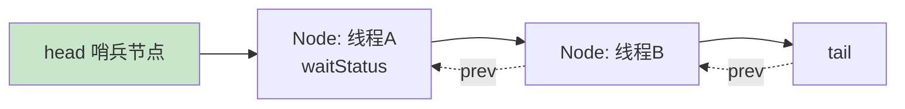
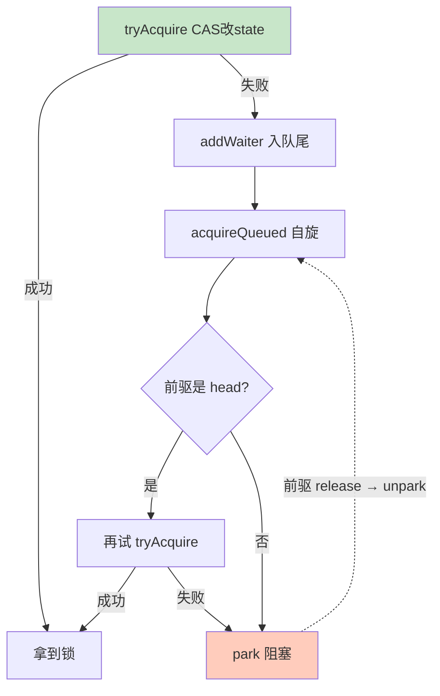

# 精通 AQS 原理

> AQS（AbstractQueuedSynchronizer，抽象队列同步器）是 `java.util.concurrent` 包的**基石**——`ReentrantLock`、`CountDownLatch`、`Semaphore`、`ReentrantReadWriteLock`、线程池的 Worker 全部基于它。理解了 AQS，整个并发包的锁与同步工具就融会贯通了。本篇讲透它的 state + 队列设计。
>
> **📅 基准：Java 17/21。**

---

## 一、AQS 是什么

AQS 是一个**抽象框架**，用来构建"锁和同步器"。它把同步器的两个共性抽出来：

1. **同步状态**：用一个 `volatile int state` 表示（如锁的重入次数、信号量的许可数、闭锁的计数）。
2. **等待队列**：抢不到资源的线程，放进一个 FIFO 队列排队、阻塞，资源释放时唤醒。

AQS 用**模板方法模式**：它实现了"排队、阻塞、唤醒"这些通用逻辑，把"如何判断能不能拿到资源"留给子类实现（`tryAcquire`/`tryRelease`）。各种同步器只是对 state 的不同解读。

---

## 二、核心：state + CLH 队列

### 2.1 同步状态 state

```java
private volatile int state;            // 同步状态
protected final int getState() {...}
protected final void setState(int s) {...}
protected final boolean compareAndSetState(int expect, int update) {...} // CAS
```

- `state` 是 `volatile`（保证可见性，见 [J07 JMM](./J07-精通-JMM与happens-before.md)），用 CAS 修改（保证原子，见 [J13 CAS](./J13-精通-CAS与原子类.md)）。
- 不同同步器对 state 含义不同：ReentrantLock 的 state 是重入次数（0 未锁，>0 已锁）；Semaphore 是剩余许可；CountDownLatch 是剩余计数；读写锁用高低 16 位分别表示读锁和写锁。

### 2.2 CLH 变体队列

抢不到资源的线程被封装成 `Node`，加入一个 **FIFO 双向队列**（CLH 队列的变体）：



- 队列头是哨兵节点，真正等待的线程从第二个开始。
- 每个 Node 有 `waitStatus`（状态：SIGNAL 表示后继需被唤醒、CANCELLED 已取消等）。
- 线程用 `LockSupport.park()` 阻塞，前驱释放锁时 `unpark` 唤醒后继。

---

## 三、独占模式

独占（Exclusive）：同一时刻只有一个线程能拿到资源（如 ReentrantLock）。

```java
// 获取（acquire 模板）
public final void acquire(int arg) {
    if (!tryAcquire(arg) &&                          // ① 子类实现：尝试拿
        acquireQueued(addWaiter(Node.EXCLUSIVE), arg)) // ② 拿不到则入队阻塞
        selfInterrupt();
}
```

流程（acquire）：
1. `tryAcquire`（子类实现）尝试用 CAS 改 state 拿锁，成功就返回。
2. 失败则 `addWaiter` 把当前线程包装成 Node 加入队尾。
3. `acquireQueued`：在队列中自旋——如果自己的前驱是 head（轮到自己了）就再试一次 tryAcquire；否则 `park` 阻塞，等前驱唤醒。

```java
// 释放（release 模板）
public final boolean release(int arg) {
    if (tryRelease(arg)) {        // 子类实现：改 state 释放
        unparkSuccessor(head);    // 唤醒队列里的后继线程
        return true;
    }
    return false;
}
```



---

## 四、共享模式

共享（Shared）：多个线程可同时拿到资源（如 Semaphore 的多个许可、CountDownLatch 的等待、读写锁的读锁）。

- `acquireShared`：`tryAcquireShared` 返回剩余资源数，≥0 表示成功，可继续唤醒后继共享节点（**传播唤醒**——一个共享节点拿到后会接力唤醒后面的共享节点）。
- `releaseShared`：释放资源并唤醒等待的共享线程。

独占和共享的区别就在于"一个节点拿到资源后，要不要继续唤醒后面的节点"——共享模式会传播唤醒，让多个线程一起获得资源。

---

## 五、AQS 模板方法模式

AQS 实现了 acquire/release/acquireShared 等**通用骨架**（排队、阻塞、唤醒、取消），子类只需实现这几个"钩子"：

```java
protected boolean tryAcquire(int arg)        // 独占获取
protected boolean tryRelease(int arg)        // 独占释放
protected int tryAcquireShared(int arg)      // 共享获取
protected boolean tryReleaseShared(int arg)  // 共享释放
protected boolean isHeldExclusively()        // 是否当前线程独占
```

子类通过对 `state` 的不同定义和 CAS 操作，实现不同的同步语义。这是模板方法模式的经典应用——**复杂的队列管理在父类，可变的资源判定在子类**。

---

## 六、基于 AQS 的同步器

| 同步器 | state 含义 | 模式 |
|---|---|---|
| ReentrantLock | 重入次数（0/n） | 独占 |
| Semaphore | 剩余许可数 | 共享 |
| CountDownLatch | 剩余计数 | 共享（countDown 减、await 等到 0） |
| ReentrantReadWriteLock | 高 16 位读锁、低 16 位写锁 | 读共享 + 写独占 |
| ThreadPoolExecutor.Worker | 是否正在执行任务 | 独占（不可重入，防中断正在跑的任务） |

理解这张表，就理解了并发包大半工具的本质：**它们都是 AQS + 对 state 的不同解读**。详细用法见 [J10 显式锁](./J10-精通-显式锁与锁优化.md)、[J11 线程池](./J11-精通-线程池.md)。

---

## 七、Condition

`Condition` 是 AQS 提供的**条件变量**，替代 `Object.wait/notify`，支持**多个等待队列**：

```java
ReentrantLock lock = new ReentrantLock();
Condition notEmpty = lock.newCondition();
Condition notFull = lock.newCondition();   // 可以有多个条件，分别等待

// 生产者
lock.lock();
try {
    while (queue.isFull()) notFull.await();  // 释放锁并等待"非满"
    queue.add(x);
    notEmpty.signal();                        // 唤醒等"非空"的消费者
} finally { lock.unlock(); }
```

| 对比 | Object wait/notify | Condition |
|---|---|---|
| 依赖 | synchronized | Lock（AQS） |
| 等待队列数 | 一个（一个 monitor 一个等待集） | 多个（一个 Lock 可建多个 Condition） |
| 精确唤醒 | notify 随机唤醒一个 | 可针对特定条件 signal，更精确 |

- 每个 Condition 内部维护一个**条件队列**；`await` 把线程放入条件队列并释放锁，`signal` 把它从条件队列转移回 AQS 的同步队列去竞争锁。
- 多 Condition 的价值：如阻塞队列分"非空"和"非满"两个条件，生产者唤醒消费者、消费者唤醒生产者，比单一 monitor 的 notifyAll 精确高效。

---

## 八、公平 vs 非公平

- **非公平锁（默认）**：新来的线程直接尝试 CAS 抢锁（插队），抢到就不排队。吞吐高（减少线程切换），但可能造成队列里的线程"饥饿"。
- **公平锁**：tryAcquire 时先检查队列里有没有人在等（`hasQueuedPredecessors`），有就乖乖排队，严格 FIFO。公平但吞吐略低（更多上下文切换）。

ReentrantLock 默认非公平（`new ReentrantLock()` = 非公平，`new ReentrantLock(true)` = 公平）。多数场景非公平更好（性能优先）。

---

## 陷阱清单

- **以为 AQS 只服务 ReentrantLock**：它是整个并发包的基石（Semaphore/CountDownLatch/读写锁/线程池都用）。
- **state 不用 CAS 改**：必须用 `compareAndSetState` 保证原子，直接 setState 仅在独占确定时用。
- **Condition.await 用 if 判断**：和 wait 一样要用 while 防虚假唤醒。
- **await/signal 不在 lock 内**：必须先 lock 持有锁，否则 IllegalMonitorStateException。
- **混淆公平与非公平**：默认非公平（性能优先），需要严格顺序才用公平。
- **共享模式当独占理解**：共享会传播唤醒，多个线程可同时获得。

---

## 2026 现状

- **AQS 设计稳定**：Doug Lea 的 AQS 自 Java 5 以来是并发包核心，是高级面试的必考深水区。
- **VarHandle 替代 Unsafe**：AQS 内部对 state、队列指针的 CAS 操作，新版本用 `VarHandle`（Java 9+）替代 `sun.misc.Unsafe`，语义更清晰。
- **虚拟线程下的同步**：虚拟线程（Java 21）阻塞在基于 AQS 的锁（如 ReentrantLock）上时能正确让出载体线程，比 synchronized 的 pinning 问题更友好——所以虚拟线程场景推荐用 ReentrantLock（见 [J11](./J11-精通-线程池.md)）。
- **新同步工具**：`StampedLock`（乐观读，Java 8）等更现代的同步器，部分不直接基于 AQS 但思想相通。

---

## 练习题

1. AQS 的两个核心组成是什么？它用什么设计模式让子类扩展？

<details><summary>参考答案</summary>

两个核心：①**同步状态 state**——一个 `volatile int`（用 CAS 修改），表示同步器的资源状态，不同同步器对它有不同解读（ReentrantLock 是重入次数、Semaphore 是剩余许可、CountDownLatch 是剩余计数、读写锁用高低 16 位分表示读写锁）；②**FIFO 等待队列**（CLH 变体的双向队列）——抢不到资源的线程被包装成 Node 入队、用 LockSupport.park 阻塞，资源释放时唤醒后继。AQS 用**模板方法模式**：父类 AQS 实现了"入队、阻塞、唤醒、取消、传播"等复杂通用逻辑（acquire/release/acquireShared 等骨架），把"是否能获取/释放资源"这一可变判定留给子类实现的钩子方法（tryAcquire、tryRelease、tryAcquireShared、tryReleaseShared）。子类只需根据自己对 state 的定义实现这几个方法，就能得到一个功能完整的同步器。这就是为什么各种锁/同步工具能复用同一套队列管理逻辑。

</details>

2. 描述 ReentrantLock（独占模式）通过 AQS 加锁的流程。

<details><summary>参考答案</summary>

调用 lock() → AQS 的 acquire(1)：①先调子类的 `tryAcquire`——用 CAS 尝试把 state 从 0 改成 1（若是重入即当前线程已持有，则 state 直接 +1），成功就拿到锁返回；②失败则 `addWaiter` 把当前线程包装成独占 Node 加入队列尾部（CAS 入队）；③进入 `acquireQueued` 自旋：检查自己的前驱节点是否是 head（即是否轮到自己），若是则再次尝试 tryAcquire，成功就把自己设为 head 并返回；若前驱不是 head 或再次 tryAcquire 失败，则把前驱的 waitStatus 设为 SIGNAL 后调用 `LockSupport.park()` 阻塞自己，让出 CPU。当持锁线程 unlock 时调用 release → tryRelease 把 state 减到 0 → `unparkSuccessor` 唤醒队列中的后继线程，被唤醒的线程从 park 处继续、重新竞争锁。整个过程：CAS 快速路径 + 失败入队阻塞 + 释放时唤醒后继，既高效又有序。

</details>

3. AQS 的独占模式和共享模式有什么区别？分别对应哪些同步器？

<details><summary>参考答案</summary>

区别核心在于"一个节点获取到资源后是否继续唤醒后面的节点"。**独占模式**：同一时刻只有一个线程能持有资源，一个线程获取后其他线程必须等待，释放时只唤醒队列中的一个后继。对应 ReentrantLock（独占锁）、ReentrantReadWriteLock 的写锁、线程池的 Worker。**共享模式**：多个线程可以同时获取资源，一个节点获取成功后会"传播唤醒"——继续唤醒后面的共享节点，让多个等待线程一起获得资源（直到资源不足）。对应 Semaphore（多个许可可被多个线程同时持有）、CountDownLatch（计数到 0 时所有 await 的线程一起被唤醒放行）、ReentrantReadWriteLock 的读锁（多个读线程可同时持有）。实现上独占用 tryAcquire/tryRelease，共享用 tryAcquireShared/tryReleaseShared（返回值表示剩余资源、是否需要继续传播唤醒）。

</details>

4. Condition 和 Object 的 wait/notify 有什么区别？多个 Condition 有什么好处？

<details><summary>参考答案</summary>

区别：①**依赖不同**——wait/notify 依赖 synchronized 和对象 monitor；Condition 依赖 Lock（基于 AQS），通过 `lock.newCondition()` 创建。②**等待队列数量**——一个对象的 monitor 只有一个等待集（所有 wait 的线程都在里面），notify 只能随机唤醒其中一个、notifyAll 唤醒全部；而一个 Lock 可以创建**多个 Condition**，每个 Condition 有独立的条件队列。③**唤醒精确度**——多 Condition 可以做到"精确唤醒"。好处举例：实现一个有界阻塞队列时，可建两个 Condition——notFull 和 notEmpty。生产者在队列满时 `notFull.await()`，放入元素后 `notEmpty.signal()` 精确唤醒消费者；消费者在队列空时 `notEmpty.await()`，取出后 `notFull.signal()` 精确唤醒生产者。相比只有一个 monitor 时只能用 notifyAll 把生产者消费者全唤醒（再各自判断条件、大量无效唤醒），多 Condition 让"等不同条件的线程"分开等待、按需精确唤醒，效率更高、语义更清晰。注意 await 也要在 while 循环里判断条件以防虚假唤醒，且要在 lock 持有期间调用。

</details>

5. 公平锁和非公平锁有什么区别？为什么默认非公平？

<details><summary>参考答案</summary>

区别在于"新来的线程是否允许插队"。**公平锁**：线程获取锁时严格按照请求顺序（FIFO）——tryAcquire 前先检查同步队列里是否已有等待的前驱节点（hasQueuedPredecessors），如果有就不插队、乖乖入队排队，保证先到先得，不会饥饿。**非公平锁**：新来的线程直接尝试 CAS 抢锁，不管队列里有没有人在等——如果恰好此刻锁空闲就抢到了（插队成功），抢不到才入队。ReentrantLock 默认非公平（`new ReentrantLock()`），`new ReentrantLock(true)` 才是公平。默认非公平的原因是**性能**：非公平允许刚释放锁的线程或新到的线程立即拿锁，减少了线程阻塞/唤醒和上下文切换（被唤醒的队列线程从 park 恢复需要时间，期间锁可被新线程直接用上，吞吐更高）；公平锁严格排队会带来更多线程切换、吞吐较低。代价是非公平可能让队列中的线程等待较久（理论上有饥饿风险，但实践中通常可接受）。所以除非业务确实要求严格顺序，一般用默认的非公平锁。

</details>

6. 为什么说"理解了 AQS 就理解了并发包大半工具"？请举例说明它们如何复用 AQS。

<details><summary>参考答案</summary>

因为 java.util.concurrent 中大量锁与同步工具都是基于 AQS 实现的，它们的差异仅仅是"对 state 的不同解读"和实现不同的 tryAcquire/tryRelease 钩子，而排队、阻塞、唤醒等核心机制完全复用 AQS。举例：①**ReentrantLock**——state 表示重入次数（0 空闲、n 重入 n 次），独占模式，tryAcquire 用 CAS 把 0 改 1（同线程重入则 +1）；②**Semaphore**——state 表示剩余许可数，共享模式，acquire 时 state 减、为负则排队，release 时 state 加并传播唤醒；③**CountDownLatch**——state 表示剩余计数，await 时若 state≠0 则共享阻塞，countDown 让 state 减 1、减到 0 时唤醒所有等待线程；④**ReentrantReadWriteLock**——把一个 int 的 state 拆成高 16 位（读锁计数，共享）和低 16 位（写锁计数，独占）；⑤**线程池的 Worker**——用 AQS 实现一个不可重入的独占锁，标记线程是否正在执行任务（用于判断能否中断）。可见，它们都没有重复造"队列 + 阻塞 + 唤醒"的轮子，而是继承 AQS、只定义自己对资源（state）的获取释放规则，所以掌握 AQS 就掌握了这些工具的共同本质。

</details>
