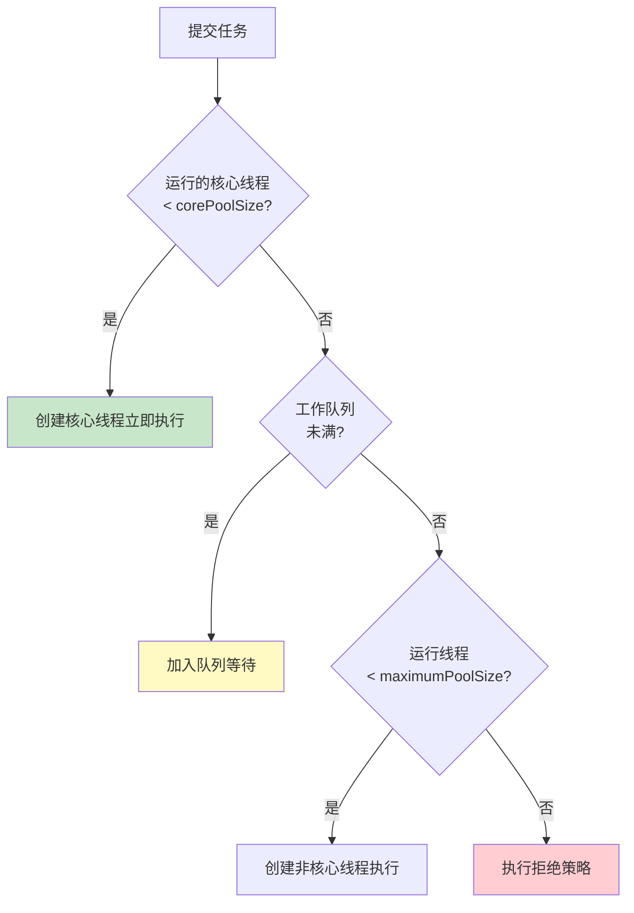

# 精通线程池 ThreadPoolExecutor

> 线程池是 Java 后端最高频的并发考点之一——七大参数、执行流程、拒绝策略、为什么不能用 `Executors` 快捷方法，几乎每场面试都问。本篇把 `ThreadPoolExecutor` 讲透，并给出参数调优方法论。
>
> **📅 基准：Java 17/21。** 注意 Java 21 虚拟线程对"线程池"思路的冲击（见 2026 现状）。

---

## 一、为什么用线程池

直接 `new Thread()` 的问题：
- **创建/销毁线程开销大**（涉及系统调用、栈内存分配）。
- **无限制创建会耗尽资源**（线程过多导致 OOM 或大量上下文切换）。
- **难以管理**（无法统一控制并发数、监控、复用）。

线程池解决：**复用**已创建的线程、**控制**并发数量、**管理**生命周期和监控。核心实现是 `ThreadPoolExecutor`。

---

## 二、七大核心参数

```java
public ThreadPoolExecutor(
    int corePoolSize,                  // ① 核心线程数
    int maximumPoolSize,               // ② 最大线程数
    long keepAliveTime,                // ③ 非核心线程空闲存活时间
    TimeUnit unit,                     // ④ 时间单位
    BlockingQueue<Runnable> workQueue, // ⑤ 工作队列
    ThreadFactory threadFactory,       // ⑥ 线程工厂
    RejectedExecutionHandler handler)  // ⑦ 拒绝策略
```

| 参数 | 含义 |
|---|---|
| corePoolSize | 核心线程数，常驻（默认不回收，除非设 allowCoreThreadTimeOut） |
| maximumPoolSize | 最大线程数 = 核心 + 非核心 |
| keepAliveTime | 非核心线程空闲多久被回收 |
| workQueue | 任务排队的阻塞队列 |
| threadFactory | 创建线程（建议自定义，给线程命名便于排查） |
| handler | 队列满 + 线程满时的拒绝策略 |

---

## 三、执行流程

提交任务时（execute）的处理顺序（**高频考点**）：



记住顺序：**核心线程 → 队列 → 非核心线程 → 拒绝**。

注意一个反直觉点：**队列没满之前，不会创建非核心线程**。所以如果用无界队列（`LinkedBlockingQueue` 不设容量），队列永远不满，`maximumPoolSize` 形同虚设、非核心线程永远不会创建——这是常见坑。

---

## 四、四种拒绝策略

队列满且线程数达到 maximum 时，触发 `RejectedExecutionHandler`：

| 策略 | 行为 |
|---|---|
| **AbortPolicy**（默认） | 抛 `RejectedExecutionException`，让调用方感知 |
| **CallerRunsPolicy** | 由**提交任务的线程**自己执行该任务（变相降速、反压） |
| **DiscardPolicy** | 静默丢弃新任务（不抛异常，危险——任务悄悄没了） |
| **DiscardOldestPolicy** | 丢弃队列最老的任务，再尝试提交新的 |

- 默认 AbortPolicy——快速失败，调用方能感知到过载。
- `CallerRunsPolicy` 常用于"宁可慢、不丢任务"的场景，提交线程被占用会自然减缓提交速度（反压）。
- Discard 系列会丢任务，要谨慎（适合可丢弃的任务，如日志采样）。
- 生产中常**自定义拒绝策略**（落库/告警/降级），避免任务无声丢失。

---

## 五、工作队列选择

| 队列 | 特点 | 适用 |
|---|---|---|
| ArrayBlockingQueue | 有界数组队列 | 控制资源、防 OOM（推荐） |
| LinkedBlockingQueue | 链表队列，**默认无界**（不传容量=Integer.MAX） | 谨慎——无界会撑爆内存 |
| SynchronousQueue | 不存储元素，直接交给线程 | newCachedThreadPool 用，配合大 maximum |
| PriorityBlockingQueue | 优先级排序 | 任务有优先级 |
| DelayQueue | 延迟队列 | 定时任务（见 [S14 延迟队列](../system-design/S14-精通-设计延迟队列与定时任务.md)） |

**建议用有界队列**（ArrayBlockingQueue 或有容量的 LinkedBlockingQueue）：无界队列会让任务无限堆积，最终内存溢出，且让 maximumPoolSize 失效。

---

## 六、Executors 的坑

`Executors` 工厂方法看着方便，但**阿里 Java 开发规约明确禁用**，要求手动 new ThreadPoolExecutor：

| Executors 方法 | 隐患 |
|---|---|
| `newFixedThreadPool` / `newSingleThreadExecutor` | 用**无界 LinkedBlockingQueue**，任务无限堆积 → OOM |
| `newCachedThreadPool` | maximumPoolSize = Integer.MAX，无限创建线程 → OOM |
| `newScheduledThreadPool` | 同样无界队列问题 |

根因都是**默认参数不可控**（无界队列或无限线程）。所以应**手动构造 ThreadPoolExecutor，显式指定有界队列、合理的最大线程数、自定义拒绝策略和线程工厂**，把风险握在自己手里。

---

## 七、线程池参数调优

没有万能公式，但有方法论，关键看任务是 **CPU 密集**还是 **IO 密集**：

| 任务类型 | 特点 | corePoolSize 建议 |
|---|---|---|
| CPU 密集 | 大量计算、少阻塞 | ≈ CPU 核数 + 1（多了只增加上下文切换） |
| IO 密集 | 大量等待（网络/磁盘/DB） | 远大于核数，如 核数 × (1 + 平均等待时间/计算时间) |

- **CPU 密集**：线程数约等于核数，太多线程反而因切换降低吞吐。
- **IO 密集**：线程多等待时阻塞、不占 CPU，可以开更多线程提高 CPU 利用率（如核数的几倍）。
- 实践中靠**压测 + 监控**（队列长度、活跃线程、RT）迭代调参，而非死套公式。
- 不同业务用**独立线程池隔离**（如核心交易和日志用不同池），避免相互拖累（类似 bulkhead 舱壁，见 [B20 韧性](../backend/B20-精通韧性模式.md)）。

---

## 八、线程池状态与生命周期

线程池有 5 个状态（用一个 AtomicInteger 高 3 位存状态、低 29 位存线程数）：

```
RUNNING → SHUTDOWN → TIDYING → TERMINATED
   ↓         ↑
   └──→ STOP ┘
```

| 状态 | 含义 |
|---|---|
| RUNNING | 正常接收新任务、处理队列任务 |
| SHUTDOWN | 不接新任务，但处理完队列里的存量任务 |
| STOP | 不接新任务，且中断正在执行的任务、丢弃队列任务 |
| TIDYING | 所有任务结束、线程清零，准备收尾 |
| TERMINATED | 收尾完成（terminated() 钩子执行完） |

- `shutdown()`：温和关闭——进入 SHUTDOWN，不收新任务，把队列里的做完。
- `shutdownNow()`：强制关闭——进入 STOP，尝试中断正在执行的任务，返回队列中未执行的任务列表。

优雅停机：先 `shutdown()`，再 `awaitTermination(timeout)` 等存量任务完成，超时则 `shutdownNow()`。

---

## 陷阱清单

- **用 Executors 快捷方法**：无界队列/无限线程 → OOM。手动 new ThreadPoolExecutor。
- **用无界队列**：任务无限堆积撑爆内存，且 maximumPoolSize 失效（队列不满不会建非核心线程）。
- **默认拒绝策略丢任务无感**：DiscardPolicy 静默丢弃。生产用自定义策略（落库/告警）。
- **不给线程命名**：出问题 jstack 看不出是哪个池的线程。自定义 ThreadFactory 命名。
- **CPU 密集开几百线程**：上下文切换反而降吞吐。CPU 密集 ≈ 核数。
- **所有业务共用一个池**：一个慢任务拖垮全部。按业务隔离线程池。
- **不优雅关闭**：直接退出导致任务丢失。shutdown + awaitTermination。
- **线程池里抛异常被吞**：execute 提交的任务异常会导致线程终止且不易察觉；submit 的异常封装在 Future 里，需 get 才暴露。要包裹 try-catch 或自定义 afterExecute。

---

## 2026 现状

- **虚拟线程颠覆"线程池"思路**：Java 21 虚拟线程（[J28](./J28-精通-Java版本特性演进.md)）极轻量，"一任务一线程"重新可行。**IO 密集场景不再需要用线程池限制线程数**，可直接 `Executors.newVirtualThreadPerTaskExecutor()` 为每个任务开一个虚拟线程。但**CPU 密集**任务仍用传统平台线程池（虚拟线程不增加 CPU 并行度）。
- **虚拟线程下少用 synchronized**：长时间阻塞用 ReentrantLock 避免 pin 载体线程（见 [J08](./J08-精通-synchronized与volatile.md)/[J10](./J10-精通-显式锁与锁优化.md)）。
- **结构化并发**（Java 21+ 演进）：`StructuredTaskScope` 让一组并发子任务的生命周期、异常、取消统一管理，比裸用线程池更安全。
- **监控标配**：Micrometer 暴露线程池指标（活跃数、队列长度、拒绝数）到 Prometheus/Grafana，调参靠数据。

---

## 练习题

1. ThreadPoolExecutor 的七大参数分别是什么？提交一个任务时的执行流程是怎样的？

<details><summary>参考答案</summary>

七大参数：①corePoolSize 核心线程数（常驻）；②maximumPoolSize 最大线程数；③keepAliveTime 非核心线程空闲存活时间；④unit 时间单位；⑤workQueue 工作队列（阻塞队列）；⑥threadFactory 线程工厂（创建线程，建议自定义命名）；⑦handler 拒绝策略。执行流程（提交任务时）：①若当前运行的核心线程数 < corePoolSize，直接创建一个新核心线程执行该任务；②否则尝试把任务放入工作队列排队；③若队列已满，且当前线程数 < maximumPoolSize，则创建非核心线程执行该任务；④若队列已满且线程数已达 maximumPoolSize，则执行拒绝策略。顺序记忆："核心线程 → 队列 → 非核心线程 → 拒绝"。一个关键点：只有队列满了才会创建非核心线程，所以如果用无界队列，队列永不满、非核心线程永远不会被创建、maximumPoolSize 失效。

</details>

2. 四种拒绝策略分别是什么？生产环境通常怎么处理被拒绝的任务？

<details><summary>参考答案</summary>

四种内置拒绝策略：①**AbortPolicy**（默认）——直接抛出 RejectedExecutionException，让调用方感知到过载并自行处理；②**CallerRunsPolicy**——由提交任务的线程自己来执行这个任务，相当于让提交方"亲自干活"从而减缓提交速度（一种反压机制），保证任务不丢但会拖慢调用方；③**DiscardPolicy**——静默丢弃被拒绝的新任务，不抛异常（危险，任务悄无声息地没了）；④**DiscardOldestPolicy**——丢弃队列中最老（最早入队）的任务，然后再尝试提交当前任务。生产环境通常**自定义拒绝策略**：在策略中把被拒任务持久化（落库/写消息队列待后续重试）、记录日志和监控告警、或做降级处理，避免任务无声丢失；对于必须不丢的关键任务也可用 CallerRunsPolicy 反压。默认的 AbortPolicy 适合需要快速失败、由上层感知并处理的场景。关键是不要用会静默丢任务的 DiscardPolicy 处理重要任务。

</details>

3. 为什么阿里规约禁止用 Executors 创建线程池？应该怎么做？

<details><summary>参考答案</summary>

因为 Executors 的快捷工厂方法使用了不可控的默认参数，容易导致 OOM：①`newFixedThreadPool` 和 `newSingleThreadExecutor` 使用**无界的 LinkedBlockingQueue**（容量 Integer.MAX_VALUE），当任务提交速度持续超过处理速度时，任务会在队列里无限堆积，最终耗尽内存导致 OOM；②`newCachedThreadPool` 和 `newScheduledThreadPool` 的 **maximumPoolSize 是 Integer.MAX_VALUE**，在任务洪峰时会无限创建线程，线程过多同样耗尽内存/导致大量上下文切换。根因都是"无界"——要么队列无界、要么线程数无界，风险不可控且隐蔽。正确做法是**手动 new ThreadPoolExecutor**，显式指定：合理的 corePoolSize/maximumPoolSize、**有界**工作队列（如 ArrayBlockingQueue 或带容量的 LinkedBlockingQueue）、自定义 ThreadFactory（给线程命名便于排查）、以及合适的拒绝策略（如自定义落库告警）。这样把队列容量、线程上限、过载行为都掌握在自己手里，避免资源耗尽。

</details>

4. 线程池参数如何根据 CPU 密集型和 IO 密集型任务来设置？

<details><summary>参考答案</summary>

关键是判断任务是 CPU 密集还是 IO 密集。**CPU 密集型**（大量计算、几乎不阻塞，如加解密、压缩、复杂运算）：线程数设为约 **CPU 核数 + 1**。因为 CPU 密集任务持续占用 CPU，线程数超过核数并不能提高并行计算能力，反而增加上下文切换和缓存失效的开销，降低吞吐；+1 是为了在偶发缺页/中断时仍能让 CPU 不空闲。**IO 密集型**（大量等待网络/磁盘/数据库，CPU 利用率低，如典型 Web 后端）：线程数可以**远大于核数**，因为线程在等待 IO 时阻塞、不占 CPU，多开线程能让 CPU 在某些线程等待时去执行其他线程、提高 CPU 利用率。经验公式约为 `核数 × (1 + 平均等待时间/平均计算时间)`，等待占比越高、可开的线程越多（可能是核数的几倍到几十倍）。但公式只是起点，实际要靠**压测 + 监控**（观察 RT、吞吐、队列长度、CPU 使用率）迭代调优，并按业务用独立线程池隔离。虚拟线程时代，IO 密集场景可直接一任务一虚拟线程、不必精算线程数。

</details>

5. shutdown() 和 shutdownNow() 有什么区别？如何优雅关闭线程池？

<details><summary>参考答案</summary>

区别：**shutdown()** 是温和关闭——线程池进入 SHUTDOWN 状态，不再接收新提交的任务，但会继续把工作队列中已有的存量任务执行完，正在执行的任务也不会被打断；它不阻塞、立即返回。**shutdownNow()** 是强制关闭——线程池进入 STOP 状态，不接收新任务，**尝试中断正在执行的任务**（调用线程的 interrupt，能否真正停止取决于任务是否响应中断），并清空队列、返回队列中尚未执行的任务列表（List<Runnable>）。优雅关闭的标准做法：先调用 `shutdown()` 停止接收新任务，然后用 `awaitTermination(timeout, unit)` 等待存量任务在给定时间内执行完；如果超时仍未结束，再调用 `shutdownNow()` 强制中断剩余任务，并可再次 awaitTermination 等待中断生效。即"先 shutdown 等一段时间，超时再 shutdownNow"，兼顾了"尽量做完已接任务"和"不无限等待"。同时任务代码应正确响应中断（检查 interrupted 状态、捕获 InterruptedException），shutdownNow 才能真正停下任务。

</details>

6. 为什么用无界队列时 maximumPoolSize 会"失效"？

<details><summary>参考答案</summary>

因为线程池的执行流程是"核心线程满 → 入队 → 队列满才创建非核心线程 → 线程满才拒绝"，创建非核心线程（达到 maximumPoolSize）的前提条件是**工作队列已满**。如果使用无界队列（如不指定容量的 LinkedBlockingQueue，容量为 Integer.MAX_VALUE），那么队列几乎永远不会满——当核心线程都忙时，新任务总是能成功入队，于是流程永远走不到"队列满 → 创建非核心线程"这一步。结果就是：线程池最多只会有 corePoolSize 个线程在工作，maximumPoolSize 设多大都没有意义（永远创建不出非核心线程），拒绝策略也永远不会触发。更糟的是任务会在无界队列里无限堆积，持续超载时撑爆内存导致 OOM。所以使用无界队列时 maximumPoolSize 和拒绝策略形同虚设；要让它们生效、并防止内存溢出，必须使用**有界队列**——队列满后才会按需扩容线程到 maximum、再满才拒绝，这样三个机制（核心线程、队列、最大线程）才完整发挥作用。

</details>
