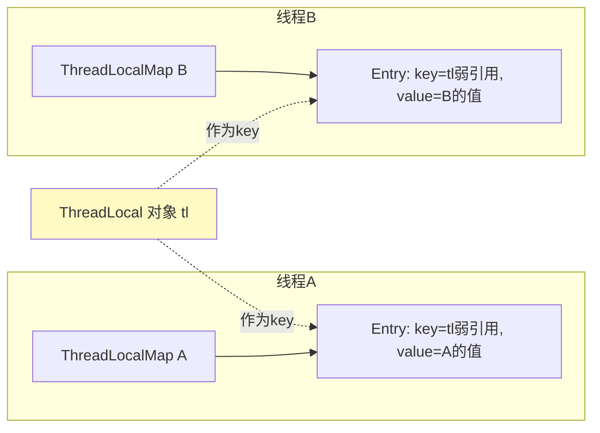

# 精通 ThreadLocal

> `ThreadLocal` 提供"线程封闭"——每个线程有自己独立的变量副本，互不干扰，无需同步。它是用户上下文传递、数据库连接、`SimpleDateFormat` 复用的常用工具。但它的**内存泄漏**问题（尤其线程池下）是面试高频深水区。本篇讲透原理与正确用法。
>
> **📅 基准：Java 17/21。**

---

## 一、ThreadLocal 是什么

`ThreadLocal` 让每个线程拥有变量的**独立副本**，一个线程改自己的副本不影响别的线程——用"不共享"代替"同步"来实现线程安全（线程封闭，thread confinement）。

```java
ThreadLocal<SimpleDateFormat> sdf =
    ThreadLocal.withInitial(() -> new SimpleDateFormat("yyyy-MM-dd"));

// 每个线程拿到的是自己的 SimpleDateFormat 实例
String s = sdf.get().format(new Date());
```

`SimpleDateFormat` 非线程安全，多线程共享会出错；用 ThreadLocal 让每个线程一份，既线程安全又避免反复创建。

核心 API：`set(value)`、`get()`、`remove()`、`withInitial(supplier)`。

---

## 二、ThreadLocal 的原理

关键：**值不是存在 ThreadLocal 对象里，而是存在每个 Thread 自己身上**。

```java
// Thread 类里有一个字段
ThreadLocal.ThreadLocalMap threadLocals;

// ThreadLocal.get() 的本质
public T get() {
    Thread t = Thread.currentThread();
    ThreadLocalMap map = t.threadLocals;     // 拿当前线程的 map
    Entry e = map.getEntry(this);            // 以 this（ThreadLocal 对象）为 key
    return (T) e.value;
}
```

- 每个 `Thread` 有一个 `ThreadLocalMap`（线程私有）。
- `ThreadLocalMap` 的 **key 是 ThreadLocal 对象本身，value 是存的值**。
- 所以同一个 ThreadLocal 在不同线程的 map 里对应不同的 value——天然隔离。



---

## 三、ThreadLocalMap 结构

`ThreadLocalMap` 是 ThreadLocal 的静态内部类，和 HashMap 不同：

- **Entry 继承 WeakReference**：`Entry extends WeakReference<ThreadLocal<?>>`，key（ThreadLocal）是**弱引用**，value 是强引用。
- **开放寻址法**解决哈希冲突（不是 HashMap 的链表/红黑树，而是冲突时往后找下一个空槽）。
- 初始容量 16，负载因子 2/3，扩容翻倍。

为什么 key 用弱引用，是理解内存泄漏的关键（下节）。

---

## 四、内存泄漏问题

**这是 ThreadLocal 最重要的考点。** 引用链：

```
Thread → ThreadLocalMap → Entry → key(弱引用 ThreadLocal) + value(强引用)
```

问题场景：
1. 外部对 ThreadLocal 的强引用断了（如方法结束、tl 变量没了）。
2. Entry 的 key 是**弱引用**，GC 时被回收 → key 变成 `null`。
3. 但 Entry 的 **value 是强引用**，且 Entry 还被 ThreadLocalMap 引用、map 被 Thread 引用——只要**线程还活着**，value 就一直无法回收 → **内存泄漏**（key=null 但 value 还在的 Entry）。

**线程池下尤其严重**：线程池的线程长期复用、不销毁，残留的 value 一直堆积，可能导致严重泄漏甚至 OOM；更糟的是下一个任务复用该线程时可能 `get()` 到上一个任务残留的脏数据。

**解决：用完必须 `remove()`**（见下节）。

---

## 五、为什么用弱引用 + remove 必要性

- **为什么 key 用弱引用**：是一种"补救设计"——如果用强引用，ThreadLocal 对象即使外部不用了也会被 map 强引用着无法回收，泄漏更严重。用弱引用让 ThreadLocal 对象在外部无强引用时能被 GC 回收（key 变 null）。ThreadLocalMap 还会在 set/get 时**顺带清理 key 为 null 的过期 Entry**（探测式清理）。
- **但弱引用不能根治**：清理是"顺带、不彻底"的，value 仍可能残留。**根治办法是显式 `remove()`**：用完手动移除整个 Entry（key 和 value 都清掉）。

**正确范式**（尤其线程池中）：

```java
try {
    threadLocal.set(value);
    // 业务逻辑
} finally {
    threadLocal.remove();  // ✅ 必须 remove，防泄漏 + 防脏数据
}
```

`finally` 里 remove 是 ThreadLocal 的铁律，和锁的 unlock 一样重要。

---

## 六、父子线程传递

- **ThreadLocal 不能跨线程**：子线程拿不到父线程的 ThreadLocal 值（各自的 map）。
- **InheritableThreadLocal**：创建子线程时，子线程会**复制**父线程的 inheritable 值，实现父→子传递。但**只在创建线程那一刻复制**，之后父线程改了不影响子线程。
- **线程池下 InheritableThreadLocal 失效**：线程池复用线程、不重新创建，"创建时复制"的机制不触发，传递不过去。需要用阿里的 **TransmittableThreadLocal（TTL）**，它在任务提交时捕获、执行时回放上下文，解决线程池场景的上下文传递（如全链路 traceId 传递）。

---

## 七、应用场景

| 场景 | 用法 |
|---|---|
| SimpleDateFormat 复用 | 每线程一个，避免非线程安全 + 反复创建（Java 8 后可用 DateTimeFormatter，它本身线程安全） |
| 数据库连接/会话 | 同一线程内共享 Connection（如 Spring 事务、MyBatis SqlSession） |
| 用户上下文 | 存当前登录用户/租户，贯穿一次请求的各层（避免层层传参） |
| 日志 MDC | 存 traceId/requestId，日志框架打印，做全链路追踪 |
| Spring 事务 | TransactionSynchronizationManager 用 ThreadLocal 绑定当前事务资源 |

本质都是"一次请求/一个线程内的上下文传递"，避免方法间显式传参。

---

## 八、常见考点

- **ThreadLocal 不是用来解决共享变量的并发问题**：它是"不共享"（每线程一份），共享变量的同步还得用锁/原子类。
- **value 强引用、key 弱引用**：泄漏根源是 value 残留。
- **remove 的必要性**：线程池场景不 remove 必泄漏 + 可能脏数据。
- **InheritableThreadLocal 在线程池失效**：用 TTL。

---

## 陷阱清单

- **用完不 remove**：线程池下内存泄漏 + 下个任务读到脏数据。finally remove 是铁律。
- **以为 key 弱引用就不会泄漏**：弱引用只回收 key，value 仍残留，必须 remove。
- **指望 ThreadLocal 在线程间传值**：它是线程隔离的，跨线程拿不到。
- **线程池用 InheritableThreadLocal 传上下文**：复用线程不触发复制，失效。用 TTL。
- **把 ThreadLocal 当并发同步手段**：它是线程封闭，不能替代锁去保护共享数据。
- **存大对象不清理**：value 是强引用且线程长命，大对象不 remove 长期占内存。
- **静态 ThreadLocal 误以为能避免泄漏**：static 让 ThreadLocal 不被回收（key 不为 null），但 value 仍需 remove。

---

## 2026 现状

- **DateTimeFormatter 替代 SimpleDateFormat**：Java 8 的 `java.time` 包（DateTimeFormatter 本身线程安全、不可变），不再需要用 ThreadLocal 包 SimpleDateFormat。
- **ScopedValue（Java 21+ 预览）**：作为 ThreadLocal 的现代替代，专为虚拟线程设计——不可变、有明确作用域、自动清理（避免忘记 remove 的泄漏），且海量虚拟线程下比 ThreadLocal 更省内存。值得关注其正式化。
- **虚拟线程与 ThreadLocal**：虚拟线程仍支持 ThreadLocal，但海量虚拟线程下每个都有自己的副本可能占用大量内存，官方推荐改用 ScopedValue。
- **全链路上下文传递**：分布式追踪（traceId）靠 ThreadLocal/TTL + MDC，结合 OpenTelemetry 做全链路追踪是生产标配。

---

## 练习题

1. ThreadLocal 的实现原理是什么？值到底存在哪里？

<details><summary>参考答案</summary>

ThreadLocal 通过"线程封闭"实现：值不是存在 ThreadLocal 对象自身，而是存在**每个线程（Thread 对象）内部的一个 ThreadLocalMap** 里。每个 Thread 有一个 `threadLocals` 字段（类型 ThreadLocal.ThreadLocalMap），这个 map 以 **ThreadLocal 对象本身作为 key、以要存的值作为 value**。当调用 `threadLocal.get()` 时，它先拿到当前线程 `Thread.currentThread()`，再取该线程的 threadLocals map，以 this（这个 ThreadLocal 对象）为 key 去 map 里取对应的 value；`set(v)` 则是往当前线程的 map 里以 this 为 key 存入 v。因为每个线程有各自独立的 ThreadLocalMap，同一个 ThreadLocal 对象在不同线程的 map 中对应不同的 value，从而实现"每个线程一份独立副本、互不干扰"。所以值的存储是"以线程为维度"的：找哪个线程的 map，再用 ThreadLocal 当 key——这正是线程隔离的本质。

</details>

2. ThreadLocal 为什么会内存泄漏？为什么线程池下更严重？

<details><summary>参考答案</summary>

引用链是：Thread → ThreadLocalMap → Entry，Entry 的 key 是对 ThreadLocal 的**弱引用**、value 是**强引用**。当外部对 ThreadLocal 对象的强引用消失后（如方法结束），GC 会回收这个 ThreadLocal 对象，于是 Entry 的 key 变成 null；但 Entry 的 value 是强引用，而 Entry 仍被 ThreadLocalMap 持有、map 又被 Thread 持有——只要**这个线程还活着**，这个"key 为 null 但 value 仍在"的 Entry 就无法被回收，value 指向的对象就一直驻留内存，造成泄漏。**线程池下更严重**的原因：线程池的核心线程会被长期复用、几乎不销毁，于是其 ThreadLocalMap 一直存在，残留的 value 不断累积、永远得不到回收，长期运行可能导致严重内存泄漏甚至 OOM；而且更危险的是——下一个任务复用同一个线程时，调用 get() 可能读到上一个任务残留的脏数据，引发难以排查的业务错误。根治办法是用完在 finally 中 remove()，彻底清除 Entry（key 和 value 都清）。

</details>

3. ThreadLocalMap 的 key 为什么用弱引用？这能完全避免内存泄漏吗？

<details><summary>参考答案</summary>

key 用弱引用是一种"补救/缓解"设计。如果 key 用强引用：那么即使外部代码不再使用某个 ThreadLocal 对象，ThreadLocalMap 的 Entry 仍强引用着它，导致这个 ThreadLocal 对象永远无法被 GC 回收，泄漏更严重、更彻底。改用弱引用后，当外部对 ThreadLocal 的强引用消失时，GC 可以回收该 ThreadLocal 对象，Entry 的 key 变为 null，标记出"这是一个过期 Entry"；ThreadLocalMap 在后续 set/get/remove 操作时会**顺带探测并清理**这些 key 为 null 的过期 Entry（连同其 value）。但这**不能完全避免泄漏**，原因：①清理是"顺带、启发式"的，只在调用相关方法且恰好探测到时才清理，不保证及时彻底；②真正的泄漏源是 value 是强引用——key 被回收了 value 仍可能长期残留（尤其线程长命、之后不再调用该 ThreadLocal 的方法触发清理时）。所以弱引用只是减轻了"ThreadLocal 对象本身无法回收"的问题，要根治 value 残留，必须**显式调用 remove()**。结论：弱引用是缓解，remove 才是根治。

</details>

4. 使用 ThreadLocal 的正确范式是什么？为什么 remove 要放在 finally？

<details><summary>参考答案</summary>

正确范式：`try { threadLocal.set(value); /* 业务逻辑 */ } finally { threadLocal.remove(); }`——即设置值、使用、最后在 finally 中务必调用 remove() 清除。remove 放在 finally 的原因：①**防内存泄漏**——remove 会从当前线程的 ThreadLocalMap 中删除对应的 Entry（key 和 value 都清掉），避免线程（尤其线程池中长命线程）长期残留 value 导致泄漏；②**防脏数据**——线程池复用线程时，若不 remove，下一个任务在同一线程上 get() 会拿到上一个任务残留的值，造成数据串台的隐蔽 bug；③放在 finally 是为了**保证无论业务逻辑正常结束还是抛出异常，remove 都一定会执行**，就像 ReentrantLock 的 unlock 必须放 finally 一样——如果只在正常流程末尾 remove，一旦中间抛异常就漏掉了清理，泄漏和脏数据风险又回来了。所以"finally 里 remove"是使用 ThreadLocal 的铁律，特别是在 Web 容器、线程池等线程会被复用的环境中。

</details>

5. InheritableThreadLocal 能实现父子线程传值，为什么在线程池下会失效？怎么解决？

<details><summary>参考答案</summary>

InheritableThreadLocal 的机制是：**在创建一个新线程的那一刻**，新线程的构造过程会把父线程（创建它的线程）的 inheritableThreadLocals 中的值**复制**到子线程，从而子线程能拿到父线程设置的值。它依赖"线程被创建"这个动作来触发复制。在线程池下失效的原因：线程池的线程是**预先创建并长期复用**的，提交任务时并不会创建新线程，而是复用已有线程执行——既然没有"创建新线程"的动作，InheritableThreadLocal 的复制机制就不会被触发；而且线程是复用的，它身上保留的是第一次创建时（或上一个任务）的上下文，与当前提交任务的"父线程"上下文对不上。结果就是任务拿不到提交它的线程的上下文（甚至拿到错误的旧上下文）。解决：使用阿里开源的 **TransmittableThreadLocal（TTL）**，它通过装饰 Runnable/Callable 或线程池，在**任务提交时捕获**提交线程的上下文快照、在**任务执行时回放**到执行线程、执行完再恢复，从而正确地把上下文从提交线程传递到线程池中执行任务的线程（典型用于全链路 traceId、用户身份等上下文透传）。

</details>

6. ThreadLocal 是用来解决共享变量的并发安全问题吗？它和加锁有什么本质区别？

<details><summary>参考答案</summary>

不是。ThreadLocal 解决的不是"多个线程安全地共享同一份数据"，而是"让每个线程拥有自己独立的一份数据、根本不共享"，即**线程封闭（thread confinement）**。它的思路是"避免共享"——既然每个线程操作的是自己的副本，线程之间互不可见、互不影响，自然就没有竞争、不需要同步。而加锁（synchronized/Lock）解决的是"必须共享同一份数据时，如何保证并发访问的正确性"——通过互斥让多个线程串行访问共享数据。本质区别：ThreadLocal 是"用不共享换安全"（用空间换并发，每线程一份），适合那些本就该线程独享的上下文（如当前用户、连接、格式化器）；锁是"用互斥保护共享"，适合那些必须被多个线程共同读写的数据。所以二者解决的是不同问题，不能用 ThreadLocal 去替代锁保护真正需要共享的状态——如果数据需要在多个线程间共享并保持一致，ThreadLocal 帮不上忙，必须用锁或原子类/并发容器。

</details>
