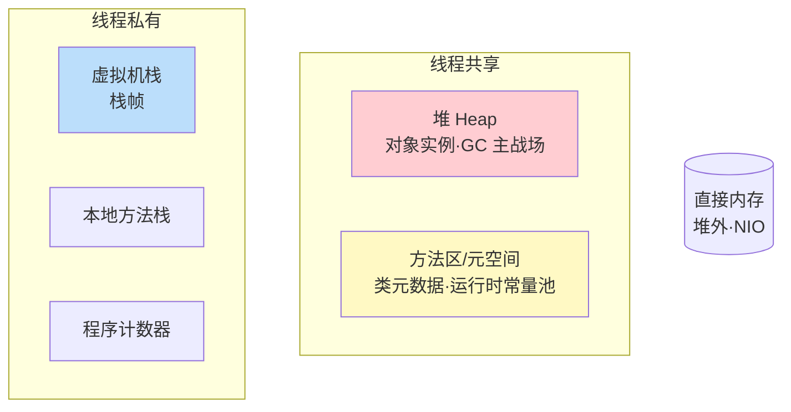

# 精通 JVM 运行时内存结构

> 理解 JVM 内存结构是 GC、调优、排查 OOM 的前提。堆、栈、方法区、元空间各放什么？哪些线程共享、哪些私有？哪些会 OOM、哪些会 StackOverflow？本篇是 JVM 模块（J15-J21）的地基。
>
> **📅 基准：Java 17/21（HotSpot）。** 注意 Java 8 起永久代被元空间取代。

---

## 一、运行时数据区全景

JVM 把内存划分为几个**运行时数据区**，按是否线程共享分两类：

- **线程私有**（随线程生灭）：程序计数器、虚拟机栈、本地方法栈。
- **线程共享**（随 JVM 生灭）：堆、方法区。
- **堆外**：直接内存（不属于 JVM 规范的运行时数据区，但常用）。

---

## 二、程序计数器（PC Register）

- **作用**：记录当前线程执行的字节码指令地址（行号指示器），分支、循环、跳转、异常、线程恢复都靠它。
- **线程私有**：每个线程一个，互不影响（线程切换后能恢复到正确位置）。
- **特点**：占用内存极小，是**唯一一个不会发生 OOM** 的区域（JVM 规范没规定它会 OOM）。
- 执行 native 方法时，PC 值为 undefined（native 不归 JVM 字节码管）。

---

## 三、虚拟机栈

- **作用**：每个方法调用对应一个**栈帧（Stack Frame）**入栈，方法返回则出栈。线程私有，描述 Java 方法执行的内存模型。
- **栈帧包含**：
  - **局部变量表**：存方法参数和局部变量（基本类型值、对象引用）。
  - **操作数栈**：字节码运算的工作区（如 a+b 先压栈再运算，见 [J21 字节码](./J21-精通-字节码与执行引擎.md)）。
  - **动态链接**：指向运行时常量池中该方法的引用。
  - **返回地址**：方法返回后回到哪里。
- **两种异常**：
  - `StackOverflowError`：栈深度超限（如无限递归）——栈装不下更多栈帧。
  - `OutOfMemoryError`：栈可动态扩展但申请不到内存。
- `-Xss` 设置每个线程栈大小。栈帧里的局部变量是线程私有的，所以**局部变量天然线程安全**。

---

## 四、本地方法栈

- 和虚拟机栈类似，但服务于 **native 方法**（C/C++ 实现的本地方法，如 `Object.hashCode` 的底层）。
- HotSpot 把虚拟机栈和本地方法栈合二为一。
- 同样可能 StackOverflowError 和 OOM。

---

## 五、堆

- **作用**：存放**对象实例和数组**——几乎所有对象都在堆上分配（少数被逃逸分析优化到栈上，见 [J20](./J20-精通-对象内存布局与逃逸分析.md)）。
- **线程共享**，是 **GC 的主战场**（[J17](./J17-精通-垃圾回收算法.md)/[J18](./J18-精通-垃圾收集器G1与ZGC.md)）。
- **分代结构**（经典分代收集器视角）：
  - **新生代（Young）**：Eden + 两个 Survivor（S0/S1），新对象先进 Eden。
  - **老年代（Old）**：长期存活的对象。
- `-Xms`（初始堆）、`-Xmx`（最大堆）设置堆大小。
- **OOM**：`java.lang.OutOfMemoryError: Java heap space`——对象太多、堆放不下且回收不掉（最常见的 OOM，见 [J19](./J19-精通-JVM调优与故障排查.md)）。

---

## 六、方法区与元空间

**方法区（Method Area）** 是 JVM 规范的概念，存**类的元数据**：类信息（结构、字段、方法字节码）、运行时常量池、静态变量等。

实现演变（高频考点）：

| 版本 | 实现 | 位置 |
|---|---|---|
| Java 7 及之前 | 永久代（PermGen） | JVM 堆内存的一部分 |
| **Java 8 起** | **元空间（Metaspace）** | **本地内存（堆外）** |

为什么从永久代改成元空间：
- 永久代大小受 `-XX:MaxPermSize` 限制，容易因类加载过多（如大量动态生成类、热部署）导致 `OutOfMemoryError: PermGen space`。
- 元空间用**本地内存**，默认只受物理内存限制（可用 `-XX:MaxMetaspaceSize` 限制），更灵活，规避了永久代的固定大小问题。

**运行时常量池**：是方法区的一部分，存类的常量（字面量、符号引用）。注意**字符串常量池**在 Java 7 起已从永久代移到了**堆**中（见 [J03](./J03-精通-String与不可变设计.md)）。

---

## 七、直接内存

- **直接内存（Direct Memory）** 不是 JVM 运行时数据区，是**堆外内存**（本地内存）。
- **NIO（[J28](./J28-精通-Java-IO与NIO.md)）的 `DirectByteBuffer`** 用它——避免数据在堆内堆外来回拷贝，提高 IO 性能（零拷贝相关）。
- 不受堆大小限制，但受物理内存限制；用 `-XX:MaxDirectMemorySize` 限制。
- 也会 OOM（`OutOfMemoryError: Direct buffer memory`），且不被普通堆 GC 直接管理（靠 Cleaner/引用回收），泄漏更隐蔽。

---

## 八、常见考点

各区域的异常对照（高频）：

| 区域 | 异常 | 触发 |
|---|---|---|
| 程序计数器 | 无 | 唯一不 OOM |
| 虚拟机栈/本地方法栈 | StackOverflowError | 栈太深（递归） |
| 虚拟机栈 | OOM | 无法分配栈内存 |
| 堆 | OOM: Java heap space | 对象太多回收不掉 |
| 元空间 | OOM: Metaspace | 类太多（动态类/类加载器泄漏） |
| 直接内存 | OOM: Direct buffer memory | DirectByteBuffer 过多 |

其他考点：对象创建与分配流程（类加载检查→分配内存→初始化零值→设对象头→执行构造，见 [J20](./J20-精通-对象内存布局与逃逸分析.md)）；字符串常量池在堆（Java 7+）。

---

## 陷阱清单

- **以为字符串常量池在方法区/永久代**：Java 7 起已移到堆中。
- **以为 Java 8 还有永久代**：已被元空间（本地内存）取代。
- **混淆 StackOverflowError 和 OOM**：栈深超限是 SOF（栈），对象/类太多是 OOM（堆/元空间）。
- **元空间不设上限**：动态生成大量类（如某些字节码框架、类加载器泄漏）撑爆本地内存。生产建议设 MaxMetaspaceSize。
- **忽视直接内存 OOM**：NIO/Netty 大量 DirectBuffer 可能堆外 OOM，且堆 dump 看不到，排查难。
- **以为对象一定在堆**：逃逸分析可能让对象栈上分配（见 [J20](./J20-精通-对象内存布局与逃逸分析.md)）。
- **-Xmx 设过大忽略元空间/直接内存/栈**：堆只是一部分，进程总内存还包括元空间、直接内存、线程栈、JVM 自身。

---

## 2026 现状

- **元空间已是标准**（Java 8+），永久代成为历史名词但仍是面试常考的"演变"题。
- **ZGC/G1 分代演进**：Java 21 的分代 ZGC 让"分代"概念在新收集器里延续（见 [J18](./J18-精通-垃圾收集器G1与ZGC.md)）。
- **容器内存感知**：Java 10+ 默认感知 cgroup 限制（`-XX:MaxRAMPercentage` 按容器内存比例设堆），云原生下要正确配置避免被 OOMKilled（见 [cloud-native C06](../cloud-native/C06-精通-Scheduling-与资源管理.md)）。
- **堆外内存 API**：Java 21 的 Foreign Function & Memory API（FFM）提供安全管理堆外内存的标准方式，逐步替代 DirectByteBuffer/Unsafe。

---

## 练习题

1. JVM 运行时数据区有哪些？哪些线程私有、哪些线程共享？

参考答案

主要有五个运行时数据区。**线程私有**（生命周期与线程相同）：①**程序计数器**——记录当前线程执行的字节码指令地址，是分支/循环/线程恢复的依据；②**虚拟机栈**——每个方法调用对应一个栈帧（含局部变量表、操作数栈、动态链接、返回地址），方法调用入栈、返回出栈；③**本地方法栈**——为 native 方法服务（HotSpot 中与虚拟机栈合并）。**线程共享**（生命周期与 JVM 相同）：④**堆**——存放对象实例和数组，是 GC 的主战场，所有线程共享；⑤**方法区**（Java 8 起由元空间实现，位于本地内存）——存类的元数据、运行时常量池、静态变量等。此外还有**直接内存**（堆外内存，NIO 的 DirectByteBuffer 使用，不属于 JVM 规范的运行时数据区但很常用）。区分私有/共享的意义在于：私有区域天然线程安全（如局部变量），共享区域（堆、方法区）才涉及并发安全问题。

2. 为什么说程序计数器是唯一不会发生 OOM 的区域？

参考答案

程序计数器是当前线程所执行字节码的行号指示器，它的作用仅仅是存储一个指向当前指令地址的值（一个较小的、大小固定的数值）。由于它存储的内容极其有限、占用内存非常小且固定，不会随程序运行而增长（不像栈会随方法调用加深、堆会随对象增多而增大），因此不存在"内存不够分配"的情况。Java 虚拟机规范中也明确规定：程序计数器是唯一一个**没有规定任何 OutOfMemoryError 情况**的区域。其他区域都可能 OOM 或 StackOverflow：栈会因递归过深 StackOverflowError 或扩展时 OOM、堆会因对象过多 OOM、元空间会因类过多 OOM、直接内存会因 DirectBuffer 过多 OOM。而程序计数器因其固定的小内存占用，天生不会内存溢出。

3. Java 8 为什么用元空间（Metaspace）取代永久代（PermGen）？两者有什么区别？

参考答案

主要为了解决永久代固定大小带来的问题。**永久代（PermGen，Java 7 及之前）**：是 JVM 堆内存的一部分，存放类元数据、运行时常量池、静态变量等，大小由 `-XX:MaxPermSize` 固定限制。问题在于：①大小难以预估和设置，类加载较多时（如使用大量动态生成类的框架、频繁热部署）容易超出限制抛 `OutOfMemoryError: PermGen space`；②它在堆内，给堆的 GC 和大小规划带来耦合。**元空间（Metaspace，Java 8 起）**：把类元数据移到了**本地内存（堆外）**，默认大小只受可用物理内存限制（也可用 `-XX:MaxMetaspaceSize` 设上限），更灵活，规避了永久代固定大小易溢出的问题。区别小结：位置上永久代在 JVM 堆内、元空间在本地内存；大小上永久代受 MaxPermSize 固定限制、元空间默认受物理内存限制可动态扩展；溢出错误也从 "PermGen space" 变为 "Metaspace"。补充：字符串常量池在 Java 7 时就已从永久代移到了堆中，这是另一个独立的演变点。

4. StackOverflowError 和 OutOfMemoryError 有什么区别？分别在什么情况下发生？

参考答案

两者是不同区域、不同原因的错误。**StackOverflowError** 发生在**虚拟机栈（或本地方法栈）**：当线程请求的栈深度超过了 JVM 允许的最大深度时抛出——最典型的原因是**方法无限递归**（或递归过深、栈帧过大），导致栈帧不断入栈、栈空间被耗尽放不下新的栈帧。它是栈"深度"问题，与单个线程的栈大小（-Xss）有关。**OutOfMemoryError** 是内存"容量"不足，可发生在多个区域：①**堆 OOM**（Java heap space）——创建的对象太多且无法被 GC 回收，堆放不下，最常见（如内存泄漏、大集合、缓存无限增长）；②**元空间 OOM**（Metaspace）——加载的类太多（动态生成类、类加载器泄漏）；③**直接内存 OOM**（Direct buffer memory）——DirectByteBuffer 申请过多堆外内存；④栈也可能在无法分配栈内存时 OOM。区别记忆：SOF 是"栈太深"（单线程递归撑爆栈），OOM 是"内存装不下"（对象/类/堆外内存过多且回收不掉）。排查 SOF 看递归调用链，排查堆 OOM 用 jmap/MAT 分析堆 dump 找泄漏。

5. 直接内存（堆外内存）是什么？谁在用它？它的 OOM 为什么更难排查？

参考答案

直接内存是 JVM 进程向操作系统申请的、位于 Java 堆之外的本地内存，它不属于 JVM 规范定义的运行时数据区，但被广泛使用。主要使用者是 **NIO 的 DirectByteBuffer**（以及基于它的 Netty 等高性能网络框架）：通过 `ByteBuffer.allocateDirect()` 分配堆外内存，好处是数据在 IO 时无需在 Java 堆和操作系统之间来回拷贝（减少一次拷贝，配合零拷贝提升 IO 性能）。它不受 -Xmx 堆大小限制，但受物理内存限制，可用 `-XX:MaxDirectMemorySize` 设上限，溢出时抛 `OutOfMemoryError: Direct buffer memory`。其 OOM 更难排查的原因：①它在堆外，**普通的堆转储（heap dump）和 MAT 分析看不到堆外内存的占用**，常规堆分析工具失效；②堆外内存不由普通 GC 直接回收，而是依赖 DirectByteBuffer 对象被 GC 后通过 Cleaner（虚引用）触发释放——如果 DirectByteBuffer 对象迟迟不被回收（或泄漏），堆外内存就一直不释放，问题隐蔽；③需要用 Native Memory Tracking（-XX:NativeMemoryTracking）、操作系统工具或 JFR 等专门手段才能观测。所以堆外内存泄漏往往表现为"进程总内存涨但堆 dump 正常"，需要特别注意。

6. 进程实际占用的内存只有 -Xmx 指定的堆大小吗？还包括哪些部分？

参考答案

不是。-Xmx 只是限制了 **Java 堆**的最大大小，而 JVM 进程实际占用的内存远不止堆，还包括：①**元空间（Metaspace）**——类元数据，位于本地内存，受 MaxMetaspaceSize 或物理内存限制；②**线程栈**——每个线程一个虚拟机栈，大小由 -Xss 决定，线程数越多占用越大（几百个线程的栈累加起来可观）；③**直接内存（堆外）**——NIO DirectByteBuffer、Netty 等使用，受 MaxDirectMemorySize 限制；④**JVM 自身运行所需内存**——如 JIT 编译后的代码缓存（CodeCache）、GC 自身的数据结构、符号表、JNI 等；⑤本地库分配的内存。所以进程总内存 ≈ 堆 + 元空间 + 所有线程栈 + 直接内存 + CodeCache + JVM 开销 + ... 。这在**容器化部署**时尤其重要：如果只按 -Xmx 设置而不留出堆外部分的余量，容器的内存上限很容易被这些"堆外"部分顶破，导致进程被 OOMKilled。正确做法是评估总内存（用 -XX:MaxRAMPercentage 按容器内存比例设堆，并为元空间、栈、直接内存留足空间），而不是简单地把 -Xmx 设成接近容器内存上限。

