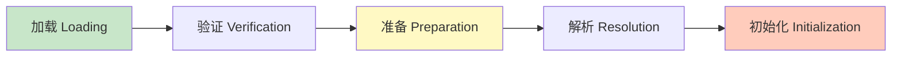
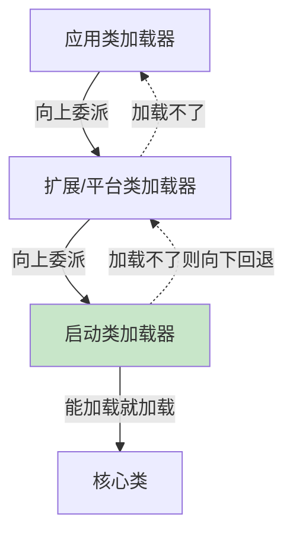

# 精通类加载与双亲委派

> 类是怎么从 `.class` 文件变成 JVM 里能用的 Class 对象的？双亲委派模型为什么能保证安全？Tomcat、JDBC SPI 又为什么要打破它？类加载机制是 JVM 面试的经典深水区，也是理解框架（热部署、隔离）的基础。
>
> **📅 基准：Java 17/21。** 注意 Java 9 模块化后类加载器层级有调整。

---

## 一、类加载的时机

JVM 在**首次主动使用**一个类时才加载它（懒加载）。会触发类**初始化**的主动引用：

- `new` 创建实例、读写静态字段（非常量）、调用静态方法。
- 反射调用（`Class.forName` 默认初始化）。
- 初始化子类时，父类先初始化。
- 启动类（main 所在类）。

**不触发初始化**的被动引用（注意区分）：
- 通过子类引用父类的静态字段（只初始化父类）。
- `类[].class`、数组定义。
- 引用**编译期常量**（`static final` 常量在编译期已存入调用方常量池，不触发定义类初始化）。

---

## 二、类加载过程

类从加载到使用经历**加载 → 验证 → 准备 → 解析 → 初始化**五个阶段（验证、准备、解析合称连接 Linking）：



1. **加载**：根据全限定名获取 class 字节流，在方法区生成类的数据结构，在堆生成代表它的 `Class` 对象。
2. **验证**：校验字节码合法性、安全性（防恶意/损坏的 class）。
3. **准备**：为**静态变量**分配内存并设**零值**（不是代码里的初值！如 `static int a = 5` 此阶段 a=0）。
4. **解析**：把常量池里的**符号引用**替换为**直接引用**（指向实际内存地址）。
5. **初始化**：执行 `<clinit>`（类构造器：静态变量赋真正的值 + 静态代码块）。此时 `a` 才变成 5。

---

## 三、准备 vs 初始化

经典考点——区分**准备**和**初始化**对静态变量的处理：

```java
static int a = 5;
// 准备阶段：a = 0（零值）
// 初始化阶段：执行 a = 5
```

例外：`static final int b = 5;`（编译期常量）在**准备阶段**就直接是 5（放入常量池），不等初始化。

`<clinit>` 由编译器收集所有静态变量赋值和静态代码块生成，**JVM 保证它在多线程下的同步**（同一个类只初始化一次，线程安全）——这也是"静态内部类单例"线程安全的原理（见 [J07 JMM](./J07-精通-JMM与happens-before.md)）。

---

## 四、类加载器

类加载器负责"加载"阶段。层级（Java 8 视角）：

| 类加载器 | 加载范围 |
|---|---|
| **启动类加载器（Bootstrap）** | 核心类库 `<JAVA_HOME>/lib`（rt.jar 等），C++ 实现，无对应 Java 对象 |
| **扩展类加载器（Extension）** | `<JAVA_HOME>/lib/ext`（Java 9 改为平台类加载器 Platform） |
| **应用类加载器（Application/System）** | classpath 上的应用类（我们写的类） |
| **自定义类加载器** | 用户继承 ClassLoader 实现（如热部署、加密类加载、隔离） |

Java 9 模块化后，扩展类加载器变为**平台类加载器（Platform ClassLoader）**，层级和加载范围有调整，但双亲委派思想不变。

---

## 五、双亲委派模型

**双亲委派（Parent Delegation）**：类加载器收到加载请求时，**先委派给父加载器**，父加载器加载不了才自己加载。



流程：自底向上委派、自顶向下加载——先问父，父加载不了（不在它的范围）再自己加载。

**两大好处**：
1. **安全**：防止核心类被篡改。比如自己写一个 `java.lang.String`，加载时会一路委派到启动类加载器，它加载的是 JDK 真正的 String，你的假 String 永远不会被加载——避免恶意代码替换核心类。
2. **避免重复加载**：同一个类只被一个加载器加载一次，保证类在 JVM 中的唯一性。

---

## 六、打破双亲委派

某些场景需要打破双亲委派：

| 场景 | 为什么打破 | 怎么做 |
|---|---|---|
| **JDBC / SPI** | 核心接口（`java.sql.Driver`）由 Bootstrap 加载，但实现（MySQL 驱动）在 classpath，Bootstrap 加载不了 | **线程上下文类加载器（TCCL）** 反向委派给应用类加载器加载实现 |
| **Tomcat** | 每个 Web 应用要隔离（不同应用可用不同版本的同名类），且应用类优先于共享类 | 自定义 WebappClassLoader，**优先自己加载**（违反"先委派父"） |
| **OSGi / 模块化** | 模块间类隔离、动态加载卸载 | 复杂的网状类加载器 |
| **热部署** | 重新加载修改后的类 | 自定义类加载器重新加载 |

**SPI 的双亲委派困境**（经典）：JDK 定义接口（高层、Bootstrap 加载），第三方提供实现（低层、App 加载）。按双亲委派，高层代码无法加载低层实现（父加载器看不到子加载器的类）。解决用**线程上下文类加载器（Thread Context ClassLoader）**——它默认是应用类加载器，让核心代码能"反向"用它去加载实现类，打破了"父加载器不能用子加载器"的限制。`ServiceLoader`（SPI 机制）和 Spring Boot 的自动配置（见 [J26](./J26-精通-SpringBoot自动配置.md)）都用了这个机制。

---

## 七、类的唯一性

**一个类的唯一性由"类加载器 + 全限定名"共同决定。** 同一个 .class 文件，被两个不同的类加载器加载，会得到**两个不同的 Class**，它们 `instanceof`/`equals` 不相等、互相转型会 ClassCastException。

这是类隔离的基础——Tomcat 用不同的类加载器加载不同 Web 应用，使它们即使有同名同包的类也互不影响（不同加载器 = 不同的类）。

---

## 八、常见考点

- **准备阶段赋零值，初始化阶段赋真值**：`static int a=5` 准备时 a=0。
- **static final 编译期常量**在准备阶段就有值，且引用它不触发类初始化。
- **双亲委派的本质**：先委派父、父不行才自己加载；保证安全 + 唯一。
- **打破双亲委派的典型**：Tomcat（隔离）、SPI/JDBC（TCCL）、热部署。
- **类初始化线程安全**：`<clinit>` JVM 保证只执行一次，是静态内部类单例的基础。

---

## 陷阱清单

- **混淆准备和初始化**：以为准备阶段静态变量就是代码里的初值（其实是零值）。
- **以为引用 static final 常量会初始化类**：编译期常量被内联到调用方，不触发定义类初始化。
- **以为同名类一定是同一个类**：类的唯一性是"类加载器 + 全限定名"，不同加载器加载是不同的类。
- **自己写 java.lang.* 类想替换 JDK**：双亲委派会用 Bootstrap 的版本，你的不会被加载（且有包名保护）。
- **SPI/JDBC 不理解 TCCL**：不懂为什么需要线程上下文类加载器去"反向"加载实现。
- **热部署内存泄漏**：自定义类加载器频繁加载新类，旧类加载器及其类无法卸载（被引用）导致元空间泄漏。

---

## 2026 现状

- **Java 9 模块系统（JPMS）**：引入模块化，类加载器层级调整（扩展类加载器→平台类加载器），模块的强封装影响反射访问（需 `opens`），但双亲委派核心思想不变。
- **GraalVM 原生镜像**：构建期做闭世界假设、提前编译，**没有运行时类加载**（类在构建时确定），所以传统的动态类加载、自定义类加载器在原生镜像下受限——这是 Spring 等框架适配原生镜像的难点之一（见 [J25](./J25-精通-Spring-MVC.md)/[J26](./J26-精通-SpringBoot自动配置.md)）。
- **类数据共享（CDS/AppCDS）**：把类元数据预先归档，加速启动、节省内存，云原生/Serverless 冷启动优化常用。
- **双亲委派仍是面试核心**：SPI、Tomcat 隔离、热部署的原理都绕不开它。

---

## 练习题

1. 类加载的过程有哪几个阶段？准备阶段和初始化阶段对静态变量的处理有什么不同？

<details><summary>参考答案</summary>

类加载过程分五个阶段：**加载（Loading）→ 验证（Verification）→ 准备（Preparation）→ 解析（Resolution）→ 初始化（Initialization）**（其中验证、准备、解析合称连接/Linking）。各阶段：加载——获取 class 字节流、在方法区建立类结构、在堆生成 Class 对象；验证——校验字节码的合法性和安全性；准备——为静态变量分配内存并设**零值**；解析——将常量池中的符号引用替换为直接引用；初始化——执行 `<clinit>`（静态变量真正赋值 + 静态代码块）。**准备 vs 初始化对静态变量的区别**：准备阶段只为静态变量分配内存并赋予**数据类型的零值**（如 int 为 0、引用为 null），不执行代码里写的初始值；到初始化阶段才执行 `<clinit>` 把代码里的初值赋上。例如 `static int a = 5`，准备阶段 a=0，初始化阶段才 a=5。特例：`static final int b = 5`（编译期常量）在准备阶段就直接是 5（放入常量池），不需要等初始化。

</details>

2. 什么是双亲委派模型？它带来了哪两个好处？

<details><summary>参考答案</summary>

双亲委派模型是类加载器的工作机制：当一个类加载器收到加载某个类的请求时，它不会自己先尝试加载，而是**先把请求委派给它的父类加载器**，父类加载器再委派给它的父类……一直向上委派到启动类加载器；只有当父类加载器在自己的搜索范围内找不到、无法加载这个类时，子加载器才自己尝试加载。即"自底向上委派、自顶向下加载"。两个好处：①**安全性**——防止核心类库被篡改替换。例如即使你自己写了一个 `java.lang.String` 类，加载时请求会一路向上委派到启动类加载器，由它加载 JDK 真正的 String，你的"假 String"永远不会被加载使用，从而保护了 Java 核心 API 不被恶意或意外替换。②**避免类的重复加载**——由于总是先委派父加载器，一个类只会被某一个加载器加载一次，保证了同一个类在 JVM 中的唯一性（同一类加载器命名空间内不会重复加载），既节省资源又保证类型一致。

</details>

3. 为什么 JDBC（SPI 机制）要打破双亲委派？是怎么解决的？

<details><summary>参考答案</summary>

困境根源：JDBC 的核心接口（如 `java.sql.Driver`、`DriverManager`）属于 Java 核心类库，由**启动类加载器（Bootstrap）**加载；而具体的数据库驱动实现（如 MySQL 的 Driver）是第三方 jar，位于应用的 classpath，由**应用类加载器**加载。按照双亲委派，启动类加载器（父）只能加载核心库、看不到也加载不了 classpath 上的驱动实现类（只有子加载器才能加载），于是核心的 DriverManager 在运行时需要加载/使用具体驱动实现时就"够不着"——父加载器无法委派给子加载器去加载，这违背了双亲委派的单向性。解决办法是使用**线程上下文类加载器（Thread Context ClassLoader, TCCL）**：它默认被设置为应用类加载器，核心代码（DriverManager / ServiceLoader）通过 `Thread.currentThread().getContextClassLoader()` 拿到应用类加载器，用它来加载 classpath 上的驱动实现类，从而实现"高层核心代码反向委派给低层应用类加载器加载实现"，打破了双亲委派的限制。这正是 Java SPI（ServiceLoader）机制的实现方式，Spring Boot 的自动配置加载也用了类似思路。

</details>

4. Tomcat 为什么要自定义类加载器、打破双亲委派？

<details><summary>参考答案</summary>

主要为了**应用隔离**和**版本独立**。一个 Tomcat 容器中可以部署多个 Web 应用，需求是：①不同 Web 应用之间要互相隔离——A 应用和 B 应用即使使用了同名同包的类（比如各自依赖了不同版本的同一个库），也不能相互干扰、冲突；②每个应用应优先使用自己 WEB-INF/lib 和 classes 下的类（应用私有类优先于容器共享类），以保证应用能用自己指定版本的依赖；③还要支持 JSP 热替换等。如果严格遵守双亲委派（总是先委派父加载器、由共享的加载器加载），就无法做到应用间隔离和版本独立（同名类会被同一个加载器加载成同一个类、被共享）。所以 Tomcat 为每个 Web 应用创建独立的 **WebappClassLoader**，并改变委派策略——对应用自己的类**优先自行加载**（而非先委派父加载器），只有加载不到的（如 JDK 核心类、Servlet API 等共享类）才委派上去。利用"类的唯一性由类加载器 + 全限定名共同决定"这一点，不同应用用各自的 WebappClassLoader 加载各自的类，即使全限定名相同也是不同的 Class，从而实现隔离。这就是有意打破/弱化双亲委派以满足容器隔离需求。

</details>

5. "一个类的唯一性由类加载器 + 全限定名共同决定"是什么意思？有什么实际意义？

<details><summary>参考答案</summary>

含义：在 JVM 中判断两个类是不是"同一个类"，不能只看全限定名（包名 + 类名），还要看它们是由**哪个类加载器**加载的——只有"全限定名相同**且**加载它们的类加载器也相同"，才是同一个 Class。同一个 .class 文件，如果被两个不同的类加载器分别加载，会在 JVM 中产生**两个互不相同的 Class 对象**：它们 equals 不相等、彼此 `instanceof` 为 false，把一个的实例强转成另一个会抛 ClassCastException。实际意义：①这是**类隔离**的理论基础——Tomcat 用不同的 WebappClassLoader 加载不同 Web 应用，使它们即使有同名同包的类也是不同的 Class、互不影响，实现多应用隔离；OSGi、SOFAArk 等模块化框架同理；②它也解释了**热部署/热加载**的实现（用新的类加载器加载修改后的类得到"新类"）以及相关的**陷阱**——热部署后，旧类加载器加载的对象无法直接转型为新类加载器加载的同名类（ClassCastException），且旧类加载器若被引用无法卸载会导致元空间泄漏。总之，"类加载器 + 全限定名"共同决定身份，使得"同名类共存与隔离"成为可能。

</details>

6. 为什么用静态内部类实现的单例既线程安全又是懒加载的？

<details><summary>参考答案</summary>

静态内部类单例的写法是：外部类中定义一个私有静态内部类 Holder，里面有一个 `static final` 的单例实例字段；getInstance() 返回 `Holder.INSTANCE`。它兼具线程安全和懒加载的原因都来自**类加载/初始化机制**：①**懒加载**——静态内部类不会随外部类的加载而初始化，只有在**第一次被主动使用**（即第一次调用 getInstance() 访问 Holder.INSTANCE）时，JVM 才会加载并初始化 Holder 类，从而创建单例实例；在没人调用 getInstance() 之前，实例不会被创建，实现了延迟初始化。②**线程安全**——单例实例是在 Holder 类的初始化阶段（执行 `<clinit>`）创建的，而 JVM 规范保证**一个类的 `<clinit>` 方法在多线程并发下只会被执行一次**（JVM 用锁保证类初始化的同步），即使多个线程同时首次调用 getInstance()，也只有一个线程能执行 Holder 的初始化、创建唯一实例，其他线程会等待初始化完成后直接拿到同一个实例。所以无需自己写任何 synchronized 或 volatile（不像 DCL 那样需要 volatile 防重排，见 J07），就天然保证了"只创建一次 + 懒加载 + 线程安全"，代码简洁且高效。这是利用类初始化锁机制实现单例的优雅方式。

</details>
