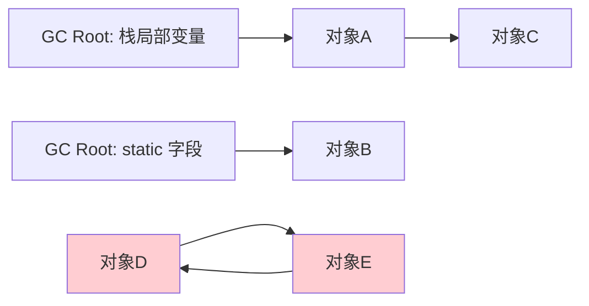
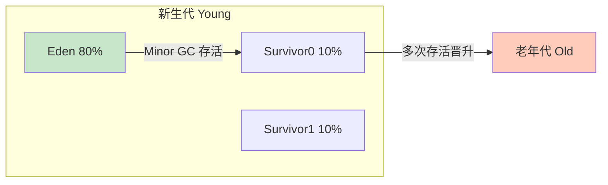

# 精通垃圾回收算法与可达性

> GC 是 Java "自动内存管理"的核心。怎么判断对象该回收（可达性分析）？有哪些回收算法（标记-清除/复制/整理）？为什么要分代？三色标记的漏标问题怎么解决？本篇讲清 GC 的算法基础，[J18](./J18-精通-垃圾收集器G1与ZGC.md) 讲具体收集器。
>
> **📅 基准：Java 17/21（HotSpot）。**

---

## 一、如何判断对象死亡

GC 要先判断"哪些对象是垃圾"。两种思路：

- **引用计数法**：给对象加一个引用计数器，被引用 +1、引用失效 -1，为 0 则回收。优点是简单实时，但**无法解决循环引用**（A 引用 B、B 引用 A，互相计数为 1，永不为 0 → 泄漏）。所以 **Java 不用引用计数**。
- **可达性分析（HotSpot 采用）**：从一组**根对象（GC Roots）** 出发，沿引用链遍历，能到达的是存活对象，**到达不了的就是垃圾**。天然解决循环引用（互相引用但都到不了 GC Roots，整体被回收）。

---

## 二、可达性分析

从 **GC Roots** 出发做可达性遍历。哪些对象可以作为 GC Roots（高频考点）：

- **虚拟机栈**中引用的对象（方法局部变量、参数）。
- **方法区/元空间**中静态属性引用的对象（static 字段）。
- **方法区**中常量引用的对象（常量池）。
- **本地方法栈**中 JNI（native）引用的对象。
- 被同步锁 `synchronized` 持有的对象、JVM 内部引用（系统类加载器、基本类型 Class 等）。

D、E 互相引用但都不被 GC Roots 可达 → 都是垃圾（红色），可达性分析能正确回收它们，引用计数则不能。

---

## 三、引用类型

Java 把引用分四种强度（影响 GC 行为）：

| 引用 | 回收时机 | 用途 |
|---|---|---|
| **强引用（Strong）** | 永不回收（只要可达） | 普通 `Object o = new Object()` |
| **软引用（Soft）** | **内存不足时**才回收 | 内存敏感的缓存（SoftReference） |
| **弱引用（Weak）** | **下次 GC 必回收**（不管内存够不够） | ThreadLocalMap 的 key（[J14](./J14-精通-ThreadLocal.md)）、WeakHashMap |
| **虚引用（Phantom）** | 随时可能回收，仅用于回收通知 | 管理堆外内存（DirectByteBuffer 的 Cleaner） |

软引用适合做缓存（内存够时保留、紧张时让路）；弱引用适合"有就用、没了也无所谓"的关联（如 ThreadLocal 的 key 弱引用是为了让 ThreadLocal 能被回收，见 [J14](./J14-精通-ThreadLocal.md)）。

---

## 四、垃圾回收算法

| 算法 | 做法 | 优点 | 缺点 | 适用 |
|---|---|---|---|---|
| **标记-清除** | 标记垃圾，直接清除 | 简单 | 产生**内存碎片**、效率一般 | 老年代（CMS） |
| **复制** | 内存分两半，存活对象复制到另一半，清空原区 | 无碎片、高效 | **浪费一半空间** | 新生代 |
| **标记-整理** | 标记后把存活对象**向一端移动**，再清理边界外 | 无碎片、不浪费空间 | 移动对象成本高 | 老年代 |

- **标记-清除**：会留下不连续的碎片，大对象可能没连续空间放。
- **复制**：适合"存活对象少"的场景（如新生代，大部分朝生夕死），只复制少量存活对象，高效；代价是要预留一半空间。
- **标记-整理**：适合"存活对象多"的场景（老年代），不浪费空间但移动开销大。

---

## 五、分代收集理论

**分代假说**（GC 的理论基石）：
1. **弱分代假说**：绝大多数对象朝生夕死（很快变垃圾）。
2. **强分代假说**：熬过多次 GC 的对象越难死。

据此把堆**分代**，对不同代用不同算法：

- **新生代**：对象朝生夕死、存活少 → 用**复制算法**（高效）。
- **老年代**：对象存活率高 → 用**标记-清除/标记-整理**（不浪费一半空间）。

分代让 GC 能针对不同对象的生命周期特点优化，大幅提升效率。

---

## 六、新生代回收细节

新生代分 **Eden : Survivor0 : Survivor1 = 8 : 1 : 1**：

- **对象先进 Eden**。Eden 满了触发 **Minor GC（Young GC）**。
- Minor GC：把 Eden + 当前使用的 Survivor 中**存活**的对象，复制到**另一个**空的 Survivor，清空 Eden 和原 Survivor。两个 Survivor 轮流当"复制目标"（始终保持一个空）。
- **对象晋升老年代**的几种情况：
  - 存活对象**年龄**达到阈值（默认 15，每熬过一次 Minor GC 年龄 +1）。
  - **动态年龄判定**：Survivor 中同年龄对象总和超过 Survivor 一半，则该年龄及以上的直接晋升。
  - **大对象**直接进老年代（`-XX:PretenureSizeThreshold`，避免大对象在 Survivor 间反复复制）。
  - Survivor 放不下（空间分配担保）。
- 为什么要两个 Survivor：复制算法需要一个空区域作为复制目标；用两个 Survivor 轮换，避免了"只有一个 Survivor 时碎片化"和"对象一次存活就晋升老年代"的问题。

**Full GC / Major GC**：回收老年代（通常伴随 Minor GC），STW 时间长，要尽量减少。

---

## 七、三色标记与并发标记问题

现代收集器（CMS/G1/ZGC）在**并发标记**（标记时应用线程还在跑）时用**三色标记法**：

- **白色**：未被访问（默认，最终白色 = 垃圾）。
- **灰色**：自己被访问，但引用的对象还没全部访问。
- **黑色**：自己和引用的对象都已访问完。

并发标记的问题（应用线程同时在改引用）：
- **多标（浮动垃圾）**：标记后变成垃圾的对象本次没被回收，下次再清，无害。
- **漏标（致命）**：一个本应存活的对象被错误地当成垃圾回收——会导致程序错误。

**漏标的两个必要条件**（同时满足才漏标）：
1. 黑色对象**新增**了对白色对象的引用。
2. 灰色对象**删除**了到该白色对象的引用。

解决（破坏其一）——靠**写屏障**：
- **增量更新（Incremental Update，CMS 用）**：破坏条件1——黑色对象新增引用白色时，把黑色记下来重新扫描。
- **SATB（Snapshot At The Beginning，G1 用）**：破坏条件2——灰色对象删除引用时，把被删的白色对象记下来（保留开始时的快照），当作存活处理。

这就是为什么 G1/CMS 需要写屏障（拦截引用修改）来保证并发标记的正确性。

---

## 八、Stop The World 与安全点

- **Stop The World（STW）**：GC 某些阶段必须暂停所有应用线程（如根节点枚举、最终标记），保证标记的一致性。STW 时间是 GC 性能的核心指标，现代收集器（[J18](./J18-精通-垃圾收集器G1与ZGC.md) 的 G1/ZGC）的目标就是尽量缩短 STW。
- **安全点（Safepoint）**：线程不能在任意位置停下做 GC（引用关系可能不一致），只能在"安全点"（方法调用、循环回边、异常跳转等）停下。GC 时让所有线程跑到最近的安全点再暂停。
- **安全区域（Safe Region）**：处理 sleep/blocked 的线程（它们到不了安全点），在一段引用不变的区域内可随时 GC。

---

## 陷阱清单

- **以为 Java 用引用计数 GC**：用的是可达性分析（引用计数解决不了循环引用）。
- **搞混软引用和弱引用**：软引用内存不足才回收（适合缓存），弱引用下次 GC 必回收（适合 ThreadLocal key/WeakHashMap）。
- **以为对象不可达就立即回收**：要等下次 GC；且 finalize() 可能让对象"复活"一次（已废弃，别依赖）。
- **以为标记-清除会移动对象**：它不移动（产生碎片）；标记-整理才移动。
- **新生代用标记-整理**：新生代存活少，用复制算法更高效。
- **忽视漏标**：并发标记不加写屏障会漏标导致存活对象被错杀。G1 用 SATB、CMS 用增量更新。
- **大对象频繁创建**：直接进老年代，加速 Full GC。

---

## 2026 现状

- **ZGC/Shenandoah 并发整理**：新一代收集器（[J18](./J18-精通-垃圾收集器G1与ZGC.md)）连"整理（移动对象）"都能并发做，STW 降到亚毫秒级（靠染色指针 + 读屏障）。
- **分代 ZGC**（Java 21）：把分代思想引入 ZGC，进一步提升吞吐。
- **可达性分析 + 三色标记仍是基础**：所有现代收集器都基于可达性分析，三色标记 + 写/读屏障是并发 GC 的通用框架。
- **弱引用/Cleaner 管理堆外**：DirectByteBuffer 等堆外内存靠虚引用 + Cleaner 回收，Java 21 FFM API 提供更可控的堆外内存管理。

---

## 练习题

1. Java 为什么用可达性分析而不用引用计数来判断对象存活？

参考答案

因为引用计数法无法解决**循环引用**问题。引用计数的思路是给每个对象维护一个被引用次数的计数器，被引用时 +1、引用失效时 -1，计数为 0 就回收——它简单、可实时回收，但当两个（或多个）对象互相引用而又都不再被外部使用时（如 A 引用 B、B 引用 A，但没有任何 GC Root 引用它们），它们的引用计数都仍是 1、永远不会归零，导致这块本应回收的内存永久泄漏。这种循环引用在实际程序中很常见（双向链表、相互持有的对象等）。**可达性分析**则从一组 GC Roots（栈中局部变量、静态字段、常量、JNI 引用等）出发沿引用链遍历，凡是从 GC Roots 不可达的对象都判定为垃圾——对于互相引用但整体不被 GC Roots 可达的对象群，能正确地整体回收，天然解决循环引用。所以 HotSpot 等主流 JVM 采用可达性分析。（补充：引用计数也有实时性好、实现简单的优点，被一些其他语言/场景采用，但 Java 因循环引用问题不用它。）

2. 哪些对象可以作为 GC Roots？

参考答案

GC Roots 是可达性分析的起点，是那些"一定存活、可作为引用链根"的引用。主要包括：①**虚拟机栈（栈帧的局部变量表）中引用的对象**——当前各线程正在执行的方法里的局部变量、参数所引用的对象；②**方法区/元空间中类静态属性引用的对象**——即 static 字段引用的对象；③**方法区中常量引用的对象**——如运行时常量池里的常量（字符串常量、被 final 修饰引用的常量等）引用的对象；④**本地方法栈中 JNI（native 方法）引用的对象**；⑤**被同步锁（synchronized）持有的对象**——持有锁的对象不能被回收；⑥**JVM 内部的引用**——如系统类加载器、基本数据类型对应的 Class 对象、常驻的异常对象（如 NPE、OOM）等。简单记忆主要是"栈上引用、静态引用、常量引用、JNI 引用"四大类。从这些根出发遍历可达的对象都存活，不可达的就是垃圾。

3. 强引用、软引用、弱引用、虚引用有什么区别？各自典型用途是什么？

参考答案

按引用强度从强到弱：①**强引用（Strong）**——最常见的普通引用（`Object o = new Object()`），只要强引用存在、对象可达，GC 就**永远不会回收**它，哪怕内存溢出也不回收。②**软引用（SoftReference）**——只有当**内存不足（要发生 OOM 之前）**时，GC 才会回收被软引用关联的对象；内存充足时保留。典型用途：内存敏感的缓存（内存够就缓存着、紧张时自动让出，避免 OOM）。③**弱引用（WeakReference）**——只要发生 GC，无论内存是否充足，被弱引用关联的对象**都会被回收**（生命周期到下一次 GC）。典型用途：ThreadLocalMap 的 key（让不再被外部引用的 ThreadLocal 能被回收，见 J14）、WeakHashMap（key 没有强引用时自动清除条目）等"有就用、没了也无所谓"的关联。④**虚引用（PhantomReference）**——最弱，几乎不影响对象生命周期，无法通过它获取对象，唯一作用是对象被回收时收到一个**通知**（配合 ReferenceQueue）。典型用途：管理堆外内存（如 DirectByteBuffer 用虚引用/Cleaner 在对象被回收时释放对应的堆外内存）。区别核心是"被回收的时机/条件"不同，从而适配不同的缓存与资源管理需求。

4. 标记-清除、复制、标记-整理三种算法各有什么优缺点？为什么新生代用复制、老年代用标记-整理？

参考答案

①**标记-清除（Mark-Sweep）**：先标记所有垃圾对象，再直接清除它们。优点是简单、不移动对象；缺点是会产生大量**不连续的内存碎片**（导致后续大对象找不到连续空间、可能提前触发 GC），且标记和清除两个过程效率都一般。②**复制（Copying）**：把内存分成两块，每次只用一块，GC 时把存活对象复制到另一块、然后整体清空原来那块。优点是实现简单、**没有碎片**、分配高效（指针碰撞）；缺点是**浪费一半内存空间**，且若存活对象多则复制开销大。③**标记-整理（Mark-Compact）**：标记后把所有存活对象**向内存一端移动**、整理成连续，再清理掉边界外的空间。优点是**没有碎片、不浪费一半空间**；缺点是移动对象、更新引用的开销较大。**分代选择**：新生代中对象"朝生夕死"、每次 GC 后存活的对象很少，用复制算法只需复制少量存活对象、效率极高，浪费的空间也只是较小的 Survivor（且用 8:1:1 减少浪费），所以新生代用复制；老年代中对象存活率高、且空间大，若用复制要复制大量对象且浪费一半空间不现实，用标记-整理既能消除碎片又不浪费一半空间，更适合存活对象多的老年代。这正是分代收集"按对象生命周期特点选算法"的体现。

5. 新生代为什么分成 Eden 和两个 Survivor（8:1:1）？对象什么时候晋升老年代？

参考答案

新生代用复制算法，但如果简单地一分为二（各 50%）会浪费一半空间。HotSpot 的优化是把新生代分成一个较大的 Eden（约 80%）和两个较小的 Survivor（各约 10%），即 8:1:1。**工作方式**：新对象优先分配在 Eden；当 Eden 满触发 Minor GC 时，把 Eden 和当前正在使用的那个 Survivor 中**存活**的对象复制到**另一个空的 Survivor**，然后清空 Eden 和原 Survivor；两个 Survivor 轮流充当"复制目标"，始终保持其中一个为空。这样每次只需预留 10%（一个 Survivor）的空间做复制目标，而不是 50%，大大减少了空间浪费，同时保留了复制算法无碎片、高效的优点（依据是绝大多数对象朝生夕死、每次存活的很少，一个 Survivor 通常装得下）。**对象晋升老年代的情况**：①对象**年龄**达到阈值（每熬过一次 Minor GC 年龄 +1，默认到 15 就晋升）；②**动态年龄判定**——若 Survivor 中某一年龄及以下的对象总大小超过 Survivor 空间的一半，则该年龄及以上的对象直接晋升（不必等到 15）；③**大对象**直接进老年代（超过 PretenureSizeThreshold，避免在 Survivor 间反复复制大对象）；④Survivor 空间不足时通过分配担保机制进入老年代。晋升是为了把长寿对象移到更适合它们的老年代，减少新生代复制的负担。

6. 并发标记中的"漏标"问题是什么？G1 和 CMS 分别如何解决？

参考答案

背景：现代收集器在并发标记阶段允许应用线程同时运行（边标记边改引用），用三色标记法（白=未访问/最终是垃圾、灰=自己已访问但引用未全部访问、黑=自己和引用都已访问完）。**漏标**是指：一个本应存活的对象被错误地标记为垃圾（白色）而被回收，这是致命错误（程序会用到已被回收的对象）。漏标发生需**同时满足两个条件**：①一个**黑色**对象**新增**了指向某个**白色**对象的引用；②同时所有**灰色**对象都**删除**了指向该白色对象的引用。此时这个白色对象虽然实际可达（被黑色引用），但因为黑色对象已被认为扫描完毕不会再扫、灰色又删了引用，它就没人再去标记它，最终被当垃圾回收。解决思路是破坏上述两个条件之一，通过**写屏障**（拦截引用赋值操作）实现：①**CMS 用"增量更新（Incremental Update）"**——破坏条件①：当黑色对象新增了对白色对象的引用时，用写屏障把这个黑色对象记录下来，重新标记阶段再以它为根重新扫描，确保新引用的白色对象被标记。②**G1 用"SATB（Snapshot-At-The-Beginning，初始快照）"**——破坏条件②：当灰色对象要删除指向白色对象的引用时，用写屏障把"被删除引用的白色对象"记录到 SATB 队列，相当于保留并发标记开始那一刻的对象图快照，把这些对象当作存活处理（即使后来引用被删也先认为它活着，宁可多标也不漏标）。两种方式都靠写屏障在引用变更时做记录，保证并发标记不漏标（代价是可能产生少量浮动垃圾，留到下次回收，无害）。

