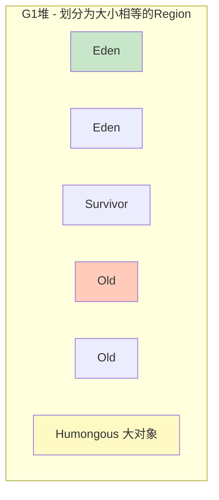

# 精通垃圾收集器 G1 与 ZGC

> 收集器是 GC 算法（[J17](./J17-精通-垃圾回收算法.md)）的具体实现。从串行的 Serial 到并发的 CMS、Region 化的 G1、亚毫秒停顿的 ZGC，演进主线是**不断降低 STW 停顿**。本篇讲清主流收集器的原理、区别和选型——这是 JVM 调优的核心。
>
> **📅 基准：Java 17/21。** G1 是默认收集器；ZGC/Shenandoah 是低延迟新锐。

---

## 一、收集器全景与发展

| 收集器 | 出现 | 特点 | 状态（2026） |
|---|---|---|---|
| Serial / Serial Old | 最早 | 单线程、STW，简单 | 客户端/小堆仍用 |
| Parallel Scavenge / Old | JDK 5+ | 多线程、吞吐优先 | JDK 8 默认 |
| CMS | JDK 5+ | 并发标记清除、低延迟 | **JDK 9 弃用，JDK 14 移除** |
| **G1** | JDK 7+ | Region 化、可预测停顿 | **JDK 9+ 默认** |
| **ZGC** | JDK 11+ | 染色指针、亚毫秒停顿 | JDK 21 分代 ZGC，生产可用 |
| Shenandoah | JDK 12+ | 并发整理、低延迟 | OpenJDK 可用 |
| Epsilon | JDK 11+ | 不回收（测试用） | 特殊场景 |

演进主线：**吞吐优先（Parallel）→ 低延迟（CMS）→ 兼顾可预测停顿（G1）→ 极低延迟（ZGC/Shenandoah）**。

---

## 二、收集器分类

- **按作用区域**：新生代收集器（Serial/ParNew/Parallel Scavenge）、老年代收集器（Serial Old/Parallel Old/CMS）、整堆收集器（G1/ZGC）。
- **按线程**：串行（单线程 GC，STW）、并行（多线程 GC，但仍 STW）、并发（GC 线程与应用线程同时跑，减少 STW）。

关键概念：
- **并行（Parallel）**：多个 GC 线程同时回收，但应用线程仍暂停（缩短 STW 时长）。
- **并发（Concurrent）**：GC 线程和应用线程**同时运行**（应用基本不停），是低延迟收集器的核心（需要三色标记 + 读写屏障，见 [J17](./J17-精通-垃圾回收算法.md)）。

---

## 三、CMS

**CMS（Concurrent Mark Sweep）** 是第一个真正意义的并发收集器，目标低延迟（老年代）。四个阶段：

1. **初始标记**（STW，短）：标记 GC Roots 直接关联的对象。
2. **并发标记**（不停顿）：从根遍历整个对象图，与应用并发。
3. **重新标记**（STW，短）：修正并发期间变动的对象（用**增量更新**处理漏标，见 [J17](./J17-精通-垃圾回收算法.md)）。
4. **并发清除**（不停顿）：清除垃圾。

CMS 的问题（导致被淘汰）：
- 用**标记-清除**算法 → **内存碎片**（碎片多到放不下大对象时退化为 Serial Old 做 Full GC，长 STW）。
- **浮动垃圾**：并发清除期间产生的新垃圾本次不清；且要预留空间给并发期间的分配，预留不够会触发 "Concurrent Mode Failure" → Full GC。
- CPU 敏感（并发占用 CPU）。

**JDK 9 弃用、14 移除**——G1 取代了它。

---

## 四、G1

**G1（Garbage First）** 是 JDK 9+ 的默认收集器，核心创新是 **Region 化**和**可预测停顿**。



- **Region 化**：把堆划分成多个大小相等的 Region（默认堆/2048），每个 Region 动态扮演 Eden/Survivor/Old/Humongous（大对象）角色——**不再有物理上固定连续的新生代/老年代**，逻辑上分代、物理上分散。
- **可预测停顿（核心卖点）**：通过 `-XX:MaxGCPauseMillis`（默认 200ms）设定停顿目标，G1 维护每个 Region 的回收价值（垃圾多少、回收耗时），**优先回收垃圾最多、性价比最高的 Region**（"Garbage First" 的由来），在目标停顿时间内尽量多回收。
- **算法**：整体看是"标记-整理"（Region 间复制），不产生碎片（这是相比 CMS 的关键优势）。
- **SATB**：并发标记用 SATB 处理漏标（见 [J17](./J17-精通-垃圾回收算法.md)）。
- **Remembered Set（RSet）**：每个 Region 记录"谁引用了我"（跨 Region 引用），使得回收单个 Region 时不用扫全堆。

---

## 五、G1 的回收过程

- **Young GC**：Eden 满时回收新生代 Region（复制存活到 Survivor/Old），STW（并行）。
- **并发标记周期**：老年代占用达阈值（`-XX:InitiatingHeapOccupancyPercent`，默认 45%）触发，并发标记整堆存活对象（初始标记 STW、并发标记、最终标记 STW、清理）。
- **Mixed GC（混合回收）**：并发标记后，G1 同时回收**新生代 + 部分价值高的老年代 Region**（这是 G1 控制老年代、避免 Full GC 的关键），分多次进行。
- **Full GC（兜底）**：如果回收速度跟不上分配（如 Mixed GC 来不及），退化为 Full GC（Serial 单线程整理，长 STW）——要避免，是 G1 调优的重点。

G1 适合**大堆 + 低延迟要求**（几 GB 到几十 GB），是当前最通用的收集器。

---

## 六、ZGC

**ZGC** 是面向**超大堆 + 极低延迟**的收集器，停顿时间**不随堆大小增长**（亚毫秒级，<1ms）。核心技术：

- **染色指针（Colored Pointers）**：把 GC 的标记/重定位信息**直接存在对象指针的高位 bit** 里（而非对象头），读指针时就知道对象的 GC 状态，使得标记和重定位能高效并发。
- **读屏障（Load Barrier）**：每次读对象引用时，读屏障检查指针的颜色——如果对象正在被移动（重定位），就**自愈（self-healing）**：当场更新引用指向新地址。这让 ZGC 能**并发整理（移动对象）**而应用几乎不停。
- **几乎全程并发**：标记、重定位（整理）都并发进行，STW 只在极短的根扫描等阶段，停顿降到亚毫秒且与堆大小无关。
- **分代 ZGC（Java 21）**：引入分代（年轻代/老年代分开回收），大幅提升吞吐（之前 ZGC 不分代，吞吐略低）。

CMS/G1 的停顿会随堆增大而变长，ZGC 靠染色指针 + 读屏障突破了这个限制——TB 级堆也能亚毫秒停顿。代价是读屏障有一定吞吐开销、内存占用略高。

---

## 七、收集器选型

| 需求 | 推荐 |
|---|---|
| 吞吐优先、批处理（不在乎停顿） | Parallel |
| 通用、大堆、低延迟（默认选择） | **G1** |
| 超大堆（几十 GB~TB）、极致低延迟 | **ZGC** / Shenandoah |
| 小内存、客户端 | Serial |

核心权衡是**吞吐（throughput）vs 延迟（latency）**：
- 吞吐优先：单位时间内多干活、容忍较长 STW → Parallel。
- 延迟优先：每次停顿尽量短、容忍一点吞吐损失 → G1 / ZGC。

实践：大多数后端服务用 **G1**（默认、均衡）；对停顿极敏感（如金融交易、低延迟系统）且大堆用 **ZGC**。

---

## 八、常见参数与考点

```bash
-XX:+UseG1GC                      # 用 G1（JDK9+ 默认）
-XX:MaxGCPauseMillis=200          # G1 停顿目标
-XX:+UseZGC -XX:+ZGenerational    # 用分代 ZGC（JDK21）
-Xms4g -Xmx4g                     # 堆大小（建议 Xms=Xmx 避免动态调整）
-XX:+HeapDumpOnOutOfMemoryError   # OOM 时自动 dump（排查必备，见 J19）
```

考点：
- **G1 vs CMS**：G1 用标记-整理无碎片、可预测停顿、Region 化；CMS 标记-清除有碎片、已被移除。
- **为什么 ZGC 停顿不随堆增大**：染色指针 + 读屏障让标记和整理并发，STW 只在极小的固定阶段。
- **Full GC 要避免**：G1/ZGC 的 Full GC 是兜底退化，长 STW，调优目标之一是消除频繁 Full GC。

---

## 陷阱清单

- **还在用 CMS**：JDK 14 已移除，新项目用 G1/ZGC。
- **以为 G1 有固定连续的新生代/老年代**：G1 是 Region 化，分代是逻辑的、物理分散。
- **MaxGCPauseMillis 设太小**：目标停顿过小会导致每次回收的 Region 太少、GC 频繁、吞吐下降，反而更糟。
- **频繁 Full GC 不排查**：G1 退化 Full GC 是危险信号（通常是 Mixed GC 跟不上分配、大对象过多、堆太小），要调优。
- **大对象（Humongous）过多**：超过 Region 一半的大对象占用连续 Region，易触发 Full GC。
- **ZGC 当万能药**：ZGC 低延迟但有读屏障吞吐开销和更高内存占用，吞吐优先场景不一定划算。
- **Xms ≠ Xmx**：堆动态扩缩有开销和停顿，生产建议设相等。

---

## 2026 现状

- **G1 是绝对主流默认**：JDK 9+ 默认，覆盖绝大多数后端服务（几 GB ~ 几十 GB 堆）。
- **分代 ZGC 走向生产**：Java 21 的分代 ZGC 解决了原 ZGC 吞吐偏低的问题，超大堆 + 极低延迟场景（如大数据、实时系统）越来越多采用。
- **CMS 彻底退役**：作为面试"演进史"知识仍要懂，但生产不再使用。
- **云原生 GC 调优**：容器内存感知（-XX:MaxRAMPercentage）+ G1/ZGC + 监控（JFR/Prometheus）是标准实践（见 [J19](./J19-精通-JVM调优与故障排查.md)、[J15](./J15-精通-JVM运行时内存结构.md)）。
- **GC 日志统一**：JDK 9+ 统一用 `-Xlog:gc*` 输出 GC 日志，配合 GCEasy 等工具分析。

---

## 练习题

1. 垃圾收集器的发展主线是什么？为什么 CMS 被淘汰了？

<details><summary>参考答案</summary>

发展主线是**不断降低 STW 停顿时间、在吞吐与延迟间取得更好平衡**：从最早单线程 STW 的 Serial，到多线程并行、吞吐优先的 Parallel，到第一个并发收集器 CMS（追求低延迟），再到 Region 化、可预测停顿的 G1（JDK9+ 默认，兼顾大堆和延迟），最后到染色指针 + 读屏障、停顿不随堆增大的 ZGC/Shenandoah（亚毫秒级延迟）。**CMS 被淘汰的原因**：①它采用标记-清除算法，会产生大量**内存碎片**——碎片严重到无法为大对象分配连续空间时，会退化为 Serial Old 进行一次单线程的 Full GC，造成很长的 STW，违背了它低延迟的初衷；②**浮动垃圾和 Concurrent Mode Failure**——并发清除期间应用还在产生新垃圾（浮动垃圾本轮清不掉），且 CMS 必须预留一部分空间给并发期间的对象分配，如果预留不足（老年代被占满）就触发 Concurrent Mode Failure、退化为 Full GC；③对 CPU 资源敏感（并发阶段占用 CPU 影响应用吞吐）。这些固有缺陷加上 G1 的出现（无碎片、可预测停顿、更适合大堆），使 CMS 在 JDK 9 被标记为弃用、JDK 14 被正式移除。

</details>

2. G1 的核心设计（Region 化、可预测停顿）是什么？相比 CMS 有什么优势？

<details><summary>参考答案</summary>

G1 的两大核心设计：①**Region 化**——把整个堆划分为很多个大小相等的小区域（Region，默认约堆大小/2048），每个 Region 可以动态地扮演 Eden、Survivor、Old 或 Humongous（存放大对象）的角色。这样新生代和老年代不再是物理上固定连续的两大块，而是由一组分散的 Region 逻辑组成、角色可动态变化。②**可预测停顿**——用户可通过 `-XX:MaxGCPauseMillis` 设定期望的最大停顿时间，G1 会跟踪每个 Region 的回收价值（垃圾占比、预计回收耗时），每次回收时**优先选择回收价值最高（垃圾最多、最划算）的那些 Region**（这就是 "Garbage First" 名字的由来），并尽量在设定的停顿目标内完成，从而让停顿时间可控、可预测。相比 CMS 的优势：①G1 整体采用**标记-整理（Region 间复制）**，**不产生内存碎片**（CMS 的标记-清除会碎片化，是其大缺陷）；②停顿**可预测、可配置**（CMS 停顿不可控、且可能因碎片/CMF 退化为长 Full GC）；③Region 化让它能高效管理**大堆**、按需回收部分老年代（Mixed GC），避免对整个老年代的长时间回收；④用 SATB + RSet 实现高效的并发标记和跨 Region 引用追踪。因此 G1 成为 JDK 9+ 的默认收集器，适合大堆、低延迟的通用场景。

</details>

3. G1 的 Mixed GC 是什么？为什么 Full GC 是要避免的？

<details><summary>参考答案</summary>

**Mixed GC（混合回收）** 是 G1 的关键特性：当老年代占用达到阈值（默认 IHOP=45%）时，G1 启动并发标记周期标记出整堆的存活情况；之后进行的回收不只回收新生代，而是**同时回收新生代的全部 Region + 部分回收价值高的老年代 Region**（"混合"即新生代+部分老年代），并且分多次（多个回收暂停）逐步把垃圾多的老年代 Region 收掉。Mixed GC 让 G1 能以可控的停顿持续清理老年代、避免老年代被填满，是 G1 不需要频繁 Full GC 的核心机制。**Full GC 要避免的原因**：在 G1 中 Full GC 是一种**兜底的退化行为**——当对象分配速度超过了 G1 并发回收（Mixed GC）的速度、老年代被占满又来不及回收时（或大对象过多、堆太小），G1 会退化为 Full GC。而 G1 的 Full GC（早期是单线程、后来虽多线程化但仍）是对整个堆做标记-整理，会造成**很长的 STW 停顿**，严重影响服务响应（可能秒级停顿），违背 G1 低延迟的目标。频繁 Full GC 通常意味着堆太小、对象晋升过快、大对象过多或参数不当，是性能告警信号，调优的重要目标就是消除频繁 Full GC（如增大堆、调整 IHOP、减少大对象、优化对象生命周期）。

</details>

4. ZGC 为什么能做到停顿时间不随堆大小增长？它用了什么关键技术？

<details><summary>参考答案</summary>

传统收集器（如 G1）的 STW 停顿会随堆增大而变长，因为根扫描、最终标记、整理等需要 STW 的工作量与存活对象/堆大小相关。ZGC 通过两项关键技术把几乎所有耗时工作都变成**与应用并发执行**，从而让 STW 只剩极少量、固定的工作（如根扫描的一小部分），停顿降到亚毫秒级且基本不随堆大小增长：①**染色指针（Colored Pointers）**——ZGC 把对象的 GC 元信息（如是否已标记、是否需要重定位等标志位）直接编码存储在**对象引用指针的高位 bit** 中，而不是存在对象头里。这样通过指针本身就能知道对象的 GC 状态，无需访问对象，使并发标记和并发重定位的状态判断非常高效。②**读屏障（Load Barrier）**——在应用每次从堆中读取对象引用时插入一段读屏障代码，检查该指针的颜色：如果发现指向的对象正在被 GC 移动（重定位中），读屏障会当场把引用**自愈（self-healing）更新为对象的新地址**，保证应用拿到的总是有效引用。正是读屏障让 ZGC 能够**并发地移动对象（并发整理）**而不暂停应用——这是它区别于 G1（整理阶段需要 STW）的核心。靠这两项技术，ZGC 把标记和整理都并发化，STW 只在极短的固定阶段，所以停顿时间稳定在亚毫秒级、几乎与堆大小无关（支持 TB 级大堆）。代价是读屏障带来一定吞吐开销、内存占用略高（Java 21 的分代 ZGC 改善了吞吐）。

</details>

5. 如何在 Parallel、G1、ZGC 之间做选型？核心权衡是什么？

<details><summary>参考答案</summary>

核心权衡是**吞吐量（throughput）与延迟（停顿时间 latency）**之间的取舍，再结合堆大小。选型：①**Parallel（吞吐优先）**——多线程并行回收、追求单位时间内完成最多工作，但 STW 停顿相对较长。适合后台批处理、数据计算等"不在乎单次停顿、只要总吞吐高"的场景。②**G1（均衡，默认首选）**——可预测停顿 + 无碎片 + 适合大堆，在吞吐和延迟间取得良好平衡，是绝大多数在线后端服务的默认且推荐选择（堆几 GB 到几十 GB、要求停顿可控但不极端）。③**ZGC / Shenandoah（延迟优先）**——亚毫秒级停顿且不随堆增大，适合**超大堆（几十 GB 到 TB）+ 对停顿极度敏感**的场景（如金融交易、实时风控、低延迟系统、大内存缓存服务）；代价是读屏障带来的吞吐开销和略高内存占用。决策思路：先看延迟要求——能容忍较长停顿、追求吞吐选 Parallel；要低延迟选 G1；要极致低延迟且堆很大选 ZGC。再看堆大小——小堆用 Serial/Parallel/G1 都行，超大堆优先 ZGC。实践中大多数在线服务用 G1（均衡又是默认），只有停顿要求苛刻或堆特别大才上 ZGC。最终都应结合压测和 GC 监控数据验证调整。

</details>

6. 为什么生产环境建议把 -Xms 和 -Xmx 设置成相等？

<details><summary>参考答案</summary>

建议 -Xms（初始堆大小）= -Xmx（最大堆大小）的原因：①**避免堆动态扩缩容的开销和停顿**——如果 Xms 小于 Xmx，JVM 启动时只分配 Xms 大小的堆，运行中随着对象增多堆不够用时会逐步向操作系统申请扩展堆（最多到 Xmx），堆收缩时又会归还内存。这种动态调整伴随着内存分配/释放、可能触发 GC 和短暂停顿，带来性能抖动和不可预测的延迟。把两者设为相等，JVM 启动时就一次性把堆固定下来，运行期间不再扩缩，避免了这些开销和抖动，性能更平稳可预测。②**更快进入稳定状态、避免启动初期频繁 GC**——初始堆太小会导致应用启动、预热阶段频繁触发 GC。③**便于容量规划和监控**——堆大小固定，便于评估进程总内存（堆 + 元空间 + 栈 + 直接内存，见 J15）、设置容器内存限制，避免被 OOMKilled。所以生产服务（尤其延迟敏感的在线服务）通常把 Xms 和 Xmx 设成相同的值，让堆"一步到位"、稳定运行。代价是启动即占用最大内存，但对长期运行的服务这是值得的。

</details>
