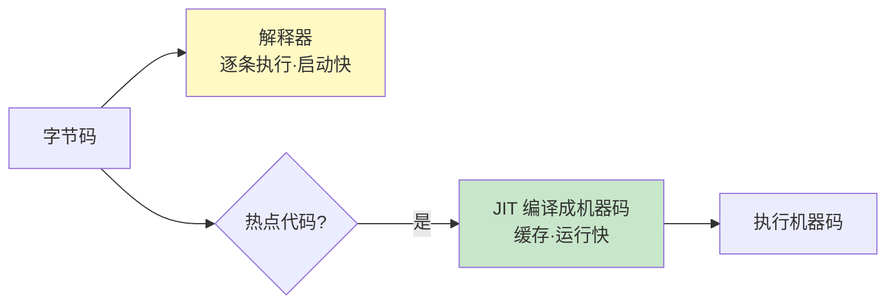

# 精通字节码与执行引擎

> Java "一次编写、到处运行"靠的是字节码 + JVM。`.java` 编译成 `.class` 字节码，由 JVM 的执行引擎解释执行或 JIT 编译成机器码。理解字节码、操作数栈、JIT 分层编译，能解释"为什么 Java 热点代码越跑越快"。本篇是 JVM 模块（J15-J21）的收尾。
>
> **📅 基准：Java 17/21（HotSpot）。**

---

## 一、class 文件结构

`.class` 是与平台无关的二进制文件，结构固定：

| 部分 | 内容 |
|---|---|
| 魔数 Magic | 固定 `0xCAFEBABE`，标识这是 class 文件 |
| 版本号 | 主/次版本（编译用的 JDK 版本，决定能否被某 JVM 加载） |
| **常量池** | 字面量 + 符号引用（类/方法/字段名），class 文件的核心 |
| 访问标志 | public/final/abstract 等 |
| 类/父类/接口 | 继承体系 |
| 字段表 | 字段信息 |
| 方法表 | 方法信息（含字节码） |
| 属性表 | 如 Code（方法字节码）、行号、注解等 |

"一次编写到处运行"的关键就是：字节码是统一格式，不同平台的 JVM 都能加载执行同一份 class（JVM 屏蔽了平台差异）。`javap -c` 可反编译看字节码。

---

## 二、字节码指令

JVM 是**基于栈（操作数栈）的虚拟机**（不是基于寄存器），字节码指令围绕操作数栈工作。指令分类：

| 类别 | 例子 | 作用 |
|---|---|---|
| 加载/存储 | `iload`、`istore`、`aload` | 局部变量表 ↔ 操作数栈 |
| 运算 | `iadd`、`isub`、`imul` | 操作数栈上运算 |
| 类型转换 | `i2l`、`f2i` | 类型转换 |
| 对象操作 | `new`、`getfield`、`putfield` | 创建对象、读写字段 |
| 栈操作 | `dup`、`pop`、`swap` | 操作数栈管理 |
| 控制转移 | `ifeq`、`goto`、`tableswitch` | 分支、循环 |
| 方法调用 | `invokevirtual` 等 | 见第四节 |

基于栈的设计**可移植性好**（不依赖具体 CPU 寄存器），但指令多、执行略慢（靠 JIT 弥补）。

---

## 三、操作数栈与局部变量表

每个方法执行对应一个**栈帧**（见 [J15](./J15-精通-JVM运行时内存结构.md)），栈帧里有局部变量表和操作数栈。看 `int c = a + b` 怎么执行：

```
iload_1      // 把局部变量 a 压入操作数栈
iload_2      // 把局部变量 b 压入操作数栈
iadd         // 弹出栈顶两个数相加，结果压回栈
istore_3     // 把结果弹出，存入局部变量 c
```

- **局部变量表**：存方法参数和局部变量（按 slot 索引）。
- **操作数栈**：运算的工作台——指令把数据压栈、运算、出栈。
- 所有计算都在操作数栈上完成（"基于栈"的含义）。理解这点能看懂 `javap` 反编译的字节码。

---

## 四、方法调用指令

五条方法调用指令（高频考点，涉及多态实现）：

| 指令 | 调用什么 | 绑定 |
|---|---|---|
| `invokestatic` | 静态方法 | 静态绑定（编译期定） |
| `invokespecial` | 构造方法、private 方法、super 调用 | 静态绑定 |
| `invokevirtual` | 普通实例方法（虚方法） | **动态绑定**（运行期按实际类型查） |
| `invokeinterface` | 接口方法 | 动态绑定 |
| `invokedynamic` | 动态语言/Lambda | 运行期决定（Lambda、字符串拼接用） |

- **静态绑定**：`invokestatic`/`invokespecial` 调用的方法在编译期就确定（静态方法、私有方法、构造器不会被重写）。
- **动态绑定（多态的实现）**：`invokevirtual`/`invokeinterface` 在运行期根据对象的**实际类型**，通过方法表（vtable）找到要调用的具体方法——这就是 Java **多态/方法重写**的底层机制。
- `invokedynamic`：Java 7 引入，支持运行期动态确定调用目标，**Lambda 表达式**和**字符串拼接**（[J03](./J03-精通-String与不可变设计.md)）底层都用它。

---

## 五、执行引擎：解释器 + JIT

JVM 执行字节码有两种方式，HotSpot 默认**混合模式（解释 + 编译）**：

- **解释器（Interpreter）**：逐条读字节码、翻译执行。**启动快**（无需编译，立即执行），但**运行慢**（每次都翻译）。
- **JIT（Just-In-Time，即时编译器）**：把**热点代码**（频繁执行的方法/循环）编译成本地机器码缓存起来，之后直接跑机器码。**编译有开销但运行快**。



混合模式取两者之长：**启动时用解释器快速运行，热点代码被 JIT 编译后高速执行**——这就是"Java 程序越跑越快"（热点逐渐被编译优化）的原因。

---

## 六、JIT 编译

HotSpot 有两个 JIT 编译器 + 分层编译：

- **C1（Client Compiler）**：编译快、优化少，适合启动和短任务。
- **C2（Server Compiler）**：编译慢、优化深（激进优化），适合长期运行的热点代码。
- **分层编译（Tiered Compilation，默认）**：结合 C1 和 C2——先解释执行收集信息，再用 C1 快速编译，对最热的代码再用 C2 深度优化，逐层升级，兼顾启动速度和峰值性能。

**热点探测**：怎么判断"热点"？用**计数器**：
- 方法调用计数器：方法被调用多少次。
- 回边计数器：循环体执行多少次（"回边"指循环跳回）。
- 超过阈值就触发 JIT 编译该方法/循环。

---

## 七、JIT 优化

JIT（尤其 C2）能做很多激进优化，这是 Java 运行时性能的关键：

- **方法内联（Inlining）**：把被频繁调用的小方法直接"复制"到调用处，消除方法调用开销，并为其他优化创造条件（最重要的优化之一）。
- **逃逸分析相关**：栈上分配、标量替换、锁消除（见 [J20](./J20-精通-对象内存布局与逃逸分析.md)）。
- **循环优化**：循环展开、循环不变量外提。
- **去虚化（Devirtualization）**：把虚方法调用优化成直接调用（当运行期发现实际只有一个实现）。
- **公共子表达式消除、死代码消除**等。

正因为有运行期 profile 引导的 JIT 优化，**长期运行的 Java 程序峰值性能可媲美 C++**（JIT 能基于实际运行数据做比静态编译更激进的优化）。

---

## 八、AOT 与 GraalVM

JIT 是运行期编译，启动有"预热"过程（热点还没编译时较慢）。**AOT（Ahead-Of-Time，提前编译）** 在构建期就把字节码编译成机器码：

- **GraalVM 原生镜像（Native Image）**：把 Java 程序在构建期 AOT 编译成独立的原生可执行文件，**启动极快（毫秒级）、内存占用低、无需 JVM 预热**。代价：构建期闭世界假设，**反射/动态代理/动态类加载受限**（需配置元数据），失去运行期 JIT 的峰值优化（长跑性能可能不如 JIT）。
- 适合 **Serverless、CLI、微服务**（看重启动速度和内存，见 [J25](./J25-精通-Spring-MVC.md)/[J26](./J26-精通-SpringBoot自动配置.md)）。
- **取舍**：JIT 启动慢但长跑峰值高；AOT 启动快内存省但峰值和动态性受限。云原生（Spring Boot 3 + GraalVM）推动 AOT 落地。

---

## 陷阱清单

- **以为 Java 纯解释执行（慢）**：HotSpot 是解释 + JIT 混合，热点编译成机器码后很快。
- **以为 Java 启动就达峰值性能**：有预热过程，热点被 JIT 编译后才达峰值（压测要预热）。
- **混淆静态绑定和动态绑定**：static/private/构造器是静态绑定（invokestatic/special），重写的实例方法是动态绑定（invokevirtual，多态基础）。
- **以为 Lambda 是匿名内部类语法糖**：Lambda 用 invokedynamic 实现，不是简单的匿名类（不生成额外 class、延迟到运行期）。
- **GraalVM 原生镜像随便用反射**：构建期闭世界，反射/动态代理要配置元数据，否则运行失败。
- **小 benchmark 不预热就测**：解释执行阶段的数据不代表 JIT 编译后的真实性能。用 JMH（[J19](./J19-精通-JVM调优与故障排查.md) 相关）。

---

## 2026 现状

- **分层编译是默认**：C1 + C2 分层，兼顾启动和峰值，是 HotSpot 标准执行模式。
- **GraalVM 走向主流**：Spring Boot 3 + GraalVM 原生镜像在 Serverless/微服务冷启动优化中越来越普及；Graal JIT 编译器（用 Java 写的 JIT）也是亮点。
- **invokedynamic 应用扩大**：Lambda、字符串拼接、record、模式匹配等新特性底层大量用 invokedynamic，运行期更灵活。
- **CDS/AppCDS + AOT 缓存**：Java 通过类数据共享、AOT 缓存等手段缩短启动预热，Project Leyden 正探索更彻底的提前计算/编译以改善启动和峰值。
- **字节码仍是基础**：理解字节码对看懂反编译、排查、理解新特性实现仍重要。

---

## 练习题

1. Java 为什么能"一次编写、到处运行"？字节码在其中起什么作用？

<details><summary>参考答案</summary>

Java 实现"一次编写、到处运行（Write Once, Run Anywhere）"的核心机制是**字节码 + JVM 的分层抽象**。Java 源代码（.java）先由 javac 编译成与平台无关的**字节码（.class 文件）**——字节码是一种统一的、面向 JVM 的中间指令格式，它不针对任何具体的 CPU 架构或操作系统，只面向抽象的 Java 虚拟机。然后，不同平台（Windows/Linux/Mac、x86/ARM）上各自安装对应平台的 JVM，由 JVM 负责把同一份字节码解释执行或 JIT 编译成该平台的本地机器码来运行。也就是说，**平台差异被 JVM 屏蔽了**：开发者只需编译出一份字节码，它能在任何安装了符合规范的 JVM 的平台上运行，而无需为每个平台重新编译源码。字节码在其中扮演"平台无关的通用中间语言"角色——它是连接"一次编写的源码"和"到处运行的各平台"的桥梁。所以真正"跨平台"的是字节码 + 各平台的 JVM 实现，而不是 Java 源码本身。代价是需要在目标机器上有 JVM、且有解释/编译的运行时开销（用 JIT 优化弥补）。

</details>

2. JVM 是基于栈还是基于寄存器的？`int c = a + b` 的字节码是怎么执行的？

<details><summary>参考答案</summary>

JVM 是**基于栈（操作数栈）**的虚拟机，而不是基于寄存器的。它的字节码指令通过对每个方法栈帧中的"操作数栈"压栈、出栈来完成运算，而不像基于寄存器的机器那样直接操作寄存器。以 `int c = a + b`（a、b、c 是局部变量）为例，对应的字节码大致是：①`iload_1`——把局部变量表中索引 1 处的值（a）加载、压入操作数栈；②`iload_2`——把局部变量 b 压入操作数栈（此时栈里有 a、b）；③`iadd`——从操作数栈弹出栈顶的两个 int（a 和 b），相加，把结果压回操作数栈；④`istore_3`——把操作数栈顶的结果弹出，存入局部变量表索引 3 处（即 c）。可见所有运算都在操作数栈上"压入操作数 → 执行运算 → 结果出栈/入栈"地进行，局部变量表负责存放变量、操作数栈负责充当运算的临时工作台。基于栈的设计优点是与具体 CPU 寄存器无关、可移植性好（同一字节码各平台都能跑）；缺点是指令数较多、单纯解释执行偏慢，但通过 JIT 编译成机器码来弥补性能。用 `javap -c` 反编译就能看到这些字节码指令。

</details>

3. 五条方法调用字节码指令分别用于什么？哪些是动态绑定（多态的基础）？

<details><summary>参考答案</summary>

五条方法调用指令：①**invokestatic**——调用静态方法（static），静态绑定（编译期就确定目标方法）；②**invokespecial**——调用需要特殊处理、不会被重写的方法：构造方法 `<init>`、private 私有方法、以及通过 super 调用的父类方法，静态绑定；③**invokevirtual**——调用普通的（非 private、非 static、非 final 的）实例方法即"虚方法"，**动态绑定**；④**invokeinterface**——调用接口中声明的方法，**动态绑定**；⑤**invokedynamic**——Java 7 引入，用于在运行期动态确定调用目标，支持动态语言，Java 中 Lambda 表达式、字符串拼接（StringConcatFactory）等底层用它。其中**动态绑定（运行期根据对象实际类型确定调用哪个方法）的是 invokevirtual 和 invokeinterface**——这正是 Java **多态/方法重写**的底层实现：调用一个虚方法时，JVM 在运行期根据对象的实际类型，通过方法表（vtable）找到该类型真正要执行的方法版本，所以父类引用指向子类对象时调用的是子类重写的方法。而 invokestatic 和 invokespecial 是静态绑定——静态方法、私有方法、构造器都不能被重写，编译期即可确定唯一目标，无需运行期分派。理解这点能解释为什么 static/private 方法没有多态、而普通实例方法有多态。

</details>

4. 解释器和 JIT 编译器各有什么优缺点？HotSpot 的混合模式如何取长补短？

<details><summary>参考答案</summary>

**解释器（Interpreter）**：逐条读取字节码、即时翻译成机器动作并执行。优点是**启动快**——程序一开始就能立即运行，无需等待编译；缺点是**执行慢**——每次执行同一段代码都要重新解释翻译，没有缓存优化，运行效率低。**JIT 编译器（Just-In-Time）**：把热点代码（频繁执行的方法/循环）整体编译成本地机器码并缓存，之后直接执行机器码。优点是**运行快**——编译后的机器码执行效率高，还能做内联、逃逸分析等深度优化；缺点是**编译有开销**（编译本身耗时和占 CPU/内存），如果对所有代码都编译、或对只跑一两次的代码编译则得不偿失，且编译需要时间（启动期有"预热"）。**HotSpot 的混合模式取长补短**：程序启动时先用**解释器**快速执行字节码，保证启动速度和即时可用；同时运行期通过计数器**探测热点代码**（被反复调用的方法、反复执行的循环），只对这些真正频繁、值得优化的热点代码触发 **JIT 编译**成机器码缓存起来，让它们后续高速执行；冷门、只跑少数几次的代码就一直解释执行，不浪费编译成本。这样既有解释器的快速启动，又有 JIT 对热点的高性能，还避免了对全部代码编译的浪费——这就是为什么 Java 程序"启动后越跑越快"（热点逐渐被编译优化、性能爬升到峰值）。

</details>

5. 什么是分层编译？JVM 如何判断"热点代码"？

<details><summary>参考答案</summary>

**分层编译（Tiered Compilation）** 是 HotSpot 结合两个 JIT 编译器（C1 和 C2）的策略，默认开启。C1（Client 编译器）编译速度快但优化程度较低，C2（Server 编译器）优化深入、生成代码质量高但编译慢、耗资源。分层编译把执行分成多个层级逐步升级：代码先由**解释器**执行并收集性能统计信息；当达到一定热度后用 **C1 快速编译**（带一些 profiling），获得初步的机器码加速；对其中**最热**的代码，再用 **C2 进行深度优化编译**（基于收集到的运行 profile 做激进优化）。这样既能快速获得编译加速（C1 启动快）、又能让最热点代码享受 C2 的极致优化（峰值性能高），兼顾启动速度和长期峰值性能。**判断热点代码**靠两类计数器：①**方法调用计数器**——统计一个方法被调用的次数；②**回边计数器（back-edge counter）**——统计循环体执行的次数（"回边"指循环结尾跳回循环开头的那条边，用于探测热循环，即使一个方法只调用一次但内部有大循环也能被识别为热点）。当某方法的调用计数或某循环的回边计数超过设定阈值，JVM 就判定它是热点、触发 JIT 编译（循环热点还可能触发"栈上替换 OSR"，在循环执行中途切换到编译后的代码）。简言之：分层编译 = C1 快编 + C2 深优逐层升级；热点探测 = 方法调用计数 + 循环回边计数 超阈值。

</details>

6. JIT 有哪些重要优化？为什么说长期运行的 Java 程序峰值性能能媲美 C++？

<details><summary>参考答案</summary>

JIT（尤其 C2）的重要优化包括：①**方法内联（Inlining）**——把频繁调用的小方法体直接嵌入调用处，消除方法调用的开销，并为后续其他优化（常量传播、逃逸分析等）创造更大的优化范围，是最关键的优化之一；②**逃逸分析相关优化**——栈上分配、标量替换、锁消除（对不逃逸对象，见 J20），减少堆分配、GC 压力和无谓加锁；③**循环优化**——循环展开、循环不变量外提（把循环内不变的计算提到循环外）；④**去虚化（Devirtualization）**——当运行期发现某个虚方法调用实际只有一个实现时，把动态分派优化成直接调用甚至内联；⑤公共子表达式消除、死代码消除、常量折叠等。**长期运行的 Java 程序峰值性能能媲美 C++** 的原因：JIT 是**基于运行时真实 profile（性能剖析数据）**进行编译优化的——它能观察到程序实际的执行路径、分支倾向、类型分布、哪些方法是热点、哪些虚调用实际只有一种实现等运行期信息，从而做出比"静态提前编译（如 C++ 编译器只能基于静态分析）"更有针对性、更激进的优化（如根据实际只走某分支去激进内联和去虚化，万一假设失效再去优化回退/重编译）。再加上方法内联、逃逸分析等优化消除了 Java 的很多抽象开销，所以当程序运行足够久、热点被 C2 充分优化后，其峰值执行效率可以接近甚至在某些场景超过静态编译的 C++。代价是启动有预热期（热点编译前较慢）、JIT 编译本身占用 CPU/内存——这也是 AOT（GraalVM 原生镜像）作为另一种取舍出现的原因（启动快但失去运行期 profile 引导的峰值优化）。

</details>
