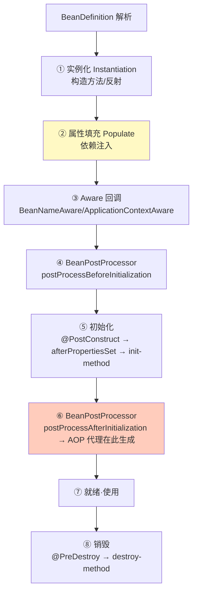

# 精通 Spring IOC 容器

> Spring 是 Java 后端的事实标准，而 IOC（控制反转）是 Spring 的根基。Bean 怎么被创建、注入、管理？Bean 的生命周期有哪些阶段？BeanFactory 和 ApplicationContext 有什么区别？本篇讲透 IOC 容器，是理解 [J23 AOP](./J23-精通-Spring-AOP.md)、[J24 事务/循环依赖](./J24-精通-Spring事务与循环依赖.md) 的基础。
>
> **📅 基准：Spring 6 / Spring Boot 3（基线 Java 17，Jakarta EE）。**

---

## 一、IOC 与 DI

- **IOC（Inversion of Control，控制反转）**：把对象的创建和依赖管理**交给容器**，而不是自己 `new`。控制权从程序员"反转"给了 Spring 容器。
- **DI（Dependency Injection，依赖注入）**：IOC 的实现方式——容器在创建对象时，自动把它依赖的其他对象"注入"进来。

```java
// 传统：自己 new 依赖，强耦合
class OrderService {
    private UserService userService = new UserServiceImpl(); // 写死依赖
}

// IOC/DI：容器注入，解耦
@Service
class OrderService {
    private final UserService userService;
    OrderService(UserService userService) { // 容器注入实现
        this.userService = userService;
    }
}
```

**好处**：解耦（依赖接口而非具体实现）、易测试（可注入 mock）、易管理（容器统一控制生命周期、单例、AOP）。

---

## 二、Bean 与容器

- **Bean**：由 Spring 容器管理的对象。
- 两大容器接口：

| | BeanFactory | ApplicationContext |
|---|---|---|
| 定位 | 最底层容器接口，提供基本的 Bean 获取 | BeanFactory 的子接口，功能更全 |
| 加载 | 懒加载（getBean 时才创建） | **预加载**（容器启动就创建单例 Bean） |
| 功能 | 仅基础 DI | 加上：国际化、事件发布、资源加载、AOP 等企业功能 |
| 使用 | 很少直接用 | **实际开发用的都是它**（如 AnnotationConfigApplicationContext） |

ApplicationContext 在启动时就实例化所有单例 Bean（fail-fast，配置错误启动就报，而非运行时才暴露）。

---

## 三、Bean 的生命周期

**这是 Spring 最核心的考点。** 一个 Bean 从创建到销毁的主要阶段：



关键点：
- **实例化和初始化是两回事**：实例化是 new 出对象（构造），初始化是属性填充后执行初始化逻辑（@PostConstruct 等）。
- **依赖注入在属性填充阶段**（②），所以构造器注入在实例化时、字段/setter 注入在属性填充时。
- **AOP 代理在 ⑥ postProcessAfterInitialization 生成**——这就是为什么循环依赖三级缓存要处理代理（见 [J24](./J24-精通-Spring事务与循环依赖.md)）。
- 三类初始化回调顺序：`@PostConstruct` → `InitializingBean.afterPropertiesSet` → 自定义 `init-method`。

---

## 四、依赖注入方式

| 方式 | 写法 | 评价 |
|---|---|---|
| **构造器注入** | 构造方法参数 | **推荐**：依赖不可变（final）、不为 null、便于测试、能暴露循环依赖 |
| Setter 注入 | set 方法 + @Autowired | 适合可选依赖，可重新注入 |
| 字段注入 | 字段上 @Autowired | 最简洁但**不推荐**：无法 final、隐藏依赖、难测试、易循环依赖 |

```java
// 推荐：构造器注入（Spring 4.3+ 单构造器可省略 @Autowired）
@Service
class OrderService {
    private final UserService userService;
    private final PayService payService;
    OrderService(UserService u, PayService p) { this.userService = u; this.payService = p; }
}
```

Spring 官方和阿里规约都推荐**构造器注入**：依赖显式、不可变、利于发现过多依赖（构造器参数太多说明类职责过重）。

---

## 五、Bean 作用域

| 作用域 | 含义 |
|---|---|
| **singleton**（默认） | 容器内**单例**，全局共享一个实例 |
| **prototype** | 每次 getBean 都创建新实例 |
| request | 每个 HTTP 请求一个（Web） |
| session | 每个会话一个（Web） |
| application | 每个 ServletContext 一个 |

- 默认 **singleton**——所以 **Spring Bean 默认是单例**，要注意**线程安全**（单例 Bean 的可变成员变量被多线程共享，见第八节）。
- prototype Bean 容器不管销毁（创建后交给调用方）。
- 单例 Bean 注入 prototype Bean 要注意：注入的 prototype 只在单例创建时注入一次，之后不会每次都新建（需要用 `@Lookup` 或 ObjectProvider 解决）。

---

## 六、容器扩展点

Spring 强大的扩展性靠这两个后置处理器：

- **BeanPostProcessor**：在每个 Bean **初始化前后**插入逻辑（作用于 Bean 实例）。AOP（生成代理）、`@Autowired`/`@Resource` 注入、`@PostConstruct` 处理都靠它实现。
- **BeanFactoryPostProcessor**：在容器加载完 BeanDefinition 后、实例化 Bean 之前，修改 **BeanDefinition**（作用于 Bean 的定义/元数据）。如 `PropertySourcesPlaceholderConfigurer` 替换 `${}` 占位符、`@Configuration` 处理。

区别：BeanFactoryPostProcessor 改"定义"（早，对元数据动手），BeanPostProcessor 改"实例"（晚，对对象动手）。理解它们就理解了 Spring 的可扩展机制——很多框架功能（AOP、注解处理）都是注册一个后置处理器实现的。

---

## 七、Bean 注册方式

- **注解扫描**：`@Component`（及衍生 `@Service`/`@Repository`/`@Controller`）+ `@ComponentScan` 扫描注册。
- **`@Bean` 方法**：在 `@Configuration` 类里用 `@Bean` 方法返回对象注册（适合注册第三方库的类，无法加注解的）。
- **`@Import`**：导入配置类/Bean。
- **XML**（老）：`<bean>` 配置。
- **编程式**：`registerBeanDefinition`。

现代 Spring Boot 以注解 + `@Configuration`/`@Bean` 为主，XML 基本淘汰。

---

## 八、常见考点

- **单例 Bean 线程安全吗**：Spring 不保证。单例 Bean 如果有**可变的成员变量**且被多线程读写，就有线程安全问题。**无状态 Bean（不存可变状态）天然安全**——所以 Service/DAO 通常设计成无状态。有状态要用 ThreadLocal（[J14](./J14-精通-ThreadLocal.md)）、局部变量或加锁。
- **@Autowired vs @Resource**：`@Autowired`（Spring）默认**按类型**注入（byType），可配 `@Qualifier` 按名字；`@Resource`（JSR-250，Jakarta）默认**按名字**（byName）。
- **@Autowired 注入多个实现**：同类型多个 Bean 时，用 `@Qualifier` 指定、或 `@Primary` 标记首选，否则报 NoUniqueBeanDefinitionException。

---

## 陷阱清单

- **用字段注入 @Autowired**：依赖隐藏、无法 final、难测试、易循环依赖。用构造器注入。
- **单例 Bean 用可变成员变量存请求状态**：多线程共享导致数据错乱。Bean 应无状态，状态用局部变量/ThreadLocal。
- **混淆实例化和初始化**：实例化是 new，初始化是属性填充后的回调（@PostConstruct 等）。
- **单例注入 prototype 期望每次新建**：注入只发生一次，不会每次新建。用 @Lookup/ObjectProvider。
- **@Autowired 同类型多实现不指定**：NoUniqueBeanDefinitionException。用 @Qualifier/@Primary。
- **以为 BeanFactory 和 ApplicationContext 一样**：后者预加载单例、功能全，实际开发用它。
- **构造器参数过多还硬注入**：是类职责过重的信号，应拆分（构造器注入能暴露这个坏味道）。

---

## 2026 现状

- **Spring 6 / Boot 3**：基线 Java 17，`javax`→`jakarta` 命名空间迁移，支持 GraalVM 原生镜像（AOT 处理，见 [J26](./J26-精通-SpringBoot自动配置.md)）。
- **构造器注入是官方推荐默认**：配合 Lombok `@RequiredArgsConstructor` 或 record，构造器注入很简洁。
- **AOT 与原生镜像**：Spring 6 在构建期做 AOT 处理（提前生成 Bean 注册代码、减少运行期反射），以适配 GraalVM 原生镜像的启动速度和闭世界限制（见 [J16](./J16-精通-类加载与双亲委派.md)/[J21](./J21-精通-字节码与执行引擎.md)）。
- **可观测内建**：Spring Boot 3 内置 Micrometer + ObservationAPI，Bean 级别的指标/追踪更易接入（见 [microservices 可观测](../microservices/18-精通-可观测三支柱.md)）。

---

## 练习题

1. 什么是 IOC 和 DI？它们解决了什么问题？

<details><summary>参考答案</summary>

**IOC（控制反转，Inversion of Control）** 是一种设计思想：把对象的创建、依赖关系的维护和生命周期管理，从程序员手动控制（自己 new、自己组装依赖）**反转交给容器（Spring）** 来负责。即"我需要什么依赖，由容器给我"，而不是"我自己去创建依赖"。**DI（依赖注入，Dependency Injection）** 是 IOC 的具体实现方式：容器在创建一个对象时，自动把它所依赖的其他对象（通过构造器、setter 或字段）注入进去。二者关系：IOC 是思想/目标，DI 是手段。解决的问题：①**解耦**——对象不再自己 new 具体的依赖实现，而是依赖抽象（接口），由容器注入具体实现，使得高层模块不依赖低层模块的具体类，符合依赖倒置原则，更换实现无需改代码；②**易测试**——可以方便地注入 mock/stub 依赖做单元测试，不用真实依赖；③**统一管理**——容器集中管理所有 Bean 的创建、单例复用、生命周期、以及织入 AOP（事务、日志等横切功能）；④**降低维护成本**——依赖关系由容器装配，减少了大量手动 new 和组装的样板代码。简言之，IOC/DI 把"对象怎么来、依赖怎么连"的控制权交给框架，让业务代码专注逻辑、松耦合、可测试、易扩展。

</details>

2. 描述 Spring Bean 的生命周期主要阶段。

<details><summary>参考答案</summary>

主要阶段：①**实例化（Instantiation）**——Spring 根据 BeanDefinition 用构造方法（反射）创建 Bean 的实例对象（此时只是个空壳，依赖还没注入）；②**属性填充（Populate）**——进行依赖注入，把这个 Bean 依赖的其他 Bean 注入到它的字段/setter 中（构造器注入则在第①步就完成）；③**Aware 接口回调**——如果 Bean 实现了 BeanNameAware、BeanFactoryAware、ApplicationContextAware 等，回调对应方法，让 Bean 拿到容器相关信息；④**BeanPostProcessor 前置处理**——调用所有 BeanPostProcessor 的 postProcessBeforeInitialization（如处理 @PostConstruct 等）；⑤**初始化（Initialization）**——按顺序执行 @PostConstruct 注解方法 → InitializingBean 的 afterPropertiesSet() → 自定义的 init-method；⑥**BeanPostProcessor 后置处理**——调用 postProcessAfterInitialization，**Spring AOP 的代理对象通常就在这一步生成**（用代理替换原始 Bean）；⑦**Bean 就绪、被使用**；⑧**销毁（Destruction）**——容器关闭时，对单例 Bean 按顺序执行 @PreDestroy 方法 → DisposableBean 的 destroy() → 自定义 destroy-method。关键点：实例化≠初始化（前者是 new，后者是属性注入后的回调）；依赖注入发生在属性填充阶段；AOP 代理在初始化后置处理阶段生成（这也是循环依赖需要三级缓存提前暴露代理的原因，见 J24）。

</details>

3. BeanFactory 和 ApplicationContext 有什么区别？

<details><summary>参考答案</summary>

BeanFactory 是 Spring IOC 容器最底层、最基础的接口，提供最核心的功能——管理 Bean 的定义和获取（getBean）、基本的依赖注入。ApplicationContext 是 BeanFactory 的子接口（扩展），是实际开发中真正使用的容器，在 BeanFactory 基础上增加了大量企业级功能。主要区别：①**加载时机**——BeanFactory 是**懒加载**，只有在第一次 getBean 请求某个 Bean 时才创建它；ApplicationContext 默认在**容器启动时就预先实例化所有单例 Bean**（预加载），这样的好处是"fail-fast"——如果配置有错（如缺少依赖、循环依赖、Bean 创建异常），在启动阶段就立即报错暴露，而不是等到运行时第一次用到才出错。②**功能丰富度**——ApplicationContext 在基础 DI 之上还提供：国际化（MessageSource）、事件发布与监听（ApplicationEvent）、统一的资源加载（Resource）、对 AOP 的支持、环境抽象（Environment/profile）、与 Web 集成等；BeanFactory 只有最基本的 Bean 管理。③**使用场景**——实际项目几乎都用 ApplicationContext 的实现（如 AnnotationConfigApplicationContext、Spring Boot 的容器），BeanFactory 一般只在需要极致轻量或框架内部使用。简言之：BeanFactory 是地基、懒加载、功能少；ApplicationContext 是它的增强版、预加载单例、企业功能齐全，是开发常用的容器。

</details>

4. Spring 推荐哪种依赖注入方式？为什么不推荐字段注入？

<details><summary>参考答案</summary>

Spring 官方（和阿里规约）推荐**构造器注入**。原因及对比：**构造器注入**的优点：①依赖可以声明为 **final**，保证不可变、对象一旦构造完依赖就确定且不会被改，更安全（也利于并发可见性）；②保证依赖**不为 null**——对象创建时就必须提供所有依赖，避免使用时 NPE；③**依赖关系显式可见**——一个类需要哪些依赖一目了然地体现在构造器参数上；④**便于单元测试**——直接 new 对象传入 mock 依赖即可，不依赖 Spring 容器或反射；⑤能**暴露设计问题**——如果构造器参数过多，会明显提示这个类依赖太多、职责过重，应该拆分。**字段注入（@Autowired 直接标在字段上）不推荐**的原因：①字段无法用 final（注入靠反射在对象创建后赋值），失去不可变性；②**隐藏了依赖**——从构造器看不出类依赖什么，依赖被"藏"在字段注解里，可读性和可维护性差，也容易让类依赖无节制地膨胀；③**难以测试**——脱离 Spring 容器时无法方便地注入依赖（需要反射或额外工具）；④**更容易出现循环依赖**且不易被发现（构造器注入的循环依赖会在启动时直接报错暴露，字段注入则被三级缓存"悄悄"解决、问题被掩盖）。Setter 注入适合可选/可变依赖。所以现代实践用构造器注入（单构造器时 Spring 4.3+ 可省略 @Autowired，配合 Lombok @RequiredArgsConstructor 很简洁）。

</details>

5. Spring 单例 Bean 是线程安全的吗？如何保证线程安全？

<details><summary>参考答案</summary>

**Spring 不保证单例 Bean 的线程安全。** Spring Bean 默认作用域是 singleton（容器内全局共享一个实例），多个线程会并发访问同一个 Bean 实例。是否线程安全取决于这个 Bean **有没有可变的共享状态**：①如果 Bean 是**无状态的**（不持有任何可变的成员变量，所有数据都通过方法参数传入、用局部变量处理），那么它天然是线程安全的——因为没有共享可变状态，多线程互不干扰。绝大多数 Service、DAO、Controller 都应设计成无状态的，所以实际上大部分单例 Bean 是安全的。②如果 Bean 有**可变的成员变量**（实例字段），且这些字段被多个线程读写（比如用成员变量存储请求过程中的中间数据），就会出现线程安全问题（数据错乱、覆盖）。保证线程安全的办法：**首选把 Bean 设计成无状态**（不要用成员变量保存请求级/可变状态，改用方法局部变量）；如果确实需要线程隔离的状态，用 **ThreadLocal**（每个线程一份，见 J14）；如果需要共享可变状态，则用同步手段（synchronized/Lock）或原子类/并发容器保护；或者把该 Bean 的作用域改为 prototype/request（每次/每请求一个实例，但通常不如无状态设计优雅）。核心原则：单例 Bean 不要持有可变的共享状态，做成无状态的就自然安全。

</details>

6. BeanPostProcessor 和 BeanFactoryPostProcessor 有什么区别？它们在 Spring 中有什么用？

<details><summary>参考答案</summary>

两者都是 Spring 提供的容器级扩展点（后置处理器），但作用对象和时机不同。**BeanFactoryPostProcessor**：作用于 **BeanDefinition（Bean 的定义/元数据）**，时机在容器加载完所有 BeanDefinition 之后、**实例化任何 Bean 之前**。它能读取、修改 Bean 的定义信息（如属性值、作用域、是否懒加载等），但不接触 Bean 的实例。典型用途：PropertySourcesPlaceholderConfigurer 解析并替换配置中的 `${...}` 占位符、ConfigurationClassPostProcessor 处理 @Configuration/@Bean/@ComponentScan 等注解。**BeanPostProcessor**：作用于 **Bean 的实例**，时机在每个 Bean **初始化的前后**（提供 postProcessBeforeInitialization 和 postProcessAfterInitialization 两个回调）。它能在 Bean 被创建并注入依赖后、对实例做加工或替换。典型用途：处理 @Autowired/@Resource/@Value 的依赖注入（AutowiredAnnotationBeanPostProcessor）、处理 @PostConstruct/@PreDestroy、以及**生成 AOP 代理**（在 postProcessAfterInitialization 里用代理对象替换原始 Bean，实现事务、日志等横切功能）。区别小结：BeanFactoryPostProcessor 改"定义"（更早、对元数据动手、每个容器一次性处理 BeanDefinition），BeanPostProcessor 改"实例"（更晚、对每个 Bean 实例的初始化前后动手）。意义：它们是 Spring 强大可扩展性的核心——Spring 自身的很多功能（占位符替换、注解注入、AOP）都是通过注册这两类后置处理器实现的，用户也可自定义它们来介入 Bean 的定义和创建过程。

</details>
