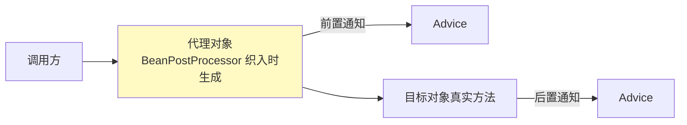

# 精通 Spring AOP

> AOP（面向切面编程）让你把日志、事务、权限、限流这些**横切关注点**从业务代码里抽出来，统一织入。它是 Spring 事务（[J24](./J24-精通-Spring事务与循环依赖.md)）的实现基础，底层就是动态代理（[J06](./J06-精通-反射注解与动态代理.md)）。本篇讲清 AOP 概念、实现和高频的"失效场景"。
>
> **📅 基准：Spring 6 / Spring Boot 3。**

---

## 一、AOP 是什么

**AOP（Aspect-Oriented Programming，面向切面编程）** 是 OOP 的补充：把分散在各处、重复的**横切关注点（cross-cutting concern）**（日志、事务、权限、监控）抽取成独立的"切面"，在不修改业务代码的前提下统一织入。

```java
// 没有 AOP：每个方法都要写日志、事务、权限——重复且污染业务
void createOrder() {
    log.info("开始"); checkAuth(); beginTx();
    // 真正的业务逻辑
    commitTx(); log.info("结束");
}

// 有 AOP：业务方法干净，横切逻辑由切面统一织入
@Transactional
void createOrder() {
    // 只有业务逻辑
}
```

好处：业务代码专注业务、横切逻辑集中管理、消除重复、解耦。

---

## 二、AOP 术语

| 术语 | 含义 |
|---|---|
| **切面（Aspect）** | 横切关注点的模块化（如"日志切面"），= 切点 + 通知 |
| **连接点（Join Point）** | 程序执行中可以织入的点（Spring 中是**方法执行**） |
| **切点（Pointcut）** | 匹配哪些连接点的表达式（"哪些方法要被增强"） |
| **通知（Advice）** | 在切点处执行的动作（"增强逻辑"，何时做什么） |
| **目标对象（Target）** | 被代理的原始对象 |
| **织入（Weaving）** | 把切面应用到目标对象、生成代理的过程 |

简记：**切面 = 在哪些方法（切点）的什么时机（通知）做什么事**。

---

## 三、五种通知类型

| 通知 | 时机 |
|---|---|
| **@Before** | 目标方法**执行前** |
| **@After** | 目标方法执行后（finally，无论成功失败） |
| **@AfterReturning** | 目标方法**正常返回后** |
| **@AfterThrowing** | 目标方法**抛异常后** |
| **@Around** | **环绕**：包裹目标方法，可控制是否执行、改入参/返回值、处理异常（最强大） |

```java
@Aspect @Component
public class LogAspect {
    @Around("execution(* com.example.service.*.*(..))")
    public Object log(ProceedingJoinPoint pjp) throws Throwable {
        long start = System.currentTimeMillis();
        Object result = pjp.proceed();      // 执行目标方法
        log.info("{} 耗时 {}ms", pjp.getSignature(), System.currentTimeMillis() - start);
        return result;
    }
}
```

`@Around` 最灵活（能在方法前后、决定是否调 `proceed()`、改返回值），但要记得调 `proceed()` 否则目标方法不执行。

---

## 四、Spring AOP 实现

Spring AOP 基于**动态代理**（见 [J06](./J06-精通-反射注解与动态代理.md)）——运行时为目标对象生成代理对象，在调用目标方法前后插入通知逻辑。两种代理：

- **JDK 动态代理**：目标类**有接口**时使用，生成实现接口的代理。
- **CGLIB**：目标类**无接口**时使用，生成目标类的子类作为代理。

Spring Boot 2.x+ 默认 `proxyTargetClass=true`，**统一用 CGLIB**（避免 JDK 代理"只能按接口类型注入"的困扰）。



代理对象在 Bean 生命周期的**初始化后置处理（postProcessAfterInitialization）** 阶段生成（见 [J22](./J22-精通-Spring-IOC容器.md)），容器里注入的、被调用的实际是代理对象。

---

## 五、切点表达式

最常用 `execution` 和 `@annotation`：

```java
// execution：匹配方法
@Pointcut("execution(* com.example.service..*.*(..))")
// 返回值任意 包service下所有类的所有方法(任意参数)

// @annotation：匹配带某注解的方法
@Pointcut("@annotation(com.example.Log)")

// within：匹配类；bean：匹配 Bean 名
@Pointcut("within(com.example.service.*)")
```

`execution(修饰符? 返回类型 包.类.方法(参数) 异常?)`，`*` 通配、`..` 匹配任意层包或任意参数。`@annotation` 自定义注解 + 切面是最优雅的方式（如自定义 `@Log`、`@RateLimit` 注解驱动切面，见 [J06 注解](./J06-精通-反射注解与动态代理.md)）。

---

## 六、AOP 的应用

| 场景 | 怎么用 AOP |
|---|---|
| **事务** | `@Transactional`——Spring 用 AOP 在方法前后开启/提交/回滚事务（见 [J24](./J24-精通-Spring事务与循环依赖.md)） |
| 日志/审计 | 切面统一记录方法入参、返回、耗时 |
| 权限校验 | 方法执行前检查权限 |
| 限流/熔断 | `@RateLimit` 注解 + 切面 |
| 缓存 | `@Cacheable`——查缓存命中则不执行方法 |
| 分布式锁 | `@DistributedLock` 注解 + 切面 |

AOP 是"声明式编程"的基础——加个注解就拥有事务/缓存/限流能力，业务无侵入。

---

## 七、AOP 失效场景

**这是 Spring AOP 最高频的考点。** 因为 AOP 靠代理，凡是"没走代理对象"的调用，增强就失效：

- **自调用（self-invocation）**：同一个类里 a() 方法调用本类的 b()（b 上有 @Transactional/@Async）。`this.b()` 的 `this` 是**原始对象**不是代理对象，绕过代理 → b 的增强失效（**最经典**，见 [J06](./J06-精通-反射注解与动态代理.md)、[J24](./J24-精通-Spring事务与循环依赖.md)）。
- **非 public 方法**：Spring AOP（CGLIB）对 private 方法无法代理（不能重写 private）；`@Transactional` 默认只对 public 生效。
- **final 方法/类**：CGLIB 靠继承重写，final 不能被重写/继承，代理失效。
- **方法不是被 Spring 管理的 Bean 调用**：自己 new 的对象不经容器、没有代理，AOP 不生效。
- **静态方法**：无法被代理。

**自调用失效的解法**：①把方法拆到另一个 Bean；②注入自己的代理（`@Autowired` 自身或用 `AopContext.currentProxy()`）；③用 `@Lazy` 自注入。

---

## 八、Spring AOP vs AspectJ

| 维度 | Spring AOP | AspectJ |
|---|---|---|
| 织入时机 | **运行时**（动态代理） | 编译期/类加载期（字节码增强） |
| 连接点 | 仅**方法**执行 | 方法、字段、构造器等更全 |
| 性能 | 有代理调用开销 | 直接改字节码，性能更好 |
| 能力 | 够用（90% 场景） | 更强大、更复杂 |
| 依赖 | Spring 内置 | 需 AspectJ 编织 |

Spring AOP 用 AspectJ 的**注解（@Aspect 等）**，但织入用自己的动态代理（运行时），不是真正的 AspectJ 编译期织入。绝大多数场景 Spring AOP 够用；需要拦截字段访问、构造器、或追求极致性能才上 AspectJ。

---

## 陷阱清单

- **自调用导致 @Transactional/@Async 失效**：this.b() 不走代理。拆类/自注入代理/AopContext。
- **@Transactional 加在 private 方法**：默认只对 public 生效，失效。
- **final 类/方法用 CGLIB 代理**：无法继承重写，代理失效。
- **自己 new 的对象期望 AOP 生效**：不经容器、无代理。必须是 Spring Bean。
- **@Around 忘记调 proceed()**：目标方法根本不执行。
- **切点表达式写错**：匹配不到方法，通知不执行。用 within/bean 验证。
- **以为 Spring AOP 是 AspectJ 编译期织入**：它是运行时动态代理，只拦截方法执行。
- **多个切面顺序混乱**：用 `@Order` 控制切面执行顺序。

---

## 2026 现状

- **声明式编程是主流**：`@Transactional`、`@Cacheable`、`@Async`、`@RateLimiter` 等注解 + AOP，业务无侵入地获得横切能力，是 Spring 开发标准范式。
- **Spring Boot 默认 CGLIB**：proxyTargetClass=true 统一代理方式，减少 JDK 代理的注入困扰。
- **GraalVM 原生镜像下的 AOP**：动态代理在原生镜像受限，Spring 6 通过 AOT 在构建期生成代理相关代码来适配（见 [J26](./J26-精通-SpringBoot自动配置.md)）。
- **自调用失效仍是头号坑**：面试和实际开发中，@Transactional/@Async 自调用失效是最常见的"为什么不生效"问题。

---

## 练习题

1. 什么是 AOP？它解决了什么问题？列举几个典型应用场景。

<details><summary>参考答案</summary>

AOP（Aspect-Oriented Programming，面向切面编程）是对 OOP 的补充编程范式，核心思想是把那些散落在系统各处、与核心业务无关但又重复出现的**横切关注点（cross-cutting concerns）**（如日志记录、事务管理、权限校验、性能监控、限流、缓存等）从业务代码中抽离出来，封装成独立的"切面（Aspect）"，再在不修改业务代码的前提下，通过"织入"统一地应用到需要的方法上。解决的问题：①**消除重复代码**——避免在每个业务方法里都手写日志、开关事务、权限检查等样板代码；②**业务解耦**——让业务方法只关注业务逻辑，保持干净，横切逻辑集中到切面统一维护，修改横切逻辑（如换日志格式、调整事务策略）只需改切面、不动业务；③**声明式编程**——只需加个注解（如 @Transactional、@Cacheable）就能拥有相应能力，对业务无侵入。典型应用场景：事务管理（@Transactional）、日志与审计（统一记录方法入参/返回/耗时）、权限校验（方法执行前鉴权）、限流熔断（@RateLimit 注解 + 切面）、缓存（@Cacheable 命中则跳过方法）、分布式锁、接口幂等校验等。这些都是"很多方法都需要、但又不属于具体业务"的横切逻辑，非常适合用 AOP 统一处理。

</details>

2. AOP 有哪五种通知类型？@Around 有什么特别之处？

<details><summary>参考答案</summary>

五种通知（Advice）类型，对应不同的织入时机：①**@Before（前置通知）**——在目标方法执行**之前**执行；②**@After（后置/最终通知）**——在目标方法执行**之后**执行，类似 finally，无论方法正常返回还是抛异常都会执行（常用于资源清理）；③**@AfterReturning（返回通知）**——在目标方法**正常返回之后**执行，可以拿到返回值；④**@AfterThrowing（异常通知）**——在目标方法**抛出异常之后**执行，可以拿到异常做处理/记录；⑤**@Around（环绕通知）**——包裹整个目标方法的执行，是功能最强大的通知。**@Around 的特别之处**：它把目标方法的执行"包裹"起来，方法参数里有一个 ProceedingJoinPoint，需要显式调用 `pjp.proceed()` 来真正执行目标方法。因此它能做到其他通知做不到的事：①控制目标方法**是否执行**（可以不调 proceed，比如缓存命中或限流拒绝时直接返回，不执行真实方法）；②**修改入参**（用不同参数调 proceed）；③**修改/替换返回值**；④统一**处理异常**（try-catch 包住 proceed）；⑤在方法前后都插入逻辑（如统计耗时，proceed 前后记时间）。正因为它能完全掌控方法的执行过程，最灵活，但要注意——**必须调用 proceed()，否则目标方法不会被执行**。其余四种通知是"特定时机触发"，无法控制方法执行本身。

</details>

3. Spring AOP 的底层实现是什么？JDK 动态代理和 CGLIB 如何选择？

<details><summary>参考答案</summary>

Spring AOP 的底层实现是**动态代理**——在运行时为目标 Bean 生成一个代理对象，由代理对象在调用目标方法的前后织入通知（增强）逻辑，再转调真正的目标方法。容器中注入和被调用的实际是这个代理对象（代理在 Bean 初始化的后置处理阶段 postProcessAfterInitialization 生成）。它有两种代理方式：①**JDK 动态代理**——基于接口，通过 Proxy + InvocationHandler 生成一个实现了目标接口的代理类。条件：**目标类必须实现接口**，且只能代理接口中声明的方法。②**CGLIB**——基于继承，用字节码技术（ASM）生成目标类的**子类**作为代理、重写其方法织入增强。优点是**不需要接口**，能代理普通类；限制是**不能代理 final 类和 final/private/static 方法**（无法被继承重写）。**选择规则**：Spring 默认——目标类有接口时用 JDK 动态代理，没有接口时用 CGLIB。但可通过 proxyTargetClass=true 强制用 CGLIB；实际上 **Spring Boot 2.x 及以后默认就是 proxyTargetClass=true、统一用 CGLIB**，因为 JDK 代理只能按接口类型注入/使用（代理对象只实现接口、不是具体类），容易出现注入或类型转换问题，统一用 CGLIB 生成子类代理行为更一致（有接口没接口都能代理）。需注意 CGLIB 不能代理 final 类/方法。

</details>

4. Spring AOP 有哪些常见的"失效场景"？为什么自调用会导致 AOP 失效？

<details><summary>参考答案</summary>

常见失效场景（本质都是"调用没有经过代理对象"或"无法被代理"）：①**自调用（self-invocation）**——同一个类内部，一个方法直接调用本类另一个带 AOP 注解（如 @Transactional、@Async、@Cacheable）的方法，增强失效（最经典）；②**非 public 方法**——@Transactional 默认只对 public 方法生效，private 方法也无法被 CGLIB 代理（不能重写 private）；③**final 类或 final 方法**——CGLIB 通过继承重写来代理，final 无法被继承/重写，代理失效；④**static 方法**——无法被代理；⑤**调用的不是 Spring 管理的 Bean**——自己 new 出来的对象不经过容器、没有代理，AOP 不生效。**自调用失效的原因**：Spring AOP 的增强是织入在**代理对象**上的——外部调用先经过代理、由代理织入事务/异步等逻辑再转调真实方法。容器注入给别人的是代理对象。但当类内部用 `this.b()` 调用本类方法 b 时，这里的 `this` 指向的是**原始的目标对象本身，而不是代理对象**，因此这次调用根本没有经过代理、不会触发代理上织入的增强逻辑，b 上的 @Transactional/@Async 等就失效了。解决办法：①把 b 方法拆到另一个 Bean 中、通过注入的（代理）Bean 来调用；②自注入——注入自己（拿到的是代理），用代理引用调 b；③用 `AopContext.currentProxy()` 获取当前代理对象再调用（需开启 exposeProxy）。理解"AOP 靠代理、自调用不走代理"是回答这类"为什么不生效"问题的关键。

</details>

5. Spring AOP 和 AspectJ 有什么区别？

<details><summary>参考答案</summary>

两者都用于 AOP，但实现机制和能力不同。**Spring AOP**：①织入时机是**运行时**——通过动态代理（JDK 代理或 CGLIB）在运行期为 Bean 生成代理对象来织入增强；②连接点**只支持方法执行**（只能在方法调用的前后织入），不能拦截字段访问、构造器调用等；③性能上有代理调用的开销（多一层代理转发）；④只能作用于 Spring 容器管理的 Bean；⑤优点是轻量、与 Spring 无缝集成、无需额外编译步骤，**满足约 90% 的日常需求**（如事务、日志、缓存）。**AspectJ**：①是一个完整、强大的独立 AOP 框架，织入时机是**编译期（编译时织入）或类加载期（LTW，加载时织入）**——直接修改/增强字节码；②连接点更全面，支持方法、字段读写、构造器、静态初始化等更细粒度的拦截；③因为是直接改字节码、没有运行时代理转发，**性能更好**；④能作用于任意对象（不限于 Spring Bean），功能更强但配置更复杂、需要 AspectJ 编译器或织入器。**关系与选择**：Spring AOP 借用了 AspectJ 的注解风格（@Aspect、@Before、@Pointcut 等），但底层织入用的是自己的动态代理（运行时），并非真正的 AspectJ 编译期织入。绝大多数场景用 Spring AOP 就够了（简单、够用）；只有当需要拦截字段/构造器等方法之外的连接点、或需要对非 Spring 管理对象织入、或追求极致性能时，才考虑使用 AspectJ。

</details>

6. 自定义一个 `@Log` 注解配合切面记录方法耗时，应该怎么做（思路）？

<details><summary>参考答案</summary>

思路分三步：①**定义注解**——创建一个自定义注解 `@Log`，用 `@Retention(RetentionPolicy.RUNTIME)`（必须是 RUNTIME，否则运行时反射读不到，见 J06）和 `@Target(ElementType.METHOD)`（标注在方法上），可以给它加属性（如 value 表示业务描述）。②**编写切面**——创建一个用 `@Aspect` + `@Component` 标注的切面类（确保它是 Spring Bean），在其中定义一个通知方法，用 `@Around("@annotation(com.example.Log)")` 作为切点表达式——表示"拦截所有标注了 @Log 注解的方法"（用 @annotation 切点匹配注解，比 execution 路径匹配更精准、更灵活）。在环绕通知方法里：记录开始时间 → 调用 `pjp.proceed()` 执行目标方法并拿到返回值 → 在 finally 中计算耗时（System.currentTimeMillis() 差值）并打印日志（可通过 pjp.getSignature() 拿到方法名、通过反射或 MethodSignature 拿到 @Log 注解的属性值如业务描述）→ 返回结果。③**使用**——在需要记录耗时的业务方法上加 `@Log("查询用户")` 即可，AOP 会自动织入耗时统计，业务代码无侵入。注意点：切面类要被 Spring 管理（@Component）、被增强的方法所在类也要是 Spring Bean、避免自调用（否则切面不生效）、@Around 里务必调用 proceed() 否则目标方法不执行、异常时也要保证耗时日志输出（用 try-finally）。这种"自定义注解 + @Around 切面"是实现日志、限流、幂等、分布式锁等横切功能的标准优雅范式。

</details>
