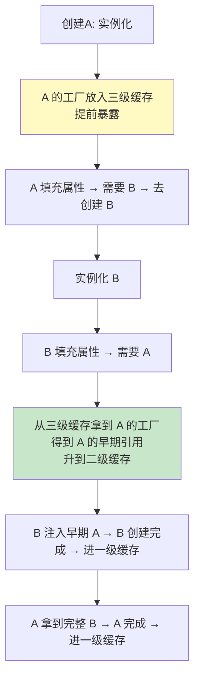

# 精通 Spring 事务与循环依赖

> `@Transactional` 为什么有时不生效？事务传播级别 `REQUIRED` 和 `REQUIRES_NEW` 有什么区别？Spring 的循环依赖三级缓存到底怎么解决的、为什么要三级？这两个主题是 Spring 面试的"压轴深水区"。本篇讲透。
>
> **📅 基准：Spring 6 / Spring Boot 3。** 依赖 [J22 IOC](./J22-精通-Spring-IOC容器.md)、[J23 AOP](./J23-精通-Spring-AOP.md)。

---

## 一、声明式事务 @Transactional

`@Transactional` 是**声明式事务**——加个注解就有事务，底层是 **AOP**（见 [J23](./J23-精通-Spring-AOP.md)）：Spring 为标注的 Bean 生成代理，在方法执行前开启事务、正常返回时提交、抛异常时回滚。

```java
@Service
class OrderService {
    @Transactional(rollbackFor = Exception.class)
    public void createOrder() {
        // 方法内的 DB 操作在同一事务里
        // 抛异常 → 回滚；正常 → 提交
    }
}
```

代理伪逻辑：

```
try { 开启事务; 执行方法; 提交; }
catch (异常) { 回滚; throw; }
```

事务的 ACID、隔离级别原理见 [B09 事务 ACID](../backend/B09-精通数据库事务与-ACID.md)、[mysql 事务 MVCC](../mysql/03-精通-InnoDB-事务-MVCC.md)。

---

## 二、事务传播级别

**传播级别（Propagation）** 决定"一个事务方法调用另一个事务方法时，事务怎么传播"。7 种，重点掌握前三个：

| 传播级别 | 行为 |
|---|---|
| **REQUIRED**（默认） | 当前有事务就加入，没有就新建。最常用 |
| **REQUIRES_NEW** | **总是新建**事务，挂起当前事务（内外事务独立，互不影响回滚） |
| **NESTED** | 嵌套事务（用 savepoint，外层回滚则内层回滚，内层回滚不影响外层） |
| SUPPORTS | 有事务就用，没有就非事务执行 |
| NOT_SUPPORTED | 以非事务执行，挂起当前事务 |
| MANDATORY | 必须在事务中，否则抛异常 |
| NEVER | 必须非事务，有事务则抛异常 |

**REQUIRED vs REQUIRES_NEW**（高频）：
- REQUIRED：内外方法在**同一个事务**，任一处回滚则全部回滚。
- REQUIRES_NEW：内层**独立新事务**，内层提交/回滚与外层无关（如"记录日志"用 REQUIRES_NEW，主业务失败回滚但日志已独立提交保留）。

---

## 三、事务隔离级别

`@Transactional(isolation = ...)` 对应数据库隔离级别，解决脏读/不可重复读/幻读：

| 级别 | 脏读 | 不可重复读 | 幻读 |
|---|---|---|---|
| READ_UNCOMMITTED | ✗ | ✗ | ✗ |
| READ_COMMITTED | ✓ | ✗ | ✗ |
| REPEATABLE_READ | ✓ | ✓ | ✗(MySQL InnoDB 用 MVCC+间隙锁基本避免) |
| SERIALIZABLE | ✓ | ✓ | ✓ |

默认 `DEFAULT`（用数据库默认：MySQL 是 REPEATABLE_READ，PostgreSQL 是 READ_COMMITTED）。详见 [mysql 锁与 MVCC](../mysql/03-精通-InnoDB-事务-MVCC.md)。

---

## 四、事务失效的 N 种场景

**这是 Spring 事务最高频的考点。** `@Transactional` 不生效的常见原因：

| 失效场景 | 原因 |
|---|---|
| **自调用** | 类内部 a() 调本类 b()（b 有 @Transactional），this 不走代理 → 失效（见 [J23](./J23-精通-Spring-AOP.md)） |
| **方法非 public** | @Transactional 默认只对 public 方法生效 |
| **异常被吞** | 方法内 try-catch 了异常没抛出 → Spring 感知不到异常，不回滚 |
| **异常类型不匹配** | 默认只对 **RuntimeException 和 Error** 回滚；受检异常默认**不回滚**（要 `rollbackFor = Exception.class`） |
| **方法不是 Bean 调用** | 自己 new 的对象没代理 |
| **数据库引擎不支持事务** | 如 MySQL MyISAM 不支持事务 |
| **多数据源未指定事务管理器** | 多数据源要指定 `@Transactional("txManager2")` |
| **传播级别用错** | 如 NOT_SUPPORTED 本就不开事务 |

**最常踩的两个**：
1. **自调用**——解法同 AOP（拆类/自注入代理/AopContext）。
2. **默认不回滚受检异常**——`@Transactional` 默认只回滚 RuntimeException 和 Error，抛 `IOException` 这种受检异常**不会回滚**！要加 `rollbackFor = Exception.class`。

---

## 五、循环依赖问题

**循环依赖**：A 依赖 B，B 又依赖 A（或更长的环）。

```java
@Service class A { @Autowired B b; }
@Service class B { @Autowired A a; }
```

创建 A 要先注入 B，创建 B 又要注入 A……如果不处理就会无限递归/创建失败。Spring 能解决**单例 Bean 的字段/setter 注入**的循环依赖（靠三级缓存），但**构造器注入的循环依赖无法解决**（见第八节）。

---

## 六、三级缓存解决循环依赖

Spring 用**三级缓存**解决单例的循环依赖：

| 缓存 | 名称 | 存什么 |
|---|---|---|
| 一级 | singletonObjects | **完整**的成品 Bean（初始化完成） |
| 二级 | earlySingletonObjects | **早期**Bean（实例化了但没填充完，提前暴露的半成品） |
| 三级 | singletonFactories | Bean 的**工厂**（ObjectFactory，能生产早期引用，含 AOP 代理逻辑） |

解决流程（A 依赖 B、B 依赖 A）：



核心：A 实例化后**先把"能获取自己引用的工厂"放进三级缓存**（提前暴露半成品），这样 B 创建时能拿到 A 的早期引用先用着，等大家都创建完再补全。

---

## 七、为什么需要三级缓存

经典追问：**二级缓存（直接存早期 Bean）不够吗？为什么要三级（存工厂）？**

答案：**为了正确处理 AOP 代理**。
- 如果 A 需要被 AOP 代理，那么 B 注入的应该是 **A 的代理对象**，而不是原始 A。
- AOP 代理本来是在 Bean 初始化的**后置处理**阶段才生成（见 [J22](./J22-精通-Spring-IOC容器.md)）。但循环依赖时，B 在 A 还没走到那一步就需要 A 的引用。
- **三级缓存存的是工厂（ObjectFactory）**，当 B 来取 A 时，工厂会判断 A 是否需要代理：需要就**提前生成代理**返回（保证 B 拿到的是代理），不需要就返回原始对象。生成后升级到二级缓存（避免重复生成）。
- 如果只有二级缓存存早期对象，就没法在"被提前引用时按需生成代理"——要么提前给所有 Bean 生成代理（破坏生命周期、性能浪费），要么 B 拿到的是没代理的原始 A（AOP 失效）。

所以三级缓存的本质是：**用工厂延迟决定"早期引用要不要变成代理"**，兼容了 AOP。

---

## 八、构造器循环依赖无法解决

**三级缓存只能解决字段/setter 注入的循环依赖，构造器注入的解决不了。**

原因：三级缓存的前提是"先实例化（new 出半成品）再填充属性"——A 实例化后才能把自己暴露到缓存供 B 使用。但**构造器注入要求在实例化（构造）时就拿到依赖**——创建 A 的构造器就要 B，创建 B 的构造器就要 A，谁都没法先 new 出来暴露到缓存，死锁。

```java
// 构造器循环依赖 → 启动报错 BeanCurrentlyInCreationException
@Service class A { A(B b){} }
@Service class B { B(A a){} }
```

这其实是**构造器注入的优点**（见 [J22](./J22-精通-Spring-IOC容器.md)）——它让循环依赖在启动时就暴露报错，而不是被三级缓存悄悄"解决"掩盖问题。**循环依赖本身是设计坏味道，应该重构消除**（拆分职责、引入中间层），而不是依赖框架兜底。Spring Boot 2.6+ 默认**禁止循环依赖**（要显式开启 `allow-circular-references`），就是鼓励你重构。

---

## 陷阱清单

- **@Transactional 自调用失效**：this.method() 不走代理。拆类/自注入代理。
- **@Transactional 默认不回滚受检异常**：只回滚 RuntimeException/Error。受检异常要 `rollbackFor=Exception.class`。
- **方法内 catch 异常没抛**：Spring 感知不到异常，不回滚。要么抛出、要么手动 `setRollbackOnly`。
- **@Transactional 加在 private 方法**：默认只对 public 生效。
- **REQUIRED 误当独立事务**：REQUIRED 是加入当前事务，内层回滚外层也回滚；要独立用 REQUIRES_NEW。
- **构造器注入还期望解决循环依赖**：解决不了，启动报错。改 setter/字段，或重构消除循环。
- **依赖三级缓存掩盖循环依赖**：循环依赖是坏味道，应重构。Boot 2.6+ 默认禁止。
- **多数据源不指定事务管理器**：事务作用在错误的数据源上。

---

## 2026 现状

- **Spring Boot 2.6+ 默认禁止循环依赖**：鼓励重构而非靠三级缓存兜底；要用得显式开 `spring.main.allow-circular-references=true`。
- **声明式事务仍是标准**：@Transactional + AOP，配合全局异常处理（[J05](./J05-精通-异常处理与最佳实践.md)）。
- **分布式事务**：单机 @Transactional 不解决跨服务事务，微服务用 Saga/TCC/本地消息表（见 [microservices 分布式事务](../microservices/08-精通-分布式事务.md)、[系统设计 S15 支付](../system-design/S15-精通-设计支付与订单系统.md)）。
- **自调用失效 + 受检异常不回滚**：仍是生产事故和面试的高频点，务必牢记。
- **GraalVM 原生镜像**：事务代理在 AOT 下通过编译期处理适配（见 [J26](./J26-精通-SpringBoot自动配置.md)）。

---

## 练习题

1. @Transactional 的底层实现原理是什么？

<details><summary>参考答案</summary>

@Transactional 实现的是**声明式事务**，底层基于 **Spring AOP（动态代理）**。当一个 Bean 的方法（或类）标注了 @Transactional，Spring 在创建这个 Bean 时会为它生成一个**代理对象**（JDK 动态代理或 CGLIB，见 J23），容器注入和外部调用的都是这个代理。代理在调用目标方法时织入事务管理逻辑，大致流程是：①方法执行前，通过事务管理器（PlatformTransactionManager）根据传播级别决定开启新事务或加入现有事务（获取数据库连接、关闭自动提交）；②执行目标业务方法；③如果方法**正常返回**，则提交事务（commit）；④如果方法**抛出异常**（默认是 RuntimeException 或 Error），则回滚事务（rollback）；⑤最后释放连接、清理事务上下文。事务的传播行为、隔离级别、回滚规则等都由 @Transactional 的属性和事务管理器控制。正因为它是基于代理实现的，所以会有"自调用失效"（this 调用不走代理）、"非 public 方法不生效"等典型问题。事务用到的数据库连接通常通过 ThreadLocal（TransactionSynchronizationManager）绑定到当前线程，保证同一事务内的多次 DB 操作用同一个连接。

</details>

2. 事务传播级别 REQUIRED 和 REQUIRES_NEW 有什么区别？各适合什么场景？

<details><summary>参考答案</summary>

**REQUIRED（默认）**：如果当前已经存在事务，就**加入**这个已有事务（在同一个事务中执行）；如果当前没有事务，就新建一个事务。所以用 REQUIRED 的内层方法和调用它的外层方法**共享同一个事务**——任何一处抛异常回滚，整个事务（内外所有操作）都会回滚，是一荣俱荣、一损俱损。**REQUIRES_NEW**：**总是新建一个独立的事务**；如果当前已存在事务，则先把当前事务**挂起**，待新事务执行完（提交或回滚）后再恢复外层事务。所以内层 REQUIRES_NEW 事务与外层事务**相互独立**：内层事务的提交/回滚不影响外层，外层的回滚也不会回滚已经独立提交的内层事务。区别核心：REQUIRED 是"共用一个事务"，REQUIRES_NEW 是"开一个全新独立事务、挂起外层"。适用场景：①**REQUIRED** 适合绝大多数业务——希望一组操作作为一个整体原子地成功或失败（如下单 + 扣库存要么都成功要么都回滚）。②**REQUIRES_NEW** 适合需要"独立提交、不受外层回滚影响"的操作——典型如**记录操作日志/审计**：即使主业务后续失败回滚了，日志记录也要独立提交保留下来（用于追溯）；又如发送通知、记录流水等"无论主流程成败都要落地"的副操作。注意 REQUIRES_NEW 会占用额外的数据库连接（内外两个事务同时持有连接），嵌套过多要注意连接数。

</details>

3. @Transactional 有哪些常见的失效场景？

<details><summary>参考答案</summary>

常见失效场景：①**自调用**——同一个类内部方法 a() 直接调用本类的 b()（b 上有 @Transactional），由于 this 调用不经过代理对象，事务增强失效（最经典，见 J23）；②**方法不是 public**——Spring 事务默认只对 public 方法生效，加在 protected/private/默认访问权限的方法上不生效；③**异常被 catch 吞掉**——方法内部用 try-catch 捕获了异常但没有重新抛出，Spring 代理感知不到异常，于是正常提交、不回滚（要么把异常抛出去，要么手动 `TransactionAspectSupport.currentTransactionStatus().setRollbackOnly()`）；④**抛出的异常类型不匹配回滚规则**——@Transactional 默认只对 RuntimeException 和 Error 回滚，对**受检异常（checked exception，如 IOException）默认不回滚**，需要显式配置 `rollbackFor = Exception.class`；⑤**目标对象不是 Spring Bean**——自己 new 出来的对象没有代理，事务不生效；⑥**数据库/存储引擎不支持事务**——如 MySQL 用 MyISAM 引擎（不支持事务），事务自然无效；⑦**多数据源未正确指定事务管理器**——多数据源场景下 @Transactional 没指定对应的事务管理器，可能作用在错误的数据源上；⑧传播级别设置导致不开启事务（如 NOT_SUPPORTED）。其中**自调用失效**和**受检异常默认不回滚**是最高频的两个坑，要特别注意。

</details>

4. 为什么 @Transactional 默认不回滚受检异常？如何让它回滚所有异常？

<details><summary>参考答案</summary>

这是 Spring 的默认回滚策略：@Transactional 默认只在抛出 **RuntimeException（运行时异常/非受检异常）及其子类**或 **Error** 时才回滚事务，而对**受检异常（Checked Exception，如 IOException、SQLException 等继承自 Exception 但不是 RuntimeException 的异常）默认不回滚**——即使方法抛出了受检异常，事务也会照常**提交**。这个设计沿袭了 EJB 的约定，背后的（有争议的）理念是：运行时异常通常代表程序错误/不可恢复的故障，应该回滚；而受检异常被视为"业务上可预期、可能可恢复"的情况，是否回滚交由开发者显式决定。但这个默认行为很容易导致事故——开发者以为抛了异常就会回滚，结果受检异常下数据被提交了，造成数据不一致。**让它回滚所有异常的办法**：在注解上显式指定 `rollbackFor`，最常见的是 `@Transactional(rollbackFor = Exception.class)`，这样无论抛出的是运行时异常还是受检异常都会回滚。也可以用 `rollbackFor` 指定特定异常类型，或用 `noRollbackFor` 排除某些异常不回滚。实践建议：业务方法上统一加 `rollbackFor = Exception.class`（或团队封装一个默认回滚所有异常的注解），避免受检异常不回滚的隐患。记住这条几乎是面试必考、生产必踩的坑。

</details>

5. Spring 如何用三级缓存解决循环依赖？为什么需要三级而不是二级？

<details><summary>参考答案</summary>

**三级缓存**：一级 singletonObjects（存完整的成品 Bean）、二级 earlySingletonObjects（存提前暴露的早期 Bean——已实例化但未完成属性填充的半成品）、三级 singletonFactories（存能生产早期 Bean 引用的工厂 ObjectFactory）。**解决流程**（A 依赖 B、B 依赖 A，均为字段/setter 注入）：①创建 A，先实例化（new 出半成品 A），然后**把 A 的 ObjectFactory 放入三级缓存**（提前暴露）；②A 填充属性时发现依赖 B，去创建 B；③实例化 B，B 填充属性时发现依赖 A，于是去缓存找 A——从三级缓存拿到 A 的工厂、调用它得到 A 的早期引用，并把这个早期引用升级放入二级缓存（同时移除三级），B 注入这个早期 A；④B 完成创建、放入一级缓存；⑤回到 A，A 拿到完整的 B 完成属性填充和初始化，A 也放入一级缓存。这样环就解开了。**为什么需要三级而不是二级**：核心是为了**正确处理 AOP 代理**。如果 A 需要被 AOP 代理，那么 B 注入的应该是 **A 的代理对象**而非原始 A。而 AOP 代理本来是在 Bean 初始化的后置处理阶段才生成的，循环依赖时 B 提前需要 A 的引用、此时 A 还没走到生成代理那一步。三级缓存存的是**工厂**而非直接的对象：当 B 来获取 A 时，工厂会判断 A 是否需要代理——需要则**此时提前生成代理对象**返回给 B（保证 B 拿到的是代理），不需要则返回原始对象，生成后再升到二级缓存避免重复生成。如果只用二级缓存直接存早期对象，就无法做到"被提前引用时才按需决定生成代理"——要么得提前给所有 Bean 都生成代理（破坏生命周期、浪费），要么 B 拿到没被代理的原始 A 导致 AOP 失效。所以三级缓存用"延迟到被引用时由工厂决定是否生成代理"的方式，既解决了循环依赖又兼容了 AOP。

</details>

6. 为什么构造器注入的循环依赖无法被三级缓存解决？这说明了什么？

<details><summary>参考答案</summary>

因为三级缓存解决循环依赖的前提是"**先实例化、再填充属性**"这个两阶段过程：Bean 先被 new 出来（半成品），然后**在实例化之后、填充属性之前**把自己（的工厂/早期引用）提前暴露到缓存里，这样别的 Bean 在创建时才能拿到它的早期引用先用着。字段注入和 setter 注入都满足这个前提——对象可以先 new 出来（此时字段还是 null），暴露到缓存后再慢慢注入依赖。但**构造器注入要求在实例化（调用构造方法）的那一刻就必须把所有依赖准备好并传进构造器**——也就是说，创建 A 时，A 的构造器就需要 B，所以必须先有 B；而创建 B 时，B 的构造器又需要 A，必须先有 A。结果是：A 还没 new 出来（构造器卡在等 B）、根本没机会把自己暴露到三级缓存；B 也同样 new 不出来。谁都无法先完成实例化、无法提前暴露，三级缓存机制根本用不上，于是死锁，Spring 启动时抛出 BeanCurrentlyInCreationException 报错。**这说明了什么**：①构造器循环依赖是无解的（在不改注入方式的前提下）；②这恰恰是**构造器注入的优点**——它让循环依赖在应用启动时就立即暴露、报错，而不是像字段/setter 注入那样被三级缓存"悄悄解决"、把设计问题掩盖到运行时；③**循环依赖本身是一种设计坏味道**（说明类之间职责划分不清、耦合过紧），正确的做法是通过重构消除它（拆分职责、提取公共逻辑到第三个类、引入事件/接口解耦），而不是依赖框架的三级缓存兜底。正因如此，Spring Boot 2.6+ 默认禁止循环依赖，强制开发者正视并重构这种设计问题。

</details>
