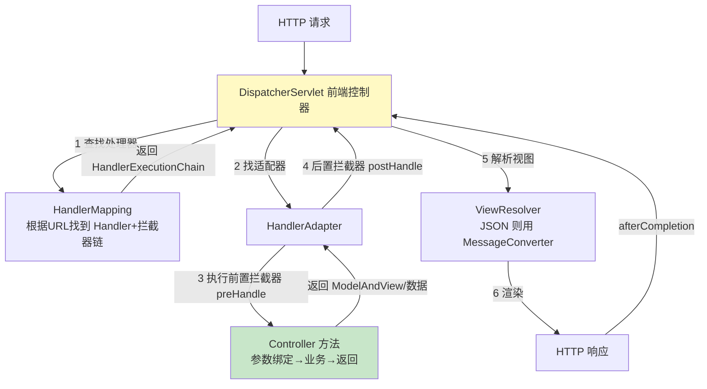

# 精通 Spring MVC

> Spring MVC 是 Java 后端最主流的 Web 框架，几乎所有 Spring Boot 应用的 HTTP 接口都跑在它上面。面试必考 **DispatcherServlet 处理一个请求的完整流程**。本篇讲清它的核心组件、请求流转、参数绑定、拦截器和 RESTful 实践。
>
> **📅 基准：Spring 6 / Spring Boot 3（Jakarta Servlet，`javax`→`jakarta`）。**

---

## 一、Spring MVC 是什么

Spring MVC 是基于 **Servlet** 的 Web 层 MVC 框架，把一次 HTTP 请求的处理拆成 MVC 三层：

- **Model（模型）**：数据。
- **View（视图）**：展示（现代前后端分离下多为 JSON，视图弱化）。
- **Controller（控制器）**：接收请求、调用业务、返回结果。

它构建在 Servlet 之上（[J28 IO](./J28-精通-Java-IO与NIO.md) 相关的 Tomcat 容器提供 Servlet 运行环境），用一个核心的 **DispatcherServlet** 统一接管所有请求，再分发给各 Controller。现代基本是"前后端分离 + RESTful JSON 接口"用法。

---

## 二、核心：DispatcherServlet

**DispatcherServlet（前端控制器，Front Controller）** 是 Spring MVC 的心脏——它本质是一个 Servlet，拦截所有匹配的请求，作为**统一入口**协调各组件完成请求处理。

前端控制器模式的好处：把"接收请求、查找处理器、调用、渲染、异常处理"等通用流程**集中到一个入口**统一管理，各 Controller 只管自己的业务，避免每个都重复处理这些通用逻辑。

Spring Boot 自动配置好 DispatcherServlet（默认映射 `/`），无需手动配置。

---

## 三、请求处理完整流程

**这是 Spring MVC 最高频的面试题。** 一个请求从进来到响应的完整流转：



步骤：
1. 请求到 **DispatcherServlet**。
2. 它问 **HandlerMapping**：这个 URL 该谁处理？→ 返回 Handler（Controller 方法）+ 拦截器链。
3. 找到对应的 **HandlerAdapter**（适配不同类型的 Handler）。
4. 执行**拦截器 preHandle** → 调用 **Controller 方法**（参数绑定、执行业务、返回结果）→ **postHandle**。
5. 返回的若是视图名，**ViewResolver** 解析视图并渲染；若是 `@ResponseBody`/`@RestController`，用 **HttpMessageConverter** 把对象转成 JSON 写回响应。
6. **afterCompletion** 拦截器收尾，返回响应。

记住主链：**DispatcherServlet → HandlerMapping → HandlerAdapter → Controller → ViewResolver/MessageConverter → 响应**。

---

## 四、核心组件

| 组件 | 职责 |
|---|---|
| **DispatcherServlet** | 前端控制器，统一入口、协调全流程 |
| **HandlerMapping** | 根据请求 URL 找到对应的 Handler（Controller 方法）和拦截器链 |
| **HandlerAdapter** | 适配并执行 Handler（屏蔽不同 Handler 类型的差异） |
| **Handler（Controller）** | 真正处理请求的业务方法 |
| **HandlerInterceptor** | 拦截器（前置/后置/完成后） |
| **ViewResolver** | 视图解析（传统视图；JSON 接口走 MessageConverter 不用它） |
| **HttpMessageConverter** | 请求体/响应体与 Java 对象互转（JSON ↔ 对象） |
| **HandlerExceptionResolver** | 统一异常处理 |

这套组件是可插拔的，Spring Boot 自动配置好默认实现。

---

## 五、常用注解

```java
@RestController                      // = @Controller + @ResponseBody（返回值直接转 JSON）
@RequestMapping("/api/users")
public class UserController {

    @GetMapping("/{id}")             // GET /api/users/123
    public User get(@PathVariable Long id) { ... }       // 路径变量

    @GetMapping
    public List<User> list(@RequestParam(defaultValue = "1") int page) { ... } // 查询参数 ?page=1

    @PostMapping
    public User create(@RequestBody @Valid UserDTO dto) { ... }  // 请求体 JSON → 对象 + 校验

    @PutMapping("/{id}")
    public void update(@PathVariable Long id, @RequestBody UserDTO dto) { ... }
}
```

| 注解 | 作用 |
|---|---|
| `@Controller` / `@RestController` | 标记控制器（@RestController 自带 @ResponseBody） |
| `@RequestMapping` / `@GetMapping` 等 | 映射 URL + HTTP 方法 |
| `@PathVariable` | 取**路径**变量（/users/{id}） |
| `@RequestParam` | 取**查询参数/表单**（?page=1） |
| `@RequestBody` | 取**请求体**（JSON → 对象，反序列化） |
| `@ResponseBody` | 返回值直接写响应体（对象 → JSON） |
| `@RequestHeader` / `@CookieValue` | 取 header / cookie |

---

## 六、参数绑定与返回值处理

- **参数绑定**：Spring MVC 自动把请求数据绑定到方法参数——简单类型从 query/表单取（@RequestParam），路径变量用 @PathVariable，JSON 请求体用 @RequestBody（靠 **HttpMessageConverter**，默认 Jackson 把 JSON 反序列化成对象）。
- **返回值处理**：`@ResponseBody`/`@RestController` 的返回对象，由 HttpMessageConverter（Jackson）序列化成 JSON 写回；传统返回视图名则由 ViewResolver 渲染。
- **参数校验**：`@Valid`/`@Validated` + JSR-303 注解（`@NotNull`、`@Size` 等）做参数校验，配合全局异常处理统一返回错误。

`HttpMessageConverter` 是前后端 JSON 交互的关键——它根据请求的 `Content-Type`/`Accept` 选择合适的转换器（JSON 用 MappingJackson2HttpMessageConverter）。

---

## 七、拦截器 Interceptor vs Filter

两者都能拦截请求，但层次不同（高频对比）：

| 维度 | Filter（过滤器） | Interceptor（拦截器） |
|---|---|---|
| 规范 | Servlet 规范（更底层） | Spring MVC 提供 |
| 拦截范围 | 所有请求（含静态资源） | 只拦 DispatcherServlet 处理的请求（Controller） |
| 触发时机 | 在 DispatcherServlet **之前/之后** | 在 DispatcherServlet **内部**、Controller 前后 |
| 能力 | 能改 request/response | 能拿到 Handler 信息、能介入 MVC 流程（preHandle/postHandle/afterCompletion） |
| 依赖 | 不依赖 Spring | 是 Spring Bean，能注入依赖 |

- **Filter** 更底层、更通用（如编码、跨域、鉴权前置、日志），运行在 Servlet 容器层。
- **Interceptor** 在 MVC 内部，能拿到具体 Handler（Controller 方法）信息，适合做和业务相关的拦截（登录校验、权限、统一日志）。

执行顺序：Filter → DispatcherServlet → Interceptor.preHandle → Controller → Interceptor.postHandle → Interceptor.afterCompletion → Filter。

---

## 八、全局异常处理与 RESTful

- **全局异常处理**：用 `@RestControllerAdvice` + `@ExceptionHandler` 集中处理各类异常，统一返回标准错误响应（避免每个 Controller 各自 try-catch，呼应 [J05 异常](./J05-精通-异常处理与最佳实践.md)）：

```java
@RestControllerAdvice
public class GlobalExceptionHandler {
    @ExceptionHandler(BusinessException.class)
    public Result<?> handle(BusinessException e) {
        return Result.error(e.getCode(), e.getMessage());
    }
    @ExceptionHandler(MethodArgumentNotValidException.class) // 参数校验失败
    public Result<?> handleValid(MethodArgumentNotValidException e) {
        return Result.error(400, e.getBindingResult().getFieldError().getDefaultMessage());
    }
}
```

- **RESTful 设计**：用 HTTP 方法表达操作（GET 查/POST 增/PUT 改/DELETE 删）、URL 表达资源、状态码表达结果（见 [B04 REST API 设计](../backend/B04-精通-REST-API-设计.md)）。`@RestController` + JSON 是标准的 RESTful 接口写法。

---

## 陷阱清单

- **@RequestParam 和 @PathVariable 混用**：query 参数用 @RequestParam，路径 {} 变量用 @PathVariable。
- **忘记 @RequestBody**：接收 JSON 请求体必须加 @RequestBody，否则取不到。
- **@Controller 没加 @ResponseBody 返回 JSON**：会被当视图名解析（404/找不到视图）。返回 JSON 用 @RestController。
- **Interceptor 当 Filter 用拦静态资源**：Interceptor 只拦 Controller 请求，拦不到静态资源/非 MVC 请求。
- **拦截器 preHandle 返回 false 不写响应**：返回 false 会中断请求，要自己写好响应否则空响应。
- **参数校验 @Valid 不配全局异常处理**：校验失败抛 MethodArgumentNotValidException，不处理会返回难看的默认错误。
- **DispatcherServlet 流程记不全**：HandlerMapping → HandlerAdapter → Controller → ViewResolver/MessageConverter 主链要背熟。
- **大文件/流式响应还用 @ResponseBody 全量序列化**：考虑 StreamingResponseBody/异步。

---

## 2026 现状

- **前后端分离 + RESTful JSON 是绝对主流**：`@RestController` + Jackson + 统一响应/异常处理是标准范式；传统 JSP/视图渲染基本退场。
- **Spring WebFlux（响应式）**：基于 Reactor 的非阻塞 Web 栈，适合高并发 IO 密集、流式场景；但传统阻塞式 Spring MVC + **虚拟线程（Java 21）** 让"阻塞式写法也能高并发"，降低了对 WebFlux 的需求（见 [J11](./J11-精通-线程池.md)/[J29](./J29-精通-Java版本特性演进.md)）。
- **Jakarta 迁移**：Spring 6/Boot 3 把 `javax.servlet` 改为 `jakarta.servlet`，升级需注意。
- **可观测/OpenAPI**：Micrometer 自动埋点 HTTP 指标、SpringDoc 自动生成 OpenAPI 文档（见 [B07 OpenAPI](../backend/B07-精通-OpenAPI-契约.md)）。
- **GraalVM 原生镜像**：Spring MVC 控制器在 AOT 下需处理反射元数据。

---

## 练习题

1. 请完整描述 Spring MVC 中 DispatcherServlet 处理一个请求的流程。

<details><summary>参考答案</summary>

完整流程：①HTTP 请求首先到达 **DispatcherServlet**（前端控制器，它是一个 Servlet，统一接收所有匹配的请求）。②DispatcherServlet 调用 **HandlerMapping**，根据请求的 URL（和方法等）找到能处理该请求的 Handler（即对应的 Controller 方法），并返回一个 HandlerExecutionChain（包含 Handler 和该请求匹配的拦截器链）。③DispatcherServlet 根据 Handler 找到合适的 **HandlerAdapter**（适配器，用于屏蔽不同类型 Handler 的调用差异、统一执行 Handler）。④执行拦截器的 **preHandle**（前置处理），若通过则由 HandlerAdapter **调用 Controller 方法**——此过程包括参数绑定（把请求参数/路径变量/请求体 JSON 绑定到方法参数，请求体用 HttpMessageConverter 反序列化）、执行业务逻辑、得到返回值（ModelAndView 或直接的数据对象）。⑤调用拦截器的 **postHandle**（后置处理）。⑥处理返回结果：如果返回的是视图名，则由 **ViewResolver** 解析出视图并渲染（填充 Model 数据生成 HTML）；如果是 @ResponseBody/@RestController 的返回对象，则由 **HttpMessageConverter** 把对象序列化成 JSON（或其他格式）写入响应体。⑦渲染/写出响应后，调用拦截器的 **afterCompletion**（完成后处理，常用于资源清理、记录），最终把 HTTP 响应返回给客户端。期间若发生异常，由 HandlerExceptionResolver（如 @RestControllerAdvice + @ExceptionHandler）统一处理。核心链路记忆：DispatcherServlet → HandlerMapping → HandlerAdapter → Controller（参数绑定+业务）→ ViewResolver/MessageConverter → 响应，拦截器在其中的 preHandle/postHandle/afterCompletion 各时机介入。

</details>

2. Spring MVC 有哪些核心组件？各自的职责是什么？

<details><summary>参考答案</summary>

核心组件：①**DispatcherServlet（前端控制器）**——整个 MVC 的统一入口和总协调者，接收所有请求，按流程依次调用其他组件完成请求处理、最后输出响应；它本质是一个 Servlet。②**HandlerMapping（处理器映射器）**——负责根据请求信息（URL、HTTP 方法等）找到对应的处理器 Handler（Controller 方法），并返回包含拦截器链的执行链。③**HandlerAdapter（处理器适配器）**——负责实际调用 Handler，它屏蔽了不同类型 Handler 的调用差异（用适配器模式统一执行接口），并完成方法参数解析绑定、返回值处理等。④**Handler/Controller（处理器）**——真正处理业务请求的组件（我们写的 @Controller 方法）。⑤**HandlerInterceptor（拦截器）**——在 Controller 执行前后（preHandle/postHandle/afterCompletion）织入通用逻辑，如登录校验、权限、日志。⑥**ViewResolver（视图解析器）**——把 Controller 返回的逻辑视图名解析成具体的 View 对象并渲染（用于传统服务端渲染；前后端分离的 JSON 接口不走它）。⑦**HttpMessageConverter（消息转换器）**——负责请求体与 Java 对象、Java 对象与响应体之间的转换（如 JSON ↔ 对象，默认 Jackson），是 RESTful JSON 接口的关键。⑧**HandlerExceptionResolver（异常解析器）**——统一处理请求过程中抛出的异常（如 @ControllerAdvice + @ExceptionHandler）。这些组件可插拔、由 Spring Boot 自动配置默认实现，协作完成"请求→处理→响应"的完整流程。

</details>

3. @RequestParam、@PathVariable、@RequestBody 分别从哪里取数据？

<details><summary>参考答案</summary>

①**@RequestParam**：从请求的**查询参数（query string）或表单参数**中取值。例如 URL `/users?page=1&size=10`，用 `@RequestParam int page` 取到 1；也用于 application/x-www-form-urlencoded 表单提交的字段。可设置 required、defaultValue。②**@PathVariable**：从 **URL 路径中的占位符变量**取值。配合 @RequestMapping/@GetMapping 中用 `{}` 定义的路径模板，如 `@GetMapping("/users/{id}")` 配 `@PathVariable Long id`，请求 `/users/123` 时 id=123。它取的是 RESTful 风格 URL 路径里的资源标识。③**@RequestBody**：从 **HTTP 请求体（body）**中取值，并通过 HttpMessageConverter（默认 Jackson）把请求体内容（通常是 JSON）**反序列化成 Java 对象**。用于接收 POST/PUT 等带 JSON 请求体的请求，如 `@RequestBody UserDTO dto` 把请求体的 JSON 转成 UserDTO 对象。一个请求体只能有一个 @RequestBody。区别记忆：@RequestParam 取 ?后面的查询/表单参数，@PathVariable 取 URL 路径里 {} 的部分，@RequestBody 取请求体（JSON）整体转对象。RESTful 接口里通常路径变量用 @PathVariable 标识资源、复杂数据用 @RequestBody 传 JSON、简单过滤/分页参数用 @RequestParam。

</details>

4. Filter（过滤器）和 Interceptor（拦截器）有什么区别？

<details><summary>参考答案</summary>

两者都能拦截请求做横切处理，但所属规范、拦截范围和能力不同。**Filter（过滤器）**：属于 **Servlet 规范**（更底层、与 Spring 无关），由 Servlet 容器（如 Tomcat）管理；它在请求进入 DispatcherServlet **之前**和响应返回**之后**执行，**拦截范围是所有进入容器的请求**（包括静态资源、其他 Servlet 等，不限于 Spring MVC）；能直接操作原始的 ServletRequest/ServletResponse（如修改请求/响应、包装流），常用于编码设置、跨域、压缩、最外层的鉴权、请求日志等通用处理；它不天然是 Spring Bean（虽然可以注册成 Bean）。**Interceptor（拦截器）**：是 **Spring MVC 提供**的机制，运行在 DispatcherServlet **内部**，**只拦截由 DispatcherServlet 分发、进入 Controller 的请求**（拦不到静态资源等非 MVC 请求）；它提供 preHandle（Controller 执行前）、postHandle（Controller 执行后、视图渲染前）、afterCompletion（请求完成后）三个时机，能拿到具体的 Handler（Controller 方法）信息、介入 MVC 处理流程；它是 Spring Bean，可以方便地注入其他 Bean（如 Service）。执行顺序：Filter（前）→ DispatcherServlet → Interceptor.preHandle → Controller → Interceptor.postHandle → 视图渲染 → Interceptor.afterCompletion → Filter（后）。选择：通用、与业务无关、需作用于所有请求或要操作原始流的用 Filter；与 MVC/业务相关、需要 Handler 信息或注入 Spring Bean 的（如登录态校验、权限、统一业务日志）用 Interceptor。

</details>

5. Spring MVC 中如何做统一的全局异常处理？为什么需要它？

<details><summary>参考答案</summary>

做法：使用 `@RestControllerAdvice`（或 `@ControllerAdvice` + `@ResponseBody`）定义一个全局异常处理类，在其中用 `@ExceptionHandler(XxxException.class)` 标注方法来集中处理特定类型的异常，把异常转换成统一格式的错误响应返回给前端。例如：定义 handle(BusinessException) 处理业务异常返回业务错误码和消息、handle(MethodArgumentNotValidException) 处理 @Valid 参数校验失败返回 400 和字段错误信息、handle(Exception) 兜底处理未预期异常返回 500。这样所有 Controller 抛出的异常都会被这个全局处理器捕获并按统一规范（如 `{code, message, data}`）返回。**为什么需要它**：①**避免重复**——如果没有全局处理，每个 Controller 方法都得自己 try-catch 各种异常、各自拼装错误响应，大量重复且容易不一致；②**统一规范**——保证整个应用对外返回的错误响应格式统一（统一的错误码、结构），前端能用一套逻辑处理所有错误，提升 API 一致性和可维护性；③**业务代码干净**——Controller/Service 只管抛出有意义的异常（如自定义 BusinessException），不必到处处理异常和拼响应，关注点分离（呼应"早抛晚捕"，见 J05）；④**集中管理**——日志记录、错误码映射、敏感信息过滤等都集中在一处维护。它本质上也是 AOP 思想的体现（把"异常处理"这一横切关注点集中化），是生产级 RESTful 应用的标准实践。

</details>

6. Spring MVC（阻塞式）和 Spring WebFlux（响应式）有什么区别？虚拟线程对这个选择有什么影响？

<details><summary>参考答案</summary>

**Spring MVC** 是传统的**阻塞式（同步）**Web 栈，基于 Servlet API，采用"一个请求一个线程"的模型——每个请求由线程池中的一个线程处理，遇到 IO（数据库、远程调用）时该线程阻塞等待。编程模型直观（命令式、易调试），是绝大多数应用的选择；缺点是高并发 IO 密集场景下，大量线程阻塞在等待上，受线程数限制、线程切换和内存开销大。**Spring WebFlux** 是**响应式（非阻塞、异步）**Web 栈，基于 Reactor（Mono/Flux）和 Netty（或 Servlet 3.1+ 异步），用少量线程通过事件循环 + 回调处理大量并发请求，IO 等待时线程不阻塞而是去处理别的请求，适合**高并发、IO 密集、流式（SSE/流处理）**场景，资源利用率高；缺点是编程模型复杂（响应式编程心智负担大、调试栈难懂）、整个调用链都要非阻塞才有效（一处阻塞就破功）。**虚拟线程（Java 21）的影响**：虚拟线程是极轻量的线程，遇到阻塞时会自动让出底层载体线程去执行其他任务，使得**用传统阻塞式写法（Spring MVC）也能轻松支撑海量并发 IO**——即用同步、直观的代码获得接近响应式的高并发能力，而不必承受 WebFlux 的复杂性。因此虚拟线程**显著降低了为了高并发而不得不用 WebFlux 的必要性**：很多原本要上 WebFlux 的 IO 密集场景，现在可以继续用简单的 Spring MVC + 虚拟线程来解决。选择上：追求简单直观、且有虚拟线程加持 → Spring MVC；需要响应式流处理、背压、或团队已深度采用响应式生态 → WebFlux。

</details>
