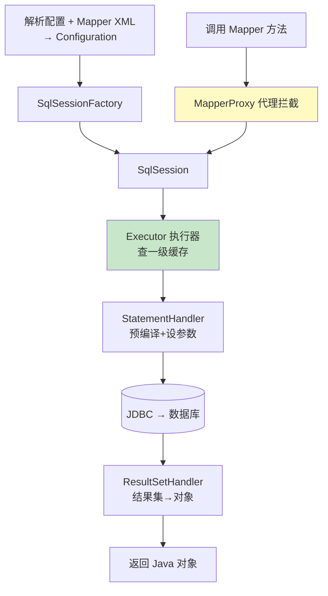

# 精通 MyBatis 原理

> MyBatis 是 Java 后端最常用的持久层框架（尤其国内）。它是"半自动 ORM"——SQL 你自己写，对象映射它帮你做。面试常问：Mapper 接口没有实现类，怎么就能调用？一级/二级缓存怎么回事？`#{}` 和 `${}` 有什么区别？本篇讲透。
>
> **📅 基准：MyBatis 3 / MyBatis-Spring（Spring Boot 3）。**

---

## 一、MyBatis 是什么

MyBatis 是**半自动 ORM**框架：

- **全自动 ORM（如 Hibernate/JPA）**：你定义对象和映射，框架自动生成 SQL，几乎不用写 SQL。
- **半自动 ORM（MyBatis）**：**SQL 你自己写**（在 XML 或注解里），MyBatis 负责参数映射、执行、结果集到对象的映射。

MyBatis 的定位是"**让你掌控 SQL**"——SQL 与 Java 代码分离（写在 mapper XML），对复杂 SQL、性能优化友好（国内偏爱，因为可控）。代价是要手写 SQL、模板代码（MyBatis-Plus 等增强工具弥补）。

---

## 二、核心组件

| 组件 | 职责 |
|---|---|
| **SqlSessionFactory** | 创建 SqlSession 的工厂（全局单例，由配置构建） |
| **SqlSession** | 一次数据库会话，提供 CRUD API（非线程安全，方法级/请求级使用） |
| **Executor** | 执行器，真正执行 SQL（SimpleExecutor/ReuseExecutor/BatchExecutor），管理一级缓存 |
| **StatementHandler** | 处理 JDBC Statement（预编译、设参数） |
| **ParameterHandler** | 参数映射（Java 参数 → SQL 占位符） |
| **ResultSetHandler** | 结果集映射（ResultSet → Java 对象） |
| **Mapper** | 你定义的接口（无实现，靠动态代理） |

层次：SqlSession → Executor → StatementHandler → ParameterHandler/ResultSetHandler → JDBC。

---

## 三、Mapper 接口的动态代理

**经典考点：Mapper 接口没有实现类，为什么调用它的方法就能执行 SQL？**

答案：**JDK 动态代理**（见 [J06](./J06-精通-反射注解与动态代理.md)）。

```java
@Mapper
public interface UserMapper {
    User selectById(Long id);   // 只有接口，没有实现
}

// 调用
User u = userMapper.selectById(1L);  // 怎么执行的？
```

机制：
1. MyBatis 启动时扫描 Mapper 接口，为每个接口用 `MapperProxyFactory` 创建一个 **JDK 动态代理对象**（`MapperProxy` 实现 InvocationHandler）。
2. Spring 容器里注入的 `userMapper` 就是这个代理。
3. 调用 `selectById` 时，代理的 `invoke` 拦截，根据**接口全名 + 方法名**找到对应的 MappedStatement（即 XML 里那条 SQL），交给 SqlSession 执行，返回结果。

所以"接口即实现"——代理把方法调用转换成"找到对应 SQL 并执行"。这和 [J06 动态代理](./J06-精通-反射注解与动态代理.md) 是同一套技术。

---

## 四、工作流程



1. 启动时解析全局配置和所有 Mapper XML，构建 **Configuration**（含所有 MappedStatement）。
2. 创建 SqlSessionFactory。
3. 调用 Mapper 方法 → MapperProxy 代理 → SqlSession → Executor。
4. Executor 先查一级缓存，没命中则交 StatementHandler 预编译 SQL、设参数、执行 JDBC。
5. ResultSetHandler 把结果集映射成 Java 对象返回。

---

## 五、一级缓存

**一级缓存（本地缓存）**：

- **作用域：SqlSession 级别**，默认**开启**。
- 同一个 SqlSession 内，相同的查询（相同 SQL + 参数 + statement）第二次直接返回缓存，不查数据库。
- **失效情况**：同一 SqlSession 执行了 insert/update/delete（会清空一级缓存）、不同 SqlSession、手动 clearCache、配置的刷新。

**坑**：
- 一级缓存可能导致**读到旧数据**：同一 SqlSession 里，A 查了用户，期间别的会话改了这个用户，A 再查还是缓存的旧值。
- 与 Spring 整合时，没有事务的情况下每次操作可能用不同 SqlSession，一级缓存效果有限；有事务时同一事务共用 SqlSession，一级缓存生效。

---

## 六、二级缓存

**二级缓存**：

- **作用域：Mapper（namespace）级别**，跨 SqlSession 共享，默认**关闭**（需手动开 `<cache/>` + 全局配置）。
- 同一个 namespace 下的查询结果被多个 SqlSession 共享。
- **慎用甚至不用**：
  - **脏读/一致性问题**：多表关联时，A namespace 缓存的数据被 B namespace 的更新改了，A 的二级缓存不知道 → 脏数据。
  - 分布式部署下，二级缓存是单机本地的，多节点间不一致。
  - 实际项目**多用 Redis 等外部缓存**（见 [redis](../redis/INDEX.md)、[系统设计 S05 缓存](../system-design/S05-精通-缓存与异步化设计.md)）替代二级缓存，更可控、可分布式。

**结论**：一级缓存了解其行为和坑；二级缓存生产基本不用，用专门的缓存层。

---

## 七、插件机制

MyBatis 提供强大的**插件（拦截器 Interceptor）**机制，可拦截四大核心对象的方法：

| 可拦截对象 | 典型用途 |
|---|---|
| **Executor** | 分页、缓存、SQL 审计 |
| **StatementHandler** | SQL 改写、防注入、分页（如 PageHelper） |
| **ParameterHandler** | 参数处理 |
| **ResultSetHandler** | 结果处理、脱敏 |

```java
@Intercepts(@Signature(type = StatementHandler.class, method = "prepare", args = {...}))
public class MyPlugin implements Interceptor {
    public Object intercept(Invocation inv) throws Throwable {
        // 拦截逻辑（如改写 SQL 加分页）
        return inv.proceed();
    }
}
```

原理是**动态代理 + 责任链**（见 [J06](./J06-精通-反射注解与动态代理.md)）——给四大对象生成代理，调用方法时经过插件链。**PageHelper 分页插件、数据权限、字段加密/脱敏、SQL 监控**都靠插件实现。这是 MyBatis 可扩展性的核心。

---

## 八、`#{}` vs `${}`

**MyBatis 安全方面的头号考点**：

| | `#{}` | `${}` |
|---|---|---|
| 处理方式 | **预编译**（PreparedStatement 占位符 `?`） | **字符串直接拼接** |
| SQL 注入 | **安全**（参数化，值不参与 SQL 解析） | **有注入风险** |
| 用途 | 传值（绝大多数场景） | 拼表名/列名/动态 SQL 片段（不得已时） |

```xml
<!-- ✅ 安全：预编译 -->
SELECT * FROM user WHERE id = #{id}
<!-- ❌ 危险：字符串拼接，可被 SQL 注入 -->
SELECT * FROM user WHERE name = '${name}'
```

- **`#{}` 用预编译**，参数作为 `?` 占位符传给数据库，值不会被当 SQL 解析，**防 SQL 注入**（见 [B23 OWASP](../backend/B23-精通-OWASP-Top-10.md)），是默认且推荐。
- **`${}` 直接拼字符串**，有 SQL 注入风险，**只在传值不能满足时用**（如动态表名、order by 字段名——这些不能用 `?` 占位），且必须对输入做白名单校验。

**铁律：传值一律用 `#{}`，`${}` 只用于不得不拼 SQL 结构（表名/列名）且严格校验输入。**

---

## 陷阱清单

- **用 `${}` 传用户输入的值**：SQL 注入漏洞。传值用 `#{}`，`${}` 仅用于表名/列名等结构且白名单校验。
- **依赖一级缓存导致读到旧数据**：同一 SqlSession 内数据被外部改了仍读缓存。注意一致性。
- **开二级缓存导致脏读**：多表/多 namespace 关联、分布式下不一致。生产用 Redis 替代。
- **SqlSession 当线程安全共享**：SqlSession 非线程安全，应方法级/请求级使用（Spring 整合已管理好）。
- **Mapper 接口找不到 XML**：接口全名 + 方法名要和 XML 的 namespace + id 对应，否则 BindingException。
- **批量插入用循环单条 insert**：性能差。用 BatchExecutor 或 `<foreach>` 批量。
- **不理解 Mapper 是动态代理**：以为有实现类，搞不清调用怎么到 SQL 的。
- **resultType 字段映射不上**：数据库下划线和 Java 驼峰不一致时要开 `mapUnderscoreToCamelCase` 或用 resultMap。

---

## 2026 现状

- **MyBatis-Plus 流行**：在 MyBatis 上增强（通用 CRUD、条件构造器、代码生成、分页插件），减少样板，国内广泛使用。
- **MyBatis vs JPA**：国内仍以 MyBatis（可控 SQL）为主流；JPA/Hibernate（全自动）在部分团队/简单 CRUD 场景用。复杂查询、性能敏感偏 MyBatis。
- **缓存外置**：二级缓存基本被 Redis 等外部分布式缓存取代（可控、可分布式、有淘汰策略，见 [系统设计 S05](../system-design/S05-精通-缓存与异步化设计.md)）。
- **预编译防注入是底线**：`#{}` 预编译 + 参数化查询是防 SQL 注入的标准实践（[B23 OWASP](../backend/B23-精通-OWASP-Top-10.md)）。
- **Spring Boot 整合**：mybatis-spring-boot-starter 自动配置 SqlSessionFactory、Mapper 扫描，开箱即用（见 [J26](./J26-精通-SpringBoot自动配置.md)）。

---

## 练习题

1. MyBatis 的 Mapper 接口没有实现类，为什么调用它的方法就能执行 SQL？

<details><summary>参考答案</summary>

靠 **JDK 动态代理**。MyBatis 在启动时会扫描所有 Mapper 接口，为每个接口通过 `MapperProxyFactory` 创建一个**动态代理对象**——这个代理由 `MapperProxy`（实现了 InvocationHandler）支撑。我们通过 @Autowired 注入、实际拿到和调用的 Mapper 就是这个代理对象（不是真实的实现类，因为根本没有实现类）。当调用 Mapper 接口的某个方法（如 selectById）时，代理对象的 invoke 方法被触发拦截，它根据"**接口的全限定名 + 方法名**"（对应 MappedStatement 的 id，即 XML 里 namespace + id 或注解 SQL）去 Configuration 中找到对应的那条 SQL 语句（MappedStatement），然后委托 SqlSession（进而 Executor → StatementHandler → JDBC）去执行这条 SQL，完成参数绑定和结果集到对象的映射，最后返回结果。所以"接口即实现"——开发者只需声明接口和写好对应的 SQL（XML 或注解），MyBatis 用动态代理在运行时把"方法调用"自动转换成"找到并执行对应 SQL"。这与 Spring AOP、JDBC SPI 一样，都是动态代理在框架中的典型应用（见 J06）。

</details>

2. MyBatis 的一级缓存和二级缓存分别是什么级别？有什么区别和注意事项？

<details><summary>参考答案</summary>

**一级缓存**：作用域是 **SqlSession 级别**，默认**开启**。在同一个 SqlSession 内，执行相同的查询（相同的 statement、SQL、参数、分页条件）时，第二次会直接从缓存返回结果、不再查数据库。当该 SqlSession 执行了任何 insert/update/delete、或调用 clearCache、或 SqlSession 关闭时，一级缓存失效/清空。注意事项/坑：①可能读到**旧数据**——同一个 SqlSession 内查询后，若期间有其他会话修改了该数据，本会话再查仍返回缓存的旧值，存在一致性问题；②与 Spring 整合时，缓存效果依赖 SqlSession 的复用——无事务时每次操作可能是不同 SqlSession（一级缓存基本无效），有事务时同一事务内共用一个 SqlSession（一级缓存生效）。**二级缓存**：作用域是 **Mapper（namespace）级别**，**跨 SqlSession 共享**，默认**关闭**（需在全局配置开启并在 mapper 加 `<cache/>`）。同一 namespace 的查询结果可被不同 SqlSession 共享。注意事项：①**脏读/一致性问题严重**——多表关联查询时，一个 namespace 缓存的数据可能被另一个 namespace 的更新改掉，但前者的二级缓存感知不到，导致脏数据；②**分布式不一致**——二级缓存是单机本地缓存，多节点部署时各节点缓存独立、互不同步，会出现数据不一致。所以**生产中二级缓存基本不用**，而是用 Redis 等外部分布式缓存替代（可控、支持分布式、有过期/淘汰策略）。总结：一级缓存默认开、SqlSession 级、注意旧数据；二级缓存默认关、namespace 级、生产慎用/不用。

</details>

3. MyBatis 中 `#{}` 和 `${}` 有什么区别？为什么说要尽量用 `#{}`？

<details><summary>参考答案</summary>

区别：**`#{}`** 是**预编译参数占位**——MyBatis 会把它编译成 JDBC PreparedStatement 中的 `?` 占位符，参数值通过 PreparedStatement 的 setXxx 安全地传给数据库，**值作为参数传入、不参与 SQL 语句的解析**。**`${}`** 是**字符串直接替换/拼接**——MyBatis 会把 `${}` 里的内容直接拼接到 SQL 字符串中，然后整体作为 SQL 发送。**为什么尽量用 `#{}`**：核心是**防 SQL 注入**和性能。①**安全**——因为 `#{}` 用预编译参数化，用户输入的值不会被当作 SQL 代码解析执行，无论用户传入什么（哪怕是 `' OR 1=1 --`）都只会被当成一个普通的参数值，从根本上杜绝 SQL 注入（见 B23 OWASP）；而 `${}` 直接拼接字符串，如果拼的是用户可控的输入，攻击者就能注入恶意 SQL（如绕过条件、删库），存在严重安全漏洞。②**性能**——预编译的 SQL 可被数据库缓存执行计划、重复使用，参数不同也复用同一编译结果。`${}` 的适用场景：只有当需要动态拼接**SQL 结构部分**（而非值）时才用，比如动态的表名、列名、order by 的字段名、排序方向——这些位置不能用 `?` 占位符。但即便如此，用 `${}` 时也**必须对输入做严格的白名单校验**（只允许预期的表名/列名集合），绝不能直接拼用户的原始输入。铁律：**传值一律用 `#{}`，`${}` 仅在不得不拼 SQL 结构时使用且严格校验**。

</details>

4. MyBatis 的插件（拦截器）机制是怎样的？能拦截哪些对象？典型应用是什么？

<details><summary>参考答案</summary>

MyBatis 的插件机制基于**动态代理 + 责任链（拦截器链）**，允许在 SQL 执行的关键节点插入自定义逻辑，而不修改 MyBatis 源码。它能拦截 MyBatis 的**四大核心对象**的方法：①**Executor**（执行器）——可拦截 update/query 等，用于分页、二级缓存、SQL 审计/监控；②**StatementHandler**（语句处理器）——可拦截 prepare/parameterize/batch 等，用于 SQL 改写（如自动加分页 limit、加数据权限条件）、防注入检查，分页插件 PageHelper 主要在这里工作；③**ParameterHandler**（参数处理器）——拦截参数设置，用于参数加工、加密；④**ResultSetHandler**（结果集处理器）——拦截结果集处理，用于结果脱敏、字段解密、类型转换。实现方式：写一个类实现 Interceptor 接口、用 @Intercepts + @Signature 注解声明要拦截的对象类型、方法和参数签名，在 intercept 方法里写增强逻辑并调用 invocation.proceed() 放行；MyBatis 会用动态代理把插件织入到对应对象上，多个插件形成拦截链依次执行。典型应用：**分页插件（PageHelper、MyBatis-Plus 分页）**自动给查询 SQL 加分页和 count；**数据权限**自动给 SQL 拼接权限过滤条件；**字段加密/脱敏**在参数/结果处自动加解密敏感字段；**慢 SQL 监控/SQL 日志审计**记录执行的 SQL 和耗时；**多租户**自动加租户隔离条件。插件机制是 MyBatis 强大可扩展性的核心，原理上和 Spring AOP、责任链模式相通（见 J06）。

</details>

5. SqlSession 是线程安全的吗？在 Spring 中如何正确使用？

<details><summary>参考答案</summary>

SqlSession **不是线程安全的**。SqlSession 代表一次数据库会话，内部持有数据库连接、一级缓存、执行状态等可变状态，如果多个线程共享同一个 SqlSession 并发使用，会导致连接状态错乱、一级缓存数据混乱、事务问题等严重并发错误。所以**绝不能把一个 SqlSession 作为单例 Bean 长期共享给多个线程**，而应该让每个线程/每次请求/每个方法使用自己独立的 SqlSession，用完即关。在原生 MyBatis 中，正确用法是"获取 SqlSession → 使用 → 在 finally 中 close"，且不跨线程共享。**在 Spring（mybatis-spring）整合中**，开发者通常不直接管理 SqlSession——mybatis-spring 提供了 `SqlSessionTemplate`（它是线程安全的），它通过动态代理在每次数据库操作时，从 Spring 的事务上下文中获取或创建一个与**当前线程/当前事务绑定**的 SqlSession（基于 ThreadLocal 管理，见 J14），操作完成后按事务边界统一提交/回滚和关闭。也就是说，Spring 帮你做到了"同一个事务内复用同一个 SqlSession（保证一级缓存和事务一致）、不同线程/事务用各自的 SqlSession（保证线程安全）"。我们注入和使用的 Mapper（动态代理）底层就是通过 SqlSessionTemplate 间接、线程安全地使用 SqlSession 的。所以在 Spring 中开发者只管注入 Mapper、调用方法、用 @Transactional 管理事务即可，SqlSession 的线程安全和生命周期由框架保证，无需也不应手动共享 SqlSession。

</details>

6. MyBatis 和 Hibernate/JPA 有什么区别？各适合什么场景？

<details><summary>参考答案</summary>

核心区别在于"自动化程度"和"对 SQL 的掌控"。**Hibernate/JPA 是全自动 ORM**：开发者主要面向对象编程，定义实体类和映射关系，框架根据对象操作**自动生成 SQL**，开发者通常不直接写 SQL（简单 CRUD 几乎零 SQL）。优点是开发效率高、面向对象、数据库无关性强（切换数据库方言相对容易）、自动管理脏检查/级联/缓存等；缺点是生成的 SQL 不够可控、复杂查询和性能优化困难（需要 HQL/Criteria 或原生 SQL）、有一定学习曲线和"隐式行为"（如 N+1、懒加载陷阱），对 SQL 调优不友好。**MyBatis 是半自动 ORM**：**SQL 由开发者自己编写**（在 XML 或注解里），框架负责参数映射、执行 SQL、把结果集映射成 Java 对象。优点是**SQL 完全可控**——能写出精细优化的复杂 SQL、便于 SQL 调优和审查、SQL 与代码分离清晰、灵活适配各种复杂查询和存储过程；缺点是要手写 SQL 和较多模板代码（用 MyBatis-Plus 等增强工具可缓解）、数据库移植性弱一些（SQL 可能含特定方言）。**适用场景**：①需要**精细控制 SQL、性能要求高、查询复杂**（多表关联、复杂统计、需要针对性优化）的项目，或团队/DBA 习惯掌控 SQL 的——选 MyBatis（这也是国内互联网公司的主流选择）；②**以简单 CRUD 为主、追求快速开发、领域模型驱动、对 SQL 掌控要求不高、需要较强数据库无关性**的项目——可选 JPA/Hibernate。很多团队也会混用（主体 MyBatis + 个别简单模块 JPA）。总之：要掌控 SQL、重性能用 MyBatis；要开发快、面向对象、重模型用 JPA/Hibernate。

</details>
