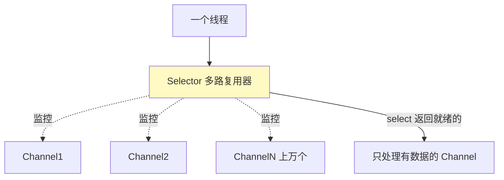

# 精通 Java IO 与 NIO

> 高性能网络编程绕不开 IO 模型。传统 BIO 为什么扛不住高并发？NIO 的 Channel/Buffer/Selector 怎么做到一个线程管成千上万连接？零拷贝又是什么？本篇讲清 Java 的 IO 体系，并关联底层的 [Linux IO 多路复用](../linux/L08-精通-IO-多路复用.md)。
>
> **📅 基准：Java 17/21。** Netty 是 NIO 的工业级封装。

---

## 一、BIO / NIO / AIO 三种 IO 模型

| 模型 | 全称 | 特点 | Java 包 |
|---|---|---|---|
| **BIO** | Blocking IO | 同步阻塞，一连接一线程 | `java.io` |
| **NIO** | Non-blocking IO / New IO | 同步非阻塞，多路复用 | `java.nio` |
| **AIO** | Asynchronous IO | 异步非阻塞，回调 | `java.nio.channels`（NIO.2） |

- **同步 vs 异步**：数据拷贝（内核→用户）由谁完成——同步是应用自己等着拷，异步是内核拷好了通知应用。
- **阻塞 vs 非阻塞**：发起 IO 调用后线程是否被挂起等待。

主流是 **NIO**（高并发网络），AIO 在 Linux 上因底层支持不佳用得少（Netty 也只用 NIO）。

---

## 二、传统 BIO

`java.io` 的流（InputStream/OutputStream）是 **BIO**——同步阻塞：

```java
// BIO 服务器：每个连接开一个线程
ServerSocket server = new ServerSocket(8080);
while (true) {
    Socket socket = server.accept();        // 阻塞，直到有连接
    new Thread(() -> {
        socket.getInputStream().read(...);  // 阻塞，直到有数据
    }).start();
}
```

问题（**C10K 问题**）：
- `accept()`/`read()` 都阻塞，所以**一个连接必须配一个线程**（否则一个连接阻塞会卡住所有）。
- 连接数一多（上万），就要上万线程——线程内存开销大（每线程 1MB 栈）、上下文切换爆炸，系统扛不住。
- 大量连接其实是空闲的（没数据），但线程都阻塞着白白占资源。

所以 BIO 只适合**连接数少、稳定**的场景，高并发要用 NIO。

---

## 三、NIO 三大核心

NIO（`java.nio`）是**同步非阻塞 + 多路复用**，三大核心组件：

| 组件 | 作用 |
|---|---|
| **Channel（通道）** | 双向的数据通道（读写都行），如 SocketChannel、FileChannel。对应一个连接/文件 |
| **Buffer（缓冲区）** | 数据容器，读写都通过 Buffer（不像 BIO 直接读写流）。本质是数组 + 指针 |
| **Selector（选择器）** | **多路复用器**，一个 Selector 能监控多个 Channel 的就绪事件 |

NIO 的精髓：**用一个（或少数）线程 + Selector 管理大量 Channel**，哪个 Channel 有数据就处理哪个，不再一连接一线程。

---

## 四、Selector 与多路复用

**Selector（多路复用）是 NIO 高并发的关键。** 一个线程通过 Selector 同时监控成千上万个 Channel：

```java
Selector selector = Selector.open();
channel.configureBlocking(false);              // 非阻塞
channel.register(selector, SelectionKey.OP_READ); // 注册关心的事件

while (true) {
    selector.select();                          // 阻塞直到有 Channel 就绪
    for (SelectionKey key : selector.selectedKeys()) {
        if (key.isReadable()) { /* 处理这个就绪的 Channel */ }
    }
}
```



- `select()` 一次返回所有"就绪"（有数据可读/可写）的 Channel，线程只处理就绪的，空闲连接不占线程。
- 底层对应操作系统的 **IO 多路复用（Linux 的 epoll、见 [L08](../linux/L08-精通-IO-多路复用.md)）**——JVM 把 Selector 映射到 epoll，所以 NIO 能用一个线程高效管理海量连接，解决 C10K。

这就是为什么 NIO 适合高并发：**连接数与线程数解耦**，一个线程管全部连接的就绪事件。

---

## 五、Buffer 的结构

NIO 读写都经过 **Buffer**，它本质是数组 + 三个指针：

| 指针 | 含义 |
|---|---|
| **capacity** | 容量（数组大小，固定） |
| **position** | 当前读写位置 |
| **limit** | 读写的上限 |

关键方法：
- **写模式 → 读模式：`flip()`**——把 limit 设为 position、position 归 0，准备读。
- **`clear()`**：position 归 0、limit 设为 capacity，准备重新写（数据没真清，靠覆盖）。
- **`compact()`**：保留未读数据，移到前面，继续写。

```java
ByteBuffer buf = ByteBuffer.allocate(1024);
channel.read(buf);   // 写入 Buffer（往 buf 里写）
buf.flip();          // 切换到读模式（关键，忘了就读不到）
while (buf.hasRemaining()) { byte b = buf.get(); } // 读出
buf.clear();         // 准备下次写
```

**常见坑：读写切换忘了 `flip()`**——写完直接读会读到空/错乱。理解 position/limit/capacity 是用对 Buffer 的关键。

---

## 六、零拷贝

**零拷贝（Zero-Copy）** 是高性能 IO 的关键优化，减少数据在内核态和用户态之间的多余拷贝。

**传统 IO 拷贝**（如把文件发到网络，要 4 次拷贝 + 4 次上下文切换）：

```
磁盘 →(DMA)→ 内核缓冲区 →(CPU)→ 用户缓冲区 →(CPU)→ socket 缓冲区 →(DMA)→ 网卡
```

数据在内核和用户空间来回拷贝（其中两次 CPU 拷贝是多余的——应用根本没处理数据，只是转发）。

**零拷贝**消除多余拷贝：
- **`sendfile`（FileChannel.transferTo）**：内核直接把文件数据从内核缓冲区送到 socket 缓冲区/网卡，不经过用户空间，CPU 拷贝降到 0/1 次。
- **`mmap`（MappedByteBuffer）**：把文件映射到用户空间，读写文件像读写内存，减少一次拷贝。
- **DirectByteBuffer（堆外内存）**：`ByteBuffer.allocateDirect()` 直接在堆外分配，避免数据在 JVM 堆和内核之间多拷贝一次（见 [J15 直接内存](./J15-精通-JVM运行时内存结构.md)）。

零拷贝是 Kafka（[kafka](../kafka/INDEX.md)）、Netty、文件服务器高吞吐的基础——大文件传输/消息转发性能提升显著。

---

## 七、Reactor 模式与 Netty

NIO 直接用很复杂（Selector 事件循环、Buffer 管理、拆包粘包、异常处理），实际生产用 **Netty**——基于 NIO 的高性能网络框架。

- **Reactor 模式**：NIO 服务器的经典模型——一个/多个线程（Reactor）用 Selector 监听事件，分发给处理器。Netty 用**主从 Reactor 多线程模型**：BossGroup（接收连接）+ WorkerGroup（处理 IO），充分利用多核。
- Netty 封装了：事件循环（EventLoop）、Channel/ByteBuf（增强版 Buffer）、编解码器（解决拆包粘包）、Pipeline（责任链处理）、零拷贝等。
- Dubbo、RocketMQ、Spring WebFlux、gRPC-Java 等底层都用 Netty。

面试常问"为什么不直接用 NIO 而用 Netty"——Netty 解决了原生 NIO 的复杂性、bug（如 epoll 空轮询）、拆包粘包、内存管理，是工业级标准。

---

## 八、IO 模型对比与选型

| 模型 | 阻塞 | 连接:线程 | 适用 |
|---|---|---|---|
| BIO | 阻塞 | 1:1 | 连接少、稳定（传统应用） |
| NIO | 非阻塞 | N:1（多路复用） | 高并发、连接多（聊天、网关、长连接） |
| AIO | 非阻塞异步 | 回调 | 理论更优，但 Linux 支持不佳，少用 |

- **连接少**：BIO 简单够用。
- **高并发、海量连接**（IM、网关、推送）：NIO（用 Netty）。
- AIO 在 Linux 底层（epoll 是同步多路复用，无真异步）支持不好，实践少用——Netty 也只基于 NIO。

补充：**虚拟线程（Java 21，[J28 是 IO 篇，演进见 J29]）** 让"BIO 风格的阻塞写法 + 海量虚拟线程"也能高并发（阻塞时虚拟线程让出载体线程），降低了直接写 NIO 的必要性（见 [J11](./J11-精通-线程池.md)、[J29](./J29-精通-Java版本特性演进.md)）。

---

## 陷阱清单

- **BIO 扛高并发**：一连接一线程，上万连接线程爆炸（C10K）。高并发用 NIO/Netty。
- **Buffer 读写不 flip()**：写完直接读会读到空/错乱。写转读必须 flip。
- **clear() 以为真清空数据**：只重置指针，数据靠后续覆盖；要保留未读用 compact()。
- **直接用原生 NIO 写生产网络服务**：复杂、易踩坑（epoll 空轮询、拆包粘包）。用 Netty。
- **DirectByteBuffer 不回收**：堆外内存泄漏，堆 dump 看不到（见 [J15](./J15-精通-JVM运行时内存结构.md)）。
- **以为 AIO 在 Linux 上更快**：Linux 无真异步 IO（io_uring 才补上），AIO 实践少用。
- **混淆同步/异步、阻塞/非阻塞**：NIO 是同步非阻塞（应用自己拷数据但不阻塞等），AIO 才是异步。

---

## 2026 现状

- **NIO + Netty 是高并发网络标准**：IM、网关、RPC、消息中间件几乎都用 Netty（[系统设计 S09 IM](../system-design/S09-精通-设计IM即时通讯.md) 的长连接网关）。
- **虚拟线程改变 IO 编程**：Java 21 虚拟线程让"同步阻塞写法"也能撑海量并发 IO——很多原来必须用 NIO/响应式的场景，现在可用简单的阻塞式代码 + 虚拟线程（见 [J29](./J29-精通-Java版本特性演进.md)）。但底层网络框架（Netty）仍是 NIO。
- **io_uring**：Linux 新的真异步 IO 接口（见 [L09 io_uring](../linux/L09-精通-io_uring-与异步IO.md)），JVM/Netty 逐步支持，可能改变 AIO 格局。
- **零拷贝普及**：Kafka、Netty、文件/视频服务的高吞吐都靠零拷贝（sendfile/mmap/DirectBuffer）。
- **Foreign Memory API（Java 21）**：更安全地管理堆外内存，是 DirectByteBuffer/Unsafe 的现代替代。

---

## 练习题

1. BIO、NIO、AIO 三种 IO 模型有什么区别？为什么 BIO 扛不住高并发？

<details><summary>参考答案</summary>

区别（从同步/异步、阻塞/非阻塞角度）：①**BIO（同步阻塞）**——发起读写后线程会一直阻塞等待，直到数据就绪并拷贝完成；编程简单，但每个连接需要一个独立线程来处理（因为线程会阻塞）。②**NIO（同步非阻塞 + 多路复用）**——线程发起读写若数据未就绪不会阻塞而是立即返回，配合 Selector（多路复用器）可以用一个线程监控大量连接的就绪事件、只处理就绪的连接；数据的拷贝仍由应用线程（同步）完成，但不会因单个连接没数据而阻塞。③**AIO（异步非阻塞）**——应用发起 IO 后立即返回，由操作系统在数据准备好且拷贝完成后通过回调通知应用，应用全程不等待（真正的异步）。**BIO 扛不住高并发的原因**（C10K 问题）：BIO 的 accept() 和 read() 都是阻塞的，为了不让一个慢连接卡住其他连接，必须为**每个连接分配一个线程**。当并发连接数达到上万时，就需要上万个线程——而每个线程都要占用约 1MB 栈内存（上万线程就是几个 GB），且大量线程会导致 CPU 在线程间频繁上下文切换、开销巨大；更浪费的是，这些连接大多数时刻其实是空闲的（没有数据收发），但对应的线程却都阻塞占用着资源。线程数随连接数线性增长很快耗尽系统资源，所以 BIO 只适合连接数较少的场景，高并发必须用 NIO（连接数与线程数解耦）。

</details>

2. NIO 的三大核心组件是什么？Selector 如何实现一个线程管理大量连接？

<details><summary>参考答案</summary>

三大核心：①**Channel（通道）**——双向的数据传输通道（既可读又可写），代表一个打开的连接或文件，如 SocketChannel（网络）、FileChannel（文件）；不同于 BIO 的单向流。②**Buffer（缓冲区）**——数据的容器，NIO 的读写都通过 Buffer 进行（从 Channel 读数据到 Buffer、把 Buffer 的数据写到 Channel），本质是一个数组加上 position/limit/capacity 三个指针。③**Selector（选择器/多路复用器）**——可以注册并同时监控多个 Channel，检测它们的 IO 就绪事件（连接、可读、可写）。**Selector 实现一个线程管理大量连接的机制**：先把多个 Channel 都设置为非阻塞模式并注册到同一个 Selector 上，声明各自关心的事件（如 OP_READ）；然后线程在一个循环里调用 `selector.select()`，这个调用会阻塞直到至少有一个 Channel 的关心事件就绪，返回所有"就绪"的 Channel（SelectionKey 集合）；线程只需遍历处理这些**真正有数据可读/可写的就绪 Channel**，处理完继续下一轮 select。这样无论有多少个连接，只要它们大部分时刻是空闲的，线程就只在少数就绪的连接上工作，不必为每个连接开线程、也不必逐个轮询所有连接。其底层依赖操作系统的 **IO 多路复用机制（Linux 的 epoll）**——JVM 把 Selector 映射到 epoll，由内核高效地告知哪些 fd 就绪。于是"连接数"与"线程数"解耦，一个（或少数几个）线程就能高效管理成千上万个连接，从根本上解决了 BIO 的 C10K 问题。

</details>

3. NIO 的 Buffer 有哪几个关键指针？为什么写完要调用 flip()？

<details><summary>参考答案</summary>

Buffer 有三个关键指针：①**capacity（容量）**——Buffer 底层数组的大小，创建后固定不变，表示最多能容纳多少数据；②**position（位置）**——当前的读/写位置，每读或写一个元素它自动后移；③**limit（界限）**——当前可读或可写的上限，position 不能越过 limit。三者关系始终是 `0 ≤ position ≤ limit ≤ capacity`。**为什么写完要 flip()**：Buffer 是"读写共用"同一块空间和指针，需要在"写模式"和"读模式"之间切换。当从 Channel 读数据写入 Buffer 时（写模式），position 随着写入不断后移、指向下一个可写位置，limit 等于 capacity。写完后如果直接去读，position 还停在刚写完的位置、limit 还是 capacity，会从错误的位置读、读到的是后面未写入的空白区域（读错或读空）。**flip() 的作用**就是完成"写模式 → 读模式"的切换：它把 **limit 设置为当前的 position（标记已写入数据的末尾，即只能读到这里）**，然后把 **position 重置为 0（从头开始读）**。这样接下来从 Buffer 读数据就会从位置 0 读到刚才写入的数据末尾，正好读出所有写入的内容。所以"写 → 读"之间必须 flip()，否则读不到正确数据——这是 NIO Buffer 最常见的坑。读完后若要重新写，用 clear()（position 归 0、limit 设为 capacity，注意它不真正清除数据、只是重置指针）或 compact()（保留未读数据再继续写）。

</details>

4. 什么是零拷贝？传统文件传输有哪些多余的拷贝？零拷贝如何优化？

<details><summary>参考答案</summary>

零拷贝（Zero-Copy）是一类减少数据在内核态与用户态之间多余拷贝（以及减少 CPU 拷贝和上下文切换）的 IO 优化技术。**传统文件传输的拷贝**（以"读取磁盘文件并通过网络发送"为例，典型有 4 次拷贝、4 次用户/内核态切换）：①DMA 把磁盘数据拷贝到**内核**的读缓冲区（page cache）；②CPU 把数据从内核读缓冲区拷贝到**用户空间**应用缓冲区（read 系统调用，一次 CPU 拷贝 + 切换）；③CPU 再把数据从用户缓冲区拷贝到**内核**的 socket 发送缓冲区（write 系统调用，又一次 CPU 拷贝 + 切换）；④DMA 把 socket 缓冲区数据拷贝到网卡发送。其中第②③步的两次 **CPU 拷贝是多余的**——应用其实根本没有处理这份数据，只是把它从文件原样转发到网络，却白白经过了用户空间来回拷贝，浪费 CPU 和内存带宽，还多了上下文切换。**零拷贝的优化**：①**sendfile（Java 的 FileChannel.transferTo）**——一个系统调用让内核直接把文件数据从内核读缓冲区送到 socket 缓冲区（甚至借助 DMA gather 直接到网卡），数据**不再经过用户空间**，消除了两次 CPU 拷贝、大幅减少上下文切换；②**mmap（MappedByteBuffer）**——把文件映射到用户地址空间，应用像访问内存一样访问文件，省去一次内核到用户的拷贝；③**DirectByteBuffer（堆外直接内存）**——直接在堆外分配缓冲区，避免数据在 JVM 堆和内核之间再多拷贝一次。效果：传输大文件/转发消息时显著降低 CPU 占用、提高吞吐。零拷贝是 Kafka（消息持久化与消费）、Netty、文件/视频服务器实现高吞吐的关键基础。

</details>

5. 为什么生产环境用 Netty 而不直接用原生 NIO？

<details><summary>参考答案</summary>

因为原生 Java NIO 虽然提供了高并发的能力，但直接拿来写生产级网络服务非常复杂且坑多，Netty 在 NIO 之上做了工业级封装，解决了这些问题。原生 NIO 的痛点：①**API 复杂、上手难**——要自己写 Selector 事件循环、管理 Channel 注册与就绪事件分发、处理 Buffer 的读写模式切换，代码繁琐易错；②**著名的 epoll 空轮询 bug**——JDK 的 NIO 在某些 Linux 内核上存在 Selector.select() 空轮询导致 CPU 100% 的 bug，需要自己 workaround，Netty 已内置修复；③**拆包/粘包问题**——TCP 是字节流，没有消息边界，原生 NIO 需要开发者自己处理半包、粘包，Netty 提供了现成的编解码器（如 LengthFieldBasedFrameDecoder、行解码器）；④**缓冲区与内存管理**——原生 ByteBuffer 难用（flip 等易错）、堆外内存分配回收麻烦，Netty 提供了增强的 ByteBuf（读写指针分离、自动扩容、引用计数、内存池化复用减少 GC）；⑤**线程模型**——需要自己设计 Reactor 多线程模型，Netty 内置成熟的主从 Reactor 多线程模型（BossGroup 接收连接 + WorkerGroup 处理 IO）充分利用多核；⑥**可扩展的处理链**——Netty 的 ChannelPipeline（责任链）让编解码、业务处理等以 Handler 形式灵活组合。此外 Netty 还提供零拷贝支持、丰富的协议编解码、完善的异常处理和成熟稳定性。正因如此，Dubbo、RocketMQ、gRPC-Java、Spring WebFlux、Elasticsearch 等都用 Netty 作为网络通信底层。结论：原生 NIO 是"能用但难用且有坑"的底层能力，Netty 把它封装成"高性能、稳定、易用"的工业级框架，生产中应该用 Netty 而非裸写 NIO。

</details>

6. 虚拟线程（Java 21）对 IO 编程有什么影响？它会取代 NIO/Netty 吗？

<details><summary>参考答案</summary>

影响：虚拟线程是 Java 21 正式引入的极轻量级线程（由 JVM 调度、栈按需增长，可轻松创建数百万个），它最大的价值在于**让"同步阻塞式"的 IO 编程也能支撑海量并发**。在虚拟线程上执行阻塞 IO（如 socket read、数据库调用）时，JVM 会自动把虚拟线程从底层的载体线程（平台线程）上"卸载"，让载体线程去运行其他虚拟线程，等 IO 就绪再恢复——也就是说，开发者可以用最直观的"一请求一线程、顺序阻塞读写"的简单代码风格，却获得接近 NIO 那样"少量线程扛海量连接"的并发能力，而不必承受 NIO 回调/事件循环或响应式编程（WebFlux）的复杂心智负担。这对 IO 密集型服务（绝大多数后端 Web/RPC 服务）意义重大：很多原本为了高并发不得不用 NIO 或响应式的场景，现在可以回归简单的阻塞式写法 + 虚拟线程。**会取代 NIO/Netty 吗？不会完全取代**：①虚拟线程改变的是**应用层**的并发编程模型（让阻塞写法可扩展），但底层的高性能网络框架（如 Netty）**仍然基于 NIO/事件驱动**来高效地与操作系统的多路复用（epoll）打交道——虚拟线程本身阻塞时底层也是靠 JVM 的非阻塞机制实现卸载的；②对于需要精细控制网络、协议编解码、极致性能和复杂连接管理的中间件（RPC、消息队列、网关），Netty 等 NIO 框架依然是首选；③虚拟线程对 CPU 密集型任务没有帮助（不增加并行度）。所以更准确的说法是：虚拟线程让"用阻塞式简单代码写高并发 IO 服务"成为可能，降低了应用开发者直接使用 NIO/响应式的必要性，但 NIO/Netty 作为底层高性能网络基础设施依然不可或缺，两者是不同层次、互补的关系。

</details>
