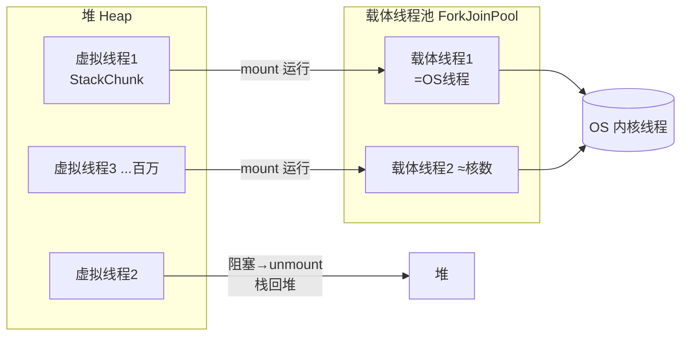

# 精通虚拟线程与结构化并发

> 虚拟线程（Virtual Threads）是 Java 21 最具颠覆性的特性，让"一请求一线程"的简单阻塞写法重新能扛住海量并发 IO，动摇了二十年来"必须用线程池/NIO/响应式"的工程惯例。面试 2026 必问"虚拟线程是什么、怎么实现、什么时候 pin、和线程池/响应式怎么选"。本篇把 Loom 讲透，并串起 [J11 线程池](./J11-精通-线程池.md)、[J14 ThreadLocal](./J14-精通-ThreadLocal.md)、[J28 IO/NIO](./J28-精通-Java-IO与NIO.md)。
>
> **📅 基准：2026 年 6 月。虚拟线程 Java 21（2023）GA；结构化并发与 ScopedValue 在 21 引入预览、到 Java 25 LTS（2025-09）趋于成熟。**

---

## 一、问题：平台线程为什么扛不住高并发 IO

传统的 `Thread` 是**平台线程（Platform Thread）**——和操作系统线程 **1:1** 映射，由 OS 调度。它有两个硬成本：

- **内存贵**：每个线程默认预留约 **1MB 栈**（`-Xss`），几千个线程就吃掉几个 GB。
- **切换贵**：阻塞/唤醒要走内核态，上下文切换有开销，线程一多 CPU 大量耗在切换上。

所以平台线程只能开几千个。但一个 IO 密集的 Web 服务，每个请求大部分时间在**等** DB/下游/磁盘（CPU 几乎闲着）。"一请求一线程 + 阻塞等待"最直观，却被线程数上限卡死，扛不住 C10K（上万连接，见 [J28](./J28-精通-Java-IO与NIO.md)）。

业界过去只能二选一，都不舒服：

| 方案 | 优点 | 代价 |
|---|---|---|
| **BIO 一连接一线程** | 写法简单、顺序、好调试 | 线程数受限，扛不住高并发 |
| **NIO / 线程池** | 少量线程管大量连接 | 编程复杂、要手动管状态 |
| **响应式（Reactor/WebFlux）** | 高吞吐、非阻塞 | 心智负担重、调试难、栈信息丢失、"染色"全链路 |

**虚拟线程的目标**：保留 BIO 那种"顺序阻塞"的简单写法，却拿到 NIO/响应式那样的高并发——鱼和熊掌兼得。

---

## 二、虚拟线程：M:N 的用户态线程

虚拟线程是由 **JVM 调度**（而非 OS）的极轻量线程。它不和 OS 线程一一对应，而是 **M:N**——M 个虚拟线程复用在 N 个**载体线程（Carrier Thread，即平台线程）**上运行：

- **栈在堆上**：虚拟线程的栈以 `StackChunk` 对象形式存在**堆**里，按需增长/收缩，初始只有几百字节——所以能创建**数百万个**。
- **阻塞即卸载**：虚拟线程执行到**阻塞操作**（网络/文件 IO、`Thread.sleep`、`java.util.concurrent` 的锁/队列等）时，JVM 把它的栈从载体线程**卸载（unmount）**回堆，载体线程立刻去跑别的虚拟线程；等阻塞结束，再把它**挂载（mount）**回某个载体线程继续。
- **载体线程很少**：默认调度器是一个专用的 `ForkJoinPool`（FIFO 模式），并行度 = CPU 核数（可用 `jdk.virtualThreadScheduler.parallelism` 调）。几个载体线程就能驱动百万虚拟线程。



本质：把"等待 IO 时白占一个 OS 线程"这件浪费的事消除了。阻塞的是**廉价的虚拟线程**，而不是**宝贵的 OS 线程**。

> 底层机制是 **Continuation（延续）**：卸载 = 把当前调用栈捕获成一个可恢复的 continuation 存到堆；挂载 = 恢复它继续执行。虚拟线程 = Continuation + Scheduler 的封装。

---

## 三、怎么用

```java
// 1) 起一个虚拟线程
Thread.startVirtualThread(() -> System.out.println("hi"));

// 2) Builder 形式（可命名、不自动启动）
Thread vt = Thread.ofVirtual().name("worker-", 0).unstarted(task);
vt.start();

// 3) 推荐：每任务一个虚拟线程的 Executor（一请求一线程）
try (var executor = Executors.newVirtualThreadPerTaskExecutor()) {
    for (var req : requests) {
        executor.submit(() -> handle(req));   // 开几十万个都行
    }
}   // close() 会等所有任务结束
```

关键心智转变：**虚拟线程是用完即弃的，不要池化**。线程池存在的意义是"复用昂贵的线程、限制数量"，而虚拟线程廉价到创建/销毁几乎免费——池化它没有意义，反而引入复用的复杂度。

> 如果要**限制对某个资源的并发**（如最多 10 个连接打 DB），用 **`Semaphore`** 控制，而不是用固定大小的线程池。语义更清晰：限的是资源，不是线程。

平台线程 vs 虚拟线程对照：

| 维度 | 平台线程 | 虚拟线程 |
|---|---|---|
| 与 OS 线程 | 1:1 | M:N（复用载体线程） |
| 栈 | ~1MB，预留 | 堆上，按需，初始几百字节 |
| 数量级 | 几千 | 百万 |
| 调度 | OS | JVM（ForkJoinPool） |
| 适用 | CPU 密集、需绑定 | IO 密集、海量并发 |
| 创建成本 | 高（系统调用） | 极低 |

---

## 四、Pinning：虚拟线程被"钉住"

虚拟线程的红利来自"阻塞时能卸载"。但有些情况**无法卸载**，虚拟线程会被**钉（pin）在载体线程上**——它阻塞时载体线程也跟着被占住，不能去跑别的虚拟线程。如果大量虚拟线程同时 pin，少量载体线程被占光，**吞吐塌方**，退化得比线程池还差。

两种 pin 的来源：

1. **`synchronized` 块/方法内阻塞**（Java 21–23）：在 synchronized 临界区里执行阻塞操作，无法卸载。
2. **native 帧**：调用本地方法（JNI）或外部函数（FFM）期间阻塞，无法卸载。

**应对**：

- Java 21–23：把热点路径上的 `synchronized` 换成 **`ReentrantLock`**（[J10](./J10-精通-显式锁与锁优化.md)）——它基于 AQS（[J09](./J09-精通-AQS原理.md)），阻塞时能正常卸载虚拟线程。
- **Java 24（JEP 491）起：`synchronized` 不再 pin**——这是重要变化，到 Java 25 上 synchronized 的 pin 问题基本消除。但 **native 帧仍会 pin**。
- 排查：用 `-Djdk.tracePinnedThreads=full` 打印 pin 的栈（诊断用，生产别长开）。

> 这就是为什么早期资料（包括本专题 [J11](./J11-精通-线程池.md)/[J29](./J29-精通-Java版本特性演进.md)）都强调"虚拟线程里用 ReentrantLock 不用 synchronized"。**在 Java 24/25 上这条建议已大幅弱化**，但大量生产仍在 21，且 native 调用永远要警惕——理解 pin 的本质比背结论重要。

---

## 五、ThreadLocal 的隐患与 ScopedValue

[J14](./J14-精通-ThreadLocal.md) 讲过 `ThreadLocal` 把数据挂在每个线程上。虚拟线程能用 ThreadLocal，但有两个新问题：

- **内存放大**：百万虚拟线程各持一份 ThreadLocal 副本，内存撑爆。
- **可变 + 生命周期长**：和虚拟线程"短命、海量"的气质不搭。

Java 21 引入 **`ScopedValue`** 作为替代（到 25 趋于稳定）。它是**不可变**的、**有明确作用域**的"上下文传递"：只在 `where(...).run(...)` 的动态作用域内可见，作用域结束自动失效，无需也不能 `set/remove`：

```java
private static final ScopedValue<User> CURRENT_USER = ScopedValue.newInstance();

ScopedValue.where(CURRENT_USER, user).run(() -> {
    // 这个作用域内（含其调用的所有方法、fork 出的子任务）都能读到
    service.handle();                 // 内部 CURRENT_USER.get() 拿到 user
});                                   // 作用域结束，自动清理
```

| | ThreadLocal | ScopedValue |
|---|---|---|
| 可变性 | 可变（set/remove） | 不可变 |
| 作用域 | 整个线程生命周期，需手动 remove | 绑定动态作用域，自动清理 |
| 内存 | 海量虚拟线程下放大 | 轻量、共享不可变值 |
| 传递给子任务 | InheritableThreadLocal（复制） | 配合结构化并发自动可见 |

避免了 ThreadLocal 经典的"忘记 remove 导致内存泄漏/线程池脏数据"（[J14](./J14-精通-ThreadLocal.md)）。

---

## 六、结构化并发（Structured Concurrency）

裸用 Executor 起一组并发子任务有老问题：一个失败了，其他还在白跑（没人取消）；异常散落在各个 Future 里；忘记 join 就泄漏。**结构化并发**把"一组并发子任务"约束成一个**有生命周期的单元**——像结构化编程用 `{}` 约束控制流一样：要么全成功、要么统一失败取消，绝不泄漏。

核心 API 是 `StructuredTaskScope`（每个子任务跑在一个虚拟线程上）：

```java
// 经典预览形态：任一子任务失败，自动取消其余
try (var scope = new StructuredTaskScope.ShutdownOnFailure()) {
    var user  = scope.fork(() -> findUser(id));      // 子任务1
    var order = scope.fork(() -> fetchOrder(id));    // 子任务2

    scope.join();             // 等全部完成（或被取消）
    scope.throwIfFailed();    // 有失败就抛，并已取消其余子任务

    return new Response(user.resultNow(), order.resultNow());
}   // 退出作用域保证所有子任务都已结束——不会泄漏
```

特点：

- **错误传播 + 自动取消**：`ShutdownOnFailure` 一失败即取消其余；`ShutdownOnSuccess` 拿到第一个成功就取消其余（用于"竞速/对冲请求"）。
- **取消随作用域传播**：父作用域取消，子任务一起取消，层层向下。
- **不会泄漏**：try-with-resources 退出时保证所有 fork 出的任务都已终止。
- **可观测**：线程 dump 能呈现父子任务的树形结构，不再是一堆扁平的匿名线程。

> ⚠️ **API 仍在演进**：Java 25 对该 API 做了调整（引入基于 `Joiner` 的 `StructuredTaskScope.open(...)` 工厂等），上面的 `ShutdownOnFailure` 是流传最广的预览形态，实际编码以你所用 JDK 的官方文档为准。**思想（作用域约束 + 统一取消/异常）是稳定的。**

---

## 七、选型：虚拟线程 vs 线程池 vs 响应式

| 场景 | 推荐 | 理由 |
|---|---|---|
| **IO 密集**（Web/RPC/DB 网关，大量等待） | **虚拟线程** | 一请求一线程，简单且高并发 |
| **CPU 密集**（加解密/压缩/计算） | **平台线程池**（≈核数，[J11](./J11-精通-线程池.md)） | 虚拟线程不增加 CPU 并行度，反添调度开销 |
| 已有大量响应式代码 | 维持 Reactor/WebFlux | 迁移成本高；新服务可考虑虚拟线程简化 |
| 需要限制对下游的并发 | 虚拟线程 + `Semaphore` | 限的是资源不是线程 |

要点：

- 虚拟线程**只对阻塞/IO 有益**。纯 CPU 任务不要用——它把任务挂在载体线程上一直算，等于普通线程还多一层。
- 虚拟线程让"响应式"在很多场景**不再必要**：响应式当初很大动机就是"少线程扛高并发 IO"，虚拟线程用简单阻塞写法达到了同样效果，且保留可读栈、好调试。响应式的价值收窄到"复杂流编排/背压"等场景（背压见 [B21](../backend/B21-精通背压与限流.md)）。
- 底层网络框架（Netty）仍是 NIO；虚拟线程改变的是**应用层**并发模型。

---

## 陷阱清单

- **池化虚拟线程**：违背设计初衷。用 `newVirtualThreadPerTaskExecutor` 一任务一个，限并发用 `Semaphore`。
- **拿虚拟线程跑 CPU 密集任务**：不增并行度、反添开销。CPU 密集仍用平台线程池（[J11](./J11-精通-线程池.md)）。
- **忽视 pinning**：Java 21–23 的 synchronized 临界区阻塞、以及任何版本的 native 调用会 pin 载体线程，大量 pin 会吞吐塌方。热点用 ReentrantLock；用 `-Djdk.tracePinnedThreads` 排查。
- **海量虚拟线程里滥用 ThreadLocal**：内存放大。改用 ScopedValue。
- **以为虚拟线程能加速一切**：它优化的是"等待"，不是"计算"。
- **裸 fork 一堆子任务不管生命周期**：用结构化并发统一 join/取消/异常，避免泄漏与"僵尸子任务"。
- **载体线程数设太大**：默认≈核数即可；调大并不能提升 IO 并发（瓶颈不在载体），只在 CPU 密集混入时才需斟酌。
- **在虚拟线程里做不响应中断的长阻塞**：结构化并发的取消依赖中断，任务要正确响应 `InterruptedException`。

---

## 2026 现状

- **虚拟线程成为 IO 密集服务的默认选择**：Spring Boot 3.2+ 一个开关 `spring.threads.virtual.enabled=true` 即让 Tomcat/MVC 每请求跑在虚拟线程上，老的阻塞式代码不改就拿到高并发。
- **synchronized pin 问题已解（JEP 491，Java 24）**：到 Java 25，"虚拟线程里别用 synchronized"这条老建议基本过时；但生产大量仍在 Java 21，native 帧仍 pin，仍需理解。
- **结构化并发与 ScopedValue 在 Java 25 趋于转正**：现代并发推荐"虚拟线程 + 结构化并发 + ScopedValue"组合，取代"线程池 + Future + ThreadLocal"。
- **响应式热度下降**：新项目用虚拟线程做阻塞式写法的比例上升，WebFlux 更多留给已有栈或复杂流编排。
- **可观测**：海量虚拟线程下，线程 dump（`jcmd <pid> Thread.dump_to_file`）和结构化并发的树形视图是排查利器（[J19](./J19-精通-JVM调优与故障排查.md)）。

---

## 练习题

1. 虚拟线程是什么？它和平台线程有什么区别？解决了什么问题？

<details><summary>参考答案</summary>

虚拟线程是 Java 21 正式引入的、由 **JVM（而非操作系统）调度**的极轻量级线程。**与平台线程的区别**：平台线程与 OS 线程 **1:1** 映射、由 OS 调度，每个预留约 1MB 栈、创建/切换走内核态成本高，因此只能开几千个；虚拟线程是 **M:N** 模型——多个虚拟线程复用在少量"载体线程"（平台线程）上，**栈以对象形式存在堆上、按需增长**，初始仅几百字节，创建/销毁几乎免费，可以开**数百万个**。关键机制：虚拟线程执行到**阻塞操作**（网络/文件 IO、sleep、JUC 锁等）时，JVM 会把它从载体线程**卸载（unmount）**、把栈存回堆，载体线程立刻去运行其他虚拟线程；阻塞结束再**挂载（mount）**回来继续。**解决的问题**：传统高并发 IO 服务面临两难——BIO"一连接一线程"写法简单但受线程数上限制约扛不住高并发（C10K）；NIO/响应式能高并发但编程复杂、心智负担重、调试困难。虚拟线程让开发者用最直观的"一请求一线程、顺序阻塞"写法，却能支撑海量并发 IO（百万级），因为阻塞的是廉价的虚拟线程而非宝贵的 OS 线程。它本质消除了"线程等待 IO 时白占一个 OS 线程"的浪费。

</details>

2. 虚拟线程底层是怎么调度和运行的？什么是载体线程？

<details><summary>参考答案</summary>

虚拟线程运行在**载体线程（Carrier Thread）**上——载体线程就是真正的平台线程（OS 线程）。JVM 默认用一个专用的 **`ForkJoinPool`（FIFO 模式）**作为虚拟线程调度器，其并行度默认等于 CPU 核数（可用 `jdk.virtualThreadScheduler.parallelism` 配置），所以只需要很少的载体线程就能驱动海量虚拟线程。运行过程：当一个虚拟线程要执行时，它被**挂载（mount）**到某个空闲载体线程上，借用该 OS 线程真正跑 CPU；当它遇到**阻塞操作**时，JVM 把它的调用栈捕获成一个可恢复的 **Continuation（延续）**对象存到**堆**上，并把它从载体线程**卸载（unmount）**，于是载体线程立刻被释放去运行其他就绪的虚拟线程；当阻塞完成（如 IO 返回），调度器再把这个虚拟线程挂载回**某个**载体线程（不一定是原来那个），从 Continuation 恢复栈继续执行。所以"虚拟线程 = Continuation（保存/恢复栈）+ Scheduler（ForkJoinPool）"。这套 M:N 复用 + 阻塞即卸载的机制，使得少量 OS 线程能承载百万级并发，而每个虚拟线程的栈只在用到时占堆内存、按需增长收缩。

</details>

3. 什么是虚拟线程的 pinning（钉住）？什么情况会发生？怎么应对？

<details><summary>参考答案</summary>

**Pinning（钉住）**指虚拟线程因为某些原因**无法从载体线程卸载**——即使它在阻塞，载体线程也被它占住、不能去运行其他虚拟线程。如果大量虚拟线程同时被 pin，少量载体线程很快被占光，整体吞吐会急剧下降，甚至退化得比传统线程池还差。**发生场景**主要两种：①在 **`synchronized`** 同步块/方法内执行阻塞操作（Java 21–23 存在此问题）——因为 synchronized 的实现与栈帧绑定，无法在持有时卸载；②执行 **native 方法（JNI）或外部函数（FFM）**期间阻塞，本地栈帧无法被 JVM 捕获卸载。**应对**：①Java 21–23：把热点路径上的 `synchronized` 替换为 **`ReentrantLock`**（基于 AQS，阻塞时能正常卸载虚拟线程）；②**Java 24 起（JEP 491）synchronized 不再导致 pin**——到 Java 25 这个问题基本消除，但 native 帧导致的 pin 仍然存在；③用 `-Djdk.tracePinnedThreads=full` 在诊断时打印发生 pin 的调用栈以定位（生产环境不建议长期开启）。核心是理解 pin 的本质：阻塞却无法卸载，违背了虚拟线程"阻塞即让出载体"的红利。

</details>

4. 为什么不应该池化虚拟线程？要限制并发该怎么做？

<details><summary>参考答案</summary>

**线程池存在的根本理由有两个**：复用创建成本高的线程、以及限制线程总数防止资源耗尽。这两个理由对虚拟线程都不成立——虚拟线程极其廉价（栈在堆上按需分配、创建/销毁几乎免费），复用它带不来收益反而引入池的复杂度（任务间状态串扰、ThreadLocal 脏数据等）；而且把海量任务塞进固定大小的虚拟线程"池"会人为制造瓶颈，违背"一任务一线程"的设计初衷。所以正确用法是**每个任务直接开一个新的虚拟线程**（用 `Executors.newVirtualThreadPerTaskExecutor()`，它为每个提交的任务创建一个虚拟线程，而不是复用固定线程）。**如果需要限制并发**（例如最多 10 个并发请求打某个下游、保护数据库连接数），不要用固定大小线程池来限，而应该用 **`Semaphore`（信号量）**：让虚拟线程在访问受限资源前 acquire、用完 release。这样语义清晰——限制的是"对某个资源的并发访问数"，而不是"线程数量"，且依然保持一任务一虚拟线程、阻塞可卸载的优势。简言之：虚拟线程负责"并发地等"，Semaphore 负责"限制同时用资源的个数"，各司其职。

</details>

5. 什么是结构化并发？它解决了裸用 Executor 的什么问题？

<details><summary>参考答案</summary>

**结构化并发（Structured Concurrency）**是一种并发编程模型，核心思想是：把"一组并发执行的子任务"约束成一个**有明确生命周期、像代码块一样的单元**（用 `StructuredTaskScope`，每个子任务跑在一个虚拟线程上），保证这组子任务"要么全部完成、要么统一失败并取消"，且**绝不泄漏**——就像结构化编程用 `{}` 把控制流约束成单入单出一样，把并发的"生死"也约束在作用域内。**它解决裸用 Executor/Future 的问题**：①**任务泄漏**——裸 submit 后若忘记管理，任务可能在后台白跑、没人等没人收，结构化并发用 try-with-resources，退出作用域时保证所有 fork 的子任务都已终止；②**没有联动取消**——多个并发子任务中一个失败了，其余还在浪费资源继续跑，`ShutdownOnFailure` 策略会在任一子任务失败时自动取消其余（`ShutdownOnSuccess` 则在拿到第一个成功结果后取消其余，适合对冲/竞速请求）；③**异常处理散乱**——异常分散在各个 Future 里、要逐个 get 才暴露，结构化并发统一通过 `join()` + `throwIfFailed()` 收敛错误；④**取消不传播**——结构化并发中取消会沿父子作用域层层传播；⑤**可观测性差**——线程 dump 中结构化并发呈现父子任务的树形结构，而非一堆扁平匿名线程。注意其 API 在 Java 25 仍在演进（引入基于 Joiner 的新工厂方法），但"作用域约束 + 统一取消/异常传播"的思想是稳定的。

</details>

6. 有了虚拟线程，还需要响应式编程（Reactor/WebFlux）吗？怎么选？

<details><summary>参考答案</summary>

要分场景看。**响应式编程（Reactor/WebFlux）当初的主要动机之一**，就是"用很少的线程扛住大量并发 IO"——通过非阻塞 + 事件回调，避免一连接一线程的线程数瓶颈。但代价是编程模型复杂（一切皆 Mono/Flux、回调/操作符链）、心智负担重、调试困难（栈信息丢失、难以单步）、且具有"传染性"（一处非阻塞要求整条链路都非阻塞，即所谓"染色"）。**虚拟线程用简单的阻塞式写法达到了同样的高并发 IO 效果**，还保留了清晰可读的调用栈、好调试、不传染。所以：①**新项目、IO 密集的常规业务**（Web/RPC/网关），优先用**虚拟线程 + 阻塞式写法**，更简单可维护——这是 2026 的主流趋势；②**已有大量响应式代码库**，没必要为了用虚拟线程而重写，维持现状即可，新模块可逐步用虚拟线程；③**响应式仍有价值的场景**：需要复杂的流式数据编排、丰富的背压（backpressure）控制、声明式的事件流处理（如复杂的实时数据管道）时，Reactor 的操作符体系仍有优势。④注意**CPU 密集任务**两者都不适合用来"提并发"——应交给平台线程池。总体判断：响应式从"高并发 IO 的必需品"退化为"复杂流编排的可选工具"，多数普通高并发服务用虚拟线程即可，写法更直观。

</details>
