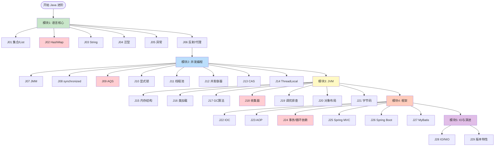
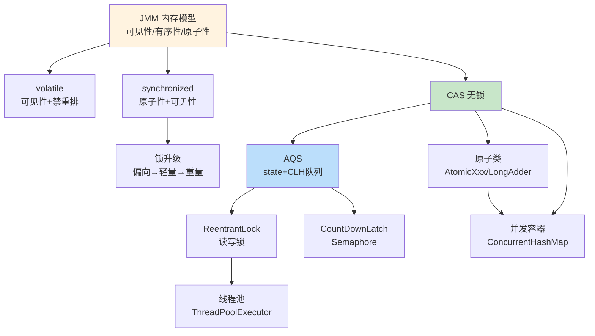
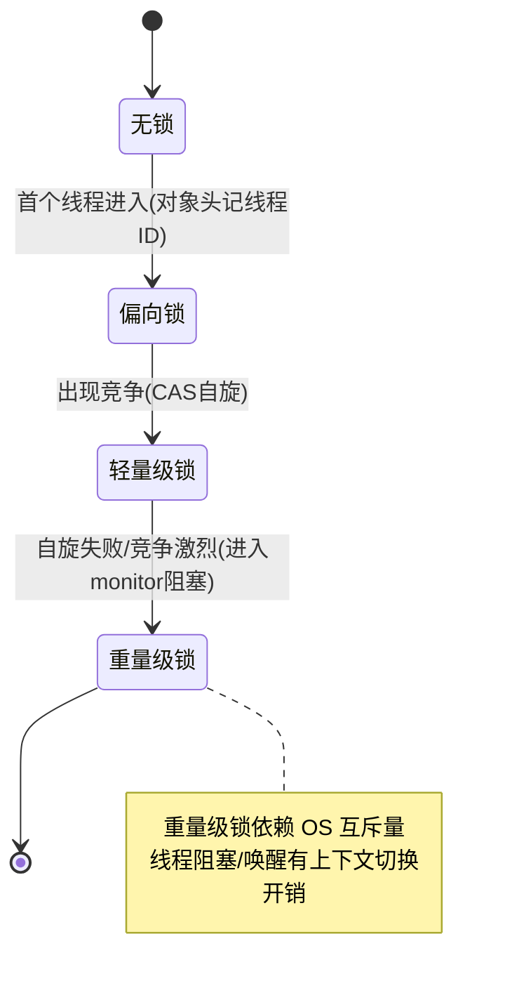
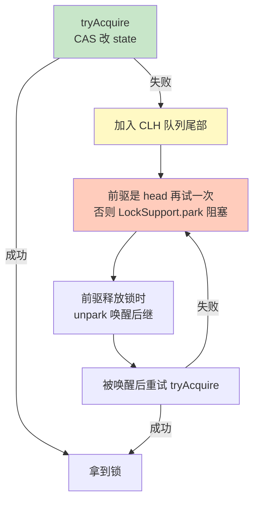
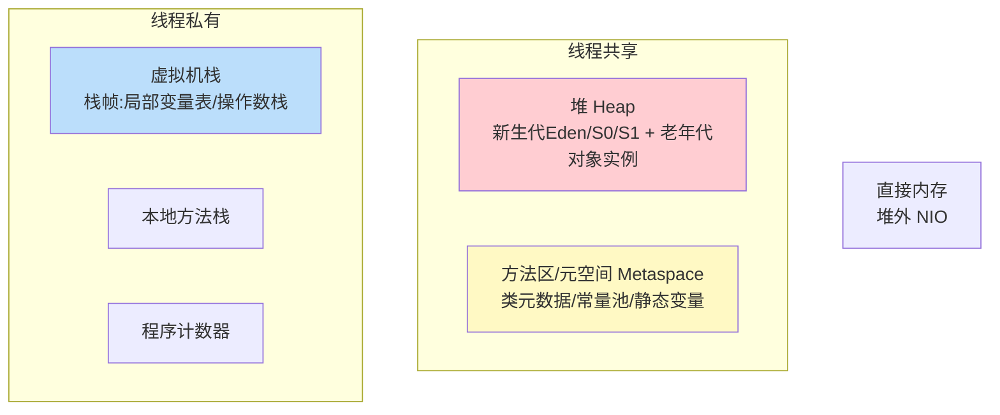
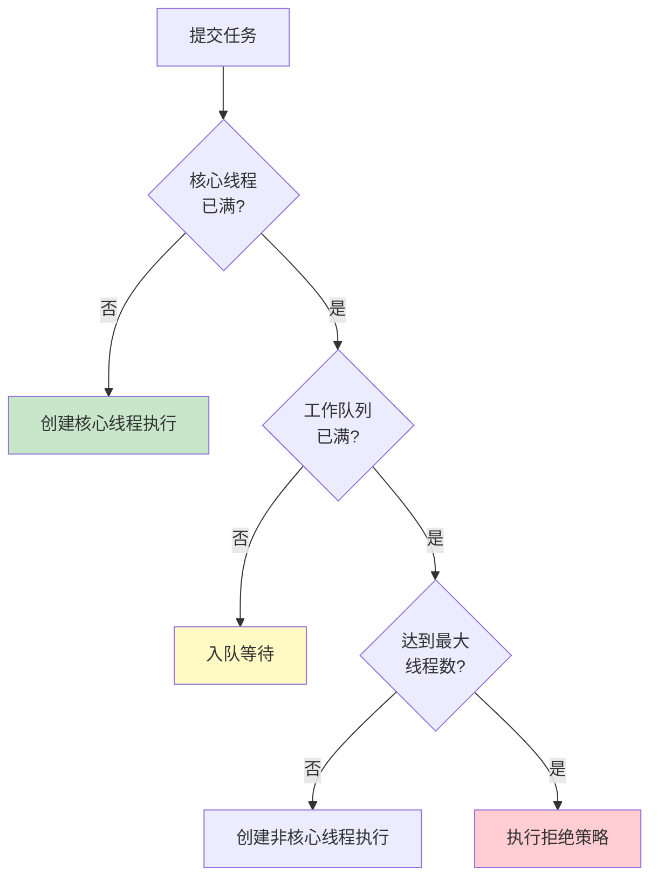
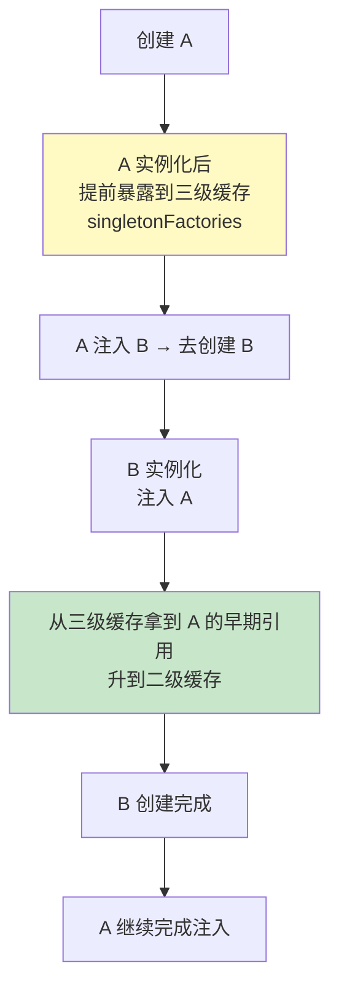
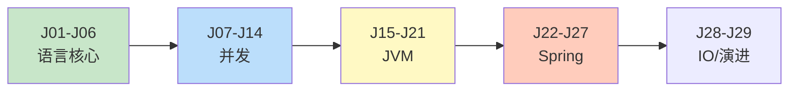

# Java 后端 路线图 · Mermaid 可视化

> 配合 [INDEX.md](./INDEX.md) 与 [QUIZ.md](./QUIZ.md) 使用
>
> **📅 内容基准：2026 年 6 月（Java 21/25 LTS）**

---

## 🗺️ 全景路线图



---

## 🧵 并发知识体系（模块二全景）



---

## 🔒 synchronized 锁升级（J08）



---

## 🧩 AQS 独占锁加锁流程（J09）



---

## 🧠 JVM 运行时内存结构（J15）



---

## ♻️ 线程池执行流程（J11）



---

## 🌱 Spring Bean 生命周期（J22）

```mermaid
flowchart LR
    Def[BeanDefinition] --> Inst[实例化<br>构造]
    Inst --> Pop[属性填充<br>依赖注入]
    Pop --> Aware[Aware 回调]
    Aware --> Before[BeanPostProcessor<br>前置]
    Before --> Init[初始化<br>@PostConstruct/afterPropertiesSet]
    Init --> After[BeanPostProcessor<br>后置 → AOP 代理]
    After --> Use[就绪/使用]
    Use --> Destroy[销毁<br>@PreDestroy]

    style Pop fill:#fff9c4
    style After fill:#ffccbc
```

---

## 🔄 Spring 循环依赖三级缓存（J24）



---

## 🎓 学习顺序建议



按顺序读 = 完整 Java 后端体系；面试突击 = 看 [INDEX.md](./INDEX.md) 的「路径 A」。
