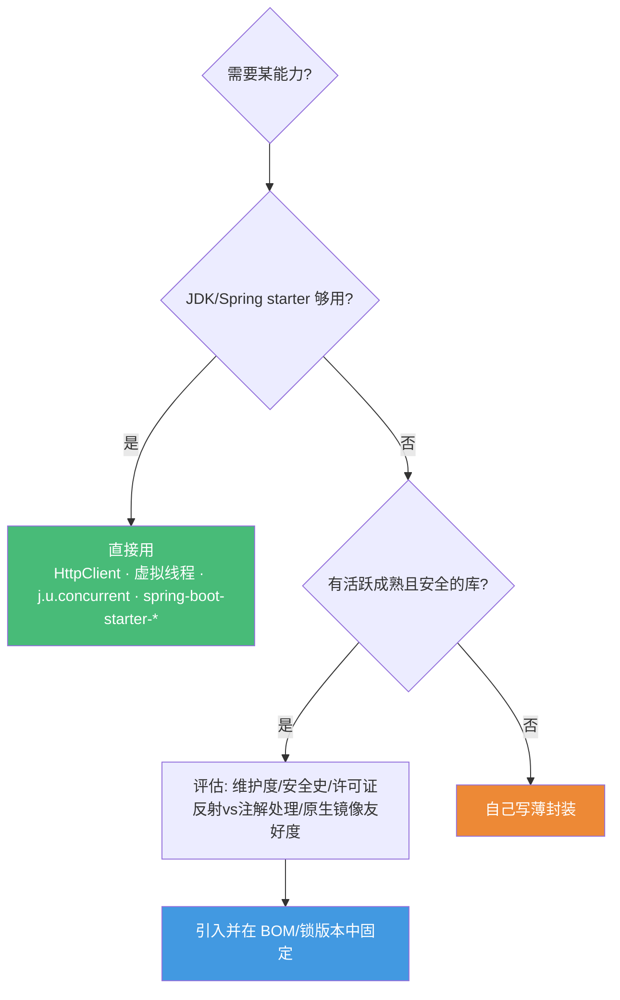

# Java 生态库选型地图 · 2026 实战精选

> 配套《Java 后端深度课程》的生态补充篇
> **📅 内容基准：Java 21 LTS / 25 LTS · Spring Boot 3.x（兼顾 Boot 4 / Spring 7）**（2026-06）· 标注每个库的活跃度与选型建议
> 本课程主体讲透了**语言机制、JVM 与 Spring 原理**，这一篇补上"真实项目里到底该用哪些第三方库"。

---

## 选型总原则：JDK 标准库 + Spring 生态优先

Java 的标准库与 Spring 全家桶覆盖面极广，很多场景**根本不需要再额外引库**。引入依赖前先问三个问题：

1. **JDK / Spring 够用吗？** Java 11+ 的 `java.net.http.HttpClient`、Java 21+ 的**虚拟线程**（J30）、`java.util.concurrent`（J09-J13）、Spring Boot 的 starter 已覆盖大量需求。Spring Boot 引入一个依赖前先看有没有官方 `spring-boot-starter-*`。
2. **这个库还活着、还安全吗？** Java 生态有惨痛的供应链教训：**Log4Shell**（Log4j2 CVE-2021-44228）、**fastjson AutoType RCE 史**、**Akka 改 BSL 商业许可**。选型必须把"维护活跃度 + 历史安全记录 + 许可证"一起看。
3. **它的成本是什么？** 编译期注解处理（Lombok/MapStruct/Dagger）vs 运行时反射（Spring/Hibernate）、对 **GraalVM 原生镜像**的友好度、依赖树大小、是否绑死某个框架。

> 📐 **黄金法则**：标准库 + Spring 能做到 80% 的事，第三方库帮你省掉重复的 20%。**别为了省 10 行代码引入一棵依赖树，更别引入一个安全黑历史。**

> ⚠️ **2026 关键背景**：课程基准为 Spring Boot 3.x（Spring 6 / Java 17 基线 / Jakarta EE 10）。截至 2026-06，**Spring Boot 4.x（Spring Framework 7）已转正**为当前主线，**Spring Framework 6 的开源支持已于 2026-06 结束**。本篇推荐对两代通用；新项目可直接上 Boot 4 + Java 21/25，存量项目 Java 17 基线不变、迁移成本低。

---

## 1. Web 框架与路由

| 库 | 用途 | 选型建议 | 2026 现状 |
|---|---|---|---|
| **Spring Boot 3 / Spring 6**（→ Boot 4 / Spring 7）| 全功能框架 | 事实标准、生态最大、starter 开箱即用（J25/J26）；Servlet 阻塞栈 + 虚拟线程，覆盖绝大多数后端 | 主线，Boot 4/Spring 7 已 GA |
| **Quarkus** | 云原生框架 | 为 **GraalVM 原生镜像 + K8s** 而生，启动快、内存省、热重载好；Serverless/边缘场景强 | 活跃（Red Hat）|
| **Micronaut** | 云原生框架 | **编译期 DI**（无运行时反射），启动快、原生镜像友好，定位与 Quarkus 类似 | 活跃 |
| **Helidon** | 云原生框架 | Oracle 出品，Helidon Níma 基于**虚拟线程**的轻量栈，理念新 | 活跃但生态较小 |
| **Javalin** | 轻量 Web | 极简、嵌入式、无注解魔法，适合小服务/工具/教学 | 活跃 |
| **Vert.x** | 响应式工具集 | 事件驱动、多语言、高吞吐；偏底层，写法是回调/响应式 | 活跃 |

**一句话选型**：绝大多数后端 → **Spring Boot**（团队熟、生态全、招聘易）。追求**原生镜像/极致冷启动**（Serverless、FaaS、大规模容器密度）→ **Quarkus** 或 **Micronaut**。要一个不带框架包袱的轻量 HTTP 层 → **Javalin**。需要事件驱动高并发网关 → **Vert.x**。**虚拟线程（J30）落地后，"为了高并发被迫上响应式"的理由已大幅减少**——多数请求-响应服务用 Spring MVC + 虚拟线程即可。

---

## 2. 依赖注入（DI）

| 库 | 用途 | 选型建议 | 2026 现状 |
|---|---|---|---|
| **Spring（IOC 容器）** | 运行时 DI | 默认选择，与全家桶无缝（J22）；功能最全、生命周期 + AOP + 配置一体 | 主线 |
| **Google Guice** | 运行时 DI | 轻量纯 DI，不带 Web/数据层；适合不想要整个 Spring 的中型应用 | 维护中，更新缓慢 |
| **Dagger** | 编译期 DI | **编译期生成**注入代码、零反射、启动快；Android 与原生镜像场景常用，但样板多 | 活跃（Google）|

**一句话选型**：在 Spring 项目里 DI 不用想，就是 **Spring**（J22）。脱离 Spring 又要轻量容器 → **Guice**。在意启动速度/原生镜像/无反射（Android、CLI、FaaS）→ **Dagger**（编译期）。

---

## 3. ORM / 数据库 / 连接池 / 迁移

| 库 | 用途 | 选型建议 | 2026 现状 |
|---|---|---|---|
| **Spring Data JPA** | Repository 抽象 | Spring 项目默认，方法名派生查询 + 分页极省事；底层即 Hibernate | 主线 |
| **Hibernate / JPA** | 全功能 ORM | Jakarta Persistence 标准实现，关系映射强；但有 N+1、懒加载、缓存复杂度（J24 关联）| 活跃 |
| **MyBatis** | SQL 映射 | **SQL 完全可控**、动态 SQL 强，国内主流（J27）；复杂查询/调优友好，无 ORM 魔法 | 活跃 |
| **jOOQ** | 类型安全 SQL | 用 Java DSL 写 SQL、**编译期类型检查**、贴近原生 SQL；高级特性在商业版 | 活跃 |
| **HikariCP** | 连接池 | **事实标准**，Spring Boot 默认，最快最稳，几乎无需替换 | 主线 |
| **Flyway** | 数据库迁移 | SQL 脚本式版本管理，简单直观，社区版够用 | 活跃 |
| **Liquibase** | 数据库迁移 | XML/YAML/SQL 多格式、数据库无关、回滚强；比 Flyway 重但更灵活 | 活跃 |

**一句话选型**：Spring 项目 CRUD 为主 → **Spring Data JPA**（底层 Hibernate）。**SQL 复杂、要完全可控** → **MyBatis**（J27）或 **jOOQ**（要类型安全）。连接池不用纠结，**HikariCP**。迁移工具：简单上 **Flyway**，要多库/回滚/复杂变更上 **Liquibase**。**别因为 ORM 方便就放任 N+1**——用 `JOIN FETCH` / `@EntityGraph` / 二级缓存，必要时下沉到原生 SQL（J24/J27）。

---

## 4. JSON 序列化

| 库 | 用途 | 选型建议 | 2026 现状 |
|---|---|---|---|
| **Jackson** | JSON | **首选**，Spring Boot 默认；功能全、生态最大、**默认不开启多态 AutoType（安全）** | 主线 |
| **Gson** | JSON | Google 出品，API 简洁、轻量；功能不如 Jackson 全，Android 常见 | 维护中 |
| **fastjson2** | 高性能 JSON | 比 fastjson 重写、**性能与安全均改善**；如确有高性能需求可用，**务必锁到较新版本、关闭 AutoType / 开 SafeMode** | 活跃 |

**一句话选型**：绝大多数项目 **Jackson**（与 Spring 无缝，安全默认好）。Android 或想要极简 API → **Gson**。确证 JSON 是性能热点（先 benchmark）且能接受运维其安全配置 → **fastjson2**。

> ⛔ **绝对不要用原 fastjson 1.x**：其 **AutoType 机制反复爆出反序列化 RCE**（如 CVE-2022-25845 等一长串黑名单绕过史），且已不再积极维护。必须迁移到 **fastjson2**，或直接回到 **Jackson**。任何 JSON 库处理**不可信输入**时都要警惕多态反序列化（Jackson 默认安全，开启 `@JsonTypeInfo`/`enableDefaultTyping` 时同样要用 allow-list）。

---

## 5. HTTP 客户端

| 库 | 用途 | 选型建议 | 2026 现状 |
|---|---|---|---|
| **`java.net.http.HttpClient`**（标准库，JDK 11+）| HTTP 请求 | **首选**：标准库自带、支持 HTTP/2 与异步、零额外依赖；**配合虚拟线程后阻塞写法即高并发** | 标准库 |
| **OkHttp** | HTTP 客户端 | 成熟、连接池/拦截器/重试完善，Android 与服务端都常用 | 活跃 |
| **Retrofit** | 声明式 REST | 用接口 + 注解声明 API，底层 OkHttp；调用第三方 REST 极省事 | 活跃 |
| **Apache HttpClient 5** | HTTP 客户端 | 老牌、功能最全、配置最细；遗留系统与复杂场景仍在用 | 活跃 |

**一句话选型**：新代码优先 **标准库 `HttpClient`**（JDK 11+，无依赖、HTTP/2、配虚拟线程后写阻塞代码也能扛高并发）。需要拦截器生态/Android → **OkHttp**；声明式调用第三方 API → **Retrofit**；遗留或极细粒度控制 → **HttpClient 5**。

> **坑**：任何 HTTP 客户端都**务必显式设置连接 / 读取超时**，否则故障时会挂死线程（虚拟线程下虽不再耗尽平台线程，但仍会泄漏 scope）。

---

## 6. 通用工具库

| 库 | 用途 | 选型建议 | 2026 现状 |
|---|---|---|---|
| **Guava** | 通用工具 | 集合扩展、缓存、`Preconditions`、并发工具等，质量高、稳定 | 活跃（Google）|
| **Apache Commons** | 通用工具 | `commons-lang3`（字符串/反射）、`commons-collections4`、`commons-io`——查漏补缺的常备 | 活跃 |
| **Lombok** | 样板消除 | 注解生成 getter/builder/构造器等，**编译期注解处理**；省样板但有 IDE/调试/升级耦合争议 | 活跃 |
| **MapStruct** | 对象映射 | **编译期生成** DTO↔Entity 映射代码、零反射、类型安全；**优于运行时反射的 ModelMapper** | 活跃 |
| **Vavr** | 函数式 | 持久化数据结构、`Try`/`Either`/模式匹配；引入函数式范式，但学习曲线 + 团队接受度需权衡 | 维护放缓 |

**一句话选型**：缺工具方法先翻 **Guava**，再翻 **Apache Commons**。对象映射用 **MapStruct**（编译期、可调试，别用反射型映射器）。Lombok 看团队约定——用就全队统一规则。Vavr 仅在团队真心拥抱函数式时引入（也可用 J31 的 Stream/`Optional` + 标准库替代）。

---

## 7. 参数校验

| 库 | 用途 | 选型建议 | 2026 现状 |
|---|---|---|---|
| **Hibernate Validator** | Bean 校验 | **Jakarta Bean Validation 参考实现**，事实标准；`@NotNull`/`@Valid`/分组/自定义约束，与 Spring MVC 无缝（J25）| 主线 |

**一句话选型**：校验就用 **Hibernate Validator**（Jakarta Bean Validation）。注意 **Jakarta 命名空间迁移**：Spring Boot 3+ 用 `jakarta.validation.*`，不是旧的 `javax.validation.*`。

---

## 8. 测试

| 库 | 用途 | 选型建议 | 2026 现状 |
|---|---|---|---|
| **JUnit 5** | 测试框架 | **事实标准**（J32），Jupiter 编程模型、扩展机制、参数化、嵌套；新项目唯一选择 | 主线 |
| **Mockito** | Mock 框架 | 单元测试 mock 标准（J32），stub/verify/`@Mock`/`@InjectMocks` | 活跃 |
| **AssertJ** | 流式断言 | `assertThat(x).isEqualTo(...)` 链式、可读性远胜 JUnit 原生断言——强烈推荐 | 活跃 |
| **Testcontainers** | 集成测试 | **强烈推荐**：用 Docker 拉起真实 PG/Redis/Kafka 做集成测试，告别脆弱 mock（J32）| 活跃 |
| **WireMock** | HTTP 桩 | mock 外部 HTTP 依赖（第三方 API），契约测试常用 | 活跃 |
| **REST Assured** | API 测试 | 流式 DSL 测试 REST 接口，集成测试层好用 | 活跃 |

**一句话选型**：框架一律 **JUnit 5**；mock 用 **Mockito**；断言**强烈推荐 AssertJ**（比原生断言可读太多）；**集成测试优先 Testcontainers**（真实依赖比 mock 可信，呼应 J32）；外部 HTTP 依赖用 **WireMock** 打桩，REST 接口端到端用 **REST Assured**。

---

## 9. 响应式与并发

| 库 | 用途 | 选型建议 | 2026 现状 |
|---|---|---|---|
| **虚拟线程**（JDK 21+，标准库）| 高并发 | **2026 头号变化**（J30）：阻塞写法即可承载海量并发，颠覆"为并发被迫上响应式"；JDK 25 修复 `synchronized` pinning | 标准库 |
| **Project Reactor** | 响应式 | Spring WebFlux 底层；**流式 / 背压 / 网关 / 事件处理**仍是其主场 | 活跃 |
| **RxJava** | 响应式 | 老牌响应式，Android 生态多；服务端新项目多被 Reactor 取代 | 活跃但服务端式微 |
| **LMAX Disruptor** | 无锁队列 | 极致低延迟的环形缓冲队列（金融/撮合）；小众但在其领域无可替代 | 维护中 |

**一句话选型**：**绝大多数请求-响应服务，用 Spring MVC + 虚拟线程**（J30），而非响应式——代码简单、栈跟踪可读、可用 Hibernate（响应式需 R2DBC，失去 ORM）。**Reactor 仍适合流式、背压、高并发网关/事件处理**，且可与虚拟线程混用（边缘走 Reactor、内部阻塞逻辑走虚拟线程）。Disruptor 仅在极致低延迟场景。

> ⚠️ **2026 现实**：JDK 25 LTS（2025-09）随 JEP 491 修复了 `synchronized` 的 pinning、并转正 ScopedValue，虚拟线程已生产就绪。但仍有坑：**ThreadLocal 在虚拟线程规模下不安全（改用 ScopedValue）**、**对有限资源（如连接池）要用信号量显式限流**、CPU 密集型不受益（J30）。

---

## 10. 日志

| 库 | 用途 | 选型建议 | 2026 现状 |
|---|---|---|---|
| **SLF4J** | 日志门面 | **始终面向 SLF4J 编程**，与具体实现解耦，可随时换底层 | 主线 |
| **Logback** | 日志实现 | **Spring Boot 默认**，稳定、快、配置直观；多数项目首选 | 主线 |
| **Log4j2** | 日志实现 | **异步日志（Disruptor 支持）吞吐极高**，大流量/低延迟场景优于 Logback；**务必保持最新补丁版** | 活跃 |

**一句话选型**：代码一律写 **SLF4J 门面**；底层默认 **Logback**（Spring Boot 默认，够用）；需要极致异步吞吐再换 **Log4j2**（换依赖即可，代码不动）。

> ⛔ **Log4Shell 的教训**：**绝不使用已 EOL 的 Log4j 1.x**；用 Log4j2 必须持续升级到最新补丁版（CVE-2021-44228 后 2.15→2.17 又连续修了多个洞）。核心原则是**任何日志/依赖都要例行更新到已修复版本**——供应链安全比性能更优先。

---

## 11. 可观测性（Observability）

| 库 | 用途 | 选型建议 | 2026 现状 |
|---|---|---|---|
| **Micrometer** | 指标门面 | **Spring Boot 内置**，"指标界的 SLF4J"，对接 Prometheus/OTLP 等；Micrometer Tracing 统一链路 | 主线 |
| **OpenTelemetry Java** | 链路/指标/日志 | **可观测性事实标准**：trace + metric + log 三合一，Java Agent 可零侵入接入 | 活跃 |

**一句话选型**：Spring 项目指标用内置 **Micrometer**（自动暴露 `/actuator/prometheus`）；**统一可观测性上 OpenTelemetry**（Micrometer Tracing 可桥接 OTel）。Spring Boot 3+ 已把 Observability（Micrometer + OTel）作为一等公民。

---

## 12. 消息队列

| 库 | 用途 | 选型建议 | 2026 现状 |
|---|---|---|---|
| **Spring Kafka** | Kafka 集成 | Spring 项目接 Kafka 的标准封装，`@KafkaListener`、事务、错误处理一体 | 主线 |
| **Spring AMQP** | RabbitMQ 集成 | Spring 项目接 RabbitMQ 的标准封装，`@RabbitListener`、模板、声明式 | 主线 |

**一句话选型**：Spring 项目接 Kafka → **Spring Kafka**；接 RabbitMQ → **Spring AMQP**。两者都基于官方客户端做了贴合 Spring 的封装，无需直接裸用底层客户端。

> 📌 **Akka 警示**：若你在做 Actor 模型 / 流处理，注意 **Akka 自 2.7 起改为 BSL 商业许可**（年营收超 \$25M 的公司生产环境需付费、按 core 收费），最后的 Apache 2.0 版本 Akka 2.6.x 已 EOL。**开源替代是 Apache Pekko**（Akka 2.6.x 的社区 fork，2024-05 成为 Apache 顶级项目，迁移基本只需改 `akka.*`→`pekko.*`）。

---

## 13. 缓存

| 库 | 用途 | 选型建议 | 2026 现状 |
|---|---|---|---|
| **Caffeine** | 本地缓存 | **进程内缓存首选**：高命中率（W-TinyLFU）、高并发、Spring Cache 直接支持 | 活跃 |
| **Redisson** | Redis 客户端 | 不止缓存：分布式锁、限流、各种分布式数据结构；功能远超普通客户端 | 活跃 |
| **Ehcache** | 本地/堆外缓存 | 老牌、支持堆外与磁盘分层、JSR-107（JCache）标准实现 | 维护中 |

**一句话选型**：**进程内缓存用 Caffeine**（取代老旧的 Guava Cache）。需要**分布式缓存 / 分布式锁 / 限流**等 Redis 高级能力 → **Redisson**（普通客户端可用 Lettuce，Spring Boot 默认）。需要堆外/磁盘分层或 JCache 标准 → **Ehcache**。

---

## 14. gRPC 与构建工具

| 库/工具 | 用途 | 选型建议 | 2026 现状 |
|---|---|---|---|
| **grpc-java** | gRPC 官方实现 | Java 微服务内部通信标准，与 protobuf 工具链配合 | 活跃 |
| **Maven** | 构建 | **约定优于配置**、生态最稳、上手快、IDE 支持好；企业默认 | Maven 3.9.x 主线，**Maven 4 临近 GA** |
| **Gradle** | 构建 | **更灵活、增量/缓存快**、多模块与自定义构建强；**Kotlin DSL 已成新项目默认** | Gradle 9 主线 |

**一句话选型**：**gRPC 用官方 grpc-java**。构建工具：**团队/企业标准化、追求稳定与低心智负担 → Maven**（Maven 4 带来 POM 4.1.0、subprojects、Maven Shell 等改进，但截至 2026-06 仍 RC，未 GA，生产请用 3.9.x）；**大型多模块、要构建性能与灵活性 → Gradle 9**（Kotlin DSL 默认，配置缓存为推荐模式）。Spring/Quarkus/Micronaut 对两者都一等支持，选熟悉的即可。

---

## 🗺️ 场景 → 首选 速查

| 场景 | 2026 首选 | 备选 |
|---|---|---|
| Web 框架 | **Spring Boot** | Quarkus / Micronaut（原生镜像）|
| 轻量 HTTP 层 | Javalin | Vert.x |
| 依赖注入 | **Spring** | Dagger（编译期）/ Guice |
| ORM / 数据访问 | Spring Data JPA / **MyBatis** | jOOQ（类型安全）|
| 连接池 | **HikariCP** | — |
| DB 迁移 | Flyway | Liquibase |
| JSON | **Jackson** | fastjson2（高性能，慎配）|
| HTTP 客户端 | **标准库 HttpClient** | OkHttp / Retrofit |
| 对象映射 | **MapStruct** | — |
| 校验 | **Hibernate Validator** | — |
| 测试框架 | **JUnit 5** | — |
| Mock | Mockito | — |
| 断言 | **AssertJ** | — |
| 集成测试 | **Testcontainers** | WireMock（HTTP 桩）|
| 高并发 | **虚拟线程**（J30）| Reactor（流式/网关）|
| 日志 | SLF4J + **Logback** | SLF4J + Log4j2（高吞吐）|
| 可观测性 | **Micrometer + OpenTelemetry** | — |
| 本地缓存 | **Caffeine** | Ehcache |
| 分布式锁/缓存 | **Redisson** | Lettuce |
| 消息（Kafka/MQ）| Spring Kafka / Spring AMQP | — |
| Actor / 流处理 | **Apache Pekko** | Akka（商业付费）|
| 构建 | Maven / **Gradle 9** | — |

---

## ⚠️ 选型避坑清单

- ⛔ **用原 fastjson 1.x**：AutoType RCE 黑历史，已不积极维护。迁移到 **fastjson2**（锁新版 + 关 AutoType）或回到 **Jackson**。
- ⛔ **用 Log4j 1.x**：已 EOL 无补丁。用 **Log4j2** 且持续升级（Log4Shell 教训：依赖必须例行更新到已修复版）。
- ⛔ **新引入 Akka 不看许可证**：2.7+ 是 BSL 商业许可。开源场景用 **Apache Pekko**。
- ❌ **运行时反射型对象映射器**（如 ModelMapper）：慢且难调试，用 **MapStruct**（编译期生成）。
- ❌ **盲目上响应式（WebFlux）追高并发**：2026 多数请求-响应服务用 **Spring MVC + 虚拟线程**（J30）更简单、可调试、可用 Hibernate。Reactor 留给流式/背压/网关。
- ❌ **虚拟线程下继续重度依赖 ThreadLocal**：规模化下不安全，改用 **ScopedValue**（J14/J30）；对连接池等有限资源要**信号量显式限流**。
- ❌ **放任 Hibernate N+1**：用 `JOIN FETCH`/`@EntityGraph`/二级缓存（J24/J27），复杂查询下沉 SQL（MyBatis/jOOQ）。
- ❌ **忘记给 HTTP 客户端设超时**：故障时挂死/泄漏线程。
- ❌ **混用 `javax.*` 与 `jakarta.*`**：Spring Boot 3+ 全面迁到 **jakarta 命名空间**，旧库需确认已支持。
- ❌ **不 benchmark 就换"高性能"库**（fastjson2、Log4j2 async）：先用 J19 工具（JFR/Arthas/JMH）定位真瓶颈。
- ❌ **生产用 Maven 4 / 预发布版**：截至 2026-06 仍 RC，生产用 Maven 3.9.x。

---

## 📌 与课程章节的对应

| 课程章节 | 相关生态库 |
|---|---|
| J11 线程池 / J30 虚拟线程 | 虚拟线程 / Reactor / RxJava / Disruptor |
| J14 ThreadLocal | ScopedValue（虚拟线程下替代）|
| J22 Spring IOC | Spring / Guice / Dagger |
| J23 Spring AOP / J06 动态代理 | Spring AOP（注意原生镜像对反射/代理的限制）|
| J24 Spring 事务 | Spring Data JPA / Hibernate（N+1 与事务）|
| J25 Spring MVC | Spring Boot / Hibernate Validator / Jackson |
| J26 Spring Boot | starter / Micrometer / HikariCP / Logback |
| J27 MyBatis | MyBatis / jOOQ / Flyway / Liquibase |
| J28 IO/NIO | 标准库 HttpClient / OkHttp / Vert.x / Netty |
| J31 函数式 / Stream | Vavr（按需）/ 标准库 Optional |
| J32 测试 | JUnit 5 / Mockito / AssertJ / Testcontainers / WireMock / REST Assured |
| J19 调优排查 | JFR / Arthas / JMH（验证"高性能"库前提）|

---

> 🔁 **原则复述**：JDK 标准库 + Spring 生态优先 → 确有需要再引入**活跃、安全、许可证清晰**的库 → 用 BOM/锁版本固定、用 J19 工具验证性能、用 J32 测试守住质量。生态会变（Spring 6→7、Akka 改许可、fastjson→fastjson2、虚拟线程冲击响应式），但"先标准库与 Spring、用数据说话、把安全与许可证纳入选型、控制依赖树"这套方法不变。
>
> 📅 库的活跃度与安全状态会随时间变化，引入前请上 GitHub 看最近提交、查 Snyk/OSV 漏洞库、确认 LTS 与许可证，本篇基准为 2026-06（Java 21/25 LTS · Spring Boot 3.x，兼顾 Boot 4/Spring 7）。
