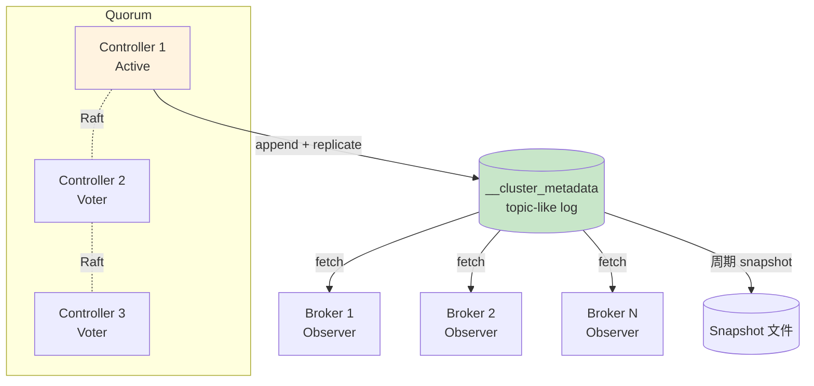

# 精通 KRaft 元数据管理：Controller Quorum、Metadata Log 与零停机迁移

> 关联章节：[K01 Topic/Partition/Offset](./01-精通-Topic-Partition-Offset.md)、[K05 ISR/HW/LEO](./05-精通-复制-ISR.md)

---

## 引言：Kafka 终于摆脱 ZooKeeper

2010 年 LinkedIn 把 Kafka 开源时，分布式协调用了当时业界事实标准 **ZooKeeper**。十几年来 ZK 既是 Kafka 的"必备依赖"，也是它的最大痛点：

- 运维负担：Kafka 集群之外还要一套 ZK 集群（通常 3-5 节点）
- 元数据规模上限：ZK 单 znode ~1MB，集群有几万 partition 时 watch / 通知开销巨大
- 启动时间：大集群冷启动加载元数据慢到 10 分钟以上
- 升级链：Kafka 升级要看 ZK 版本兼容性，多一层耦合

2019 年 Kafka 社区启动 **KIP-500（KRaft）**：用自研 Raft 在 Kafka 进程内管理元数据。2022 年 3.3 production ready，**2025 Kafka 4.0 完全移除 ZK**。

这章把"为什么要 KRaft、KRaft 怎么工作、ZK 时代到 KRaft 时代怎么迁"讲透。读完之后你应该能：

- 解释 controller 和 broker 的角色划分
- 画出 metadata log 的写、复制、快照流程
- 设计一个 3 controller / 5 broker 的混合或分离部署
- 执行从 ZK 模式到 KRaft 模式的零停机迁移
- 诊断 controller 不可用、metadata lag 等故障

---

## 第一章：为什么需要 KRaft

### 1.1 ZK 时代的元数据模型

```
┌──────────────────┐         ┌──────────────────┐
│  ZooKeeper       │         │  Kafka Broker    │
│  /brokers/ids    │◄────────│  watch + push    │
│  /topics/foo     │  watch  │  active controller│
│  /controller     │         │                  │
│  /admin/...      │         └──────────────────┘
└──────────────────┘
```

- 集群里**任一时刻有一个 broker 充当 controller**（通过 ZK 临时节点选出）
- controller 在 ZK 上读写元数据（topic、partition、ISR、配置等）
- 其他 broker 通过 ZK watch 或 controller 推送获取更新

**致命问题**：

1. 元数据**没有日志**，是 ZK 上的"快照点"。controller 切换时新 controller 要从 ZK 全量读元数据 → 大集群几分钟
2. ZK watch 风暴：一个 partition leader 变化 → 触发所有相关 broker 的 watch → 几千几万次回调
3. controller 是单点（虽然有 failover），出故障期间整集群"元数据冻结"

### 1.2 KRaft 的设计目标

- **元数据本身就是一个 Kafka topic**（`__cluster_metadata`），有日志、有 offset、有复制
- **Raft 协议**保证一致性
- **多 controller 形成 quorum**，无需外部 ZK
- **broker 通过 fetch metadata log 增量同步**，告别 watch 风暴
- 集群启动 / controller 故障切换从分钟级降到秒级

### 1.3 Kafka 4.0 的现状

- ZK 模式 **完全移除**（3.x 还兼容，4.0 彻底删了 ZK 相关代码）
- KRaft 是**唯一选项**
- 老集群必须升级到 3.x 用 bridge 模式迁移，**4.0 不能直接跑 ZK**

---

## 第二章：节点角色 —— Controller 与 Broker

### 2.1 三种部署模式

| `process.roles=` | 含义 | 适用 |
|---|---|---|
| `controller` | 纯 controller 节点 | 大集群专门 3-5 台 |
| `broker` | 纯 broker 节点 | 数据节点 |
| `broker,controller` | 兼任两职 | 小集群 / dev |

```properties
# server.properties
process.roles=broker,controller
node.id=1
controller.quorum.voters=1@host1:9093,2@host2:9093,3@host3:9093
listeners=PLAINTEXT://:9092,CONTROLLER://:9093
controller.listener.names=CONTROLLER
inter.broker.listener.name=PLAINTEXT
```

### 2.2 Quorum 大小怎么选

| controller 数 | quorum | 容忍故障 | 适用 |
|---|---|---|---|
| 1 | 1 | 0 | dev only |
| 3 | 2 | 1 | 小到中等生产 |
| 5 | 3 | 2 | 大集群 |
| 7 | 4 | 3 | 极特殊（一般用不上） |

**永远奇数个 controller**。偶数没好处（容忍故障数不变）反而 quorum 大需要更多 ack。

### 2.3 Active Controller 与 Voter

- quorum 内的节点都是 **voter**（参与选主）
- 其中**一个是 active controller**（leader），负责实际的元数据写入和广播
- voter 之间通过 Raft 协议同步

```bash
# 看当前 quorum 状态
kafka-metadata-quorum.sh --bootstrap-server :9092 describe --status
```

```
ClusterId:              xxx
LeaderId:               2
LeaderEpoch:            17
HighWatermark:          145623
MaxFollowerLag:         3
MaxFollowerLagTimeMs:   12
CurrentVoters:          [1,2,3]
CurrentObservers:       []
```

- LeaderId：当前 active controller
- HighWatermark：元数据 log 的提交位置
- MaxFollowerLag：最慢 voter 落后了多少条

### 2.4 Observer 节点

broker（不参与 quorum）作为 metadata log 的 **observer**：

- 只读拉取 metadata log
- 不参与选主
- 失败不影响 quorum

这是 KRaft 设计的关键：**broker 数量与 quorum 解耦**。1000 个 broker 也只需要 3-5 个 controller。

---

## 第三章：Metadata Log —— 元数据即日志

### 3.1 `__cluster_metadata` topic

KRaft 把元数据存成一个**单分区、可复制**的 Kafka topic：

- 名字：`__cluster_metadata`
- 1 个 partition（保证全序）
- 副本 = quorum 中的 voter 数
- 每条记录是一个 **MetadataRecord**

实际看：

```bash
ls -lh /var/lib/kafka-logs/__cluster_metadata-0/
00000000000000000000.log
00000000000000000000.index
00000000000000000000.timeindex
00000000000145000-snapshot.checkpoint
00000000000145000-snapshot.checkpoint.crc
```

跟普通 topic 一样的物理结构。区别只在内容（不是用户消息，是元数据记录）。

### 3.2 元数据记录类型

不同事件对应不同记录：

| 记录类型 | 触发 |
|---|---|
| `RegisterBrokerRecord` | broker 启动注册 |
| `UnregisterBrokerRecord` | broker 注销 |
| `TopicRecord` | 创建 topic |
| `PartitionRecord` | 创建 partition |
| `PartitionChangeRecord` | leader / ISR 变化 |
| `ConfigRecord` | 配置变更 |
| `AccessControlEntryRecord` | ACL 增减 |
| `FeatureLevelRecord` | feature flag 变化 |
| `ProducerIdsRecord` | producer ID 分配 |

读 log 等于看到集群"从创世到现在"的完整变更史。

### 3.3 写入流程

```
1. 客户端（admin / broker）发送 CreateTopic 等请求
2. broker 转发到 active controller
3. active controller 在 metadata log append 一条记录
4. 其他 voter 通过 Raft Fetch 复制
5. 当 majority（含自己）写入 → 提交（advance HW）
6. broker observer 通过 Fetch 拉到提交的记录
7. broker 应用记录到本地状态 → 给客户端返回成功
```

跟普通 partition 复制几乎一模一样——这就是 KRaft 的优雅之处：**复用 Kafka 自己**。

### 3.4 Snapshot

如果一个 broker 离线很久重新上线，从头 replay 整个 metadata log 太慢。KRaft 提供 snapshot：

- 周期或大小阈值触发
- 把当前完整元数据状态序列化成快照文件
- 老 log 可以截断
- 新节点 join 时先拉 snapshot 再追增量

```properties
metadata.log.max.snapshot.interval.ms=3600000   # 1h
metadata.max.idle.interval.ms=500
```

### 3.5 Broker 落后检测

每个 broker 心跳上报自己的 metadata offset，active controller 看：

- broker offset 与 HW 差距过大 → 标记为 fencing（暂停作为 partition leader）
- broker 一段时间没心跳 → 标记为 dead
- 恢复后慢慢追上 → 解除 fencing

---

## 第四章：Raft 协议在 KRaft 中的实现

### 4.1 KRaft 不是标准 Raft

KRaft 基于 Raft 但有调整：

| 项 | 标准 Raft | KRaft |
|---|---|---|
| 复制流向 | leader push | follower pull（Fetch） |
| 日志结构 | 通用 | Kafka log format |
| 持久化 | log file | Kafka segment |
| 选举触发 | leader 心跳超时 | 同 + epoch / lastFetch |
| Log Compaction | snapshot | snapshot |

**关键决策**：复用 Kafka 的 fetch 机制做复制。好处：代码复用、监控复用；坏处：协议比标准 Raft 啰嗦。

### 4.2 选举过程

每个 voter 都有一个 **epoch**（任期号）。

```
1. follower 一段时间（fetch.timeout.ms）没收到 leader 的响应
2. follower 升 epoch，自己变成 candidate，给其他 voter 发 VoteRequest
3. 其他 voter 检查 candidate 的 log 是否至少跟自己一样新
   - 如果是 → 投赞同
   - 否则 → 拒绝
4. candidate 拿到 quorum 票 → 成为新 leader
5. 新 leader 广播 BeginQuorumEpoch
```

为防止脑裂，每个 voter **一个 epoch 只投一次票**，持久化到磁盘。

### 4.3 故障场景

| 故障 | 影响 |
|---|---|
| 1 个 voter 挂（3 voter 集群） | 不影响，剩余 2 个仍 quorum |
| 2 个 voter 挂（3 voter 集群） | 无法选主，元数据冻结 |
| 网络分区少数派 | 少数派降级，多数派继续 |
| 网络分区两边都 < quorum | 全集群冻结（元数据，普通 produce/consume 仍可继续，但创建 topic 等失败） |

### 4.4 元数据冻结期间能做什么

控制器不可用时：

- 不能创建 / 删除 topic
- 不能改 ISR / leader（这是大问题）
- ACL 不能改
- Consumer group rebalance 受影响（依赖元数据）

但**已有 partition 的读写仍正常**——broker 用本地缓存的元数据继续服务。这是 KRaft 与 ZK 时代最大区别之一：**控制面与数据面隔离**。

---

## 第五章：从 ZK 到 KRaft 的迁移

### 5.1 迁移路径概览

只能从 **Kafka 3.4+** 起步迁。直接从 2.x 迁不行，要先升级到 3.x。

```
2.x ZK  →  3.4-3.9 ZK + bridge  →  KRaft only  →  4.0
```

### 5.2 Bridge 模式

3.4 引入。让一个集群同时有：

- ZK 仍存在，旧 broker 仍能读
- 新加的 KRaft controllers 也在同步元数据
- 双向同步：ZK 写 → KRaft；KRaft 写 → ZK

bridge 模式有几个月窗口供你滚动迁移 broker。

### 5.3 迁移步骤

```bash
# Step 1: 升级整个集群到最新 3.x（含 ZK）

# Step 2: 部署 KRaft controller quorum（独立 3 节点）
# 在新机器上跑 process.roles=controller
kafka-storage.sh format --config controller.properties --cluster-id $(zkCli get /cluster/id)

# Step 3: 在 ZK broker 上加 bridge 配置
# server.properties:
# zookeeper.metadata.migration.enable=true
# controller.quorum.voters=...
# inter.broker.protocol.version=3.9

# Step 4: 启动 KRaft controllers，它们从 ZK 拉元数据
# 观察 kafka-metadata-quorum.sh 看进度

# Step 5: 一个一个 broker 切到 KRaft 模式（重启）
# 旧 broker 配 process.roles=broker（不再用 ZK）

# Step 6: 全部 broker 完成后，去掉 ZK
# zookeeper.metadata.migration.enable=false
# 删 zookeeper.connect

# Step 7: 关 ZK 集群
```

### 5.4 迁移风险与回滚

**风险**：

- bridge 模式存在性能开销（双写）
- 在迁移中途回滚比正向更复杂
- 大集群（几千 partition）迁移过程可能要几小时

**回滚**：

- 在 broker 全部切到 KRaft **之前**，回滚到 ZK 是可行的
- 一旦关 ZK，回滚需要从 KRaft 元数据反构 ZK znode，**不官方支持**

**实操建议**：

- 先在测试集群完整跑一遍
- 业务低峰期执行
- 准备好快照备份
- 不要急着关 ZK——bridge 模式留一周观察期

---

## 第六章：KRaft 与 ZK 性能对比

### 6.1 启动时间

| 集群规模 | ZK 模式冷启动 | KRaft |
|---|---|---|
| 100 broker / 几千 partition | 30s-2min | < 5s |
| 1000 broker / 几万 partition | 5-15 min | 10-30s |
| 极大集群（社区记录 200 万 partition） | 不可能 | 1-2 min |

KRaft 启动快的原因：

- metadata log 增量 fetch，不全量 reload
- 没有 ZK watch 风暴
- 没有 controller 切换时全量 reload

### 6.2 元数据变更延迟

| 操作 | ZK | KRaft |
|---|---|---|
| 创建 topic | 50-500ms | 5-50ms |
| Leader 选举（per-partition） | 50-500ms | 10-100ms |
| 大批量 partition reassignment | 几分钟 | 几秒-几十秒 |

### 6.3 元数据规模上限

- ZK 模式：实际上限 ~20 万 partition（再多 controller 切换 / 启动崩）
- KRaft 模式：社区已演示 200 万 partition，理论上限远高

---

## 第七章：监控 KRaft

### 7.1 关键 JMX 指标

| MBean | 含义 |
|---|---|
| `kafka.controller:type=KafkaController,name=ActiveControllerCount` | 当前节点是否 active（应该 quorum 中恰 1 个为 1） |
| `kafka.controller:type=KafkaController,name=GlobalPartitionCount` | 总 partition 数 |
| `kafka.controller:type=KafkaController,name=GlobalTopicCount` | 总 topic 数 |
| `kafka.controller:type=KafkaController,name=MetadataErrorCount` | 元数据应用错误（不应该有） |
| `kafka.server:type=raft-metrics,name=current-state` | 当前角色（leader/follower/candidate） |
| `kafka.server:type=raft-metrics,name=current-leader` | 已知的 leader id |
| `kafka.server:type=raft-metrics,name=log-end-offset` | 本地 log 末尾 |
| `kafka.server:type=raft-metrics,name=high-watermark` | 提交位置 |

### 7.2 CLI 速查

```bash
# Quorum 整体状态
kafka-metadata-quorum.sh --bootstrap-server :9092 describe --status

# 复制状态
kafka-metadata-quorum.sh --bootstrap-server :9092 describe --replication

# Active controller
kafka-metadata-shell.sh --snapshot /var/lib/kafka/__cluster_metadata-0/00000000000145000-snapshot.checkpoint
# 进入 shell 后：
# ls
# cat /brokers
```

### 7.3 告警阈值

| 指标 | 阈值 | 含义 |
|---|---|---|
| ActiveControllerCount（求和） | 必须 = 1 | 0 = 全集群挂；> 1 = 脑裂 |
| MaxFollowerLag | > 1000 持续 1min | controller voter 之间延迟大 |
| MaxFollowerLagTimeMs | > 5000 | 落后超过 5s 危险 |
| MetadataErrorCount | > 0 | 应用元数据失败，看 log |

---

## 第八章：常见故障

### 8.1 案例：Quorum 失联

**症状**：

```
WARN [RaftManager] No leader found for partition __cluster_metadata-0
```

整集群创建 topic 失败，但已有 topic 读写正常。

**诊断**：

```bash
kafka-metadata-quorum.sh --bootstrap-server :9092 describe --status
# 看 LeaderId 是否 -1
# 看 CurrentVoters 数量
```

**根因**：3 个 controller 中 2 个网络分区 / 同时挂。

**修复**：

- 恢复至少 quorum 数的 controller
- 不要尝试"强制选主"——这会破坏一致性

### 8.2 案例：broker 启动卡在 fetch metadata

**症状**：broker 启动 30s+，日志显示在 fetching metadata。

**诊断**：

```bash
# 看 broker 节点上的 raft log 文件大小
ls -lh /var/lib/kafka/__cluster_metadata-0/
# log 几个 GB → 没有合适 snapshot
```

**根因**：snapshot interval 太长，broker 离线久后要 replay 大量日志。

**修复**：

- 等启动完成（耐心）
- 调小 `metadata.log.max.snapshot.interval.ms` 让 snapshot 更频繁

### 8.3 案例：迁移卡在 bridge 阶段

**症状**：3 天前开始 bridge，但 KRaft controllers 一直 lag。

**诊断**：

```bash
kafka-metadata-quorum.sh ... describe --status
# MaxFollowerLag 巨大
```

**根因**：原 ZK 有大量 ACL（几万条），双写让 controller IO 跟不上。

**修复**：

- 加 KRaft controller 节点的 IO 资源
- 业务低峰执行迁移（减少元数据变更）
- 实在不行清理一批不用的 ACL

### 8.4 案例：升到 4.0 后 ZK 集群没关

**症状**：升 Kafka 到 4.0 后，发现 ZK 集群还在跑。

**正确做法**：

- ZK 在 4.0 阶段已经无用，可以安全关
- 留个备份的 znode 快照，万一审计要回看可以查
- 销毁 ZK 集群机器

---

## 第九章：KRaft 的局限与未来

### 9.1 已知局限

- **单 metadata partition**：所有元数据写都序列化经过 active controller。元数据写入吞吐有上限（实测几千 op/s 顶天）
- **跨 region 部署不友好**：Raft 协议跨 region 心跳 RTT 大，elections 不稳
- **Snapshot 还有改进空间**：极大集群下 snapshot 文件几百 MB，新节点 join 仍然慢

### 9.2 演化方向

KIP 路线图：

- **Metadata partition shards**：把 controller 工作拆 partition，提升写吞吐
- **更强的 multi-region 支持**：观察者模式跨 region 同步
- **更紧凑的 snapshot 格式**：列式存储减少传输

### 9.3 与替代品对比

| 系统 | 元数据模型 |
|---|---|
| Kafka 4.0 | KRaft Raft |
| Redpanda | Raft（per-partition！每个 partition 自己 Raft） |
| Pulsar | ZooKeeper（仍是 metadata 后端） + BookKeeper（数据） |
| WarpStream | 不用 Raft，元数据放对象存储 |

Redpanda 的设计被认为更激进——**不仅元数据，每个 topic partition 都跑 Raft**。但实现复杂、调试难。

---

## 总结 · KRaft 一图流



KRaft 核心心法：

1. **元数据即日志**——一切变更可追溯、可重放
2. **Raft quorum 保证一致性**——至少 quorum 同意才提交
3. **broker 是 observer**——读 metadata log，不参与选主
4. **控制面 / 数据面隔离**——元数据冻结不影响普通读写
5. **复用 Kafka 自身机制**——log format、fetch 协议、snapshot 都是熟悉的味道

---

## 练习题

1. 为什么 KRaft 比 ZK 启动快？至少说 3 个原因。
2. 一个 3 controller 集群中 2 个同时挂，集群能做什么、不能做什么？
3. `process.roles=broker,controller` 与分离部署各自适合什么场景？
4. metadata log 与普通 topic 在物理结构上有什么相同 / 不同？
5. 解释 fencing 机制：什么时候 broker 会被 fence？
6. 设计一个 1000 broker 集群的 controller quorum：多少节点？分布在多少机房？
7. 从 ZK 模式到 KRaft 模式的迁移过程中，哪些操作可以回滚？哪些不能？
8. 解释 `current-leader` / `high-watermark` / `log-end-offset` 三个 raft 指标的含义。
9. snapshot 太频繁 / 太稀疏分别有什么问题？
10. 跨 region 部署 Kafka，controller quorum 应该如何放？

> 答案见 [QUIZ.md](./QUIZ.md)

---

> 🔁 反馈：docker compose 起 3 个 controller + 3 broker，杀掉一个 controller 观察 quorum 变化
