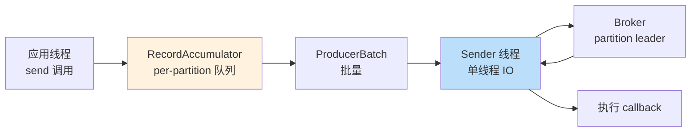
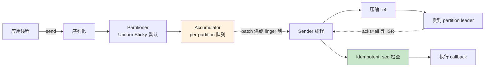

# 精通 Kafka Producer 内部：Batching、acks、Idempotent 与 Sticky Partitioner

> 关联章节：[K01 Topic/Partition/Offset](./01-精通-Topic-Partition-Offset.md)、[K05 ISR/HW/LEO](./05-精通-复制-ISR.md)、[K07 精确一次](./07-精通-精确一次-事务.md)

---

## 引言：Producer 比你想象的复杂

调用 `producer.send(record)` 看起来一行代码。但 Kafka client 内部做了：

1. **序列化** key / value
2. **partitioner** 决定 partition
3. **accumulator** 把记录追加到对应 partition 的 batch（按 batch.size 或 linger.ms 触发 send）
4. **sender 线程**发送 ProduceRequest 给 partition 的 leader broker
5. broker append 到 log，等 ISR ack
6. **回调** callback，要么 success 要么 retry

链路上每一环都有可能失败、重试、阻塞，整套机制是 Kafka 高吞吐 + 强可靠的核心。

读完这章你应能：

- 解释 Producer 各参数（acks / linger / batch / compression / idempotent / max.in.flight）
- 画出 accumulator 与 sender 线程的工作流
- 区分 sticky / uniform sticky / round-robin partitioner
- 配置 idempotent producer 实现单分区 exactly-once
- 诊断 producer 慢 / 失败 / OOM

---

## 第一章：Producer 整体架构

### 1.1 关键组件



- **应用线程**：调 `send()`，把记录序列化 + 路由 + 进 accumulator，**不等 broker**
- **Sender 线程**：单线程，从 accumulator 取就绪 batch，组装 ProduceRequest 发出
- **回调线程**：sender 拿到响应后调用用户提供的 callback

### 1.2 send 的返回类型

`send()` 返回 `Future<RecordMetadata>`：

```java
Future<RecordMetadata> future = producer.send(record);
// 异步：不等
// 同步：future.get() 阻塞到 broker 返回
```

也接受 callback：

```java
producer.send(record, (metadata, exception) -> {
    if (exception != null) { /* 失败 */ }
    else { /* metadata.offset() */ }
});
```

**性能差异巨大**：

- 异步：吞吐高（数十万到百万 QPS）
- 同步：每条等 broker round-trip → 几千 QPS 顶天

### 1.3 一次 send 的端到端时序

```
T+0    应用调 send(record)
       序列化 → partitioner → accumulator 队列
T+0+   返回 Future（应用线程不阻塞）
       Sender 线程检查：是否有 batch 满 / 超 linger.ms
T+linger ms 后 Sender 取一批 ProducerBatch
       打包成 ProduceRequest 发 broker leader
T+5-50ms broker 处理（append log → 等 ISR ack）
       返回 ProduceResponse
T+5-50ms+ Sender 把结果 dispatch 给每个 record 的 callback
```

整链路 5-100ms，主要时间在网络 + broker append + ISR ack。

---

## 第二章：Batching 与 Accumulator

### 2.1 为什么要 batch

Kafka 高吞吐的核心：**减少 RPC 次数**。

- 100 万条单发 → 100 万次 RPC → 网络打爆，broker fsync 打爆
- 100 万条按 1000 条一批 → 1000 次 RPC → 吞吐 100×

代价：**延迟增加**（等批量满）。

### 2.2 三个关键参数

| 参数 | 默认 | 含义 |
|---|---|---|
| `batch.size` | 16384 (16KB) | 单 partition 的 batch 最大字节数 |
| `linger.ms` | 0 | 即使 batch 没满，最多等多少毫秒就发 |
| `buffer.memory` | 33554432 (32MB) | 所有 partition 的 accumulator 总 buffer 上限 |

行为：

- 默认 `linger.ms=0`：每次 batch 满或没有新记录立刻发 → **延迟最低，但吞吐不高**
- `linger.ms=5-20`：等几毫秒攒批 → 显著提升吞吐

### 2.3 调参对比

| 配置 | 吞吐 | P99 延迟 | 适用 |
|---|---|---|---|
| `batch.size=16KB, linger.ms=0` | 中 | 5-10ms | 低延迟事件 |
| `batch.size=64KB, linger.ms=10` | 高 | 15-30ms | 一般业务 |
| `batch.size=256KB, linger.ms=50` | 极高 | 50-100ms | 日志、ETL |

**经验值**：

- 业务消息：`batch.size=32KB, linger.ms=10` 起步
- 日志：`batch.size=256KB, linger.ms=50`，开 compression

### 2.4 Buffer 满了会怎样

`buffer.memory` 默认 32MB。如果应用 send 速度 > sender 发送速度 → buffer 堆积 → 满 → 阻塞：

```java
// max.block.ms 默认 60s
producer.send(record);  // 60s 内 buffer 没空位 → TimeoutException
```

诊断：

```java
producer.metrics().get("buffer-available-bytes")  // 当前可用
producer.metrics().get("buffer-exhausted-records") // 因 buffer 满阻塞的次数
```

修复：

- 调大 `buffer.memory`（如 128MB）
- 加 sender 并发（多个 producer 实例）
- 业务层降流

---

## 第三章：Partitioner

### 3.1 默认 partitioner 演化

| Kafka 版本 | 默认 |
|---|---|
| < 2.4 | DefaultPartitioner（有 key 用 hash，无 key 用 round-robin） |
| 2.4-3.2 | StickyPartitioner（无 key 时粘到一个 partition 直到 batch 满） |
| 3.3+ | **UniformStickyPartitioner**（带负载均衡的 sticky） |

### 3.2 三种策略对比

| 策略 | 行为（无 key 时） |
|---|---|
| RoundRobin | 每条记录轮一个 partition |
| Sticky | 选一个 partition 一直发，到 batch 满 / linger 才换 |
| UniformSticky | 同 sticky，但更倾向均衡（broker queue 长的少发） |

为什么不简单 RoundRobin？因为它会让每个 partition 的 batch 总是只有 1 条记录 → batch 失效。Sticky 让连续记录"粘"在同一 partition，达成有效 batching。

### 3.3 有 Key 时的行为

key 不为 null：

```
partition = murmur2(key) % num_partitions
```

- 相同 key 永远落同一 partition → **保证顺序**
- 用 key 比如 `user_id`、`order_id` 可保证用户内顺序

### 3.4 自定义 Partitioner

实现 `org.apache.kafka.clients.producer.Partitioner`：

```java
public class GeoAwarePartitioner implements Partitioner {
    @Override
    public int partition(String topic, Object key, byte[] keyBytes,
                         Object value, byte[] valueBytes, Cluster cluster) {
        // 根据 value 中的地理标签决定 partition
        return chooseByRegion(value);
    }
}
```

`partitioner.class=com.example.GeoAwarePartitioner` 启用。

### 3.5 Partition 数选错的坑

- partition 数过少 → 并行度低 → 吞吐瓶颈
- partition 数过多 → 元数据膨胀、broker 文件句柄爆

经验：

- 单 broker 200-500 partition
- 单 topic 6-30 partition 起步
- partition 数不可减（只能增加），起步保守

---

## 第四章：acks 与可靠性

### 4.1 三种 acks

| acks | 含义 | 丢失风险 | 吞吐 |
|---|---|---|---|
| `0` | 不等任何确认，fire-and-forget | 高（网络丢就丢） | 最高 |
| `1` | leader 写入即返回 | 中（leader 挂未同步给 follower 就丢） | 高 |
| `all`（也叫 `-1`） | 等所有 ISR 都写入 | 极低（min.insync.replicas 配置控制） | 中 |

### 4.2 acks=all 配 min.insync.replicas

仅 `acks=all` 不够，还要配 broker / topic 配置：

```
min.insync.replicas=2
replication.factor=3
```

- ISR 中至少 2 个副本 ack 才返回
- ISR 缩到 < 2 → 生产者收到 `NotEnoughReplicasException`
- 3 副本中允许挂 1 个仍能写

**为什么不直接 `acks=replication.factor`？** —— 因为运维要保留"容忍单节点故障"的 buffer。

### 4.3 数学保证

| 配置 | 丢失场景 |
|---|---|
| `acks=1` | leader 收到 → ack → leader 立刻挂 → follower 没复制 → 丢 |
| `acks=all, min.insync=1` | 整个 ISR 只剩 leader，leader 挂 → 丢 |
| `acks=all, min.insync=2, RF=3` | 2 个节点同时挂才丢；1 个挂仍 ok |

### 4.4 retries 与 delivery.timeout.ms

retry 行为：

| 参数 | 默认 | 含义 |
|---|---|---|
| `retries` | Integer.MAX_VALUE | 重试次数上限 |
| `retry.backoff.ms` | 100 | 重试间隔 |
| `delivery.timeout.ms` | 120000 (2min) | 单条记录总尝试上限（含等待 + 重试） |
| `request.timeout.ms` | 30000 | 单次 RPC 超时 |

`delivery.timeout.ms` 是最重要的——它是"什么时候放弃这条记录"。超过就调用 callback 报 TimeoutException。

---

## 第五章：Idempotent Producer

### 5.1 解决什么问题

`acks=all` 防丢，但**不防重**：

```
producer → broker（写成功）
         ← response 路上丢了
producer 重试 → broker（再写一次）
```

→ broker 上同一条消息有两份。

idempotent producer 解决：**broker 端去重**。

### 5.2 开启方式

```properties
enable.idempotence=true
```

ES 3.0+ 默认开启（如果 acks 和 retries 满足条件）。

### 5.3 实现原理

启用后 producer 启动时：

1. 向 transaction coordinator broker 申请一个 **PID（Producer ID）**
2. 每个 partition 维护一个 **sequence number**（从 0 开始递增）

每条记录带 (PID, partition, sequence)：

- broker 记住每个 PID-partition 的最新 sequence
- 收到 `seq <= 已知 seq` → 当作重复，丢弃但返回成功
- 收到 `seq > 已知 seq + 1` → OutOfOrderSequenceException，说明乱序了

### 5.4 限制

- 只保证**单 partition 内**去重
- 跨 partition 需要 transactional producer
- PID 只在 producer 进程生命周期内有效；重启 producer 会拿新 PID（旧 PID 的去重信息没了，可能有重试的旧消息漏过）

### 5.5 必须满足的隐含条件

开启 `enable.idempotence=true` 后 Kafka 会强制：

| 参数 | 必须值 |
|---|---|
| `acks` | `all` |
| `retries` | `> 0` |
| `max.in.flight.requests.per.connection` | `<= 5` |

如果显式配错会报错。

---

## 第六章：Transactional Producer

### 6.1 跨 partition / 跨 topic exactly-once

idempotent 解决单 partition 重复。事务解决：

- **多 partition 写原子性**：要么全成功要么全失败
- **跨 topic 写原子性**：通常用于 read-process-write 模式

### 6.2 用法骨架

```java
props.put("transactional.id", "my-tx-producer-1");  // 必须设置且全局唯一
props.put("enable.idempotence", "true");

Producer<String,String> p = new KafkaProducer<>(props);
p.initTransactions();  // 注册到 coordinator

try {
    p.beginTransaction();
    p.send(new ProducerRecord<>(topic1, ...));
    p.send(new ProducerRecord<>(topic2, ...));
    // 也可以提交 consumer offset 进同一事务
    p.sendOffsetsToTransaction(offsets, "consumer-group");
    p.commitTransaction();
} catch (Exception e) {
    p.abortTransaction();
}
```

### 6.3 isolation_level

consumer 侧要配：

```
isolation.level=read_committed
```

只读已 commit 的事务消息（跳过 abort 的）。默认 `read_uncommitted` 看所有。

代价：consumer 必须等 LSO（Last Stable Offset）才能消费，事务长 → consumer 滞后。

更多细节在 [K07 精确一次](./07-精通-精确一次-事务.md) 章节。

---

## 第七章：压缩

### 7.1 支持的压缩算法

| 算法 | 压缩比 | CPU | 适用 |
|---|---|---|---|
| `none` | 1× | 无 | 极低延迟 |
| `gzip` | 高 | 高 | 离线 ETL |
| `snappy` | 中 | 低 | 通用 |
| `lz4` | 中-高 | 低 | **推荐** |
| `zstd` | 高 | 中 | Kafka 2.1+，比 gzip 快比 snappy 压缩好 |

### 7.2 配置

```properties
compression.type=lz4
```

**关键点**：压缩在 **producer 端做**，broker 直接写压缩后的字节，consumer 拉到后解压。整链路 CPU 在两端，broker 不参与。

但 broker 也可以配 `compression.type=producer`（默认）或具体算法。如果 producer 用 lz4 但 broker 配 gzip → broker 解压再压缩，慢且重。**保持一致**。

### 7.3 压缩对 batching 的依赖

- 批越大压缩比越高（同类型数据重复多）
- 单条压缩没意义

因此：开了压缩通常要把 `linger.ms` 调高（如 20）、`batch.size` 调大（如 256KB）。

### 7.4 实测对比

LinkedIn 公开数据，1000 万条 JSON 消息（每条 1KB）：

| 压缩 | 原始大小 | 压缩后 | 吞吐 |
|---|---|---|---|
| none | 10 GB | 10 GB | 800 MB/s |
| snappy | 10 GB | 3.5 GB | 600 MB/s |
| lz4 | 10 GB | 3.2 GB | 700 MB/s |
| zstd | 10 GB | 2.1 GB | 500 MB/s |
| gzip | 10 GB | 1.8 GB | 250 MB/s |

经验：**lz4 是甜区**（接近 snappy 的速度 + 接近 gzip 的压缩比）。

---

## 第八章：max.in.flight.requests.per.connection

### 8.1 含义

到**同一 broker** 的并发未确认请求上限。

```
producer → broker (req 1)  pending
producer → broker (req 2)  pending  ← max.in.flight=2 已满，第 3 个等
producer → broker (req 3)  阻塞
```

### 8.2 为什么不能太大

主要影响**顺序保证**：

- max.in.flight=1：req 1 完成才发 req 2，严格按 send 顺序
- max.in.flight=5：5 个 req 并发，但如果 req 1 失败重试，req 2 已经写入 → 顺序乱

idempotent producer 通过 sequence number 保证顺序，max.in.flight=5 没问题。**非 idempotent** 且重视顺序要 max.in.flight=1。

### 8.3 性能影响

| max.in.flight | 吞吐 | 顺序 |
|---|---|---|
| 1 | 低（窜行） | 严格 |
| 5（默认） | 高 | idempotent 下保证 |
| > 5 | 不允许（idempotent 强制 ≤ 5） | — |

---

## 第九章：监控 Producer

### 9.1 关键 JMX 指标

```
producer.metrics.get("record-send-rate")        # 每秒发送多少条
producer.metrics.get("record-error-rate")       # 错误率
producer.metrics.get("record-retry-rate")       # 重试率
producer.metrics.get("request-latency-avg")     # 平均请求延迟
producer.metrics.get("request-latency-max")     # 最大延迟
producer.metrics.get("batch-size-avg")          # 平均 batch 大小
producer.metrics.get("records-per-request-avg") # 每个请求平均多少条
producer.metrics.get("buffer-available-bytes")  # accumulator 余量
producer.metrics.get("compression-rate-avg")    # 压缩比
```

### 9.2 警戒指标

| 指标 | 阈值 |
|---|---|
| record-error-rate | > 0 告警 |
| record-retry-rate | > 1% 警觉 |
| request-latency-max | > 1s |
| buffer-available-bytes | < 10% buffer.memory（接近满） |

### 9.3 慢的诊断顺序

1. broker 端慢？看 broker 的 `request-handler-avg-idle-percent`（应 > 30%）
2. 网络？`request-latency-avg` 跳起来
3. accumulator 满？`buffer-exhausted-records > 0`
4. 单 partition 热点？`record-send-rate-per-partition` 不均

---

## 第十章：客户端配置最佳实践

### 10.1 高吞吐配置

```properties
acks=1
compression.type=lz4
linger.ms=10
batch.size=65536
buffer.memory=67108864
max.in.flight.requests.per.connection=5
```

适用：日志、监控数据；可丢极少量数据。

### 10.2 高可靠配置

```properties
acks=all
enable.idempotence=true
retries=2147483647
delivery.timeout.ms=120000
compression.type=lz4
linger.ms=5
batch.size=32768
max.in.flight.requests.per.connection=5
```

适用：金融、交易、不容许丢失。

### 10.3 低延迟配置

```properties
acks=1
linger.ms=0
batch.size=16384
compression.type=none
max.in.flight.requests.per.connection=1
```

适用：实时性敏感、单条小消息、不要求顺序。

### 10.4 EOS 配置

```properties
transactional.id=my-tx-id-${INSTANCE_ID}
enable.idempotence=true
acks=all
delivery.timeout.ms=120000
```

应用层需用 `beginTransaction / commitTransaction`。

---

## 第十一章：典型故障案例

### 11.1 案例：突发大量 TimeoutException

**症状**：监控显示 producer error rate 飙到 30%，全是 TimeoutException。

**诊断**：

- broker 端 CPU 正常
- 网络 RTT 正常
- producer 端 `buffer-available-bytes` 几乎 0

**根因**：业务侧短时间产生数据 100× 平时，accumulator buffer 满。

**修复**：

- 调大 `buffer.memory`
- 多 producer 实例分流
- 业务侧加 rate limiter

### 11.2 案例：消息乱序

**症状**：consumer 收到的消息按 key 不一定按 send 顺序。

**诊断**：producer 配 `enable.idempotence=false` 且 `max.in.flight=5`，期间有重试。

**根因**：重试不保序。

**修复**：

- 开 `enable.idempotence=true`（idempotent producer 内部保序）
- 或 `max.in.flight=1`（性能差但严格保序）

### 11.3 案例：partition 写入不均

**症状**：6 个 partition，其中 2 个写入是其他 4 个的 5×。

**诊断**：key 分布不均（按 user_id 但 99% 流量来自 1% 大客户）。

**修复**：

- 改 key 策略（加 random 后缀）
- 自定义 partitioner（热点 user 散到多 partition）
- 长期：业务侧拆分大客户

### 11.4 案例：开启事务后吞吐降 5×

**症状**：开 transactional producer 后 QPS 从 50K 降到 10K。

**根因**：

- 事务有额外协调开销（initTransactions / beginTransaction / commitTransaction）
- consumer 端要 read_committed → 必须等 LSO

**修复**：

- 把多条 send 放到一个 transaction 内（事务粒度大）
- 评估业务是否真需要 EOS（多数业务幂等即可）

### 11.5 案例：Producer OOM

**症状**：JVM heap 持续涨直到 OOM。

**根因**：异步 send 使用了大 callback 闭包（捕获了大对象），并发量大时未释放堆积。

**修复**：

- callback 内不持有大对象引用
- 监控 buffer.memory 占用而不是放任不管
- 同步 send 用得过头会反过来阻塞应用——找平衡

---

## 总结 · Producer 一图流



Producer 心法：

1. **异步是性能的关键**——同步 send 极慢
2. **Batch 是 Kafka 高吞吐的灵魂**——linger.ms + batch.size + compression 三件套
3. **acks=all + min.insync >= 2 + idempotent** 是生产标配
4. **顺序 = 单 partition + idempotent or max.in.flight=1**
5. **监控 buffer.memory**——满了就阻塞业务

---

## 练习题

1. `acks=0`、`acks=1`、`acks=all` 三个语义差别？分别能容忍什么故障？
2. linger.ms=0 vs linger.ms=10 对吞吐和延迟的影响？
3. 解释 UniformStickyPartitioner 与原 StickyPartitioner 的差别。
4. idempotent producer 保证什么？不保证什么？
5. `max.in.flight.requests.per.connection` 对顺序保证的影响？
6. 为什么开 idempotent 后 max.in.flight 上限是 5？
7. 压缩为什么要靠 batch 才有效？
8. 一个 producer 突然报 RecordTooLargeException，怎么排查？
9. transactional.id 为什么必须唯一？多实例怎么配？
10. send 异步 vs 同步如何选择？

> 答案见 [QUIZ.md](./QUIZ.md)

---

> 🔁 反馈：跑 `kafka-producer-perf-test.sh` 改 linger.ms / batch.size 看吞吐曲线
