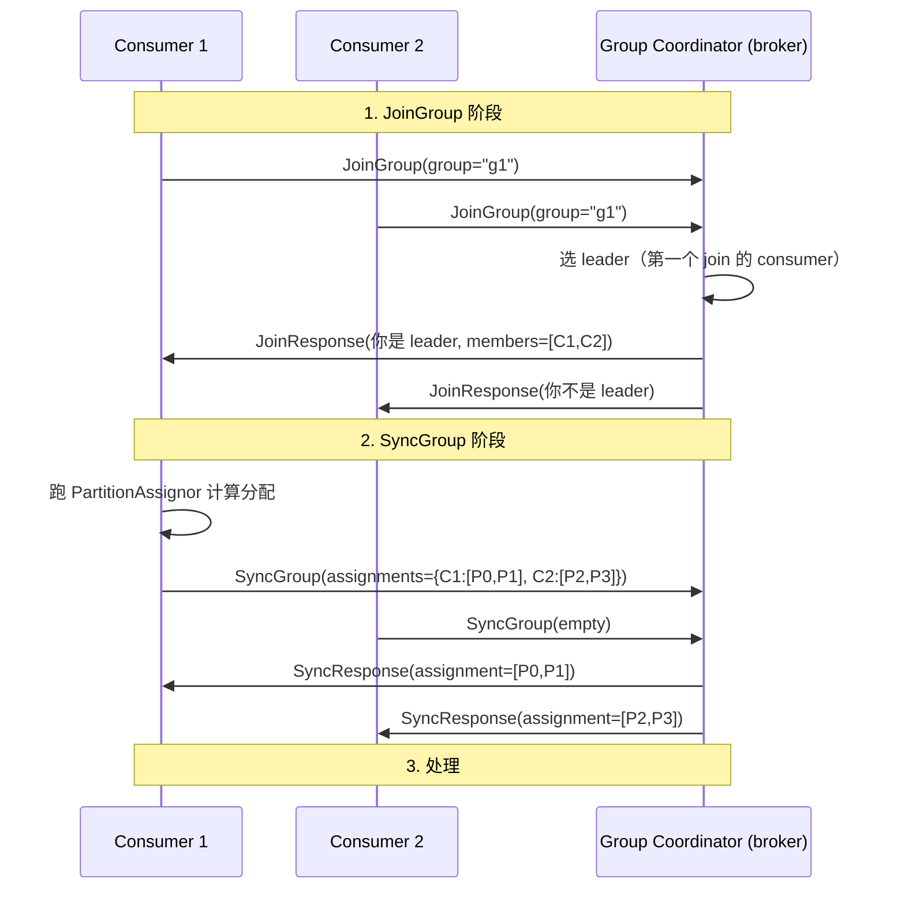
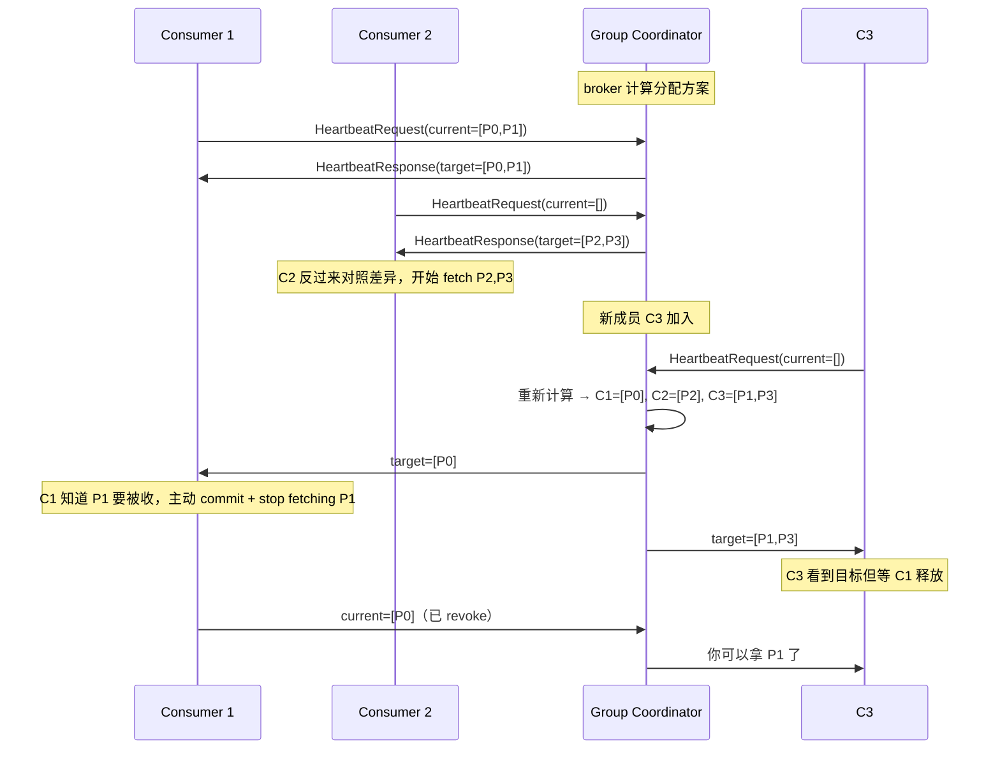
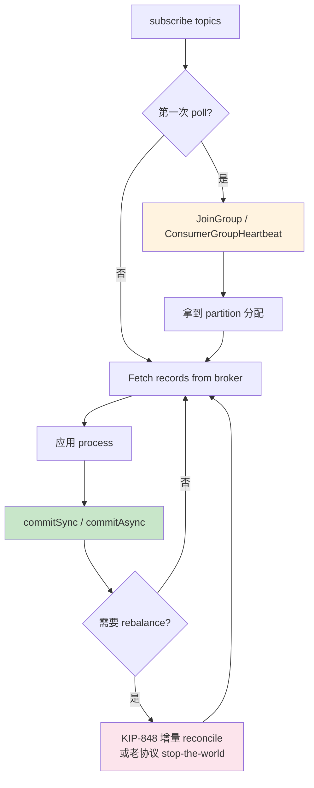

# 精通 Kafka Consumer 与 KIP-848 新协议：Rebalance、Sticky、Broker 主导

> 关联章节：[K01 Topic/Partition/Offset](./01-精通-Topic-Partition-Offset.md)、[K03 Producer](./03-精通-Producer.md)、[K07 精确一次](./07-精通-精确一次-事务.md)

---

## 引言：Consumer 是 Kafka 最复杂的客户端

Producer 复杂在性能（batch、压缩、idempotent），Consumer 复杂在**分布式协调**：

- 多个 Consumer 实例怎么分 partition？
- 实例上线 / 下线 / 故障时怎么重新分？
- 处理慢的实例不要拖垮整组
- 处理完一批怎么提交 offset 保证不丢不重

2008 年 Kafka 0.8 的 Consumer 模型直到 2024 年都在改：

- **0.8-0.9**：High-level Consumer + ZK（已废）
- **0.10**：New Consumer API + Group Coordinator broker
- **2.4**：Incremental Cooperative Rebalance (KIP-429)
- **2.5**：Sticky Assignor
- **3.7+**：**KIP-848 新协议（broker 主导 rebalance）** preview
- **4.0**：KIP-848 GA + 老协议 deprecated

这章把 Consumer 的内部、KIP-848 革命性变化、最佳实践讲透。读完之后你应能：

- 解释 poll loop、heartbeat、rebalance 三者关系
- 区分四种 assignor（Range / RoundRobin / Sticky / CooperativeSticky）
- 理解 KIP-848 为什么消除 stop-the-world rebalance
- 配置 offset commit 策略（自动 vs 手动 vs 事务）
- 诊断 consumer lag、rebalance 风暴、offset out of range

---

## 第一章：Consumer 基础模型

### 1.1 Consumer Group 抽象

```
Topic "orders" 有 6 partitions
   ┌─────────────────────────────────┐
   │ P0  P1  P2  P3  P4  P5          │
   └─────────────────────────────────┘
          │
   Consumer Group "billing"
   ┌────────┬────────┬────────┐
   │   C1   │   C2   │   C3   │
   │ P0,P1  │ P2,P3  │ P4,P5  │
   └────────┴────────┴────────┘

   Consumer Group "analytics"（独立 offset）
   ┌────────────────┐
   │      C1        │
   │ P0,P1,P2,...   │
   └────────────────┘
```

核心规则：

- 一个 partition 在一个 group 内**只被一个 consumer**消费
- 不同 group 互不影响（pub-sub 语义）
- 组内 consumer 数 > partition 数 → 多余 consumer 空闲
- 组内 consumer 数 < partition 数 → 一些 consumer 拿多个 partition

### 1.2 poll 循环

```java
Consumer<String,String> c = new KafkaConsumer<>(props);
c.subscribe(Arrays.asList("orders"));

while (true) {
    ConsumerRecords<String,String> records = c.poll(Duration.ofMillis(1000));
    for (ConsumerRecord<String,String> r : records) {
        process(r);
    }
    c.commitSync();  // 提交 offset
}
```

`poll()` 实际做了：

1. **第一次调用 poll**：触发 JoinGroup → SyncGroup → 拿到分配的 partition
2. **每次 poll**：
   - 后台发心跳（保持组成员）
   - 检查是否需要 rebalance
   - 从分配的 partition fetch 数据
   - 返回记录

**poll 必须周期性调用**——长时间不 poll 会被踢出 group。

### 1.3 关键超时参数

| 参数 | 默认 | 含义 |
|---|---|---|
| `session.timeout.ms` | 45000（KIP-848 前 10000） | 多久没心跳算成员死了 |
| `heartbeat.interval.ms` | 3000 | 心跳间隔（应 ≤ session.timeout / 3） |
| `max.poll.interval.ms` | 300000 (5min) | 两次 poll 最大间隔，超就踢 |
| `max.poll.records` | 500 | 单次 poll 拉多少条 |
| `fetch.min.bytes` | 1 | broker 至少攒多少字节才返回 |
| `fetch.max.wait.ms` | 500 | 同上的等待上限 |

### 1.4 max.poll.interval.ms 的实际含义

这是 Consumer **最常踩的坑**：

- 心跳是后台线程发的（默认 3s），所以**应用线程卡住不影响心跳**
- 但 `max.poll.interval.ms` 限制"两次 poll 之间应用最多卡多久"
- 应用处理一批记录超过 5min → 下次 poll 时被告知 "你已被踢，请 rebalance"

修复路径：

- 缩小 `max.poll.records`（减少单批工作量）
- 增大 `max.poll.interval.ms`（处理本来就慢的场景）
- 业务侧拆分任务、用 worker 池异步处理

---

## 第二章：Rebalance 机制

### 2.1 触发条件

四种情况触发 rebalance：

1. **成员变化**：consumer 加入 / 离开 / 崩溃
2. **订阅变化**：subscribe 的 topic 列表改了
3. **partition 数变化**：topic 增 partition
4. **组配置变化**：assignor 切换

### 2.2 经典协议（pre-KIP-848）



**关键问题**：

- **Stop the World**：JoinGroup 阶段所有成员都"revoke"自己的 partition → 全组停止处理
- 大组（几十上百 consumer）rebalance 可能持续几秒到几分钟
- 一次成员变动就触发整组 stop → 部署 rolling 重启时反复 stall

### 2.3 Partition Assignor

`partition.assignment.strategy=` 决定如何分：

| Assignor | 行为 |
|---|---|
| `RangeAssignor` (默认 < 2.4) | 按 topic 切片：每 topic 单独按字典序分 |
| `RoundRobinAssignor` | 全 topic 全 partition 一起轮 |
| `StickyAssignor` (2.0+) | 尽量保持上次分配不变（最小迁移） |
| `CooperativeStickyAssignor` (2.4+) | sticky + 增量 rebalance |

CooperativeSticky 是 pre-KIP-848 时代的最佳选择——已经能做到"只迁移变化的 partition，其他不动"。

### 2.4 Incremental Cooperative Rebalance

KIP-429。从 2.4 开始的 CooperativeStickyAssignor 行为：

```
原状态：C1=[P0,P1], C2=[P2,P3]
新加 C3 → 需要重新分

老协议（eager）：
   C1 revoke [P0,P1]，C2 revoke [P2,P3]
   重新分：C1=[P0], C2=[P2], C3=[P1,P3]
   全员停止再恢复

新协议（incremental）：
   第一轮 rebalance：C1 revoke [P1]（被分给 C3），C2 revoke [P3]
   C1=[P0], C2=[P2], C3=待分
   第二轮：C3 = [P1,P3]
   C1 / C2 处理不中断
```

代价：rebalance 要多轮，但每轮影响小。

### 2.5 Rebalance 监听器

应用可注册 listener 在 rebalance 时执行收尾：

```java
c.subscribe(topics, new ConsumerRebalanceListener() {
    @Override public void onPartitionsRevoked(Collection<TopicPartition> parts) {
        // 在 partition 被收回前：提交 offset、清理状态
        c.commitSync();
    }
    @Override public void onPartitionsAssigned(Collection<TopicPartition> parts) {
        // 拿到新 partition 后：初始化
    }
    @Override public void onPartitionsLost(Collection<TopicPartition> parts) {
        // 异常丢失（如 session timeout）：清理但不要 commit
    }
});
```

---

## 第三章：KIP-848 —— Consumer Group 协议重写

### 3.1 老协议的问题

经过 incremental cooperative 后老协议已经"不那么差"，但仍有：

1. **依赖 leader consumer 算分配**：leader 挂 → 整组卡住
2. **JoinGroup 阶段**：所有成员同时参与，规模大时复杂度高
3. **元数据放在 consumer group memory**：consumer 携带 topic / partition 元数据，体积膨胀
4. **算法不能热更新**：换 assignor 需要重启所有 consumer

### 3.2 KIP-848 的革命

新协议的核心思想：**broker 主导**。

- broker（group coordinator）维护"目标分配"
- consumer 心跳上报"我现在拥有什么"
- broker 推送"你应该拥有什么"
- consumer 自己 reconcile（增量收回 / 增量获取）



### 3.3 关键好处

| 维度 | 老协议 | KIP-848 |
|---|---|---|
| 算分配 | consumer leader | broker |
| Stop the world | 是 | 几乎不 |
| 大组扩展性 | 数十成员 | 数千成员 |
| 算法切换 | 重启所有 | 改 broker 配置即生效 |
| 心跳协议 | JoinGroup/SyncGroup/Heartbeat 三种 | 统一 ConsumerGroupHeartbeat |
| 版本协商 | 复杂 | 通过 server assignor 抽象 |

### 3.4 启用方式

Kafka 4.0 起：

- broker 支持必须开启：`group.coordinator.rebalance.protocols=classic,consumer`
- consumer 客户端：`group.protocol=consumer`（默认还是 classic 兼容期）

```properties
group.protocol=consumer
group.remote.assignor=uniform  # uniform / range
```

老 consumer 仍能加同一个 group（兼容期），但建议尽快全量迁。

### 3.5 注意事项

- 新协议的 server assignor 当前只有 `uniform`、`range` 两种
- 老的 sticky 行为内置到 uniform（保留最大粘性）
- 自定义 assignor 仍需老协议
- 部分 consumer 客户端语言尚未跟进（Java 4.0 优先，其他语言滞后）

---

## 第四章：Offset 管理

### 4.1 Offset 存哪

Kafka 0.9+ offset 存在内置 topic `__consumer_offsets`：

- 50 partitions（默认）
- key = (group, topic, partition)
- value = offset + metadata
- 用 **log compaction**（保留每个 key 的最新值）

### 4.2 三种 commit 方式

| 方式 | 调用 | 何时用 |
|---|---|---|
| **自动 commit** | `enable.auto.commit=true` + `auto.commit.interval.ms=5000` | 简单场景，能容忍 at-least-once |
| **同步 commit** | `commitSync()` | 不容许丢失或重复 |
| **异步 commit** | `commitAsync(callback)` | 高吞吐 + at-least-once |

### 4.3 自动 commit 的陷阱

```properties
enable.auto.commit=true
auto.commit.interval.ms=5000
```

行为：每次 poll 时检查"距离上次 commit > 5s"则 commit 当前最新 offset。

**陷阱**：

- 不是处理完一批立刻 commit，而是定时
- 应用处理一批 records 还没完，下一次 poll 触发 commit → **可能 commit 了还没处理完的 offset**
- 一旦 crash → 重启后从已 commit 的 offset 开始，**已 commit 但未处理的消息丢失**

→ at-most-once 而非 at-least-once。

### 4.4 手动 commit 的正确姿势

```java
while (true) {
    ConsumerRecords<String,String> records = c.poll(Duration.ofMillis(1000));
    for (ConsumerRecord<String,String> r : records) {
        process(r);  // 处理可能失败
    }
    c.commitSync();  // 处理完整批再 commit
}
```

- 处理 → commit 顺序保证 **at-least-once**
- 如果 process 抛异常 → 不 commit → 下次 poll 拿到同样 records

### 4.5 Per-partition commit

更细粒度：

```java
Map<TopicPartition, OffsetAndMetadata> offsets = new HashMap<>();
offsets.put(new TopicPartition("orders", 0), new OffsetAndMetadata(123));
c.commitSync(offsets);
```

适用：异步处理不同 partition，各自 commit。

### 4.6 Reset 策略

`auto.offset.reset` 控制"没 committed offset 时从哪开始读"：

| 值 | 行为 |
|---|---|
| `earliest` | 从最早的可用 offset |
| `latest`（默认） | 从订阅时的最新 offset（之前的不读） |
| `none` | 抛异常 |

注意：**只对没 committed offset 的新 group 生效**。已 committed 的 group 总是从 committed 处续。

### 4.7 OffsetOutOfRangeException

```
The fetched offset 12345 is out of range
```

原因：

- consumer 上次 commit 的 offset 早已被 retention 删除
- 即 consumer 离线时间 > retention 时间

修复：

```bash
# 重置到 earliest
kafka-consumer-groups.sh --bootstrap-server :9092 --group g \
  --reset-offsets --to-earliest --topic foo --execute
```

或在配置加 `auto.offset.reset=earliest` 让客户端自动 reset。

---

## 第五章：Fetch 机制

### 5.1 Consumer 拉取 broker

Kafka 是 **pull 模型**（不是 push）：

- consumer 主动 poll
- broker 把数据 readNamed buffered，consumer 取走

好处：

- consumer 控制速率（背压自然）
- broker 不用关心 consumer 状态
- 简化失败模型

### 5.2 fetch.min.bytes / fetch.max.wait.ms

```
fetch.min.bytes=1   # 最少多少字节才返回
fetch.max.wait.ms=500  # 等待上限
```

行为：

- broker 收到 fetch 请求 → 如果数据 ≥ min.bytes 立刻返回
- 否则阻塞最多 wait.ms 等数据攒齐
- 时间到或攒够才返回

调大 min.bytes（如 10KB）：

- 减少 RPC 数（broker 一次返多记录）
- 延迟变高（要等攒齐）

### 5.3 fetch.max.bytes / max.partition.fetch.bytes

| 参数 | 默认 | 含义 |
|---|---|---|
| `fetch.max.bytes` | 50MB | 单次 fetch 总上限 |
| `max.partition.fetch.bytes` | 1MB | 单 partition 上限 |
| `max.poll.records` | 500 | poll 返回上限 |

**坑**：如果一条消息 > 单 partition 限制 → 永远拿不到（fetch 0 → poll 阻塞）。

修复：

- 调大 `max.partition.fetch.bytes`
- 业务侧分片大消息
- 实测有 producer 写入了 50MB 消息，导致 consumer 全卡

### 5.4 一次 fetch 的实际过程

```
1. Consumer 选择当前要拉的 partition 集合
2. 按 broker 分组（同 broker 的 partition 一个 fetch 请求）
3. 发送 FetchRequest(topic-partitions, current offsets)
4. broker 用 sendfile 零拷贝把数据从 page cache 推到 socket
5. Consumer 解码 records，传给应用
```

零拷贝是 Kafka 高吞吐的核心 —— broker 几乎不消耗 CPU 在数据传输上。

---

## 第六章：Consumer Lag

### 6.1 Lag 是什么

`lag = log_end_offset - committed_offset`

- log_end_offset：partition 当前最新位置
- committed_offset：consumer group 已提交位置

lag > 0 说明 consumer 落后于 producer。

### 6.2 查看 Lag

```bash
kafka-consumer-groups.sh --bootstrap-server :9092 --describe --group billing

GROUP   TOPIC   PARTITION  CURRENT-OFFSET  LOG-END-OFFSET  LAG  CONSUMER-ID
billing orders  0          12345           12400           55   c1
billing orders  1          22340           22340           0    c2
billing orders  2          15000           18000           3000 c3
```

P2 lag 3000 → c3 跟不上。

### 6.3 Lag 排查

| 原因 | 验证 |
|---|---|
| consumer 处理慢 | 看应用日志 / profiling |
| partition 数据热点 | 某 partition lag 远超其他 |
| consumer rebalance 频繁 | rebalance log / metrics |
| broker 端慢 | broker fetch 延迟 |
| 网络 | RTT 抖动 |

### 6.4 削减 Lag

- 加 consumer 实例（≤ partition 数）
- 提高 `max.poll.records` 一次处理更多
- 业务侧异步处理（poll 后丢线程池）
- 增加 partition 数（要重 producer key 策略）
- 长期：上 Kafka Streams / Flink 把处理推到 broker 附近

### 6.5 Burrow / Cruise Control / Kafka UI

- **Burrow**（LinkedIn）：lag 监控专用工具，理解 consumer 速率趋势
- **Cruise Control**（LinkedIn）：集群自动 balance，包括 lag-aware reassignment
- **Kafka UI / AKHQ / Conduktor**：界面化看 lag

---

## 第七章：异步处理与 Pause/Resume

### 7.1 多线程处理

`KafkaConsumer` **不是线程安全**。一个 consumer 实例只能被一个线程 poll。

但应用可以：

```java
ExecutorService pool = Executors.newFixedThreadPool(10);

while (true) {
    ConsumerRecords<String,String> records = c.poll(...);
    for (ConsumerRecord<String,String> r : records) {
        pool.submit(() -> process(r));
    }
    // 风险：还没处理就 commit
}
```

**陷阱**：异步处理 + 自动 commit → at-most-once。

### 7.2 正确的异步处理

要保证 at-least-once：

```java
while (true) {
    ConsumerRecords<String,String> records = c.poll(...);
    CompletableFuture<?>[] futures = records.stream()
        .map(r -> CompletableFuture.runAsync(() -> process(r), pool))
        .toArray(CompletableFuture[]::new);
    CompletableFuture.allOf(futures).join();  // 等全部处理
    c.commitSync();
}
```

或者 per-partition 处理 + 各自 commit（更复杂但更高吞吐）。

### 7.3 Pause / Resume

```java
c.pause(Arrays.asList(new TopicPartition("orders", 0)));
// 下次 poll 不返回 orders-0 的数据
c.resume(...);
```

应用场景：

- 下游 sink 满了，先停某 partition
- 跨 partition 协调（如等 partition 0 处理完再拉 partition 1）
- pause 期间仍发心跳，组成员不掉

### 7.4 Wakeup

`c.wakeup()` 是唯一能从其他线程安全调用 consumer 的方法：

- 让正在 poll 的 consumer 立刻返回（抛 WakeupException）
- 用于优雅关闭：

```java
// 关闭信号线程
Runtime.getRuntime().addShutdownHook(new Thread(c::wakeup));

// 主循环
try {
    while (true) {
        ConsumerRecords<...> records = c.poll(...);
        // ...
    }
} catch (WakeupException e) {
    // 正常关闭
} finally {
    c.close();
}
```

---

## 第八章：典型故障

### 8.1 案例：rebalance 风暴

**症状**：consumer group 每分钟 rebalance 几次，lag 持续。

**诊断**：

- 看 broker `__consumer_offsets` topic 的 rebalance 事件
- consumer 日志显示频繁 "Member ... has failed"

**根因**：处理某些消息超时，max.poll.interval.ms 触发，被踢出 → rejoin → rebalance → 又遇到大消息超时 → 循环。

**修复**：

- 调大 `max.poll.interval.ms`
- 调小 `max.poll.records`（一次处理少）
- 排查为什么个别消息处理慢（业务逻辑 / 下游服务）

### 8.2 案例：升级后 partition 不均

**症状**：升级 consumer 客户端后，6 个 consumer 中 1 个拿了 80% partition。

**根因**：assignor 默认从 RangeAssignor 改成了 CooperativeStickyAssignor，组内 consumer 配置不一致（一半新一半老）。

**修复**：

- 所有 consumer 用同一 assignor
- 或滚动升级时全部加 `partition.assignment.strategy=CooperativeStickyAssignor,RangeAssignor`（fallback 列表）

### 8.3 案例：offset out of range

**症状**：消费者重启后报 OffsetOutOfRangeException。

**根因**：consumer 离线 30 天，retention=7 天，已提交 offset 早被删。

**修复**：

```bash
kafka-consumer-groups.sh --bootstrap-server :9092 --group g \
  --reset-offsets --to-earliest --topic foo --execute
```

预防：监控 consumer 是否长期离线；retention 足够长。

### 8.4 案例：lag 突然飙起来但 consumer CPU 不高

**症状**：lag 几小时累积到几百万，consumer CPU 30%。

**诊断**：

- 看 fetch metrics：`fetch-throttle-time-avg`
- broker quota 限流了？

**根因**：业务侧配了 `quota.consumer.byte-rate` 限制下游消费速率。

**修复**：

- 调大 quota 或移除
- 给消费者用专用 user/clientId 不受 quota 限制

### 8.5 案例：commit 失败但应用没注意

**症状**：consumer 重启后从老 offset 开始重新处理几小时数据。

**根因**：`commitAsync` 默认没 callback，commit 失败应用不知道；上次 commit 是几小时前的。

**修复**：

- 用 `commitSync()`（慢但可靠）
- 或 `commitAsync(callback)` 处理失败
- 关键场景：每 N 条记录 `commitSync` 一次保底

---

## 第九章：最佳实践速查

### 9.1 健壮 consumer 模板

```java
Properties props = new Properties();
props.put("bootstrap.servers", "...");
props.put("group.id", "billing");
props.put("group.protocol", "consumer");           // KIP-848
props.put("enable.auto.commit", "false");
props.put("max.poll.interval.ms", "300000");
props.put("max.poll.records", "100");
props.put("auto.offset.reset", "earliest");
props.put("isolation.level", "read_committed");    // EOS 场景

KafkaConsumer<String,String> c = new KafkaConsumer<>(props);
c.subscribe(Arrays.asList("orders"), listener);

try {
    while (running) {
        ConsumerRecords<String,String> records = c.poll(Duration.ofMillis(1000));
        for (ConsumerRecord<String,String> r : records) {
            try {
                process(r);
            } catch (RetriableException e) {
                // 不 commit，下次重新拿
                break;
            }
        }
        c.commitSync();
    }
} catch (WakeupException e) {
    // 优雅关闭
} finally {
    try { c.commitSync(); } catch (Exception ignored) {}
    c.close();
}
```

### 9.2 部署 / 滚动重启

- 多副本部署：partition 数 ≥ 实例数
- 滚动重启：一个一个 stop + start，每个停的时间足以完成 rebalance
- 重启时机：业务低峰
- 长期：用 KIP-848 协议，rebalance 不停业务

---

## 总结 · Consumer 一图流



Consumer 心法：

1. **poll 必须周期性**——超过 max.poll.interval 就被踢
2. **commit 顺序很重要**——处理完再 commit
3. **KIP-848 是革命**——尽快迁，rebalance 不再 stop-the-world
4. **isolation.level=read_committed** 配合事务 producer
5. **监控 lag**——不只是绝对值，要看趋势

---

## 练习题

1. `session.timeout.ms` vs `max.poll.interval.ms` 区别？
2. 默认自动 commit 为什么不是真正的 at-least-once？
3. CooperativeStickyAssignor 与传统 StickyAssignor 区别？
4. KIP-848 消除 stop-the-world rebalance 的关键技术？
5. consumer 重启后老 offset 找不到，怎么处理？
6. 一个消息很大（> max.partition.fetch.bytes）的现象与修复？
7. KafkaConsumer 多线程使用的注意事项？
8. 解释 `auto.offset.reset` 何时生效何时不生效。
9. Consumer 处理慢但又不能丢消息，如何架构？
10. read_committed isolation 的代价？

> 答案见 [QUIZ.md](./QUIZ.md)

---

> 📁 本文位于 `/data/workspace/dp4/kafka/04-精通-Consumer-KIP-848.md`
> 🔁 反馈：起 3 个 consumer，杀掉一个看 rebalance 行为（用 4.0 KIP-848 跟 3.x 对比）
