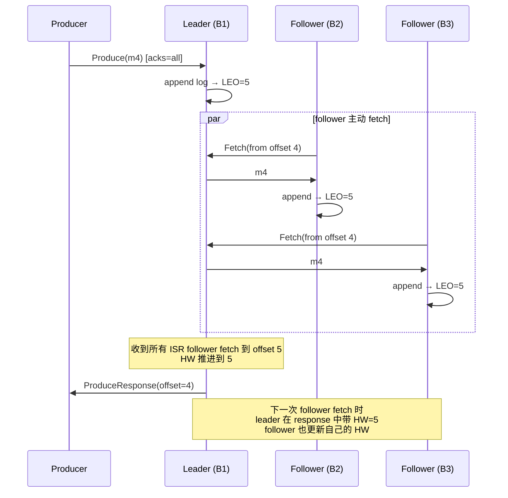
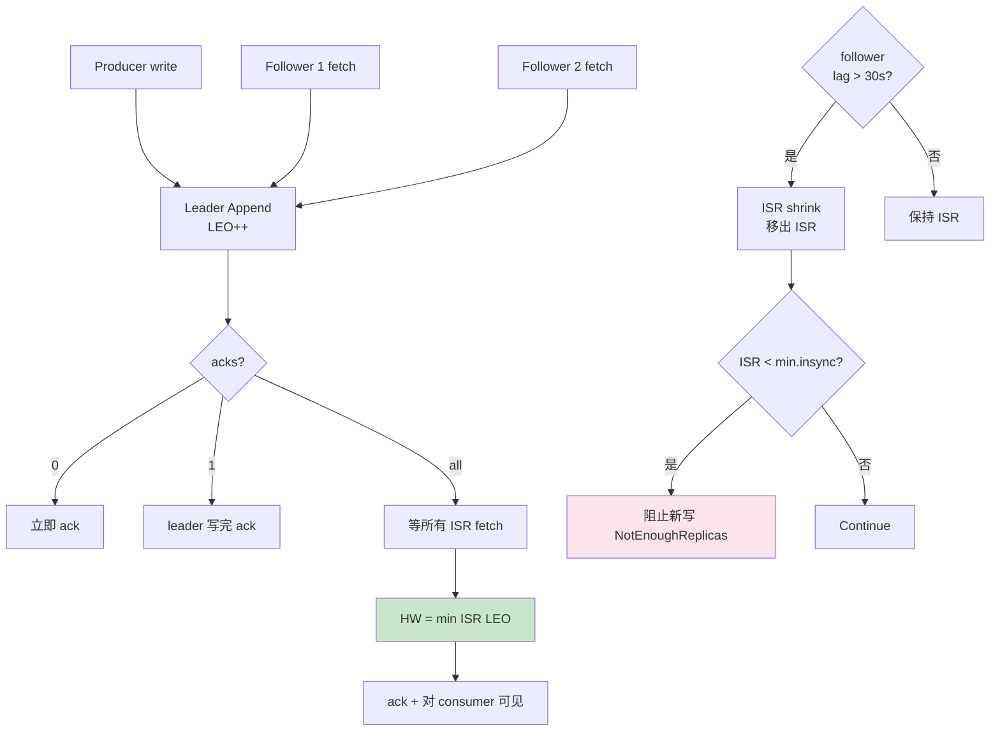

# 精通 Kafka 复制：ISR、HW、LEO 与 Unclean Leader Election

> 关联章节：[K01 Topic/Partition/Offset](./01-精通-Topic-Partition-Offset.md)、[K02 KRaft](./02-精通-KRaft.md)、[K07 精确一次](./07-精通-精确一次-事务.md)

---

## 引言：复制是分布式日志的核心难题

单 broker 不够可靠——磁盘可能坏、机器可能挂。Kafka 通过**多副本**保证持久性：

- 一个 partition 有 N 个副本（`replication.factor=3`）
- 其中一个是 **leader**，处理读写
- 其余是 **follower**，从 leader 拉取数据

听起来简单，但魔鬼藏在细节：

- 副本之间允许多大滞后？
- 哪些副本被认为"够新可以替代 leader"？
- leader 挂了选谁？没追上的副本能选吗？选了会怎样？
- 写入要等几个副本 ack 才算"持久"？

Kafka 用一套精巧的概念回答这些问题：**ISR、HW、LEO、unclean leader election**。

读完这章你应能：

- 画出 LEO、HW 在 leader / follower 上的传播过程
- 解释 ISR 缩张的触发条件
- 区分 commit 与 ack 两种语义
- 决策何时启用 unclean leader election
- 配置 RF / min.insync / replica.lag 三件套

---

## 第一章：基础概念

### 1.1 Replica

一个 partition 在不同 broker 上的拷贝。每个 partition 有 `replication.factor` 个 replica，其中：

- **Leader**：唯一对客户端可见的副本，处理所有 produce / fetch
- **Follower**：被动复制 leader 的日志

```
Topic "orders" partition 0:
   broker 1 [Leader]    log: [m0, m1, m2, m3, m4]
   broker 2 [Follower]  log: [m0, m1, m2, m3]
   broker 3 [Follower]  log: [m0, m1, m2]
```

### 1.2 LEO（Log End Offset）

每个副本的"下一条要写入的 offset" —— 也就是当前日志最后一条 + 1。

```
Leader   LEO = 5  (写到 m4)
Follower B LEO = 4  (复制到 m3)
Follower C LEO = 3  (复制到 m2)
```

LEO 是**单个副本的本地视图**，可能不一致。

### 1.3 HW（High Watermark）

**所有 ISR 副本中最小的 LEO**。也是"已 commit"位置：

```
HW = min(Leader LEO, B LEO, C LEO) = min(5, 4, 3) = 3
```

含义：**到 offset 3（不含）为止的消息已被所有 ISR 副本确认**，对 consumer 可见。

> Consumer 只能读到 HW 之前的消息。这是 Kafka **消息可见性**的关键。

### 1.4 ISR（In-Sync Replicas）

leader 维护的"够新"副本集合。条件：

- follower 主动 fetch leader
- follower 的 LEO 跟 leader 的 LEO 差距在 `replica.lag.time.max.ms`（默认 30s）以内

一个副本如果**超过 30s 没 fetch 或 fetch 跟不上**就被从 ISR 中移除。

```
ISR = {Leader, B}  (C 落后 > 30s 被踢出)
```

ISR 总包含 leader 自己。

### 1.5 OSR（Out-of-Sync Replicas）

不在 ISR 的副本。OSR 不参与 HW 计算、不可被选为 leader（除非 unclean）。

---

## 第二章：写入与复制流程

### 2.1 一条消息的写入



### 2.2 Follower 的 Pull 模型

**Kafka 复制是 pull**：follower 主动 fetch leader，不是 leader push。

好处：

- 跟 consumer 同套机制（broker 不区分对待）
- follower 控制速率（背压）
- 失败模型简单

参数：

| 参数 | 默认 | 含义 |
|---|---|---|
| `replica.fetch.min.bytes` | 1 | follower fetch 最小字节 |
| `replica.fetch.wait.max.ms` | 500 | 等待上限 |
| `replica.fetch.max.bytes` | 1MB | 单 partition 上限 |
| `num.replica.fetchers` | 1 | follower 端拉取线程数（大集群可调大） |

### 2.3 HW 的传播

HW 是**两次 fetch 之间逐步同步**的：

```
T0: Leader LEO=5, follower LEO=4, HW=4
T1: follower fetch → leader 给 m4，response 里带 HW=4
    follower append → LEO=5
T2: follower 下次 fetch → leader 知道 follower LEO=5
    更新 HW = min(5,5,?) = 5（假设另一个 follower 也跟上）
    response 里带 HW=5
    follower 更新自己 HW=5
```

**HW 在 follower 上滞后于 leader 一次 fetch**。这点很重要——下面会看到为什么。

### 2.4 Commit 与 Ack 的区分

| 概念 | 含义 |
|---|---|
| **Commit** | HW 推进到该 offset，对 consumer 可见 |
| **Ack** | producer 收到 ProduceResponse |

- `acks=0`：producer 不等 ack
- `acks=1`：leader 写入即 ack（**不一定 commit**，因为 HW 还没推进）
- `acks=all`：所有 ISR 副本 fetch 到 → HW 推进 → ack

`acks=all` 是唯一保证"ack 后即 commit"的模式。

---

## 第三章：ISR 缩张

### 3.1 缩张触发条件

leader 周期性检查每个 follower：

```
if (current_time - follower_last_caught_up_time > replica.lag.time.max.ms) {
    // 该 follower 落后超过 30s（默认）
    ISR.remove(follower)
}
```

`last_caught_up_time` 在 follower fetch 到 LEO 时更新。

### 3.2 ISR 扩张

OSR 副本追上来后自动加回：

```
if (follower.LEO >= leader.HW && follower.last_fetch_time recent) {
    ISR.add(follower)
}
```

注意是 **>= HW**，不是 LEO（因为 HW 之前的消息才算 committed，追上 HW 就 ok）。

### 3.3 ISR 变更的代价

每次 ISR 变化都要：

1. leader 通知 controller（KRaft 时代是写 metadata log）
2. 元数据传播到所有 broker
3. 监控 / 告警系统通知

→ 频繁 ISR 抖动是问题（拖慢元数据、惊扰运维）。

`replica.lag.time.max.ms` 默认 30s 是平衡点：

- 太小（10s）：网络抖动就触发缩 ISR
- 太大（5min）：副本"假装在 ISR"实际没追上，挂了 leader 切换风险

### 3.4 缩张监控

```
kafka.server:type=ReplicaManager,name=UnderReplicatedPartitions  # 不健康 partition 数
kafka.server:type=ReplicaManager,name=IsrShrinksPerSec
kafka.server:type=ReplicaManager,name=IsrExpandsPerSec
```

健康集群：

- UnderReplicatedPartitions = 0
- IsrShrinks / IsrExpands 极低（个位数 / 天）

---

## 第四章：Leader 选举

### 4.1 何时触发

- 当前 leader 副本下线
- 优先副本选举（preferred replica election）
- 手动触发的 reassignment

### 4.2 选举的候选

**默认（safe mode）**：只从 ISR 中选。

```
ISR = {B1, B2}   (B3 已 OSR)
B1 挂 → 从 ISR \ {B1} = {B2} 选 → B2 成为新 leader
```

### 4.3 Unclean Leader Election

`unclean.leader.election.enable=true` 时：

```
ISR = {B1}     (B2、B3 都 OSR)
B1 挂 → ISR 空 → 从所有 replica 选最先恢复的 → 可能是 B2
但 B2 LEO 落后 B1，**最后 K 条消息丢失**
```

权衡：

| 设置 | 优点 | 缺点 |
|---|---|---|
| `false`（默认 1.0+） | 不丢数据 | leader 全挂时 partition 不可用 |
| `true` | 总能选主 | 可能丢数据 |

**默认 false 是 Kafka 1.0 后的更安全行为**。

### 4.4 Preferred Replica Election

每个 partition 有 **preferred leader**（assignment 列表第一个）。

```
Topic create 时分配：partition 0 replicas = [B1, B2, B3]
preferred leader = B1
```

如果 B1 挂过后又恢复，partition 不会自动切回 B1（因为 leader 是 B2）。运维定期跑：

```bash
kafka-leader-election.sh --bootstrap-server :9092 \
  --election-type preferred --all-topic-partitions
```

让 leader 回到 preferred 副本上 → 重新均衡负载。

也可开自动：

```
auto.leader.rebalance.enable=true
leader.imbalance.check.interval.seconds=300
leader.imbalance.per.broker.percentage=10
```

集群 leader 不均衡 > 10% 自动 rebalance。

---

## 第五章：复制延迟与吞吐

### 5.1 fetcher 线程数

`num.replica.fetchers`（broker 配置）：每个 broker 用多少线程拉远端 leader 数据。

- 默认 1
- 大集群 / 高吞吐建议 4-8
- 调大让一个 broker 能同时从多个 leader 拉

### 5.2 Throttle

reassignment 时可能产生海量数据迁移，broker 配置：

```
follower.replication.throttled.rate=10485760   # 10MB/s
leader.replication.throttled.rate=10485760
```

防止迁移把生产流量打死。

### 5.3 复制带宽估算

3 副本 + acks=all + 网络对称：

- producer 写 1 MB/s 给 leader → leader 同步发 1 MB/s × 2 follower = 2 MB/s 出
- 整 broker 进出：1 MB/s 入（producer 数据） + 2 MB/s 出（复制） = 3 MB/s

10 个 broker 平摊后还好；单 broker 写入 hot spot 时容易打满网卡。

---

## 第六章：典型故障

### 6.1 案例：UnderReplicatedPartitions 飙升

**症状**：监控显示 200 个 partition under-replicated。

**诊断**：

```bash
kafka-topics.sh --bootstrap-server :9092 --describe --under-replicated-partitions
```

**根因**：一个 broker 启动慢，几百 partition 等它追上。

**修复**：

- 耐心等（自动追上）
- 或加 `num.replica.fetchers` 加快
- 监控 follower lag：`kafka.server:type=FetcherLagMetrics`

### 6.2 案例：min.insync.replicas 触发 NotEnoughReplicas

**症状**：producer 端报 `NotEnoughReplicasException`。

**根因**：`min.insync.replicas=2, RF=3`，但有 2 个副本 OSR → ISR 只剩 1。

**修复**：

- 临时降到 `min.insync.replicas=1` 让业务能写（数据安全度降一档）
- 找 OSR 原因（网络 / 磁盘）
- 副本追上后改回

### 6.3 案例：unclean leader election 后丢数据

**症状**：开了 unclean leader election，集群有副本崩过，业务方报"少了一批订单"。

**根因**：ISR 缩到 1 时，leader 挂，从 OSR 选主，最后写入的 N 条没复制 → 丢失。

**修复 / 预防**：

- 关 unclean.leader.election.enable
- 提高 RF 到 5（容忍 2 副本同时挂）
- min.insync.replicas=2 防 ISR 缩到 1 时仍接收写入

### 6.4 案例：preferred leader 不均衡

**症状**：3 broker 集群，B1 上 leader 80%，B2/B3 各 10%。CPU / 网卡 B1 打满。

**诊断**：

```bash
kafka-topics.sh --bootstrap-server :9092 --describe | grep "Leader: 1"
# 数 leader=1 的 partition 数
```

**根因**：之前 B2/B3 都挂过，恢复后 leader 没回归。

**修复**：

```bash
kafka-leader-election.sh --bootstrap-server :9092 \
  --election-type preferred --all-topic-partitions
```

长期：开 `auto.leader.rebalance.enable=true`。

### 6.5 案例：复制带宽打满网卡

**症状**：reassignment 期间业务侧 producer 频繁超时。

**根因**：partition migration 数据迁移占满 broker 网卡。

**修复**：

```bash
kafka-reassign-partitions.sh --bootstrap-server :9092 \
  --execute --reassignment-json-file plan.json \
  --throttle 52428800   # 50 MB/s
```

throttle 给迁移限速，给业务留带宽。

---

## 第七章：配置最佳实践

### 7.1 生产标配

```properties
# Topic 级
replication.factor=3
min.insync.replicas=2
unclean.leader.election.enable=false

# Broker 级
default.replication.factor=3
replica.lag.time.max.ms=30000
num.replica.fetchers=4
auto.leader.rebalance.enable=true
```

### 7.2 Producer 配合

```properties
acks=all
enable.idempotence=true
```

→ 数学上：

- 3 副本写入
- 2 必须 ack（min.insync）
- 容忍 1 副本同时挂（仍能写）
- 任意 1 副本挂不丢数据

### 7.3 跨机房副本

```properties
broker.rack=us-east-1a    # 每个 broker 标 rack
replica.selector.class=org.apache.kafka.common.replica.RackAwareReplicaSelector  # consumer 优先读同 rack
```

效果：

- partition 副本自动分散到不同 rack
- consumer fetch 优先选同 rack 的副本（省跨 rack 带宽）

---

## 第八章：复制与 KRaft 的关系

### 8.1 ISR 状态存哪

ZK 时代：ISR 在 ZK 的 `/brokers/topics/foo/partitions/0/state`。

KRaft 时代：ISR 状态在 **metadata log** 中（PartitionChangeRecord）。每次 ISR 变化 broker 通过 AlterPartitionRequest 通知 controller，controller append metadata log。

### 8.2 性能影响

- ZK：每次 ISR 变化 → 写 ZK znode → watcher 通知。大集群慢。
- KRaft：ISR 变化 → 写 metadata log → broker fetch。延迟低。

KRaft 在 ISR 抖动密集场景下表现远好于 ZK。

---

## 总结 · 复制一图流



复制心法：

1. **HW = min ISR LEO**，consumer 只见 HW 之前
2. **acks=all + min.insync=2 + RF=3** 是黄金组合
3. **Unclean leader election 默认关**——数据安全 > 可用性
4. **ISR 频繁抖动是病**，要查网络 / IO
5. **跨 rack 配置**让灾难恢复有保障

---

## 练习题

1. 解释 LEO 和 HW 的区别。
2. 为什么 HW 在 follower 上滞后于 leader 一次 fetch？
3. ISR 缩张的触发条件？replica.lag.time.max.ms 调小有什么风险？
4. acks=1 与 acks=all + min.insync=1 的差异？
5. unclean leader election 在什么场景应该开？
6. 一个 partition 的 `Isr: 1` 但 `Replicas: 1,2,3` 说明什么？
7. preferred leader election 解决什么问题？
8. 跨机房部署 Kafka，broker.rack 配置的两个好处？
9. 一次 reassignment 期间业务 producer 超时，应该怎么处理？
10. 为什么 min.insync.replicas=replication.factor 不是好选择？

> 答案见 [QUIZ.md](./QUIZ.md)

---

> 🔁 反馈：起 3 broker 集群，杀掉一个 follower，观察 ISR 变化（kafka-topics --describe）
