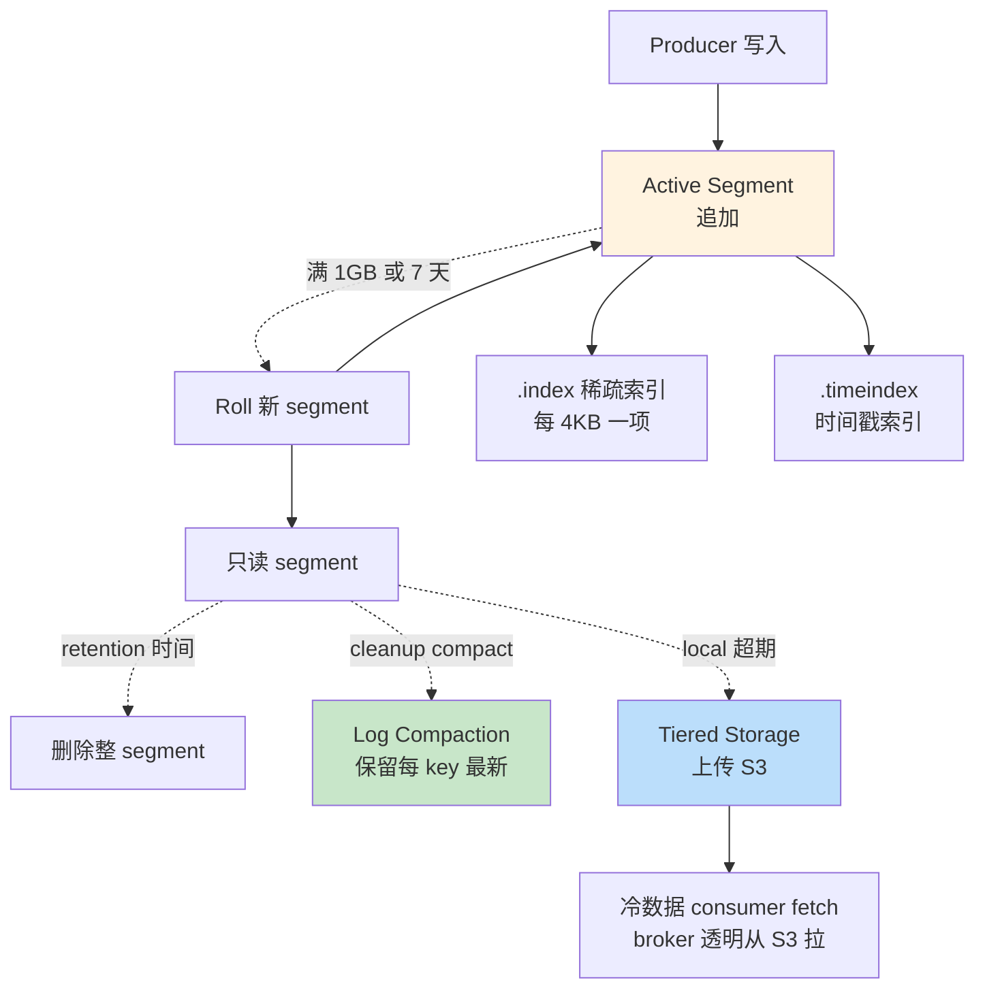

# 精通 Kafka 存储：Segment、Index、Retention、Log Compaction 与 Tiered Storage

> 关联章节：[K01 Topic/Partition/Offset](./01-精通-Topic-Partition-Offset.md)、[K05 ISR](./05-精通-复制-ISR.md)、[K08 性能调优](./08-精通-性能调优.md)

---

## 引言：Kafka 的高吞吐根源是存储设计

Kafka 单 broker 能稳定支撑数百 MB/s 写入，根本原因是**存储设计**：

- 顺序写（不是随机写）
- 零拷贝（sendfile，避免 user/kernel 复制）
- Page cache 充分利用
- Segment 文件追加（不修改老数据）

这章把 Kafka 的物理存储从文件结构、索引、retention、compaction 到 tiered storage 全讲透。读完之后你应能：

- 读懂 segment 文件名和内部 record 格式
- 解释 index 与 timeindex 的稀疏索引原理
- 配置 retention 与 log compaction 应对不同场景
- 启用 tiered storage 把冷数据移到对象存储
- 诊断存储相关故障（磁盘满、segment 太多）

---

## 第一章：物理布局

### 1.1 目录结构

```
/var/lib/kafka-logs/
├── meta.properties              # broker id 等元数据
├── recovery-point-offset-checkpoint
├── replication-offset-checkpoint
├── __cluster_metadata-0/        # KRaft metadata log
├── __consumer_offsets-0/        # consumer offset topic
├── __consumer_offsets-1/
├── ...
├── orders-0/                    # topic "orders" partition 0
│   ├── 00000000000000000000.log
│   ├── 00000000000000000000.index
│   ├── 00000000000000000000.timeindex
│   ├── 00000000000000150000.log
│   ├── 00000000000000150000.index
│   ├── 00000000000000150000.timeindex
│   └── leader-epoch-checkpoint
└── orders-1/
    └── ...
```

每个 partition 是一个目录，里面是多个 segment 文件 + 元数据。

### 1.2 Segment 三件套

一个 segment 由三个文件组成：

| 文件 | 内容 |
|---|---|
| `.log` | 实际消息记录（record batch） |
| `.index` | offset → 物理位置 的稀疏索引 |
| `.timeindex` | timestamp → offset 的稀疏索引 |

文件名是该 segment 的**起始 offset**（20 位补零）。

例：`00000000000000150000.log` 表示从 offset 150000 开始的 segment。

### 1.3 Active Segment

每个 partition 同时只有**一个 active segment**（最新的、正在写的）。其他都是只读封闭的。

```
orders-0/
├── 00000000000000000000.log     # 已封闭
├── 00000000000000050000.log     # 已封闭
└── 00000000000000150000.log     # active，正在写
```

写入永远追加到 active segment 末尾。

### 1.4 Segment Roll

满足任一条件就开新 segment：

| 条件 | 配置 |
|---|---|
| 文件大小 | `log.segment.bytes` 默认 1 GB |
| 时间 | `log.roll.hours` 默认 168（7 天）|
| 单条消息时间戳超过当前 segment 的 maxTimestamp + roll.ms | 同上 |

roll 时把当前 active segment 封闭（变只读），开新 active。

---

## 第二章：Record Batch 格式

### 2.1 一条记录的物理结构

Kafka 0.11+ 用 **record batch v2** 格式：

```
RecordBatch
├── baseOffset             8 bytes  批次第一条 offset
├── batchLength            4 bytes  批次长度
├── partitionLeaderEpoch   4 bytes  写入时 leader epoch
├── magic                  1 byte   版本号 (2)
├── crc                    4 bytes  CRC32C
├── attributes             2 bytes  压缩类型 / 时间戳类型 / 事务 / control
├── lastOffsetDelta        4 bytes
├── baseTimestamp          8 bytes
├── maxTimestamp           8 bytes
├── producerId             8 bytes  for idempotent / transaction
├── producerEpoch          2 bytes
├── baseSequence           4 bytes
├── recordCount            4 bytes
└── records[]
    ├── length             varint
    ├── attributes         1 byte
    ├── timestampDelta     varlong
    ├── offsetDelta        varint
    ├── keyLength + key
    ├── valueLength + value
    └── headers[]          自定义 headers
```

关键点：

- **批级压缩**：整个 batch 压缩一次（不是单条），所以 batch 越大压缩越好
- **timestamp / offset 用 delta 编码**：节省空间
- **producerId / baseSequence**：支持 idempotent / transactional producer
- **headers**：业务可加任意 K-V 元数据

### 2.2 dump 命令

```bash
kafka-dump-log.sh --files /var/lib/kafka-logs/orders-0/00000000000000150000.log --print-data-log

baseOffset: 150000 lastOffset: 150099 count: 100 baseSequence: 0 lastSequence: 99 producerId: 5000 producerEpoch: 3 partitionLeaderEpoch: 7 isTransactional: false isControl: false position: 0 CreateTime: 1715600000000 size: 8456 magic: 2 compresscodec: lz4 crc: 1234567890 isvalid: true
| offset: 150000 CreateTime: 1715600000000 keysize: 5 valuesize: 200 sequence: 0 headerKeys: [trace-id]
| offset: 150001 CreateTime: 1715600000010 keysize: 5 valuesize: 195 sequence: 1 ...
```

调试关键命令——可以看到每个 batch 的元数据。

---

## 第三章：索引

### 3.1 为什么要索引

不能线性扫文件找 offset：

- 单 segment 1GB，找一条消息要扫到底
- consumer 频繁随机 fetch 不同位置

索引把"offset → 文件偏移"快速映射。

### 3.2 .index 文件结构

**稀疏索引**：不是每条消息都记，而是每隔一定字节记一项。

```
offset_relative (4 bytes) | physical_position (4 bytes)
0                         | 0
1024                      | 4096
2048                      | 8192
...
```

- offset_relative 是相对该 segment 起始 offset 的偏移（4 字节够）
- 每项 8 字节

间隔由 `log.index.interval.bytes` 控制（默认 4KB 写一次索引项）。

### 3.3 查找过程

要找 offset 152345（segment 150000.log）：

1. 计算 relative offset = 152345 - 150000 = 2345
2. 在 .index 文件二分查找 → 找到最大的 ≤ 2345 的项，假设 (2048, 8192)
3. 跳到 .log 文件的 8192 字节位置
4. 顺序扫 batch header，找到包含 offset 2345 的 batch
5. 返回该 batch（或仅该消息）

复杂度：O(log N) 索引 + 最多扫 1 个 index interval 的 log。

### 3.4 .timeindex 文件

```
timestamp (8 bytes) | offset_relative (4 bytes)
```

按时间戳查 offset 用，例如：

```bash
# 找 2026-05-13 00:00:00 之后的第一条消息
kafka-run-class.sh kafka.tools.GetOffsetShell --bootstrap-server :9092 --topic orders --time 1715587200000
```

consumer 也能用 `offsetsForTimes()` 时间穿越。

### 3.5 索引重建

broker 启动时检查每个 segment 的 .index / .timeindex：

- 缺失 → 重建（扫 .log 文件生成）
- 损坏 → 重建

重建时间 ∝ log 大小。极大集群启动慢一部分原因在此（KRaft 元数据快但数据 segment 重建仍然要时间）。

---

## 第四章：Retention（保留）

### 4.1 两种 retention 策略

```properties
log.cleanup.policy=delete       # 默认：按时间/大小删
log.cleanup.policy=compact      # 按 key 保留最新值
log.cleanup.policy=delete,compact  # 两者都用（少见）
```

### 4.2 Delete 策略

按时间或大小淘汰整个 segment：

| 参数 | 默认 | 含义 |
|---|---|---|
| `log.retention.hours` | 168 (7 天) | 保留时间 |
| `log.retention.bytes` | -1（无限） | 保留字节数 |
| `log.retention.check.interval.ms` | 300000 (5 min) | 检查频率 |

任一条件满足就删：

```
segment max timestamp > now - retention.hours → 删整个 segment
sum(segment sizes) > retention.bytes → 删最老的 segment
```

**注意是按 segment 删，不是按消息**——所以单 segment 大就有"超期了但还没删"的滞后。

### 4.3 Compact 策略

针对**用 key 表达"实体当前状态"**的场景。

```
key=user_42, value={name: "Alice", age: 28}
key=user_42, value={name: "Alice", age: 29}  ← 后写的覆盖前面的
key=user_43, value={name: "Bob",   age: 30}

compact 之后：
key=user_42, value={age: 29}
key=user_43, value={age: 30}
```

每个 key 只保留最新值。

适用：

- 用户状态 / 配置
- 数据库变更日志（CDC）
- 计算中间结果

### 4.4 Compact 的工作过程

```
LogCleaner 线程定期扫描 partition：
1. 找出"脏"日志（cleanable）—— active segment 之前的部分
2. 构 OffsetMap：key → 最新 offset
3. 遍历旧 segment，把 offset >= map 中对应 key 的 offset 的 record 保留
   其余丢弃
4. 写到新 segment 替换
```

参数：

| 参数 | 默认 | 含义 |
|---|---|---|
| `log.cleaner.threads` | 1 | clean 线程数 |
| `log.cleaner.dedupe.buffer.size` | 128MB | OffsetMap 内存上限 |
| `log.cleaner.io.max.bytes.per.second` | Long.MAX | 限速 |
| `min.cleanable.dirty.ratio` | 0.5 | 脏数据比例阈值 |
| `delete.retention.ms` | 86400000 (1 天) | tombstone（null value）保留时间 |

### 4.5 Tombstone（墓碑）

`value=null` 表示删除：

```
key=user_42, value=null    ← tombstone
```

compact 后会保留 tombstone 一段时间（`delete.retention.ms`）让 consumer 看到"这个 key 被删了"，然后才物理删除。

```java
// 删除一个 key
producer.send(new ProducerRecord<>("users", "user_42", null));
```

### 4.6 Compact + Delete 混合

```
log.cleanup.policy=delete,compact
log.retention.ms=2592000000   # 30 天
```

行为：

- 30 天前的数据按 delete 策略删
- 30 天内的数据按 compact 保留每 key 最新

适用：既要去重又有时间窗口。

---

## 第五章：Log Compaction 的实战

### 5.1 适合 compact 的数据

- ✅ 实体状态（用户、配置、价格）
- ✅ CDC 流（行级 last-write-wins）
- ✅ Kafka Streams 的 KTable changelog
- ✅ `__consumer_offsets`（offset 是状态）

### 5.2 不适合 compact 的数据

- ❌ 事件流（click、view、订单）—— 每条都是独立事件，没"key 的状态"
- ❌ 日志数据
- ❌ 时间序列指标

### 5.3 Key 设计很重要

错误：把 user_id 当 key，但同 user 在不同业务发不同事件 → compact 后只剩最后一条事件，前面都没了。

正确：要么用 (user_id, event_type) 复合 key，要么这个 topic 就不该 compact。

### 5.4 监控 compact

```
kafka.log:type=LogCleanerManager,name=time-since-last-run-ms
kafka.log:type=LogCleaner,name=cleaner-recopy-percent
kafka.log:type=LogCleaner,name=max-buffer-utilization-percent
```

- time-since-last-run > 1h 警觉（compact 没跑）
- cleaner-recopy-percent 看 compact 效率（高说明 compact 多重复 key）

---

## 第六章：Tiered Storage（分层存储）

### 6.1 痛点：本地磁盘存储成本

Kafka 经典存储模型：**所有数据都在 broker 本地磁盘**。

- 想保留 90 天 → 每 broker 几十 TB 本地盘
- SSD / NVMe 贵
- 加 broker 不能横向扩容存储（数据要迁移）

### 6.2 KIP-405 Tiered Storage

3.6 GA。把**冷数据移到对象存储**（S3 / Azure Blob / GCS）：

```
┌──────────────────────────┐
│  broker local disk        │
│  ├── active segment       │
│  └── recent N segments    │ ← hot tier
├──────────────────────────┤
│  remote storage (S3)      │
│  └── older segments        │ ← cold tier
└──────────────────────────┘
```

- 新写入和近期数据在本地 SSD（性能好）
- 超过阈值的 segment 上传 S3
- consumer 拉旧数据时 broker 透明从 S3 拉

### 6.3 配置

```properties
# broker 级
remote.log.storage.system.enable=true
remote.log.metadata.manager.class.name=org.apache.kafka.server.log.remote.metadata.storage.TopicBasedRemoteLogMetadataManager
remote.log.storage.manager.class.name=...   # 各厂商插件
rsm.config.storage.endpoint=https://s3.amazonaws.com
rsm.config.bucket=my-kafka-bucket
```

```bash
# topic 级
kafka-configs.sh --bootstrap-server :9092 --alter \
  --entity-type topics --entity-name orders \
  --add-config remote.storage.enable=true,local.retention.ms=86400000,retention.ms=2592000000
```

含义：

- 本地保留 1 天
- 远程（S3）保留 30 天
- 1-30 天的数据透明从 S3 拉

### 6.4 性能模型

- **写入**：与本地存储等价（写入只到本地，后台异步上传）
- **读取近期**：与本地等价（命中 local segment）
- **读取冷数据**：S3 GET → broker → consumer，慢但能跑

实测：S3 拉冷数据 P99 几百 ms，对历史数据回放够用。

### 6.5 成本对比

100 TB 数据 90 天保留：

| 方案 | 月成本（粗估） |
|---|---|
| 全本地 NVMe SSD | $5000+ |
| 全本地 HDD | $1500 |
| Tiered: 7 天本地 + 83 天 S3 | $300-500 |

Tiered storage 是大集群的**节省成本利器**。

### 6.6 局限

- 只支持非 compact topic（compact + tiered 复杂还在 KIP 路上）
- 跨 region 配置复杂
- 部分客户端需要更新支持

---

## 第七章：典型故障

### 7.1 案例：磁盘满

**症状**：broker 写入失败 `Disk usage 95%`。

**诊断**：

```bash
df -h /var/lib/kafka-logs
du -sh /var/lib/kafka-logs/* | sort -h | tail -20
# 看哪个 topic / partition 占最多
```

**根因**：某 topic retention 配错（保留 365 天但实际只需 7 天）。

**修复**：

```bash
kafka-configs.sh --bootstrap-server :9092 --alter \
  --entity-type topics --entity-name myidx \
  --add-config retention.ms=604800000  # 7 天

# 立刻触发清理
kafka-configs.sh --bootstrap-server :9092 --alter \
  --entity-type topics --entity-name myidx \
  --add-config retention.ms=1000  # 临时 1s 强制清

# 等几分钟清理完再改回
```

### 7.2 案例：segment 太多 too many open files

**症状**：broker log `Too many open files`，业务写入超时。

**诊断**：

```bash
ls /var/lib/kafka-logs/orders-0/ | wc -l
# 几千个 segment 文件
```

**根因**：`log.segment.bytes=1MB`（误配），每 1MB 一个 segment → 几千个文件。

**修复**：

- 改回 `log.segment.bytes=1GB`（默认）
- 调高系统 ulimit：`ulimit -n 1000000`
- 等老 segment 被 retention 清掉

### 7.3 案例：compact 不生效

**症状**：topic 配置 `cleanup.policy=compact`，但磁盘占用一直涨。

**诊断**：

```bash
# 看 LogCleaner 是否运行
grep "Cleaner" server.log

# 看 compaction 指标
kafka.log:type=LogCleanerManager,name=time-since-last-run-ms
```

**根因 1**：`min.cleanable.dirty.ratio=0.5`，但 active segment 占大头，老 segment 没满足 50% 脏。

**根因 2**：LogCleaner 线程挂了（OOM / 异常）。

**修复**：

- 调小 `min.cleanable.dirty.ratio`（如 0.1）让 compact 更积极
- 强制 roll：`min.compaction.lag.ms` 调小
- 重启 broker（如果 cleaner 卡死）

### 7.4 案例：consumer 拉旧数据极慢

**症状**：consumer 回放历史数据，吞吐 1MB/s（正常应该 50MB/s+）。

**根因**：

- 旧数据在 tiered storage S3 上，每次 fetch 都要从 S3 拉
- 没启用本地缓存（broker 没把 S3 数据缓存到本地）

**修复**：

- 调大 `remote.fetch.max.wait.ms` 允许 broker 异步预取
- 增加 S3 bandwidth 配额
- 长期：把热回放数据先复制到一个独立 topic 不用 tiered

### 7.5 案例：所有 partition 同一时间 roll

**症状**：每天 0 点磁盘 IO 飙高，所有 partition 同时 segment roll。

**根因**：`log.roll.hours=24`，集群启动时间相同 → 所有 partition 24h 后同时 roll。

**修复**：

- `log.roll.jitter.ms=3600000`（1h 随机抖动）让 roll 散开
- 或调成按字节 roll，按时间不那么严格

---

## 第八章：调优清单

### 8.1 通用业务

```properties
log.segment.bytes=1073741824        # 1 GB
log.roll.hours=168                  # 7 天兜底
log.retention.hours=168             # 保留 7 天
log.cleanup.policy=delete
num.io.threads=8
log.flush.interval.messages=Long.MAX_VALUE   # 不主动 fsync
log.flush.interval.ms=Long.MAX_VALUE          # 让 OS page cache 决定
```

### 8.2 日志类（写多读少）

```properties
log.segment.bytes=536870912         # 512 MB（更频繁 roll，retention 更准）
log.retention.hours=24
compression.type=producer            # 让 producer 决定
```

### 8.3 状态类（compact）

```properties
log.cleanup.policy=compact
log.segment.ms=86400000              # 1 天 roll
min.cleanable.dirty.ratio=0.1
delete.retention.ms=86400000         # tombstone 保留 1 天
```

### 8.4 大集群（Tiered）

```properties
remote.log.storage.system.enable=true
local.retention.ms=86400000          # 本地 1 天
retention.ms=7776000000              # 远程总 90 天
```

---

## 总结 · 存储一图流



存储心法：

1. **顺序写 + page cache + sendfile = 高吞吐**
2. **稀疏索引**省内存（每 4KB 一项）
3. **Retention 按 segment**，不是按消息
4. **Compact 适合状态类数据**，不适合事件流
5. **Tiered storage** 解放本地磁盘成本

---

## 练习题

1. 一个 segment 由哪几个文件组成？
2. .index 是稀疏的而不是全量的，原因？
3. log.segment.bytes 设置 1MB 会有什么问题？
4. retention.ms 配 1 天，但磁盘上仍有 3 天前的数据，可能原因？
5. log compaction 适合什么数据？不适合什么？
6. tombstone 是什么？为什么不立刻物理删除？
7. tiered storage 的本地 retention 与远程 retention 关系？
8. 跨多个 partition 同时 segment roll 的危害？
9. consumer 用 offsetsForTimes 拿时间对应的 offset 走的是什么索引？
10. compact 策略下 active segment 内的旧 key 会被 compact 吗？

> 答案见 [QUIZ.md](./QUIZ.md)

---

> 📁 本文位于 `/data/workspace/dp4/kafka/06-精通-存储与-Segment.md`
> 🔁 反馈：用 `kafka-dump-log.sh` 看真实 segment 文件内容比看文档直观 10×
