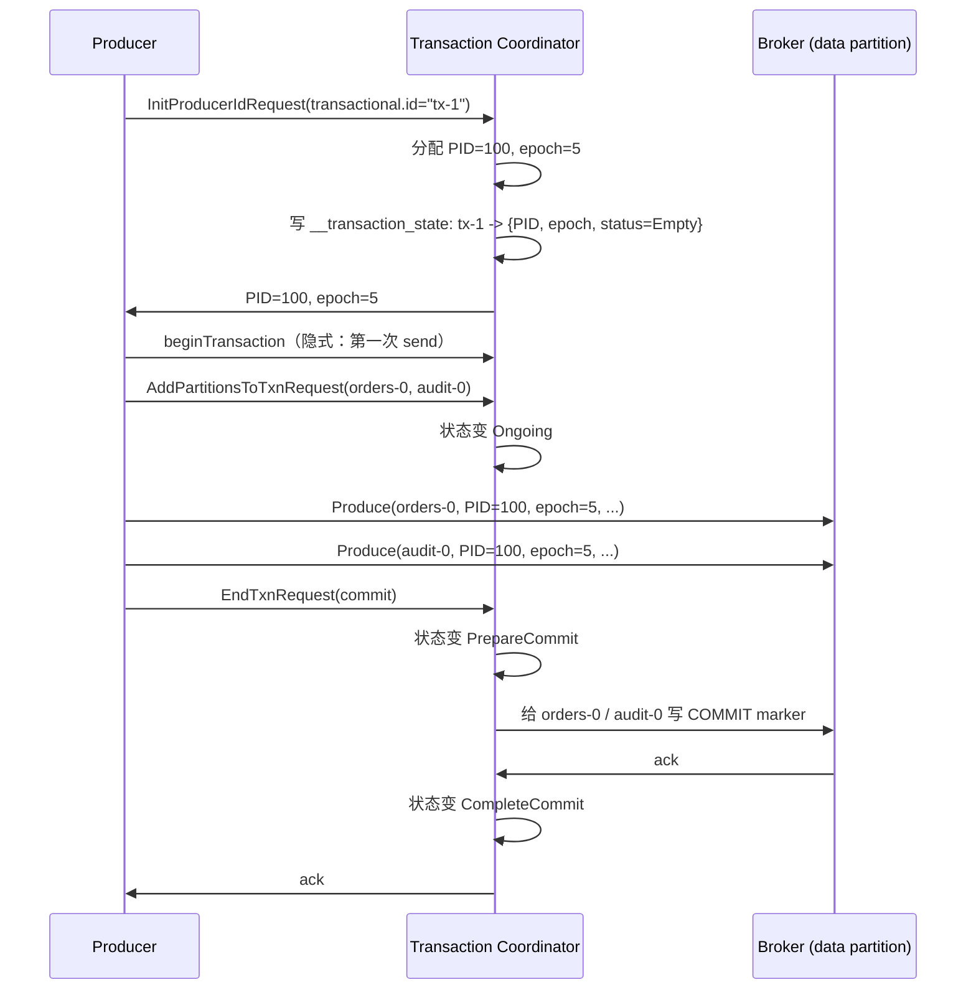
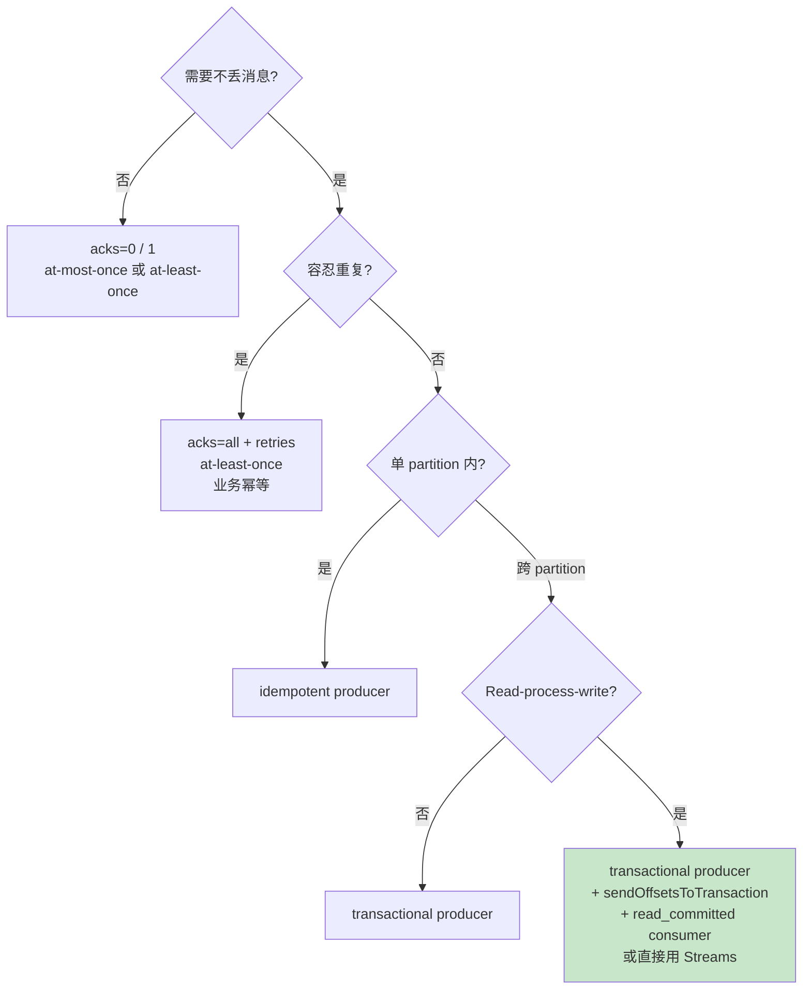
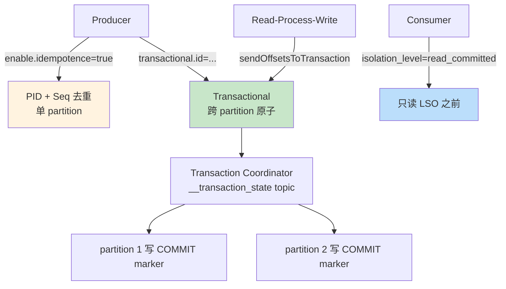

# 精通 Kafka 精确一次（EOS）与事务：Idempotent、Transactional、2PC

> 关联章节：[K03 Producer](./03-精通-Producer.md)、[K04 Consumer](./04-精通-Consumer-KIP-848.md)、[K09 Streams](./09-精通-Kafka-Streams.md)

---

## 引言：消息系统的 EOS 长达十年的难题

分布式消息系统的"消息投递语义"是个老问题：

- **at-most-once**：可能丢，不重复
- **at-least-once**：不丢，可能重复
- **exactly-once**（EOS）：不丢不重复

20 世纪以来的传统消息队列（ActiveMQ、RabbitMQ、IBM MQ）几乎都做不到真正的 EOS——要么靠分布式事务 / XA / 2PC（性能极差），要么把幂等问题踢给应用。

Kafka 0.11（2017）引入 idempotent + transactional producer，**首次在主流消息系统里实现可用的 EOS**。这是 Confluent 多年工程的成果，也是 Kafka 区别于其他 MQ 的关键能力之一。

读完这章你应能：

- 区分 idempotent 与 transactional producer 的能力边界
- 解释 PID、Epoch、Sequence Number、Transaction Coordinator 的角色
- 实现 read-process-write 模式的端到端 EOS
- 调优 isolation_level 与 LSO 延迟
- 诊断 ZombieEpoch、PIDFenced 等错误

---

## 第一章：投递语义的三档

### 1.1 At-most-once

```
Producer → broker（一次发送）
失败也不重试
```

结果：可能丢消息，但不会重复。适用于：log、metrics（丢一点不致命）。

### 1.2 At-least-once

```
Producer → broker → ack
ack 没收到 → retry
broker 可能有重复
```

结果：不丢但可能重复。Kafka 默认行为。要求消费者业务**幂等**（重复处理结果一样）。

### 1.3 Exactly-once

```
Producer → broker（带 idempotency 标识）
broker 去重
Consumer → 处理 → commit 在同一事务
```

结果：每条消息**恰好处理一次**。需要 producer + broker + consumer 三方协作。

### 1.4 现实里 EOS 实际上是什么

Kafka 的 EOS 严格说是：

- **broker 端去重**：相同 PID + sequence 的消息只存一次
- **跨 partition 原子性**：transactional producer 多 partition 写要么全成功要么全失败
- **read-process-write 闭环**：consumer 提交 offset 与 producer 写新消息原子

> 但 Kafka 控制不了"应用副作用"。如果 process 里调外部服务（如发邮件），Kafka 没法保证邮件恰好发一次——那是外部系统的事。

---

## 第二章：Idempotent Producer

### 2.1 解决什么问题

普通 producer + retries 会重复：

```
producer → broker（成功写入）
broker → producer（ack 网络丢）
producer 超时重试 → broker（再写一次）
```

→ broker 上有两条相同消息。

idempotent producer 让 broker 识别"这是同一条消息的重试"。

### 2.2 启用

```properties
enable.idempotence=true
```

Kafka 3.0+ 默认 true。

### 2.3 实现机制：PID + Sequence Number

producer 启动时：

1. 向任一 broker 发 `InitProducerIdRequest`
2. broker（实际是 transaction coordinator）分配一个唯一的 **PID**
3. producer 给每个 partition 维护**单调递增的 sequence number**

每条消息带 `(PID, partition, sequence)`。

broker 端**每个 partition 维护一个 `(PID → last_sequence)` 映射**：

```
收到 (PID=5, P=0, seq=N)
case seq <= last_sequence[PID,P]: 已写入，跳过但返回 ack
case seq == last_sequence[PID,P] + 1: 正常 append, last_sequence++
case seq > last_sequence[PID,P] + 1: OutOfOrderSequenceException（乱序）
```

### 2.4 实战开关条件

启用 idempotent 后 Kafka **强制**：

| 参数 | 必须 |
|---|---|
| `acks` | `all` |
| `retries` | `> 0`（默认 Integer.MAX_VALUE） |
| `max.in.flight.requests.per.connection` | `≤ 5` |

为什么 max.in.flight 上限 5？—— broker 端保存每 PID 的最近 5 个 sequence，足以判断乱序。

### 2.5 局限

idempotent producer 只保证：

- **单 partition 内**幂等
- **单 producer 生命周期内**有效

不保证：

- 跨 partition / 跨 topic
- producer 重启后（拿新 PID，旧 PID 的去重信息可能在 broker 端过期）

→ 跨 partition / 持久 EOS 需要 transactional producer。

---

## 第三章：Transactional Producer

### 3.1 解决什么问题

- 多 partition 写要原子：要么全写要么全不写（避免半写状态）
- read-process-write：consumer 消费 + 处理 + 生产新消息 + 提交 offset 都原子

### 3.2 关键概念

| 概念 | 含义 |
|---|---|
| `transactional.id` | 应用层指定的唯一 ID，跨重启**保持同一 PID 的所有权** |
| **Producer Epoch** | 同一 transactional.id 重启后 epoch 递增，旧实例的请求被 fencing |
| **Transaction Coordinator** | 负责事务状态机的 broker（按 transactional.id 哈希到 partition） |
| **`__transaction_state`** | 内置 topic，存事务状态 |
| **LSO**（Last Stable Offset） | consumer read_committed 模式可见的边界 |

### 3.3 用法

```java
props.put("transactional.id", "my-tx-id-" + instanceId);
props.put("enable.idempotence", "true");      // 隐含开启
props.put("acks", "all");

Producer<String,String> p = new KafkaProducer<>(props);
p.initTransactions();   // 1. 注册到 coordinator，拿 PID + epoch

try {
    p.beginTransaction();   // 2. 开启事务
    p.send(new ProducerRecord<>("orders", ...));
    p.send(new ProducerRecord<>("audit", ...));
    p.sendOffsetsToTransaction(offsets, "consumer-group-id");   // 3. consumer offset 进同事务
    p.commitTransaction();  // 4. 提交
} catch (ProducerFencedException | OutOfOrderSequenceException | AuthorizationException e) {
    p.close();   // 不可恢复，关
} catch (KafkaException e) {
    p.abortTransaction();   // 可恢复，abort
}
```

### 3.4 事务的物理实现



整个过程类似 **2PC**：

- prepare 阶段：写 transaction log，标记 PrepareCommit
- commit 阶段：给每个 partition 写 control batch（COMMIT 或 ABORT marker）

### 3.5 Control Batch / Marker

事务 commit / abort 在 partition log 里写一条特殊 record：

```
普通消息 ... | 普通消息 ... | COMMIT marker
```

consumer 读到 COMMIT marker → 知道前面所有 PID=100 epoch=5 的消息可见。
读到 ABORT marker → 跳过前面这个事务的消息。

---

## 第四章：Consumer 侧的 isolation_level

### 4.1 两个隔离级别

```properties
isolation.level=read_uncommitted   # 默认，看所有消息
isolation.level=read_committed     # 只看 committed 事务的消息
```

### 4.2 read_committed 的实现

consumer fetch 时携带 isolation_level，broker 返回数据只到 **LSO**（Last Stable Offset）。

```
partition log:
m0 m1 m2 [BEGIN tx5] m3 m4 m5 m6 [BEGIN tx6] m7 [COMMIT tx5] m8

HW = 9
LSO = 7   ← 第一个尚未 commit 的事务起点

read_committed consumer 只能读到 m6（不含 m7, m8）
等 tx6 commit/abort 后才能继续
```

### 4.3 LSO 延迟

如果有未完成事务卡着，**所有 consumer 都跟着 stall**：

```
tx-N 卡了 10 分钟没 commit → LSO 不前进 → consumer 看不到 tx-N 之后的消息
即便 tx-N 之后的消息根本不在 tx-N 中
```

这是 EOS 的代价。

参数 `transaction.timeout.ms`（默认 60s）让卡住的事务超时 abort，缓解 LSO 卡顿。

### 4.4 何时需要 read_committed

- 处理事务消息（producer 用 EOS 写）→ 必须 read_committed
- 不在乎跨 partition 一致性的话 read_uncommitted 更快

---

## 第五章：Read-Process-Write 闭环

### 5.1 经典模式

```
input_topic → consume → process → produce(output_topic) + commit offset
```

EOS 要求：consume → produce → commit 这三件事**原子**。

### 5.2 实现

```java
Properties cProps = ...;
cProps.put("isolation.level", "read_committed");
cProps.put("enable.auto.commit", "false");
KafkaConsumer<String,String> c = new KafkaConsumer<>(cProps);

Properties pProps = ...;
pProps.put("transactional.id", "tx-" + instanceId);
KafkaProducer<String,String> p = new KafkaProducer<>(pProps);
p.initTransactions();

c.subscribe(Collections.singleton("input"));

while (true) {
    ConsumerRecords<String,String> records = c.poll(Duration.ofMillis(1000));
    if (records.isEmpty()) continue;

    p.beginTransaction();
    try {
        Map<TopicPartition, OffsetAndMetadata> offsets = new HashMap<>();
        for (ConsumerRecord<String,String> r : records) {
            String processed = process(r.value());
            p.send(new ProducerRecord<>("output", r.key(), processed));
            offsets.put(new TopicPartition(r.topic(), r.partition()),
                        new OffsetAndMetadata(r.offset() + 1));
        }
        p.sendOffsetsToTransaction(offsets, c.groupMetadata());
        p.commitTransaction();
    } catch (Exception e) {
        p.abortTransaction();
    }
}
```

关键点：

- `sendOffsetsToTransaction` 把 offset 提交也进事务
- 失败 → abortTransaction → offset 没提交 → 下次重新拉

### 5.3 为什么不能用 `c.commitSync()`

直接用 consumer commit offset 不在事务里：

```
事务 commit 成功 → output 写入有效
然后 c.commitSync() 失败 → offset 没记
重启后 → 重新处理 → output 重复 ❌
```

必须用 `p.sendOffsetsToTransaction` 让 offset commit 与 produce 一起原子。

---

## 第六章：Producer 重启与 Fencing

### 6.1 Zombie 问题

```
Instance A：transactional.id="tx-1", PID=100, epoch=5
A 假死（GC pause / 网络隔离）
监控认为 A 挂了，启动 Instance B：transactional.id="tx-1", PID=100, epoch=6
A 突然苏醒，继续发消息（用 epoch=5）
→ A 是 zombie，应该被阻止
```

### 6.2 Epoch Fencing

`initTransactions()` 时：

- coordinator 看到同 transactional.id 已有 epoch=5
- 给新实例分配 epoch=6
- 之后任何 epoch=5 的请求被 **`ProducerFencedException`** 拒绝

```java
catch (ProducerFencedException e) {
    // zombie 检测到了，立刻退出
    System.exit(1);
}
```

### 6.3 transactional.id 必须稳定

```
错误：transactional.id="tx-" + UUID.random()
  → 每次重启拿新 PID → 旧 PID 的悬挂事务永远不能解决
错误：transactional.id="tx-1"（多实例都用同一个）
  → 多实例互相 fence
正确：transactional.id 由 (固定前缀 + 实例标识) 组成
  → 同实例重启拿同 ID，多实例不冲突
```

K8s 部署常见做法：

```
transactional.id="tx-" + hostname  # statefulset 才有稳定 hostname
```

Kafka Streams 自动管理 transactional.id（用 application.id + task id），不用手动。

---

## 第七章：Kafka Streams 的 EOS

### 7.1 自动 EOS

Kafka Streams 内置 EOS 支持：

```properties
processing.guarantee=exactly_once_v2
```

`exactly_once_v2` 是 Kafka 2.5+ 的优化版本，比 `exactly_once`（v1）少一半网络开销。

### 7.2 Streams 帮你做了什么

- 自动 transactional producer（per task 一个 producer）
- 自动管理 offset 提交进事务
- 自动 epoch fencing
- 自动 read_committed consumer

应用代码不变，配置一行开启 EOS。

### 7.3 性能成本

EOS 模式比 at-least-once：

- 吞吐降 10-30%（事务协调开销）
- LSO 延迟使下游消费滞后几十 ms 起步

合理：开销值得 "处理一次"保证。

---

## 第八章：事务的局限

### 8.1 事务大小

```properties
transaction.max.timeout.ms=900000   # 15 min (broker 默认)
```

事务不能太久——卡住 LSO 影响下游。

业务侧：

- 短事务（毫秒级）：每条消息一个事务
- 中事务（秒级）：批量积累后 commit
- 长事务（分钟级）：尽量避免

### 8.2 事务不跨集群

事务只在**同一个 Kafka 集群内**有效。跨集群（如 MirrorMaker、CCR）会破坏 EOS：

- consumer 端可能消费到 source 集群已 abort 的消息（MirrorMaker 复制了）
- 跨集群 EOS 需要更复杂的 idempotent sink 配合

### 8.3 不能跨外部系统

发邮件 / 调外部 API / 写外部数据库不在 Kafka 事务范围内。

要做"Kafka + 外部 DB 原子" → 用 transactional outbox 模式（DB 里有个 outbox 表，事务写 outbox + 业务表，CDC 把 outbox 推到 Kafka）。

---

## 第九章：典型故障

### 9.1 案例：OutOfOrderSequenceException

**症状**：producer 报 `org.apache.kafka.common.errors.OutOfOrderSequenceException`。

**根因**：

- broker 端记录的 sequence 与 producer 发送的不连续
- 一般是 producer 重试时 max.in.flight 太大导致

**修复**：

- 不建议调小 max.in.flight（idempotent producer 应该能容忍）
- 检查是否多实例错用同一 transactional.id
- 实在不行 close + 重建 producer

### 9.2 案例：ProducerFencedException

**症状**：

```
ProducerFencedException: There is a newer producer with the same transactionalId
```

**根因**：

- 应用多实例错用同一 transactional.id
- 或正常的 zombie fencing（监控误判 producer 挂后重启）

**修复**：

- 多实例：transactional.id 加上实例标识
- 收到 fenced 立刻退出（不要 retry）

### 9.3 案例：consumer 卡在某 offset

**症状**：consumer 长时间不前进，但 producer 还在写。

**诊断**：

```bash
# 看 LSO 是否前进
kafka-consumer-groups.sh ... --describe
```

LSO 没动 → 有事务卡住。

**根因**：transactional producer crash 而没 abort，事务挂在 PrepareCommit 状态。

**修复**：

- 等 transaction.timeout.ms 触发 abort（默认 15min）
- 业务侧重启 producer（同 transactional.id），coordinator 会 abort 旧事务
- 实在不行用 `kafka-transactions.sh --abort` 工具

### 9.4 案例：EOS 模式吞吐降一半

**症状**：开 EOS 后 QPS 从 100K 降到 50K。

**根因**：

- 每条消息一个事务（过细粒度）
- 每个事务有 fixed overhead（initTransactions / commit）

**修复**：

- 批量积累：N 条消息合并一个事务（如 batch 100 条）
- 或者用 Kafka Streams 自动管理（per-task batch）

### 9.5 案例：升级后 EOS v1 → v2 不能滚动

**症状**：从 `exactly_once` 切到 `exactly_once_v2`，部分实例还没切，事务报错。

**根因**：v1 v2 协议互不兼容，必须全部实例同时切换。

**修复**：

- 全停 → 改配置 → 全启动（短暂停业务）
- 或先迁到一个新 group / 新 transactional.id 前缀

---

## 第十章：决策树



---

## 总结 · EOS 一图流



EOS 心法：

1. **idempotent 解决单 partition 重复**——免费、默认开
2. **transactional 解决跨 partition 原子**——要 transactional.id 稳定
3. **Read-process-write** 用 `sendOffsetsToTransaction` 把 offset commit 进事务
4. **read_committed** consumer 看 LSO；长事务卡 LSO
5. **Kafka Streams 自动 EOS**——业务复杂时直接用 Streams 而不是手撸事务

---

## 练习题

1. idempotent 和 transactional producer 各自保证什么？
2. PID + epoch + sequence 三个字段各自的作用？
3. transactional.id 为什么必须跨重启稳定？
4. read_committed 的 LSO 是什么？为什么可能卡顿？
5. 解释 ProducerFencedException 的根本原因。
6. read-process-write 模式中为什么不能直接 c.commitSync()？
7. EOS v1 与 v2 的差异？为什么 v2 更快？
8. 一个长事务（10 min）对集群的影响？
9. Kafka EOS 能保证发邮件恰好一次吗？为什么？
10. transactional 模式下 max.in.flight 上限 5 的原因？

> 答案见 [QUIZ.md](./QUIZ.md)

---

> 📁 本文位于 `/data/workspace/dp4/kafka/07-精通-精确一次-事务.md`
> 🔁 反馈：跑 read-process-write 例子，杀掉 producer 中间状态，验证 EOS 不破
