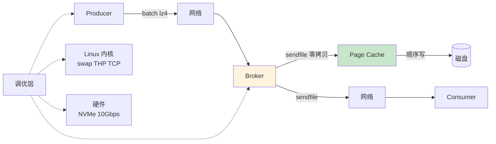

# 精通 Kafka 性能调优：压缩、零拷贝、Linux 调优与百万 QPS 实战

> 关联章节：[K03 Producer](./03-精通-Producer.md)、[K06 存储](./06-精通-存储与-Segment.md)、[K05 ISR](./05-精通-复制-ISR.md)

---

## 引言：Kafka 为什么这么快

Kafka 是少数能在通用商业硬件上稳定支撑**单机数百 MB/s**写入的系统。秘密不在某一个 trick，而是**整个栈的协同**：

1. **顺序写**——磁盘 IO 物理友好
2. **批量**——降低 RPC 开销
3. **压缩**——降网络与磁盘
4. **零拷贝**（sendfile）——避免 user/kernel space 复制
5. **Page cache**——读写都靠 OS 内存
6. **简单协议**——二进制、无 schema 解析
7. **分区并行**——水平扩展

这章把这些机制拆开讲清楚，然后给出 producer / broker / OS 各层的调优清单和百万 QPS 实战案例。读完之后你应能：

- 解释 sendfile 与传统 read/write 的区别
- 调 producer batch / linger / compression 三件套
- 配 broker 网络 / IO / 磁盘
- 配 Linux 内核 page cache、TCP、文件系统
- 用 kafka-producer-perf-test 做基准测试

---

## 第一章：性能的物理根因

### 1.1 顺序写 vs 随机写

```
传统 DB（B-tree）：随机写
HDD: 100-200 IOPS
SSD: 10k-100k IOPS

Kafka：顺序追加写
HDD: 100-200 MB/s
SSD: 500 MB/s - 7 GB/s（NVMe）
```

顺序写比随机写**快 100-1000 倍**。Kafka 把"追加日志"作为唯一存储方式 → 把劣势硬件玩出优势。

### 1.2 OS Page Cache

Linux 文件 IO 默认经过 page cache：

```
write() 系统调用 → 写到 page cache → 异步 flush 到磁盘
read() 系统调用 → 从 page cache 读（命中）→ 没命中再去磁盘
```

Kafka **不用 JVM 堆**做缓存：

- broker heap 6-12GB 就够（用于元数据、请求处理）
- 其余物理内存全留给 OS page cache
- 100GB 内存机器 → ~90GB 给 page cache → 大部分热段都在内存

这是 Kafka broker 不需要大 heap 的根本原因。

### 1.3 sendfile 零拷贝

传统读文件发到网络：

```
1. read(file) → 数据从 page cache 复制到 user buffer
2. write(socket) → 数据从 user buffer 复制到 kernel socket buffer
3. DMA 把 socket buffer 发到网卡
```

四次内存复制（包括 DMA），两次系统调用，两次上下文切换。

sendfile：

```
sendfile(socket, file) → DMA 直接从 page cache 推到网卡
```

一次系统调用，**零次用户态复制**。

效果：consumer 拉数据时 broker CPU 占用几乎为 0，全靠 DMA 移字节。

### 1.4 简化的二进制协议

Kafka wire protocol 是定长 + 长度前缀的二进制：

- 无 schema 解析（不像 protobuf 要 codegen）
- 不需 deserialize 就能转发（broker 不解析消息内容）
- 客户端跨语言简单

代码层面：消息从 page cache → socket，broker 完全不用看里面是什么。

---

## 第二章：Producer 调优

### 2.1 三件套：batch.size、linger.ms、compression.type

| 配置 | 用途 |
|---|---|
| `batch.size` | 每 partition 攒多大字节才发 |
| `linger.ms` | 没攒满最多等多久 |
| `compression.type` | 压缩算法 |

调优黄金法则：**linger.ms 5-20 + batch.size 32-256KB + compression lz4**。

### 2.2 batch 与压缩相互放大

压缩在 batch 级别做。batch 越大：

- 压缩比越好（重复模式多）
- 单个 RPC 携带更多消息（减少 RPC 数）
- 减少 broker IO 次数

```
单条压缩：几乎无效
1KB batch (10 条) 压缩：1.5x
32KB batch (300 条) 压缩：4x
```

### 2.3 max.in.flight 与吞吐

`max.in.flight.requests.per.connection`（默认 5）：

- 调大（仅非 idempotent）→ 更高并发，但乱序风险
- 配合 idempotent producer，5 不会乱序

实测 5 已经能跑满千兆网卡。

### 2.4 buffer.memory

`buffer.memory`（默认 32MB）：producer 端 accumulator 上限。

```
buffer.memory / (batch.size × partitions) = 每 partition 同时积压 batch 数
```

例：64MB / (32KB × 10 partition) = 200 batch / partition 上限。

超过 → 阻塞 send() 调用（max.block.ms 60s 后抛 TimeoutException）。

### 2.5 性能基准

```bash
kafka-producer-perf-test.sh --topic perf --num-records 10000000 \
  --record-size 1024 --throughput -1 \
  --producer-props bootstrap.servers=:9092 acks=all linger.ms=10 batch.size=65536 compression.type=lz4
```

样本输出：

```
10000000 records sent, 287356.32 records/sec (280.62 MB/sec), 12.4 ms avg latency, 245.0 ms max latency
```

调参后对比，单 producer 100K-500K QPS 是合理目标。

---

## 第三章：Broker 调优

### 3.1 关键线程池

| 线程池 | 配置 | 用途 |
|---|---|---|
| `num.network.threads` | 默认 3，调到 cores | 接收/发送网络数据 |
| `num.io.threads` | 默认 8，调到 cores × 2 | 处理请求（read/write disk） |
| `num.replica.fetchers` | 默认 1，调到 4-8 | follower 拉 leader |
| `background.threads` | 默认 10 | 清理、压缩 |

经验：32 核机器配 `num.network.threads=8, num.io.threads=16`。

### 3.2 网络参数

```properties
socket.send.buffer.bytes=1048576       # 1 MB
socket.receive.buffer.bytes=1048576
socket.request.max.bytes=104857600     # 100 MB（大消息时调高）
```

### 3.3 IO 与磁盘

```properties
log.flush.interval.messages=Long.MAX_VALUE   # 不主动 fsync 消息
log.flush.interval.ms=Long.MAX_VALUE          # 让 OS 决定
```

Kafka 默认**不主动 fsync** —— 靠 page cache 异步刷盘。可靠性靠**多副本**而非 fsync。

如果改成主动 fsync（如每 1s 一次）：

- 写入吞吐降 5-10×
- 可靠性几乎没提升（异常崩溃丢的是 < 1s 数据，多副本能补）

### 3.4 多磁盘

```properties
log.dirs=/disk1/kafka-logs,/disk2/kafka-logs,/disk3/kafka-logs
```

partition 会均衡到多个目录。**用多个独立物理盘**（RAID0 不推荐——单盘坏整 broker 挂；JBOD 更好）。

Kafka 2.6+ 支持 **partition replication 跨磁盘移动**：单盘坏不影响其他 partition。

### 3.5 GC

```bash
# jvm.options
-Xms6g -Xmx6g
-XX:+UseG1GC
-XX:MaxGCPauseMillis=20
-XX:InitiatingHeapOccupancyPercent=35
-XX:G1HeapRegionSize=16M
```

Kafka heap 不大（6-12GB）所以 GC 很轻。如果发现频繁 GC：

- 看是不是有热 partition / hot consumer
- 加 heap 一般不需要

### 3.6 网络缓冲

socket buffer 自动调整 vs 固定：

```bash
# Linux
net.core.rmem_default=262144
net.core.rmem_max=16777216
net.core.wmem_default=262144
net.core.wmem_max=16777216
net.ipv4.tcp_rmem="4096 87380 16777216"
net.ipv4.tcp_wmem="4096 65536 16777216"
```

10Gbps 网卡需要更大的 socket buffer 才能填满管道。

---

## 第四章：Linux 内核调优

### 4.1 文件系统

| 选择 | 评价 |
|---|---|
| **XFS** | Kafka 官方推荐，元数据性能稳定 |
| ext4 | 可用，大文件略弱 |
| Btrfs / ZFS | 不推荐（CoW 与 Kafka 顺序写不友好） |

```bash
# mount options
mount -o noatime,nodiratime /dev/nvme0n1p1 /var/lib/kafka
```

`noatime` 关闭 access time 更新，节省随机写。

### 4.2 IO 调度器

```bash
# NVMe 用 none（让设备自己调度）
echo none > /sys/block/nvme0n1/queue/scheduler

# SATA SSD 用 mq-deadline
echo mq-deadline > /sys/block/sda/queue/scheduler

# HDD 用 mq-deadline 或 bfq
```

### 4.3 透明大页 THP

```bash
echo never > /sys/kernel/mm/transparent_hugepage/enabled
echo never > /sys/kernel/mm/transparent_hugepage/defrag
```

THP 在 Kafka 上有过几次 stall 报告。建议关闭。

### 4.4 swappiness

```bash
sysctl vm.swappiness=1
```

Kafka 严重依赖 page cache。swap 触发会让一切变慢。设为 1 让内核**几乎不主动 swap**。

### 4.5 dirty page

```bash
sysctl vm.dirty_ratio=80
sysctl vm.dirty_background_ratio=5
sysctl vm.dirty_expire_centisecs=12000
```

让 page cache 中"脏数据"占比能高到 80%（默认 20%）—— Kafka 写入吞吐能上去。配合多副本，丢失风险低。

### 4.6 TCP

```bash
sysctl net.ipv4.tcp_window_scaling=1
sysctl net.ipv4.tcp_tw_reuse=1
sysctl net.core.netdev_max_backlog=5000
sysctl net.ipv4.tcp_max_syn_backlog=8192
sysctl net.ipv4.tcp_no_metrics_save=1
```

### 4.7 文件句柄

```bash
# /etc/security/limits.conf
kafka soft nofile 1000000
kafka hard nofile 1000000

# 或 systemd 单元
LimitNOFILE=1000000
```

Kafka 每 segment 几个文件句柄，几千 partition × 几个 segment 轻松破 100k。给 1M 余量。

### 4.8 检查清单

```bash
# 检查
cat /proc/sys/vm/swappiness                     # 应该 1
cat /sys/kernel/mm/transparent_hugepage/enabled # [never]
ulimit -n                                       # > 100000
mount | grep kafka                              # noatime,nodiratime
```

---

## 第五章：硬件选型

### 5.1 网卡

| 业务规模 | 网卡 |
|---|---|
| < 100 MB/s | 1 Gbps 够 |
| 100 MB/s - 1 GB/s | 10 Gbps |
| > 1 GB/s | 25/40/100 Gbps |

**记得 acks=all + 副本流量**：1 GB/s 业务 + 2 副本 = 网卡 3 GB/s 流量。

### 5.2 磁盘

| 选项 | 适用 |
|---|---|
| NVMe SSD | 最高性能（数百 MB/s 写入） |
| SATA SSD | 大多数生产 |
| HDD | 仅冷数据 / 大保留期 |
| RAID 0 | 不推荐（单盘坏整 broker 挂） |
| JBOD（多独立盘） | **推荐**，Kafka 自己做副本 |

### 5.3 内存

经验公式：

```
heap (6-12GB) + page cache (剩余) + JVM overhead 2-4GB
```

64GB 物理内存：6GB heap + 56GB page cache + buffer。

128GB 内存对单 broker 是甜区——能装下一周的热数据 page cache。

### 5.4 CPU

Kafka 对 CPU 要求中等：

- 单核：编码 / 压缩 / 复制 流水线
- 多核：充分用 num.network.threads + num.io.threads + num.replica.fetchers

24-32 核够大多数场景，AMD EPYC 性价比高。

---

## 第六章：监控

### 6.1 关键 JMX 指标

```
# 吞吐
kafka.server:type=BrokerTopicMetrics,name=MessagesInPerSec
kafka.server:type=BrokerTopicMetrics,name=BytesInPerSec
kafka.server:type=BrokerTopicMetrics,name=BytesOutPerSec

# 请求延迟
kafka.network:type=RequestMetrics,name=TotalTimeMs,request=Produce
kafka.network:type=RequestMetrics,name=TotalTimeMs,request=Fetch

# 队列
kafka.network:type=RequestChannel,name=RequestQueueSize
kafka.network:type=RequestChannel,name=ResponseQueueSize

# 复制健康
kafka.server:type=ReplicaManager,name=UnderReplicatedPartitions
kafka.server:type=ReplicaManager,name=UnderMinIsrPartitionCount

# IO
kafka.log:type=LogFlushStats,name=LogFlushRateAndTimeMs
kafka.server:type=KafkaRequestHandlerPool,name=RequestHandlerAvgIdlePercent

# 磁盘
kafka.log:type=LogSize,name=Size,topic=*,partition=*
```

### 6.2 告警阈值

| 指标 | 阈值 |
|---|---|
| UnderReplicatedPartitions | > 0 持续 1min |
| UnderMinIsrPartitionCount | > 0 立刻 |
| RequestHandlerAvgIdlePercent | < 30% |
| ProducerRequestQueueTimeMs P99 | > 100ms |
| Log flush latency P99 | > 500ms |
| 磁盘使用率 | > 80% |

### 6.3 工具推荐

- **Prometheus + JMX Exporter**：标准开源栈
- **Confluent Control Center**：商业，可视化强
- **Cruise Control**：LinkedIn 出的自动 rebalance + 监控
- **Kafka UI / AKHQ**：界面查 topic / consumer
- **Burrow**：consumer lag 专用

---

## 第七章：典型场景调优

### 7.1 高吞吐日志收集

```properties
# producer
acks=1
linger.ms=20
batch.size=262144     # 256 KB
compression.type=lz4
buffer.memory=134217728   # 128 MB

# broker
num.replica.fetchers=4
log.segment.bytes=1073741824
log.cleanup.policy=delete
log.retention.hours=72
default.replication.factor=2   # 日志数据，2 副本够
```

### 7.2 低延迟事件流

```properties
# producer
acks=1
linger.ms=0
batch.size=16384
compression.type=none
max.in.flight.requests.per.connection=1

# broker
num.network.threads=cores
log.flush.interval.messages=Long.MAX_VALUE
```

### 7.3 EOS 强可靠

```properties
# producer
acks=all
enable.idempotence=true
transactional.id=tx-xxx
linger.ms=5
compression.type=lz4

# topic
min.insync.replicas=2
replication.factor=3
```

### 7.4 海量小消息

```properties
# producer
batch.size=524288     # 512 KB
linger.ms=50
compression.type=zstd  # 压缩比高
```

数千条小消息合到一个 batch，压缩比能 5-10×。

---

## 第八章：百万 QPS 案例

### 8.1 业务背景

电商订单流水。每个订单产生 5 条消息（创建、支付、物流、签收、评价）。日订单 1 亿 → 5 亿消息 → 平均 5800 QPS，峰值 30 倍 → ~17 万 QPS。

### 8.2 集群规划

- 12 broker（NVMe SSD 4TB × 2 / 64GB RAM / 32 core / 10Gbps）
- 3 controller 节点（专用）
- 主 topic `orders`：60 partition × 3 replica
- 单 partition 写入 ~3000 QPS（足够冗余）

### 8.3 配置

producer：

```properties
acks=all
enable.idempotence=true
linger.ms=10
batch.size=65536
compression.type=lz4
buffer.memory=67108864
```

broker：

```properties
num.network.threads=16
num.io.threads=32
num.replica.fetchers=8
log.segment.bytes=1073741824
default.replication.factor=3
min.insync.replicas=2
```

Linux：

```bash
vm.swappiness=1
vm.dirty_ratio=80
vm.dirty_background_ratio=5
ulimit -n 1000000
echo never > /sys/kernel/mm/transparent_hugepage/enabled
```

### 8.4 实测

- 峰值写入：18 万 QPS，平均消息 800 字节 → 144 MB/s
- 算上 3 副本：单 broker 进 12 MB/s + 出 24 MB/s（200 Mbps）
- broker CPU 平均 30%，网卡 30%
- producer P99 延迟 15ms（含 ack=all）

### 8.5 学到

- **副本流量是隐藏成本**：业务流量 × 副本数 ≈ broker 网络
- **partition 数充分**：60 partition / 12 broker = 5 partition / broker，并行度够
- **lz4 是甜区**：压缩比 3-4×，CPU 占 < 5%
- **3 副本是底线**：1 副本挂时还能写（min.insync=2）

---

## 第九章：常见性能反模式

### 9.1 单 partition 热点

```
按 user_id 分区，但 99% 流量来自 1% 大客户
→ 单 partition 写入 50k QPS，其他 partition 100 QPS
→ 那个 partition 所在 broker 单核打满
```

修复：

- 大客户用 random 后缀
- 自定义 partitioner 散热点
- 业务拆分

### 9.2 太多小 partition

```
1000 topic × 100 partition = 10 万 partition
每 broker（10 broker）1 万 partition
→ 元数据爆、文件句柄爆、复制开销大
```

修复：

- 合并 topic（按业务域聚合）
- 单 broker < 4000 partition

### 9.3 ack=all 但 min.insync=1

```
RF=3, min.insync=1
ISR 缩到 1 时仍接受写入
此时 leader 挂 → 丢已 ack 的数据
```

修复：min.insync.replicas=2。

### 9.4 巨型消息

```
消息 100MB（log dump、二进制 blob）
→ 单 batch 巨大、内存压力、broker IO 卡
```

修复：

- 业务侧拆消息（chunk）
- 大文件外部存储（S3）+ Kafka 只发指针
- 极端情况调高 max.message.bytes 但接受性能代价

### 9.5 同步 send

```java
producer.send(record).get();  // 每条等 broker ack
```

→ 网络 RTT 完全串行，吞吐几千 QPS 顶天。

修复：

- 异步 send + callback
- 或者业务侧自己做 batch 后发

### 9.6 消费者一直忙不过来

```
单 consumer 处理 1KB / record，CPU 100%
→ lag 持续涨
```

修复：

- 加 consumer 实例（≤ partition 数）
- 异步处理（poll + threadpool）
- 移到流处理框架（Streams / Flink）

---

## 第十章：调优方法论

### 10.1 先量后调

```
1. 跑基准（kafka-producer-perf-test）建立 baseline
2. 一次改一个参数
3. 重跑基准对比
4. 接受 / 回退
```

### 10.2 排查瓶颈的顺序

```
1. 哪台机器慢？（看 broker 维度指标）
2. 哪个 partition 热？（看 partition 维度）
3. 是 producer / broker / consumer 哪一端？
4. 是 CPU / 内存 / 磁盘 / 网络哪种资源？
5. 配置 vs 容量
```

### 10.3 不要早优化

Kafka 默认值对 80% 场景够用。先用默认配置上线、观察、量化瓶颈，再调具体参数。

---

## 总结 · 调优一图流



调优心法：

1. **顺序写 + Page Cache + sendfile** 是物理基础
2. **Batch + Compression** 是软件杠杆
3. **多副本不靠 fsync 靠 ISR** 才能高吞吐
4. **OS 调优**（swap、THP、ulimit）一次性收益最大
5. **监控 + 基准** 是科学调优的前提

---

## 练习题

1. 解释 sendfile 比传统 read+write 快的原因。
2. Kafka 为什么不主动 fsync 也敢说"可靠"？
3. linger.ms 与 batch.size 哪个先到先发？
4. lz4 vs zstd vs gzip 的选择？
5. JBOD vs RAID0 谁更适合 Kafka？为什么？
6. 单 partition 热点怎么诊断和修复？
7. THP 为什么要关？
8. vm.swappiness=1 而不是 0 的原因？
9. consumer lag 大但 CPU 不忙，可能原因？
10. 一个 broker 突然 P99 延迟飙高，列出至少 5 个排查方向。

> 答案见 [QUIZ.md](./QUIZ.md)

---

> 📁 本文位于 `/data/workspace/dp4/kafka/08-精通-性能调优.md`
> 🔁 反馈：跑 kafka-producer-perf-test 改 batch.size 看数字——这是建立直觉的最快方法
