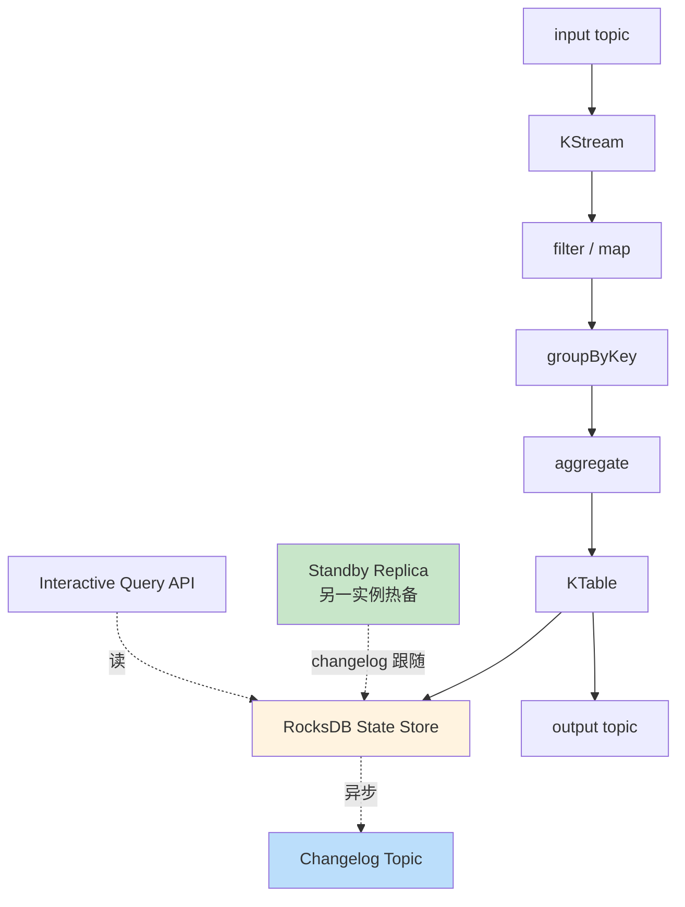

# 精通 Kafka Streams：状态存储、窗口、Interactive Query 与 EOS

> 关联章节：[K04 Consumer/KIP-848](./04-精通-Consumer-KIP-848.md)、[K07 精确一次](./07-精通-精确一次-事务.md)、[K10 Connect](./10-精通-Connect-Schema-Registry.md)

---

## 引言：从 Producer/Consumer 到流处理

光用 Kafka producer/consumer API 写流处理代码很麻烦：

- 自己维护 state（聚合、join 中间结果）
- 自己处理 rebalance 后的 state 恢复
- 自己实现窗口、时间语义
- 自己保证 EOS 语义

**Kafka Streams** 是 Kafka 项目内置的轻量级流处理库（不是独立集群）：

- 一个 Java 库，作为应用进程的一部分跑
- 用 Kafka 自己做 state changelog（RocksDB 本地 + changelog topic）
- 自动管理 task 分配、scale out、容错
- 内置 EOS 模式

适合："不想搭 Flink，但想做实时聚合 / join / 窗口"的场景。

读完本章你应能：

- 区分 KStream / KTable / GlobalKTable
- 实现 join、aggregation、windowing
- 配置 state store + RocksDB
- 用 Interactive Query 暴露 state 给外部读
- 配 EOS v2 + 处理 rebalance / failover

---

## 第一章：核心抽象

### 1.1 KStream

代表**事件流**：每条记录是独立的事实。

```java
KStream<String, Order> orders = builder.stream("orders");
```

操作：

- `filter`、`map`、`flatMap`
- `branch`（分流）
- `to`（写回 topic）
- `groupByKey().aggregate(...)`（变成 KTable）

### 1.2 KTable

代表**实体当前状态**：相同 key 后写覆盖前写。

```java
KTable<String, UserProfile> users = builder.table("users");
// 等价于 builder.stream("users").groupByKey().reduce((old, new) -> new)
```

操作：

- `filter`、`mapValues`
- `join(KTable)`（join on key）
- `toStream()`（变回 KStream）

存储：本地 RocksDB + Kafka changelog topic。

### 1.3 GlobalKTable

每个 task 持有**全量**数据（不是分区）：

```java
GlobalKTable<String, Currency> currencies = builder.globalTable("currencies");
```

适用：

- 小表 join 大流（lookup join）
- 字典数据（如汇率表）

代价：每个实例都有全量副本，**只适合小数据**（< GB）。

### 1.4 三者对比

| 维度 | KStream | KTable | GlobalKTable |
|---|---|---|---|
| 语义 | 事件 | 状态（last write wins） | 全量字典 |
| 分区 | 按 key | 按 key | 不分区（每 task 全量） |
| 大小 | 任意 | 任意 | 应受控 |
| Join 类型 | stream-stream（窗口）/ stream-table | table-table | stream-globalTable |

---

## 第二章：拓扑（Topology）

### 2.1 流处理 DAG

```java
StreamsBuilder builder = new StreamsBuilder();
KStream<String, Order> orders = builder.stream("orders");

KStream<String, Order> validated = orders.filter((k, o) -> o.amount > 0);
KStream<String, Map.Entry<Order, UserProfile>> joined = validated
    .join(users, (order, profile) -> Map.entry(order, profile));
joined.to("orders-enriched");

Topology topology = builder.build();
KafkaStreams streams = new KafkaStreams(topology, props);
streams.start();
```

每个操作是 topology 中的一个 processor 节点。

### 2.2 Task 与 Thread

- 每个 partition 的处理 = 一个 **Task**
- Task 数 = 输入 topic 的最大 partition 数
- 一个应用进程有多个 **StreamThread**（默认 1）
- 每个 thread 跑多个 task

```
6 partition 输入 + 3 应用实例 + 每实例 2 thread
= 6 task，分到 3 × 2 = 6 thread
→ 每 thread 一个 task，完美平衡
```

### 2.3 Scale Out

加实例 = 加 thread → task 自动 rebalance（Streams 侧由 KIP-1071 提供新协议，构建在 consumer 侧 KIP-848 之上）。

实例数 ≤ partition 数。超过没用，多余实例空闲。

---

## 第三章：状态存储

### 3.1 State Store

聚合、join 等有状态算子需要存中间结果。Kafka Streams 用：

- **本地存储**（默认 RocksDB，可换 in-memory）
- **changelog topic**（备份到 Kafka）

```
应用 → 写 state store →（异步）→ changelog topic
                              ↓ 用于 rebalance / 重启时恢复
```

### 3.2 RocksDB

- LSM 树存储引擎（Facebook 开源）
- 嵌入式，无单独进程
- 写入快、磁盘占用小
- Kafka Streams 默认存储

调优：

```java
Properties props = new Properties();
props.put(StreamsConfig.ROCKSDB_CONFIG_SETTER_CLASS_CONFIG, MyRocksDBConfigSetter.class);

public class MyRocksDBConfigSetter implements RocksDBConfigSetter {
    @Override public void setConfig(String storeName, Options options, Map<String,Object> configs) {
        options.setWriteBufferSize(64 * 1024 * 1024);  // 64MB
        options.setMaxWriteBufferNumber(3);
        BlockBasedTableConfig table = (BlockBasedTableConfig) options.tableFormatConfig();
        table.setBlockCacheSize(128 * 1024 * 1024);  // 128MB
    }
}
```

### 3.3 Changelog Topic

每个 state store 自动有一个 changelog topic：

- 命名 `<app-id>-<store-name>-changelog`
- 自动配 `cleanup.policy=compact`（key 状态）
- 每次 state 更新都写 changelog

rebalance 时，新接管 task 的实例从 changelog 重建 state。

### 3.4 standby replica

`num.standby.replicas=1`：每个 task state 在另一个实例上有**热备份**。

failover 时：

- 没 standby：从 changelog 重建（可能几分钟）
- 有 standby：几秒内切

代价：内存 / 磁盘 2 倍。

---

## 第四章：聚合与窗口

### 4.1 简单聚合

```java
KTable<String, Long> userOrderCounts = orders
    .groupByKey()
    .count();
```

行为：

- 每条 order 累加该 user 的计数
- 结果 KTable 自动写本地 store + changelog
- `userOrderCounts.toStream().to("user-order-counts")` 输出

### 4.2 自定义聚合

```java
KTable<String, BigDecimal> userTotalAmount = orders
    .groupByKey()
    .aggregate(
        () -> BigDecimal.ZERO,
        (key, order, total) -> total.add(order.amount),
        Materialized.<String, BigDecimal>as("total-amount-store")
            .withValueSerde(Serdes.serdeFrom(new BigDecimalSerializer(), new BigDecimalDeserializer()))
    );
```

### 4.3 时间窗口

**Tumbling window**（不重叠）：

```java
orders.groupByKey()
    .windowedBy(TimeWindows.ofSizeWithNoGrace(Duration.ofMinutes(5)))
    .count();
```

每 5 分钟一个独立窗口。

**Hopping window**（重叠）：

```java
TimeWindows.ofSizeAndGrace(Duration.ofMinutes(5), Duration.ofMinutes(1))
           .advanceBy(Duration.ofMinutes(1));
```

5 分钟窗口，每分钟一个起点（重叠 4 分钟）。

**Session window**（间隔触发）：

```java
SessionWindows.with(Duration.ofMinutes(30));
```

同 user 30 分钟内的连续行为算一个 session。

### 4.4 时间语义

| 时间类型 | 含义 |
|---|---|
| event-time | 事件在源系统的真实时间（message timestamp） |
| ingestion-time | 进入 Kafka 的时间 |
| processing-time | 流处理器处理时刻 |

Kafka Streams 默认用 **event-time**（消息 timestamp）。要 processing-time：

```java
TimeWindows.ofSizeAndGrace(...).advanceBy(...)
// 配合 timestamp extractor:
new WallclockTimestampExtractor()
```

### 4.5 Grace Period 与迟到数据

窗口关闭后多久内还接受迟到数据？

```java
TimeWindows.ofSizeAndGrace(
    Duration.ofMinutes(5),
    Duration.ofMinutes(1)   // grace period
)
```

5min 窗口 + 1min grace：窗口 [10:00, 10:05) 关闭后仍接受 timestamp 在 [10:00, 10:05) 的迟到消息，直到 10:06。

---

## 第五章：Join

### 5.1 KStream-KTable Join

最常见的"事件富化"：

```java
KStream<String, EnrichedOrder> enriched = orders.join(
    users,
    (order, user) -> new EnrichedOrder(order, user.name, user.country)
);
```

- key 必须相同
- 每条 order 来 → 查当前 users KTable → 输出富化结果
- KTable 更新不触发 join（lookup 语义）

### 5.2 KStream-KStream Join（窗口 join）

```java
KStream<String, Trade> trades = ...;
KStream<String, Quote> quotes = ...;
KStream<String, TradeWithQuote> matched = trades.join(
    quotes,
    (t, q) -> new TradeWithQuote(t, q),
    JoinWindows.of(Duration.ofSeconds(5)).before(Duration.ofSeconds(5))
);
```

trade 时间窗口内（前后 5 秒）的 quote 匹配。

### 5.3 KTable-KTable Join

```java
KTable<String, OrderTotal> total = orders.join(users, ...);
```

- KTable 双方任一更新触发 join
- 实时 last-write-wins 语义

### 5.4 Foreign-Key Join

KTable-KTable join 默认要求 key 相同。Foreign-key join 让你按"任意字段"join：

```java
KTable<String, EnrichedOrder> enriched = orders.join(
    users,
    order -> order.userId,  // 提取外键
    (order, user) -> new EnrichedOrder(order, user)
);
```

实现：Streams 内部维护反向索引，处理 O(1) 但有额外存储开销。

---

## 第六章：Interactive Query

### 6.1 暴露 state 给外部

state store 是 Streams 内部数据。**Interactive Query (IQ)** API 让你从应用其他线程 / HTTP 接口读：

```java
// 获取 state store
ReadOnlyKeyValueStore<String, Long> store = streams.store(
    StoreQueryParameters.fromNameAndType(
        "user-order-count",
        QueryableStoreTypes.keyValueStore()
    )
);

// 查询
Long count = store.get("user_42");
```

### 6.2 跨实例查询

state 按 partition 分布在多个实例。某 key 不一定在当前实例：

```java
KeyQueryMetadata metadata = streams.queryMetadataForKey(
    "user-order-count",
    "user_42",
    Serdes.String().serializer()
);

if (metadata.activeHost().equals(localHost)) {
    // 本地查
    return store.get("user_42");
} else {
    // 转发到 metadata.activeHost()
    return remoteFetch(metadata.activeHost(), "user_42");
}
```

应用要自己实现 HTTP 转发。

### 6.3 用途

- 实时查询：用户当前订单数
- 实时排行榜：top-K 用户
- 状态机查询：订单当前阶段

替代了"先写流处理结果到 DB，再从 DB 读"的链路——直接在 Streams 应用内查。

---

## 第七章：EOS（精确一次）

### 7.1 启用

```properties
processing.guarantee=exactly_once_v2
```

`exactly_once_v2`（Kafka 2.5+）是优化版，比 v1 网络开销低一半。

### 7.2 Streams 自动做的事

- 给每 task 一个 transactional producer
- 输入消费 + state 更新（写 changelog）+ 输出 produce 在同事务
- failover 时新接管 task 拿新 epoch，fence 旧实例
- consumer offset commit 进事务

应用代码不变，配置一行开启。

### 7.3 EOS 的代价

- 吞吐降 10-30%
- 下游 read_committed consumer 看 LSO，延迟增加
- 事务粒度由 `commit.interval.ms` 控制（EOS / exactly_once_v2 下默认 100ms；at_least_once 默认才是 30s）

### 7.4 transactional.id 怎么生成

Streams 自动用 `application.id + task.id`（task.id 静态映射到固定输入分区，从而保证跨实例 fencing；producer_id 是 broker 在 InitProducerId 时分配的独立内部 ID，不参与 transactional.id 构成）。

→ 多实例部署不会冲突，自动 fencing。

---

## 第八章：部署与运维

### 8.1 单进程模型

Streams 应用就是普通 Java 应用：

```bash
java -jar my-streams-app.jar
```

不需要单独"Streams 集群"。多实例部署直接：

```bash
# 实例 1
java -jar my-streams-app.jar
# 实例 2（同 application.id 自动 join group）
java -jar my-streams-app.jar
```

实例数 ≤ partition 数。

### 8.2 K8s 部署

```yaml
apiVersion: apps/v1
kind: StatefulSet      # 推荐 StatefulSet（state 本地化）
metadata:
  name: my-streams
spec:
  replicas: 6
  serviceName: my-streams
  template:
    spec:
      containers:
        - name: streams
          image: my-streams-app:v1
          volumeMounts:
            - name: state
              mountPath: /var/lib/kafka-streams
  volumeClaimTemplates:
    - metadata:
        name: state
      spec:
        resources:
          requests:
            storage: 100Gi
```

StatefulSet + PVC 让 state 不重建（重启快）。

### 8.3 监控指标

```
kafka.streams:type=stream-metrics,name=process-rate
kafka.streams:type=stream-metrics,name=process-latency-avg
kafka.streams:type=stream-thread-metrics,name=process-rate
kafka.streams:type=stream-task-metrics,name=process-rate,task-id=*
kafka.streams:type=stream-state-metrics,name=put-rate
kafka.streams:type=stream-state-metrics,name=put-latency-avg
```

关键告警：

- process-rate 持续下跌
- restore-records 长时间为 0 但 lag 高（state 重建慢）
- thread 死亡（任何 thread 不是 RUNNING）

### 8.4 Rebalance 与 task 迁移

KIP-1071（Streams Rebalance Protocol，构建在 consumer 侧 KIP-848 之上）之后 Streams 也走新协议，rebalance 几乎不影响处理。

老协议下 standby replica 是减小 rebalance 影响的关键：

```properties
num.standby.replicas=1
```

每个 active task 有 1 个备份，failover 几秒。

---

## 第九章：典型故障

### 9.1 案例：state 恢复慢

**症状**：实例重启，30 分钟还在 restoring，不处理新数据。

**根因**：changelog topic 几百 GB，从头 replay。

**修复**：

- 加 `num.standby.replicas=1`（备份秒级切）
- 用 PV / EBS（state 本地不被销毁）
- changelog 上 tiered storage 减少 retention

### 9.2 案例：RocksDB OOM

**症状**：JVM 报 OOM 但 heap 远没满。

**根因**：RocksDB 用 native 内存（堆外），block cache + memtable 不在 heap 内。

**修复**：

- 调小 RocksDB cache
- 容器 limit 设大（heap + off-heap + JVM overhead）
- 监控 RSS 而不只是 heap

### 9.3 案例：EOS 模式 commit 失败

**症状**：

```
ProducerFencedException at commit
```

**根因**：

- 长 GC 让 transaction.timeout.ms 触发 abort
- 新实例已经接管，旧实例 fence

**修复**：

- 调大 `transaction.timeout.ms`
- 调小 `commit.interval.ms`（更频繁 commit，单事务更短）
- 优化 GC

### 9.4 案例：JOIN 输出比预期少

**症状**：stream-table join，但很多记录没匹配。

**诊断**：

- 检查 key 一致（数据类型、序列化）
- 检查 join 时 KTable 是否已经 ready

**根因**：stream 启动时 KTable 还没加载完，先到的 stream 记录 join 不到。

**修复**：

- 等 KTable ready 再启 stream（用 GlobalKTable 或 standby）
- 业务侧容忍迟到（用 left join + 重试）

### 9.5 案例：窗口结果重复输出

**症状**：同一窗口的聚合结果在 output topic 出现多次。

**根因**：suppress 没用，每条新 record 都触发输出。

**修复**：

```java
.windowedBy(...)
.count()
.suppress(Suppressed.untilWindowCloses(Suppressed.BufferConfig.unbounded()))
.toStream()
.to("output");
```

suppress 直到窗口关闭才输出一次。

---

## 第十章：何时用 Streams vs Flink vs SQL

### 10.1 选 Kafka Streams

- 团队是 Java 栈
- 拓扑相对简单（过滤、聚合、join）
- 想要轻量部署（不需独立集群）
- 数据全在 Kafka

### 10.2 选 Flink

- 需要复杂的窗口语义
- 跨多源数据（DB + Kafka + 文件）
- 严格 event-time + watermark
- 容错和精确一次更强
- 团队能撑独立 Flink 集群

### 10.3 选 ksqlDB / Materialize / RisingWave

- 用 SQL 表达流处理
- BI / 业务人员能上手
- 但功能 / 性能受限

### 10.4 趋势

2024-2026：

- **Flink + Kafka** 仍是大数据主力
- **Kafka Streams** 在中等复杂度场景活跃
- **Materialize / RisingWave** 等 SQL-first 流数据库蚕食一部分场景
- **Apache Pinot + Flink** 实时数仓崛起

---

## 总结 · Streams 一图流



Streams 心法：

1. **嵌入式库**——一个 Jar 跑起来就是流处理集群
2. **RocksDB + changelog** = 本地快 + 集群容错
3. **EOS v2 一行配置**搞定精确一次
4. **Interactive Query** 让 state 不只是中间结果
5. **standby replica** 是 failover 关键
6. **简单拓扑用 Streams，复杂用 Flink**

---

## 练习题

1. KStream / KTable / GlobalKTable 各自适合什么场景？
2. State store 的 changelog 用什么 cleanup policy？为什么？
3. EOS v1 与 v2 的差异？
4. 解释 grace period 与迟到数据。
5. KStream-KTable join 与 KTable-KTable join 触发条件区别？
6. Interactive Query 在多实例环境怎么找到 key 所在实例？
7. num.standby.replicas=1 的好处和代价？
8. RocksDB 用堆外内存对 K8s 部署的影响？
9. session window 与 tumbling window 选择？
10. 在什么场景下应该选 Flink 而非 Kafka Streams？

> 答案见 [QUIZ.md](./QUIZ.md)

---

> 🔁 反馈：用 Streams quickstart 跑一个 word count，看 state store 文件 / changelog topic
