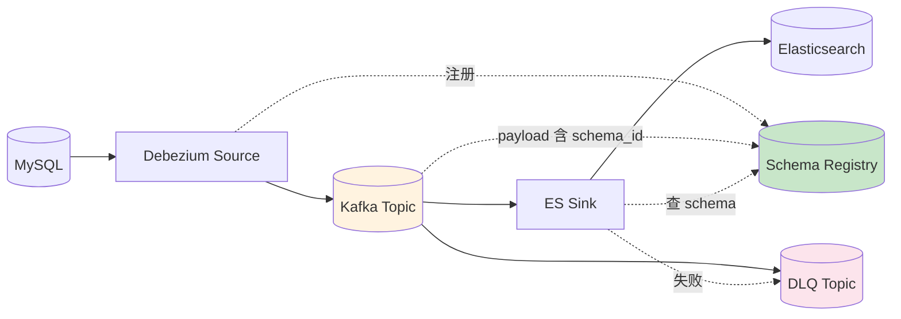

# 精通 Kafka Connect 与 Schema Registry：Source/Sink、Avro/Protobuf 与兼容性

> 关联章节：[K03 Producer](./03-精通-Producer.md)、[K09 Kafka Streams](./09-精通-Kafka-Streams.md)、[K12 生产运维](./12-精通-生产运维.md)

---

## 引言：连接 Kafka 与外部世界

业务里 Kafka 几乎从不是孤岛——它和 DB、对象存储、ES、Snowflake、Kafka 跨集群之间不停搬数据。如果用 producer/consumer API 手撸：

- 每个 source 写一遍消费、错误处理、重试、offset 管理
- 每个 sink 写一遍连接池、批量、幂等
- schema 变更一次跑遍全链路

**Kafka Connect** 解决这个问题：提供"标准化的 source / sink 框架 + 现成 connector 生态"。
**Schema Registry** 解决另一面：消息内容怎么演化不破坏既有消费方。

读完本章你应能：

- 区分 source / sink connector
- 部署 Connect cluster（standalone / distributed）
- 实现自定义 connector
- 选 Avro / Protobuf / JSON Schema
- 配 schema 兼容策略（backward / forward / full）
- 诊断 connector 卡住、schema 不兼容、DLQ 堆积

---

## 第一章：Kafka Connect 架构

### 1.1 角色

```
┌────────────────────────────────────────┐
│  Connect Worker（一个 JVM 进程）         │
│  ├── Connector（"连接定义"，无状态）     │
│  └── Task（实际工作单元）                │
└────────────────────────────────────────┘
       ↓ 一个 Source connector 例子
   MySQL CDC → Kafka topic "orders"

       ↓ 一个 Sink connector 例子
   Kafka topic "orders" → Snowflake
```

- **Worker**：一个进程，部署多个 connector 任务
- **Connector**：高层配置（连什么、写到哪），分配 task
- **Task**：实际处理工作（一个 task 处理一部分 partition）

### 1.2 Standalone vs Distributed

| 模式 | 部署 | 适用 |
|---|---|---|
| **standalone** | 单进程，配置文件 | 开发 / 单机 ETL |
| **distributed** | 多进程集群，REST API + 内部 topic | 生产 |

distributed 模式的内部 topic：

- `connect-configs`：connector 配置
- `connect-offsets`：source connector 的进度（不是 consumer offset）
- `connect-status`：connector 状态

这三个 topic 配 compact，存连接元数据。

### 1.3 启动

```bash
# distributed
connect-distributed.sh /etc/kafka/connect-distributed.properties
```

配置：

```properties
bootstrap.servers=:9092
group.id=connect-cluster
key.converter=io.confluent.connect.avro.AvroConverter
value.converter=io.confluent.connect.avro.AvroConverter
key.converter.schema.registry.url=http://schema-registry:8081
value.converter.schema.registry.url=http://schema-registry:8081
config.storage.topic=connect-configs
offset.storage.topic=connect-offsets
status.storage.topic=connect-status
plugin.path=/usr/share/connectors
```

### 1.4 REST API

```bash
# 列 connectors
curl :8083/connectors

# 创建一个
curl -X POST :8083/connectors -H "Content-Type: application/json" -d '{
  "name": "mysql-orders",
  "config": {
    "connector.class": "io.debezium.connector.mysql.MySqlConnector",
    "tasks.max": 3,
    "database.hostname": "mysql.internal",
    "topic.prefix": "mysql_orders",
    ...
  }
}'

# 查看状态
curl :8083/connectors/mysql-orders/status

# 重启
curl -X POST :8083/connectors/mysql-orders/restart
```

---

## 第二章：Source Connector

### 2.1 工作模式

```
External Source (DB / File / API)
    ↓ poll 拉取新数据
Task (Source Task)
    ↓ 转成 SourceRecord
Worker（产生 Kafka ProducerRecord）
    ↓
Kafka Topic
```

Source task 用一个内部 producer 写 Kafka。offset / 进度记在 `connect-offsets`。

### 2.2 主流 Source connector

| Connector | 用途 |
|---|---|
| **Debezium MySQL/Postgres/MongoDB/SQLServer** | CDC，行级变更流 |
| **JDBC Source** | 按时间戳 / ID 增量拉表 |
| **FileStream Source** | 读文件 tail |
| **MQTT Source** | IoT 消息 |
| **S3 Source** | 从 S3 对象拉 |

### 2.3 Debezium CDC 示例

最重要的 source 之一。原理：

```
MySQL → binlog
   ↓ Debezium 解析 binlog
   ↓ 每行变更转成 Kafka 消息
Kafka topic（前缀 + table 名）
```

配置要点：

```json
{
  "connector.class": "io.debezium.connector.mysql.MySqlConnector",
  "database.hostname": "mysql.internal",
  "database.port": 3306,
  "database.user": "debezium",
  "database.password": "...",
  "database.server.id": "184054",
  "database.allowPublicKeyRetrieval": "true",
  "topic.prefix": "mysql_app",
  "database.include.list": "appdb",
  "table.include.list": "appdb.orders,appdb.users",
  "schema.history.internal.kafka.bootstrap.servers": ":9092",
  "schema.history.internal.kafka.topic": "schemahistory.mysql_app"
}
```

- 每张表一个 topic：`mysql_app.appdb.orders`
- 每行变更产生一条消息（包含 before / after）
- 初始 snapshot + 增量 binlog 切换

### 2.4 Debezium 配合 Streams

经典 CDC 流：

```
MySQL → Debezium → Kafka topic
      ↓
Kafka Streams 把 before/after 转成 domain event
      ↓
Kafka topic "domain-events"
      ↓
下游应用消费
```

### 2.5 Source 的 EOS

Source connector 实现 EOS 较难——外部系统的事务边界与 Kafka 事务对齐复杂。

Kafka 3.3+ 引入 source connector 的 transactional support：

```properties
exactly.once.source.support=enabled
```

但需要 connector 实现支持事务边界（Debezium 已支持）。

---

## 第三章：Sink Connector

### 3.1 工作模式

```
Kafka Topic
    ↓ consumer 消费
Sink Task
    ↓ 调外部系统 API
External Sink (ES / Snowflake / S3 / DB)
```

sink 内部就是个 consumer。offset 用普通 consumer offset 机制。

### 3.2 主流 Sink connector

| Connector | 用途 |
|---|---|
| **Elasticsearch Sink** | 写 ES 索引 |
| **JDBC Sink** | 写 DB 表 |
| **S3 Sink** | 写 S3 对象（parquet/avro/json） |
| **Snowflake Sink** | 写 Snowflake |
| **BigQuery Sink** | 写 BQ |
| **MongoDB Sink** | 写 Mongo |
| **HTTP Sink** | 通用 HTTP webhook |

### 3.3 S3 Sink 示例

把 Kafka 消息按时间分桶写到 S3：

```json
{
  "connector.class": "io.confluent.connect.s3.S3SinkConnector",
  "tasks.max": 6,
  "topics": "events",
  "s3.bucket.name": "my-data-lake",
  "s3.region": "us-east-1",
  "format.class": "io.confluent.connect.s3.format.parquet.ParquetFormat",
  "partitioner.class": "io.confluent.connect.storage.partitioner.TimeBasedPartitioner",
  "partition.duration.ms": "3600000",
  "path.format": "year=YYYY/month=MM/day=dd/hour=HH",
  "flush.size": 100000,
  "rotate.interval.ms": 600000
}
```

输出：

```
s3://my-data-lake/topics/events/year=2026/month=05/day=13/hour=10/events+0+0000123456.parquet
```

按时间分桶、parquet 列式存储，下游 BI / Athena / Spark 直接查。

### 3.4 Sink 幂等性

外部系统**必须支持幂等写入**才能保证 EOS：

- ES：`_id` 用消息 key，覆盖式写
- JDBC：UPSERT 或 ON CONFLICT DO UPDATE
- S3：按 offset 命名文件，覆盖
- HTTP webhook：业务侧实现幂等

否则 sink 重启 / rebalance 时重复写。

### 3.5 Dead Letter Queue

处理失败的消息可以转 DLQ：

```properties
errors.tolerance=all
errors.deadletterqueue.topic.name=my-dlq
errors.deadletterqueue.topic.replication.factor=3
errors.log.enable=true
```

- 反序列化失败 / 转换失败 / 写 sink 失败的消息进 DLQ
- 不会阻塞主流
- 后续由人工 / 工具处理 DLQ

DLQ 是 Connect 生产化的关键能力。

---

## 第四章：Single Message Transform（SMT）

### 4.1 用途

Connect 自带轻量级 record 变换链：

```
SourceRecord 出 source
    ↓ SMT 1: ExtractField
    ↓ SMT 2: TimestampConverter
    ↓ SMT 3: SetSchemaMetadata
ProducerRecord 写 Kafka
```

### 4.2 内置 SMT

| SMT | 用途 |
|---|---|
| `ExtractField` | 提取嵌套字段 |
| `Flatten` | 嵌套对象铺平 |
| `Cast` | 类型转换 |
| `MaskField` | 脱敏（如手机号） |
| `RegexRouter` | 改 topic 名 |
| `TimestampConverter` | 时间格式 |
| `ReplaceField` | 字段重命名 / 删除 |
| `InsertField` | 加字段（如 lineage） |

### 4.3 用法

```json
"transforms": "rename,mask",
"transforms.rename.type": "org.apache.kafka.connect.transforms.ReplaceField$Value",
"transforms.rename.renames": "createdAt:created_at",
"transforms.mask.type": "org.apache.kafka.connect.transforms.MaskField$Value",
"transforms.mask.fields": "phone,email"
```

适合**简单变换**。复杂业务逻辑应该用 Kafka Streams / Flink，不要塞 SMT。

---

## 第五章：Schema Registry

### 5.1 解决什么问题

Kafka 把消息当字节数组——broker 不解析。但消费者必须知道字节是什么 schema 才能反序列化。

如果 producer 改了 schema（加字段、改字段类型）：

- 老 consumer 反序列化失败
- 数据丢失或卡在 DLQ

Schema Registry：

- 集中存所有消息的 schema
- 每条消息 payload 前面带 `schema_id`（4 字节）
- consumer 拿到 id 去 registry 查 schema
- 写入时校验新 schema 与历史的**兼容性**

### 5.2 工作流

```
Producer：
  send(record) → 找 schema → 没注册 → POST /subjects/foo-value/versions → schema_id
  payload = [magic_byte][schema_id][serialized data]
  
Consumer：
  recv(bytes) → 读 schema_id → GET /schemas/ids/{id} → schema
  deserialize(bytes, schema) → record
```

每个 topic 有 `<topic>-key` 和 `<topic>-value` 两个 subject。

### 5.3 三种序列化格式

| 格式 | 优势 | 劣势 |
|---|---|---|
| **Avro** | Schema 跟 record 分离、强 schema evolution 规则 | 工具链 Java/Confluent 强，其他语言一般 |
| **Protobuf** | 跨语言、Google 标准 | schema evolution 规则需要自己注意 |
| **JSON Schema** | 人类可读、灵活 | 性能差、type 弱 |

主流选 **Avro 或 Protobuf**。新项目趋势 Protobuf。

### 5.4 Avro schema 示例

```json
{
  "type": "record",
  "name": "Order",
  "namespace": "com.example",
  "fields": [
    {"name": "orderId", "type": "string"},
    {"name": "userId", "type": "long"},
    {"name": "amount", "type": "double"},
    {"name": "currency", "type": "string", "default": "USD"},
    {"name": "createdAt", "type": "long", "logicalType": "timestamp-millis"}
  ]
}
```

### 5.5 注册 schema

```bash
# 注册 schema
curl -X POST http://schema-registry:8081/subjects/orders-value/versions \
  -H "Content-Type: application/vnd.schemaregistry.v1+json" \
  -d '{"schema": "{\"type\":\"record\",...}"}'

# 查看
curl http://schema-registry:8081/subjects/orders-value/versions

# 拉某版本
curl http://schema-registry:8081/subjects/orders-value/versions/1
```

---

## 第六章：兼容性策略

### 6.1 五种兼容级别

| 级别 | 含义 |
|---|---|
| `BACKWARD` | 新 schema 能读老数据（**只能加可选字段 / 删字段**） |
| `BACKWARD_TRANSITIVE` | BACKWARD 但对所有历史版本 |
| `FORWARD` | 老 schema 能读新数据（**只能删字段 / 加可选字段**） |
| `FORWARD_TRANSITIVE` | FORWARD 对所有历史 |
| `FULL` | BACKWARD + FORWARD |
| `FULL_TRANSITIVE` | 最严格 |
| `NONE` | 不校验 |

默认 `BACKWARD`。

### 6.2 业务场景对应

| 场景 | 推荐 |
|---|---|
| consumer 升级早于 producer | FORWARD |
| producer 升级早于 consumer | BACKWARD（默认） |
| 不能控制顺序（独立部署） | FULL |
| 极保守 | FULL_TRANSITIVE |
| 一次性流 / 不需要演化 | NONE |

### 6.3 演化规则速查（Avro BACKWARD）

允许：
- 加字段**带 default**
- 删字段
- 字段重命名（用 alias）
- 字段类型扩展（int → long、null → 任意）

不允许：
- 加字段不带 default
- 删 default
- 字段类型缩小（long → int）
- 字段重命名不用 alias

### 6.4 设置兼容性

```bash
# 全局默认
curl -X PUT http://schema-registry:8081/config \
  -H "Content-Type: application/vnd.schemaregistry.v1+json" \
  -d '{"compatibility": "BACKWARD"}'

# 单 subject
curl -X PUT http://schema-registry:8081/config/orders-value \
  -H "Content-Type: application/vnd.schemaregistry.v1+json" \
  -d '{"compatibility": "FULL"}'
```

---

## 第七章：Connect + Schema Registry 配合

### 7.1 converter 配置

```properties
key.converter=io.confluent.connect.avro.AvroConverter
value.converter=io.confluent.connect.avro.AvroConverter
key.converter.schema.registry.url=http://schema-registry:8081
value.converter.schema.registry.url=http://schema-registry:8081
```

source connector：自动注册新 schema、payload 带 schema_id
sink connector：从 schema_id 反序列化、按 schema 写下游

### 7.2 Debezium + Schema Registry

Debezium 是天然 Avro 友好：

- 自动从 MySQL information_schema 推断 Avro schema
- 表结构变更（ALTER TABLE）→ 新 schema 自动注册（要 BACKWARD 兼容）

这是为什么 CDC 流推荐 Avro：表结构演化和 schema 演化天然对齐。

### 7.3 Schema Registry 的运维

- **HA 部署**：多副本，用 Kafka 内部 topic 存 schema（不依赖外部 DB）
- **备份**：内部 topic `_schemas` 像普通 Kafka topic 备份
- **多集群**：Confluent 提供 Schema Registry replicator

```
_schemas topic：
  key = (subject, version)
  value = schema JSON
```

---

## 第八章：典型故障

### 8.1 案例：connector 卡住不进度

**症状**：source connector status RUNNING，但 offset 不动。

**诊断**：

```bash
# 看 task 状态
curl :8083/connectors/mysql-orders/tasks/0/status

# 看 connect-offsets 中该 connector 的 offset
kafka-console-consumer.sh --bootstrap-server :9092 --topic connect-offsets --from-beginning --property print.key=true
```

**根因**：MySQL binlog 已经 purge 掉 connector 上次的 position。

**修复**：

- 重置 connector offsets（删除 connector + 重新 snapshot）
- 长期：MySQL binlog 保留期 > Connect downtime 容忍

### 8.2 案例：sink 写入失败堆积

**症状**：sink connector lag 越来越大，DLQ 也满。

**诊断**：

- 看 sink worker 日志
- 看下游系统（ES / Snowflake）健康

**根因**：下游 ES 集群 disk 满，所有写入失败。

**修复**：

- 修下游
- 期间 connector pause（不消费、不丢）
- 下游恢复后 resume

### 8.3 案例：schema 不兼容

**症状**：producer send 报：

```
RestClientException: Schema being registered is incompatible with an earlier schema
```

**根因**：

- 默认 BACKWARD 兼容
- 加了无 default 的字段
- 或改了字段类型

**修复**：

- 加 default 值
- 或临时降兼容（不推荐）
- 长期：CI 阶段校验 schema 兼容性

### 8.4 案例：CDC 表结构变更后 consumer 失败

**症状**：业务 ALTER TABLE 加列，consumer 部分反序列化失败。

**根因**：

- Debezium 自动注册新 schema 没问题
- 但老 consumer 拿不到新字段的 default 值就报错

**修复**：

- consumer 升 schema 客户端（自动处理 unknown fields）
- 或加 default 值
- 流程：先升消费方再升源（FORWARD 模式更适合这种）

### 8.5 案例：DLQ 越来越大

**症状**：连接器配了 DLQ，几天后 DLQ topic 几亿条。

**根因**：

- 错误是系统性的（非偶然）但 connector tolerate=all 还在跑
- 没人监控 DLQ

**修复**：

- DLQ 加告警（条数 / 增长率）
- 定期分析 DLQ 内容 → 修问题 → 重放
- 配 `errors.tolerance=none` 让系统性错误直接 fail（要看业务能否接受）

---

## 第九章：自定义 connector

### 9.1 何时自定义

社区 connector 不够用时：

- 私有协议
- 特殊数据源
- 业务自定义变换不能用 SMT

### 9.2 实现 source connector

继承两个类：

```java
public class MyConnector extends SourceConnector {
    @Override public Class<? extends Task> taskClass() { return MyTask.class; }
    @Override public List<Map<String,String>> taskConfigs(int maxTasks) { ... }
    // 启动 / 停止 / 配置
}

public class MyTask extends SourceTask {
    @Override public List<SourceRecord> poll() {
        // 从源拉数据，转 SourceRecord
        return records;
    }
    @Override public void commit() { /* 记 offset */ }
}
```

打 jar 放到 `plugin.path`，重启 Connect。

### 9.3 实现 sink connector

类似：

```java
public class MyTask extends SinkTask {
    @Override public void put(Collection<SinkRecord> records) {
        // 写到外部系统
    }
    @Override public void flush(Map<TopicPartition, OffsetAndMetadata> offsets) { ... }
}
```

---

## 第十章：监控

### 10.1 关键指标

```
# Connect worker
kafka.connect:type=connect-worker-metrics,name=connector-count
kafka.connect:type=connect-worker-metrics,name=task-count
kafka.connect:type=connect-worker-metrics,name=task-failed-count

# Source task
kafka.connect:type=source-task-metrics,name=source-record-poll-rate
kafka.connect:type=source-task-metrics,name=source-record-write-rate

# Sink task
kafka.connect:type=sink-task-metrics,name=sink-record-read-rate
kafka.connect:type=sink-task-metrics,name=sink-record-send-rate
kafka.connect:type=sink-task-metrics,name=offset-commit-completion-rate

# Schema Registry
schema.registry:type=jersey-metrics,name=request-rate
```

### 10.2 告警

| 告警 | 阈值 |
|---|---|
| task-failed-count | > 0 立刻 |
| source-record-poll-rate | 0 持续 5min |
| sink lag | > N（视业务） |
| DLQ 增长 | 大幅增长立刻 |

---

## 总结 · Connect + Schema Registry 一图



Connect 心法：

1. **不要自己 send/consume**——能用 connector 就用
2. **distributed 模式 + REST API** 是生产标配
3. **DLQ + 监控** 让失败可观测
4. **Schema Registry 是流式架构的中枢**——schema 演化能否安全决定整链路寿命
5. **BACKWARD 兼容是默认**，需要 FORWARD 看消费方升级节奏

---

## 练习题

1. Source connector 与 sink connector 的关键区别？
2. distributed 模式需要哪三个内部 topic？各自存什么？
3. Schema Registry 的 payload 格式是什么样？
4. BACKWARD 与 FORWARD 兼容的差别？业务上各自适合？
5. Avro / Protobuf / JSON Schema 怎么选？
6. SMT 适合做什么不适合做什么？
7. DLQ 的两个作用？为什么需要监控？
8. Debezium CDC + Avro 的天然契合点？
9. sink 写入失败该怎么处理？两个策略。
10. 一个 source connector RUNNING 但 offset 不进，怎么排查？

> 答案见 [QUIZ.md](./QUIZ.md)

---

> 📁 本文位于 `/data/workspace/dp4/kafka/10-精通-Connect-Schema-Registry.md`
> 🔁 反馈：起 Debezium + MySQL，改一行数据看 Kafka topic 出什么消息
