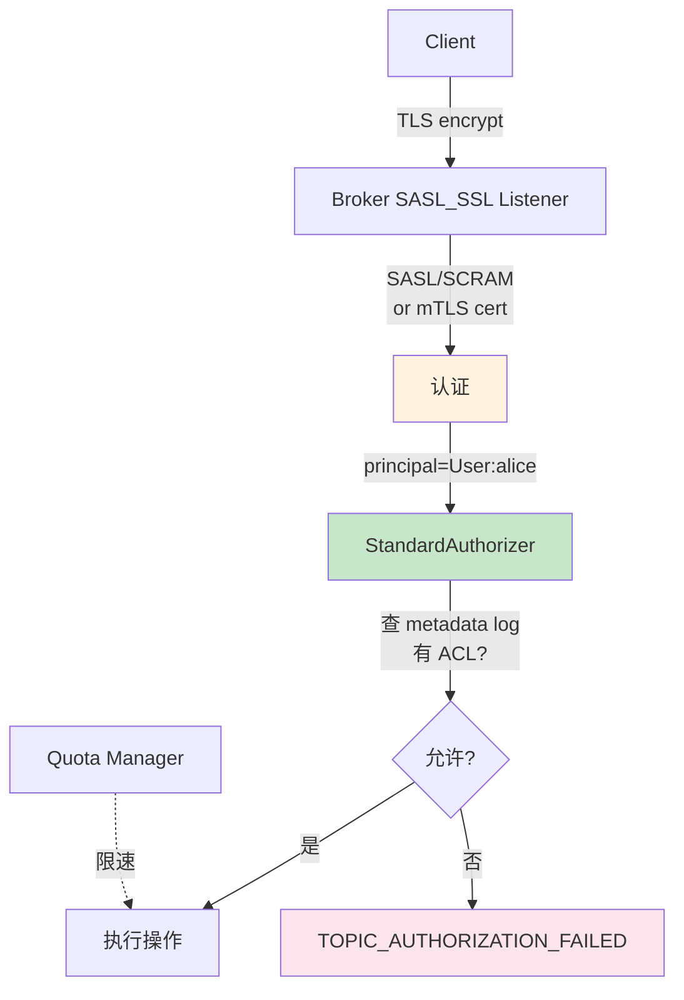

# 精通 Kafka 安全：SASL、mTLS、ACL 与 KRaft 时代的迁移

> 关联章节：[K02 KRaft](./02-精通-KRaft.md)、[K12 生产运维](./12-精通-生产运维.md)

---

## 引言：默认 Kafka 是裸奔的

新装 Kafka 默认：

- 监听 PLAINTEXT 协议
- 任何能连上 9092 的客户端能读写任何 topic
- 没有用户、没有授权

生产环境必须加：

- **认证（Authentication）**：你是谁
- **加密（Encryption）**：传输不可窃听
- **授权（Authorization）**：你能做什么

Kafka 提供的三个核心机制：

- **SASL** —— 认证（SCRAM / OAuth / Kerberos / PLAIN）
- **TLS** —— 加密 + 可做双向认证（mTLS）
- **ACL** —— 授权

读完本章你应能：

- 选 SASL/SCRAM、SASL/OAUTHBEARER、mTLS 的恰当组合
- 配置 listener 多协议同时跑（PLAINTEXT 内部 / SASL_SSL 客户端）
- 写 ACL 规则给 producer / consumer / connect
- 排查"客户端连不上 / 没权限"的常见问题
- 完成 ZK 时代到 KRaft 时代的 ACL 迁移

---

## 第一章：威胁模型

设计安全前先想"防什么"：

| 威胁 | 例子 | 对策 |
|---|---|---|
| 未授权访问 | 任何人 connect 就能读所有消息 | 认证 + 授权 |
| 网络窃听 | 内部交换机 / 公网传输被嗅 | TLS |
| 越权 | 用户能写不该写的 topic | ACL |
| 凭据泄露 | 密码 / SSL 私钥被偷 | 密钥轮换、HashiCorp Vault |
| Rogue Insider | 管理员看不该看的数据 | encryption-at-rest（应用层）+ 审计 |
| DoS | 一个客户端打爆集群 | quota |

不同公司威胁不同。先列出来再设计具体机制。

---

## 第二章：Listener 与 Protocol

### 2.1 Listener 配置

```properties
listeners=PLAINTEXT://:9092,SASL_SSL://:9093,SSL://:9094,SASL_PLAINTEXT://:9095
advertised.listeners=PLAINTEXT://broker1.internal:9092,SASL_SSL://broker1.public:9093

listener.security.protocol.map=PLAINTEXT:PLAINTEXT,SASL_SSL:SASL_SSL,SSL:SSL,SASL_PLAINTEXT:SASL_PLAINTEXT
inter.broker.listener.name=PLAINTEXT
```

可以同时跑多个 listener：

- 内部 broker 间用 PLAINTEXT（性能好、内网安全）
- 外部客户端用 SASL_SSL（强认证 + 加密）

### 2.2 四种协议组合

| Protocol | 认证 | 加密 |
|---|---|---|
| PLAINTEXT | 无 | 无 |
| SSL | mTLS（如果开 client auth） | TLS |
| SASL_PLAINTEXT | SASL | 无 |
| SASL_SSL | SASL | TLS |

**生产推荐 SASL_SSL**（外部）+ **PLAINTEXT**（内部，rack/网络隔离）。

### 2.3 inter.broker.listener

broker 间通信选哪个 listener？

```properties
inter.broker.listener.name=PLAINTEXT
```

- 内部 PLAINTEXT 性能最好（无 TLS 开销）
- 但要确保内部网络隔离
- 不放心：inter.broker 也用 SSL（CPU 占 5-15%）

---

## 第三章：SASL 认证

### 3.1 SASL 框架与机制

SASL（Simple Authentication and Security Layer）是认证框架，下面挂多种机制：

| 机制 | 凭证 | 适用 |
|---|---|---|
| `PLAIN` | username + password 明文 | **必须配 SSL**，否则裸奔 |
| `SCRAM-SHA-256` / `SCRAM-SHA-512` | username + password，hash 比对 | 通用、推荐 |
| `GSSAPI`（Kerberos） | KDC 颁发 ticket | 企业 AD 集成 |
| `OAUTHBEARER` | OAuth 2.0 JWT | 云原生、与 IDP 集成 |
| `DELEGATION_TOKEN` | 动态 token | 工作流（短期凭证） |

### 3.2 SCRAM 配置

最常用。SCRAM-SHA-512 比 SHA-256 慢但更安全。

```properties
# broker
listeners=SASL_SSL://:9093
sasl.enabled.mechanisms=SCRAM-SHA-512
sasl.mechanism.inter.broker.protocol=SCRAM-SHA-512
listener.name.sasl_ssl.scram-sha-512.sasl.jaas.config=org.apache.kafka.common.security.scram.ScramLoginModule required username="admin" password="adminpw";
```

创建用户：

```bash
kafka-configs.sh --bootstrap-server :9092 --alter \
  --add-config 'SCRAM-SHA-512=[password=mypass]' \
  --entity-type users --entity-name alice
```

**KRaft 时代**：SCRAM 凭证存在 metadata log 而不是 ZK znode。

客户端 JAAS：

```properties
security.protocol=SASL_SSL
sasl.mechanism=SCRAM-SHA-512
sasl.jaas.config=org.apache.kafka.common.security.scram.ScramLoginModule required \
  username="alice" \
  password="mypass";
```

### 3.3 OAUTHBEARER

Kafka 2.0+ 支持 OAuth 2.0：

```properties
sasl.mechanism=OAUTHBEARER
sasl.login.callback.handler.class=com.example.OAuthCallbackHandler
sasl.jaas.config=org.apache.kafka.common.security.oauthbearer.OAuthBearerLoginModule required \
  unsecuredLoginStringClaim_sub="alice";  # 测试用
```

生产配 IDP（Auth0 / Okta / Keycloak）发的 JWT。优势：

- 与公司 SSO 整合
- token 短期 + 刷新机制
- 可携带 claim（如 role）做授权

### 3.4 Kerberos

企业 AD 用：

```properties
sasl.mechanism=GSSAPI
sasl.kerberos.service.name=kafka
sasl.jaas.config=com.sun.security.auth.module.Krb5LoginModule required \
  useKeyTab=true \
  keyTab="/etc/security/kafka.keytab" \
  principal="kafka/broker1@EXAMPLE.COM";
```

Kerberos 复杂、对运维要求高，多见于传统 enterprise。

### 3.5 PLAIN（注意危险）

明文密码：

```properties
sasl.mechanism=PLAIN
sasl.jaas.config=org.apache.kafka.common.security.plain.PlainLoginModule required \
  username="alice" \
  password="mypass";
```

**必须配 SASL_SSL**（TLS 加密），否则裸奔。

经常用于："简单认证场景 + TLS 通道"。

---

## 第四章：TLS 与 mTLS

### 4.1 单向 TLS（仅 broker 出示证书）

```properties
listeners=SSL://:9093
ssl.keystore.location=/etc/kafka/keystore.jks
ssl.keystore.password=...
ssl.key.password=...
```

客户端验证 broker 身份。**不验证客户端**。

适合：

- TLS 用作加密（认证靠 SASL 另外做）
- 客户端是公网访问场景

### 4.2 双向 TLS（mTLS）

```properties
ssl.client.auth=required   # 强制客户端也出示证书
ssl.truststore.location=/etc/kafka/truststore.jks
ssl.truststore.password=...
```

客户端必须出示证书 → broker 验证签名 → 通过后建立连接。

**证书的 CN 或 SAN 自动成为 principal**（用户身份）：

```
证书 CN=alice → principal=User:alice
```

ACL 可直接用这个 principal 授权。

### 4.3 mTLS vs SASL/SCRAM

| 维度 | mTLS | SASL/SCRAM |
|---|---|---|
| 凭证 | 证书（X.509） | 用户名密码 |
| 轮换 | 重发证书（复杂） | 改密码（简单） |
| 失效 | 证书过期（年级） | 立即生效 |
| 性能 | TLS 握手开销 | 一次 |
| 集成 | PKI 体系 | KDC / DB / OAuth |
| 适合 | 服务对服务 | 用户对集群 |

实战常见组合：

- **broker 间**：mTLS（双向证书互信）
- **服务客户端 → broker**：mTLS 或 SASL/SCRAM
- **人类 / kafkactl**：SASL/SCRAM 或 OAUTHBEARER

### 4.4 证书生成示例

```bash
# 1. 生成 CA
openssl req -new -x509 -keyout ca-key -out ca-cert -days 365 -subj "/CN=KafkaCA"

# 2. broker 私钥 + CSR
keytool -genkey -keyalg RSA -keysize 2048 -keystore broker1.jks -alias broker1 -dname "CN=broker1.internal" -storepass ... -keypass ...
keytool -certreq -alias broker1 -keystore broker1.jks -file broker1.csr -storepass ...

# 3. CA 签证书
openssl x509 -req -CA ca-cert -CAkey ca-key -in broker1.csr -out broker1.crt -days 365 -CAcreateserial

# 4. 导入证书链
keytool -importcert -alias CARoot -file ca-cert -keystore broker1.jks -storepass ... -noprompt
keytool -importcert -alias broker1 -file broker1.crt -keystore broker1.jks -storepass ...

# 5. truststore（broker 信任 CA）
keytool -importcert -alias CARoot -file ca-cert -keystore truststore.jks -storepass ... -noprompt
```

生产用证书管理工具（cert-manager / Vault PKI）自动化。

---

## 第五章：ACL 授权

### 5.1 ACL 模型

```
Principal can / cannot perform Operation on Resource [from Host]
```

例：

```
User:alice can READ TOPIC orders from 10.0.0.0/8
User:bob can WRITE TOPIC events
Group:eng can DESCRIBE CLUSTER
```

### 5.2 Resource 类型

| 类型 | 例子 |
|---|---|
| `TOPIC` | "orders"、"events.*"、"*" |
| `GROUP` | "consumer-group-1" |
| `CLUSTER` | "kafka-cluster"（只有一个） |
| `TRANSACTIONAL_ID` | "tx-1" |
| `DELEGATION_TOKEN` | token id |

支持通配符：`orders.*` 匹配 `orders.created` `orders.paid` 等。

### 5.3 Operation 类型

| Operation | 适用 |
|---|---|
| READ | 消费、describe topic 等 |
| WRITE | produce |
| CREATE | 创建 topic |
| DELETE | 删 topic |
| ALTER | 修改 topic 配置 |
| DESCRIBE | 看 metadata |
| ClusterAction | 集群管理操作（broker 注册等） |
| ALL | 所有操作 |

### 5.4 Authorizer 配置

```properties
authorizer.class.name=org.apache.kafka.metadata.authorizer.StandardAuthorizer   # KRaft 时代
# ZK 时代：kafka.security.authorizer.AclAuthorizer

# 超级用户（绕过 ACL）
super.users=User:admin;User:CN=kafka-broker

# 默认对未授权操作的行为
allow.everyone.if.no.acl.found=false   # 默认 false，严格
```

`allow.everyone.if.no.acl.found=true` 在迁移期临时打开（兼容旧客户端）。

### 5.5 添加 ACL

```bash
# Producer 权限
kafka-acls.sh --bootstrap-server :9092 \
  --add --allow-principal User:alice --producer --topic orders

# Consumer 权限
kafka-acls.sh --bootstrap-server :9092 \
  --add --allow-principal User:bob --consumer --topic orders --group billing

# 通配符 topic
kafka-acls.sh --bootstrap-server :9092 \
  --add --allow-principal User:logs --operation WRITE \
  --resource-pattern-type prefixed --topic logs.

# 从特定 IP
kafka-acls.sh --bootstrap-server :9092 \
  --add --allow-principal User:alice --operation READ --topic orders \
  --allow-host 10.0.0.5
```

`--producer` / `--consumer` 是 shortcut，会自动加 WRITE/READ + DESCRIBE 等需要的权限。

### 5.6 ACL 存哪

| 模式 | 存储 |
|---|---|
| ZK 时代 | ZK znode `/kafka-acl` |
| KRaft 时代 | metadata log（AccessControlEntryRecord） |

KRaft 时代 ACL 变更通过 KRaft 复制，比 ZK watch 快。

---

## 第六章：Quota

### 6.1 什么是 Quota

防止单个客户端打爆集群：

- 单 client 的产生速率（producer byte rate）
- 单 client 的消费速率（consumer byte rate）
- 单 client 的请求速率（request rate %）

### 6.2 配置

```bash
# 对 user/client-id 设 quota
kafka-configs.sh --bootstrap-server :9092 --alter \
  --add-config 'producer_byte_rate=10485760,consumer_byte_rate=10485760' \
  --entity-type users --entity-name alice

# 默认 quota
kafka-configs.sh --bootstrap-server :9092 --alter \
  --add-config 'producer_byte_rate=1048576' \
  --entity-type users --entity-default
```

超出 quota 时 broker **延迟响应**（不是拒绝），让客户端自然降速。

### 6.3 监控 throttle

```
kafka.server:type=Produce,name=throttle-time-ms
kafka.server:type=Fetch,name=throttle-time-ms
```

throttle-time > 0 → 客户端被限速。

---

## 第七章：审计

Kafka（截至 4.3.x）没有内置审计 log，但可以：

### 7.1 Authorizer 日志

```properties
log4j.logger.kafka.authorizer.logger=INFO,authorizerAppender
log4j.additivity.kafka.authorizer.logger=false
```

记录每次授权决定（DENY 或不常见 ALLOW）。

### 7.2 OpenTelemetry / 商业方案

- Confluent Audit Logs（商业）
- 自己写 AuthorizationCallback 推到 SIEM

---

## 第八章：迁移与升级

### 8.1 PLAINTEXT → SASL_SSL 零停机

```
1. broker 开启同时监听 PLAINTEXT(9092) + SASL_SSL(9093)
2. 部分客户端切到 9093（双向兼容期）
3. 测试新连接全部正常
4. 全部客户端切到 9093
5. broker 移除 PLAINTEXT listener（重启）
```

### 8.2 ZK ACL → KRaft ACL

如果你在做 ZK→KRaft 迁移（K02），ACL 也要迁：

- bridge 模式自动同步 ZK ACL 到 KRaft（双写）
- 验证全 ACL 都迁过去（用 `kafka-acls.sh --list`）
- 切完后 ZK 上的 ACL 不再权威

### 8.3 SCRAM 密码轮换

```bash
# 1. 加新密码（保留老密码生效）
kafka-configs.sh --alter --add-config 'SCRAM-SHA-512=[iterations=8192,password=newpass]' --entity-type users --entity-name alice

# 2. 客户端逐个切换到新密码

# 3. 移除老密码
kafka-configs.sh --alter --delete-config 'SCRAM-SHA-512' --entity-type users --entity-name alice
```

### 8.4 证书过期

证书是定时炸弹。每年到期前：

1. 监控证书过期（exporter / Prometheus）
2. 提前 30 天告警
3. 滚动重发证书（cert-manager 可自动）
4. 测试 mTLS 连接

---

## 第九章：典型故障

### 9.1 案例：客户端报 Authentication failed

**症状**：

```
SaslAuthenticationException: Authentication failed: Invalid username or password
```

**诊断**：

- 用户名 / 密码错？
- 用户是否存在？`kafka-configs.sh --describe --entity-type users`
- 客户端 sasl.mechanism 与 broker 是否一致？

**修复**：根据具体错误。

### 9.2 案例：TOPIC_AUTHORIZATION_FAILED

**症状**：consumer 报 `Not authorized to access topics: [orders]`。

**诊断**：

```bash
kafka-acls.sh --list --principal User:bob
# 看 bob 有没有 READ orders 权限
```

**根因**：ACL 没配 / 配错了 topic / 配错了 group。

**修复**：补 ACL。

### 9.3 案例：connector 突然失败 TLS handshake

**症状**：connector 跑了几个月突然 SSL handshake exception。

**根因**：broker 证书过期。

**修复**：

- 紧急更新证书
- 长期：监控证书剩余有效期，自动告警

### 9.4 案例：开 SSL 后 CPU 飙升

**症状**：从 PLAINTEXT 切到 SSL 后 broker CPU 涨 30%。

**根因**：TLS 加密 / 解密占 CPU，加上软件实现的 SSL（无硬件加速）。

**修复**：

- 用支持 AES-NI 的 CPU（现代 CPU 几乎都有）
- 调整 cipher 优先级（GCM 模式比 CBC 快）
- 加 broker 节点分摊
- 内部通信走 PLAINTEXT（如果网络隔离）

### 9.5 案例：旧客户端连不上 KRaft 集群

**症状**：升级到 4.0 KRaft 后，一些老 Kafka 客户端报错。

**根因**：

- 客户端版本太老（< 2.6），不满足 KRaft 集群要求的新 protocol / API 版本
- SASL 机制配置变了

**修复**：

- 升客户端到 3.x+
- 或保留一个兼容 listener（bridge）

---

## 第十章：安全检查清单

### 10.1 broker 侧

- [ ] 没有 PLAINTEXT listener 暴露公网
- [ ] inter.broker 也加密（或网络严格隔离）
- [ ] super.users 列表清楚明确
- [ ] allow.everyone.if.no.acl.found=false
- [ ] 证书自动轮换（cert-manager）
- [ ] keystore 密码不写在 server.properties 明文（用 vault）

### 10.2 客户端侧

- [ ] 凭证存 secret manager（不在代码 / 配置文件）
- [ ] truststore 信任的 CA 范围最小
- [ ] 应用日志不打印 password
- [ ] OAuth token 刷新机制可靠

### 10.3 运维

- [ ] ACL review 定期（半年一次）
- [ ] 老用户清理（前员工凭证收回）
- [ ] 审计日志保留 90+ 天
- [ ] 应急预案（凭证泄露怎么办）

---

## 总结 · 安全一图



安全心法：

1. **永远不要 PLAINTEXT 上公网**
2. **SASL_SSL 是甜区**：SASL 认证 + TLS 加密
3. **mTLS 适合服务对服务，SCRAM 适合人 / 客户端**
4. **ACL 最小授权原则**：能给"该 user / 该 topic / 该 group"就不要 *
5. **证书过期是定时炸弹**——自动化

---

## 练习题

1. SASL_PLAIN 与 SASL_SSL 的差别？前者什么时候能用？
2. mTLS 与 SASL/SCRAM 各自适合什么场景？
3. allow.everyone.if.no.acl.found 设 true / false 的取舍？
4. 一个 producer 用 transactional.id，需要哪些 ACL？
5. quota 超过时 broker 是拒绝还是限速？
6. inter.broker 用 PLAINTEXT 安全吗？
7. 证书过期前没轮换会怎样？怎么预防？
8. KRaft 时代 ACL 存哪？比 ZK 时代有什么改善？
9. SCRAM-SHA-512 与 SCRAM-SHA-256 的取舍？
10. OAUTHBEARER 与 SCRAM 的对比？

> 答案见 [QUIZ.md](./QUIZ.md)

---

> 🔁 反馈：起一个 SASL_SSL 集群，用 kafkactl 配置不同身份测 ACL
