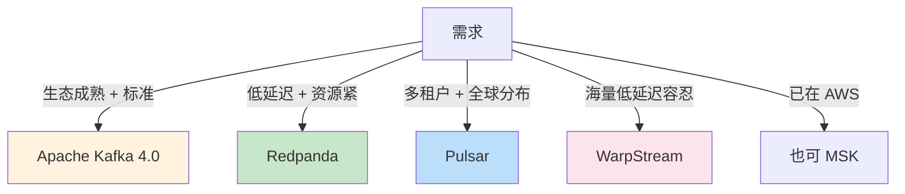
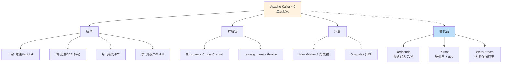

# 精通 Kafka 生产运维 + 现代替代品：Redpanda、Pulsar、WarpStream

> 关联章节：[K02 KRaft](./02-精通-KRaft.md)、[K08 性能调优](./08-精通-性能调优.md)、[K11 安全](./11-精通-Kafka-安全.md)

---

## 引言：把 Kafka 真正跑到生产

前面 11 章覆盖了 Kafka 的"是什么 / 怎么用 / 怎么调"。这章是收官，讲：

1. **生产运维**：日常巡检、容量规划、扩缩容、灾备
2. **现代替代品**：Redpanda、Pulsar、WarpStream 在什么场景胜过 Kafka

读完本章你应能：

- 制定 Kafka 集群的日常 / 月度 / 季度运维清单
- 扩容、缩容、滚动升级而不影响业务
- 设计灾难恢复（DR）方案
- 评估 Redpanda / Pulsar / WarpStream 是否更适合你的场景

---

## 第一章：日常巡检清单

### 1.1 每日检查（5 分钟）

```bash
# 1. 集群健康
kafka-metadata-quorum.sh --bootstrap-server :9092 describe --status
# 看 ActiveControllerCount=1（正常）

# 2. Under-replicated partitions
kafka-topics.sh --bootstrap-server :9092 --describe --under-replicated-partitions

# 3. 节点存活
kafka-broker-api-versions.sh --bootstrap-server :9092 | grep -c "ApiVersionsResponse"
# 应等于 broker 总数

# 4. consumer lag 全局
kafka-consumer-groups.sh --bootstrap-server :9092 --all-groups --describe | awk '$5 > 10000' | head
```

### 1.2 每周深度

- disk 使用趋势 → 提前 30 天预测满
- top heavy partition：是否单点
- ISR 抖动频率：网络 / 磁盘问题征兆
- TLS 证书有效期（< 60 天告警）
- consumer lag 长期趋势

### 1.3 每月

- broker 资源使用率分布（CPU / 网卡 / 磁盘）
- topic 大小排行 → 退休没用 topic
- ACL review：删过期用户
- 关键 KIP 更新跟踪

### 1.4 每季度

- 升级评估（小版本至少一次）
- DR drill：模拟一个机房挂
- 性能基线测试
- 容量规划 review

---

## 第二章：容量规划

### 2.1 三维度容量

| 维度 | 限制 |
|---|---|
| **磁盘** | 数据保留 × 副本数 |
| **网络** | producer + consumer + 复制 |
| **CPU/内存** | broker + 客户端连接数 |

### 2.2 磁盘估算

```
单 broker 容量 = (业务写入速率 × retention × replication_factor) / broker 数

例：1 MB/s × 86400 × 7 天 × 3 副本 / 6 broker = 302 GB / broker
留 30% buffer → 实际 ~400 GB / broker
```

### 2.3 网络估算

```
单 broker 出入：
  入：业务写入 / broker 数 + 复制流量（其他 broker fetch 它的 leader）
  出：consumer 拉 + 复制流量（它 fetch 其他 broker 的 leader）

近似：业务 R MB/s + 副本 (RF-1) × R / N MB/s
对 1 GB/s 业务、3 副本、6 broker：
  单 broker 进 167 MB/s + 出 333 MB/s（4 Gbps）
  → 10 Gbps 网卡足够
```

### 2.4 broker 数

- 起步：3（最小高可用）
- 中型业务：6-12
- 大型：30+
- 巨型（LinkedIn / Uber）：数百

**经验**：单 broker < 4000 partition，超过分多 broker。

### 2.5 容量监控

```
kafka.log:type=LogSize,name=Size  # 每 partition 大小
kafka.server:type=BrokerTopicMetrics,name=BytesInPerSec   # 入流量
kafka.server:type=BrokerTopicMetrics,name=BytesOutPerSec
```

Prometheus + Grafana 看一周 / 一月 / 一季趋势。

---

## 第三章：扩容

### 3.1 加 Broker

```bash
# 1. 新 broker 准备 server.properties，加入集群
kafka-storage.sh format --config server.properties --cluster-id <existing>

# 2. 启动
kafka-server-start.sh server.properties

# 3. 新 broker 加入但不接 partition（除非新 topic）
# 需要 reassignment 把已有 partition 部分迁过去

# 4. 生成 reassignment plan
kafka-reassign-partitions.sh --bootstrap-server :9092 \
  --topics-to-move-json-file topics.json --broker-list "1,2,3,4,5,6,7" --generate

# 5. 执行
kafka-reassign-partitions.sh --bootstrap-server :9092 \
  --reassignment-json-file plan.json --execute --throttle 50000000  # 50 MB/s

# 6. 验证
kafka-reassign-partitions.sh --bootstrap-server :9092 \
  --reassignment-json-file plan.json --verify
```

注意：

- 用 throttle 防止复制流量打满网卡
- 业务低峰期执行
- 大集群可能要几小时到几天

### 3.2 加 Partition

只能加，不能减：

```bash
kafka-topics.sh --bootstrap-server :9092 --alter --topic orders --partitions 12
```

注意：

- 加 partition 后 key 的路由变（hash % new_count）
- **破坏顺序**：相同 key 可能从分配到原 partition 改到新 partition
- 已有数据不重分布

如果业务依赖 key 顺序，加 partition 是 breaking change。需要：

- 新建 topic（更多 partition）
- 双写
- 切换 consumer
- 下线旧 topic

### 3.3 Cruise Control

LinkedIn 开源的自动 balancer：

- 自动监控集群负载
- 生成 reassignment plan（考虑 CPU / 磁盘 / 网络多维）
- throttle 控制迁移影响

生产推荐用 Cruise Control 而不是手动 reassign。

---

## 第四章：缩容

比扩容危险，要小心。

### 4.1 移走 broker 的 partition

```bash
# 1. 找出 broker N 上有什么 partition
kafka-topics.sh --bootstrap-server :9092 --describe | grep "Leader: N\| N,\| N$"

# 2. 生成 reassignment 把 broker N 移出（broker-list 不含 N）
kafka-reassign-partitions.sh ... --generate --broker-list "1,2,3,4,5" --topics-to-move-json-file all-topics.json

# 3. 执行 + verify

# 4. 验证 broker N 上没有任何 partition
kafka-topics.sh ... --describe | grep -E "(Leader: N|Replicas:.*\bN\b)"
# 应该没输出

# 5. 关 broker N
```

### 4.2 删 broker

确认上一步全部 partition 移走后才能删。

KRaft 时代还需要：

```bash
# 注销 broker（从 metadata 中移除）
kafka-cluster.sh --bootstrap-server :9092 unregister --id N
```

### 4.3 注意事项

- **绝不能直接关 broker 然后清磁盘**，会丢数据
- 副本要先重建到其他节点
- 验证 under-replicated = 0 再关

---

## 第五章：滚动升级

### 5.1 升级前

- 看 release notes 对应版本（特别是 breaking changes）
- 测试集群升一遍，跑业务负载 24 小时
- 备份 metadata（_cluster_metadata snapshot）
- 准备回滚预案

### 5.2 升级步骤（KRaft 时代）

```bash
# 1. 升级 controller quorum（一个一个）
for ctrl in c1 c2 c3; do
    ssh $ctrl "systemctl stop kafka && wait_for_leader_switch && upgrade && systemctl start kafka"
    wait_for_quorum_healthy
done

# 2. 升级 broker（滚动，一个一个）
for broker in b1 b2 b3 b4 b5; do
    ssh $broker "systemctl stop kafka"
    wait_for_partition_recovery   # 等 ISR 重新建立
    ssh $broker "upgrade_binary && systemctl start kafka"
    wait_for_broker_online
done

# 3. 升级客户端（应用滚动重启）
```

### 5.3 升级期间的 inter.broker.protocol.version

老配置：

```properties
inter.broker.protocol.version=3.7
```

不要急着切到新版本——先让所有 broker 都升上来再切：

1. 全 broker 升级到 4.0 二进制（仍宣称 3.7 协议）
2. 一个个 broker 改 inter.broker.protocol.version=4.0 重启
3. 完成

防止"升级一半时新 broker 用新协议老 broker 看不懂"。

### 5.4 验证

- 业务侧无报错
- consumer lag 正常
- under-replicated = 0
- 关键查询正常

---

## 第六章：灾难恢复

### 6.1 三个层级

| 级别 | 故障 | 对策 |
|---|---|---|
| L1 | 单节点挂 | 副本机制（自动恢复） |
| L2 | 单 rack / AZ 挂 | rack-aware 副本（自动） |
| L3 | 整 region 挂 | 跨集群复制（CCR / MirrorMaker） |

### 6.2 MirrorMaker 2

Kafka 内置的跨集群复制工具，基于 Connect 框架。

```properties
# mm2.properties
clusters=primary, dr
primary.bootstrap.servers=:9092
dr.bootstrap.servers=:9092

primary->dr.enabled=true
primary->dr.topics=.*
primary->dr.groups=.*

replication.policy.class=org.apache.kafka.connect.mirror.IdentityReplicationPolicy
# 默认会给 topic 加前缀（"primary.orders"），用 Identity 保持原名
```

启动：

```bash
connect-mirror-maker.sh mm2.properties
```

### 6.3 主备 vs 双活

| 模式 | 含义 |
|---|---|
| **主备**（active-passive） | 平时写主集群，DR 集群只复制；故障时切到 DR |
| **双活**（active-active） | 两集群都接业务，互相复制 |

双活复杂（要解决 echo 问题——A 的消息复制到 B，又被复制回 A），通常配 IdentityReplicationPolicy + 应用层标识来源集群。

### 6.4 RPO / RTO

- **RPO**（Recovery Point Objective）：可以容忍丢多少数据
- **RTO**（Recovery Time Objective）：多久内恢复

MirrorMaker 异步复制：RPO 取决于复制延迟（通常秒级）。

跨集群严格 EOS 不能保证——切换时可能有重复或丢失。设计上要容忍。

### 6.5 备份策略

正经做法：

- 跨集群复制（MirrorMaker）做近线 DR
- 关键 topic 定期 dump 到对象存储做长期归档
- consumer offsets 跨集群同步（MirrorMaker 自动）

不要：

- 把 broker 数据目录 rsync 到另一台（不一致风险）
- 直接复制 segment 文件（offset 关系会乱）

---

## 第七章：现代替代品

Kafka 不是唯一选择。2025-2026 主流替代品：

### 7.1 Redpanda

- 用 **C++** 重写（不依赖 JVM）
- 单进程二进制
- 完全 Kafka API 兼容（client 不需改）
- 每个 partition 独立 Raft（不是用 ISR）
- thread-per-core 架构

优势：

- 启动快、内存占用小
- 低延迟（无 GC）
- 部署简单（一个二进制）
- 高吞吐（同样硬件比 Kafka 快 2-6×）

劣势：

- 生态不如 Kafka 全（Connect、Streams 兼容性需验证）
- 商业支持 by Redpanda Data 较年轻
- per-partition Raft 在大量小 partition 时元数据开销

适合：

- 不想跑 JVM
- 极低延迟（金融）
- 边缘 / IoT 部署（资源紧）

### 7.2 Apache Pulsar

- Yahoo 开源（2016）
- broker 无状态 + **BookKeeper**（独立的分布式日志层）
- 多租户原生支持
- 地理复制（geo-replication）内置
- 函数计算（Pulsar Functions）

架构：

```
Producer → Broker（无状态路由）→ BookKeeper（持久化）
```

优势：

- broker / 存储分离 → 各自独立扩
- 多租户隔离强
- 跨 region 复制成熟
- 既支持 streaming（Kafka 类）也支持 queuing（RabbitMQ 类）

劣势：

- 复杂度高（多组件：broker、bookies、ZK）
- 生态比 Kafka 小
- 性能在某些场景不如 Kafka

适合：

- SaaS 多租户
- 全球分布的多 region
- 既要队列又要 streaming

### 7.3 WarpStream

- 完全云原生：**broker 无状态 + 对象存储**（S3 / GCS / Azure Blob）
- Kafka API 兼容
- 没有本地磁盘，没有 broker 间复制

架构：

```
Producer → WarpStream Agent → S3
Consumer ← WarpStream Agent ← S3
```

每个 Agent 是无状态进程，数据全在 S3。

优势：

- 极低存储成本（S3 比 NVMe 便宜 10-50×）
- 无需 partition reassignment、broker 扩容只是加 Agent
- 跨 AZ 没有复制流量（S3 跨 AZ 同步）

劣势：

- 延迟高（写 S3 几百 ms 起步，比 Kafka 慢 10-100×）
- 不适合实时场景
- 商业产品（不是开源）

适合：

- 日志归档
- 极大数据量低延迟要求不高
- 想省存储钱

### 7.4 选型决策



### 7.5 现实评估

| 场景 | 数量级用户 | 现实建议 |
|---|---|---|
| 通用 streaming | 90% | Kafka 4.0 |
| 极低延迟 | 5% | Redpanda 值得评估 |
| 全球多租户 SaaS | 3% | Pulsar 优势明显 |
| 海量冷数据 | 2% | WarpStream / Kafka + Tiered |

**Kafka 仍是默认选择**——除非你有强烈的特定需求。生态成熟、文档丰富、社区活跃、运维知识传承容易。

---

## 第八章：常见故障案例（综合）

### 8.1 案例：周日凌晨全集群挂

**症状**：监控全红，所有 broker 离线。

**诊断**：

- 看监控时间线：是不是同一时刻全挂？
- broker 日志：`Caused by ...`

**根因**：3 个 controller 同时升级（错误的脚本），quorum 失联，broker 看不到 leader 自停。

**修复**：

- 一个一个恢复 controller
- 滚动重启 broker
- 总结：升级脚本必须 wait_for_quorum_healthy 才往下走

### 8.2 案例：consumer 几小时不进度

**症状**：lag 累积几亿条。

**诊断**：consumer 实际在 running，但 process 一条要 30 秒。

**根因**：业务侧加了一个调外部 API 的步骤，外部 API 慢。

**修复**：

- 业务侧加 timeout + circuit breaker
- 异步处理（poll → 入队 → 工作线程）
- 临时：跳过这批数据（如果业务能容忍）

### 8.3 案例：磁盘满，触发只读

**症状**：所有 producer 报 NotEnoughReplicasException，broker 日志 `disk full`。

**修复**：

- 临时调小某个 topic retention 加快清理
- 紧急加盘
- 长期：监控告警提前（70%）+ ILM 自动清理

### 8.4 案例：升级 4.0 后旧 KSQL 连不上

**症状**：升 Kafka broker 到 4.0 后，KSQL 报兼容错。

**根因**：ZK 完全移除，KSQL 旧版本依赖某些 ZK 内部 API。

**修复**：升 KSQL 到兼容版本。

教训：**全栈升级要一起规划**。

### 8.5 案例：CCR 复制延迟越来越大

**症状**：DR 集群滞后主集群 30 分钟，越来越大。

**诊断**：

- DR 集群 broker CPU 100%
- 单个 partition 写入热点

**根因**：MirrorMaker 用单个 task 处理超大 topic。

**修复**：

- `tasks.max` 调大让 MM 内部并行
- DR 集群加 broker
- 长期：评估是否真需要 CCR（成本高）

---

## 第九章：运维工具箱

### 9.1 必装

| 工具 | 用途 |
|---|---|
| `kafka-*.sh`（自带） | 基础操作 |
| **Prometheus + JMX Exporter** | 监控 |
| **Grafana**（含 Kafka dashboards） | 可视化 |
| **Cruise Control** | 自动 balance |
| **Burrow** | consumer lag 专用 |
| **kafkactl / kcat (kafkacat)** | 现代 CLI |
| **Kafka UI / AKHQ / Conduktor** | 界面查看 |

### 9.2 推荐脚本

每个团队都该有：

- 健康检查脚本（一键看集群状态）
- 容量规划脚本（趋势预测）
- 紧急扩容脚本（加 broker 自动 join）
- DR 演练脚本（定期跑确认 DR 集群可用）

### 9.3 监控 dashboard 模板

至少包含：

- 集群健康（controller / under-replicated / unjoined）
- 吞吐（每 broker 入 / 出）
- 延迟（produce / fetch P99）
- 资源（CPU / 磁盘 / 网络）
- consumer lag（按 group / topic）
- 错误率（rejected / failed）

---

## 第十章：未来展望

### 10.1 Kafka 路线（2026-2027）

- **KIP-848 全面普及**：Consumer 不再 stop-the-world
- **Queue 语义增强（KIP-932）**：原生支持队列模式（per-message ack）
- **Tiered storage 成熟**：所有云存储支持
- **更轻量 broker**：减少 JVM 依赖、提高启动速度

### 10.2 流处理生态

- **Flink + Kafka** 仍是 dominant
- **Materialize / RisingWave** SQL 流数据库继续蚕食 BI 场景
- **Apache Iceberg + Kafka**：流处理结果直接落 Iceberg 表

### 10.3 挑战 Kafka 的趋势

- **对象存储优先**：WarpStream、Buf 等"S3 first"系统
- **per-partition Raft**：Redpanda 验证可行性
- **Serverless Kafka**：Confluent Cloud、AWS MSK Serverless、Upstash

### 10.4 学习建议

- 跟 KIP 列表（每月浏览新增）
- Confluent 博客 + Conduktor 博客 + Redpanda 博客 三家轮流看
- 重要会议：Kafka Summit、Current（前 Kafka Summit）

---

## 总结 · 运维与替代品一图



运维心法：

1. **可观测性优先**——没监控就没运维
2. **自动化重于英雄主义**——脚本 / 工具 > 人脑记忆
3. **容量提前 30 天告警**——救火远比预防贵
4. **定期 DR 演练**——不练就是没有
5. **替代品有用但不要盲跟**——Kafka 仍是 90% 场景的最优解

---

## 练习题

1. 日常巡检要看哪 5 个核心指标？
2. 扩容时用 throttle 的原因？数值怎么选？
3. partition 数加倍对业务的影响？
4. 主备 vs 双活的复制取舍？
5. MirrorMaker 2 默认 topic 加前缀，怎么改成 Identity？
6. Redpanda 与 Kafka 的核心架构差别？
7. Pulsar 的 broker / storage 分离带来什么好处？
8. WarpStream 为什么延迟高？适合什么场景？
9. 升级 broker 时为什么先不切 inter.broker.protocol.version？
10. RPO 与 RTO 各自的含义？怎么平衡？

> 答案见 [QUIZ.md](./QUIZ.md)

---

> 🔁 反馈：建议每季度跑一次 DR drill——杀掉一个机房看多久恢复
