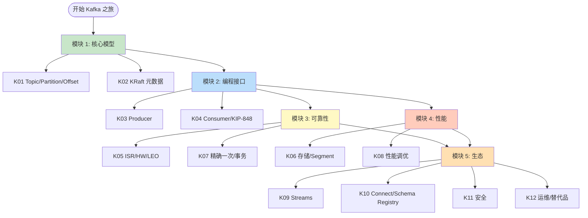
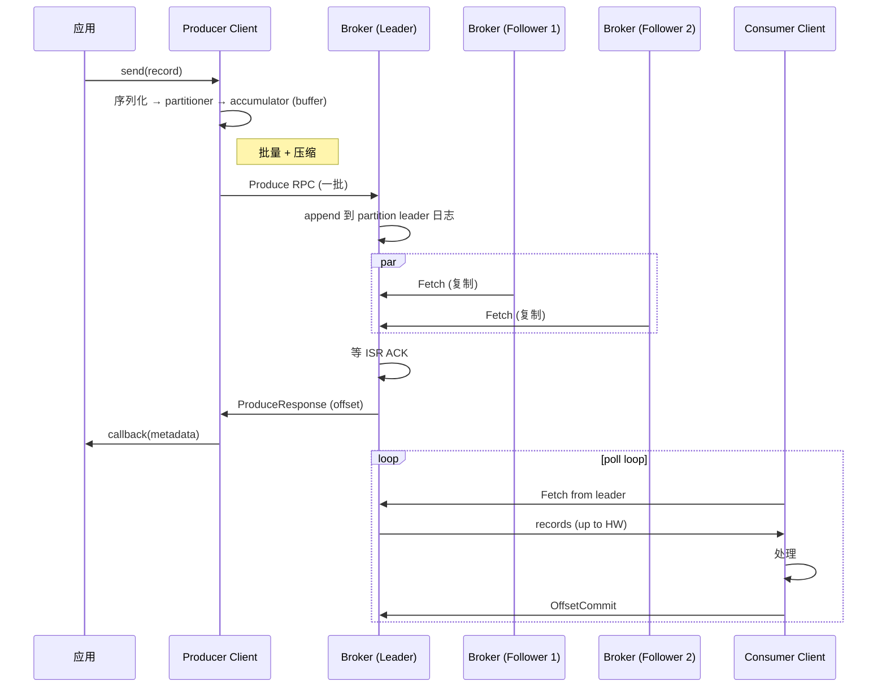
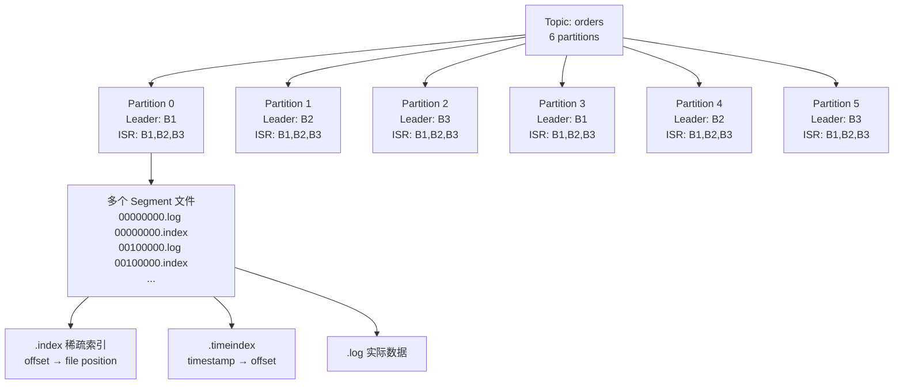
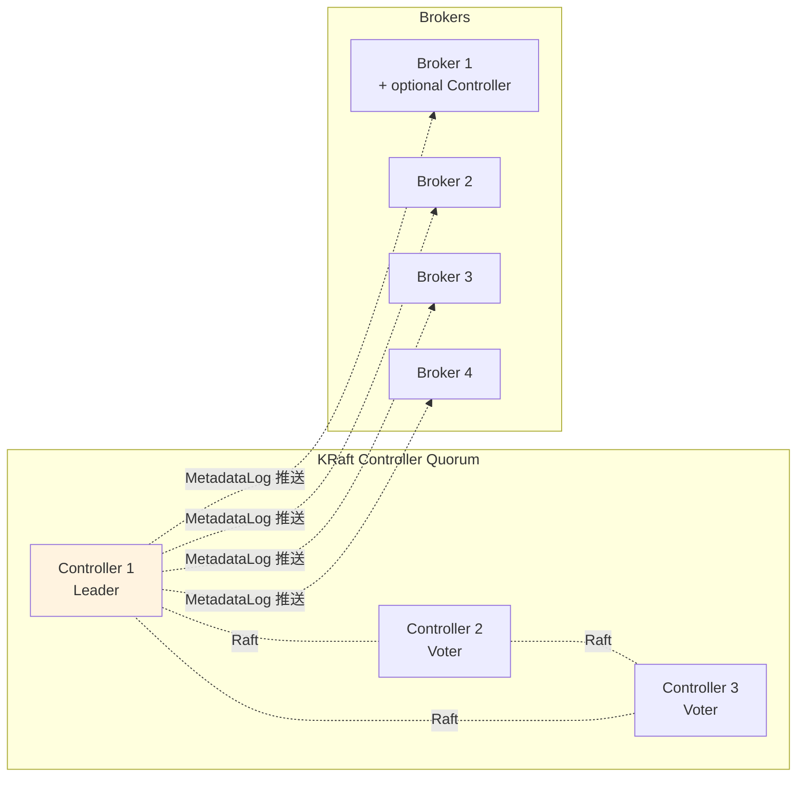
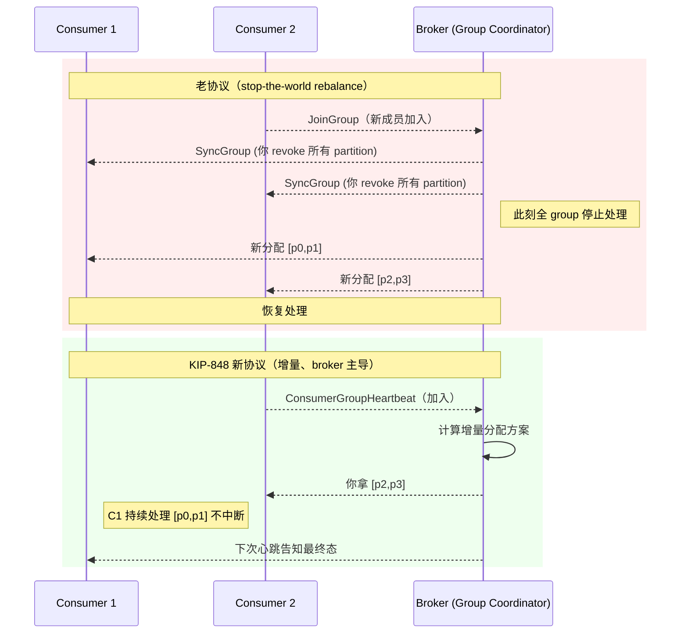
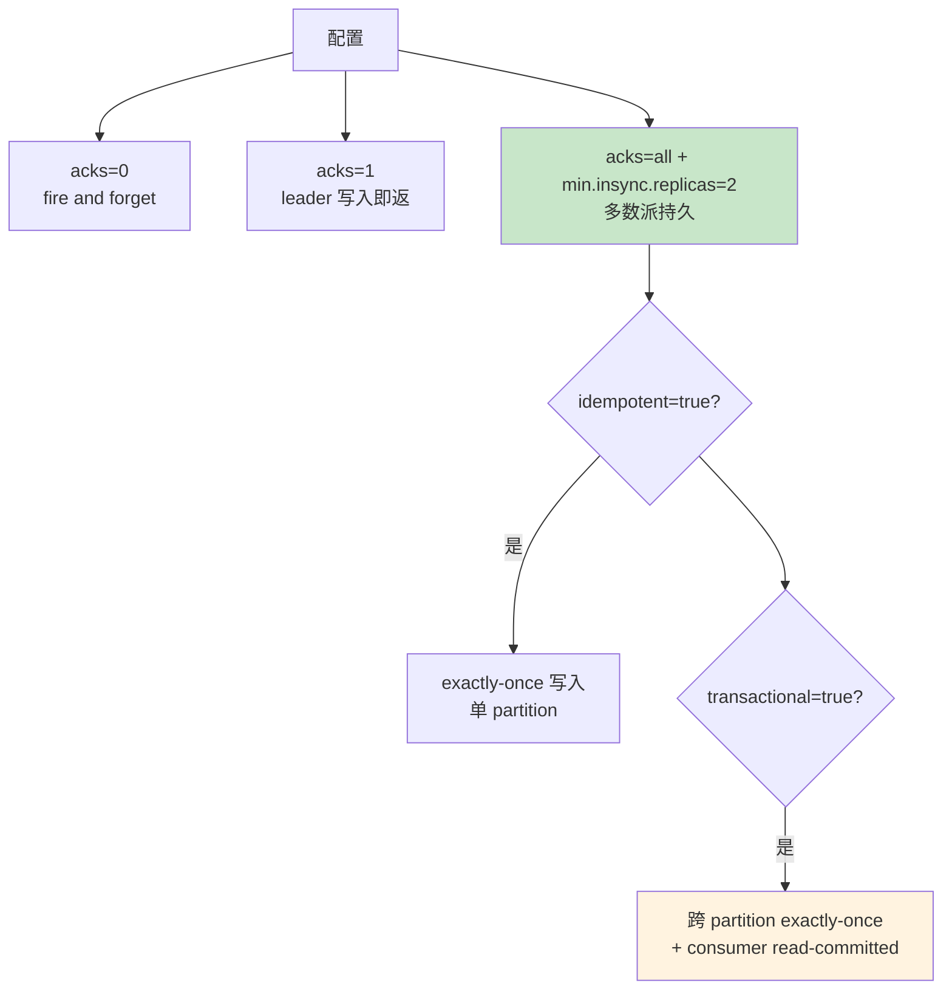
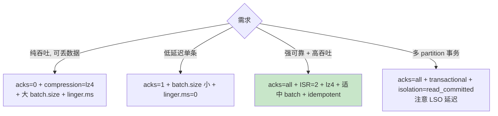
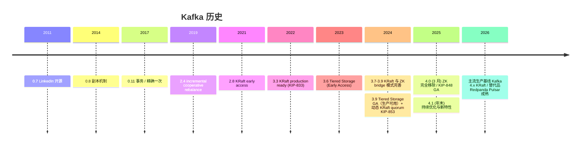
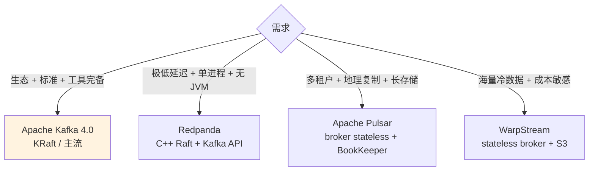

# Kafka 路线图 · Mermaid 可视化

> 配合 [INDEX.md](./INDEX.md) 与 [QUIZ.md](./QUIZ.md) 使用
>
> **📅 内容基准：Apache Kafka 4.0**（2025 GA，默认 KRaft）

---

## 🗺️ 全景路线图

---

## 🔑 一条消息的端到端旅程

---

## 📦 Partition 物理布局

---

## 🗳️ KRaft Controller Quorum

> Kafka 4.0 起 ZooKeeper 完全移除。Controller 数量推荐 3 或 5（quorum 大小 = (N+1)/2）。`process.roles=broker,controller` 可让一台机同时担两职（dev / 小集群）。

---

## 🔒 KIP-848 新 vs 老 Consumer 协议

---

## 🛡️ 可靠性等级矩阵

---

## 🚀 性能极限决策

---

## 🆕 Kafka 关键里程碑

---

## 🆚 现代消息系统对比

---

