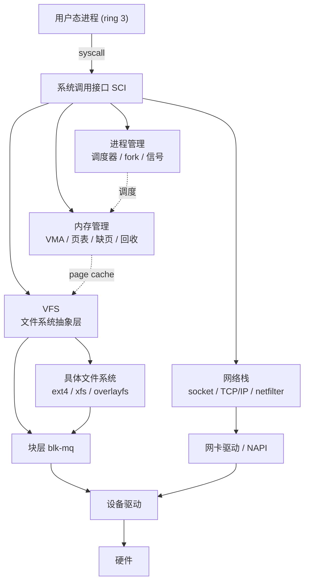

# 精通 Linux 架构与系统调用：用户态/内核态、syscall、vDSO、ABI、内核子系统、strace

> 课程编号：L01
> 路线图来源：Linux · 模块一 基石
> 难度：⭐⭐⭐
> 预计阅读时间：60 分钟
> 内容基准：2026 年 6 月（Linux 6.12 LTS / 6.15+，本篇相关：`syscall` 指令与 `sys_call_table`、vDSO/vvar、`getrandom` vDSO、seccomp/ptrace、io_uring 对"syscall 即陷入"的冲击）

---

## 引言：一次 write() 背后内核做了什么

你写下这一行 C：

```c
write(1, "hi\n", 3);
```

在你看来这是一次函数调用。但它跨越了现代操作系统里最重要的一条边界——**用户态与内核态的边界**。让我们把这次调用拆到指令级，看看 CPU 究竟做了什么。

`write` 不是系统调用本身，它是 glibc 的一个**封装函数（wrapper）**。glibc 把参数按 ABI 约定放进寄存器，再执行一条特殊指令 `syscall`：

```
; x86-64 上 glibc 的 write wrapper 大致等价于：
mov    rax, 1          ; rax = 系统调用号（write = 1）
mov    rdi, 1          ; 第 1 个参数 fd = 1（stdout）
mov    rsi, <buf>      ; 第 2 个参数 buf 指针
mov    rdx, 3          ; 第 3 个参数 count = 3
syscall               ; <<< 陷入内核，CPU 切到 ring 0
; 返回后：rax = 返回值（写了几字节，或负的 -errno）
```

`syscall` 这条指令做了几件用户态代码绝无可能自己做的事：

1. CPU 特权级从 **ring 3（用户态）切到 ring 0（内核态）**；
2. 从 `MSR` 寄存器 `IA32_LSTAR` 取出内核入口地址，跳进内核的 `entry_SYSCALL_64`；
3. 切换到内核栈，保存用户态寄存器现场；
4. 内核以 `rax` 为下标查 `sys_call_table`，找到 `__x64_sys_write`，把 `rdi/rsi/rdx` 当参数调用它；
5. `sys_write` 经 VFS 找到 fd=1 对应的 `struct file`，调用它的 `file_operations->write_iter`；对终端是 tty 驱动，对重定向到文件是页缓存写入；
6. 返回值放回 `rax`，执行 `sysret` 切回 ring 3，恢复用户态现场。

一次"普通函数调用"的表象之下，是特权级切换、地址空间共享、查表分发、子系统协作的一整套机制。本篇就是要把这条边界、这条指令、以及边界两侧的世界讲透：

- 第一章讲**边界本身**：ring 0/ring 3、内核地址空间、monolithic 单内核 + LKM；
- 第二章讲**穿越边界的机制**：从 `int 0x80` 到 `syscall`、系统调用号与分发表、寄存器传参、errno；
- 第三章讲**不穿越边界的捷径**：vDSO/vvar 为何让 `clock_gettime` 不陷入内核；
- 第四章俯瞰**内核子系统全景**与 `/proc`、`/sys`、ABI 稳定性；
- 第五章统一中断/异常/陷阱三种"进内核"的方式；
- 第六章拆 `strace`/`perf trace` 的 ptrace/seccomp 原理与开销。

读完你应该能完整还原一次系统调用的全路径，知道为什么 `gettimeofday` 不花一次陷入，并理解 io_uring 如何在 2026 年动摇了"一次 syscall = 一次陷入"的传统认知。

---

## 第一章 用户态与内核态：那条最重要的边界

### 1.1 为什么需要两个世界

如果所有代码都能直接操作硬件、改任意内存、关中断，那么任何一个有 bug 的程序都能让整台机器崩溃，任何一个恶意程序都能读走别人的密码。现代 CPU 因此提供了**特权级（privilege level / protection ring）**机制，把代码分成"可信"和"不可信"两类。

x86 架构定义了 4 个 ring（ring 0 ~ ring 3），但 Linux（以及几乎所有现代 OS）只用两个：

| | ring 0 | ring 3 |
|---|---|---|
| 名称 | 内核态 / supervisor | 用户态 / user |
| 谁在跑 | 内核代码、驱动 | 应用程序、glibc |
| 能否执行特权指令 | 能（`hlt`、`lgdt`、改 CR3、关中断…） | 不能，会触发 #GP 异常 |
| 能访问的内存 | 全部（含内核地址空间） | 仅自己进程的用户地址空间 |
| I/O 端口 / 设备寄存器 | 直接访问 | 不能直接访问 |

ARM64 用 **Exception Level（EL0/EL1/EL2/EL3）**表达同样的概念：应用在 EL0，内核在 EL1，hypervisor 在 EL2，安全监控在 EL3。本篇以 x86-64 为主线讲解，ARM64 在差异处会点出。

**关键点**：ring 不是某个寄存器里写死的"我现在是内核"标志位那么简单，它是 CPU 硬件级的状态。用户态执行一条特权指令（比如试图 `cli` 关中断、或访问内核地址），CPU 会立刻抛出 **#GP（General Protection Fault）**异常，控制权交回内核——而不是让它得逞。这就是隔离的硬件根基。

### 1.2 内核地址空间：共享但不可见

在 64 位 Linux 上，每个进程都有一个 4 级（或 5 级）页表描述的虚拟地址空间。这个空间被劈成两半（典型 x86-64，47 位地址布局）：

```
  0xffff_ffff_ffff_ffff  ┌────────────────────────┐
                         │   内核空间 (kernel)     │  ← 所有进程共享同一份映射
                         │  直接映射 / vmalloc /   │     但 ring 3 不可访问
                         │  内核代码 / 模块 ...    │
  0xffff_8000_0000_0000  ├────────────────────────┤
         (非规范地址空洞)  │        (hole)          │
  0x0000_7fff_ffff_ffff  ├────────────────────────┤
                         │   用户空间 (user)       │  ← 每个进程私有
                         │  stack / mmap / heap /  │
                         │  bss / data / text      │
  0x0000_0000_0000_0000  └────────────────────────┘
```

注意两个反直觉的事实：

1. **内核空间映射在每个进程的页表里**，而且全系统共享同一份内核映射。这样系统调用陷入内核后不需要切换页表（CR3），直接就能跑内核代码、访问内核数据——快。
2. **用户态看不见也碰不到内核空间**。内核页表项设了 supervisor 位（U/S=0），ring 3 访问会触发缺页/保护异常。

> ⚠️ Meltdown 漏洞（2018）正是因为投机执行短暂"窥见"了这份共享的内核映射。修复方案 **KPTI（Kernel Page Table Isolation）**让用户态运行时换上一份几乎不含内核映射的页表，进出内核时切 CR3——代价是每次系统调用多一次 TLB 刷新开销。这也是为什么 2018 年后很多老 CPU 上 syscall 密集型负载会变慢。可用 `cat /sys/devices/system/cpu/vulnerabilities/meltdown` 查看缓解状态。

### 1.3 monolithic 单内核 + 可加载模块（LKM）

操作系统内核有两大流派：

| | 宏内核 monolithic | 微内核 microkernel |
|---|---|---|
| 代表 | **Linux**、传统 Unix | Minix、QNX、seL4 |
| 调度/内存/文件系统/网络/驱动 | 全跑在内核态同一地址空间 | 大多作为用户态服务进程 |
| 子系统间通信 | 直接函数调用，快 | 消息传递（IPC），有开销 |
| 一个驱动崩了 | 可能拖垮整个内核（panic） | 重启那个服务即可 |
| 可维护性/隔离 | 较差 | 较好 |

Linux 是**宏内核**——调度器、内存管理、VFS、TCP/IP、设备驱动全都编译进同一个内核镜像，跑在 ring 0 同一地址空间，彼此直接函数调用。这换来了极高的性能，代价是任何内核态代码的 bug 都可能 panic 整机。

但 Linux 又不是"铁板一块"——它支持**可加载内核模块（LKM, Loadable Kernel Module）**，让你在运行时往内核里插拔代码（多为驱动、文件系统、网络协议）：

```bash
# 查看已加载模块
$ lsmod | head
Module                  Size  Used by
nvme                   49152  3
ext4                  983040  1
xfs                  2310144  1
overlay               172032  0

# 加载 / 卸载模块（需要 root）
$ sudo modprobe nf_conntrack         # 按依赖自动加载
$ sudo rmmod nf_conntrack            # 卸载

# 查看模块信息
$ modinfo overlay | head -5
```

**关键认知**：模块加载后跑在 ring 0，与内核共享地址空间——它不是"沙箱里的插件"，而是与内核同生共死的代码。一个写错的内核模块能让整机 panic。这也是为什么 **eBPF**（见 [L19 eBPF](./L19-精通-eBPF.md)）如此重要：它让你"往内核里塞逻辑"，但要先过 verifier 校验、跑在受限虚拟机里，是一种"安全的、不会让内核崩的内核扩展"，与 LKM 形成鲜明对比。

---

## 第二章 系统调用机制：穿越边界的唯一正门

### 2.1 从 int 0x80 到 syscall 指令

用户态向内核请求服务，唯一的"正门"是触发一次受控的 ring 切换。历史上 x86 上有几代机制：

| 机制 | 年代 | 说明 | 现状 |
|---|---|---|---|
| `int 0x80` | 早期 i386 | 软中断，走 IDT 中断门进内核；约 100+ 周期 | 32 位 legacy，64 位上仍兼容但慢 |
| `sysenter/sysexit` | Pentium II | Intel 快速系统调用，省去中断查表 | 主要 32 位 |
| `syscall/sysret` | x86-64 | AMD 引入、64 位标配，从 MSR 直接取入口 | **当今主流** |

2026 年的 64 位 Linux，绝大多数系统调用走的是 **`syscall` 指令**。它比 `int 0x80` 快得多——不必查中断描述符表 IDT，CPU 直接从几个 MSR 寄存器取信息：

- `IA32_LSTAR`：内核入口 RIP（即 `entry_SYSCALL_64` 地址）；
- `IA32_STAR`：内核态/用户态的段选择子；
- `IA32_FMASK`：进内核时要清除哪些 `RFLAGS` 位（如关中断标志）。

你可以亲眼看到程序到底用的哪条指令——拿一个静态二进制反汇编：

```bash
$ objdump -d /bin/true | grep -A3 -m1 'syscall'
# 现代发行版上 glibc / 内核入口几乎都是 syscall，看不到 int 0x80
```

ARM64 上对应的指令是 **`svc #0`（Supervisor Call）**，从 EL0 陷入 EL1，入口由 `VBAR_EL1` 向量基址寄存器决定。

### 2.2 系统调用号与 sys_call_table

`syscall` 指令本身不知道你要干什么——它只负责"进内核"。**你想调用哪个系统调用，由 `rax` 里的系统调用号决定**。内核入口拿到 `rax`，以它为下标查一张函数指针数组 `sys_call_table`，跳到对应实现。

```c
// arch/x86/entry/syscall_64.c（概念简化）
// 这张表由 syscall_64.tbl 在编译期生成
const sys_call_ptr_t sys_call_table[] = {
    [0]   = __x64_sys_read,
    [1]   = __x64_sys_write,
    [2]   = __x64_sys_open,
    [3]   = __x64_sys_close,
    ...
    [257] = __x64_sys_openat,
    ...
};
```

系统调用号是 **ABI 的一部分，一旦分配永不改变**（否则旧二进制会调错函数）。注意一个重要陷阱：**系统调用号在不同架构上不同**。`x86-64` 上 `read=0,write=1`，但 `aarch64` 上 `read=63,write=64`。所以系统调用号表是 per-arch 的：

```bash
# x86-64 的系统调用号表（内核源码）
$ grep -E '\s(read|write|openat)\s' /usr/include/asm/unistd_64.h
#define __NR_read 0
#define __NR_write 1
#define __NR_openat 257

# 用 ausyscall 查号（来自 audit 包），更方便
$ ausyscall x86_64 write
write
$ ausyscall x86_64 1
write
```

内核入口分发的核心逻辑大致是：

```c
// arch/x86/entry/common.c（高度简化）
__visible noinstr void do_syscall_64(struct pt_regs *regs, int nr)
{
    nr = syscall_enter_from_user_mode(regs, nr);  // seccomp/ptrace 钩子在这里
    if (likely(nr < NR_syscalls)) {
        regs->ax = sys_call_table[nr](regs);       // 查表 + 调用，返回值放 rax
    } else {
        regs->ax = -ENOSYS;                        // 无效调用号
    }
    syscall_exit_to_user_mode(regs);               // 退出钩子（信号、调度点）
}
```

### 2.3 x86-64 调用约定：寄存器传参

用户态和内核态约定好了"参数放哪、返回值放哪"，这套约定就是 **syscall ABI**。**它与普通 C 函数的 System V ABI 不完全一样**——尤其是第 4 个参数：

| 角色 | 寄存器 | 备注 |
|---|---|---|
| 系统调用号 | `rax` | C 函数用 rax 放返回值，这里复用为调用号 |
| 参数 1 | `rdi` | 与 C ABI 相同 |
| 参数 2 | `rsi` | 与 C ABI 相同 |
| 参数 3 | `rdx` | 与 C ABI 相同 |
| 参数 4 | **`r10`** | ⚠️ C 函数用 `rcx`，但 `syscall` 指令会用 `rcx` 保存返回地址，故改用 `r10` |
| 参数 5 | `r8` | 与 C ABI 相同 |
| 参数 6 | `r9` | 与 C ABI 相同 |
| 返回值 | `rax` | 成功为正/零，失败为 `-errno`（负值） |

系统调用最多 6 个寄存器参数。需要更多参数的（如 `mmap`、`clone3`）通常把参数打包进一个结构体，传指针。

下面用纯汇编（GAS，AT&T 语法）写一个不依赖 libc 的 "hello"，直观看到这套约定：

```asm
# hello.s —— 直接用 syscall，零 libc 依赖
# 编译: gcc -nostdlib -static -o hello hello.s
.global _start
.section .data
msg:    .ascii "hello via raw syscall\n"
.set    len, . - msg
.section .text
_start:
    mov  $1, %rax          # __NR_write = 1
    mov  $1, %rdi          # fd = 1 (stdout)
    lea  msg(%rip), %rsi   # buf
    mov  $len, %rdx        # count
    syscall                # write(1, msg, len)

    mov  $60, %rax         # __NR_exit = 60
    xor  %rdi, %rdi        # status = 0
    syscall                # exit(0)
```

```bash
$ gcc -nostdlib -static -o hello hello.s && ./hello
hello via raw syscall
$ strace -e write,exit ./hello   # 验证确实只发了这两个 syscall
```

### 2.4 返回值、errno 与 glibc wrapper

内核的返回值约定很朴素：**成功返回 ≥0 的值，失败返回 `-errno`（负的错误码）**。比如打开不存在的文件，内核返回 `-2`（`-ENOENT`）。

但 C 程序员习惯的是"返回 -1，errno 置为错误码"。这层转换由 **glibc wrapper** 完成：

```c
// glibc wrapper 的语义（概念）
long ret = raw_syscall(...);     // 拿到内核原始返回值
if (ret < 0 && ret >= -4095) {   // 落在 errno 区间
    errno = -ret;                // 转成正的 errno
    return -1;                   // 对外统一返回 -1
}
return ret;                      // 成功值原样返回
```

所以应用层看到的 `open()` 返回 -1、`errno=ENOENT`，其实是 glibc 把内核的 `-2` 翻译过的。这解释了一个常见困惑：**为什么 `strace` 里看到 `openat(...) = -1 ENOENT`，而 C 代码里要查 `errno`**——strace 看的是内核原始返回，glibc 帮你做了 -1/errno 的转换。

glibc wrapper 还可能"偷梁换柱"：

- `fork()` wrapper 实际调用的是 `clone`（见 [L02 进程](./L02-精通-进程与线程模型.md)）；
- `exit()` 库函数会跑 `atexit` 回调、刷 stdio 缓冲，然后才调 `exit_group` 系统调用；
- 有些"系统调用"（如 `getpid` 的缓存、`gettimeofday`）压根不陷入内核——见第三章。

可以用一个极简 C 程序对比"裸 syscall"和"glibc wrapper"：

```c
#include <unistd.h>
#include <sys/syscall.h>   // SYS_getpid 等号码
#include <stdio.h>
int main(void) {
    long via_glibc = getpid();                 // glibc wrapper
    long via_raw   = syscall(SYS_getpid);      // 通用 syscall() 直接传号
    printf("glibc=%ld raw=%ld\n", via_glibc, via_raw);  // 两者相同
    return 0;
}
```

`syscall(2)` 这个通用入口是个救命稻草：当某个新系统调用还没有 glibc wrapper 时（比如刚合入内核的 `getrandom`、`io_uring_setup` 早期），你可以用 `syscall(__NR_xxx, ...)` 直接调用。

---

## 第三章 vDSO 与 vvar：不陷入内核的捷径

### 3.1 问题：高频只读调用，凭什么要陷入内核

`clock_gettime`、`gettimeofday` 这类调用极其高频——监控埋点、超时判断、日志时间戳，一秒钟可能上百万次。但它们做的事很简单：**读一个内核维护的时钟值返回**。如果每次都老老实实 `syscall` 陷入内核（特权切换、保存现场、查表、返回），开销大得离谱——这是一个"只读、无副作用、不需要内核特权"的操作，却付了一次完整陷入的钱。

**vDSO（virtual Dynamic Shared Object，虚拟动态共享对象）**就是为此而生:内核把一小段代码和一小块只读数据**映射进每个进程的地址空间**，让这些"只读"系统调用在**纯用户态**完成，根本不陷入内核。

### 3.2 vDSO 与 vvar 的工作机制

每个进程启动时，内核（ELF loader）会自动把两块特殊映射塞进地址空间：

```bash
# 任何进程的内存映射里都能看到 [vdso] 和 [vvar]
$ cat /proc/self/maps | grep -E 'vdso|vvar'
7ffd4b1f4000-7ffd4b1f8000 r--p 00000000 00:00 0    [vvar]
7ffd4b1f8000-7ffd4b1fa000 r-xp 00000000 00:00 0    [vdso]
```

- **`[vdso]`（`r-xp`，可读可执行）**：一小段内核提供的代码，导出 `__vdso_clock_gettime`、`__vdso_gettimeofday`、`__vdso_time`、`__vdso_getcpu` 等函数。它是个标准的 ELF 共享对象，glibc 启动时通过 ELF auxiliary vector 里的 `AT_SYSINFO_EHDR` 找到它、解析符号表。
- **`[vvar]`（`r--p`，只读数据）**：内核持续更新的时钟数据页（如当前的 `CLOCK_MONOTONIC` 基准、TSC 频率换算系数）。内核在时钟中断里更新它，用户态只读。

调用流程变成这样：

```
传统路径（陷入内核）:
  app → clock_gettime() → syscall → ring0 → 内核读时钟 → ring3 → 返回
  └────────────── 一次完整特权切换，~数百 ns ──────────────┘

vDSO 路径（不陷入）:
  app → clock_gettime() → glibc 跳到 __vdso_clock_gettime
       → 读 [vvar] 数据页 + 读 TSC 寄存器 + 算出时间 → 直接返回
  └─────────── 纯用户态，~十几 ns，无特权切换 ───────────┘
```

vDSO 的实现依赖一个硬件细节：**TSC（Time Stamp Counter）**寄存器可以用 `rdtsc` 指令在用户态直接读。vDSO 代码读 TSC，配合 `[vvar]` 里内核写好的"TSC→纳秒"换算系数，纯用户态算出当前时间。

> 💡 vDSO 不是无条件生效。当系统时钟源（clocksource）不是稳定的 TSC（比如虚拟机里被设成 `hpet`、`acpi_pm`、或 Xen/KVM 的 paravirt 时钟回退）时，vDSO 的快速路径会**自动回退到真正的 syscall**——这时你会发现某些虚拟机上 `clock_gettime` 突然慢了一个数量级。排查时先看 `cat /sys/devices/system/clocksource/clocksource0/current_clocksource`，理想是 `tsc`。

用 strace 可以验证 vDSO 的"隐身"效果——它根本不产生系统调用：

```bash
# 一个死循环调 clock_gettime 100 万次的程序
$ strace -c -e clock_gettime ./loop_gettime
# 输出里 clock_gettime 的 calls 数远小于 100 万（甚至为 0）
# 因为绝大多数在 vDSO 里完成了，strace（基于 ptrace）根本拦不到
```

这也是一个 strace 的认知陷阱：**vDSO 调用不经过内核 syscall 入口，所以 strace / seccomp 都看不到、拦不住**（见第六章）。

### 3.3 getrandom 进 vDSO（2026 新进展）

历史上 vDSO 只服务"读时钟"这类纯只读操作。一个重大进展是 **`getrandom()` 也进了 vDSO**（`vgetrandom`，Linux 6.11 起逐步落地，2026 年主流内核已具备）。

`getrandom` 用于获取密码学安全随机数，过去每次都得陷入内核读 CSPRNG，对大量调用 `getrandom` 的程序（如频繁生成 nonce、token 的服务、某些语言运行时的随机数）是瓶颈。vDSO 版本让用户态维护一个由内核状态驱动的本地 CSPRNG 状态，**在不损害安全性的前提下大幅减少陷入次数**——这是 vDSO 首次从"只读时钟"扩展到"有状态的安全敏感操作"，技术上相当精巧（涉及每线程的随机状态页、fork 安全、内核 reseed 通知）。

至此 vDSO 打破了"syscall 即陷入"的传统认知第一刀——某些"系统调用"压根不进内核。第二刀来自 io_uring（见 2026 现状）。

---

## 第四章 内核子系统全景：一次 write 牵动多少子系统

### 4.1 五大核心子系统及其协作

Linux 内核可以粗分为几大子系统，它们各管一摊又紧密协作：



回到引言里的 `write(1, "hi\n", 3)`，它实际牵动了：

1. **SCI（系统调用接口）**：`syscall` 进入 `do_syscall_64`，分发到 `sys_write`；
2. **进程管理**：从当前 `task_struct` 取 `files_struct`，按 fd=1 查到 `struct file`（见 [L02 进程](./L02-精通-进程与线程模型.md)、[L08 I/O 多路复用](./L08-精通-IO-多路复用.md)）；
3. **VFS**：调用 `struct file` 的 `file_operations->write_iter`；
4. **具体文件系统 / 设备**：若 fd=1 是终端，进 tty 驱动；若被重定向到 ext4 文件，进 ext4 的写路径；
5. **内存管理**：buffered write 把数据拷进 page cache（脏页），稍后由回写线程下刷（见 [L07 VFS](./L07-精通-VFS-与文件系统.md)）；
6. **块层 + 驱动**：真正落盘时经 blk-mq、NVMe 驱动、DMA 到磁盘（见 [L10 块设备](./L10-精通-块设备与IO调度.md)）；
7. **调度**：若数据要等待 I/O，进程睡眠，调度器选别的进程跑（见 [L03 调度](./L03-精通-CPU-调度-CFS-到-EEVDF.md)）。

一次三字节的写，串起了内核几乎所有核心子系统。这正是本课程 L02-L20 各章的分工。

### 4.2 /proc 与 /sys：内核暴露给用户态的窗口

宏内核跑在用户态看不见的地址空间，那运维和程序怎么观察、配置内核？答案是两个**伪文件系统**——它们不在磁盘上，每次读取都是内核现场生成的：

| | `/proc` | `/sys` |
|---|---|---|
| 起源 | 早期，进程信息为主 | 2.6 引入，设备模型为主 |
| 内容 | 进程状态、系统全局信息、可调参数 | 设备/驱动/总线、内核对象属性 |
| 文件系统类型 | `procfs` | `sysfs` |
| 典型用途 | `cat /proc/[pid]/status`、`sysctl` 背后 | `cat /sys/class/net/eth0/speed` |

```bash
# /proc：进程与系统信息（每次读都是内核现算）
$ cat /proc/self/status | grep -E 'VmRSS|Threads'   # 当前进程内存/线程
$ cat /proc/loadavg                                   # 负载（含 D 状态，见 L18）
$ cat /proc/[pid]/maps                                # 进程地址空间布局

# 可调内核参数：/proc/sys 下，等价于 sysctl
$ sysctl vm.swappiness                                # 读
$ sudo sysctl -w net.core.somaxconn=1024              # 临时改
# 等价于: echo 1024 > /proc/sys/net/core/somaxconn

# /sys：设备模型
$ cat /sys/devices/system/cpu/cpu0/cpufreq/scaling_cur_freq 2>/dev/null
$ cat /sys/devices/system/cpu/vulnerabilities/spectre_v2     # 漏洞缓解状态
```

`/proc`、`/sys` 是 SRE 的金矿——本课程 L18 诊断（见 [L18 诊断](./L18-精通-性能诊断方法论与工具.md)）几乎所有工具都建立在它们之上。`top`、`ps`、`free`、`vmstat` 本质都是 `/proc` 的格式化器。

### 4.3 ABI 稳定性：内核的"第一铁律"

Linus Torvalds 反复强调一句话——**"we do not break userspace"（不破坏用户态）**。这就是 Linux 的 ABI（Application Binary Interface）稳定承诺：

- **系统调用号、参数语义、返回值约定永不改变**。一个 2005 年编译的二进制，今天的内核还能跑。
- 新功能只能通过**新增**系统调用、新增标志位、新增字段实现，绝不能修改已有语义。

这条铁律的边界要分清：

| 接口 | 稳定性 | 说明 |
|---|---|---|
| 系统调用 ABI（user ↔ kernel） | **强稳定** | 永不破坏，这是铁律 |
| `/proc`、`/sys` 大部分 | 较稳定 | 尽量不破坏，但有例外 |
| 内核内部 API / 数据结构（kernel ↔ module） | **不稳定** | 版本间随意改，所以发行版要 DKMS 重编模块 |

最后一行是常见误解的源头：**内核不保证内部 API 稳定**。这就是为什么第三方驱动（如显卡驱动、ZFS）每次升级内核都要重新编译——内部函数签名、结构体布局可能变了。也是 eBPF **CO-RE（Compile Once, Run Everywhere）+ BTF** 要解决的核心难题：让 eBPF 程序在不重编的情况下适应不同内核的结构体布局（见 [L19 eBPF](./L19-精通-eBPF.md)）。

---

## 第五章 中断、异常、陷阱：进内核的统一视角

### 5.1 三种"进内核"的方式

系统调用只是进入内核的方式之一。CPU 从用户态切到内核态，统称为**异常控制流转移**，有三大来源：

| 类型 | 触发源 | 同步/异步 | 例子 | 处理后 |
|---|---|---|---|---|
| **中断 interrupt** | 外部硬件 | 异步（与当前指令无关） | 网卡收包、磁盘完成、时钟 tick | 返回被打断的指令 |
| **异常 exception (fault)** | CPU 执行指令出错 | 同步 | 缺页 #PF、除零 #DE、保护错 #GP | 修复后重试该指令，或杀进程 |
| **陷阱 trap** | 程序主动触发 | 同步 | `syscall`、`int3` 断点 | 返回下一条指令 |

它们的共性是：CPU 保存现场、切到 ring 0、跳到内核预设的处理入口；区别在于**触发源**和**返回行为**。系统调用属于"陷阱"——程序主动、可预期、返回执行下一条指令。

x86 上中断和异常通过 **IDT（Interrupt Descriptor Table）**分发，每个向量号对应一个处理入口；而 `syscall` 指令走的是更快的 MSR 直达路径（第二章），不查 IDT。ARM64 则统一通过异常向量表（`VBAR_EL1`）分发。

### 5.2 缺页异常：最重要的"异常"

对后端工程师，最该理解的异常是 **缺页（Page Fault, #PF）**——因为它无处不在，且分两种、性能天差地别：

```
访问一个虚拟地址
        │
        ▼
   页表里有映射且权限OK？──是──► 正常访问（无异常）
        │否
        ▼
   触发 #PF，陷入内核
        │
        ├─ 页在内存里，只是没建映射（如首次访问 mmap 的页、COW）
        │     → minor fault（次缺页）：建映射即可，快
        │
        └─ 页不在内存（被换出到 swap、或文件页未读入）
              → major fault（主缺页）：要发起磁盘 I/O，慢（毫秒级）
```

```bash
# 看进程的缺页统计
$ ps -o min_flt,maj_flt,cmd -p $$
 MINFL  MAJFL CMD
  4521      3 -bash

# 实时看 major fault（major fault 多 = 在颠簸 swap 或冷启动读文件）
$ vmstat 1     # 关注 si/so（swap in/out）

# 用 perf 统计缺页
$ perf stat -e minor-faults,major-faults ./your_program
```

`fork` 后的 COW、`mmap` 文件后的按需调页（demand paging）、可执行文件的懒加载，全靠缺页异常驱动。详见 [L04 虚拟内存](./L04-精通-虚拟内存与分页.md)。**生产中 major fault 飙升往往意味着内存不足在 swap，或 page cache 被挤掉后冷读磁盘**——这是延迟毛刺的常见根因。

### 5.3 硬中断与软中断：为什么收包要分两段

外部中断（如网卡收包）的处理被刻意切成两半，这是理解网络性能的关键：

- **硬中断（hardirq）/ 上半部**：网卡触发中断，CPU 立刻响应，但**必须极短**——通常只是"记下有包来了、关掉该中断源、调度下半部"。期间会屏蔽中断，太久会丢中断、卡死系统。
- **软中断（softirq）/ 下半部**：真正干活的部分（如把包送进协议栈），在开中断的环境下运行，可被调度，必要时丢给内核线程 `ksoftirqd`。

```bash
# 看各类中断分布（硬中断）
$ cat /proc/interrupts | head

# 看软中断分布（NET_RX 高 = 网络收包繁忙）
$ cat /proc/softirqs

# ksoftirqd CPU 占用高 = 软中断处理不过来（典型：高 PPS 网络）
$ top -p $(pgrep -d, ksoftirqd)
```

这套"硬中断快速登记、软中断延后处理"的设计，加上 NAPI 轮询，是 Linux 扛高 PPS 网络的基础（见 [L11 网络栈](./L11-精通-Linux-网络协议栈.md)）。

---

## 第六章 strace / ltrace / perf trace：拦截系统调用的原理

### 6.1 strace 的底层：ptrace

`strace` 能逐条打印进程的系统调用，靠的是 **`ptrace(2)`** 系统调用——同一个机制也支撑 `gdb` 调试器。

```bash
$ strace -f -T -tt ./myserver        # -f 跟子进程 -T 显示耗时 -tt 时间戳
$ strace -c ./myprogram              # 统计各 syscall 调用次数/耗时（性能体检神器）
$ strace -e trace=openat,read -p 1234  # 附加到运行中进程 1234，只看指定 syscall
$ strace -e trace=network -f ./client  # 按类别过滤（network/file/process...）
```

ptrace 的工作模型是"**tracer（strace）+ tracee（被跟踪进程）**"：

```
       strace (tracer)                          目标进程 (tracee)
            │                                        │
            │  ptrace(PTRACE_SEIZE/ATTACH) ───────►  │  进入被跟踪状态
            │                                        │
            │                          tracee 执行到 syscall 入口
            │  ◄──── 内核停住 tracee，唤醒 tracer ──── │ (syscall-enter-stop)
            │  读 tracee 寄存器(rax/rdi...)、内存                │
            │  ──── PTRACE_SYSCALL 让它继续 ────────► │  执行该 syscall
            │                          tracee 执行完 syscall
            │  ◄──── 再次停住 tracer ──────────────── │ (syscall-exit-stop)
            │  读返回值(rax)，打印一行                            │
            └──── 让它继续……循环 ──────────────────►  │
```

每个系统调用，tracee 至少**停两次**（进入时、退出时），每次都要切换到 strace 进程读寄存器/内存。**所以 strace 开销巨大**——对 syscall 密集的程序可能拖慢 10~100 倍。

> ⚠️ 一个真实的生产事故模式：**用 strace 附加到高 QPS 在线服务排查问题，结果服务因 syscall 被拖慢而雪崩**。strace 是诊断利器，但绝不能随便 attach 生产热路径。需要低开销时用 `perf trace` 或 eBPF。

### 6.2 strace、ltrace、perf trace 对比

| 工具 | 拦截什么 | 底层机制 | 开销 | 适用 |
|---|---|---|---|---|
| `strace` | **系统调用** | ptrace | 高（每 syscall 停 2 次） | 看程序与内核的交互、定位 ENOENT/EACCES |
| `ltrace` | **库函数调用**（如 malloc、glibc API） | ptrace + PLT/动态符号打桩 | 高 | 看程序与库的交互 |
| `perf trace` | 系统调用 | **perf/tracepoint/eBPF**（不停进程） | 低 | 低开销在线观察 syscall |
| `bpftrace` | syscall / 内核函数 / uprobe… | **eBPF**（内核里聚合） | 最低 | 生产可观测、自定义聚合（见 L19） |

```bash
# 库函数级跟踪
$ ltrace -e malloc+free ./prog

# 低开销的 syscall 跟踪（不用 ptrace，适合在线）
$ perf trace -p 1234

# bpftrace：内核里统计 write 系统调用延迟分布，几乎零侵入（见 L19）
$ bpftrace -e 'tracepoint:syscalls:sys_enter_write { @[comm] = count(); }'
```

**核心区别**：strace/ltrace 用 ptrace，要反复停目标进程，开销高；perf trace 和 bpftrace 在内核侧用 tracepoint/eBPF 就地处理，不停进程，开销低。生产环境优先后者。

### 6.3 seccomp：从"观察"到"限制"系统调用

ptrace 用来"观察"系统调用，**seccomp（secure computing）**则用来"限制"——它让进程声明一张白/黑名单，规定自己能调用哪些系统调用，违者直接被杀或返回错误。

```c
// 一个极简 seccomp 示例：只允许 read/write/exit，其余一律 kill
// 需要 -lseccomp（libseccomp）
#include <seccomp.h>
#include <unistd.h>
int main(void) {
    scmp_filter_ctx ctx = seccomp_init(SCMP_ACT_KILL);  // 默认：调用即被杀
    seccomp_rule_add(ctx, SCMP_ACT_ALLOW, SCMP_SYS(read),  0);
    seccomp_rule_add(ctx, SCMP_ACT_ALLOW, SCMP_SYS(write), 0);
    seccomp_rule_add(ctx, SCMP_ACT_ALLOW, SCMP_SYS(exit_group), 0);
    seccomp_load(ctx);          // 激活，从此不可逆

    write(1, "ok\n", 3);        // 允许
    // getpid();                // 若调用会被内核直接 KILL（SIGSYS）
    _exit(0);
}
```

seccomp 是容器安全的基石——**Docker / containerd 默认给容器套了一个 seccomp profile，封禁几十个危险系统调用**（如 `reboot`、`mount`、`kexec_load`）。它基于 BPF（经典 cBPF，不是 eBPF），在系统调用入口处过滤，开销极低。

seccomp 与本篇的关联很深：它就工作在第二章那个 `do_syscall_64` 的入口钩子处（`syscall_enter_from_user_mode`），在分发到 `sys_call_table` 之前拦截。这也是为什么 **seccomp 拦不住 vDSO 调用**——vDSO 根本不走这个入口（呼应第三章）。

---

## 生产实践

1. **用 `strace -c` 给程序做"系统调用体检"**：上线前跑一遍，看哪类 syscall 最多、最耗时。常见反模式：每次请求都 `open`/`close` 配置文件、海量 `stat` 探测路径、`gettimeofday` 风暴（这个应被 vDSO 吸收，若 strace 里真出现了说明时钟源退化）。

2. **绝不在生产热路径上 attach strace**：高 QPS 服务被 ptrace 拖慢可能雪崩。需要在线观察用 `perf trace -p <pid>` 或 bpftrace；非要 strace 也限定 `-e trace=...` 缩小范围、短时观察后立即 detach。

3. **核对时钟源确保 vDSO 生效**：`cat /sys/devices/system/cpu/.../current_clocksource`（应为 `tsc`）。虚拟机里若是 `hpet`/`acpi_pm`，`clock_gettime` 会退化为真陷入，监控埋点密集的服务延迟会被放大——这是云上常见的隐形性能税。

4. **理解 errno 才能读懂日志**：内核返回 `-errno`，glibc 转成 -1 + errno。排障时把 `strace` 看到的 `-1 ENOENT/EACCES/EMFILE` 对应到具体含义（`EMFILE` 是 fd 用尽，`ENOSPC` 满盘，`EAGAIN` 非阻塞重试）。

5. **给敏感服务上 seccomp**：自研服务用 libseccomp 或交给容器运行时的默认 profile，封禁不该用的系统调用，大幅缩小被提权利用的攻击面。

6. **监控 major fault 与 ksoftirqd**：`vmstat 1` 看 si/so 与缺页；`ksoftirqd` CPU 飙高代表软中断（多为网络）处理不过来。两者都是延迟毛刺的高频根因，纳入常规监控。

---

## 陷阱清单

1. **strace 一上，线上服务就变慢甚至雪崩**
   - 现象：attach strace 后目标进程 CPU 飙升、延迟暴涨、QPS 跳水。
   - 原因：ptrace 让 tracee 每个 syscall 停两次并切到 tracer，syscall 密集型服务被拖慢几十倍。
   - 修法：生产用 `perf trace`/bpftrace 代替；非用 strace 不可时加 `-e trace=` 限定、短时采样后立刻 detach。

2. **虚拟机上 `clock_gettime` 莫名很慢**
   - 现象：监控埋点 CPU 占用异常高，`strace -c` 竟看到大量 `clock_gettime` 系统调用。
   - 原因：clocksource 不是稳定 TSC（被设成 hpet/acpi_pm 或 paravirt clock 回退），vDSO 快速路径失效，退化为真陷入。
   - 修法：`current_clocksource` 改回 `tsc`（确认 CPU 有 constant/nonstop TSC）；排查 hypervisor 的时钟配置。

3. **以为 `getpid` 缓存值一定对，fork 后用错了 PID**
   - 现象：多线程/fork 场景拿到的 PID 不符预期。
   - 原因：glibc 历史上缓存 getpid，clone/fork 边界处理过坑（现代 glibc 已直接走 syscall）。
   - 修法：依赖 PID 准确性的场景直接 `syscall(SYS_getpid)`；理解 wrapper 可能做缓存/改写。

4. **跨架构硬编码系统调用号，换到 ARM64 全错**
   - 现象：x86 上手写 `syscall(1, ...)` 当 write 用，移到 aarch64 调成了别的调用。
   - 原因：系统调用号 per-arch 不同（write 在 x86-64 是 1，aarch64 是 64）。
   - 修法：永远用 `SYS_write`/`__NR_write` 宏，绝不硬编码数字；用 `ausyscall <arch> <name>` 核对。

5. **第三方内核模块升级内核后加载失败**
   - 现象：`insmod` 报 `invalid module format` / 符号不匹配。
   - 原因：内核内部 API/结构体非稳定 ABI，模块需对应内核版本重编（`vermagic` 不符）。
   - 修法：用 DKMS 自动随内核重编；或选 eBPF（CO-RE + BTF）实现可移植的内核扩展。

6. **major fault 暴涨导致 p99 毛刺，却以为是 CPU 问题**
   - 现象：延迟周期性飙高，CPU 利用率却不满。
   - 原因：内存吃紧触发 swap（major fault 走磁盘），或 page cache 被挤后冷读文件。
   - 修法：`vmstat 1` 看 si/so 与 maj_flt；降内存压力、关键服务 `mlock` 或调低 swappiness、保证 page cache。

7. **seccomp profile 太严，程序随机被 SIGSYS 杀死**
   - 现象：容器里进程偶发 `Bad system call (core dumped)`。
   - 原因：seccomp 白名单漏了某个新版 glibc/运行时用到的系统调用（如新的 `clone3`、`rseq`、`statx`）。
   - 修法：用 `SCMP_ACT_LOG`/审计日志找出被拦的 syscall 补进白名单；升级容器运行时默认 profile。

8. **以为 `write` 返回成功数据就安全了**
   - 现象：write 返回 3，断电后数据没了。
   - 原因：write 只到 page cache，未落盘（这是 VFS 的"善意谎言"，见 L07）。
   - 修法：关键数据 `fsync`/`fdatasync`，理解 write 返回 ≠ 持久化（详见 [L07 VFS](./L07-精通-VFS-与文件系统.md)）。

---

## 2026 现状

- **`syscall` 指令是 64 位绝对主流**，`int 0x80` 仅作 32 位 legacy 兼容。Meltdown 后的 KPTI 让 syscall 多了 TLB 刷新代价，新硬件靠 PCID/eIBRS 等缓解，但 syscall 密集型负载对"减少陷入次数"仍高度敏感。
- **io_uring 动摇"syscall 即陷入"的传统认知**：传统模型里"一次系统调用 = 一次陷入"。io_uring 用用户态与内核共享的 SQ/CQ 双环，让应用把成百上千个 I/O 请求批量放进提交队列，**一次 `io_uring_enter` 提交一批**，开启 SQPOLL 模式后甚至**连这一次陷入都省了**（内核线程轮询 SQ）。这是对"高频 I/O 必然高频陷入"的根本性突破（见 [L09 io_uring](./L09-精通-io_uring-与异步IO.md)）。
- **vDSO 扩张到 `getrandom`**：`vgetrandom`（6.11 起逐步可用，2026 主流内核已具备）首次把 vDSO 从纯只读时钟扩展到有状态的安全敏感操作，密集获取随机数的服务受益明显。
- **eBPF 成为"安全的内核扩展"主流路径**：相比与内核同生共死的 LKM，eBPF 程序过 verifier、跑受限 VM、CO-RE 跨内核可移植，在可观测、网络、安全（eBPF LSM、sched_ext）全面落地（见 [L19 eBPF](./L19-精通-eBPF.md)）。
- **观测工具向低开销迁移**：strace/ltrace（ptrace，高开销）在生产逐渐让位于 `perf trace`、bpftrace、bcc（tracepoint/eBPF，不停进程）。strace 仍是开发期定位 syscall 错误的利器，但不再是生产首选。
- **seccomp + namespace + cgroup 是容器隔离三件套**：seccomp 限制系统调用面，namespace 隔离视图（见 [L16 Namespace](./L16-精通-Namespace.md)），cgroup 限制资源（见 [L17 Cgroup](./L17-精通-Cgroup-v2.md)）——三者共同把一个"普通进程"圈成"容器"。

---

## 练习题

1. 用一句话解释：`write(1, "hi", 2)` 中，`write` 这个名字、系统调用号 1、`__x64_sys_write` 这个内核函数，三者分别由谁定义、在什么时机绑定到一起？

2. x86-64 syscall ABI 里第 4 个参数为什么用 `r10` 而不是 C 函数调用约定里的 `rcx`？请从 `syscall` 指令本身的行为说明原因。

3. 内核系统调用失败时返回 `-2`，而你的 C 程序里 `open` 返回 -1、`errno=ENOENT`。请描述这中间 glibc wrapper 做了什么转换，以及为什么 `strace` 显示的是 `-1 ENOENT` 而不是 `-2`。

4. 解释为什么 `clock_gettime(CLOCK_MONOTONIC, ...)` 在正常机器上几乎不产生系统调用（`strace -c` 看不到）。`[vdso]` 和 `[vvar]` 两块映射各自扮演什么角色？什么情况下 vDSO 会回退到真陷入？

5. 同样是"把代码塞进内核运行"，LKM 与 eBPF 在地址空间、崩溃影响、ABI 兼容性、安全性上有何本质区别？为什么说 eBPF 是"安全的内核扩展"？

6. 区分中断、异常、陷阱三者。`syscall`、网卡收包中断、访问被换出页触发的缺页，分别属于哪一类？处理完之后 CPU 分别返回到哪条指令（被中断指令本身 / 下一条 / 重试该指令）？

7. **排障**：一台云上虚拟机，某 Go 服务 CPU 利用率异常偏高，pprof 显示大量时间花在 `time.Now()` 相关路径上。请给出你的排查思路与命令序列，并解释根因最可能是什么、怎么修。

8. **实战**：你怀疑一个在线服务偶发 `Too many open files` 报错但不确定是哪类 fd 泄漏。请设计一套既能定位、又不至于拖垮服务的观测方案，说明为什么不直接长时间 `strace -f` 它，以及你会用什么替代（提示：`/proc/[pid]/fd`、`perf trace`、bpftrace、`ss`、`lsof`）。

---

## 参考答案

1. `write` 这个名字是 glibc 提供的封装函数符号，由 C 库在编译/链接期绑定；系统调用号 1 是内核 ABI 的一部分，由内核的 `syscall_64.tbl` 在内核编译期分配、glibc 把它写进 `rax`；`__x64_sys_write` 是内核中真正的实现函数，由内核入口在运行时以 `rax` 为下标查 `sys_call_table` 动态绑定调用。即：名字在用户态链接期定，号在 ABI 中固定，函数在每次陷入时查表绑定。

2. 因为 `syscall` 指令在硬件层面会用 `rcx` 保存返回地址（陷入前的用户态 RIP），用 `r11` 保存 `RFLAGS`。`rcx` 被指令本身征用了，无法再用来传第 4 个参数，所以 syscall ABI 把第 4 参数改放 `r10`。这是 syscall ABI 与普通 System V 函数 ABI 的唯一显著差异。

3. 内核约定失败返回 `-errno`（如 `-2` = `-ENOENT`）。glibc wrapper 拿到原始返回值后，判断其落在 errno 区间（`-4095..-1`），就把 `errno` 置为取反后的正值（`ENOENT`=2），并对外统一返回 -1。`strace` 直接读的是 tracee 寄存器 `rax` 里的内核原始返回值，没经过 glibc 转换，所以显示 `-1 ENOENT` 是 strace 把原始负值 `-2` 解析成 `-1` 形式并附上 errno 名（strace 展示的是它解读后的内核返回，本质对应原始 `-2`）。

4. `clock_gettime` 属于纯只读、无副作用操作，内核通过 vDSO 把实现代码和时钟数据映射进每个进程地址空间，调用在纯用户态完成、不陷入内核，因此 strace（基于 ptrace 拦内核入口）看不到。`[vdso]`（r-xp）是内核提供的可执行代码段，导出 `__vdso_clock_gettime` 等函数；`[vvar]`（r--p）是内核持续更新的只读时钟数据页（基准时刻、TSC 换算系数）。vDSO 代码读 TSC 寄存器配合 vvar 系数算出时间。当时钟源不是稳定 TSC（虚拟机里被设为 hpet/acpi_pm 或 paravirt clock 回退）时，vDSO 快速路径失效，回退为真正的 syscall 陷入。

5. LKM 加载后跑在 ring 0、与内核共享同一地址空间，一个 bug 即可 panic 整机；它依赖内核内部 API/结构体布局，内核内部 ABI 不稳定，所以换内核版本要重编（vermagic/符号校验）。eBPF 程序则先过 verifier 静态校验（禁止越界访问、保证有限循环/可终止），跑在受限的内核内虚拟机里，无法随意访问内核内存或导致崩溃；借助 CO-RE + BTF 可一次编译跨内核运行。正因为有校验器约束 + 受限执行环境 + 可移植，eBPF 被称为"安全的内核扩展"。

6. 中断（interrupt）由外部硬件异步触发；异常（exception/fault）由 CPU 执行指令同步出错触发；陷阱（trap）由程序主动同步触发。`syscall` 是陷阱，网卡收包是中断，访问被换出页的缺页是异常（fault）。返回行为：陷阱（syscall）返回到下一条指令；中断（收包）返回到被打断的那条指令（继续原指令流）；缺页异常在内核把页换入/建好映射后重试触发故障的那条指令本身。

7. 排查思路：这是典型的 vDSO 退化导致 `time.Now()`（底层 `clock_gettime`）每次都真陷入内核。命令序列：(1) `cat /sys/devices/system/cpu/clocksource/clocksource0/current_clocksource`（或 `.../clocksource/current_clocksource`）看时钟源，理想是 `tsc`；(2) `strace -c -p <pid>` 看是否出现大量 `clock_gettime` 系统调用（正常应几乎为 0）；(3) `cat /sys/devices/system/clocksource/clocksource0/available_clocksource` 看可选项。根因最可能是虚拟机时钟源被设为 `hpet`/`acpi_pm` 或 paravirt clock，vDSO 快速路径失效退化为真陷入。修法：在 CPU 具备 constant/nonstop TSC 的前提下把 current_clocksource 切回 `tsc`，并排查 hypervisor 的时钟配置。

8. 定位 fd 泄漏的低开销方案：(1) 先静态盘点——周期性 `ls /proc/<pid>/fd | wc -l` 看 fd 总数趋势，`ls -l /proc/<pid>/fd` 看每个 fd 指向（socket/文件/pipe/eventfd），快速判断泄漏的是哪类；socket 用 `ss -p` 关联进程统计连接，文件类用 `lsof -p <pid>` 抽样；(2) 看上限 `cat /proc/<pid>/limits` 里的 Max open files；(3) 追"谁在开不关"——用 `perf trace -p <pid> -e open*,socket,accept*,close` 或 bpftrace 统计 open/close 配对（如 `bpftrace -e 'tracepoint:syscalls:sys_enter_openat { @[comm]=count(); }'`）。不直接长时间 `strace -f` 的原因：strace 基于 ptrace，每个 syscall 让 tracee 停两次并切到 tracer，对高 QPS 在线服务会拖慢几十倍甚至导致雪崩。替代用 perf trace / bpftrace（tracepoint/eBPF，内核内聚合、不停进程，开销低），配合 `/proc/<pid>/fd`、`ss`、`lsof` 做快照式定位。
