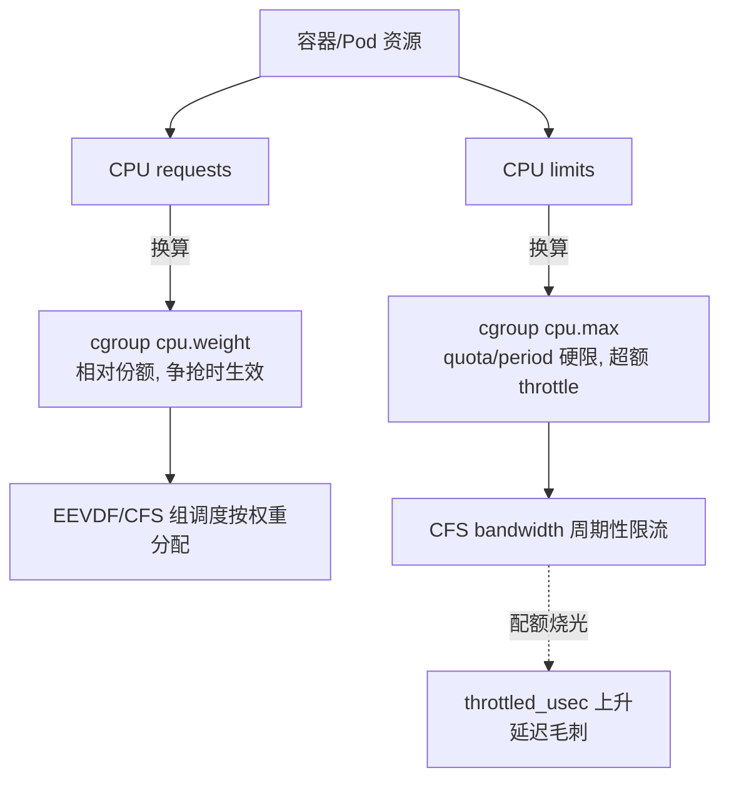

# 精通 CPU 调度：调度类、vruntime、EEVDF、sched_ext、cgroup 配额、调度延迟

> 课程编号：L03
> 路线图来源：Linux · 模块一 基石
> 难度：⭐⭐⭐⭐
> 预计阅读时间：60 分钟
> 内容基准：2026 年 6 月（Linux 6.12 LTS / 6.15+，本篇相关：EEVDF 自 6.6 取代 CFS 挑选逻辑、sched_ext 自 6.12 GA、latency_nice 落地、cgroup v2 cpu.weight/cpu.max 主流）

---

## 引言：同样的代码，为什么有延迟毛刺？

先看一个真实场景。一个 Go 写的 gRPC 服务，单核压测时 P99 稳定在 2 ms。上线后部署到一台 64 核机器，和十几个别的服务挤在一起（都在容器里），P99 偶发飙到 30~80 ms，CPU 利用率却只有 40%。重启、扩容、加内存都没用。

用 `runqlat`（bcc 工具，测量任务从"可运行"到"真正拿到 CPU"的等待时间）一抓，真相浮出水面：

```bash
$ sudo runqlat 5 1
     usecs               : count    distribution
         0 -> 1          : 8203    |****************                        |
         2 -> 3          : 19847   |****************************************|
         4 -> 7          : 6521    |*************                           |
       ...
     16384 -> 32767      : 142     |                                        |  ← 16~32 ms 的尾巴
     32768 -> 65535      : 38      |                                        |  ← 有人等了 30~60 ms
```

绝大多数任务几微秒就上了 CPU，但有一条长尾：少数任务在运行队列里干等了几十毫秒。**CPU 不忙，但你的线程没被及时调度**——这就是调度延迟（scheduling latency）。它不是 CPU 不够，而是调度器在"什么时候让谁上 CPU、让多久"这件事上，没有把这条延迟敏感的请求线程优先伺候好。

理解这个长尾，要回答一连串问题：

- 内核凭什么决定下一个跑哪个进程？凭 `nice` 值？凭谁等得久？
- 为什么一个疯狂占 CPU 的批处理任务，会拖慢同机的延迟敏感服务，即使后者 `nice` 更低？
- CFS 用了十几年，6.6 为什么要换成 **EEVDF**？换了之后我的延迟敏感任务能更好吗？
- 容器设了 `cpu.max`（CPU limit），为什么明明 CPU 没用满，应用却被 throttle 卡住？
- 实时任务（SCHED_FIFO）写错了会怎样把整个核"焊死"？

本章从调度框架的骨架（调度类层级）讲起，拆开 CFS 的 vruntime 与红黑树，讲清 EEVDF 用 lag / virtual deadline 重写了挑选逻辑、为什么对延迟敏感任务更友好，再到实时调度、多核负载均衡、cgroup CPU 控制，最后是 6.12 才 GA 的 **sched_ext**——用 BPF 写一个自己的调度器。读完你应该能：

- 画出调度类层级，解释一次上下文切换在内核里发生了什么
- 说清 vruntime 怎么保证"公平"，nice 怎么换算成权重
- 解释 EEVDF 的 eligibility 与 virtual deadline，以及 `latency_nice` 怎么用
- 区分 SCHED_FIFO / RR / DEADLINE，识别优先级反转
- 用 `runqlat` / `perf sched` / `schedstat` 定位一次调度延迟毛刺
- 看懂容器 CPU throttling，正确设 `cpu.weight` 与 `cpu.max`

---

## 第一章 调度框架：内核怎么决定"下一个跑谁"

### 1.1 调度的本质问题

一台机器 CPU 核数有限（哪怕 128 核），可运行的任务（线程）可能成百上千。调度器（scheduler）要回答两个问题：

1. **挑选（pick）**：下一刻这个 CPU 应该跑哪个任务？
2. **抢占（preempt）**：当前任务该让出 CPU 吗？什么时候让？

在 Linux 里，调度的基本单位是 `task_struct`（见 [L02 进程与线程模型](./L02-精通-进程与线程模型.md)）——不管你叫它进程还是线程，对调度器来说都是一个可调度实体。每个 `task_struct` 有一个调度策略（`policy`）和优先级相关字段，内核据此把它归入某个**调度类**。

### 1.2 调度类层级

Linux 不是用一个算法调度所有任务，而是分了几个**调度类（sched_class）**，按优先级从高到低串成一条链。挑选下一个任务时，内核从最高优先级的类开始问"你有任务要跑吗"，直到某个类给出任务：

```
高优先级
  │
  ├─ stop_sched_class      停机类：迁移线程/CPU 热插拔，最高优先级，不可被抢占
  │
  ├─ dl_sched_class        DEADLINE 类：SCHED_DEADLINE，基于 EDF/CBS 的硬实时
  │
  ├─ rt_sched_class        实时类：SCHED_FIFO / SCHED_RR，固定优先级 0~99
  │
  ├─ fair_sched_class      公平类：SCHED_NORMAL/OTHER/BATCH/IDLE —— CFS / EEVDF 在这里
  │
  └─ idle_sched_class      空闲类：没别的可跑时跑 idle（进低功耗）
低优先级
```

关键点：

- **绝大多数普通进程/线程都在 fair 类**（SCHED_OTHER，即 SCHED_NORMAL）。我们日常说的 CFS、EEVDF 都是 fair 类内部的挑选逻辑。
- **实时类（rt）优先级高于 fair**：只要有一个 SCHED_FIFO 任务可运行，fair 类的任务就一个都拿不到 CPU——这是写实时任务最容易踩的坑（见 4.4）。
- **stop 类**用于内核内部（如把任务从一个 CPU 迁到另一个 CPU 的 migration 线程），用户态碰不到。

`pick_next_task()` 的逻辑（简化）：

```c
// kernel/sched/core.c 思路（高度简化）
for_each_class(class) {                 // 从 stop → dl → rt → fair → idle
    p = class->pick_next_task(rq);
    if (p)
        return p;                       // 第一个有任务的类胜出
}
```

实际内核有"fast path"优化：当整个运行队列里只有 fair 类任务时，直接调 fair 的挑选，省掉逐类遍历。

### 1.3 可抢占内核与调度时机

调度不是定时轮询，而是在特定"调度点"触发。内核会在以下时机检查"要不要切换任务"（即检查当前任务的 `TIF_NEED_RESCHED` 标志）：

| 时机 | 说明 |
|---|---|
| **时钟中断（tick）** | 每个 tick（`CONFIG_HZ`，常见 250/1000 Hz）调 `scheduler_tick()`，更新运行时间、判断是否该抢占 |
| **任务阻塞/睡眠** | `read()` 等 I/O 阻塞、`mutex` 等锁，主动让出 CPU（`schedule()`） |
| **唤醒** | 一个高优先级任务被唤醒（`try_to_wake_up`），可能抢占当前任务 |
| **系统调用/中断返回** | 返回用户态前检查 `need_resched`，是则切换 |
| **主动 yield** | `sched_yield()`、`cond_resched()` |

**抢占（preemption）**分两种语境：

- **用户态抢占**：内核态返回用户态时，若 `need_resched` 置位就切换——这个一直支持。
- **内核态抢占**：任务在内核态执行（如做系统调用）时能否被抢占。由 `CONFIG_PREEMPT_*` 决定：

| 配置 | 行为 | 典型用途 |
|---|---|---|
| `PREEMPT_NONE` | 内核态不可抢占（除显式调度点） | 吞吐优先（服务器） |
| `PREEMPT_VOLUNTARY` | 在显式 `cond_resched()` 点可抢占 | 桌面/通用（旧默认） |
| `PREEMPT`（full） | 内核态几乎处处可抢占 | 低延迟/实时 |
| `PREEMPT_DYNAMIC` | 启动时用 `preempt=` 选上面之一 | 6.x 主流，发行版默认 |

2026 年主流发行版多用 `PREEMPT_DYNAMIC`，可在启动参数或 `/sys/kernel/debug/sched/preempt` 切换模型；另有 `PREEMPT_RT`（实时补丁，已大部分合入主线）用于硬实时场景。

```bash
$ cat /sys/kernel/debug/sched/preempt
none (voluntary) full        # 括号外是可选，当前生效的会被标出（不同内核显示略异）
```

### 1.4 上下文切换的成本

每次切换任务（context switch）都不是免费的：

```
上下文切换开销：
  1. 保存当前任务寄存器到内核栈/task_struct          ~ 纳秒级
  2. 切换内核栈、更新 current 指针
  3. 切换地址空间（若换的是不同进程）→ 写 CR3        ← 这步贵
       └─ TLB 可能被刷（除非 PCID，见 L04）
  4. 恢复新任务寄存器
  5. 返回用户态后，新任务的工作集要重新填 cache/TLB    ← 隐性成本，常比直接开销更大
```

直接开销约 **1~5 微秒**（同进程线程切换更便宜，不换地址空间），但**隐性开销**（cache/TLB 冷却，即 cache footprint 被冲掉）可能放大到数十微秒。这就是为什么"切换太频繁"本身就是性能问题——调度器要在**响应性（切得勤）**和**吞吐（切得少、cache 友好）**之间平衡。

看一台机器的切换频率：

```bash
$ vmstat 1
 r  b   swpd   free  ...  cs  us sy id wa
 3  0      0  1.2G  ... 48213  12  4 84  0     # cs = context switch/秒
```

`cs` 异常高（几十万/秒）往往意味着锁竞争、过多线程或频繁唤醒。区分**自愿切换**（voluntary，主动阻塞）与**非自愿切换**（nonvoluntary，被抢占）：

```bash
$ grep ctxt /proc/<pid>/status
voluntary_ctxt_switches:        120394   # 主动让出（等 I/O、等锁）
nonvoluntary_ctxt_switches:     8821     # 被抢占（时间片到、被高优先级抢）
```

非自愿切换高 = 任务在跑但总被抢占（CPU 竞争激烈）；自愿切换高 = 任务总在等待外部事件（I/O / 锁）。

---

## 第二章 CFS：完全公平调度器

CFS（Completely Fair Scheduler，2.6.23 引入）统治了 fair 类十几年。虽然 6.6 起挑选逻辑被 EEVDF 取代，但 CFS 的核心概念（vruntime、权重、组调度）EEVDF 全盘继承，必须先吃透。

### 2.1 核心思想：模拟"理想多任务处理器"

CFS 的理念是：假想有一个"理想 CPU"能同时跑所有 N 个任务，每个任务各拿 1/N 的算力。现实中只能一个个轮流跑，CFS 用 **vruntime（virtual runtime，虚拟运行时间）** 来追踪"谁跑得相对少"，每次都挑 vruntime 最小的跑——谁落后就补谁，从而逼近公平。

### 2.2 vruntime 与权重

每个 fair 任务有一个 `vruntime`，跑得越多涨得越多。但涨多快取决于**权重（weight）**——权重由 `nice` 值决定：

```
vruntime 增量 = 实际运行时间 × (NICE_0_WEIGHT / 该任务权重)
```

- `nice` 越低（优先级越高）→ 权重越大 → vruntime 涨得越慢 → 更容易成为"最小"被挑中、能跑更久。
- `nice` 范围 -20 ~ +19，每差 1 级权重约差 **1.25 倍**（即 CPU 份额差约 10%）。`nice 0` 权重为 1024（`NICE_0_LOAD`）。

```
nice   -20    -10     0     10     19
weight 88761  9548  1024   110     15
```

举例：nice 0（权重 1024）和 nice 5（权重约 335）两个 CPU 密集任务同跑，CPU 份额约 1024:335 ≈ 3:1。**nice 是相对权重，不是绝对配额**——只有任务在抢同一个 CPU 时才体现。

查看/设置：

```bash
$ nice -n 10 ./batch_job          # 以 nice 10 启动
$ renice -n 5 -p 12345            # 改运行中进程的 nice
$ chrt -p 12345                   # 查看调度策略与优先级
```

### 2.3 红黑树：O(log n) 挑最小

CFS 把所有可运行的 fair 任务按 vruntime 作 key 放进一棵**红黑树**（每个 CPU 的运行队列 `cfs_rq` 各一棵）。挑下一个任务 = 取树最左节点（vruntime 最小），O(log n)，且最左节点被缓存，挑选近似 O(1)：

```
         [vruntime=120]
        /             \
   [100]              [150]
   /    \             /
[90]   [110]      [130]
  ↑
最左节点 = vruntime 最小 = 下一个跑的任务
```

新任务入队、任务跑完一段重新入队，都按新 vruntime 插到合适位置。新唤醒的任务 vruntime 会被设成接近当前最小值（不能从 0 开始，否则它会"霸占" CPU 直到追平别人）。

### 2.4 时间片：sched_latency 与 min_granularity

CFS 没有固定时间片，而是动态计算。两个关键参数（CFS 时代在 `/proc/sys/kernel/` 或 `/sys/kernel/debug/sched/`）：

| 参数 | 含义 |
|---|---|
| `sched_latency_ns` | 一个"调度周期"：保证每个可运行任务在此周期内至少跑一次（默认约 6~24 ms，随 CPU 数缩放） |
| `sched_min_granularity_ns` | 单次运行的最小粒度（默认约 0.75~3 ms），防止任务太多时切换过频 |

逻辑：每个任务本周期应得的时间 = `sched_latency × (本任务权重 / 总权重)`，但不低于 `min_granularity`。任务多到 `latency/min_granularity` 个以上时，周期会被拉长（牺牲延迟保吞吐）。

> 注意：EEVDF 取代 CFS 后，这套参数语义有变化——`sched_latency`/`min_granularity` 被 `base_slice`/`latency_nice` 等取代（见第三章）。读 6.6+ 内核别再死记 CFS 的旧参数。

### 2.5 组调度（cgroup）

如果机器上 100 个进程属于用户 A，1 个进程属于用户 B，纯按任务公平，A 会拿走 100/101 的 CPU。组调度（group scheduling）让公平先在"组"之间分，再在组内分：

```
        根
       /  \
   组A(50%) 组B(50%)      ← 先在组间按权重公平
   /  \        |
 t1   t2 ...  t100        ← 组内再公平
```

这正是 cgroup CPU 控制（`cpu.weight`）的内核基础（见第六章）。CFS 用 `sched_entity` 既表示任务也表示组，红黑树里挂的可能是一个组实体，挑中组后再下钻到组内的红黑树。

---

## 第三章 EEVDF：6.6 为何替换 CFS 的挑选逻辑

### 3.1 CFS 的软肋：公平 ≠ 低延迟

CFS 保证**长期公平**（vruntime 拉平），但对**延迟敏感任务**不友好。问题在于：CFS 里所有任务只有一个旋钮——`nice`（权重）。而权重同时控制两件事：

1. 你能拿**多少** CPU（份额）。
2. 你多**快**被调度（响应延迟）。

可现实需求经常是正交的：一个交互/请求处理线程**只想要很少 CPU，但要被尽快调度**（低延迟）；一个批处理任务**想要很多 CPU，但不在乎等几毫秒**。CFS 没法表达"少而快"——你想降延迟只能调低 nice，但那会同时给它更多 CPU 份额，挤占别人。

### 3.2 EEVDF 的两个核心概念：lag 与 virtual deadline

EEVDF（Earliest Eligible Virtual Deadline First，最早合格虚拟截止时间优先）是一个有理论基础的老算法（1995 年论文），6.6 由 Peter Zijlstra 实现进 fair 类，**取代 CFS 的挑选逻辑，但仍属 fair_sched_class**（不是新调度类）。两个关键概念：

**lag（滞后）**：一个任务"应得的"CPU 时间与"实际拿到的"之差。

```
lag = 理想份额下应得的运行时间 − 实际运行时间
  lag > 0：这个任务被亏待了（应得没拿够）→ 它"合格（eligible）”被调度
  lag < 0：这个任务已经超额跑了 → 暂时“不合格”，要等别人追上
  lag = 0：正好公平
```

**eligibility（合格性）**：只有 `lag ≥ 0`（没有超额）的任务才**合格**参与本轮挑选。这保证了超额跑过的任务先歇会儿，公平性更精确（CFS 的公平是"平均意义"的，EEVDF 是"任何时刻 lag 有界"的更强公平）。

**virtual deadline（虚拟截止时间）**：在合格任务里，挑虚拟截止时间最早的。截止时间 = 当前虚拟时间 + 一个任务的"请求时间片"换算到虚拟时间。**时间片越短的任务，截止时间越早，越容易被优先挑中**——这正是延迟敏感任务想要的。

```
EEVDF 挑选：
  1. 从所有 lag ≥ 0（合格）的任务中
  2. 挑 virtual deadline 最早的那个
```

### 3.3 latency_nice：把"延迟需求"和"CPU 份额"解耦

EEVDF 的最大实践收益：引入第二个旋钮 **`latency_nice`**（也叫请求时间片/slice 的调节），让你独立表达"我要被快速调度"，而不必动 `nice`（CPU 份额）。

- 给延迟敏感任务设更短的"请求时间片"（更低的 latency_nice）→ 它的 virtual deadline 更早 → 更快被挑中、但每次跑得短 → **少而快**。
- 批处理任务设更长时间片 → 截止时间晚、被挑的频率低，但每次跑得久、cache 友好、切换少 → **多而慢但高吞吐**。

接口（6.x 演进中，部分通过 `sched_setattr(2)` 的 `sched_runtime`/扩展字段，或 `/proc/<pid>/...`、cgroup 暴露）：

```c
#include <sched.h>
struct sched_attr attr = {
    .size = sizeof(attr),
    .sched_policy = SCHED_OTHER,
    // EEVDF 下可通过 sched_runtime 等字段表达更短的请求时间片（接口随版本演进）
};
syscall(SYS_sched_setattr, 0, &attr, 0);
```

> 接口名/路径在 6.6→6.15 间仍在演进，生产前务必对照你所用内核版本的 `sched_setattr(2)` man page 与 `Documentation/scheduler/sched-eevdf.rst`，不要照抄某个版本的字段名。

### 3.4 CFS vs EEVDF 对比

| 维度 | CFS | EEVDF（6.6+） |
|---|---|---|
| 挑选依据 | vruntime 最小 | lag≥0 中 virtual deadline 最早 |
| 公平性 | 长期平均公平 | 任意时刻 lag 有界（更强） |
| 旋钮 | 只有 nice（份额=延迟耦合） | nice（份额）+ 请求时间片/latency（解耦） |
| 延迟敏感任务 | 只能靠调低 nice（副作用：抢份额） | 设短时间片即可"少而快" |
| 数据结构 | vruntime 红黑树 | vruntime 增广红黑树（带 min_vruntime/合格性） |
| 时间片参数 | sched_latency/min_granularity | base_slice + 每任务请求时间片 |

实践影响：**升级到 6.6+ 后，多数延迟敏感负载在混部场景下尾延迟有改善**，但行为与 CFS 有细微差异，对 nice 极度敏感的老调优脚本可能需要重测。

```bash
# 查看 EEVDF 相关可调项（6.6+，debugfs）
$ ls /sys/kernel/debug/sched/
base_slice_ns  ...   # base_slice_ns：基础时间片，取代旧的 min_granularity 概念
```

---

## 第四章 实时调度

### 4.1 三种实时策略

普通任务（SCHED_OTHER）是"尽力公平"，没有时间保证。实时任务有更强语义，优先级**整体高于** fair 类：

| 策略 | 类 | 语义 |
|---|---|---|
| `SCHED_FIFO` | rt | 同优先级先来先得，**跑到自己阻塞或被更高优先级抢占才让出**，不会因时间片到而让位 |
| `SCHED_RR` | rt | 类似 FIFO，但同优先级任务按时间片轮转（round-robin） |
| `SCHED_DEADLINE` | dl | 基于 EDF + CBS，按 (runtime, deadline, period) 三元组保证；优先级高于 FIFO/RR |

实时优先级 1~99（数字越大越高），与 `nice` 是两套体系。`chrt` 设置：

```bash
$ sudo chrt -f 50 ./latency_critical    # SCHED_FIFO，rt 优先级 50
$ sudo chrt -r 30 ./periodic_task        # SCHED_RR，优先级 30
$ chrt -p $$                             # 查看当前 shell 的策略
```

### 4.2 SCHED_DEADLINE：会算的实时

SCHED_DEADLINE 不设固定优先级，而是声明"我每 `period` 时间内需要 `runtime` 的 CPU，必须在 `deadline` 前完成"，内核用 EDF（最早截止优先）调度，并用 CBS（Constant Bandwidth Server）做带宽隔离——**一个任务超额跑不会拖垮别人**。适合周期性硬实时（控制、音视频）：

```c
#include <linux/sched/types.h>
struct sched_attr attr = {
    .size = sizeof(attr),
    .sched_policy = SCHED_DEADLINE,
    .sched_runtime  = 2 * 1000 * 1000,   // 每周期需 2 ms
    .sched_deadline = 10 * 1000 * 1000,  // 10 ms 内完成
    .sched_period   = 10 * 1000 * 1000,  // 周期 10 ms
};
if (syscall(SYS_sched_setattr, 0, &attr, 0))
    perror("sched_setattr");             // 失败常因总带宽超了准入控制
```

内核做**准入控制（admission control）**：所有 DEADLINE 任务的带宽总和不能超过可用 CPU，超了 `sched_setattr` 直接拒绝——这是它能给"保证"的根本。

### 4.3 实时任务的"安全阀"：rt_runtime

一个 bug 的 SCHED_FIFO 死循环会把整个核占死，连内核 watchdog 都可能跑不了。内核默认留了安全阀：

```bash
$ cat /proc/sys/kernel/sched_rt_runtime_us   # 950000
$ cat /proc/sys/kernel/sched_rt_period_us    # 1000000
```

含义：每 1 秒（period）里，实时任务最多占 0.95 秒（runtime），剩 0.05 秒**强制留给非实时任务**，避免完全饿死。生产里写实时任务务必知道这个限制（也可关，但风险自负）。

### 4.4 优先级反转（priority inversion）

经典陷阱：高优先级任务 H 等一把锁，锁被低优先级任务 L 持有；而中优先级任务 M（不需要锁）一直抢占 L，导致 L 跑不完、放不了锁，H 被无限期阻塞——**H 实际被 M 卡住了**。1997 年火星探路者号就栽在这上面。

```
H(高) 等锁 ──┐
            │ 锁被 L 持有
L(低) 持锁 ──┴── 被 M 抢占，跑不下去，放不了锁
M(中) ─────── 不停占 CPU
结果：H 一直等 → 像被 M 反转了优先级
```

解法：**优先级继承（priority inheritance）**——L 持有 H 等待的锁时，临时把 L 提到 H 的优先级，让 L 尽快跑完放锁。用户态用 `PTHREAD_PRIO_INHERIT` 的 mutex：

```c
pthread_mutexattr_t attr;
pthread_mutexattr_init(&attr);
pthread_mutexattr_setprotocol(&attr, PTHREAD_PRIO_INHERIT);  // 开启优先级继承
pthread_mutex_init(&lock, &attr);
```

内核 futex（见 [L15 内核同步与 futex](./L15-精通-内核同步与futex.md)）有 PI-futex 支撑这个机制。

---

## 第五章 多核与负载均衡

### 5.1 每 CPU 一个运行队列

现代内核每个 CPU 有自己的运行队列 `struct rq`（内含 `cfs_rq`、`rt_rq`、`dl_rq`）。任务挑选是 per-CPU 的，无需全局锁——这是多核扩展性的基础。但代价是：任务可能在各核间分布不均，需要**负载均衡**把任务从忙队列迁到闲队列。

### 5.2 负载均衡：什么时候、迁谁

负载均衡在几个时机触发：

- **周期性**：时钟 tick 中按调度域层级（见下）检查不均衡。
- **唤醒时**：`select_task_rq` 为被唤醒任务挑一个"合适"的 CPU（兼顾 cache 亲和性和空闲度）。
- **新建/exec 时**：fork/exec 出的任务挑落点。
- **idle balance**：某 CPU 要进 idle 前，主动从别处"拉"任务来跑（newidle balance）。

迁移有成本（cache 冷却、跨 NUMA 访存），所以内核倾向**保持 cache 亲和**，只在不均衡超过阈值时才迁。负载的度量用 **PELT（Per-Entity Load Tracking）**——按时间衰减地跟踪每个实体的负载贡献，比"瞬时 runnable 数"更平滑。

### 5.3 调度域与拓扑

内核按硬件拓扑建立**调度域（sched_domain）**层级，越往上迁移代价越大、越不轻易跨：

```
SMT 域（超线程兄弟，共享执行单元）        ← 最便宜，优先在这balance
  └─ MC 域（同一 LLC/末级缓存，共享 L3）
       └─ NUMA 域（同一 NUMA 节点）
            └─ 跨 NUMA（跨内存控制器，访存最慢）  ← 最贵，尽量避免
```

```bash
$ lscpu | grep -E 'NUMA|Socket|Core|Thread'
$ numactl --hardware            # 看 NUMA 节点与距离矩阵
```

### 5.4 CPU 亲和：把任务钉在核上

延迟敏感/高性能场景常把任务绑定到特定 CPU，避免迁移和跨 NUMA：

```bash
$ taskset -c 2,3 ./server        # 只在 CPU 2、3 上跑
$ taskset -pc 12345              # 查看进程 12345 的亲和掩码
```

程序内用 `sched_setaffinity`：

```c
#define _GNU_SOURCE
#include <sched.h>

cpu_set_t set;
CPU_ZERO(&set);
CPU_SET(2, &set);                          // 绑到 CPU 2
CPU_SET(3, &set);
if (sched_setaffinity(0, sizeof(set), &set))
    perror("sched_setaffinity");
```

### 5.5 isolcpus 与 CPU 隔离

更彻底的隔离：启动参数 `isolcpus=` 把若干 CPU 从内核负载均衡里**摘出来**，普通任务不会被调度上去，留给你手动绑定的关键任务独占：

```
# 内核启动参数（grub）
isolcpus=4-7 nohz_full=4-7 rcu_nocbs=4-7
```

- `isolcpus`：这些核不参与负载均衡，只跑你显式绑上去的任务。
- `nohz_full`：这些核上单任务运行时关掉时钟 tick（减少中断干扰，需配合 isolcpus）。
- `rcu_nocbs`：把 RCU 回调卸载到别的核，减少干扰。

> 趋势：`isolcpus` 内核参数被认为是"遗留"接口，更现代的做法是用 cgroup v2 的 `cpuset` 控制器（`cpuset.cpus` / `cpuset.cpus.partition`）动态隔离，无需重启。生产新方案优先考虑 cpuset partition。

DPDK、高频交易、L4 负载均衡（见 [L11 网络协议栈](./L11-精通-Linux-网络协议栈.md)）等极致低延迟场景常这么做。

---

## 第六章 cgroup CPU 控制

容器（Docker/K8s）的 CPU 限制，落到内核就是 cgroup v2 的 cpu 控制器。两个核心旋钮，语义完全不同，常被混淆。详见 [L17 Cgroup v2](./L17-精通-Cgroup-v2.md) 与跨专题 [cloud-native C06 资源管理](../cloud-native/C06-精通-Scheduling-与资源管理.md)。

### 6.1 cpu.weight：相对份额（对应 CPU requests）

`cpu.weight`（1~10000，默认 100）是**相对权重**，只在 CPU 争抢时生效——和 CFS/EEVDF 的 nice 是一回事，组调度的体现：

```bash
# cgroup v2，给某服务双倍份额
$ echo 200 > /sys/fs/cgroup/myservice/cpu.weight
```

K8s 的 CPU `requests` 最终映射成 `cpu.weight`（按比例换算）。**weight 不设上限**——CPU 空闲时高 weight 的服务可以用满整机，只有抢的时候按比例分。

### 6.2 cpu.max：带宽硬限（CFS bandwidth，对应 CPU limits）

`cpu.max` 是**硬上限**，用 CFS bandwidth 机制实现：每个 `period` 内最多用 `quota` 微秒 CPU 时间，用完就被 **throttle（限流，强制下 CPU）**直到下个周期：

```bash
$ cat /sys/fs/cgroup/myservice/cpu.max
50000 100000          # quota=50000us  period=100000us → 最多用 0.5 个 CPU
$ echo "200000 100000" > .../cpu.max   # 允许 2 个 CPU（200ms/100ms）
$ echo "max 100000"    > .../cpu.max   # max = 不限
```

K8s 的 CPU `limits` 映射成 `cpu.max`。**limit=2 意味着每 100ms 周期内最多累计跑 200ms CPU 时间**（可以是 2 核各跑满，或 4 核各跑半）。

### 6.3 容器 throttling 之坑：CPU 没满却被卡

这是后端最常见的诡异现象：监控显示容器 CPU 用量 30%，却频繁出现延迟毛刺。原因是 **CFS bandwidth 的周期性**：

```
limit = 1 核（quota=100ms / period=100ms）
某 100ms 周期内：应用突发用了 4 个线程，40ms 内就把 100ms quota 烧光
→ 剩下 60ms 整个 cgroup 被 throttle，所有线程强制下 CPU 干等
→ 平均利用率才 40%，但请求在那 60ms 里被卡住 → P99 飙升
```

诊断——看 throttle 统计：

```bash
$ cat /sys/fs/cgroup/myservice/cpu.stat
usage_usec 123456789
nr_periods 100000
nr_throttled 8234          # 被限流的周期数（非 0 就要警惕）
throttled_usec 45200000    # 累计被限流的时间 ← 这个高就是 throttling 之坑
```

修法（呼应 C06）：

1. **放宽或去掉 CPU limit**（保留 requests/weight），尤其对延迟敏感、突发型服务——K8s 社区一度有"删除 CPU limit"的争论，对很多服务确实该删。
2. **调整线程数 / GOMAXPROCS**：Go 服务在容器里若 `GOMAXPROCS` 取了宿主机核数（而非 limit），会开太多 P，瞬间烧光 quota。用 `automaxprocs` 或显式按 limit 设。
3. 较新内核改进了 bandwidth 的突发处理（`cpu.max.burst`，允许积攒未用配额做突发），可缓解但非银弹。

> Go 服务这条尤其高频：`GOMAXPROCS` 默认 = `runtime.NumCPU()` = 宿主机核数，在 limit=2 的容器里会开几十个 P 抢那 2 核的配额，throttle 严重。务必用 uber-go/automaxprocs 或显式设置。

### 6.4 三者关系图



---

## 第七章 sched_ext：用 BPF 写一个调度器

### 7.1 为什么要可编程调度

通用调度器要服务所有负载，必然是折中。但特定场景（游戏服务器、大规模微服务、特定 DB）的最优调度策略可能很不一样，而改内核调度器风险高、迭代慢（要重编译、重启、上游评审数月）。**sched_ext（scx）** 让你用 **BPF 程序**实现一个 fair 类的调度策略，在运行时加载/卸载，崩了能自动回退到默认调度器——把"实验一个调度算法"的成本从"几个月 + 重启全机"降到"几分钟 + 热加载"。

sched_ext 在 **6.12 正式合入主线（GA）**。

### 7.2 工作原理

sched_ext 注册一组 BPF 回调（`struct sched_ext_ops`），内核在调度关键点回调你的 BPF：

| 回调（节选） | 时机 |
|---|---|
| `select_cpu` | 任务唤醒时挑哪个 CPU |
| `enqueue` | 任务进队，你决定放到哪个 dispatch 队列、什么 vtime |
| `dispatch` | CPU 空了，从队列取下一个任务上 CPU |
| `running` / `stopping` | 任务开始/停止运行 |

BPF 程序通过 helper（如 `scx_bpf_dispatch`）把任务派发到本地或全局 dispatch queue（DSQ）。**安全保障**：BPF verifier 保证程序不会崩内核；还有 **watchdog**——若某任务太久没被调度（疑似 BPF 调度器 bug 饿死了它），内核自动卸载 BPF 调度器、回退到默认 EEVDF，避免锁死系统。

```
应用任务 ──唤醒──▶ [BPF select_cpu] ──▶ [BPF enqueue] ──▶ DSQ
                                                         │
CPU 空闲 ◀── 上 CPU ◀── [BPF dispatch 取任务] ◀──────────┘
                  │
            watchdog 监控：饿死则踢掉 BPF 调度器，回退 EEVDF
```

### 7.3 scx 生态

围绕 sched_ext 已有一批开箱即用的调度器（`scx_*`，多用 Rust + BPF 写）：

| 调度器 | 定位 |
|---|---|
| `scx_rusty` | 通用、多域负载均衡，用户态做策略决策 |
| `scx_lavd` | 面向交互/游戏的低延迟（Latency-criticality Aware Virtual Deadline） |
| `scx_layered` | 把任务分层（按 cgroup/属性）分别策略，适合复杂混部 |
| `scx_simple` / `scx_central` | 教学/最简实现，几百行看懂一个调度器 |

```bash
# 加载一个 scx 调度器（示意，需内核 CONFIG_SCHED_CLASS_EXT 与对应工具）
$ sudo scx_rusty                 # 前台运行，Ctrl-C 卸载即回退默认
$ cat /sys/kernel/sched_ext/state   # 查看当前是否有 BPF 调度器在管
```

> 现状（2026 年中）：sched_ext 已 GA，但生产采用仍属早期，主要在超大规模厂商（如 Meta 的实践）和发烧友。普通后端服务**先用好 EEVDF + cgroup 配额**，sched_ext 是"通用调度器满足不了"时的进阶武器，不是默认选择。

---

## 生产实践

1. **延迟毛刺先量调度延迟，别瞎扩容**。P99 抖动且 CPU 没满时，第一反应用 `runqlat`/`perf sched latency` 量"任务等待上 CPU 的时间"。等待长 = 调度/竞争问题（混部、throttle、绑核不当），不是 CPU 不够。

2. **容器务必盯 `cpu.stat` 的 `nr_throttled`/`throttled_usec`**。这是容器延迟问题的头号嫌疑。被 throttle 就放宽 limit 或修线程数（Go 用 automaxprocs），别只看平均 CPU 利用率。

3. **CPU requests 用 weight、limits 慎用**。requests（→weight）保证争抢时的份额是对的；limits（→cpu.max）对突发型/延迟敏感服务常弊大于利，评估后可去掉，靠 requests + 整体容量规划。

4. **升级到 6.6+ 重测延迟调优**。EEVDF 改了挑选逻辑，老的 nice 微调脚本、对 `sched_latency` 的依赖可能失效。延迟敏感任务改用"短请求时间片"思路而非一味压低 nice。

5. **极致低延迟用 cpuset partition 隔离核**。把关键服务的核用 cgroup v2 `cpuset.cpus.partition` 隔离（优于遗留的 `isolcpus`），配合 `taskset`/`sched_setaffinity` 绑定，避开负载均衡和邻居干扰。

6. **实时任务必设带宽护栏**。用 SCHED_FIFO/RR 前，确认 `sched_rt_runtime_us` 护栏在；用了 mutex 的实时任务开 `PTHREAD_PRIO_INHERIT` 防优先级反转；周期性硬实时优先考虑 SCHED_DEADLINE（带准入控制和带宽隔离）。

---

## 陷阱清单

1. **现象**：容器 CPU 利用率才 40%，但服务 P99 周期性飙到几十毫秒。
   **原因**：CFS bandwidth 在每个 period 内把 quota 烧光后 throttle 整个 cgroup，剩余时间所有线程干等；平均利用率被拉低，但请求被卡在 throttle 窗口里。
   **修法**：看 `cpu.stat` 的 `nr_throttled`/`throttled_usec` 确认；放宽/去掉 CPU limit，或减少并发线程数（Go 服务用 automaxprocs 让 GOMAXPROCS 跟随 limit）。

2. **现象**：Go 服务在 K8s（limit=2）里 CPU 抖动严重，throttle 频繁。
   **原因**：`GOMAXPROCS` 默认取宿主机核数（如 64），开 64 个 P 抢 2 核的配额，瞬间烧光、严重 throttle。
   **修法**：引入 `go.uber.org/automaxprocs`（按 cgroup limit 自动设 GOMAXPROCS），或显式 `runtime.GOMAXPROCS(2)`。

3. **现象**：写了个 SCHED_FIFO 任务做忙等，整台机器（或某核）像卡死，连 ssh 都卡。
   **原因**：SCHED_FIFO 优先级高于所有 fair 任务，跑到自己阻塞才让出；忙等不阻塞就一直占核，饿死普通任务。
   **修法**：靠 `sched_rt_runtime_us`（默认每秒留 50ms 给非实时）兜底；代码里别忙等，用阻塞原语让出 CPU；评估是否真需要实时优先级。

4. **现象**：高优先级实时线程偶发被长时间阻塞，明明没人占同样的资源。
   **原因**：优先级反转——它等的锁被低优先级线程持有，而后者被中优先级线程抢占跑不完、放不了锁。
   **修法**：互斥锁开启 `PTHREAD_PRIO_INHERIT`（优先级继承）；缩短临界区；考虑无锁结构（见 [L15](./L15-精通-内核同步与futex.md)）。

5. **现象**：把延迟敏感任务的 nice 调到 -20 想降延迟，结果它抢了太多 CPU，别的服务饿了。
   **原因**：CFS 下 nice 同时控制份额和延迟，压低 nice 给了它过多 CPU 份额，副作用。
   **修法**：6.6+ 用 EEVDF 的"短请求时间片"表达"少而快"，而非压 nice；或用 cgroup 把份额（weight）和这个解耦。

6. **现象**：多线程服务在 NUMA 大机器上吞吐上不去，perf 显示大量远端内存访问。
   **原因**：线程在核间/跨 NUMA 频繁迁移，工作集和线程不在同一 NUMA 节点，访存走远端。
   **修法**：`numactl --cpunodebind --membind` 或 `sched_setaffinity` 绑核绑节点；按 NUMA 拆分工作；看 `numastat` 的 `numa_miss`/`other_node`。

7. **现象**：`vmstat` 的 `cs`（context switch）每秒几十万，CPU 大量耗在 sys。
   **原因**：锁竞争激烈或线程数远超核数，任务频繁阻塞/唤醒/被抢占，切换开销吃掉算力。
   **修法**：`perf sched` 看切换来源；减少线程数（用线程池/协程）、降锁竞争（分片锁、无锁、RCU）；区分 voluntary（等锁/IO）与 nonvoluntary（被抢）切换对症下药。

8. **现象**：加载了某个 scx（sched_ext）调度器后系统行为异常，随后自动恢复成默认调度。
   **原因**：BPF 调度器逻辑有 bug 导致任务饿死，sched_ext 的 watchdog 触发，自动卸载并回退到 EEVDF。
   **修法**：这是安全机制（不是故障）；查 `dmesg` 的 sched_ext 卸载原因，修 BPF 调度器逻辑；生产用 scx 前充分压测，明确回退预案。

---

## 2026 现状

- **EEVDF 已是 fair 类默认挑选逻辑**：6.6 起取代 CFS 的选取算法（仍属 fair_sched_class，不是新类）；6.12 LTS 上已稳定。延迟敏感任务可用"请求时间片/latency"维度调优，与 nice（份额）解耦——这是相对 CFS 最实用的进步。
- **sched_ext（scx）6.12 GA**：用 BPF 写调度器从实验走向可用，`scx_rusty`/`scx_lavd`/`scx_layered` 等可开箱用，带 watchdog 自动回退。超大规模厂商已生产采用，普通服务仍以 EEVDF + cgroup 配额为主。
- **PREEMPT_DYNAMIC 主流**：抢占模型可启动时（`preempt=`）甚至运行时（debugfs）切换；`PREEMPT_RT` 实时补丁大部分已合入主线。
- **cgroup v2 cpu 控制全面普及**：systemd 默认 unified（见 [L17](./L17-精通-Cgroup-v2.md)、[L20 systemd](./L20-精通-systemd-与启动流程.md)），`cpu.weight`/`cpu.max`/`cpu.max.burst`/`cpu.pressure`（PSI）成标配；`cpuset` partition 取代 `isolcpus` 做动态隔离。
- **PSI 驱动的 CPU 压力观测**：`/proc/pressure/cpu` 与 cgroup `cpu.pressure` 提供"任务因等 CPU 而停滞的时间占比"，比 load average 更准地反映 CPU 争抢（见 [L05](./L05-精通-物理内存管理与回收.md) 的 PSI 章、[L18 性能诊断](./L18-精通-性能诊断方法论与工具.md)）。

参见 [L02 进程与线程模型](./L02-精通-进程与线程模型.md)（task_struct 与调度实体）、[L15 内核同步与 futex](./L15-精通-内核同步与futex.md)（优先级反转/PI-futex）、[L17 Cgroup v2](./L17-精通-Cgroup-v2.md)（cpu 控制器全景）、[L18 性能诊断](./L18-精通-性能诊断方法论与工具.md)（runqlat/perf sched 工具），以及跨专题 [cloud-native C06 资源管理](../cloud-native/C06-精通-Scheduling-与资源管理.md)（K8s requests/limits 落地）。

---

## 练习题

1. 用 `taskset -c 0` 把两个 CPU 密集进程绑到同一个核，一个 `nice 0` 一个 `nice 5`，用 `top` 观察各自 CPU 占比，验证是否接近权重比 1024:335（≈3:1）。

2. 解释 EEVDF 的 eligibility（lag≥0）和 virtual deadline 各解决什么问题。为什么说 EEVDF 把"CPU 份额"和"调度延迟"解耦了，而 CFS 没法？

3. 写一段程序用 `sched_setaffinity` 把自己绑到 CPU 2，跑一个忙循环，另一终端用 `taskset -pc <pid>` 确认亲和掩码，再用 `pidstat -t` 看它是否真在 CPU 2 上。

4. 区分 SCHED_FIFO、SCHED_RR、SCHED_DEADLINE 三者的语义差异。为什么 SCHED_DEADLINE 能给"保证"而 SCHED_FIFO 不能？（提示：准入控制 + CBS 带宽隔离）

5. 解释 `sched_rt_runtime_us=950000` / `sched_rt_period_us=1000000` 这对参数防的是什么灾难。把 runtime 设成等于 period 有什么风险？

6. 给一个 cgroup 设 `cpu.max` 为 `50000 100000`，用 `stress-ng --cpu 4` 在里面跑 4 个 CPU 线程，观察 `cpu.stat` 的 `nr_throttled`/`throttled_usec` 增长，解释为什么 4 个线程反而更容易被 throttle。

7. （实战）一个 Go 微服务在 K8s（CPU limit=2）里 P99 周期性飙高，`cpu.stat` 显示 `throttled_usec` 持续增长。给出你的诊断步骤与至少两种修复方案，说明 `GOMAXPROCS` 在其中的角色。

8. （排障）一台 64 核机器，某延迟敏感服务和一批批处理任务混部，`runqlat` 显示该服务有几十毫秒的等待长尾，但整机 CPU 利用率仅 50%。给出可能原因（至少三个：throttle、绑核冲突、被批处理抢占/EEVDF 时间片设置），以及如何逐一验证与缓解。
