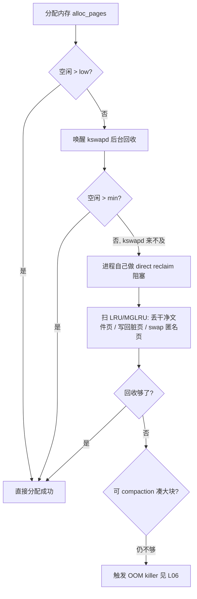

# 精通物理内存管理与回收：伙伴系统、slab、page cache、kswapd、水位线、MGLRU、swap、PSI

> 课程编号：L05
> 路线图来源：Linux · 模块二 内存
> 难度：⭐⭐⭐⭐
> 预计阅读时间：60 分钟
> 内容基准：2026 年 6 月（Linux 6.12 LTS / 6.15+，本篇相关：MGLRU 自 6.1 可用、渐成默认，folio 重构持续推进，PSI 成压力信号事实标准，zswap/zram 主流）

---

## 引言：`free` 说没内存了？

新接手一台机器，一看 `free`，心头一紧：

```bash
$ free -h
               total        used        free      shared  buff/cache   available
Mem:            62Gi        12Gi       1.1Gi       0.3Gi        49Gi        49Gi
Swap:          8.0Gi          0B       8.0Gi
```

`free` 只剩 1.1 GB——是不是要 OOM 了？很多人到这一步就慌着扩容。但看最后一列 `available`：**49 GB**。机器其实健康得很。

真相是：那 49 GB 的 `buff/cache` 几乎全是 **page cache**——内核把读过的文件内容缓存在内存里加速后续访问。这部分内存"用着"但**随时可回收**：一旦应用要内存，内核立刻丢弃干净的缓存页腾出来。所以 `free`（真正没人用的内存）很少是常态、甚至是**好事**——空着的内存就是浪费，内核会尽量拿来当缓存。真正该看的是 `available`（**估算的、不触发 swap 就能给应用用的内存**）。

```
used(12G) + free(1.1G) + buff/cache(49G) = total(62G)
                                  ↓ 其中大部分可回收
available(49G) ≈ free + 可回收的 page cache/slab  ← 这才是“还能给应用多少”
```

这个误会背后，是一整套物理内存的管理与回收机制。本章要回答：

- 物理内存怎么组织？为什么有 DMA / Normal 等 zone？`struct page` 是什么？
- `malloc` 拿到的内存，内核底层怎么分配？为什么有伙伴系统又有 slab？
- page cache 怎么加速 I/O？脏页什么时候、被谁写回磁盘？
- 内存紧张时，谁来回收、回收谁？`kswapd` 和"直接回收"有什么区别（后者为什么让你的请求卡住）？
- swap 到底好不好？`swappiness` 调什么？zram/zswap 是什么？
- 怎么用 PSI 量化"内存压力"，做弹性伸缩？

读完你应能读懂 `/proc/meminfo` 的关键行、解释 `MemAvailable` 怎么算、用水位线和 PSI 判断内存是否真的吃紧、把回收路径和延迟毛刺对上号。本章接 [L04 虚拟内存与分页](./L04-精通-虚拟内存与分页.md)（虚拟页从这里"兑现"成物理页），通向 [L06 OOM 与内存诊断](./L06-精通-OOM-与内存诊断.md)（回收失败后的最后手段）。

---

## 第一章 物理内存组织

### 1.1 node 与 zone

物理内存不是一块均质的大数组，内核分层组织：

```
物理内存
  └─ NUMA node（每个 CPU socket 一个，本地访存快、远端慢）
       └─ zone（按物理地址范围/用途分区）
            └─ page frame（页框，通常 4 KB 一个）
                 └─ struct page（每个页框的元数据）
```

**zone** 是历史与硬件限制的产物。x86-64 上常见：

| zone | 范围 | 为什么单独分 |
|---|---|---|
| `ZONE_DMA` | 低 16 MB | 古老 ISA 设备只能 DMA 到 16 MB 以下 |
| `ZONE_DMA32` | < 4 GB | 32 位 DMA 设备只能寻址 4 GB 以下 |
| `ZONE_NORMAL` | 4 GB 以上 | 绝大多数内存在这里，内核直接映射 |
| `ZONE_MOVABLE` | 可配置 | 只放可迁移页，便于热插拔/大页 compaction |

（32 位时代的 `ZONE_HIGHMEM` 在 64 位上已无意义——内核能直接映射全部物理内存。）

```bash
$ cat /proc/zoneinfo | grep -E 'Node|zone|free|min|low|high' | head -20
Node 0, zone   DMA32
  pages free     123456
        min      2048
        low      2560
        high     3072
...
```

### 1.2 struct page：每个页框的"身份证"

内核为**每一个**物理页框维护一个 `struct page`（约 64 字节）。62 GB 内存 ≈ 1600 万个页框 ≈ 1 GB 的 `struct page` 数组（`mem_map`）——这是固定开销。`struct page` 记录这一页：是匿名页还是文件页、引用计数、在哪条 LRU 链表、是否脏、属于哪个 cgroup 等。它是被高度联合体（union）压缩的结构，不同用途复用同一块字段。

> **folio（2026 关注点）**：内核正从"以单个 4K `struct page` 为中心"迁移到 **folio**——表示一组连续页的抽象（可能是 1 页，也可能是一个大页/复合页）。folio 统一了大页/小页的处理、减少元数据操作开销，对上层 API 透明，但让大页相关路径更高效。读 6.x 源码会越来越多看到 `struct folio` 而非裸 `struct page`。

### 1.3 伙伴系统（buddy）

物理页的分配器是**伙伴系统（buddy allocator）**。它按 **2 的幂**（order）管理空闲页块：order-0 是 1 页（4K），order-1 是 2 页连续（8K），…… order-10 是 1024 页连续（4 MB）。

```
freelist:
  order-0: [4K] [4K] [4K] ...
  order-1: [8K连续] [8K连续] ...
  order-2: [16K连续] ...
  ...
  order-10: [4M连续]
```

- **分配**：要 order-2（16K），若该 order 空，就从 order-3 取一块**劈成两个 order-2 "伙伴"**，给你一个、另一个入 order-2 链表。
- **释放**：释放时检查它的"伙伴"是否也空闲，是则**合并**回上一级——这是伙伴系统名字的由来，能高效对抗碎片。

看实时状态：

```bash
$ cat /proc/buddyinfo
Node 0, zone   Normal  18234  9821  4102  1893  712  301  98  21  4  1  0
#                       ↑order0 ↑1   ↑2 ...                          ↑order10
```

每列是该 order 的空闲块数。**右边（高 order）都是 0，左边一堆 = 外碎片严重**：内存总量够，但凑不出大块连续页。

### 1.4 外碎片与 compaction

应用要连续物理页（如大页 THP、某些 DMA）时，外碎片（external fragmentation）会让分配失败——明明有空闲页，但都是零散的 order-0，凑不出 order-9（2 MB）。

内核的解法是**内存规整（compaction）**：把可移动的页（匿名页、page cache）搬到一端，腾出连续空白：

```
规整前： [用][空][用][空][用][空]   ← 碎，凑不出连续块
规整后： [用][用][用][空][空][空]   ← 连续空白出来了，能分大页
```

```bash
$ cat /proc/vmstat | grep compact
compact_stall 142          # 直接 compaction 触发次数（同步、可能阻塞分配者）
compact_success 98
$ echo 1 > /proc/sys/vm/compact_memory   # 手动触发一次全局规整
```

> **延迟陷阱**：compaction 若在分配路径上**同步**进行（如 THP `defrag=always`），会阻塞申请内存的线程——这正是 [L04](./L04-精通-虚拟内存与分页.md) 讲的 THP 延迟毛刺根源之一。`compact_stall` 高且伴随延迟抖动时要警惕。

---

## 第二章 内核分配器

伙伴系统的最小粒度是一页（4K）。但内核天天要分配几十、几百字节的小对象（`task_struct`、`inode`、`dentry`、网络 `sk_buff`……）。用伙伴系统给一个 256 字节对象分一整页，浪费 93%。于是有了 slab 层。

### 2.1 slab / slub：小对象的对象池

**slab 分配器**（现代内核默认实现是 **SLUB**）在伙伴系统之上，把整页切成同样大小的小对象，做成**对象缓存（cache）**：

```
伙伴系统给一页 ─┐
               ├─▶ SLUB cache "dentry"（每个对象 192B）
                    [obj][obj][obj][obj]...  ← 一页切成 21 个 dentry 槽
```

好处：

- **避免内部碎片**：按对象大小切，浪费小。
- **复用构造好的对象**：释放的对象不立刻还给伙伴系统，留在 cache 里，下次分配直接拿（省去初始化）。
- **per-CPU 缓存**：每个 CPU 有自己的 slab 缓存，分配/释放热路径无锁、cache 友好。

看 slab 用量：

```bash
$ slabtop -o | head
 OBJS ACTIVE  USE OBJ SIZE  SLABS ... NAME
524288 521000 99%   0.19K  ...        dentry
312000 310000 99%   1.05K  ...        ext4_inode_cache
198000 195000 98%   0.50K  ...        kmalloc-512
...
$ cat /proc/meminfo | grep -i slab
Slab:            2451200 kB
SReclaimable:    1980000 kB     # 可回收的 slab（如 dentry/inode 缓存）← 算进 available
SUnreclaim:       471200 kB     # 不可回收的 slab（内核运行必需）
```

> **诊断价值**：`SUnreclaim` 持续猛涨往往是**内核态内存泄漏**（驱动/模块），dentry/inode cache 巨大可能是某进程疯狂 `open`/`stat` 海量文件。slabtop 是排查内核内存的第一工具（见 [L06](./L06-精通-OOM-与内存诊断.md)）。

### 2.2 kmalloc vs vmalloc

内核分配内存的两个主接口：

| 接口 | 物理连续？ | 大小 | 用途 |
|---|---|---|---|
| `kmalloc()` | **是**（物理连续） | 小（受 slab order 限制，通常 ≤ 几 MB） | 绝大多数内核分配、DMA |
| `vmalloc()` | 否（仅虚拟连续，物理可碎） | 可很大 | 大缓冲、模块代码，不需物理连续时 |

`kmalloc` 走 slab（按 `kmalloc-64`/`kmalloc-128`/… 这些通用 cache）。`vmalloc` 直接从伙伴系统取零散页，再在内核虚拟地址空间映射成连续——分配慢、用 TLB、但能要大块。**优先 `kmalloc`，只在需要大块且不要求物理连续时用 `vmalloc`**。

### 2.3 per-CPU 与 page 级分配

- **per-CPU 变量**（`alloc_percpu`）：每个 CPU 一份副本，访问无需锁，用于统计计数器等。
- **页级**：`alloc_pages()` / `__get_free_pages()` 直接向伙伴系统要整页（如分配 page cache 页、用户进程缺页时的页框）。

```c
// 内核代码示意
struct task_struct *t = kmalloc(sizeof(*t), GFP_KERNEL);  // 小对象走 slab
void *big = vmalloc(16 * 1024 * 1024);                    // 16MB，物理可不连续
struct page *p = alloc_pages(GFP_KERNEL, 0);              // 一个 order-0 页框
```

`GFP_*` 标志告诉分配器上下文：`GFP_KERNEL`（可睡眠、可触发回收）、`GFP_ATOMIC`（中断上下文，不能睡，不能回收）、`GFP_NOWAIT` 等——用错（如中断里用 GFP_KERNEL）是经典 bug。

---

## 第三章 page cache

### 3.1 读写都经过 page cache

普通文件 I/O（非 `O_DIRECT`）全部经过 page cache：

```
read():  磁盘 ──(首次,major fault/IO)──▶ page cache ──拷贝──▶ 用户 buffer
         page cache 命中时直接拷贝，不碰磁盘（这就是“第二次读快”）

write(): 用户 buffer ──拷贝──▶ page cache（标记为脏 dirty）──异步回写──▶ 磁盘
         write 返回 ≠ 落盘！数据先在内存，靠回写或 fsync 才到磁盘
```

这就是引言里 `buff/cache` 巨大的来源，也是为什么数据库要 `fsync`（见 [L07 VFS 与文件系统](./L07-精通-VFS-与文件系统.md)）——`write` 返回只代表进了 page cache，断电就丢。

### 3.2 脏页与回写

被 `write` 修改过、尚未落盘的 page cache 页叫**脏页（dirty page）**。脏页由内核的 **writeback** 机制异步刷回磁盘，触发条件由这几个 sysctl 控制：

| sysctl | 含义 | 典型默认 |
|---|---|---|
| `vm.dirty_background_ratio` | 脏页占可用内存比例达此值，**后台** flusher 线程开始异步回写（不阻塞应用） | 10 |
| `vm.dirty_ratio` | 脏页达此更高比例，**写入的进程被迫同步回写**（阻塞！） | 20 |
| `vm.dirty_background_bytes` / `vm.dirty_bytes` | 用绝对字节代替比例（设了 bytes 则 ratio 失效） | 0 |
| `vm.dirty_expire_centisecs` | 脏页最长存活时间，超时强制回写 | 3000（30s） |
| `vm.dirty_writeback_centisecs` | flusher 线程唤醒间隔 | 500（5s） |

```bash
$ cat /proc/meminfo | grep -iE 'dirty|writeback'
Dirty:            204800 kB     # 当前脏页量
Writeback:          1024 kB     # 正在回写中的量
```

执行回写的是内核 flusher 线程（`kworker`/老叫 `pdflush`，per-backing-device 一个），把脏页按设备组织起来批量写。

### 3.3 dirty_ratio 的延迟陷阱

`dirty_background_ratio`（默认 10%）和 `dirty_ratio`（默认 20%）之间是"安全缓冲"。问题在大内存机器上：62 GB × 20% = **12 GB 脏页**才触发同步回写。若写入速率突然超过磁盘吞吐，脏页堆到 `dirty_ratio`，**所有写进程被强制同步刷盘、集体卡住**，延迟巨大毛刺：

```
脏页量
 │                    ╱╲ 写入突发
 │         dirty_ratio─┼──── 到这条线：写进程被迫同步回写 → 卡顿！
 │  background_ratio───┼─ 到这条线：后台异步回写（应用无感）
 │_____________________╱______________ 时间
```

修法：大内存写密集机器把 `dirty_ratio`/`dirty_background_ratio` 调小（或用 `dirty_bytes` 设绝对值，如 background 256MB / ratio 512MB），让回写更平滑、避免脏页堆积成"水库决堤"。数据库、Kafka 等常这么调（呼应 [redis/pg 调优](../postgresql/) 思路）。

---

## 第四章 内存回收

当空闲内存下降，内核要回收（reclaim）：丢弃干净的 page cache、把脏页写回后回收、把匿名页换出（swap）。核心机制是**水位线 + LRU**。

### 4.1 三条水位线：min / low / high

每个 zone 有三条水位线，决定回收的时机和方式：

```
空闲页数
  │
  │  high ────────── 回收到这条线以上就停（kswapd 的目标）
  │   ▲ kswapd 后台回收（异步，不阻塞应用）
  │  low ─────────── 跌破这条：唤醒 kswapd 开始后台回收
  │   ▲
  │  min ─────────── 跌破这条：触发“直接回收”（同步，阻塞申请者！）
  │                  min 以下是给原子分配/紧急用的保留水位
  └──────────────────────────────
```

| 水位 | 跌破时发生什么 |
|---|---|
| `low` | 唤醒 `kswapd`（per-node 内核线程），**后台异步回收**，应用基本无感 |
| `min` | 申请内存的进程自己做**直接回收（direct reclaim）**——**同步、阻塞在分配调用里**，延迟毛刺来源 |
| `high` | kswapd 回收到此停手 |

```bash
$ cat /proc/zoneinfo | grep -A1 'zone   Normal' | grep -E 'min|low|high'
        min      11264
        low      14080
        high     16896
$ sysctl vm.min_free_kbytes        # 调 min 水位（影响 low/high 联动）
vm.min_free_kbytes = 90112
```

`min_free_kbytes` 调大 → 三条线整体抬高 → kswapd 更早介入、更不容易跌到 min（更少直接回收），代价是常驻空闲更多内存。突发分配型/网络密集机器常适当调大它。

### 4.2 kswapd（后台）vs 直接回收（前台阻塞）

这是本章最重要的区分，直接关系延迟：

| | kswapd 后台回收 | 直接回收 direct reclaim |
|---|---|---|
| 触发 | 空闲跌破 `low` | 分配时空闲跌破 `min`、kswapd 来不及 |
| 谁干 | 独立的 kswapd 内核线程 | **申请内存的那个进程自己**，在 `alloc_pages` 里 |
| 是否阻塞应用 | 否（异步） | **是！进程卡在分配调用上同步回收** |
| 延迟影响 | 小 | **大——延迟毛刺、卡顿的元凶** |

```bash
$ cat /proc/vmstat | grep -E 'pgscan|pgsteal|allocstall'
pgscan_kswapd 12000000      # kswapd 扫描的页
pgscan_direct 230000        # 直接回收扫描的页 ← 非0且增长 = 有进程在被迫同步回收
allocstall_normal 1820      # 直接回收发生次数 ← 这个涨 = 内存压力大、有卡顿
pgsteal_direct 180000       # 直接回收实际收回的页
```

**`allocstall` / `pgscan_direct` 持续增长 = 你的应用正在因为等内存回收而卡顿**。修法：调大 `min_free_kbytes` 让 kswapd 早动手、加内存、减内存占用，或开启更高效的回收（MGLRU，见下）。

### 4.3 LRU：active / inactive 双链表

内核怎么决定回收哪些页？经典做法是 **LRU（最近最少使用）近似**。每个 node 维护几组 LRU 链表，区分匿名页（anon）和文件页（file），每组又分 **active / inactive**：

```
文件页:  [active list]  ◀── 频繁访问的留在 active
            │ 老化下沉
         [inactive list] ◀── 回收候选，从尾部回收
匿名页:  [active] / [inactive]（回收需 swap 支撑）
```

- 新页进 inactive，被再次访问则提升到 active；active 里冷下来的降回 inactive。
- 回收从 inactive 尾部下手（最久没用的）。
- 干净文件页直接丢弃（磁盘还有），脏页先写回再丢，匿名页必须 swap 出去。

`vm.swappiness`（见第五章）调节回收时**偏向换出匿名页还是丢弃文件页**。

### 4.4 MGLRU：多代 LRU（2026 重点）

经典两级 active/inactive LRU 在大内存机器上扫描成本高、判断"冷热"不够准。**MGLRU（Multi-Gen LRU，多代 LRU）** 自 **6.1 可用、渐成主流/默认**，用**多个"代（generation）"**更细粒度地分层页面的年龄：

```
经典 LRU：只有 active / inactive 两档，冷热判断粗
MGLRU：   gen0(最热) gen1 gen2 ... genN(最冷)  ← 多代分层
          按访问位老化，回收从最老的代取，扫描更少、命中更准
```

收益：回收时**扫描的页更少、决策更准、CPU 开销更低**，在内存压力下尾延迟和回收效率都更好，尤其利好大内存、混部、容器密集场景。

```bash
# 查看/控制 MGLRU（6.1+，需 CONFIG_LRU_GEN）
$ cat /sys/kernel/mm/lru_gen/enabled
0x0007          # 非0表示启用（位掩码控制特性）
$ cat /sys/kernel/debug/lru_gen        # 各 memcg 的代分布（调试）
```

> 现状：MGLRU 在 6.1+ 已稳定，多数新发行版默认开启或可一键开。升级后内存压力下的行为会比老 LRU 更平滑，但回收相关的旧调优（如对 swappiness 的某些经验值）可能需重测。

### 4.5 回收路径全景



---

## 第五章 swap

### 5.1 swap 是什么、何时用

swap 是把**匿名页**（堆、栈等没有文件后备的页）换出到磁盘/swap 分区，腾出物理内存。文件页不用 swap（它们本就有磁盘后备，直接丢弃即可，需要时重读）。

swap 不是"内存不够的耻辱"，而是回收的一个维度：把**冷的匿名页**换出，给热数据和 page cache 腾地方，整体更优。但 swap 在磁盘上，访问被换出的页要 major fault 从磁盘读回——**慢几个数量级**，所以滥用 swap 会带来灾难性延迟（swap 颠簸 thrashing）。

### 5.2 swappiness

`vm.swappiness`（0~200，默认 60）调节回收时**换出匿名页 vs 丢弃文件页**的倾向：

| swappiness | 倾向 |
|---|---|
| 高（如 100+） | 更愿意 swap 匿名页（保留 page cache） |
| 低（如 10） | 尽量不 swap，先回收文件页 |
| 0 | 几乎不主动 swap（仍可能在极端下 swap） |

```bash
$ sysctl vm.swappiness
vm.swappiness = 60
$ sysctl -w vm.swappiness=10        # 数据库/延迟敏感常调低
```

> 注意：6.x 内核里 swappiness 上限从 100 提到 **200**，且 MGLRU 改变了它的内部权重计算——老的"数据库一律设 0/1"经验要结合实测。设为 0 也不代表绝对不 swap。

### 5.3 zram 与 zswap：压缩换出

物理磁盘 swap 太慢，现代方案用**内存内压缩**：

| 技术 | 原理 | 定位 |
|---|---|---|
| **zram** | 在内存里建一块**压缩的块设备**当 swap，匿名页压缩后存内存（不落盘） | 无盘/省盘、桌面/容器/嵌入式常用；ChromeOS、Fedora 默认 |
| **zswap** | page cache 式的**压缩缓冲**，挡在真正的磁盘 swap 前；冷页先压缩留内存，更冷才落盘 | 有磁盘 swap 时减少慢速 swap I/O |

两者都用 CPU 换 I/O：压缩/解压花 CPU，但比磁盘 swap 快几个数量级，能把"swap = 卡死"缓解成"swap = 略慢"。

```bash
# zram 示例
$ sudo modprobe zram
$ echo lz4 > /sys/block/zram0/comp_algorithm
$ echo 4G  > /sys/block/zram0/disksize
$ sudo mkswap /dev/zram0 && sudo swapon -p 100 /dev/zram0   # 高优先级
$ zramctl                       # 看压缩比与占用
```

### 5.4 swap 对延迟的影响

```bash
$ vmstat 1
 r  b   swpd   free  ...  si  so   ...
 2  0  102400  500M  ...  2048 4096        # si/so = swap in/out KB/s
```

`si`/`so`（swap in/out）持续非零、尤其 `si` 高（在把页换回来）= 工作集放不下、在**颠簸**。容器场景里 cgroup v2 可单独控制 swap（`memory.swap.max`），K8s 默认禁 swap（虽然较新版本开始支持 NodeSwap，见 [L17](./L17-精通-Cgroup-v2.md) 与 [cloud-native C06](../cloud-native/C06-精通-Scheduling-与资源管理.md)）。

---

## 第六章 内存压力 PSI

### 6.1 为什么 load average / free 不够

判断"内存是否吃紧"，老办法（free 少、swap 在动）都是**间接信号**，且滞后。你真正想知道的是：**有多少时间，任务因为等内存而干不了活？** 这正是 **PSI（Pressure Stall Information）** 量化的东西。

### 6.2 some / full 两个维度

PSI 在 `/proc/pressure/{cpu,memory,io}` 暴露，内存为例：

```bash
$ cat /proc/pressure/memory
some avg10=2.34 avg60=1.10 avg300=0.45 total=12345678
full avg10=0.89 avg60=0.30 avg300=0.12 total=4567890
```

- **some**：**至少一个**任务因等内存而停滞的时间占比（部分任务卡，系统还在动）。
- **full**：**所有**非 idle 任务都因等内存停滞的时间占比（整个系统在那段时间几乎干不了活，最严重）。
- `avg10/60/300`：过去 10/60/300 秒的百分比；`total`：累计微秒。

解读：`some` 高 = 有内存压力（部分任务在等回收/major fault）；`full` 显著非零 = 严重，整机被内存拖死。比 load average（混入 D 状态、含义模糊，见 [L18 性能诊断](./L18-精通-性能诊断方法论与工具.md)）精准得多。

### 6.3 cgroup PSI 与弹性伸缩

每个 cgroup v2 也有自己的 PSI（`memory.pressure`），可精确知道**某个容器/服务**的内存压力：

```bash
$ cat /sys/fs/cgroup/myservice/memory.pressure
some avg10=5.20 ...
```

实践用途：

- **弹性伸缩信号**：用 cgroup `memory.pressure` 的 `some/full` 做扩容触发器，比"内存利用率 80%"更贴近真实痛感（利用率高但无压力 = 健康的缓存；利用率不高但 full 压力大 = 真出问题）。
- **systemd-oomd**：用户态 OOM 守护，基于 PSI 在系统**真正卡死前**主动杀掉压力最大的 cgroup，避免传统内核 OOM 的滞后（见 [L06](./L06-精通-OOM-与内存诊断.md)、[L20 systemd](./L20-精通-systemd-与启动流程.md)）。
- **PSI 触发器**：程序可 `poll()` 一个 PSI 文件，压力超阈值时被唤醒，实现自适应降载。

```c
// PSI 监控触发器示意（内存 some 压力 >150ms/1s 即唤醒）
int fd = open("/proc/pressure/memory", O_RDWR | O_NONBLOCK);
write(fd, "some 150000 1000000", 19);   // 阈值 150ms / 窗口 1s
struct pollfd p = { .fd = fd, .events = POLLPRI };
poll(&p, 1, -1);                          // 压力达标即返回，可触发降载/扩容
```

### 6.4 把指标串起来

```
现象              该看的指标
──────────────────────────────────────────
内存够不够？       MemAvailable（不是 free）
有没有压力？       /proc/pressure/memory 的 some/full
在不在颠簸 swap？  vmstat si/so
在不在卡同步回收？ vmstat 的 pgscan_direct / allocstall
脏页会不会决堤？   /proc/meminfo Dirty + dirty_ratio
内核内存泄漏？     slabtop / SUnreclaim
```

---

## 生产实践

1. **监控盯 `MemAvailable` 与 PSI，别盯 `free`**。`free` 少几乎是常态（内存拿去当 cache 了）。真正的告警基线是 `MemAvailable` 偏低 + `/proc/pressure/memory` 的 `some/full` 升高；容器用 cgroup `memory.pressure`。

2. **直接回收是延迟元凶，量它**。`grep -E 'allocstall|pgscan_direct' /proc/vmstat` 持续增长就是有进程在同步回收卡顿。缓解：调大 `vm.min_free_kbytes` 让 kswapd 早动手、加内存、降占用、开 MGLRU。

3. **大内存写密集机器调小 dirty 阈值**。默认 `dirty_ratio=20%` 在 64GB 机上意味着 12GB 脏页才同步刷，易决堤。用 `vm.dirty_bytes`/`dirty_background_bytes` 设绝对值（如 512MB/256MB）让回写平滑。数据库、Kafka、日志机尤其需要。

4. **swap 别一刀切关，用对场景**。延迟敏感服务调低 `swappiness`（如 10）但保留少量 swap 兜底；容器/桌面用 **zram**（压缩内存 swap）比磁盘 swap 体验好得多；用 `vmstat si/so` 确认有没有颠簸。

5. **slabtop 排查内核内存**。`free` 显示内存被吃但找不到用户进程时，看 `SUnreclaim` 和 `slabtop`——dentry/inode cache 暴涨多半是某进程狂 open/stat 文件，`SUnreclaim` 涨多半是内核/驱动泄漏。

6. **升级 6.1+ 后用好 MGLRU**。确认 `/sys/kernel/mm/lru_gen/enabled` 已开，内存压力下的回收会更平滑高效；同时重测依赖 swappiness 的老调优，行为可能变。

---

## 陷阱清单

1. **现象**：`free` 显示 free 只剩几百 MB，团队紧急扩容。
   **原因**：内存几乎都被 page cache 占用（buff/cache），但这部分随时可回收，`available` 其实很大。
   **修法**：看 `free` 的 `available` 列或 `/proc/meminfo` 的 `MemAvailable`；监控告警基于 `MemAvailable` + PSI，而非 `free`。

2. **现象**：服务 P99 偶发几十~几百毫秒毛刺，CPU/磁盘都不满。
   **原因**：内存跌破 `min` 水位，申请内存的线程被迫做直接回收（direct reclaim），同步扫 LRU/写回脏页/swap，卡在分配调用里。
   **修法**：`grep allocstall /proc/vmstat` 确认；调大 `vm.min_free_kbytes`、加内存、降占用、开 MGLRU 让 kswapd 提前后台回收。

3. **现象**：写大文件/批量入库时整机周期性卡死，所有写操作一起停顿。
   **原因**：脏页堆到 `dirty_ratio`（默认 20%），所有写进程被迫同步回写磁盘，磁盘吞吐成瓶颈。
   **修法**：调小 `vm.dirty_ratio`/`dirty_background_ratio` 或改用 `dirty_bytes` 绝对值；提升磁盘吞吐；`/proc/meminfo` 的 `Dirty` 观察堆积。

4. **现象**：机器有 swap，应用偶发卡顿几秒，`vmstat` 的 `si` 飙高。
   **原因**：工作集放不下，热的匿名页被换出后又要换回（swap 颠簸 thrashing），major fault 走磁盘极慢。
   **修法**：加内存/降占用让工作集放得下；降 `swappiness`；用 zram/zswap 把 swap 加速；容器用 `memory.swap.max` 控制。

5. **现象**：申请 THP / 大页时分配失败或慢，`/proc/buddyinfo` 高 order 全是 0。
   **原因**：外碎片严重，凑不出连续大块；同步 compaction 还会阻塞申请者。
   **修法**：早期（未碎片化时）预留大页；`echo 1 > /proc/sys/vm/compact_memory` 手动规整；THP 用 `defrag=defer+madvise` 避免同步规整（见 [L04](./L04-精通-虚拟内存与分页.md)）。

6. **现象**：`free` 显示内存被大量占用，但所有用户进程 RSS 加起来对不上。
   **原因**：内核态内存（slab）占用大——`SUnreclaim` 泄漏，或 dentry/inode cache（`SReclaimable`）被海量小文件操作撑大。
   **修法**：`slabtop -o` 看哪个 cache 大；`SUnreclaim` 涨查内核模块/驱动泄漏；dentry 大查狂扫文件的进程；必要时 `echo 2 > /proc/sys/vm/drop_caches`（仅排查用，生产慎用）。

7. **现象**：调低 `vm.swappiness=0` 后以为绝不 swap，结果仍观察到 swap。
   **原因**：swappiness=0 只是极力避免，内存极度紧张时内核仍可能 swap 匿名页以避免 OOM；且 6.x 的内部权重已变。
   **修法**：理解 swappiness 是倾向不是开关；要完全禁用得 `swapoff` 或 cgroup `memory.swap.max=0`；调优后用 `si/so` 实测。

8. **现象**：容器内存利用率才 70%，却频繁触发扩容或 OOM。
   **原因**：只看利用率误判——cache 占的利用率是健康的；真正的痛苦在 PSI。或 cgroup limit 偏小导致频繁回收/直接回收。
   **修法**：用 cgroup `memory.pressure` 的 `some/full` 作为伸缩与告警信号；区分 `memory.current` 里 cache 与 anon；调整 limit 或换 PSI 驱动的伸缩（见 [L06](./L06-精通-OOM-与内存诊断.md)、[cloud-native C06](../cloud-native/C06-精通-Scheduling-与资源管理.md)）。

---

## 2026 现状

- **MGLRU 渐成默认**：多代 LRU 自 6.1 可用，6.x 多数新发行版默认开启，内存压力下回收扫描更少、决策更准、尾延迟更平滑，尤其利好大内存与容器密集混部。
- **folio 重构持续推进**：内存管理从"以 4K `struct page` 为中心"迁移到 folio（连续页抽象），统一大页/小页处理、降低元数据开销，对上层透明，让大页路径更高效。
- **PSI 成压力信号事实标准**：`/proc/pressure/*` 与 cgroup `*.pressure` 的 `some/full` 取代"看 free/load"成为内存（与 CPU/IO）压力的权威信号；systemd-oomd 基于 PSI 在卡死前主动 OOM。
- **zram/zswap 主流化**：压缩内存 swap 在桌面（Fedora/ChromeOS 默认 zram）、容器、云主机普及，把 swap 从"卡死"降级为"略慢"；cgroup v2 可独立控 swap（`memory.swap.max`/`memory.swap.high`）。
- **大内存机器的回写调优常态化**：高内存写密集负载普遍把 `dirty_bytes`/`min_free_kbytes` 显式调小/调大以平滑回写与回收，避免脏页决堤与直接回收卡顿。

参见 [L04 虚拟内存与分页](./L04-精通-虚拟内存与分页.md)（虚拟页如何兑现成物理页、THP/compaction）、[L06 OOM 与内存诊断](./L06-精通-OOM-与内存诊断.md)（回收失败的兜底、meminfo 逐行、RSS/PSS）、[L07 VFS 与文件系统](./L07-精通-VFS-与文件系统.md)（page cache 与 fsync 语义）、[L17 Cgroup v2](./L17-精通-Cgroup-v2.md)（memory 控制器与 swap 控制）、[L18 性能诊断](./L18-精通-性能诊断方法论与工具.md)（PSI/vmstat 方法论），以及跨专题 [cloud-native C06 资源管理](../cloud-native/C06-精通-Scheduling-与资源管理.md)。

---

## 练习题

1. 在一台机器上 `free -h` 后解释每一列，手算 `used + free + buff/cache` 是否等于 `total`，并说明 `available` 为什么远大于 `free`。

2. 用 `cat /proc/buddyinfo` 观察各 order 空闲块；跑一些大文件读写后再看，解释为什么高 order 块数会减少（碎片化），以及 compaction 能做什么。

3. 区分 kswapd 后台回收与直接回收（direct reclaim）：谁触发、谁执行、是否阻塞应用？用 `/proc/vmstat` 的哪些计数器能证明"应用正在被迫直接回收"？

4. 解释 active/inactive LRU 与 MGLRU 多代 LRU 的区别。MGLRU 主要改善了回收的哪两个方面？怎么查它是否启用？

5. 在 62 GB 内存机器上，`dirty_ratio=20` 意味着多少脏页才触发同步回写？为什么写密集场景这是个隐患？给出用 `dirty_bytes` 的更稳妥配置。

6. 解释 `vm.swappiness` 调的是什么倾向。为什么把它设成 0 也不能保证绝对不 swap？要真正禁用 swap 该怎么做？

7. （实战）一台机器 `free` 显示内存几乎用满，但所有进程 RSS 之和远小于此。给出排查步骤（提示：slabtop、SReclaimable vs SUnreclaim、谁在狂 open 文件），并区分"健康的 cache"与"内核泄漏"。

8. （排障）某服务 P99 周期性出现几十毫秒毛刺，`vmstat` 显示 `si/so` 为 0 但 `allocstall` 持续增长、`/proc/pressure/memory` 的 `some` 偏高。判断是哪类内存问题（不是 swap），解释机制，给出至少三种缓解手段。

---

## 参考答案

1. 各列含义：`total` 总内存；`used` 应用与内核实际占用（不含可回收 cache）；`free` 完全无人使用的空闲内存；`shared` tmpfs/共享内存；`buff/cache` page cache + 缓冲 + 可回收 slab；`available` 估算的不触发 swap 就能给应用用的内存。`used + free + buff/cache = total`（粗略相等，shared 含在 cache 内）。`available` 远大于 `free` 是因为 `buff/cache` 中的干净 page cache 随时可回收，available ≈ free + 大部分可回收的 cache/可回收 slab，所以"free 少"是内核把内存拿去做缓存的正常现象。

2. `/proc/buddyinfo` 每列是某 order 的空闲连续块数，左边低 order、右边高 order。大量文件读写后内核分配了许多零散页（page cache 页等），释放回来的页不一定能与伙伴合并，导致高 order 块数减少——这就是外碎片：总空闲页够，但凑不出连续大块。compaction（内存规整）把可移动页搬到一端，腾出连续空白，重新凑出高 order 块，使大页/连续分配能成功。

3. kswapd 后台回收：空闲跌破 `low` 水位时唤醒，由独立的 kswapd 内核线程异步执行，回收到 `high` 停手，应用基本无感、不阻塞。直接回收（direct reclaim）：分配时空闲已跌破 `min`、kswapd 来不及，由申请内存的那个进程自己在 `alloc_pages` 里同步回收，阻塞在分配调用上，是延迟毛刺的元凶。证明应用被迫直接回收的计数器：`/proc/vmstat` 的 `allocstall_*`（直接回收发生次数）和 `pgscan_direct`/`pgsteal_direct`（直接回收扫描/收回的页），持续非零且增长即是。

4. 经典 LRU 只有 active/inactive 两档链表，冷热判断粗、大内存下扫描成本高。MGLRU（多代 LRU）用多个"代（generation）"按访问位老化把页面分层（gen0 最热到 genN 最冷），回收从最老的代取。MGLRU 主要改善：(1) 回收时扫描的页更少、CPU 开销更低；(2) 冷热判断更准、内存压力下尾延迟更平滑。查是否启用：`cat /sys/kernel/mm/lru_gen/enabled`，非 0（位掩码）即启用。

5. 62 GB × 20% = 约 12.4 GB 脏页才触发 `dirty_ratio` 的同步回写。写密集场景的隐患：脏页可堆积到十几 GB 才强制刷盘，一旦写入速率超过磁盘吞吐、脏页堆到 `dirty_ratio`，所有写进程被迫同步回写、集体卡住，形成"水库决堤"式的巨大延迟毛刺。更稳妥配置：用绝对字节而非比例，例如 `vm.dirty_background_bytes=268435456`（256MB）、`vm.dirty_bytes=536870912`（512MB），让后台回写尽早平滑启动、脏页上限受控。

6. `vm.swappiness` 调的是回收时"换出匿名页 vs 丢弃/回收文件页"的倾向：值越高越愿意 swap 匿名页（保 page cache），越低越倾向先回收文件页。设成 0 也不能保证绝不 swap：它只是极力避免主动 swap，当内存极度紧张、文件页已无可回收时，内核仍会 swap 匿名页以避免 OOM；且 6.x 内部权重计算已变。要真正禁用 swap：`swapoff -a`（关闭所有 swap 设备），或在 cgroup v2 中设 `memory.swap.max=0` 禁止该 cgroup 使用 swap。

7. 排查步骤：(1) 既然进程 RSS 之和远小于已用内存，怀疑内核态内存——看 `/proc/meminfo` 的 `Slab`、`SReclaimable`、`SUnreclaim`；(2) `slabtop -o` 看哪个 cache 最大；(3) 若是 `SReclaimable` 大、dentry/`*_inode_cache` 巨大，说明某进程在狂 `open`/`stat` 海量文件撑大目录项/inode 缓存——这是"健康的 cache"（可回收，内存紧张时自动归还），可定位元凶进程；(4) 若是 `SUnreclaim` 持续猛涨，是不可回收内核内存，多为驱动/内核模块泄漏——这是真问题，需查内核模块。区分关键：`SReclaimable`（健康、可回收）vs `SUnreclaim`（泄漏嫌疑、不可回收）。排查可临时 `echo 2 > /proc/sys/vm/drop_caches` 看可回收部分能否释放（生产慎用）。

8. 这是直接回收（direct reclaim）导致的延迟问题，不是 swap（`si/so` 为 0 排除了换页颠簸）。机制：空闲内存跌破 `min` 水位且 kswapd 来不及回收，申请内存的线程被迫在分配路径上同步做回收——扫 LRU/MGLRU、写回脏页、丢弃文件页，卡在 `alloc_pages` 里，造成周期性毛刺；`allocstall` 增长正是直接回收发生的证据，PSI `some` 偏高表明有任务因等内存停滞。缓解手段：(1) 调大 `vm.min_free_kbytes`，抬高三条水位线让 kswapd 更早后台回收、减少跌到 min 的直接回收；(2) 加内存或降低应用内存占用，使工作集和 cache 留有余量；(3) 升级/启用 MGLRU 让回收更高效平滑；(4) 检查是否有大量脏页拖慢回收（调 dirty 阈值），或减少瞬时大块内存分配的突发。
