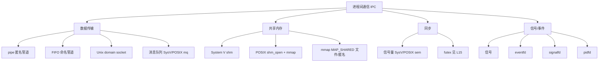

# 精通信号与进程间通信：可靠信号、实时信号、异步信号安全、共享内存、eventfd/signalfd/pidfd

> 课程编号：L14
> 路线图来源：Linux · 模块五 IPC 与内核同步
> 难度：⭐⭐⭐⭐
> 预计阅读时间：60 分钟
> 内容基准：2026 年 6 月（Linux 6.12 LTS / 6.15+，本篇相关：pidfd 已成熟、signalfd/eventfd/timerfd 标配、io_uring 可处理部分 IPC）

---

## 引言：你按下 Ctrl+C 的那一刻，内核做了什么

在终端里跑一个死循环的程序，按下 `Ctrl+C`，它就退出了。这件事每天发生几百次，但很少有人能完整说清这中间的链路：

```
键盘 Ctrl+C
  → 终端线路规程（line discipline, n_tty）识别到 VINTR 字符（默认 0x03）
  → 内核向「前台进程组」的每个进程发送 SIGINT（kill_pgrp）
  → 信号挂到目标进程 task_struct 的 pending 集合
  → 该进程下次从内核态返回用户态前，检查到有未决信号
  → 默认处置（SIG_DFL）是终止进程 → do_exit()
```

注意几个反直觉的点：

1. **`Ctrl+C` 不是发给「当前程序」，而是发给整个前台进程组**。如果你的 shell 管道里有三个进程，三个都会收到 SIGINT。
2. **信号不是「立刻」打断程序的**。它先被记录在 `task_struct` 里，真正被处理是在进程**下一次跨越用户态/内核态边界**时（系统调用返回、中断返回、被调度回来）。一个纯用户态死循环若从不进内核，信号会在它被时钟中断打断时投递。
3. **同样按 `Ctrl+\`（VQUIT）发的是 SIGQUIT，默认行为是终止 + core dump**；按 `Ctrl+Z`（VSUSP）发的是 SIGTSTP，把进程挂起。同一个键盘，三种信号，三种处置。

再看另一个场景。你写了一个 Go HTTP 服务，部署在 Kubernetes 里。Pod 被删除时，kubelet 先发 `SIGTERM`，等 `terminationGracePeriodSeconds`（默认 30s）后再发 `SIGKILL`。如果你的服务没有正确处理 SIGTERM——不关闭监听、不等待 in-flight 请求结束——用户就会看到连接被硬切断的 502。**「优雅停机」这个面试高频题，本质就是信号处理 + 资源回收**。这一篇我们就从信号的内核机制讲到现代的 fd 化 IPC，把「执行流之间怎么说话、怎么协调退出」彻底讲透。

信号只是进程间通信（IPC）的一种——而且是最古老、语义最别扭的一种。它能传递的信息少得可怜（一个编号，实时信号能多带一个 4 字节/指针的值），处理时机不确定，还有一大堆「异步信号安全」的坑。所以本篇后半段会展开完整的 IPC 谱系：pipe / FIFO、System V 与 POSIX 的共享内存 / 消息队列 / 信号量，最后落到 2026 年真正的现代做法——把信号、定时器、事件、进程退出统统变成**文件描述符**，塞进一个 `epoll`（或 `io_uring`）事件循环里统一处理。

---

## 第一章 信号机制：编号、可靠性与投递

### 1.1 信号是什么：一个异步的「软件中断」

信号（signal）是内核（或另一个进程）发给某个进程/线程的**异步通知**，告诉它「发生了某件事」。它在概念上类似硬件中断：打断正常执行流，跳去执行一段处理逻辑，再（可能）返回。但信号是**软件层面**的，由内核在用户态/内核态边界上模拟出来。

每个信号有一个编号和一个默认处置（disposition）。在 Linux 上用 `kill -l` 看全部：

```bash
$ kill -l
 1) SIGHUP       2) SIGINT       3) SIGQUIT      4) SIGILL       5) SIGTRAP
 6) SIGABRT      7) SIGBUS       8) SIGFPE       9) SIGKILL     10) SIGUSR1
11) SIGSEGV     12) SIGUSR2     13) SIGPIPE     14) SIGALRM     15) SIGTERM
16) SIGSTKFLT   17) SIGCHLD     18) SIGCONT     19) SIGSTOP     20) SIGTSTP
21) SIGTTIN     22) SIGTTOU     23) SIGURG      24) SIGXCPU     25) SIGXFSZ
26) SIGVTALRM   27) SIGPROF     28) SIGWINCH    29) SIGIO       30) SIGPWR
31) SIGSYS      34) SIGRTMIN  35) ... 64) SIGRTMAX
```

几个关键事实：

- **编号 1–31 是标准信号**（标准信号也叫「不可靠信号」，下文解释为何）；
- **编号 34–64 是实时信号**（`SIGRTMIN` 到 `SIGRTMAX`，POSIX.1b 引入）；
- **32、33 被 glibc 的 NPTL 线程库内部占用**（线程管理与 setxid），所以应用看到的 `SIGRTMIN` 实际是 34 而非 32；
- 编号在不同架构上略有差异（这里是 x86-64/常见 arch），所以代码里**永远用名字（`SIGINT`），不要用裸数字**。

默认处置共有五种：

| 处置 | 含义 |
|---|---|
| **Term** | 终止进程 |
| **Core** | 终止进程并产生 core dump（如 SIGSEGV / SIGABRT / SIGQUIT） |
| **Ign** | 忽略（如 SIGCHLD / SIGURG / SIGWINCH 默认就忽略） |
| **Stop** | 暂停进程（SIGSTOP / SIGTSTP / SIGTTIN / SIGTTOU） |
| **Cont** | 若进程被暂停则继续（SIGCONT） |

### 1.2 标准信号为什么「不可靠」

「不可靠」指的不是信号会丢失给丢了，而是**标准信号不排队**。

`task_struct` 里对每个执行流维护一个未决信号集合 `pending`（本质是一个位图 `sigset_t` + 一个排队链表）。对标准信号（1–31），未决状态只用**位图的一个 bit** 表示：

```
信号集合（sigset_t，64 bit 位图）：
  bit 1   bit 2   ...   bit 15(SIGTERM)  ...
  [ 0 ]   [ 1 ]         [ 1 ]
            ↑SIGINT 已挂起        ↑SIGTERM 已挂起
```

这意味着：如果 SIGINT 已经处于未决状态（bit 已置位），此时又来三个 SIGINT，**bit 还是那个 bit，三个被合并成一个**。进程最终只会看到一次 SIGINT。这就是「标准信号不排队、可能丢失计数」的由来——你**不能用标准信号做精确计数**（比如「来了多少个事件」）。

而**实时信号会排队**：内核为每个实时信号实例分配一个 `sigqueue` 结构挂到链表上，发 N 次就排 N 个，按顺序投递（同号按发送顺序，不同号按编号从小到大）。这就是「实时/可靠信号」名字的来源。

```c
/* 简化的内核结构（来自 include/linux/sched/signal.h 与 signal.h 概念）*/
struct sigpending {
    struct list_head list;   /* sigqueue 链表，实时信号排在这里 */
    sigset_t signal;         /* 64-bit 位图，标准信号用 bit 表示 */
};
```

### 1.3 标准信号 vs 实时信号对比

| 维度 | 标准信号 (1–31) | 实时信号 (SIGRTMIN–SIGRTMAX) |
|---|---|---|
| 是否排队 | 否（同号合并为 1 个） | 是（每个实例排队） |
| 投递顺序 | 不保证 | 同号 FIFO，不同号按编号升序 |
| 携带数据 | 仅编号（`sigaction` 下有 `siginfo_t`，但内容由内核填） | 可带 `union sigval`（`int` 或指针，经 `sigqueue()` 发送） |
| 预定义语义 | 有（SIGSEGV 等含义固定） | 无（应用自定义） |
| 典型用途 | 进程控制、错误通知 | 应用级精确事件通知 |

发送带数据的实时信号：

```c
#include <signal.h>
union sigval v = { .sival_int = 42 };
sigqueue(target_pid, SIGRTMIN, v);   /* 接收方在 siginfo->si_value 拿到 42 */
```

接收方需用 `sigaction` + `SA_SIGINFO` 才能拿到 `siginfo_t`（下一章细讲）。

### 1.4 task_struct 里的 pending 与 blocked

线程模型（见 [L02 进程与线程模型](./L02-精通-进程与线程模型.md)）下，信号有「进程级」和「线程级」之分，这是最容易出错的地方：

- 用 `kill(pid, sig)` 发给**进程**：信号挂到**共享的** `signal_struct->shared_pending`，**线程组里任意一个没屏蔽它的线程**都可能处理它；
- 用 `tgkill(tgid, tid, sig)` / `pthread_kill()` 发给**特定线程**：挂到那个线程的 `task_struct->pending`；
- **`blocked`（信号掩码）是每线程私有的**。每个线程可以独立屏蔽信号。

```
线程组（thread group / 进程）
┌─────────────────────────────────────────────┐
│  signal_struct                               │
│    shared_pending  ← kill(pid) 发到这里        │
│                                              │
│  ┌──────────┐  ┌──────────┐  ┌──────────┐   │
│  │ thread A │  │ thread B │  │ thread C │   │
│  │ pending  │  │ pending  │  │ pending  │   │  ← tgkill 发到对应线程
│  │ blocked  │  │ blocked  │  │ blocked  │   │  ← 每线程独立掩码
│  └──────────┘  └──────────┘  └──────────┘   │
└─────────────────────────────────────────────┘
```

**实战推论**：在多线程程序里（包括所有 Go 程序，runtime 是多线程的），用 `kill(pid)` 发的信号会被**任意一个**线程处理。所以正确做法是：**指定一个线程专门处理信号，其余线程全部屏蔽该信号**。Go runtime 已经替你做了这件事（专门的信号处理 M），这也是为什么 Go 里你用 `signal.Notify` 就行，不用关心是哪个 goroutine。

### 1.5 信号的投递时机

信号被「产生」（generate）和被「投递」（deliver）是两件事：

```
产生：kill() / 异常 / 内核事件
       ↓ 置位 pending 集合
   （等待……可能等很久）
       ↓
投递：进程下次从内核态返回用户态前，do_signal() 检查 pending & ~blocked
       ↓ 执行处置（默认/忽略/调用 handler）
```

关键：**信号只在「内核态 → 用户态」的边界上被检查投递**。检查点包括：

- 系统调用返回时；
- 中断 / 异常处理返回用户态时（包括时钟中断——这保证纯用户态死循环也能被信号打断）；
- 进程被调度上 CPU 时。

这就解释了开头的现象：一个不进内核的用户态死循环，靠的是周期性时钟中断（每 1/HZ 秒，或 tickless 内核下的定时器）把它拉进内核，返回时投递信号。**如果一个进程卡在不可中断睡眠（`D` 状态，TASK_UNINTERRUPTIBLE）**，比如在等待某些磁盘 I/O，信号**投递不进去**——这就是为什么 `kill -9` 有时杀不掉 `D` 状态进程（详见 [L02](./L02-精通-进程与线程模型.md) 的 `D` 状态讨论与 [L18 性能诊断](./L18-精通-性能诊断方法论与工具.md) 的 load average 含 D 状态）。

---

## 第二章 信号处理：signal、sigaction 与信号掩码

### 2.1 永远别用 signal()，用 sigaction()

历史上有两个注册信号处理函数的接口。`signal()` 是 C 标准库的老接口，**语义在不同 Unix 上不一致**（System V 风格会在处理时把处置重置为默认且不自动重启系统调用；BSD 风格则保持）。glibc 默认走 BSD 语义，但你不该赌这个。

**生产代码一律用 `sigaction()`**，它语义明确、可配置：

```c
#include <signal.h>
#include <string.h>
#include <stdio.h>
#include <unistd.h>

static volatile sig_atomic_t got_term = 0;   /* 注意 volatile sig_atomic_t */

static void on_term(int signo) {
    got_term = 1;           /* handler 里只做最小动作（见第三章） */
}

int main(void) {
    struct sigaction sa;
    memset(&sa, 0, sizeof sa);
    sa.sa_handler = on_term;
    sigemptyset(&sa.sa_mask);          /* handler 执行期间额外屏蔽的信号集 */
    sa.sa_flags = SA_RESTART;          /* 自动重启被打断的慢系统调用 */
    if (sigaction(SIGTERM, &sa, NULL) == -1) { perror("sigaction"); return 1; }

    while (!got_term) {
        pause();                       /* 等待信号 */
    }
    write(STDOUT_FILENO, "graceful exit\n", 14);  /* write 是 async-signal-safe */
    return 0;
}
```

`struct sigaction` 的关键字段：

| 字段 | 作用 |
|---|---|
| `sa_handler` | 简单处理函数 `void f(int)`；或 `SIG_IGN` / `SIG_DFL` |
| `sa_sigaction` | 配合 `SA_SIGINFO`，签名 `void f(int, siginfo_t*, void*)`，拿到详细信息 |
| `sa_mask` | handler 执行期间**额外**屏蔽的信号集（被处理的信号本身默认也屏蔽，除非 `SA_NODEFER`） |
| `sa_flags` | 行为标志位（见下表） |

常用 `sa_flags`：

| 标志 | 含义 |
|---|---|
| `SA_RESTART` | 被信号打断的「可重启」慢系统调用自动重新发起（见 §2.3） |
| `SA_SIGINFO` | 使用 `sa_sigaction` 三参数形式，拿到 `siginfo_t` |
| `SA_NOCLDWAIT` | 子进程退出不变僵尸（见第四章 SIGCHLD） |
| `SA_NOCLDSTOP` | 子进程停止/继续时不发 SIGCHLD |
| `SA_NODEFER` | handler 执行期间不屏蔽本信号（小心重入） |
| `SA_RESETHAND` | 执行一次后恢复默认处置（模拟旧 System V 语义） |
| `SA_ONSTACK` | 在 `sigaltstack()` 设的备用栈上跑 handler（处理 SIGSEGV 必备） |

### 2.2 拿到详细信息：SA_SIGINFO 与 siginfo_t

```c
static void on_segv(int signo, siginfo_t *info, void *ucontext) {
    /* info->si_addr 是触发 SIGSEGV/SIGBUS 的故障地址
       info->si_code 区分原因（SEGV_MAPERR 未映射 / SEGV_ACCERR 权限错）
       info->si_pid  发送者 pid（对 kill 而来的信号）
       info->si_value 实时信号 sigqueue 携带的值 */
}

struct sigaction sa = {0};
sa.sa_sigaction = on_segv;
sa.sa_flags = SA_SIGINFO | SA_ONSTACK;
sigaction(SIGSEGV, &sa, NULL);
```

`siginfo_t` 是信号能携带的「带宽」上限。比如要写崩溃捕获器记录故障地址，就靠 `si_addr`；要在实时信号里传一个事件 ID，就靠 `si_value`。

### 2.3 SA_RESTART：被打断的系统调用怎么办

这是面试常考、生产常踩的点。一个进程阻塞在慢系统调用上（`read` 一个管道、`accept`、`wait`、`select`……），此时来了一个有 handler 的信号：

- handler 执行完毕后，**默认情况下系统调用返回 `-1` 且 `errno == EINTR`**；
- 如果注册时设了 `SA_RESTART`，**内核会自动重新发起该系统调用**（对支持重启的调用而言），应用感知不到被打断。

```c
/* 没有 SA_RESTART 时，必须手动处理 EINTR */
ssize_t n;
again:
    n = read(fd, buf, len);
    if (n == -1 && errno == EINTR)
        goto again;     /* 被信号打断，重试 */
```

**坑点**：即使设了 `SA_RESTART`，**有一批系统调用永远不会被自动重启**，必须手动处理 `EINTR`，最典型的是：

- `select` / `poll` / `epoll_wait`（**它们从不重启，无视 SA_RESTART**）；
- `nanosleep` / `clock_nanosleep`（重启会延长睡眠时间，语义不对）；
- 涉及超时的 socket 操作（设了 `SO_RCVTIMEO` 的 `recv` 等）；
- `pause`、`sigsuspend` 等本就为等信号设计的调用。

所以**任何阻塞调用都要做好 `EINTR` 重试**，不能假设 `SA_RESTART` 包打天下。Go runtime 在底层封装时已对此做了处理，但你写 cgo 或裸 C 时必须警惕。

### 2.4 信号掩码：sigprocmask 与 pthread_sigmask

「屏蔽（block）」一个信号 ≠ 忽略（ignore）它。屏蔽是**推迟投递**：信号仍会进 pending 集合，等你解除屏蔽时再投递。忽略（`SIG_IGN`）是**直接丢弃**。

```c
sigset_t set, oldset;
sigemptyset(&set);
sigaddset(&set, SIGTERM);
sigaddset(&set, SIGINT);

/* 单线程用 sigprocmask；多线程必须用 pthread_sigmask */
sigprocmask(SIG_BLOCK, &set, &oldset);   /* 屏蔽 SIGTERM/SIGINT */
/* ... 临界区，此时这俩信号不会打断 ... */
sigprocmask(SIG_SETMASK, &oldset, NULL); /* 恢复原掩码 */
```

`how` 参数：`SIG_BLOCK`（加入屏蔽集）、`SIG_UNBLOCK`（移出）、`SIG_SETMASK`（整体替换）。

**多线程必须用 `pthread_sigmask`**：`sigprocmask` 在多线程下行为未定义。前面 §1.4 说的「指定一个线程处理信号，其余屏蔽」就是靠在主线程 `pthread_sigmask(SIG_BLOCK, ...)` 后再创建子线程（子线程继承掩码），然后专门起一个线程做 `sigwait` 同步等待。

### 2.5 谁都拦不住：SIGKILL 与 SIGSTOP

有两个信号**无法被捕获、阻塞或忽略**：

- **SIGKILL（9）**：立即终止，不给清理机会；
- **SIGSTOP（19）**：立即暂停（`SIGTSTP`/`SIGTTIN`/`SIGTTOU` 可被捕获，但 SIGSTOP 不行）。

这是内核给操作员（和 init/容器运行时）保留的**最后手段**。`sigaction(SIGKILL, ...)` 直接返回 `EINVAL`。

实战意义：

- **优雅停机的「优雅」是 SIGTERM 给你的机会**。一旦超时升级到 SIGKILL，你什么都做不了——进程内存被直接回收，打开的 fd 由内核关闭，未刷盘的 buffer 丢失。所以 K8s 的 `terminationGracePeriodSeconds` 决定了你有多长时间「优雅」，超时即 SIGKILL（详见 cloud-native [C02 K8s 工作负载](../cloud-native/C02-精通-K8s-工作负载.md) 的 Pod 终止生命周期与 `preStop` 钩子）。
- **`kill -9` 杀不掉的进程**一定是卡在 `D`（不可中断睡眠）状态——不是 SIGKILL 被拦了，而是信号根本没机会被投递（§1.5）。

---

## 第三章 异步信号安全：handler 里到底能干什么

### 3.1 重入地狱：为什么 handler 不能调 printf

信号 handler 是**异步打断**正常执行流的。假设主程序正执行 `malloc()`，刚拿到 `malloc` 内部的堆锁，还没释放，此时信号来了，handler 又调用了 `printf`——而 `printf` 内部也要 `malloc`——于是想再拿同一把锁，**死锁**。或者 handler 调用一个用了全局静态缓冲区的函数（如 `strtok`、`localtime`），把主程序正在用的状态踩坏。

这就是**可重入（reentrancy）**问题。能在「被自己异步打断后仍可安全再次进入」的函数叫**可重入函数**；POSIX 定义了一个子集叫**异步信号安全（async-signal-safe）函数**，**只有这些函数能在信号 handler 里调用**。

`man 7 signal-safety` 给出了完整的白名单。记住几个原则：

| 能用 | 不能用 |
|---|---|
| `write` / `read`（系统调用直通） | `printf` / `fprintf` / `sprintf`（用了缓冲与锁） |
| `_exit` / `_Exit` | `exit`（会跑 atexit 钩子、刷 stdio） |
| `signal` / `sigaction` / `kill` / `sigprocmask` | `malloc` / `free` / `realloc`（堆锁） |
| `sem_post`（POSIX 信号量，专为此设计） | `pthread_mutex_lock`（可能死锁） |
| `time` / `clock_gettime`（多数实现） | `localtime` / `strtok`（静态缓冲） |
| `cfsetispeed`、`tcflow` 等部分 termios | 任何 stdio、syslog、getaddrinfo |

```c
/* 错误：handler 里 printf —— 可能死锁/输出错乱 */
void bad(int sig) { printf("got %d\n", sig); }   /* ✗ */

/* 正确：只用 write，且自己拼数字（不用 snprintf 也算安全，snprintf 不在白名单严格意义上） */
void good(int sig) {
    char c = '0' + (sig % 10);
    write(STDERR_FILENO, &c, 1);                 /* ✓ write 是 async-signal-safe */
}
```

### 3.2 黄金法则：handler 只设个 flag

最稳妥的模式是：**handler 里只把一个 `volatile sig_atomic_t` 标志置 1，所有真正的工作放回主循环做**。

```c
static volatile sig_atomic_t shutdown_flag = 0;
void on_sig(int s) { shutdown_flag = 1; }   /* 全部信息就这一句 */

/* 主循环 */
while (!shutdown_flag) {
    do_work();
}
/* 出循环后，在「正常上下文」里安全地清理：关连接、刷日志、释放资源 */
cleanup();
```

`sig_atomic_t` 保证「读/写这个变量是不可被信号打断的原子操作」；`volatile` 阻止编译器把它优化进寄存器（否则主循环可能永远读到旧值）。**注意：`sig_atomic_t` 不保证多线程/多核可见性**，它只针对「单线程被信号打断」这一场景；跨线程同步要用 [L15 内核同步与 futex](./L15-精通-内核同步与futex.md) 讲的原子操作与屏障。

### 3.3 self-pipe trick：把信号「转」成可 poll 的事件

「handler 只设 flag」有个老问题：如果主循环阻塞在 `select`/`poll`/`epoll_wait` 上等 I/O，信号来了置了 flag，但主循环还卡在 `epoll_wait` 上没醒（除非有 fd 就绪）。怎么让事件循环「看见」信号？

经典解法是 **self-pipe trick**（Daniel Bernstein 提出）：进程自己建一个管道，handler 里往写端 `write` 一个字节，把读端加进 `epoll`。这样信号就变成了一个**普通的 fd 可读事件**，事件循环统一处理：

```c
static int sp[2];   /* self-pipe: sp[0] 读端, sp[1] 写端 */

static void on_sig(int sig) {
    int saved = errno;          /* handler 要保存/恢复 errno！write 可能改它 */
    char b = (char)sig;
    write(sp[1], &b, 1);        /* write 是 async-signal-safe */
    errno = saved;
}

int main(void) {
    pipe(sp);
    /* 把 sp[0]、sp[1] 设为非阻塞，避免 handler 里 write 阻塞 */
    /* fcntl(sp[1], F_SETFL, O_NONBLOCK); ... */

    struct sigaction sa = {0};
    sa.sa_handler = on_sig;
    sa.sa_flags = SA_RESTART;
    sigaction(SIGTERM, &sa, NULL);

    /* 把 sp[0] 加进 epoll，和其它 socket fd 一起在事件循环里等 */
    /* epoll_wait 醒来后，发现 sp[0] 可读 → 知道信号来了 → 优雅退出 */
}
```

**handler 里务必保存/恢复 `errno`**——handler 是异步打断的，主程序刚做完某个系统调用、正要读 `errno`，被 handler 改了就出错。这是 self-pipe trick 的隐藏坑。

### 3.4 signalfd：内核级的「信号变 fd」

self-pipe 是用户态拼出来的方案，2007 年内核引入了官方做法 **`signalfd`**：把一组信号绑定到一个 fd，信号到来时这个 fd 可读，`read` 出来一个 `struct signalfd_siginfo` 结构。

```c
#include <sys/signalfd.h>

sigset_t mask;
sigemptyset(&mask);
sigaddset(&mask, SIGTERM);
sigaddset(&mask, SIGINT);

/* 关键：必须先屏蔽这些信号，否则它们会走默认投递路径而不是进 signalfd */
sigprocmask(SIG_BLOCK, &mask, NULL);

int sfd = signalfd(-1, &mask, SFD_NONBLOCK | SFD_CLOEXEC);

/* 把 sfd 加进 epoll，事件循环里读 */
struct signalfd_siginfo si;
ssize_t n = read(sfd, &si, sizeof si);
if (n == sizeof si) {
    /* si.ssi_signo 是信号编号，si.ssi_pid 发送者 pid 等
       此处是「正常上下文」，可以随便调 printf/malloc —— 不再受 async-signal-safe 限制！ */
}
```

**signalfd 相比 self-pipe / 普通 handler 的优势**：

1. 信号在「正常代码上下文」里被处理，**不受 async-signal-safe 限制**（因为不在 handler 里）；
2. 天然融入 `epoll`/`io_uring` 事件循环，符合单线程 reactor 模型；
3. 拿得到 `signalfd_siginfo` 全套信息（发送者、值、错误码等）。

**注意**：`signalfd` 对同号标准信号仍然「合并」（因为底层 pending 还是位图），不能用来精确计数标准信号；实时信号则保留排队语义。另外，**必须先 `sigprocmask` 屏蔽这些信号**——否则信号会按默认/旧 handler 路径投递，而不会出现在 signalfd 上。这是新手最常踩的坑。

参见 [L08 I/O 多路复用](./L08-精通-IO-多路复用.md) 里 epoll 事件循环如何把 self-pipe / signalfd 这类 fd 和业务 socket 统一管理。

---

## 第四章 SIGCHLD、SIGSEGV/SIGBUS 与定时器信号

### 4.1 SIGCHLD 与子进程回收：别制造僵尸

子进程退出（或被停止/继续）时，内核给父进程发 `SIGCHLD`。**父进程必须 `wait`/`waitpid` 回收子进程的退出状态**，否则子进程变成**僵尸（zombie, `Z` 状态）**——它已经死了，但 `task_struct` 里的退出信息没人取走，一直占着进程表项。详见 [L02 进程与线程模型](./L02-精通-进程与线程模型.md) 的僵尸/孤儿讨论。

SIGCHLD 默认处置是 Ign，但**默认忽略不会自动回收僵尸**——你以为忽略了就没事，结果僵尸堆满进程表（`ps` 里一堆 `<defunct>`）。正确的回收 handler：

```c
#include <sys/wait.h>

static void on_sigchld(int sig) {
    int saved = errno;
    /* 循环回收所有已退出的子进程：WNOHANG 非阻塞，没有就返回 0
       必须用 while —— 因为标准信号不排队，多个子进程同时退出只来一个 SIGCHLD */
    while (waitpid(-1, NULL, WNOHANG) > 0)
        ;
    errno = saved;
}

int main(void) {
    struct sigaction sa = {0};
    sa.sa_handler = on_sigchld;
    sa.sa_flags = SA_RESTART | SA_NOCLDSTOP;   /* 只在子退出时收，停止/继续不收 */
    sigaction(SIGCHLD, &sa, NULL);
    /* fork 子进程... */
}
```

**核心坑：必须用 `while (waitpid(...) > 0)` 循环回收**。因为 SIGCHLD 是标准信号、不排队——如果三个子进程几乎同时退出，可能只投递一个 SIGCHLD。handler 里只 `wait` 一次的话，会漏掉两个僵尸。

**更彻底的「我根本不关心退出状态」做法**：显式把 SIGCHLD 设为 `SIG_IGN`，或在 `sigaction` 时加 `SA_NOCLDWAIT`，内核就**不产生僵尸**，子进程退出即自动清理。注意这是「显式设 SIG_IGN」，和「默认忽略」语义不同。

```c
/* 我不需要子进程退出状态，让内核自动收尸 */
struct sigaction sa = {0};
sa.sa_handler = SIG_IGN;
sa.sa_flags = SA_NOCLDWAIT;
sigaction(SIGCHLD, &sa, NULL);   /* 此后 fork 的子进程退出不留僵尸 */
```

现代更优雅的做法是用 **pidfd**（第六章），它把「子进程退出」变成一个可 epoll 的 fd 事件，避开 SIGCHLD 的所有别扭语义。

### 4.2 SIGSEGV / SIGBUS：内存故障的两张面孔

| 信号 | 触发 | 典型场景 |
|---|---|---|
| **SIGSEGV** | 访问未映射或无权限的虚拟地址 | 解空指针、栈溢出、越界、写只读页 |
| **SIGBUS** | 地址有效但物理访问出错 | `mmap` 文件后文件被截断再访问、未对齐访问（部分架构）、`/dev/shm` 空间不足时写共享内存 |

二者的区别正好对应 [L04 虚拟内存与分页](./L04-精通-虚拟内存与分页.md) 的「地址在不在页表里」：SIGSEGV 是**虚拟地址层面**就错了（页表里没有合法映射），SIGBUS 是**虚拟地址合法但物理后备出问题**。

捕获 SIGSEGV 必须用**备用信号栈**（`sigaltstack` + `SA_ONSTACK`）——因为栈溢出导致的 SIGSEGV，此时主栈已经爆了，handler 没法在主栈上跑：

```c
#include <signal.h>
static char altstack[SIGSTKSZ];   /* 备用栈 */

int main(void) {
    stack_t ss = { .ss_sp = altstack, .ss_size = sizeof altstack, .ss_flags = 0 };
    sigaltstack(&ss, NULL);

    struct sigaction sa = {0};
    sa.sa_sigaction = crash_handler;
    sa.sa_flags = SA_SIGINFO | SA_ONSTACK;   /* handler 在备用栈上跑 */
    sigaction(SIGSEGV, &sa, NULL);
}
```

崩溃捕获器（如打印 backtrace、写 minidump）一般这么做。但记住 §3.1：handler 里能用的函数极其有限——`backtrace_symbols` 用 malloc，**严格说不安全**，崩溃处理是「尽力而为」，常见折中是只 `backtrace()` 拿地址再用 `write` 直接输出，符号化留给离线工具。Go runtime 的 panic / `SIGSEGV` 处理、以及 `runtime.Stack` 都建立在这套机制之上。

### 4.3 定时器信号 SIGALRM 与现代替代

老式定时用 `alarm()` / `setitimer()`，到点发 **SIGALRM**：

```c
#include <unistd.h>
signal(SIGALRM, on_alarm);
alarm(5);     /* 5 秒后发一个 SIGALRM */
```

`setitimer` 支持三种定时器：`ITIMER_REAL`（真实时间，发 SIGALRM）、`ITIMER_VIRTUAL`（用户态 CPU 时间，发 SIGVTALRM）、`ITIMER_PROF`（用户+内核 CPU 时间，发 SIGPROF，profiler 用）。

**但定时器信号有一堆毛病**：和其它信号一样异步、受 async-signal-safe 限制、一个进程只有一个 `alarm`、精度受信号投递时机影响。**2026 年的现代做法是 `timerfd`**（第六章）——把定时器也变成 fd，到点 fd 可读，塞进事件循环，干净利落。

---

## 第五章 IPC 概览：从 pipe 到共享内存

信号能传的信息太少。真正的「进程间通信」靠下面这套机制。先看全景图：



### 5.1 pipe 与 FIFO

**匿名管道 `pipe()`**：内核里一个环形缓冲区，返回两个 fd（读端 `fd[0]`、写端 `fd[1]`），单向。靠 `fork` 在父子间共享。shell 的 `|` 就是它。

```c
int fd[2];
pipe(fd);
if (fork() == 0) {            /* 子进程：从管道读 */
    close(fd[1]);
    char buf[64];
    read(fd[0], buf, sizeof buf);
} else {                      /* 父进程：往管道写 */
    close(fd[0]);
    write(fd[1], "hello", 5);
}
```

两个关键语义：

- **写端全关后，读端 `read` 返回 0（EOF）**；
- **读端全关后，写端 `write` 触发 `SIGPIPE`**（默认终止进程！）。所以网络/管道编程常 `signal(SIGPIPE, SIG_IGN)` 然后靠 `write` 返回 `EPIPE` 判断——这是又一个高频生产坑。

**FIFO（命名管道）**：`mkfifo("/tmp/myfifo", 0666)` 在文件系统里建一个特殊文件，无亲缘关系的进程可以靠路径打开通信。语义和 pipe 一样，只是有个名字。

管道缓冲区大小默认 64 KB（`/proc/sys/fs/pipe-max-size`，可用 `fcntl(F_SETPIPE_SZ)` 调）；保证 `PIPE_BUF`（通常 4096）字节以内的写是原子的。

### 5.2 System V vs POSIX IPC

历史上有两套 IPC API，语义重叠但风格迥异：

| 维度 | System V IPC | POSIX IPC |
|---|---|---|
| 标识 | `key_t` + `ftok()` 或 `IPC_PRIVATE`，返回整型 id | 路径名风格 `/name` |
| 命名空间 | 全局整型 id，`ipcs` 查看 | `/dev/shm`（shm）、虚拟 fs（mq） |
| 接口风格 | `shmget`/`msgget`/`semget` + `*ctl` + `*op` | `shm_open`/`mq_open`/`sem_open`，返回 fd 或指针 |
| 生命周期 | **内核持久**，进程退出不消失，要显式 `ipcrm` | shm/mq 文件系统持久，但更易管理 |
| 是否 fd 化 | 否（id 不能 poll/select） | shm/mq 返回 fd，**可融入事件循环** |
| 推荐度 | 遗留系统才用 | **新代码首选** |

**现代建议**：除非维护老系统，**一律用 POSIX IPC**——它返回 fd，能进 epoll，能 `O_CLOEXEC`，生命周期更可控。System V IPC 最大的运维痛点是「进程崩了，共享内存段还在」，得 `ipcs -m` 看、`ipcrm` 删。

### 5.3 共享内存：最快的 IPC（零拷贝）

共享内存是**唯一不需要内核中转数据拷贝**的 IPC——两个进程把同一块物理内存映射进各自地址空间，一方写、另一方立刻可见，**零拷贝**。这也是它最快的原因：pipe/socket/消息队列都要「用户态 → 内核缓冲 → 用户态」两次拷贝，共享内存一次都不要。

POSIX 共享内存（推荐）：

```c
#include <sys/mman.h>
#include <fcntl.h>
#include <unistd.h>

/* 进程 A：创建并写 */
int fd = shm_open("/myshm", O_CREAT | O_RDWR, 0600);   /* 落在 /dev/shm/myshm */
ftruncate(fd, 4096);                                    /* 设大小 */
void *p = mmap(NULL, 4096, PROT_READ | PROT_WRITE, MAP_SHARED, fd, 0);
strcpy(p, "shared data");                               /* 直接写内存 */

/* 进程 B：打开并读 —— 看到同一块物理页 */
int fd2 = shm_open("/myshm", O_RDWR, 0600);
void *q = mmap(NULL, 4096, PROT_READ | PROT_WRITE, MAP_SHARED, fd2, 0);
printf("%s\n", (char*)q);                               /* shared data */

/* 清理：所有进程 munmap 后，shm_unlink 删除 */
shm_unlink("/myshm");
```

**共享内存的代价是它什么同步都不提供**——你必须自己加同步原语，否则两个进程同时写就是数据竞争（race）。常见配套：

- **进程间互斥锁**：`pthread_mutex` 设 `PTHREAD_PROCESS_SHARED` 属性，放在共享内存里；
- **POSIX 信号量**：`sem_open`（命名）或 `sem_init` 设 `pshared=1`（放共享内存）；
- 底层全是 [L15 内核同步与 futex](./L15-精通-内核同步与futex.md) 讲的 **futex**——进程共享 mutex 本质就是建在共享内存上的 futex。

**内存可见性陷阱**：跨进程/跨核写共享内存，要的不只是互斥，还有内存序（memory ordering）。无锁的「写者更新 + 读者读取」必须配内存屏障，否则读者可能看到「指针更新了但指向的数据还没写完」。这是 [L15](./L15-精通-内核同步与futex.md) 第五章内存屏障的核心。

### 5.4 消息队列与信号量

**消息队列**：内核维护一个消息链表，发送方 `mq_send`（POSIX）投递带类型/优先级的消息，接收方 `mq_receive` 按优先级取。相比 pipe，它**有消息边界**（pipe 是字节流）、**有优先级**，且 POSIX mq 返回 fd 可 epoll：

```c
#include <mqueue.h>
struct mq_attr attr = { .mq_maxmsg = 10, .mq_msgsize = 256 };
mqd_t mq = mq_open("/myq", O_CREAT | O_RDWR, 0600, &attr);
mq_send(mq, "msg", 3, /*prio=*/5);
/* 接收方 mq_receive(mq, buf, 256, &prio); */
/* POSIX mq 的 mqd_t 在 Linux 上就是 fd，可以加进 epoll！ */
```

**信号量**：本质是个计数器 + 等待队列，`P`（wait/down，减一，为 0 则阻塞）和 `V`（post/up，加一，唤醒等待者）。用于资源计数和互斥（计数为 1 的信号量 = 互斥锁）。`sem_post` 是少数 **async-signal-safe** 的同步原语，所以可以在信号 handler 里安全地唤醒等待线程。

各 IPC 机制选型对比：

| 机制 | 数据形态 | 速度 | 边界 | 可 epoll | 同步 | 典型场景 |
|---|---|---|---|---|---|---|
| signal | 1 个编号(+sigval) | — | — | signalfd 后可 | — | 进程控制、事件通知 |
| pipe / FIFO | 字节流 | 中（两次拷贝） | 无 | 是 | 自带流控 | shell 管道、父子通信 |
| Unix socket | 字节/报文 | 中 | 可有 | 是 | 自带 | 本机服务通信、传 fd |
| POSIX mq | 离散消息 | 中 | 有 | 是 | 自带 | 优先级消息、低频控制 |
| 共享内存 | 任意内存 | **最快（零拷贝）** | 无 | 否 | **要自己加** | 高频大数据、行情/视频帧 |
| eventfd | 8 字节计数 | 快 | — | 是 | — | 线程/进程间事件计数 |

**实战选型口诀**：要快且数据大 → 共享内存 + futex/sem；要简单且字节流 → pipe/Unix socket；要传 fd 或做本机 RPC → Unix domain socket（`SCM_RIGHTS` 还能跨进程传文件描述符）；要纯事件通知 → eventfd / signalfd（下一章）。

---

## 第六章 现代 fd 化 IPC：把一切塞进事件循环

2026 年写高性能服务的统一范式是**「万物皆 fd」**：信号、定时器、事件、子进程退出——全部表达成文件描述符，全部进同一个 `epoll`（或 `io_uring`）事件循环，单线程 reactor 就能干净地管所有异步事件。这一节把这套现代工具讲全。

### 6.1 eventfd：最轻量的事件计数器

`eventfd()` 创建一个 fd，内核维护一个 64 位计数器。`write` 加值，`read` 取出并清零（或 `EFD_SEMAPHORE` 模式下每次减一）。它是**线程间/进程间最轻量的事件通知**：

```c
#include <sys/eventfd.h>
int efd = eventfd(0, EFD_NONBLOCK | EFD_CLOEXEC);

/* 通知方：往里写一个 8 字节值 */
uint64_t one = 1;
write(efd, &one, sizeof one);

/* 等待方（通常在 epoll 里）：read 出累计值 */
uint64_t val;
read(efd, &val, sizeof val);   /* 默认模式：返回累计和并清零 */
```

eventfd 是 Go runtime、libuv（Node.js）、各种线程池「唤醒事件循环」的标准手段——一个线程 `write` 一下，正阻塞在 `epoll_wait` 的事件循环线程就醒了。`EFD_SEMAPHORE` 标志把它变成信号量语义（每次 read 减一）。

### 6.2 timerfd：定时器变 fd

取代 SIGALRM 的现代做法。到点时 fd 可读，`read` 出「超时了几次」：

```c
#include <sys/timerfd.h>
int tfd = timerfd_create(CLOCK_MONOTONIC, TFD_NONBLOCK | TFD_CLOEXEC);
struct itimerspec its = {
    .it_value    = { .tv_sec = 1, .tv_nsec = 0 },   /* 首次 1s 后 */
    .it_interval = { .tv_sec = 1, .tv_nsec = 0 },   /* 之后每 1s 一次 */
};
timerfd_settime(tfd, 0, &its, NULL);
/* 把 tfd 加进 epoll；可读时 read 出 uint64 = 超时次数 */
```

相比 SIGALRM：无异步、无 async-signal-safe 限制、每个 timerfd 独立、可同时有任意多个、精度好（基于 hrtimer）。**心跳、超时、限速器全用 timerfd**。

### 6.3 signalfd：信号变 fd（回顾 §3.4）

第三章已详述。要点重申：先 `sigprocmask` 屏蔽，再 `signalfd` 拿 fd，加进 epoll，在正常上下文读 `signalfd_siginfo`，**彻底摆脱 async-signal-safe 限制**。

### 6.4 pidfd：进程的「句柄」——2026 的明星

`pidfd` 是较新的能力（2019 年起逐步引入，6.x 已成熟），用一个 fd 稳定地指向一个进程，解决了 pid 的两个老问题：

1. **pid 复用（PID reuse）race**：你拿到 pid 1234，准备 `kill(1234)`，但在这之间 1234 退出、被回收，pid 1234 被另一个无关进程复用——你的信号发错了对象。**pidfd 不会复用**：一个 pidfd 永远指向它创建时的那个进程，进程死了 fd 就指向「已死的那个」，绝不会串到新进程。
2. **轮询子进程退出**：以前只能靠 SIGCHLD + waitpid 这套别扭东西，现在 **pidfd 可读 = 进程退出**，直接进 epoll。

```c
#define _GNU_SOURCE
#include <sys/pidfd.h>      /* 或通过 syscall 调用 */
#include <signal.h>

/* 用 clone3 / fork 时拿 pidfd，或对已知 pid 用 pidfd_open */
int pidfd = pidfd_open(target_pid, 0);

/* 1) 安全发信号——不会因 pid 复用发错对象 */
pidfd_send_signal(pidfd, SIGTERM, NULL, 0);

/* 2) 把 pidfd 加进 epoll：子进程退出时它变为可读
   epoll_wait 醒来 → 知道子进程没了 → waitid(P_PIDFD, pidfd, ...) 收尸 */
```

**统一事件循环的终局**：一个 `epoll` 里同时挂着——业务 socket、`signalfd`（处理 SIGTERM 优雅退出）、`timerfd`（心跳/超时）、`eventfd`（其它线程唤醒）、`pidfd`（监控子进程）。整个程序一个单线程 reactor，所有异步事件路径统一、无锁、无 async-signal-safe 噩梦。这就是 systemd、现代 runtime、高性能代理（Envoy 等）的事件循环骨架。

```
            ┌──────────────────────────────────┐
            │            epoll_wait             │
            └──────────────────────────────────┘
              ▲      ▲       ▲       ▲       ▲
              │      │       │       │       │
         business  signalfd timerfd eventfd pidfd
          socket   (SIGTERM)(心跳)  (唤醒) (子进程退出)
```

### 6.5 io_uring 也能做 IPC

[L09 io_uring 与异步 I/O](./L09-精通-io_uring-与异步IO.md) 讲的 io_uring 不止能做磁盘/网络 I/O。它支持对管道、socket、eventfd 的读写提交，还有 `IORING_OP_POLL_ADD`、`IORING_OP_MSG_RING`（在两个 io_uring 实例间直接传消息）等操作，可以把 IPC 也纳入同一个 SQ/CQ 环，进一步减少系统调用次数。在极致低延迟场景，「共享内存 + io_uring 通知」的组合正在取代「共享内存 + eventfd + epoll」。不过对绝大多数服务，epoll + 上述 fd 已经足够，io_uring 是锦上添花。

---

## 生产实践

### 实践一：优雅停机的完整骨架（SIGTERM + 资源回收）

这是后端/SRE 最该背下来的模板。核心：捕获 SIGTERM/SIGINT → 停止接收新请求 → 等待 in-flight 请求结束（带超时）→ 关闭资源 → 退出。

Go 版本（与 cloud-native [C02 优雅终止](../cloud-native/C02-精通-K8s-工作负载.md) 的 SIGTERM 处理一致，配合 golang [G14 context 包](../golang/G14-精通-Go-context-包.md)）：

```go
func main() {
    srv := &http.Server{Addr: ":8080", Handler: mux}

    // signal.NotifyContext: 收到 SIGTERM/SIGINT 时 ctx 被 cancel
    // Go runtime 内部用专门的线程处理信号，你无需关心 async-signal-safe
    ctx, stop := signal.NotifyContext(context.Background(),
        syscall.SIGTERM, syscall.SIGINT)
    defer stop()

    go func() {
        if err := srv.ListenAndServe(); err != nil && err != http.ErrServerClosed {
            log.Fatal(err)
        }
    }()

    <-ctx.Done()                         // 等信号
    log.Println("shutting down...")

    // 给 in-flight 请求最多 25s 处理完（< K8s 的 30s graceperiod，留余量）
    shutdownCtx, cancel := context.WithTimeout(context.Background(), 25*time.Second)
    defer cancel()
    if err := srv.Shutdown(shutdownCtx); err != nil {   // 停止接收新连接，等旧连接收尾
        log.Printf("forced shutdown: %v", err)
    }
}
```

C 版本骨架（signalfd + epoll，无 async-signal-safe 烦恼）：

```c
sigset_t mask;
sigemptyset(&mask);
sigaddset(&mask, SIGTERM);
sigaddset(&mask, SIGINT);
sigprocmask(SIG_BLOCK, &mask, NULL);          /* 关键：先屏蔽 */
int sfd = signalfd(-1, &mask, SFD_NONBLOCK | SFD_CLOEXEC);
/* 把 sfd 和监听 socket 一起加进 epoll；
   sfd 可读 → 停止 accept、关闭监听 fd、等连接 drain、关 DB/刷日志 → 退出 */
```

**生产要点**：

1. **K8s 里 `terminationGracePeriodSeconds`（默认 30s）要 > 你的 drain 超时**，否则没等优雅完就被 SIGKILL。
2. **配 `preStop` sleep 几秒**：因为 SIGTERM 和「从 Service endpoint 摘除」是并发的，sleep 让流量先停止打过来再开始 drain（详见 cloud-native C02）。
3. **PID 1 问题**：容器里你的进程常是 PID 1，**PID 1 对未注册 handler 的信号默认不执行默认处置**（内核特殊对待 init）。所以容器内若没显式处理 SIGTERM，`docker stop` 的 SIGTERM 会被「无视」，最后只能靠 SIGKILL 硬杀（10s 后）——这是容器优雅停机失败的头号原因。要么自己处理 SIGTERM，要么用 `tini`/`--init` 做 PID 1 转发。

### 实践二：避免僵尸进程的服务管理器

写一个 fork 子进程的 supervisor，必须正确回收，否则进程表被僵尸占满（达到 `pid_max` 后无法 fork）：

```c
/* 方案 A：SIGCHLD handler 里 while-waitpid 循环（§4.1） */
/* 方案 B（更现代）：每个子进程拿 pidfd，加进 epoll，退出时 waitid 回收 —— 无 SIGCHLD 竞态 */
```

排查：`ps aux | grep defunct`，或 `ps -eo stat,pid,ppid,cmd | grep '^Z'`。僵尸的 PPID 指向没收尸的父进程；杀掉或修复父进程，僵尸被 init（PID 1）接管回收。

### 实践三：用 bpftrace 观测信号

线上「进程莫名退出」时，定位是谁发的信号：

```bash
# 追踪所有发往进程的信号：谁(发送者 comm/pid) 给 谁(目标 pid) 发了什么信号
bpftrace -e 'tracepoint:signal:signal_generate {
    printf("%s(pid=%d) -> pid=%d sig=%d\n",
        comm, pid, args->pid, args->sig);
}'

# 只看 SIGKILL(9) / SIGTERM(15) 的来源
bpftrace -e 'tracepoint:signal:signal_generate /args->sig == 9 || args->sig == 15/ {
    printf("%s pid=%d killed pid=%d with sig %d\n", comm, pid, args->pid, args->sig);
}'
```

这是排查「容器被谁杀了」「OOM killer 还是别人发的 SIGKILL」的利器（OOM 见 [L06](./L06-精通-OOM-与内存诊断.md)，eBPF 详见 [L19](./L19-精通-eBPF.md)）。

---

## 陷阱清单

**1. handler 里调用 printf / malloc 导致死锁或崩溃**
- 现象：偶发卡死或 handler 内段错误，难复现。
- 原因：这些函数不是 async-signal-safe，被异步打断时持有内部锁/静态状态。
- 修法：handler 只设 `volatile sig_atomic_t` flag，或用 self-pipe / signalfd 把处理挪到正常上下文。

**2. SIGCHLD handler 只 wait 一次，漏收僵尸**
- 现象：高并发 fork 场景下 `<defunct>` 进程缓慢堆积。
- 原因：标准信号不排队，多个子进程同时退出只来一个 SIGCHLD。
- 修法：`while (waitpid(-1, NULL, WNOHANG) > 0);` 循环收尽；或不关心状态时设 `SIG_IGN`+`SA_NOCLDWAIT`。

**3. 写已关闭读端的管道/socket 收到 SIGPIPE 进程直接死**
- 现象：对端断开后，下一次 `write` 进程无声无息退出（默认 Term）。
- 原因：SIGPIPE 默认终止进程。
- 修法：`signal(SIGPIPE, SIG_IGN)`（或 `send` 用 `MSG_NOSIGNAL`），靠 `write` 返回 `EPIPE` 处理。

**4. 假设 SA_RESTART 能重启所有系统调用**
- 现象：`epoll_wait` / `poll` / 带超时的 `recv` 偶发返回 `EINTR`，程序逻辑出错。
- 原因：这些调用**无视 SA_RESTART**，永远会被信号打断。
- 修法：所有阻塞调用都写 `EINTR` 重试循环，不依赖 SA_RESTART。

**5. signalfd 不先屏蔽信号，信号根本不进 fd**
- 现象：`signalfd` 的 fd 永远不可读，信号还是走默认/旧 handler。
- 原因：没 `sigprocmask(SIG_BLOCK)` 屏蔽，信号被默认路径抢先投递。
- 修法：先 `sigprocmask` 屏蔽这组信号，再 `signalfd`；多线程在创建线程前屏蔽以继承。

**6. 容器里 PID 1 不处理 SIGTERM，docker stop / Pod 删除超时硬杀**
- 现象：`docker stop` / Pod 删除总是等满超时（10s/30s）才结束，没优雅退出。
- 原因：内核对 PID 1 特殊对待，未注册 handler 的信号不执行默认处置；进程「无视」SIGTERM。
- 修法：显式注册 SIGTERM handler；或用 `tini`/`docker --init`/K8s `shareProcessNamespace` 做 init 转发。

**7. 多线程程序用 kill(pid) 发信号，被随机线程处理**
- 现象：信号偶尔被「不该处理它」的工作线程接走，行为不可预测。
- 原因：进程级信号挂到 shared_pending，任意未屏蔽线程都可能领走。
- 修法：所有工作线程 `pthread_sigmask(SIG_BLOCK)` 屏蔽，专设一线程 `sigwait`/signalfd 处理（Go runtime 已自动处理）。

**8. handler 里没保存/恢复 errno，污染主程序**
- 现象：主程序刚做完系统调用，读到的 `errno` 莫名其妙是别的值。
- 原因：handler 内调用的函数（如 `write`）改写了全局 `errno`。
- 修法：handler 入口 `int saved = errno;`，出口 `errno = saved;`。

**9. System V 共享内存进程崩溃后段残留**
- 现象：服务反复重启后 `ipcs -m` 一堆无主段，最终耗尽 `shmmax`/段数。
- 原因：SysV IPC 内核持久，崩溃不自动清理。
- 修法：改用 POSIX `shm_open`（`/dev/shm` 更易管理）；或重启时 `ipcrm` 清理；段加 `IPC_RMID` 标记延迟删除。

**10. 共享内存只加了锁没管内存序，读者读到半成品**
- 现象：无锁/弱同步的共享内存读者偶发读到不一致数据（指针更新了，数据没写完）。
- 原因：缺内存屏障，CPU/编译器重排导致写顺序对读者不可见。
- 修法：用带 acquire/release 语义的原子操作或屏障（见 [L15](./L15-精通-内核同步与futex.md)）；进程间锁用 `PTHREAD_PROCESS_SHARED` mutex。

---

## 2026 现状

- **fd 化 IPC 成为默认范式**：`eventfd` / `signalfd` / `timerfd` 在 Linux 6.12 LTS 上完全成熟、随处可用，单线程 reactor + 「万物皆 fd」是现代服务的标准骨架。新代码几乎不再裸用信号 handler 处理异步逻辑。
- **pidfd 全面成熟**：`pidfd_open` / `pidfd_send_signal` / `clone3` 返回 pidfd / `waitid(P_PIDFD)` / pidfd 可 epoll，这套已是 systemd、容器运行时（runc/crun）管理子进程的底层。它根除了 pid 复用 race 与 SIGCHLD 的别扭语义。Go 1.23+ 的 `os.Process` 在 Linux 上也已用 pidfd 实现更安全的进程操作。
- **io_uring 蚕食 IPC**：`IORING_OP_MSG_RING`、对 eventfd/pipe 的异步读写让 io_uring 在极致低延迟场景开始替代「epoll + 通知 fd」。但出于安全考虑，部分云厂商/发行版默认收紧 io_uring（`io_uring_disabled` sysctl），所以它是可选优化而非默认依赖（见 [L09](./L09-精通-io_uring-与异步IO.md)）。
- **System V IPC 进入维护期**：除遗留系统外，新项目一律 POSIX IPC 或共享内存 + futex。
- **容器优雅停机仍是高频事故源**：PID 1 信号语义、`preStop` 与 endpoint 摘除的时序、graceperiod 配置，是 2026 年 K8s 运维仍反复踩的坑。
- **实时信号在高性能场景式微**：曾用实时信号做事件通知的场景，基本被 eventfd / io_uring 取代——后者无投递时机不确定性、无 async-signal-safe 限制。

---

## 练习题

1. **标准信号 vs 实时信号**：用 `kill -SIGUSR1` 连续向一个屏蔽了 SIGUSR1 的进程发 5 次，再解除屏蔽，handler 被调用几次？换成 `SIGRTMIN` 呢？为什么？

2. **投递时机**：写一个纯用户态死循环（不调用任何系统调用）的程序，注册 SIGINT handler。按 Ctrl+C 时它能否响应？解释靠什么机制把它拉进内核完成信号投递。

3. **SA_RESTART 边界**：分别在「`read` 一个管道」和「`epoll_wait`」上验证 `SA_RESTART` 是否生效。解释为什么 epoll_wait 永远返回 EINTR。

4. **async-signal-safe**：给出一个会因「handler 里调 malloc」而死锁的最小复现程序的思路（提示：主程序高频 malloc/free，handler 也 malloc，高频发信号）。再用「flag + 主循环」改写为安全版本。

5. **signalfd 实战**：用 `signalfd` + `epoll` 写一个程序，同时监听一个 TCP 监听 socket 和 SIGTERM/SIGINT；收到信号时打印发送者 pid 并优雅关闭监听 socket。验证「忘记 sigprocmask」时 signalfd 收不到信号。

6. **pidfd 优雅回收**：用 `fork` + `pidfd_open`（或 `clone3` 直接拿 pidfd）启动子进程，把 pidfd 加进 epoll，子进程退出时通过 epoll 感知并 `waitid(P_PIDFD)` 回收。对比传统 SIGCHLD + waitpid 方案，说明 pidfd 解决了哪两个问题。

7. **排障题（容器优雅停机）**：一个 Go HTTP 服务容器化后，`kubectl delete pod` 总是要等满 30s 才消失，且期间有 502。已知代码里写了 `signal.NotifyContext(SIGTERM)` 和 `srv.Shutdown`。给出排查思路（至少检查：PID 1 是不是你的进程、preStop、graceperiod、endpoint 摘除时序），并说明每一项如何导致该现象。

8. **排障题（神秘 SIGKILL）**：线上一个进程频繁被 SIGKILL，`dmesg` 里没有 OOM 记录。用 bpftrace 写一行追踪 `signal:signal_generate`，定位是「谁」发的 SIGKILL（可能是某个 watchdog / 父进程 / liveness probe 失败触发的 kill）。给出 bpftrace 命令并解释如何从输出读出发送者。

---

## 参考答案

1. SIGUSR1 是标准信号、不排队：屏蔽期间连发 5 次，未决状态只用位图的一个 bit 表示，5 次被合并成一个，解除屏蔽后 handler **只被调用 1 次**。换成 SIGRTMIN（实时信号）会排队：内核为每个实例分配 sigqueue 挂链表，发 5 次排 5 个，解除屏蔽后按 FIFO 顺序投递，handler **被调用 5 次**。原因就是标准信号 pending 用位图（同号合并），实时信号用排队链表（每实例保留）。

2. 能响应。纯用户态死循环虽然不主动进内核，但**周期性时钟中断**（每 1/HZ，或 tickless 内核下的定时器）会打断它、把 CPU 拉进内核处理中断；中断处理返回用户态前，内核在边界上检查 `pending & ~blocked`，发现 SIGINT 未决就投递、执行 handler。信号只在"内核态→用户态"边界被检查投递，时钟中断提供了这个边界。

3. `read` 管道：设了 `SA_RESTART` 时被信号打断会自动重启，应用感知不到 EINTR；不设则返回 -1/EINTR。`epoll_wait`：无论是否设 `SA_RESTART` 都**永远返回 -1 且 errno=EINTR**——它属于内核明确规定"不自动重启"的一类调用（select/poll/epoll_wait、nanosleep、带超时的 socket 操作等）。原因：这类调用常带超时语义，自动重启会破坏超时的正确性（重启会重新计时、延长等待），所以内核选择把 EINTR 透出给应用，由应用决定是否重试。因此必须对 epoll_wait 写 EINTR 重试循环。

4. 死锁复现思路：主程序在一个紧循环里高频 `malloc/free`（持有 glibc 堆分配器内部锁的时间占比高）；同时注册一个 SIGUSR1 handler，handler 内部也调用 `malloc`；另一个进程/线程高频 `kill` 发 SIGUSR1。当信号恰好在主程序持有堆锁、尚未释放时投递，handler 里的 malloc 想拿同一把（不可重入的）堆锁→自死锁。安全改写：
   ```c
   static volatile sig_atomic_t flag = 0;
   void on_sig(int s) { flag = 1; }     // handler 只设 flag，不碰 malloc
   // 主循环：
   while (running) {
       if (flag) { flag = 0; do_real_work(); }  // 真正工作放回正常上下文
       /* ...其余逻辑... */
   }
   ```
   handler 只写 `volatile sig_atomic_t`（被信号打断仍原子），所有需要 malloc/printf 的工作放回主循环的正常上下文执行。

5. 程序骨架：先 `sigemptyset`+`sigaddset(SIGTERM/SIGINT)`，`sigprocmask(SIG_BLOCK, &mask, NULL)` 屏蔽，再 `int sfd = signalfd(-1, &mask, SFD_NONBLOCK|SFD_CLOEXEC)`；把监听 socket 的 fd 和 sfd 都 `epoll_ctl(ADD)`。事件循环里：监听 fd 可读→accept 新连接；sfd 可读→`read(sfd, &si, sizeof(struct signalfd_siginfo))`，从 `si.ssi_signo` 读信号、`si.ssi_pid` 读发送者 pid，打印后关闭监听 socket、drain 连接、退出。此处在正常上下文，可放心用 printf。验证：若**省略 `sigprocmask`**，信号会被默认处置路径抢先投递（SIGTERM 默认终止进程），sfd 永远不可读，程序还没处理就被默认终止——证明必须先屏蔽。

6. 流程：`pid_t pid = fork()`（子进程 exec/工作），父进程 `int pidfd = pidfd_open(pid, 0)`（或用 clone3 的 `CLONE_PIDFD` 直接拿 pidfd），把 pidfd `epoll_ctl(ADD, EPOLLIN)`；子进程退出时 pidfd 变为**可读**，epoll_wait 醒来后 `waitid(P_PIDFD, pidfd, &info, WEXITED)` 回收退出状态并取得 exit code。相比 SIGCHLD+waitpid，pidfd 解决两个问题：① **pid 复用 race**——pidfd 永远指向创建时那个进程，进程死了也不会串到复用同号 pid 的新进程，发信号/回收不会发错对象；② **异步事件统一**——把"子进程退出"变成可 epoll 的 fd 事件，纳入单线程 reactor，避免 SIGCHLD 不排队（多个子进程同退只来一个信号、需 while-waitpid 循环）的别扭语义和异步信号安全限制。

7. 排查思路：① **PID 1 是不是你的进程**——容器里若你的进程是 PID 1，内核对 PID 1 特殊对待，未注册 handler 的信号不执行默认处置；但即便注册了 handler，若用了某些基础镜像/启动脚本（shell 包一层），真正收到 SIGTERM 的是 shell 而非你的 Go 进程，SIGTERM 被"无视"，直到 30s 超时 SIGKILL 才消失。用 `ps` 或 `/proc/1/comm` 确认 PID 1 是你的 Go 二进制；不是则用 `tini`/`docker --init` 或 exec 形式启动转发信号。② **preStop**——SIGTERM 与"从 Service endpoint 摘除"是并发的，没有 preStop sleep 时，新流量仍在打进来而服务已开始关闭，造成 502；加 `preStop: sleep 5` 让流量先停。③ **graceperiod**——`terminationGracePeriodSeconds`（默认 30s）必须大于你的 drain 超时；若 `srv.Shutdown` 的超时设得≥30s 或 drain 慢于 30s，就会等满 30s 被 SIGKILL。④ **endpoint 摘除时序**——drain 期间仍是 Ready/在 endpoint 里就会持续收到新连接导致 502，需配合 preStop/readiness 让 endpoint 先摘除再 drain。每一项失配都会表现为"等满 30s + 期间 502"。

8. bpftrace 命令：
   ```bash
   bpftrace -e 'tracepoint:signal:signal_generate /args->sig == 9/ {
       printf("sender comm=%s pid=%d -> target pid=%d sig=%d\n", comm, pid, args->pid, args->sig);
   }'
   ```
   从输出读发送者：`comm` 和 `pid` 是**触发该 tracepoint 时正在 CPU 上运行的进程**，即**发送方**（调用 kill/pidfd_send_signal 的进程）；`args->pid` 是被发信号的**目标**进程 pid，`args->sig` 是信号编号（9=SIGKILL）。所以 `comm/pid` 告诉你"谁发的"（如某 watchdog、父 supervisor、kubelet/容器运行时因 liveness probe 失败发起的 kill），`args->pid` 确认确实发给了你的进程。dmesg 无 OOM 记录即排除了 OOM killer，再结合发送者 comm 即可定位真正的杀手。
