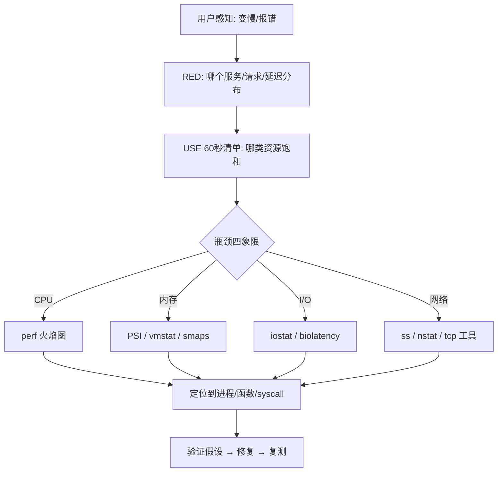
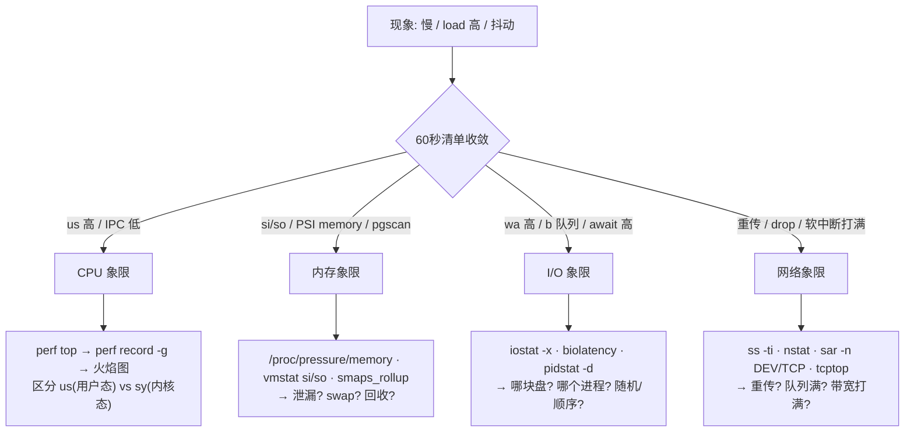

# 精通性能诊断方法论与工具：USE/RED、load average、/proc、perf、火焰图、瓶颈四象限

> 课程编号：L18
> 路线图来源：Linux · 模块七 可观测与生产
> 难度：⭐⭐⭐⭐
> 预计阅读时间：60 分钟
> 内容基准：2026 年 6 月（Linux 6.12 LTS / 6.15+，本篇相关：PSI 压力指标、perf 6.x、火焰图工具链、`/proc`/`/sys` 接口、pidstat/sar 等 sysstat 工具）

---

## 引言：线上变慢，你的第一条命令是什么？

凌晨两点，告警把你叫醒：核心交易服务 P99 延迟从 30ms 飙到 800ms。你 SSH 上去，黑乎乎的终端在等你输入第一条命令。这一刻，能把人区分成两类：

- 一类人，凭直觉乱抓——`top` 看一眼 CPU 不高，`free` 看一眼内存还有，然后开始重启大法、扩容大法，运气好蒙对，运气不好把现场也搞没了。
- 另一类人，脑子里有一张**系统资源全景图**和一套**固定的检查顺序**。他们知道"延迟高"这四个字背后，瓶颈无非藏在 **CPU、内存、I/O、网络**四个象限里某一个，知道 load average 高不等于 CPU 忙，知道哪条命令该看哪个数字、那个数字异常意味着什么。

性能诊断的本质，不是记住几百个命令的几百个参数，而是**建立一套从现象快速收敛到根因的方法论**，再用趁手的工具去验证假设。Brendan Gregg（火焰图、bcc、USE 方法的作者，《Systems Performance》一书的作者）说过一句话：

> "性能问题最大的浪费，是花在错误方向上的时间。"

这一篇我们就把这套方法论和工具链彻底讲透。先讲方法（USE/RED、60 秒检查清单、自上而下 vs 自下而上），再戳破 load average 这个被误读了二十年的指标，然后翻遍 `/proc` 与 `/sys` 这两座宝库，接着深入 `perf` 这把瑞士军刀和火焰图，最后用一套"四象限定位法"把 CPU / 内存 / I/O / 网络的排障收口。本篇是后续 [L19 eBPF](./L19-精通-eBPF.md) 的方法论基础——eBPF 是更锋利的刀，但方法论决定了你往哪儿砍。

一句话原则贯穿全篇：**先建立全局假设，再用工具定点验证；先看饱和度（Saturation），再看利用率（Utilization）。**

---

## 第一章 方法论：先有套路，再有工具

工具谁都会用，但"先看哪个、看到什么算异常、下一步往哪走"才是方法论。这一章给你三套互补的方法论框架。

### 1.1 USE 方法：面向资源的体检表

USE 方法由 Brendan Gregg 提出，针对**每一种资源**（resource）问三个问题：

| 字母 | 含义 | 问题 |
|---|---|---|
| **U** | Utilization 利用率 | 这个资源有多少时间在忙？（如 CPU 80% busy） |
| **S** | Saturation 饱和度 | 有多少额外工作在排队等它？（如 run queue 长度） |
| **E** | Errors 错误 | 有没有错误计数在增长？（如网卡丢包、ECC 错误） |

USE 的精髓在于：**先列出系统的所有资源，再对每个资源逐一过 U/S/E。** 资源清单包括：

- **CPU**：每核利用率、run queue 长度（饱和）、调度延迟
- **内存**：已用容量（利用率）、swap/回收/PSI（饱和）、ECC 错误
- **网络接口**：带宽利用率、丢包/重传（饱和）、CRC 错误
- **存储设备 I/O**：`%util`、队列深度/等待时间（饱和）、I/O 错误
- **存储容量**：磁盘占用、inode 占用

一个关键认知：**饱和度往往比利用率更能说明问题。** CPU 利用率 100% 不一定是问题（可能就是该满载），但 run queue 里堆了 50 个待运行任务、调度延迟飙到几十毫秒，那一定是问题。利用率告诉你"忙不忙"，饱和度告诉你"是不是忙不过来了"。

下面这张 USE 检查表可以贴在工位上：

| 资源 | Utilization | Saturation | Errors |
|---|---|---|---|
| CPU | `mpstat -P ALL 1` 的 `%idle` | `vmstat 1` 的 `r` 列、PSI `cpu` | `perf stat` 的 machine check |
| 内存 | `free -m`、`/proc/meminfo` | swap in/out、PSI `memory`、`pgscan` | `dmesg` ECC/EDAC |
| 网卡 | `sar -n DEV 1` 的 rx/tx | `nstat` 的 `TcpRetransSegs`、drop | `ip -s link` 的 errors |
| 磁盘 | `iostat -x 1` 的 `%util` | `aqu-sz`（平均队列）、`await` | `dmesg` I/O error |
| 文件系统 | `df -h` / `df -i` | 回写脏页堆积 | - |

### 1.2 RED 方法：面向服务的三个金指标

USE 是从**资源**视角自下而上看，RED 则是从**服务/请求**视角自上而下看，由 Tom Wilkie 提出，特别适合微服务与在线服务：

| 字母 | 含义 | 指标 |
|---|---|---|
| **R** | Rate 速率 | 每秒请求数（QPS / RPS） |
| **E** | Errors 错误 | 每秒失败请求数（5xx、超时） |
| **D** | Duration 耗时 | 请求延迟分布（P50/P99/P999） |

RED 与 Google SRE 的"四个黄金信号"（延迟、流量、错误、饱和度）高度重合。它的价值在于：**从用户能感知的维度出发**。线上"变慢"先用 RED 确认是哪个服务、哪类请求、延迟分布长什么样，再用 USE 下钻到具体资源。

> 关于 RED/USE 在应用层与 K8s 层的落地，可交叉参考已有专题 backend B24 可观测性与 cloud-native C11 K8s 可观测性——那里讲了 Prometheus / OpenTelemetry / Grafana 怎么把这些信号采上来。本篇聚焦**单机内核层**。

### 1.3 60 秒性能检查清单

Brendan Gregg 著名的"前 60 秒"清单——登上一台陌生机器，用 10 条命令快速建立全局印象：

```bash
uptime              # 1. load average 三个数，看趋势（升/降/平）
dmesg | tail -20    # 2. 内核最近报错：OOM、I/O error、TCP drop
vmstat 1 5          # 3. r/b 队列、si/so swap、us/sy/id CPU、wa I/O 等待
mpstat -P ALL 1 5   # 4. 每核 CPU 是否均衡（单核打满=单线程瓶颈）
pidstat 1 5         # 5. 哪个进程在吃 CPU（按进程看，比 top 更可记录）
iostat -xz 1 5      # 6. 每块盘 %util / await / aqu-sz
free -m             # 7. 可用内存、buff/cache、swap 用量
sar -n DEV 1 5      # 8. 网卡每秒收发字节/包，对比物理带宽上限
sar -n TCP,ETCP 1 5 # 9. TCP 主被动连接数、重传、错误段
top                 # 10. 最后兜底，看全景
```

这 60 秒做完，你脑子里应该已经有一个假设：是 CPU 密集（`us` 高）、内核态忙（`sy` 高）、等 I/O（`wa` 高、`b` 队列长）、还是内存压力（`si/so` 非零）。

2026 年版的清单可以再加一行 **PSI（压力失速信息）**——这是比 load average 精确得多的饱和度信号（详见 [L05 物理内存管理](./L05-精通-物理内存管理与回收.md) 与 [L17 Cgroup v2](./L17-精通-Cgroup-v2.md)）：

```bash
# PSI：过去 10s / 60s / 300s 内，因等待该资源而"失速"的时间占比
cat /proc/pressure/cpu
cat /proc/pressure/memory
cat /proc/pressure/io
# 输出形如：some avg10=12.50 avg60=8.30 avg300=2.10 total=...
# some=至少一个任务被阻塞；full=所有任务都被阻塞（更严重）
```

`some avg10` 持续 > 0 就说明该资源在制造延迟。相比 load average 的"模糊一团"，PSI 直接告诉你"过去 10 秒有 12.5% 的时间在等 CPU"。

### 1.4 自上而下 vs 自下而上

- **自上而下（top-down）**：从应用/服务指标（RED）开始，逐层下钻——应用 → 库 → syscall → 内核子系统 → 硬件。适合"用户说慢了"这类报障，方向明确。
- **自下而上（bottom-up）**：从资源指标（USE）开始，找出饱和的资源，再反查是谁在用它。适合"机器负载高但不知道为什么"这类巡检。

实战中两者交替使用：RED 发现"支付服务 P99 高" → USE 发现"磁盘 `await` 飙到 50ms" → 自下而上反查"是谁在狂写盘" → `pidstat -d` 锁定进程 → `strace`/eBPF 看它在写什么。



---

## 第二章 load average 真相：被误读二十年的三个数

`uptime` 输出的 `load average: 12.30, 8.10, 4.50` 是每个工程师看到的第一个数字，也是被误解最深的数字。

### 2.1 三个数是什么

三个数分别是过去 **1 分钟、5 分钟、15 分钟**的负载**指数加权移动平均**（不是简单平均）。看三个数的**趋势**比看绝对值更重要：

- `12.30, 8.10, 4.50`：递减方向看（15min→1min），负载正在**上升**——可能事故正在发生。
- `4.50, 8.10, 12.30`：负载正在**下降**——高峰已过，正在恢复。

### 2.2 Linux 的 load 包含 D 状态——这是关键

这是最大的认知坑：**在 Linux 上，load average 统计的不只是"等 CPU 的任务"，还包括处于 `D`（TASK_UNINTERRUPTIBLE，不可中断睡眠）状态的任务。**

回顾 [L02 进程与线程模型](./L02-精通-进程与线程模型.md) 里的进程状态机：

| 状态 | 含义 | 计入 load？ |
|---|---|---|
| R (Running/Runnable) | 正在 CPU 上跑 或 在 run queue 等 CPU | ✅ |
| S (Interruptible Sleep) | 可中断睡眠（等事件，如等网络数据） | ❌ |
| **D (Uninterruptible Sleep)** | **不可中断睡眠（多为等磁盘 I/O、等锁）** | ✅ |
| Z (Zombie) | 僵尸 | ❌ |
| T (Stopped) | 被信号停止 | ❌ |

为什么 Linux 要把 D 状态算进去？历史原因是 1993 年的一封邮件——原本 load 只算 CPU 可运行任务，但这样无法反映"系统因为等磁盘而整体卡住"的情况。于是 Linux 把不可中断（主要是磁盘 I/O 阻塞）也算进去，让 load 更像一个"系统繁忙度"的综合指标，而非纯粹的 CPU 指标。

**这直接导致一个经典反直觉现象：load average 高达 50，但 `top` 里 CPU `%idle` 是 95%。**

原因：那 50 个任务大多卡在 `D` 状态等一块慢盘（或一个被持有的内核锁、或一个挂掉的 NFS 挂载点），它们没在烧 CPU，但都被 load 计入了。这种情况下盲目扩 CPU 毫无意义——瓶颈在 I/O。

### 2.3 实战：load 高但 CPU 闲，怎么抓 D 状态

```bash
# 1. 确认 CPU 确实空闲、I/O 等待高
vmstat 1 5
# procs -----------memory---------- ---swap-- -----io---- -system-- ------cpu-----
#  r  b   swpd   free   buff  cache   si   so    bi    bo   in   cs us sy id wa st
#  1 48      0 100000  20000 800000    0    0 50000     0 2000 3000  2  3  5 90  0
#                ↑ b=48 个进程在不可中断阻塞      ↑ wa=90% CPU 在等 I/O，id 很低

# 2. 把所有 D 状态进程列出来
ps -eo pid,ppid,stat,wchan:30,comm | awk '$3 ~ /D/'
# wchan 列告诉你它阻塞在哪个内核函数（如 io_schedule、nfs_wait...）

# 3. 看某个 D 进程到底卡在哪个内核调用栈
cat /proc/<PID>/stack          # 需要 root，显示内核态调用栈
cat /proc/<PID>/wchan          # 当前阻塞的内核函数名

# 4. 用 offcputime（bcc/eBPF，见 L19）看"不在 CPU 上"的时间花在哪
/usr/share/bcc/tools/offcputime -K -p <PID> 5
```

如果一堆进程的 `wchan` 都指向 `io_schedule` / 块设备相关函数，那就是磁盘瓶颈，转去第六章的 I/O 象限。如果指向某个 NFS / FUSE 函数，多半是远端存储卡死。

> **量级提示**：load 的"健康阈值"取决于核数。粗略地说，load ≈ 核数表示满载；load 远超核数且持续上升，要么 CPU 真的不够，要么有大量 D 状态在堆积。但这只是经验量级，不要把 "load < N 核"当成硬性 SLO——还得结合 PSI 和 run queue 看。

### 2.4 比 load 更精确的：run queue 与 PSI

load 是一个被平滑过、且混入了 D 状态的"模糊"指标。要精确看 **CPU 饱和度**，用：

```bash
# vmstat 的 r 列：当前可运行（R 状态）任务数，直接反映 run queue 长度
vmstat 1
#  r 列 > 核数，说明 CPU 真的不够

# PSI cpu：过去 10s 因等 CPU 而失速的时间占比（最直接的 CPU 饱和度）
cat /proc/pressure/cpu

# runqlat（bcc/eBPF）：调度延迟分布直方图——任务从可运行到真正上 CPU 等了多久
/usr/share/bcc/tools/runqlat 5
```

`runqlat` 给出的是直方图，比单个 load 数字信息量大得多——你能看到"99% 的任务调度延迟 < 1ms，但有一条尾巴拖到 100ms"，这正是 P99 毛刺的来源。调度延迟的机制详见 [L03 CPU 调度](./L03-精通-CPU-调度-CFS-到-EEVDF.md)。

---

## 第三章 /proc 与 /sys 宝库：内核敞开的数据源

几乎所有性能工具（top、vmstat、free、ps……）底层都是在读 `/proc` 和 `/sys`。理解这两座宝库，你就能在没装任何工具的精简容器里徒手排障。

### 3.1 /proc 全局文件速查

| 文件 | 内容 | 典型用途 |
|---|---|---|
| `/proc/loadavg` | 三个 load + 运行/总任务数 + 最近 PID | 脚本读 load |
| `/proc/stat` | CPU 各态累积 jiffies、中断、上下文切换、fork 数 | 算 CPU 利用率、上下文切换速率 |
| `/proc/meminfo` | 内存全景（MemTotal/Available/Cached/Dirty/Slab…） | 内存诊断的第一站 |
| `/proc/vmstat` | 内存子系统细粒度计数（pgscan/pgsteal/pgfault…） | 看回收、缺页 |
| `/proc/diskstats` | 每块设备的 I/O 累积计数（iostat 的数据源） | I/O 诊断 |
| `/proc/net/dev` | 每网卡收发字节/包/错误 | 网络流量 |
| `/proc/net/snmp`、`/proc/net/netstat` | TCP/IP 协议栈计数 | 重传、丢包 |
| `/proc/interrupts`、`/proc/softirqs` | 硬/软中断按 CPU 分布 | 中断不均衡排查 |
| `/proc/pressure/{cpu,memory,io}` | PSI 压力指标 | 饱和度 |
| `/proc/schedstat` | 调度统计 | 调度延迟 |

### 3.2 手算 CPU 利用率（理解 top 的原理）

`/proc/stat` 第一行是全局 CPU 时间（单位 jiffies，累积值）：

```bash
cat /proc/stat | head -1
# cpu  user nice system idle iowait irq softirq steal guest guest_nice
# cpu  1200 30   400    98000 200    0   50      0     0     0
```

利用率 = 两次采样之间，非 idle 时间增量 / 总时间增量。这正是 `mpstat` / `top` 做的事。`steal` 一列在虚拟机/云主机上要特别看——它表示**hypervisor 把 CPU 给了别的虚拟机**，`steal` 高说明你被"邻居"抢了 CPU，是云上排障的关键信号（宿主机超卖）。

### 3.3 /proc/[pid]/ 单进程宝库

| 文件 | 内容 |
|---|---|
| `/proc/[pid]/status` | 进程状态、VmRSS、VmSwap、线程数、context switch 次数 |
| `/proc/[pid]/stat` | 机器可读的进程统计（utime/stime/starttime…） |
| `/proc/[pid]/schedstat` | 该进程在 CPU 上跑的时间、等待时间 |
| `/proc/[pid]/io` | 该进程读写字节数（rchar/wchar/read_bytes/write_bytes） |
| `/proc/[pid]/smaps_rollup` | 内存映射汇总（RSS/PSS/USS，见 [L06](./L06-精通-OOM-与内存诊断.md)） |
| `/proc/[pid]/stack` | 当前内核态调用栈（D 状态排障神器） |
| `/proc/[pid]/wchan` | 当前阻塞的内核函数 |
| `/proc/[pid]/fd/` | 打开的文件描述符 |
| `/proc/[pid]/limits` | 该进程的 rlimit |

```bash
# 看某进程实际读写了多少磁盘（区分 read_bytes 真实块 I/O 与 rchar 含 cache 命中）
cat /proc/<PID>/io
# rchar/wchar：经过 read()/write() 的字节（含 page cache 命中）
# read_bytes/write_bytes：真正下到块层的字节
```

### 3.4 sysstat 工具家族：vmstat / mpstat / pidstat / sar

这些工具是对 `/proc` 的友好封装，是 SRE 的日常主力：

```bash
# vmstat：系统级全景，每秒一行
vmstat 1
#   关键列：r(可运行) b(阻塞D) si/so(swap) bi/bo(块IO) cs(上下文切换) us/sy/id/wa

# mpstat：按 CPU 核拆分——发现"单核打满"（单线程瓶颈）
mpstat -P ALL 1
#   一个核 100% 其余空闲 = 程序没并行化，或软中断全压在一个核上

# pidstat：按进程拆分，可记录历史（比 top 更适合留证据）
pidstat 1          # CPU
pidstat -r 1       # 内存（缺页、RSS）
pidstat -d 1       # 磁盘 I/O（每进程 kB_rd/s kB_wr/s）
pidstat -w 1       # 上下文切换（cswch 自愿 / nvcswch 非自愿）
pidstat -t 1       # 拆到线程级

# sar：采样并存历史（cron 默认每 10 分钟采一次，存 /var/log/sa/）
sar -u 1 3         # CPU
sar -n DEV 1 3     # 网卡
sar -d 1 3         # 磁盘
sar -q 1 3         # run queue 与 load
sar -f /var/log/sa/sa15   # 回看 15 号那天的历史数据——事后归因利器
```

**`pidstat -w` 的非自愿上下文切换（nvcswch）值得专门盯**：它表示进程时间片用完被抢占。如果某进程 nvcswch 极高，说明 CPU 竞争激烈或时间片设置不合理。**自愿切换（cswch）高**则通常是频繁阻塞（等锁、等 I/O）。

---

## 第四章 perf：Linux 性能分析的瑞士军刀

`perf`（perf_events）是内核自带的性能分析框架，能采 PMU 硬件计数器、内核 tracepoint、动态 probe，是 CPU 剖析的事实标准。

### 4.1 perf stat：用 PMU 看微架构效率

`perf stat` 读 CPU 的 PMU（性能监控单元）硬件计数器，回答"程序在硬件层面跑得高效吗"：

```bash
perf stat -d ./myprogram
# 或对运行中进程：perf stat -d -p <PID> -- sleep 10

# 关键输出：
#   instructions  # IPC（每周期指令数）—— 衡量微架构效率
#   cycles
#   IPC：> 1.0 还行，< 0.5 通常说明 CPU 频繁停顿（cache miss / 分支误判 / 访存等待）
#   cache-misses / cache-references  # LLC 缓存未命中率
#   branch-misses                    # 分支预测失败
```

**IPC（Instructions Per Cycle）是判断"CPU 忙但效率低"的金指标。** 两个程序都把 CPU 打到 100%，但 IPC=2.0 的在干活，IPC=0.3 的可能在疯狂等内存（cache miss 风暴）。后者扩 CPU 没用，得优化数据局部性。

```bash
# 专门看 cache 命中情况
perf stat -e cache-references,cache-misses,LLC-load-misses,LLC-loads ./prog

# 看 TLB miss（呼应 L04 虚拟内存：大量 TLB miss 可考虑 HugePage）
perf stat -e dTLB-load-misses,iTLB-load-misses ./prog
```

> **注意**：PMU 事件在虚拟机里常被 hypervisor 屏蔽或不准。`perf stat` 报 `<not supported>` 多半就是这个原因。裸金属或开了 vPMU 的云实例才能拿到准确硬件计数。

### 4.2 perf top：实时热点函数

```bash
perf top              # 全系统实时热点（类似 top，但看的是函数）
perf top -p <PID>     # 只看某进程
perf top -e cache-misses   # 按 cache miss 排序——找访存热点
```

`perf top` 立刻告诉你"现在 CPU 时间烧在哪个函数"。如果栈顶是内核函数（如 `_raw_spin_lock`、`copy_user`），说明内核态开销大；如果是某个库函数，可能是热路径上的低效调用。

### 4.3 perf record -g：采样调用栈

```bash
# -g 采调用栈，-F 99 每秒采 99 次（用质数避开与周期性任务共振）
perf record -F 99 -g -p <PID> -- sleep 30
# 或全系统：perf record -F 99 -ag -- sleep 30

perf report           # 交互式查看（默认按函数自占用时间排序）
perf report --stdio   # 文本输出
```

> **采样频率为何用 99 而非 100**：避免与系统里恰好 100Hz/50Hz 的周期性任务"锁相"导致采样偏差。这是 Gregg 推荐的小技巧。

> **栈采不全？** 用户态需要 frame pointer 或 DWARF：编译加 `-fno-omit-frame-pointer`，或 `perf record --call-graph dwarf`（DWARF 解栈更准但开销大、采样数据大）。Go 程序、JIT 语言另有专门处理（Go 见 golang G22 pprof）。

### 4.4 火焰图：把采样变成一眼看懂的图

火焰图（FlameGraph，Brendan Gregg 发明）把成千上万个采样栈聚合成一张图：**X 轴是栈的占比（不是时间轴！），Y 轴是调用深度，越宽的格子代表占用 CPU 越多。** 一眼就能看出"哪条调用路径最宽"。

标准生成流程：

```bash
# 1. 采样
perf record -F 99 -ag -- sleep 30

# 2. 展开成调用栈文本
perf script > out.perf

# 3. 用 FlameGraph 工具折叠（folded stacks）
git clone https://github.com/brendangregg/FlameGraph
./FlameGraph/stackcollapse-perf.pl out.perf > out.folded

# 4. 生成 SVG
./FlameGraph/flamegraph.pl out.folded > flame.svg
# 浏览器打开 flame.svg，可点击下钻、Ctrl+F 搜索函数高亮
```

```
火焰图读法（ASCII 示意）：
┌──────────────────────────────────────────────┐
│                  [总采样 100%]                  │  ← 顶部=正在执行的函数
│      ┌──────────────┐    ┌───────────────┐     │
│      │  json_parse  │    │   db_query    │     │  ← 越宽=占 CPU 越多
│  ┌───┴────┐   ┌─────┴──┐ ┌┴──────────────┐    │
│  │ malloc │   │ memcpy │ │ socket_recv   │    │
└──────────────────────────────────────────────┘
            X 轴 = 占比 (字母序，非时间)
            Y 轴 = 调用栈深度
```

2026 年实战里，**离线生成 SVG 已逐渐被持续 profiling 取代**——Parca / Pyroscope / Grafana 用 eBPF 持续采样全集群、自动出火焰图与差分火焰图（对比两个时间段，红色变宽=新热点）。详见 [L19 eBPF](./L19-精通-eBPF.md) 与 cloud-native C11。但单机临时排障，`perf record` + FlameGraph 仍是最快的。

### 4.5 perf sched：调度延迟分析

```bash
# 记录调度事件
perf sched record -- sleep 5

# 看调度延迟报告：每个任务从"可运行"到"上 CPU"等了多久
perf sched latency
#   关注 Maximum delay：单次最大调度延迟，P99 毛刺的常见来源

# 时间线视图
perf sched timehist
```

调度延迟大（任务可运行了却迟迟上不了 CPU）是延迟毛刺的常见原因，尤其在 CPU 超卖或 cgroup CPU 配额（`cpu.max`）被打满时。bcc 的 `runqlat` 给直方图，`perf sched` 给逐事件细节，二者互补。机制见 [L03 调度](./L03-精通-CPU-调度-CFS-到-EEVDF.md) 与 [L17 Cgroup](./L17-精通-Cgroup-v2.md)。

### 4.6 perf 命令速查

| 命令 | 用途 |
|---|---|
| `perf stat` | PMU 计数器（IPC、cache、分支） |
| `perf top` | 实时热点函数 |
| `perf record -g` / `perf report` | 采样 + 火焰图 |
| `perf sched` | 调度延迟 |
| `perf trace` | 类 strace 的 syscall 跟踪（见第五章） |
| `perf list` | 列出本机所有可用事件 |
| `perf c2c` | 缓存行伪共享（false sharing）分析 |
| `perf mem` | 访存延迟分析 |
| `perf probe` | 动态加 probe 点（kprobe/uprobe 的命令行入口） |

---

## 第五章 strace / ltrace / perf trace：系统调用级排障

当你怀疑"程序卡在某个系统调用"或"反复调某个 syscall 失败"时，syscall 级跟踪能直接看到真相。

### 5.1 strace：跟踪系统调用

```bash
# 跟踪一个进程的所有 syscall（注意：会显著拖慢目标）
strace -p <PID>

# 启动并跟踪
strace -f -e trace=openat,read,write ./prog   # -f 跟子进程/线程

# 统计模式：每个 syscall 调了多少次、累计耗时、错误数（排障最常用！）
strace -c -p <PID>
# % time  seconds  usecs/call  calls  errors  syscall
#  60.0   1.200000        120   10000          read
#  30.0   0.600000      6000      100          futex
#  ...
#   errors 列：哪个 syscall 在反复失败（如 EAGAIN/ENOENT 风暴）

# 看每个 syscall 耗时（找慢系统调用）
strace -T -p <PID>   # 每行末尾 <0.000123> 是该次调用耗时
```

**strace 的杀手锏是 `-c` 统计模式**：一眼看出程序时间花在哪类 syscall、有没有 syscall 在疯狂报错（比如 `stat` 一个不存在的文件几万次、`futex` 锁竞争剧烈）。

### 5.2 strace 的开销与陷阱

**strace 基于 ptrace，每个被跟踪的 syscall 都要陷入跟踪器，开销极大——可能让目标程序慢几倍到几十倍。** 生产环境直接 `strace -p` 一个高 QPS 进程，可能直接把它拖垮。原理见 [L01 系统调用](./L01-精通-Linux-架构与系统调用.md)。

实战准则：

- **生产高负载进程，优先用 `perf trace` 或 eBPF**（基于 perf_events/tracepoint，开销小一个量级）。
- 用 strace 时尽量 `-e trace=` 过滤到关心的 syscall，缩短挂载时间。
- 跟一段就 detach，别长时间挂着。

### 5.3 ltrace：跟踪库函数调用

```bash
ltrace -p <PID>              # 跟踪动态库函数调用（如 malloc、strcmp）
ltrace -c ./prog             # 统计模式
```

`ltrace` 跟的是用户态库函数（如 libc 的 `malloc`/`free`/`memcpy`），适合分析"程序在哪个库调用上花时间"。开销同样不小，且对静态链接/优化过的程序可能跟不全。

### 5.4 perf trace：低开销的 strace 替代

```bash
perf trace -p <PID>          # 类似 strace，但基于 perf_events，开销小得多
perf trace -s -p <PID>       # 汇总模式（类似 strace -c）
perf trace record -p <PID>   # 记录下来事后分析
```

`perf trace` 是 2026 年生产环境跟踪 syscall 的首选——同样的信息，开销远低于 strace。对极高频场景，再上 [L19](./L19-精通-eBPF.md) 的 bpftrace/bcc（如 `syscount`、`funclatency`）。

| 工具 | 跟踪对象 | 开销 | 生产可用性 |
|---|---|---|---|
| `strace` | syscall（ptrace） | 高（数倍～数十倍慢） | 谨慎，短时 |
| `ltrace` | 库函数 | 高 | 谨慎 |
| `perf trace` | syscall（perf_events） | 中低 | 较好 |
| `bpftrace`/bcc | syscall/任意 probe | 低 | 好 |

---

## 第六章 瓶颈四象限定位法

把前面所有工具收口成一套打法：**任何性能问题，先用 60 秒清单收敛到 CPU / 内存 / I/O / 网络四个象限之一，再用对应工具深挖。**



### 6.1 CPU 象限

判定：`vmstat` 的 `us` 或 `sy` 高、`id` 低，`r` 队列长，PSI cpu > 0。

```bash
mpstat -P ALL 1        # 先看是均衡满载还是单核打满
# us 高 → 用户态计算密集 → perf record -g 出火焰图找热点函数
# sy 高 → 内核态忙 → 看是不是 syscall 太频繁 / 锁竞争 / 软中断
perf top                # 实时热点
perf record -F 99 -g -p <PID> -- sleep 30 && perf script | ... # 火焰图
perf stat -d -p <PID>   # IPC 低 → 不是算得多，是等内存（cache miss）
```

`sy`（内核态）高的典型元凶：syscall 风暴（用 `perf trace -s` / `strace -c` 看）、自旋锁竞争（`perf top` 看到 `_raw_spin_lock`，机制见 [L15 内核同步](./L15-精通-内核同步与futex.md)）、软中断（网络收包打满单核，见下文网络象限与 [L11](./L11-精通-Linux-网络协议栈.md)）。

### 6.2 内存象限

判定：`vmstat` 的 `si/so` 非零（在 swap）、`free` 可用内存低、PSI memory > 0、`/proc/vmstat` 的 `pgscan`/`pgsteal` 飙升（在拼命回收）。

```bash
cat /proc/pressure/memory      # 内存压力（最直接的饱和度）
vmstat 1                       # si/so：在换页 = 内存不够
free -m                        # available 是真正可用（含可回收 cache）
cat /proc/meminfo              # Dirty/Writeback 高 = 脏页堆积；Slab 高 = 内核占用
sar -B 1                       # 缺页、回收速率（pgscank/pgscand/pgsteal）
pidstat -r 1                   # 哪个进程缺页多 / RSS 涨得快
cat /proc/<PID>/smaps_rollup   # 单进程 RSS/PSS/USS（区分共享 vs 独占）
```

内存象限的细分（详见 [L05](./L05-精通-物理内存管理与回收.md)、[L06](./L06-精通-OOM-与内存诊断.md)）：

- **泄漏**：RSS 单调上涨不回头 → heap profiler（语言相关，Go 见 G22 pprof）。
- **swap 颠簸**：`si/so` 持续非零，延迟毛刺 → 调小 `vm.swappiness` 或加内存。
- **回收压力**：`pgscan` 高但还没 OOM → page cache 被频繁回收，可能 I/O 重读放大。
- **OOM**：`dmesg` 见 `Out of memory: Killed process` → 看 cgroup `memory.events`。

### 6.3 I/O 象限

判定：`vmstat` 的 `wa` 高、`b` 队列长，PSI io > 0，`iostat` 的 `await` 高。

```bash
iostat -xz 1                   # 核心命令
#   r/s w/s     ：每秒读写次数（IOPS）
#   rkB/s wkB/s ：吞吐
#   await       ：平均 I/O 完成时间（ms）—— 设备慢的直接信号
#   aqu-sz      ：平均队列深度 —— 饱和度
#   %util       ：设备繁忙时间占比（NVMe 多队列下 %util 会误导，见下）

pidstat -d 1                   # 哪个进程在读写
/usr/share/bcc/tools/biolatency 5   # 块 I/O 延迟分布直方图（eBPF，见 L19）
/usr/share/bcc/tools/biosnoop       # 逐个 I/O：进程/盘/扇区/延迟
cat /proc/<PID>/io             # 该进程真实块 I/O 字节
```

**`%util` 的经典误读（呼应 [L10 块设备](./L10-精通-块设备与IO调度.md)）**：在传统单队列机械盘上 `%util` 接近 100% 意味着饱和；但在 NVMe / blk-mq 多队列 SSD 上，设备能并行处理多个请求，`%util=100%` **不代表饱和**——它只是说"任意时刻都有 I/O 在飞"，但队列还远没满。NVMe 上要看 `aqu-sz`（队列深度）和 `await`，别被 `%util` 吓到。

I/O 慢的细分：是随机还是顺序（`biosnoop` 看扇区跳变）？是哪块盘？是不是 fsync 风暴（数据库刷盘，见 [L07 VFS](./L07-精通-VFS-与文件系统.md)）？

### 6.4 网络象限

判定：`sar -n DEV` 看带宽是否打满、`nstat` 重传/丢包增长、`mpstat` 看某核软中断（`%soft`）打满。

```bash
ss -ti                         # 每条 TCP 连接的 rtt、cwnd、重传、状态
ss -s                          # 连接状态汇总（TIME-WAIT 多不多）
ss -ltn                        # 监听端口 + accept 队列（Recv-Q/Send-Q）
nstat -az | grep -i retrans    # TCP 重传计数
sar -n DEV 1                   # 每网卡收发字节/包，对比物理带宽
sar -n TCP,ETCP 1              # 主被动连接、重传、错误段
mpstat -P ALL 1                # %soft 某核打满 = 软中断没分散（RPS/RFS，见 L11）
cat /proc/net/softnet_stat     # 每 CPU 软中断处理/丢弃/挤压计数
/usr/share/bcc/tools/tcpretrans  # 逐个重传事件（哪条连接在重传，eBPF）
/usr/share/bcc/tools/tcplife     # 每条连接生命周期与吞吐
```

网络象限细分（详见 [L11](./L11-精通-Linux-网络协议栈.md)、[L12](./L12-精通-TCP-IP-内核实现与调优.md)、[L13](./L13-精通-Socket-与连接管理.md)）：

- **accept 队列溢出**：`ss -ltn` 的 `Recv-Q` 接近 `Send-Q`（队列上限）、`nstat` 见 `ListenOverflows` → 调 `somaxconn` / backlog。
- **软中断单核打满**：收包软中断没分散到多核 → 开 RSS/RPS/RFS，或上 XDP（见 [L11](./L11-精通-Linux-网络协议栈.md) 的 XDP 与 [L19](./L19-精通-eBPF.md)）。
- **重传高**：`ss -ti` 看 rtt 与 retrans → 网络质量或拥塞。
- **TIME_WAIT 堆积**：短连接太多 → 复用连接 / `tcp_tw_reuse`。

---

## 生产实践：一台高负载机器的系统化体检

把方法论变成一份可执行的"体检脚本"。假设你接手一台"load 高、响应慢"的机器，按以下顺序走一遍，每步记录证据。

```bash
#!/usr/bin/env bash
# 系统化体检 —— USE 方法 + 60 秒清单，输出带时间戳供事后归因
set -euo pipefail
TS=$(date +%F_%H%M%S)
OUT="/tmp/healthcheck_$TS"; mkdir -p "$OUT"; cd "$OUT"

# === 0. 全局快照 ===
{ uptime; echo; cat /proc/loadavg; } > 00_load.txt
dmesg -T | tail -50 > 01_dmesg.txt          # OOM / I/O error / TCP drop

# === 1. CPU 饱和度（USE: Saturation 优先）===
vmstat 1 5 > 10_vmstat.txt                   # r/b 队列、wa、si/so
mpstat -P ALL 1 5 > 11_mpstat.txt            # 单核打满? 软中断不均?
cat /proc/pressure/cpu /proc/pressure/io /proc/pressure/memory > 12_psi.txt

# === 2. 谁在吃资源（自下而上反查进程）===
pidstat 1 3 > 20_pidstat_cpu.txt
pidstat -d 1 3 > 21_pidstat_io.txt
pidstat -r 1 3 > 22_pidstat_mem.txt
ps -eo pid,ppid,stat,pcpu,pmem,rss,wchan:25,comm --sort=-pcpu | head -20 > 23_topproc.txt
ps -eo pid,stat,wchan:30,comm | awk '$2 ~ /D/' > 24_dstate.txt   # D 状态清单

# === 3. 内存 ===
free -m > 30_free.txt
cat /proc/meminfo > 31_meminfo.txt
sar -B 1 3 > 32_paging.txt                   # 缺页 / 回收速率

# === 4. I/O ===
iostat -xz 1 3 > 40_iostat.txt               # await / aqu-sz / %util

# === 5. 网络 ===
ss -s > 50_ss_summary.txt
ss -ltn > 51_listen_q.txt                    # accept 队列
nstat -az > 52_nstat.txt                     # 重传 / 溢出
sar -n DEV 1 3 > 53_netdev.txt

echo "体检数据已落盘到 $OUT"
```

**判读决策树**：

1. `wa` 高 + `b` 队列长 + 一堆 D 状态进程 → **I/O 象限**，去看 `iostat` 的 `await` 和 D 进程的 `wchan`。
2. `us` 高 + `r` 队列长 → **CPU 计算密集**，对吃 CPU 的进程做 `perf record -g` 火焰图。
3. `sy` 高 → 内核态忙，`perf trace -s` 看 syscall、`perf top` 看是否锁竞争/软中断。
4. `si/so` 非零 + PSI memory 高 → **内存不足**，找 RSS 暴涨进程或加内存。
5. `mpstat` 某核 `%soft` 打满 + 网络流量大 → **软中断瓶颈**，开 RPS/RFS。
6. 全都正常但还是慢 → 多半是**外部依赖**（下游 DB/RPC 慢），用 `ss -ti` 看连接 rtt、用应用层 trace（OTel）下钻。

体检的纪律：**每一步都留证据文件**。性能问题常常转瞬即逝，事后归因全靠当时的快照。这也是 `sar` 默认持久化采样的价值——出事后 `sar -f` 能回看。

---

## 陷阱清单

> 每条：现象 → 原因 → 修法

1. **现象**：load average 高达 50，但 `top` 显示 CPU 95% idle，扩了 CPU 也没用。
   **原因**：Linux 的 load 包含 `D`（不可中断睡眠）状态任务，这 50 个进程大多卡在等磁盘 I/O 或挂死的 NFS，并没在烧 CPU。
   **修法**：`ps -eo stat,wchan,comm | awk '$1~/D/'` 列出 D 进程看 `wchan`，转 I/O 象限用 `iostat`/`biolatency` 定位慢盘或卡死的远端存储；别再扩 CPU。

2. **现象**：CPU 100% 但程序吞吐没涨，加机器也不见效。
   **原因**：`perf stat` 显示 IPC 只有 0.3——CPU 大量周期在等内存（cache miss 风暴），不是在干活；或是自旋锁空转。
   **修法**：`perf stat -d` 确认 IPC 与 cache-misses；用 `perf c2c` 查伪共享、优化数据局部性；`perf top` 若见 `_raw_spin_lock` 占顶则是锁竞争。

3. **现象**：在 NVMe SSD 上看到 `iostat` 的 `%util=100%`，以为磁盘饱和了，慌忙扩容。
   **原因**：blk-mq 多队列设备能并行处理多请求，`%util` 只表示"任意时刻都有 I/O 在飞"，不等于队列满/饱和（见 [L10](./L10-精通-块设备与IO调度.md)）。
   **修法**：看 `aqu-sz`（平均队列深度）和 `await`（完成时间）才是 NVMe 的饱和度信号；`%util` 在多队列设备上不可作为饱和判据。

4. **现象**：`strace -p` 一接上去，生产高 QPS 进程立刻延迟暴涨、甚至触发雪崩。
   **原因**：strace 基于 ptrace，每个 syscall 都要陷入跟踪器，开销可达数倍～数十倍（见 [L01](./L01-精通-Linux-架构与系统调用.md)）。
   **修法**：高负载进程改用 `perf trace`（开销低一个量级）或 [L19](./L19-精通-eBPF.md) 的 bpftrace/bcc；非用 strace 不可时务必 `-e trace=` 过滤并短时 detach。

5. **现象**：`perf record -g` 出的火焰图栈是断的，看不到完整调用链。
   **原因**：用户态程序编译时省略了 frame pointer（`-fomit-frame-pointer`），perf 无法回溯栈。
   **修法**：编译加 `-fno-omit-frame-pointer` 重新构建；或临时用 `perf record --call-graph dwarf`（DWARF 解栈，更准但开销大、数据量大）；JIT/Go 语言走各自的栈支持。

6. **现象**：云主机上 CPU 利用率不高但程序就是慢，本地复现不了。
   **原因**：`/proc/stat` 的 `steal` 列高——hypervisor 把物理 CPU 时间分给了别的虚拟机（宿主机超卖），你的 vCPU 被"偷"了。
   **修法**：`vmstat 1` 看 `st` 列、`mpstat` 看 `%steal`；steal 持续高就找云厂商换实例/独占核，或上专用宿主。

7. **现象**：`perf stat` 全是 `<not supported>`，PMU 计数器拿不到。
   **原因**：在虚拟机里 vPMU 未开放，或权限不足（`perf_event_paranoid`）。
   **修法**：裸金属或开 vPMU 的云实例；`sysctl kernel.perf_event_paranoid`（调低可放开非特权采样，生产按安全策略权衡）。

8. **现象**：`mpstat` 显示一个核 100%、其余空闲，整机吞吐上不去。
   **原因**：要么程序单线程（没并行化），要么网络收包软中断全压在一个核上（RSS/RPS 没配，见 [L11](./L11-精通-Linux-网络协议栈.md)）。
   **修法**：程序侧并行化；网络侧检查 `/proc/interrupts` 中断亲和与 `/proc/net/softnet_stat`，开启 RSS（多队列网卡）/RPS/RFS 把软中断分散到多核。

9. **现象**：`free` 显示可用内存只剩几百 MB，担心要 OOM。
   **原因**：误把 `free` 列当可用内存——其实 `buff/cache` 大部分可被回收，真正可用看 `available` 列。
   **修法**：看 `free -m` 的 `available` 或 `/proc/meminfo` 的 `MemAvailable`；只有它持续逼近 0 且 PSI memory 飙升才是真危险（见 [L05](./L05-精通-物理内存管理与回收.md)）。

---

## 2026 现状

- **PSI 成为饱和度事实标准**：相比模糊的 load average，`/proc/pressure/{cpu,memory,io}`（5.2+）直接量化"因等某资源而失速的时间占比"，已成为 SRE 判断饱和度的首选信号，并驱动 systemd-oomd（按内存 PSI 提前杀进程）与各类弹性伸缩（见 [L05](./L05-精通-物理内存管理与回收.md)、[L17](./L17-精通-Cgroup-v2.md)）。
- **eBPF 工具取代高开销老工具**：`runqlat`/`biolatency`/`offcputime`/`tcpretrans` 等 bcc/bpftrace 工具，以远低于 strace/ltrace 的开销提供更细的分布与逐事件视图，成为生产排障主力（见 [L19](./L19-精通-eBPF.md)）。
- **持续 profiling 普及**：Parca / Pyroscope（已并入 Grafana）/ Grafana Beyla 用 eBPF 全集群常驻采样，自动出火焰图与差分火焰图，"先有现场再排障"变成"现场永远在线"。临时单机仍用 `perf` + FlameGraph。
- **perf 持续演进**：随 6.x 内核演进，`perf` 对新硬件 PMU、BPF 输出、off-cpu 分析支持更完善；`perf trace` 作为低开销 strace 替代被推荐用于生产。
- **云原生层对齐**：单机 USE/RED 方法论在 K8s 层由 cAdvisor/node-exporter/Pixie/Hubble 等承接（见 cloud-native C11），但根因往往仍要下沉到本篇的内核层指标。

---

## 练习题

1. 解释为什么 Linux 的 load average 会包含 `D` 状态任务，并举一个"load 高但 CPU 闲"的真实场景。如何用一条命令列出当前所有 D 状态进程及其阻塞的内核函数？

2. USE 方法对每种资源问哪三个问题？为什么说"饱和度往往比利用率更能说明问题"？给 CPU 这一资源各举一个 U/S/E 的具体指标。

3. `perf stat` 显示某程序 CPU 打满但 IPC=0.25，这说明什么？应该往哪个方向优化？为什么单纯加 CPU 核数没用？

4. 火焰图的 X 轴代表什么（是不是时间轴）？Y 轴代表什么？为什么 `perf record` 推荐用 `-F 99` 而不是 `-F 100`？

5. 对比 `strace`、`perf trace`、bpftrace 在跟踪系统调用时的开销与适用场景。为什么不能在生产高 QPS 进程上随手 `strace -p`？

6. 在 NVMe SSD 上 `iostat` 报 `%util=100%`，能否据此判断磁盘饱和？应该看哪两个指标判断真正的 I/O 饱和度？为什么 NVMe 与机械盘在这一点上不同？

7. **（实战排障）** 线上一台 32 核机器：`uptime` 显示 load 80 且持续上升，`top` 显示 CPU `%id` 约 90%、`%wa` 约 8%；`vmstat 1` 的 `b` 列稳定在 70 左右、`si/so` 全 0。请写出你从这一步起的完整诊断命令序列，并说明每条命令想验证什么假设，最终大概率定位到哪个象限。

8. **（实战排障）** 某服务 P99 延迟周期性出现 100ms 毛刺，但平均 CPU、内存、磁盘都不高。给出你怀疑的两到三个方向（调度延迟 / GC / 网络重传 / 缓存回收等），以及对应的验证工具（至少包含 `runqlat`、`perf sched`、`ss -ti` 中的两个），说明各自能看到什么证据。
