# Linux / 操作系统路线图 · Mermaid 可视化

> 配合 [INDEX.md](./INDEX.md) 与 [QUIZ.md](./QUIZ.md) 使用
>
> **📅 内容基准：2026 年 6 月**——Linux 6.12 LTS / 6.15+、EEVDF、sched_ext、MGLRU、io_uring、cgroup v2、BBR、XDP/eBPF、PSI。

---

## 🗺️ 全景路线图

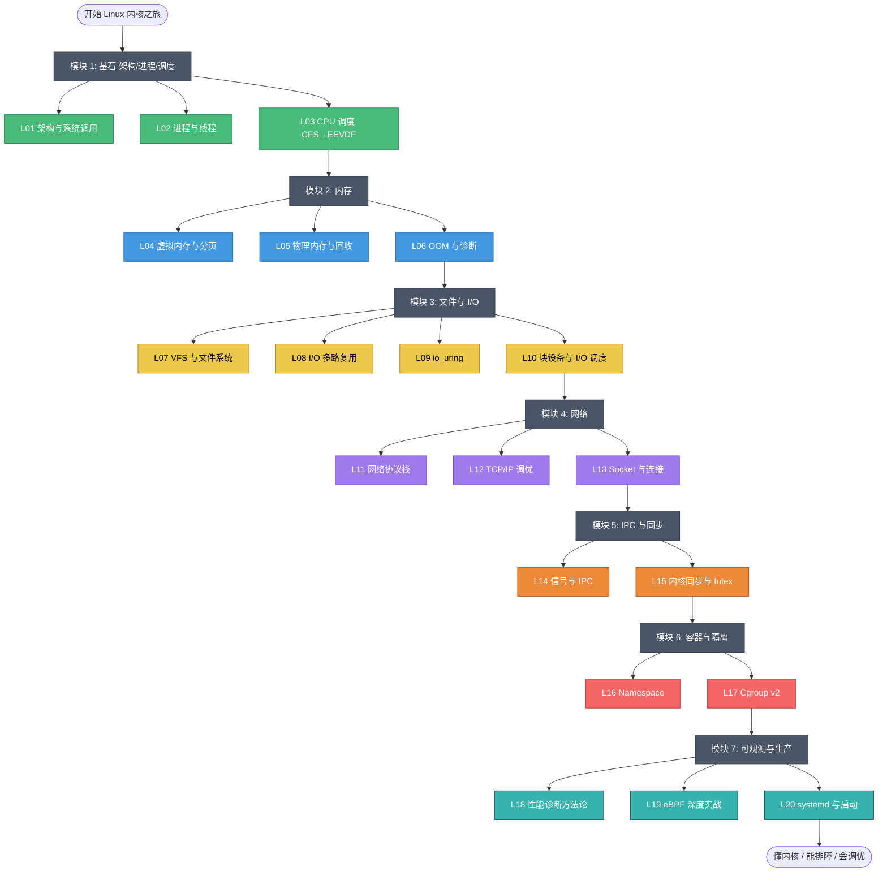

---

## 🟢 模块 1：基石——架构 / 进程 / 调度（L01-L03）

**用户态 → 内核态的几条路**：

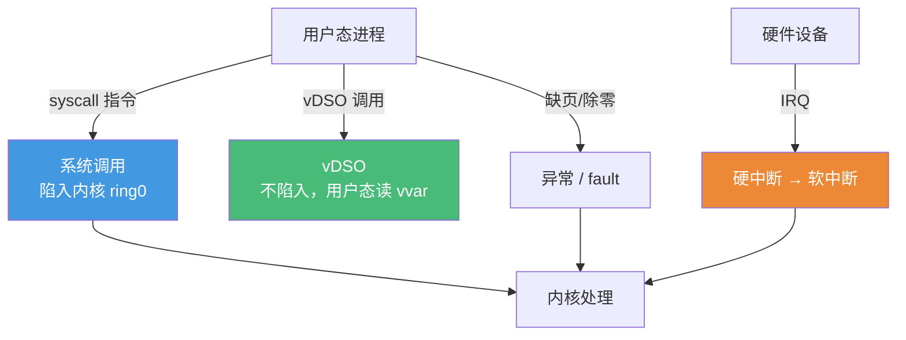

**进程状态机**：

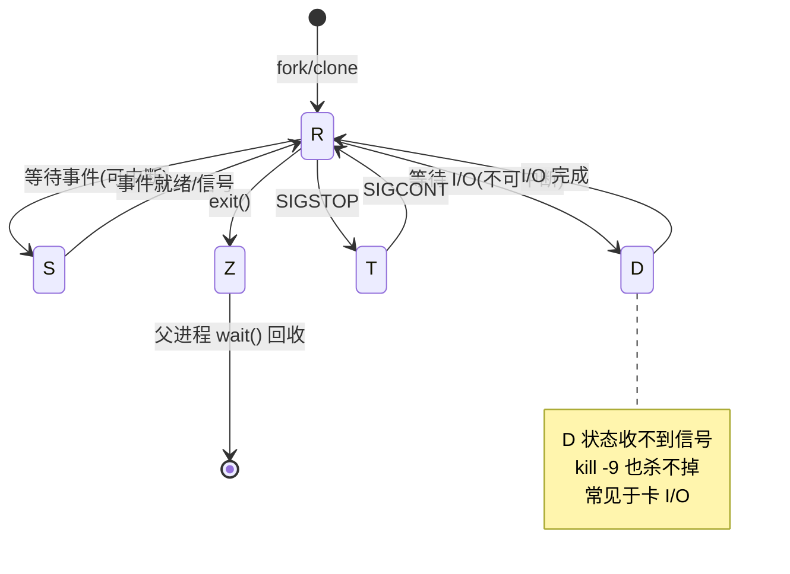

---

## 🔵 模块 2：内存（L04-L06）

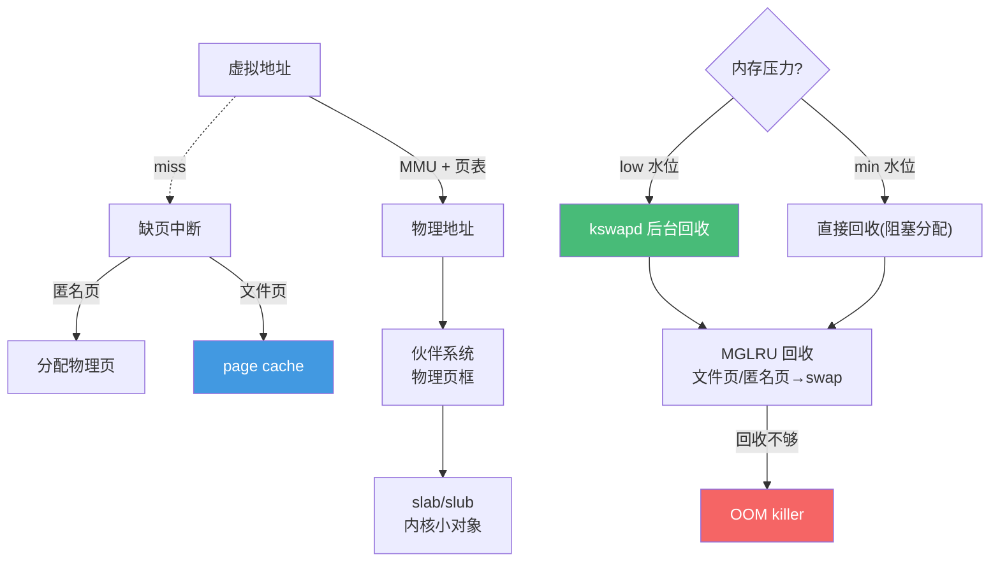

**缺页中断分类**：

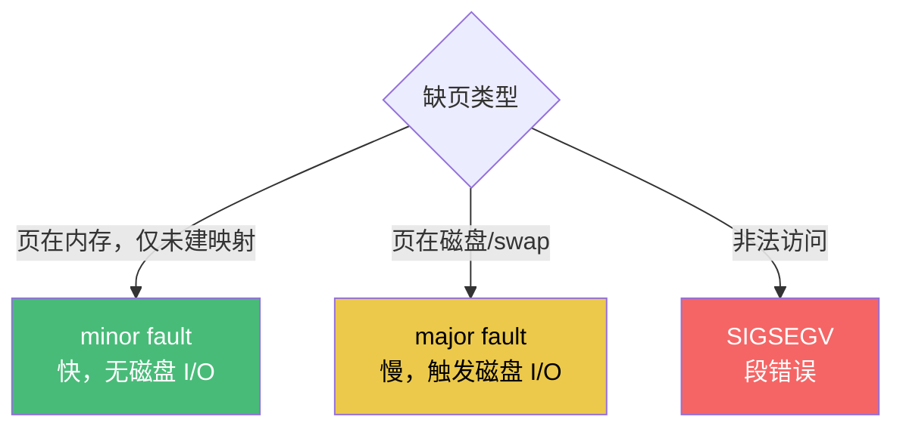

---

## 🟡 模块 3：文件与 I/O（L07-L10）

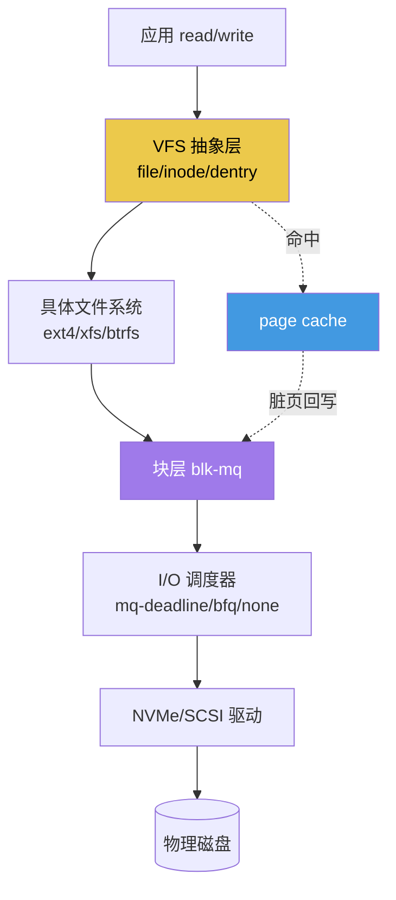

**五种 I/O 模型与 epoll → io_uring 演进**：

**I/O 调度器选型**：

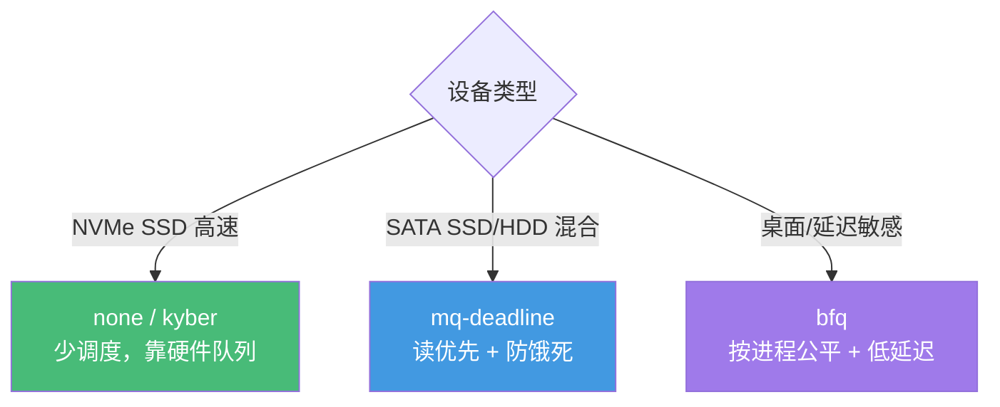

---

## 🟣 模块 4：网络（L11-L13）

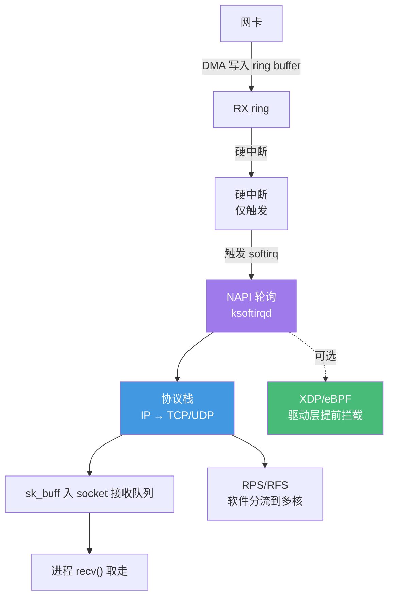

**TCP 三次握手与两个队列**：

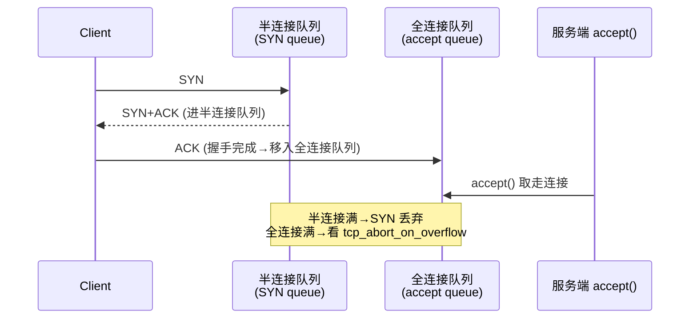

---

## 🟠 模块 5：IPC 与同步（L14-L15）

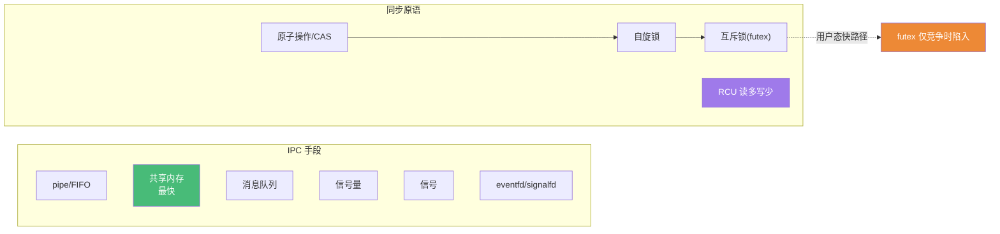

---

## 🔴 模块 6：容器与隔离（L16-L17）

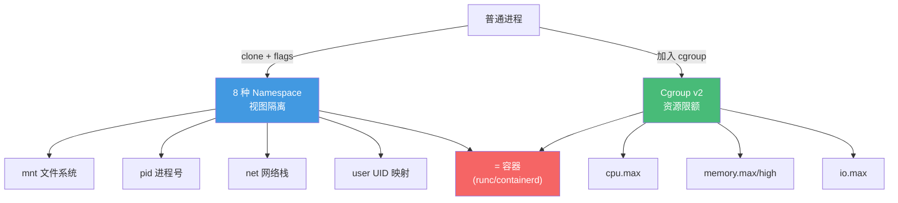

---

## ⚫ 模块 7：可观测与生产（L18-L20）

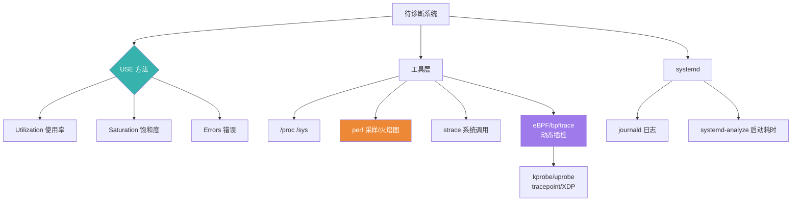

**性能瓶颈四象限定位**：

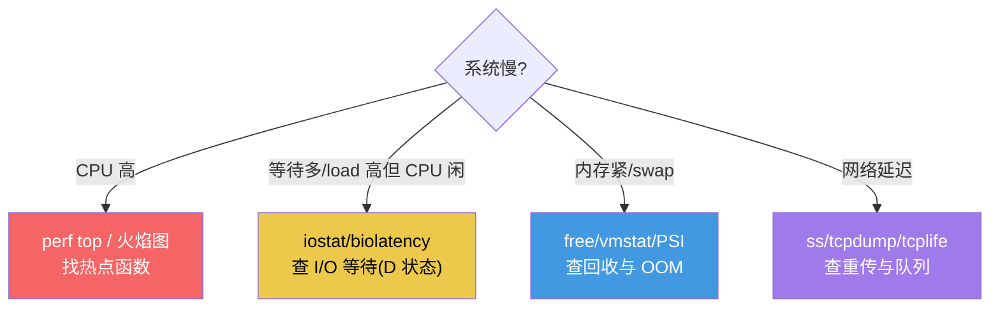

---

## 🎯 学习路径可视化

### 路径 A：完整通学（3-4 个月）

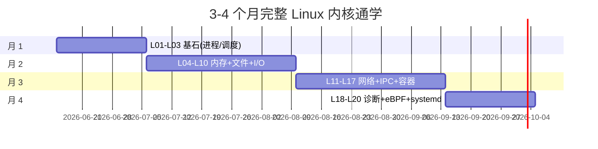

### 路径 C：SRE / 性能工程师

### 路径 F：eBPF / 可观测工程师

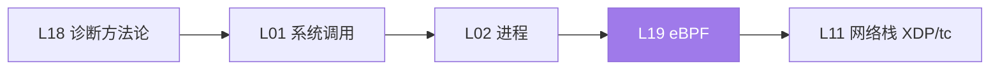

---

## 🧠 Linux 核心知识思维导图

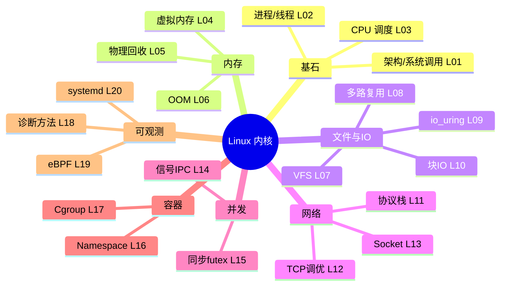

---

## 📊 难度与重要性矩阵

| 课程 | 难度 | 重要性 | 备注 |
|---|---|---|---|
| L01 架构/系统调用 | ⭐⭐⭐ | 🔥🔥🔥🔥🔥 | 一切的入口 |
| L02 进程/线程 | ⭐⭐⭐⭐ | 🔥🔥🔥🔥🔥 | 心智模型基石 |
| L03 CPU 调度 | ⭐⭐⭐⭐ | 🔥🔥🔥🔥 | 延迟问题根因 |
| L04 虚拟内存 | ⭐⭐⭐⭐ | 🔥🔥🔥🔥🔥 | 内存问题前提 |
| L05 物理回收 | ⭐⭐⭐⭐ | 🔥🔥🔥🔥 | swap/抖动根因 |
| L06 OOM 诊断 | ⭐⭐⭐⭐ | 🔥🔥🔥🔥🔥 | 容器最高频事故 |
| L07 VFS/FS | ⭐⭐⭐⭐ | 🔥🔥🔥 | 存储基础 |
| L08 I/O 多路复用 | ⭐⭐⭐⭐ | 🔥🔥🔥🔥🔥 | 高并发服务核心 |
| L09 io_uring | ⭐⭐⭐⭐⭐ | 🔥🔥🔥🔥 | 2026 高性能首选 |
| L10 块 I/O | ⭐⭐⭐⭐ | 🔥🔥🔥 | 存储瓶颈 |
| L11 网络栈 | ⭐⭐⭐⭐⭐ | 🔥🔥🔥🔥🔥 | 包路径必懂 |
| L12 TCP 调优 | ⭐⭐⭐⭐⭐ | 🔥🔥🔥🔥🔥 | 最高频线上问题 |
| L13 Socket | ⭐⭐⭐⭐ | 🔥🔥🔥🔥 | 连接管理 |
| L14 信号/IPC | ⭐⭐⭐⭐ | 🔥🔥🔥 | 优雅退出/通信 |
| L15 同步/futex | ⭐⭐⭐⭐⭐ | 🔥🔥🔥 | 锁的本质 |
| L16 Namespace | ⭐⭐⭐⭐ | 🔥🔥🔥🔥 | 容器底层 |
| L17 Cgroup | ⭐⭐⭐⭐ | 🔥🔥🔥🔥🔥 | 资源限额排障 |
| L18 诊断方法论 | ⭐⭐⭐⭐ | 🔥🔥🔥🔥🔥 | 串起所有知识 |
| L19 eBPF | ⭐⭐⭐⭐⭐ | 🔥🔥🔥🔥 | 现代可观测天花板 |
| L20 systemd | ⭐⭐⭐⭐ | 🔥🔥🔥🔥 | 服务管理日常 |

---

## 🔗 与已有课程的关系

| Linux 章节 | 关联已有课程 |
|---|---|
| L01 系统调用 | golang/G 系列 runtime、backend 通用 |
| L03 调度 | cloud-native/C06（CPU Requests/Limits/QoS） |
| L05/L06 内存/OOM | cloud-native/C06（memory limit）、redis/postgresql 内存调优 |
| L08 I/O 多路复用 | golang netpoller、redis 性能模型、backend I/O 模型 |
| L09 io_uring | backend 高性能 I/O、数据库引擎 |
| L11-L13 网络 | backend/B01-B02（网络/HTTP）、cloud-native/C03（K8s 网络）、microservices 通信 |
| L12 TCP 调优 | backend/B25（反向代理）、kafka/redis 网络层 |
| L16 Namespace | cloud-native/C01（Docker/OCI） |
| L17 Cgroup | cloud-native/C06（资源管理）、C01（容器） |
| L18 诊断 | backend/B24（可观测性）、golang/G22（pprof） |
| L19 eBPF | cloud-native/C03（Cilium）、C10（Mesh）、C11（可观测） |

---

## 🆕 2026 关键技术演进

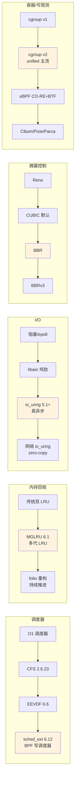
