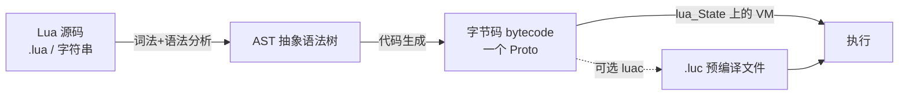
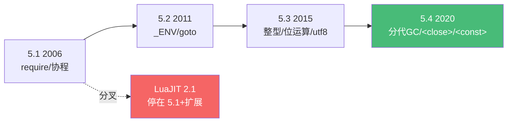

# 精通 Lua 概览与运行模型

> 课程编号：L01
> 路线图来源：Lua 全场景深度课程 — 概览与运行模型
> 难度：⭐⭐⭐（看似入门，但运行模型、字节码与多解释器实例藏着大量被忽略的细节）
> 预计阅读时间：50 分钟
> 📅 内容基准：**Lua 5.4.8**（2025-06，5.4 末版）+ **LuaJIT 2.1**（rolling）；最新大版本 **Lua 5.5.0**（2025-12）见 L25

---

## 引言：先回答三个问题

不急着讲历史。先看三段代码，你能立刻说出结果吗？

**第一段** —— 下面会打印什么？

```lua
function hello() return "hi" end
print(hello == _G.hello)        -- ?
print(_G["print"] == print)     -- ?
```

**第二段** —— 哪一行会真正执行？

```lua
if 0 then print("a") end
if "" then print("b") end
if nil then print("c") end
```

**第三段** —— 这段代码在 Lua 里"被编译成了什么"？

```lua
local x = 1
local y = 2
return x + y
```

第一段两行都是 `true`：在 Lua 里**全局函数 `hello` 不过是全局环境表 `_G` 里的一个字段**，`print` 也一样。第二段会打印 `a` 和 `b`——因为 Lua 中**只有 `nil` 和 `false` 是假**，`0` 和空字符串 `""` 都为真（这是从 C/Python 转过来的人栽的第一个跟头）。第三段会被编译成**寄存器式字节码**，`x + y` 大致是一条 `ADD R2 R0 R1` 指令——而不是 Python 那样的栈式 `LOAD/LOAD/BINARY_ADD`。

如果这三个问题中有任何一个让你犹豫，这一章就值得认真读。Lua 是一门"小到可以整个塞进脑子，但每个角落都经过精心设计"的语言。理解它的**设计哲学**、**运行模型**与**版本谱系**，是后续 24 篇（表、元表、协程、GC、LuaJIT、OpenResty、Redis 脚本……）的地基。

本文脉络：**它是什么 → 为什么这样设计 → 源码如何变成执行 → 寄存器式 VM → `lua_State` 多实例 → 版本史 → 工具链 → PUC-Lua vs LuaJIT**。

---

## 第一章：Lua 是什么

### 1.1 一句话定位

Lua（葡萄牙语"月亮"，读作 **LOO-ah**，不是"lua"也不是"露娃"）是一门**轻量、可嵌入、可移植的脚本语言**，1993 年诞生于巴西里约热内卢天主教大学（PUC-Rio），作者是 Roberto Ierusalimschy、Luiz Henrique de Figueiredo 和 Waldemar Celes。

它的核心卖点用三个词概括：

- **小（small）**：完整解释器 + 标准库编译后约 **200–300 KB**，源码仅约 3 万行干净的 ANSI C。
- **快（fast）**：在动态脚本语言里一直是速度标杆；加上 LuaJIT，可以逼近 C。
- **可嵌入（embeddable）**：它从设计第一天起就**不是为了独立运行**，而是作为"宿主程序里的一门配置/扩展语言"。

### 1.2 它无处不在，只是你常看不见它

Lua 极少作为"主语言"出现在简历上，但它藏在大量你每天用的系统里：

| 领域 | 代表 |
|---|---|
| 游戏 | 魔兽世界插件、Roblox（Luau 方言）、《愤怒的小鸟》《文明》、众多引擎的脚本层 |
| 网关 / Web | **OpenResty**（Nginx + LuaJIT）、**Apache APISIX**、Kong |
| 数据库 | **Redis 脚本**（`EVAL` / Functions） |
| 编辑器 | **Neovim**（`init.lua`、插件生态） |
| 网络设备 | Wireshark 解析器、Cisco / 大量嵌入式固件 |
| 运维 | nmap（NSE 脚本）、HAProxy、Tarantool |

注意这些场景的共同点：**宿主是 C/C++ 写的高性能系统，Lua 负责"可被快速修改的业务逻辑"**。这正是 Lua 的生态位——它不和 Python/Go 抢"写整个应用"的活，而是做**胶水与配置**。

### 1.3 设计哲学：机制而非策略

Lua 的设计信条之一是 **"提供机制（mechanisms），而非策略（policies）"**。最典型的体现：

- Lua **没有内置"类"**，但给了你**元表（metatable）**这套机制，让你能用几行代码搭出类、继承、运算符重载（见 L06、L11）。
- Lua **只有一种数据结构——表（table）**，但它同时充当数组、字典、对象、模块、命名空间（见 L05）。

这种"少即是多"的克制，使 Lua 既小又极具可塑性。代价是：很多"语言特性"需要你用模式（pattern）自己拼出来——这也是为什么深入理解机制比背 API 更重要。

---

## 第二章：从源码到执行——Lua 是"编译型"还是"解释型"？

这是个常被误解的问题。准确答案是：**Lua 先编译成字节码，再由虚拟机解释执行**——和 Python、Java 同属"编译到字节码 + VM"这一类，而不是逐行解释源码。

### 2.1 三个阶段



- **加载（load）**：`load` / `loadfile` / `loadstring`（5.1）/`require` 把源码编译成一个**函数**（本质是一个 `Proto` 原型对象，封装了字节码 + 常量表 + 调试信息）。这一步**只编译不执行**。
- **执行（call）**：调用这个函数，VM 才真正跑字节码。

```lua
local chunk = load("return 1 + 2")   -- 编译，返回一个函数，未执行
print(chunk())                        -- 执行 → 3
```

**关键认知**：在 Lua 里，**"一段代码（chunk）就是一个匿名函数"**。整个 `.lua` 文件被编译成一个顶层函数，它的参数是 `...`（vararg）。这解释了为什么文件里可以直接 `return`，也解释了 `require` 的返回值从哪来。

### 2.2 用 `luac -l` 亲眼看字节码

`luac` 是官方编译器，`-l` 反汇编：

```bash
$ cat add.lua
local x = 1
local y = 2
return x + y

$ luac -l add.lua
main <add.lua:0,0> (6 instructions ...)
    1   [0] VARARGPREP 0          ; 主 chunk 本身是 vararg 函数
    2   [1] LOADI      0 1        ; x = 1
    3   [2] LOADI      1 2        ; y = 2
    4   [3] ADD        2 0 1      ; R2 = R0 + R1
    5   [3] MMBIN      2 1 6      ; __add（元方法回退，A 与 ADD 目标寄存器一致）
    6   [3] RETURN1    2
```

看 `ADD 2 0 1`：它把**寄存器 0**（x）和**寄存器 1**（y）相加，结果放进**寄存器 2**。这是理解下一章"寄存器式 VM"的实证。

> 💡 `MMBIN`（metamethod binary）是 5.4 为运算符元方法回退预留的指令——当操作数不是数字时跳去查元表（见 L06）。

---

## 第三章：寄存器式虚拟机——Lua VM 的灵魂

### 3.1 栈式 vs 寄存器式

绝大多数脚本语言 VM（CPython、早期 JVM、Ruby）是**栈式（stack-based）**：操作数压栈、运算、出栈。Lua 5.0 起改用**寄存器式（register-based）** VM——这是它性能领先的关键设计之一。

对比 `x + y`：

```
栈式（如 CPython）:           寄存器式（Lua）:
  LOAD_FAST  x                  ADD  R2  R0  R1   ; 一条指令搞定
  LOAD_FAST  y
  BINARY_ADD
  STORE_FAST z
```

寄存器式的优势：

- **指令更少**：一条 `ADD` 直接表达"R0+R1→R2"，省去反复的压栈/出栈。
- **更利于优化**：编译器可以做寄存器分配、复用，减少数据搬运。
- **解释器循环 dispatch 次数更少** → 更快。

代价是每条指令更"宽"（要编码 3 个操作数），且编译器更复杂。Lua 团队的论文《The Implementation of Lua 5.0》正是这套设计的经典文献。

### 3.2 这里的"寄存器"是什么

注意：**Lua 的"寄存器"不是 CPU 寄存器**，而是**当前函数栈帧里的一段连续槽位（slot）**。每个函数最多 **255 个寄存器**（局部变量 + 临时值都占寄存器）。所以你会看到一个经验法则：

> 单个函数里的局部变量 + 中间结果不能超过约 200 个，否则编译报错 `too many local variables` / `too many registers`。

这也是为什么超长函数要拆分——不只是可读性，而是 VM 的硬限制。

### 3.3 指令格式速览

5.4 的每条指令是 **32 位**，操作码 7 位，其余编码 A/B/C/Bx/sBx 等字段。你不需要背，但知道"一条指令 32 位、含一个操作码 + 几个操作数槽位"足以理解性能讨论（如 LuaJIT 为什么能把热路径 trace 编译成机器码，见 L13）。

---

## 第四章：`lua_State`——一个解释器就是一个变量

### 4.1 没有全局解释器

Python 有一个进程级解释器（还有臭名昭著的 GIL）。Lua **完全不同**：整个解释器的状态被封装在一个 C 结构体 **`lua_State *`** 里。

```c
lua_State *L = luaL_newstate();   // 创建一个全新的、独立的 Lua 解释器
luaL_openlibs(L);                 // 打开标准库
luaL_dostring(L, "print('hi')");  // 在这个实例里执行
lua_close(L);                     // 销毁
```

含义极其深远：

- **你可以在一个进程里开任意多个互不干扰的 Lua 实例**——OpenResty 每个 Nginx worker 一个 VM，游戏引擎可以给每个 NPC 一个沙箱状态。
- **没有隐藏的全局状态**：所有"全局"其实都挂在某个 `lua_State` 的全局环境表上。
- **天然适合嵌入**：宿主程序完全掌控 Lua 的生命周期、内存分配器、错误边界。

### 4.2 `lua_State` 同时也是"协程"

一个微妙但重要的事实：**协程（coroutine）本质上也是一个 `lua_State`**（共享全局状态，但有独立的调用栈）。所以在 C API 里，主线程和协程都是 `lua_State *`。这一点在 L08（协程）和 L15（C API）会反复出现——现在先记住："Lua 线程 = lua_State"。

### 4.3 内存：宿主说了算

创建状态时可以传入自定义分配器：

```c
lua_State *L = lua_newstate(my_alloc, ud);
```

宿主可以精确控制 Lua 用多少内存、从哪个内存池拿——这对游戏主机、嵌入式设备至关重要。Lua 的 GC 也运行在这个分配器之上（见 L12）。

---

## 第五章：版本谱系——5.1 / 5.2 / 5.3 / 5.4 的关键分水岭

Lua 的版本**不保证向后兼容**，跨大版本常有破坏性变更。搞清楚谁引入了什么，能避免一大类"在这台机器能跑、那台不行"的坑。

| 版本 | 年份 | 关键变化 |
|---|---|---|
| **5.1** | 2006 | `module()`/`require` 体系、协程标准化、`#` 长度运算符。**LuaJIT 永远停在这里**（+ 部分扩展） |
| **5.2** | 2011 | `_ENV` 取代 `setfenv`、`goto`、废弃 `module()`、`bit32` 库、`__gc` 用于普通表 |
| **5.3** | 2015 | **整型/浮点分离**（integer subtype，64 位）、位运算符 `& | ~ << >>`、`//` 整除、`utf8` 库、`string.pack` |
| **5.4** | 2020 | **分代 GC**（generational）、**to-be-closed 变量 `<close>`**、**`<const>` 变量**、`warn` 系统、`coroutine.close`、数值 `for` 溢出语义修正 |

几条最容易踩的兼容性事实：

- **`5.3` 的整型是大事**：在 5.2 里 `3` 和 `3.0` 没区别（都是 double）；5.3 起 `3` 是整型、`3.0` 是浮点，`math.type(3) == "integer"`（见 L03）。
- **`5.2` 废弃了 `module()`**：老教程里 `module("foo", package.seeall)` 的写法在现代 Lua 已不推荐，应改用"返回 table"的模块写法（见 L10）。
- **`<close>` 是 5.4 独有**：在 5.3 及更早写 `local f <close> = ...` 直接语法错误。
- **LuaJIT ≈ 5.1 + 少量 5.2/5.3 扩展**：它**没有**原生整型、没有 `<close>`、没有 5.4 的分代 GC。给 OpenResty / 游戏写代码时，"我在用哪个 Lua"必须时刻清楚（见 L13）。



---

## 第六章：安装、运行与工具链

### 6.1 解释器与运行方式

```bash
# 标准 PUC-Lua
$ lua                      # 交互式 REPL
$ lua script.lua arg1      # 运行脚本，参数在 arg 表里
$ lua -e 'print(1+2)'      # 直接执行一行
$ lua -i script.lua        # 跑完脚本后进入 REPL（调试利器）

# LuaJIT
$ luajit script.lua
$ luajit -jv script.lua    # 打印 JIT trace 信息（见 L13）
```

REPL 里有个常被忽略的便利：**直接输入表达式会自动打印**（5.3+ 支持 `=expr` 老语法的现代化）：

```lua
> 1 + 2          --> 3   （5.4 REPL 自动回显）
> ="hello"       --> hello （兼容老式 = 前缀）
```

### 6.2 工具一览

| 工具 | 用途 |
|---|---|
| `lua` / `luajit` | 解释器 |
| `luac` | 预编译为字节码（`luac -o out.luc in.lua`），`-l` 反汇编 |
| `luarocks` | 包管理器（见 L10） |
| `luacheck` | 静态检查：未用变量、全局污染（见 L24） |
| `busted` | 测试框架（见 L24） |
| `stylua` | 代码格式化 |

### 6.3 `arg` 表与脚本入口

```lua
-- script.lua
print(arg[0])    -- 脚本名
print(arg[1])    -- 第一个命令行参数
print(#arg)      -- 参数个数
```

`arg[0]` 是脚本路径，`arg[-1]`、`arg[-2]` 还能拿到解释器本身和它的选项——这在写命令行工具时偶尔有用。

---

## 第七章：PUC-Lua vs LuaJIT——你到底在用哪个

这是贯穿全系列的一条暗线，这里先建立框架（细节见 L13/L14）。

| 维度 | PUC-Lua（参考实现） | LuaJIT |
|---|---|---|
| 维护方 | PUC-Rio 官方 | Mike Pall（社区接力维护）|
| 语言版本 | 紧跟 5.4 | **5.1 + 部分 5.2/5.3 扩展** |
| 执行方式 | 字节码解释器 | 解释器（手写汇编）+ **trace JIT** |
| 性能 | 动态语言里很快 | **快 1–50x，热路径接近 C** |
| 整型 | 5.3+ 有 | 无原生整型（用 double / `bit` 库 / FFI `int64_t`）|
| FFI | 无 | **有（杀手锏，见 L14）** |
| 典型场景 | 通用、教学、最新特性 | OpenResty、游戏、高性能嵌入 |

一句话决策：**要最新语言特性（`<close>`、原生整型、分代 GC）用 PUC-Lua 5.4；要极致性能 + FFI（OpenResty 全家桶）用 LuaJIT**。

> ⚠️ 一个高频混淆：你在 OpenResty 里写的"Lua"其实是 **LuaJIT（≈5.1）**。所以 OpenResty 代码里**不能**用 `<close>`、`//` 在老版本要小心、整型行为按 double 算。把这条钉在脑子里。

---

## 第八章：常见陷阱清单

### ❌ 陷阱 1：以为 `0` 和 `""` 是假

```lua
if 0 then print("进来了") end      -- 会打印！0 为真
if "" then print("也进来了") end   -- 会打印！空串为真
```

Lua 只有 `nil` 和 `false` 为假。要判断"零或空"必须显式写 `if n ~= 0` / `if s ~= ""`。

### ❌ 陷阱 2：把 Lua 当"逐行解释"，忽略编译期错误

```lua
local ok = load("for i=1, do end")   -- 语法错误
print(ok)                             -- nil（load 失败返回 nil + 错误信息）
```

`load` 在**编译期**就会失败，根本不会执行。`load` 返回 `nil, errmsg`——不检查就直接调用会 `attempt to call a nil value`。

### ❌ 陷阱 3：在 LuaJIT/OpenResty 里用 5.3+ 语法

```lua
local f <close> = io.open("x")   -- 在 LuaJIT 里语法错误！
local n = 7 // 2                 -- LuaJIT 支持 //，但结果是 double 3.0 不是整型 3
```

写"哪个 Lua"决定了你能用哪些语法。

### ❌ 陷阱 4：以为全局变量是"特殊的东西"

```lua
x = 10
print(_G.x)        -- 10：全局变量就是 _G 的字段
_G.y = 20
print(y)           -- 20：反过来也成立
```

理解这一点是后续"环境 `_ENV`、沙箱、模块"的基础（见 L02、L23）。

### ❌ 陷阱 5：单函数寄存器/局部变量超限

```lua
-- 一个函数里声明 200+ 个 local 会编译失败
-- error: too many local variables / too many registers
```

VM 每函数 255 个寄存器是硬上限。超长函数必须拆。

---

## 第九章：练习题

> 先在脑子里推断，再用 `lua` / `luac` 验证。

**练习 1**：不运行，说出输出。
```lua
print(type(print), type(_G), type(nil), type(1), type(1.0))
```

**练习 2**：下面三个 `if` 哪些分支会执行？
```lua
if 0 then print("A") end
if "0" then print("B") end
if not nil then print("C") end
```

**练习 3**：`load` 与执行的区别。这段打印什么？
```lua
local n = 0
local chunk = load("n = n + 1")   -- 注意：这里的 n 是全局还是局部？
print(n)
```

**练习 4**：用 `luac -l` 编译 `local a=10; local b=20; return a*b`，预测会出现哪条算术指令、结果落在第几个寄存器。

**练习 5**：判断真假——"在同一个 C 进程里不能同时存在两个独立的 Lua 解释器。"

---

## 参考答案与解析

**练习 1**：`function  table  nil  number  number`。注意 `_G` 是 `table`；`1` 和 `1.0` 的 `type` 都是 `number`（要区分整浮得用 `math.type`，见 L03）。

**练习 2**：打印 `B` 和 `C`。`0` 为真本应打印 A——等等，重看：`if 0` 为真，**A 也会打印**。所以三个都执行，输出 `A B C`。这题就是要你抓住"0 为真"。（若你答只有 B、C，正是中招了。）

**练习 3**：打印 `0`。`load` 编译出的 chunk 里 `n = n + 1` 操作的是**全局 `n`**（chunk 有自己的环境，外层的 `local n` 对它不可见），而且**这段 chunk 从未被调用**。所以外层局部 `n` 仍是 0。要执行得 `chunk()`，且即便执行改的也是全局 n。

**练习 4**：核心是 `MUL 2 0 1`（R0=a、R1=b、R2=积），随后 `MMBIN 2 ... ; __mul` 与 `RETURN1 2`；完整清单还包含开头的 `VARARGPREP 0`（主 chunk 是 vararg 函数）。

**练习 5**：**假**。Lua 的全部状态在 `lua_State` 里，一个进程可开任意多个独立实例——这正是它适合嵌入的根基。

---

## 小结

| 知识点 | 关键记忆 |
|---|---|
| 定位 | 小、快、可嵌入；做"宿主里的胶水/配置语言" |
| 设计哲学 | 提供机制而非策略；只有一种数据结构（表）+ 元表 |
| 执行模型 | 源码 → 字节码 → VM 解释；chunk 就是一个匿名函数 |
| VM 类型 | **寄存器式**（非栈式），每函数 ≤255 寄存器 |
| `lua_State` | 一个解释器实例 = 一个变量；可多开；协程也是 lua_State |
| 真假值 | **只有 `nil` 和 `false` 假**；`0`、`""` 皆真 |
| 全局变量 | 就是 `_G` 的字段 |
| 版本 | 5.3 整型、5.4 `<close>`/分代GC；**LuaJIT≈5.1** |

---

## 📅 2026 现状/更新

- **Lua 5.5.0**（2025-12-22 发布）是五年来首个大版本（全局变量声明、for 变量只读、紧凑数组省 60% 内存、major GC 增量化，详见 L25）；**Lua 5.4.8**（2025-06）是 5.4 系列末版，仍广泛使用。
- **LuaJIT** 无传统版本号，采用 rolling release（`2.1` 分支），由社区持续维护；仍是 OpenResty / 高性能场景事实标准。
- **Luau**（Roblox 基于 Lua 5.1 的渐进类型方言）发展活跃，但与标准 Lua 是不同分支（见 L23）。
- 生态采用面：OpenResty / APISIX（网关）、Redis（脚本 + 7.0 Functions）、Neovim（0.10+ 全面 Lua 化）——这正是本系列应用篇 L17–L22 的舞台。

---

> 🔁 下一篇 **L02 — 精通 Lua 值、类型与变量**：8 种基本类型、为什么 `nil` 和 `false` 是唯二假值、全局变量与 `_G`/`_ENV` 的真正关系、多重赋值与 `and`/`or` 短路返回值的妙用。
>
> 反馈：写完一节就动手敲一遍。Lua 的教程价值 = 阅读 × 立即运行。
