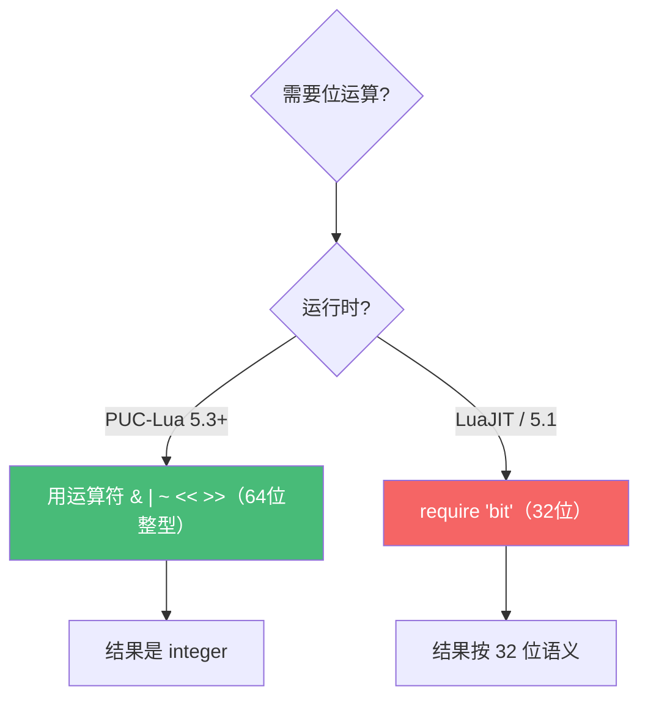

# 精通 Lua 数值：整浮分离与运算

> 课程编号：L03
> 路线图来源：Lua 全场景深度课程 — 数值系统
> 难度：⭐⭐⭐
> 预计阅读时间：45 分钟
> 📅 内容基准：**Lua 5.4.8**（整型自 5.3 引入）+ **LuaJIT 2.1**（无原生整型）

---

## 引言：数字真的只是数字吗？

```lua
-- 1) 输出？
print(math.type(3), math.type(3.0), math.type("3"))

-- 2) 输出？
print(3 / 2, 3 // 2, 2 ^ 2)

-- 3) 这两个键是同一个吗？
local t = {}
t[1]   = "整数键"
t[1.0] = "浮点键"
print(t[1])

-- 4) 输出？
print(math.maxinteger + 1 == math.mininteger)
```

答案：① `integer  float  nil`（`math.type` 对非数字返回 nil）；② `1.5  1  4.0`（`/` 永远得浮点、`//` 整除、`^` 幂**恒为浮点** → `4.0` 不是 `4`）；③ 打印 `浮点键`——因为 **`1` 和 `1.0` 数值相等，作为表键被视为同一个键**，后写的覆盖先写的；④ `true`——整型溢出是**回绕（wrap around）**，不是报错。

5.3 给 Lua 带来了一个许多人没意识到的根本变化：**`number` 内部分成整型（integer）和浮点（float）两个子类型**。这一章讲清楚它们的边界、运算规则与陷阱——这对写 Redis 脚本（L21）、处理 ID/时间戳、与 C 交互（L14/L15）尤其关键。

---

## 第一章：整型与浮点的分离（5.3 的分水岭）

### 1.1 一个 number，两个子类型

- **integer**：64 位有符号整数（`long long`），范围 `-2^63 ~ 2^63-1`。
- **float**：IEEE 754 双精度（`double`），同 C 的 `double`。

```lua
print(math.type(10))      -- integer
print(math.type(10.0))    -- float
print(math.type(10.5))    -- float
print(math.type(1e2))     -- float（科学计数法是浮点）
print(math.type(0x10))    -- integer（十六进制整数）
```

5.2 及更早**没有这个区分**——所有数字都是 double。LuaJIT（≈5.1）同理：**LuaJIT 里 `math.type` 不存在**，数字本质都是 double（大整数靠 FFI `int64_t` 或 `bit` 库处理，见 L14）。

> ⚠️ "我在用哪个 Lua"在这里第三次关键：PUC-Lua 5.4 有真整型；LuaJIT 没有。处理 64 位 ID 时这是天壤之别——double 只能精确表示到 2^53。

### 1.2 字面量怎么决定子类型

| 写法 | 子类型 |
|---|---|
| `10`、`0xFF`、`0b...`(无) | integer |
| `10.0`、`1e3`、`0x1p4`、`.5` | float |

记忆：**带小数点或指数（`e`/`p`）就是浮点，否则整数**。

---

## 第二章：算术运算的子类型规则

### 2.1 运算结果的类型推导

| 运算 | 规则 | 例子 |
|---|---|---|
| `+ - *` | 两个整型 → 整型；任一浮点 → 浮点 | `2+3=5`，`2+3.0=5.0` |
| `/` | **永远浮点** | `4/2 = 2.0`（不是 2！） |
| `//`（整除，floor division）| 同类→同类，向下取整 | `7//2=3`，`7.0//2=3.0`，`-7//2=-4` |
| `%`（取模）| 结果符号随除数 | `-5 % 3 = 1`，`5 % -3 = -1` |
| `^`（幂）| **永远浮点** | `2^3 = 8.0`（不是 8！） |

两条最容易被忽略：

```lua
print(4 / 2)     -- 2.0  ← 除法总是浮点
print(2 ^ 10)    -- 1024.0 ← 幂总是浮点
```

需要整数结果时用 `//` 或显式转换：

```lua
print(10 // 3)              -- 3（整除）
print(math.floor(10 / 3))  -- 3（先浮点除再 floor，得整型）
```

### 2.2 取模与整除的"向下取整"语义

Lua 的 `//` 和 `%` 都遵循 **floor 语义**（向负无穷取整），这和 C 的"向零截断"不同：

```lua
print(-7 // 2)   -- -4（不是 -3！向下取整）
print(-7 % 2)    --  1（与除数 2 同号）
print( 7 % -2)   -- -1（与除数 -2 同号）
```

恒等式 `a == (a // b) * b + (a % b)` 始终成立。处理"环形索引"（如时钟、缓冲区下标）时这个语义很顺手：`(idx % n)` 永远落在 `[0, n)`。

---

## 第三章：整数的精度与回绕

### 3.1 64 位边界

```lua
print(math.maxinteger)         --  9223372036854775807  (2^63 - 1)
print(math.mininteger)         -- -9223372036854775808
print(math.maxinteger + 1)     -- -9223372036854775808  ← 回绕！不报错
```

整型溢出是**静默回绕**（模 2^64），不是错误，也不是变浮点。处理累加器、哈希、ID 生成时务必当心。

### 3.2 整型 vs 浮点的精度临界

double 只能精确表示到 **2^53**；超过后整数会丢精度：

```lua
print(2^53)            -- 9.007199254740992e+15（浮点）
print(2^53 + 1)        -- 同上 ← 浮点加 1 没变化，精度丢失
print(math.maxinteger) -- 整型能精确到 2^63-1
```

所以"大整数（如雪花 ID、数据库 bigint）"在 5.3+ 一定用**整型**，绝不要让它沾上浮点运算（一旦 `/` 或 `^` 就退化成 double 丢精度）。这是 L21（Redis 脚本处理 ID）的重点。

### 3.3 整浮转换函数

```lua
math.tointeger(3.0)    -- 3（能无损转就转整型，否则 nil）
math.tointeger(3.5)    -- nil
math.type(3 | 0)       -- integer（位运算强制整型，见下章）
math.floor(3.7)        -- 3（返回整型）
math.ceil(3.2)         -- 4（返回整型）
```

`math.floor`/`math.ceil` 在 5.3+ 返回**整型**（5.2 返回浮点）——又一处版本差异。

---

## 第四章：位运算（5.3+）

5.3 引入了真正的位运算符，**只对整型有效**（浮点会先尝试转整型，不行就报错）：

| 运算符 | 含义 |
|---|---|
| `&` | 按位与 |
| `\|` | 按位或 |
| `~`（二元）| 按位异或 |
| `~`（一元）| 按位取反 |
| `<<` | 左移 |
| `>>` | 右移（逻辑右移，补 0） |

```lua
print(0xF0 & 0x0F)    -- 0
print(0xF0 | 0x0F)    -- 255
print(5 ~ 3)          -- 6（异或）
print(~0)             -- -1（全 1）
print(1 << 4)         -- 16
print(256 >> 2)       -- 64
```

⚠️ `>>` 是**逻辑右移**（高位补 0），不是算术右移。负数右移会得到很大的正数：

```lua
print(-1 >> 1)        -- 9223372036854775807（不是 -1！高位补 0）
```

### 4.1 LuaJIT 的位运算：`bit` 库

LuaJIT（≈5.1）**没有位运算符**，要用 `bit` 库（Mike Pall 的 BitOp），且**按 32 位**操作：

```lua
-- LuaJIT / Lua 5.1
local bit = require("bit")
print(bit.band(0xF0, 0x0F))   -- 0
print(bit.bor(0xF0, 0x0F))    -- 255
print(bit.lshift(1, 4))       -- 16
print(bit.bxor(5, 3))         -- 6
```

这是 OpenResty 代码里位运算的标准写法。**32 位 vs 64 位**的差异在处理掩码、哈希时要特别注意。



---

## 第五章：数字与字符串的相互转换

### 5.1 字符串 → 数字

```lua
tonumber("42")        -- 42（integer）
tonumber("42.0")      -- 42.0（float）
tonumber("0x1A")      -- 26
tonumber("1e3")       -- 1000.0
tonumber("  10  ")    -- 10（忽略首尾空白）
tonumber("0b101")     -- nil（不支持二进制字面量）
tonumber("ff", 16)    -- 255（第二参指定进制 2-36）
tonumber("z", 36)     -- 35
tonumber("abc")       -- nil（失败返回 nil，不报错）
```

### 5.2 算术上下文的自动转换（谨慎）

```lua
print("10" + 5)       -- 15（字符串被转数字）
print("3.14" * 2)     -- 6.28
print("0x10" + 0)     -- 16
```

5.4 收紧了规则，但仍建议**显式 `tonumber`**——隐式转换让 bug 难查、且性能更差（每次都要解析字符串）。

### 5.3 数字 → 字符串

```lua
tostring(42)             -- "42"
tostring(42.0)           -- "42.0"（保留 .0 区分浮点）
tostring(1/0)            -- "inf"
tostring(-1/0)           -- "-inf"
tostring(0/0)            -- "-nan" 或 "nan"（平台相关）
string.format("%d", 42)  -- "42"
string.format("%.2f", math.pi)  -- "3.14"
string.format("%x", 255) -- "ff"
```

注意 `tostring(42.0)` 是 `"42.0"`——浮点的字符串表示带小数点，用于区分整浮。

---

## 第六章：相等、比较与"作为表键"

### 6.1 整浮相等但表键归一

```lua
print(1 == 1.0)        -- true（数值相等，跨子类型比较）
print(0 == -0.0)       -- true

local t = {}
t[1] = "a"
t[1.0] = "b"           -- 1.0 被归一化成整型键 1
print(t[1])            -- "b"（覆盖了！）

t[2.0] = "x"
print(t[2])            -- "x"（2.0 作键等价于 2）
```

**规则**：能精确表示为整型的浮点键会被**转成整型键**。`t[1]` 和 `t[1.0]` 是同一个键。这在序列化、缓存键设计时是隐藏陷阱（见 L05）。

但**不能转整型的浮点键保持浮点**：

```lua
t[1.5] = "y"
print(t[1.5])          -- "y"（1.5 没有整型等价，作浮点键）
```

### 6.2 NaN 的特殊性

```lua
local nan = 0/0
print(nan == nan)      -- false！NaN 不等于自身
print(nan ~= nan)      -- true（用这个检测 NaN）

local t = {}
-- t[nan] = 1          -- ❌ 报错：table index is NaN
```

NaN 作表键会报错；检测 NaN 用 `x ~= x`。

---

## 第七章：常见陷阱清单

### ❌ 陷阱 1：以为 `/` 得整数

```lua
local mid = (lo + hi) / 2     -- 得浮点！可能 2.5
arr[mid]                       -- 浮点下标，多数时不是你要的
```
修正：`local mid = (lo + hi) // 2`。

### ❌ 陷阱 2：`^` 得浮点

```lua
local size = 2 ^ 10           -- 1024.0（float）
local buf = {}; buf[size] = 1 -- size 是 1024.0，作键归一为 1024，凑巧 OK，但语义混乱
```
修正：`local size = 1 << 10`（整型 1024）或 `math.tointeger(2^10)`。

### ❌ 陷阱 3：大整数沾上浮点丢精度

```lua
local id = 9007199254740993   -- 2^53+1，整型精确
local bad = id / 1.0          -- 变 double，丢精度！
```
修正：64 位 ID 全程用整型运算，绝不 `/`、`^`、`* 1.0`。

### ❌ 陷阱 4：LuaJIT 当成有整型

```lua
-- LuaJIT 里：
print(3 / 2)        -- 1.5
print(math.type)    -- nil（LuaJIT 没有 math.type！）
local big = 9007199254740993   -- double，已经不精确
```
LuaJIT 处理大整数要用 FFI `int64_t`（见 L14）或字符串。

### ❌ 陷阱 5：浮点相等比较

```lua
if 0.1 + 0.2 == 0.3 then ... end   -- false！IEEE 754 误差
```
修正：比较差的绝对值 `math.abs(a - b) < 1e-9`。

### ❌ 陷阱 6：负数逻辑右移

```lua
print(-1 >> 1)      -- 巨大正数（高位补 0），不是 -1
```
要算术右移得自己处理符号位。

---

## 第八章：练习题

**练习 1**：输出？
```lua
print(7 // 2, 7.0 // 2, -7 // 2, 7 % -3)
```

**练习 2**：`math.type` 各返回什么？
```lua
print(math.type(2^2), math.type(4 // 2), math.type(4 / 2))
```

**练习 3**：这个表最终有几个键？
```lua
local t = {}
t[1] = "a"; t[1.0] = "b"; t[1.5] = "c"; t["1"] = "d"
local n = 0
for _ in pairs(t) do n = n + 1 end
print(n)
```

**练习 4**：检测 NaN，补全：
```lua
local function isnan(x) return ___ end
```

**练习 5**：在 LuaJIT 和 PUC-Lua 5.4 上分别预测：
```lua
print((1 << 53) + 1 - (1 << 53))
```

---

## 参考答案与解析

**练习 1**：`3  3.0  -4  -2`。`7//2=3`；`7.0//2=3.0`（浮点）；`-7//2=-4`（向下取整）；`7 % -3`：结果与除数 -3 同号 → `-2`（因 `7 = (-3)*(-3) + (-2)`）。

**练习 2**：`float  integer  float`。`2^2=4.0`（幂恒浮点）；`4//2=2`（整除得整型）；`4/2=2.0`（除恒浮点）。

**练习 3**：`3` 个键。`t[1]`/`t[1.0]` 归一为同一整型键（值被 "b" 覆盖）；`t[1.5]` 是独立浮点键；`t["1"]` 是字符串键，与数字键不同。所以键有：`1`、`1.5`、`"1"` → 3 个。

**练习 4**：`return x ~= x`。NaN 是唯一不等于自身的值。

**练习 5**：
- **PUC-Lua 5.4**：整型运算，`(1<<53)` 是整型，`+1` 精确，结果 `1`。
- **LuaJIT**：double 运算，`2^53 + 1` 在 double 下等于 `2^53`（精度丢失），结果 `0`。
这道题完美体现"你在用哪个 Lua"的实质差异。

---

## 小结

| 知识点 | 关键记忆 |
|---|---|
| 子类型 | 5.3+ number 分 integer(64位) / float(double)；`math.type` 区分 |
| 字面量 | 带小数点/指数 → float，否则 integer |
| 除与幂 | `/` 和 `^` **永远浮点**；整除用 `//` |
| 取模/整除 | floor 语义（向负无穷），`%` 符号随除数 |
| 整型边界 | 溢出**回绕**不报错；double 精度仅到 2^53 |
| 位运算 | 5.3 运算符（64位）；**LuaJIT 用 `bit` 库（32位）** |
| 表键归一 | `1` 与 `1.0` 同键；NaN 不能作键；浮点比较防误差 |
| LuaJIT | **无原生整型/无 math.type**，大整数靠 FFI int64 |

---

## 📅 2026 现状/更新

- 整型/位运算自 **5.3** 起稳定，5.4 沿用；`math.floor`/`ceil` 返回整型。
- **LuaJIT 仍无原生整型**，64 位整数运算依赖 FFI `int64_t`/`uint64_t` 或字符串——OpenResty/Redis 处理雪花 ID 时这是核心注意点（见 L14、L21）。
- 5.4 进一步收紧字符串→数字的隐式强制，显式转换是稳妥写法。

---

> 🔁 下一篇 **L04 — 精通 Lua 字符串与模式匹配**：字符串的不可变与内部化、Lua 模式（pattern，注意它**不是正则**）、`gsub`/`gmatch` 的高级用法，以及字符串拼接的性能真相。
>
> 反馈：把每个"输出？"在 `lua` 和 `luajit` 里各跑一遍，差异本身就是最好的老师。
