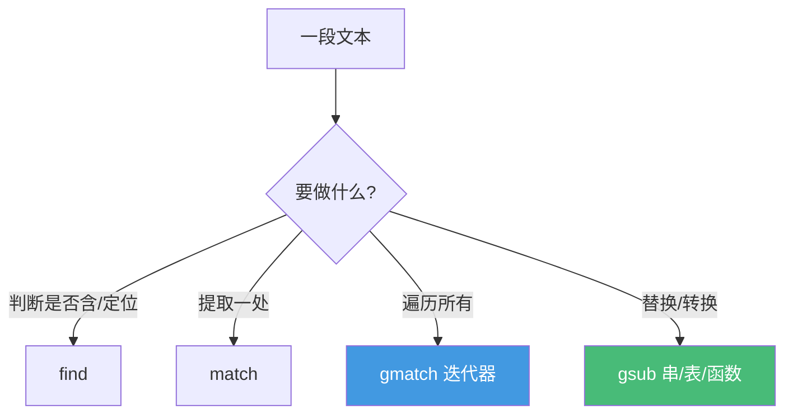

# 精通 Lua 字符串与模式匹配

> 课程编号：L04
> 路线图来源：Lua 全场景深度课程 — 字符串与模式
> 难度：⭐⭐⭐⭐
> 预计阅读时间：55 分钟
> 📅 内容基准：**Lua 5.4.8** + **LuaJIT 2.1**

---

## 引言：你以为你懂正则，但这不是正则

```lua
-- 1) 输出？
local s = "hello"
print(#s, s:upper(), s:sub(2, 4))

-- 2) 输出？（注意：Lua 模式不是正则！）
print(string.match("2026-05-29", "(%d+)-(%d+)-(%d+)"))

-- 3) 这个"正则"会怎样？
print(string.match("a.b.c", "a.b"))      -- . 在 Lua 模式里是什么？

-- 4) gsub 返回几个值？
local r = ("aaa"):gsub("a", "b")
print(r)
```

答案：① `5  HELLO  ell`；② `2026  05  29`（三个捕获）；③ 匹配到 `"a.b"`——但**注意 `.` 在 Lua 模式里是"任意字符"**，所以它也能匹配 `"axb"`，这里凑巧原串就有字面 `.`；④ 打印 `bbb  3`——**`gsub` 返回两个值（结果串 + 替换次数）**，写 `local r = ...:gsub(...)` 只接了第一个，但若写在 `print` 或表里会暴露第二个值。

Lua 的字符串系统有两大特点常被低估：**字符串是不可变且内部化的**，以及 **Lua 用自创的"模式（pattern）"而非正则表达式**。搞混"模式 vs 正则"会写出难以察觉的 bug。这一章把两者讲透——它们是日志解析、协议处理、OpenResty 路由（L17）、Redis key 处理（L21）的日常工具。

---

## 第一章：字符串是不可变的字节串

### 1.1 不可变（immutable）

Lua 字符串一旦创建**不可修改**。所有 string 库函数都返回**新字符串**：

```lua
local s = "hello"
-- s[1] = "H"          -- ❌ 报错：字符串不支持下标赋值
local s2 = s:upper()  -- 返回新串 "HELLO"，s 不变
print(s, s2)          -- hello  HELLO
```

要"修改"字符串，必须转成 `table`/`{byte}` 处理再拼回，或用 `gsub`。

### 1.2 内部化（interning）

Lua 对字符串做**内部化**：相同内容的字符串在内存里**只存一份**，比较和哈希极快。

```lua
local a = "hello"
local b = "hel" .. "lo"
-- a 和 b 内容相同，内部指向同一份数据
print(a == b)          -- true（O(1) 比较：先比指针）
```

含义：

- **字符串比较是 O(1)**（先比内部化指针，不等再比内容）——这是 Lua 哈希表用字符串作键极快的原因（见 L05）。
- **字符串作表键非常高效**，这也是为什么 Lua 习惯用字符串键（`t.name`）。

5.4 的实现细节：**短字符串（≤40 字节）全部内部化并驻留**；长字符串按需哈希、不一定驻留。你不需要记数字，但要知道"短字符串作键/比较几乎零成本"。

### 1.3 长字符串与转义

```lua
local s1 = "带\"引号\"和\n换行"
local s2 = [[
原样保留的
多行文本，不处理转义 \n
]]
local s3 = [==[ 含 ]] 的文本用 [==[ ]==] 包 ]==]
```

`[[ ]]` 长字符串**不处理转义**、可跨行，适合嵌 SQL、JSON、模板。`[==[ ]==]` 用等号调整层级以包含 `]]`。

常用转义：`\n \t \\ \" \ddd`（十进制字节）、`\xHH`（十六进制，5.2+）、`\u{XXXX}`（UTF-8 码点，5.3+）、`\z`（吃掉后续空白，5.2+）。

---

## 第二章：string 库核心

字符串方法可以用 `s:method(...)` 调用（等价 `string.method(s, ...)`，因为 `string` 是所有字符串的元表 `__index`，见 L06）：

| 函数 | 作用 | 例 |
|---|---|---|
| `#s` / `string.len` | 字节长度 | `#"abc"` → 3 |
| `sub(i, j)` | 子串（支持负索引） | `("hello"):sub(2,4)` → `ell` |
| `upper`/`lower` | 大小写（仅 ASCII） | |
| `rep(n[, sep])` | 重复 | `("ab"):rep(3, "-")` → `ab-ab-ab` |
| `byte(i)` / `char(...)` | 字节↔字符 | `("A"):byte()` → 65；`string.char(65)` → `A` |
| `reverse` | 反转字节 | |
| `format(fmt, ...)` | 格式化（类 C printf） | `("%d-%s"):format(1,"x")` |
| `find` / `match` / `gmatch` / `gsub` | 模式匹配（下章） | |

### 2.1 索引：1-based 且支持负数

Lua 字符串/表索引**从 1 开始**（不是 0！），负索引从末尾倒数：

```lua
local s = "hello"
print(s:sub(1, 3))    -- hel
print(s:sub(-3))      -- llo（倒数第 3 到末尾）
print(s:sub(2, -2))   -- ell（第 2 到倒数第 2）
print(s:byte(-1))     -- 111（最后一个字节 'o'）
```

### 2.2 `string.format` 速查

```lua
string.format("%d", 42)        -- "42"
string.format("%05d", 42)      -- "00042"
string.format("%.2f", math.pi) -- "3.14"
string.format("%x / %X", 255, 255)  -- "ff / FF"
string.format("%q", 'a"b')     -- '"a\"b"'（可安全反读的转义）
string.format("%s", {})        -- "table: 0x..."（自动 tostring）
```

`%q` 很有用——它生成可被 Lua 重新读回的字面量，常用于序列化。

### 2.3 `#` 是字节数，不是字符数

```lua
print(#"中文")        -- 6（UTF-8 下每个汉字 3 字节）
print(utf8.len("中文")) -- 2（字符数，见 L16）
```

`#`、`sub`、`byte` 都按**字节**操作。处理 UTF-8 文本要用 `utf8` 库（5.3+）。

---

## 第三章：Lua 模式（Pattern）——不是正则！

这是本章核心。Lua **没有内置正则引擎**，而是用一套更小、更快但语法不同的"模式"。混淆两者是最常见错误来源。

### 3.1 字符类（character classes）

| 模式 | 匹配 |
|---|---|
| `.` | 任意字符 |
| `%a` | 字母 | `%A` 非字母 |
| `%d` | 数字 | `%D` 非数字 |
| `%s` | 空白 | `%S` 非空白 |
| `%w` | 字母或数字 | `%W` 反 |
| `%l` / `%u` | 小写/大写字母 |
| `%p` | 标点 | `%c` 控制符 | `%x` 十六进制数字 |
| `%数字` 等 | `%` 转义魔法字符（见下） |

**大写 = 取反**。魔法字符 `( ) . % + - * ? [ ] ^ $` 要匹配字面值需用 `%` 转义：`%.` 匹配字面点、`%%` 匹配 `%`。

### 3.2 自定义类 `[ ]` 与量词

```lua
[abc]      -- a 或 b 或 c
[a-z]      -- 范围
[^0-9]     -- 取反：非数字
[%a_]      -- 字母或下划线
```

量词（**注意和正则不同**）：

| 量词 | 含义 |
|---|---|
| `*` | 0 或多个（**贪婪**） |
| `+` | 1 或多个（贪婪） |
| `-` | 0 或多个（**最小/惰性**，对应正则的 `*?`） |
| `?` | 0 或 1 个 |

⚠️ **没有 `{n,m}` 量词**，没有 `\d`（用 `%d`），没有 `|` 交替，没有前后查找。这就是"模式"和"正则"的根本区别——更简单、更快，但表达力弱。

```lua
print(string.match("   hi", "%s*(%S+)"))   -- "hi"（跳过前导空白）
print(string.match("<<x>>", "<(.-)>"))     -- "<x"? 不对，要看惰性
```

第二例：`<(.-)>` 用惰性 `-`，从第一个 `<` 匹配到**最近**的 `>`。`<<x>>`：第一个 `<` 后 `.-` 惰性匹配，遇到第一个 `>` 停 → 捕获 `<x`。理解贪婪 vs 惰性是模式匹配的关键。

### 3.3 锚点与捕获

```lua
^pattern    -- 锚定串首
pattern$    -- 锚定串尾
(...)       -- 捕获（capture）
()          -- 位置捕获：返回当前位置（数字）
```

```lua
print(string.match("key=value", "(%w+)=(%w+)"))   -- key  value
print(string.match("  trim  ", "^%s*(.-)%s*$"))   -- "trim"（去首尾空白的经典写法）
print(string.match("abc", "()b()"))               -- 2  3（b 的起止位置）
```

"去首尾空白" `^%s*(.-)%s*$` 是必须记住的习语。

### 3.4 特殊模式项 `%b` 与 `%f`

```lua
%bxy    -- 匹配平衡的 xy 对（如 %b() 匹配括号配对）
%f[set] -- frontier（边界），匹配从"非 set"到"set"的位置
```

```lua
print(string.match("f(a(b)c)d", "%b()"))   -- (a(b)c)（平衡括号，含嵌套）
-- %f 找单词边界：
for w in string.gmatch("THE (quick) fox", "%f[%a]%a+%f[%A]") do
    io.write(w, " ")    -- THE quick fox
end
```

`%b()` 处理嵌套括号是正则难做的事，Lua 一招搞定。

---

## 第四章：四大匹配函数

### 4.1 `find`：定位

```lua
local i, j = string.find("hello world", "world")
print(i, j)              -- 7  11（起止字节位置）
print(string.find("a.b", ".", 1, true))  -- 1 1（第 4 参 plain=true：纯文本查找，不当模式）
local i, j, cap = string.find("k=v", "(%w+)=")  -- 还能返回捕获
```

⚠️ `find` 第 4 个参数 `plain=true` 关闭模式匹配——查找含魔法字符的字面子串时必用，否则 `.` 会被当通配。

### 4.2 `match`：提取

```lua
print(string.match("2026-05-29", "%d+-%d+-%d+"))     -- 2026-05-29（无捕获→整个匹配）
print(string.match("2026-05-29", "(%d+)-(%d+)"))     -- 2026  05（有捕获→返回捕获）
print(string.match("no digits", "%d+"))              -- nil（不匹配）
```

### 4.3 `gmatch`：迭代所有匹配

```lua
for word in string.gmatch("the quick brown", "%a+") do
    print(word)          -- the / quick / brown
end

-- 解析 key=value; 列表
for k, v in string.gmatch("a=1;b=2;c=3", "(%w+)=(%w+)") do
    print(k, v)          -- a 1 / b 2 / c 3
end
```

`gmatch` 返回**迭代器**，是解析结构化文本的主力（见 L07 迭代器、L08 协程做迭代器）。

### 4.4 `gsub`：替换（最强大）

`gsub(s, pattern, repl[, n])` 返回**新串 + 替换次数**。`repl` 可以是字符串、表或函数：

```lua
-- 字符串替换，%1 引用捕获
print(("hello"):gsub("l", "L"))            -- heLLo  2
print(("2026-05"):gsub("(%d+)-(%d+)", "%2/%1"))  -- 05/2026  1

-- 表替换：用捕获查表
local map = { cat = "猫", dog = "狗" }
print(("cat and dog"):gsub("%a+", map))    -- 猫 and 狗  3（查不到的保留原样）

-- 函数替换：最灵活
print(("a1b2"):gsub("%d", function(d) return "["..d.."]" end))  -- a[1]b[2]  2

-- 限制次数
print(("aaaa"):gsub("a", "b", 2))          -- bbaa  2
```

`%0` 引用整个匹配，`%1`–`%9` 引用捕获。函数返回 `nil`/`false` 表示"不替换，保留原文"。这套机制能做模板渲染、转义、词法替换。



---

## 第五章：字符串拼接的性能真相

### 5.1 `..` 在循环里是 O(n²)

字符串不可变，每次 `..` 都**创建新串 + 拷贝**。循环拼接是平方复杂度：

```lua
-- ❌ 慢：每次都生成新串
local s = ""
for i = 1, 100000 do
    s = s .. i .. ","     -- O(n²)，越拼越慢
end
```

### 5.2 用 `table.concat`

把片段攒进表，最后一次性 `concat`：

```lua
-- ✅ 快：O(n)
local buf = {}
for i = 1, 100000 do
    buf[#buf + 1] = i
end
local s = table.concat(buf, ",")
```

`table.concat(t, sep)` 是 Lua 的 "StringBuilder"。性能差异在大数据量下是数量级的。OpenResty 拼响应体、生成大 SQL 时这是必修。

### 5.3 `string.format` vs `..`

少量拼接 `..` 更快更省；带格式（补零、浮点精度）用 `format`；大量片段用 `concat`。

---

## 第六章：常见陷阱清单

### ❌ 陷阱 1：把 Lua 模式当正则

```lua
string.match("a|b", "a|b")    -- 想匹配 "a 或 b"？Lua 没有 | ！这是字面匹配 "a|b"
string.match("123", "\\d+")   -- ❌ Lua 用 %d 不是 \d
string.match("x", "a{2,3}")   -- ❌ Lua 没有 {n,m}
```
修正：用 `%d`、`[ab]`、手写重复。需要真正则在 OpenResty 用 `ngx.re`（基于 PCRE，见 L17）。

### ❌ 陷阱 2：忘记转义魔法字符

```lua
string.find("1.5.0", ".")     -- 匹配第 1 个字符（. 是通配）！返回 1,1
string.find("1.5.0", "%.")    -- ✅ 匹配字面点，返回 2,2
string.find("1.5.0", ".", 1, true)  -- ✅ plain 模式
```

### ❌ 陷阱 3：`gsub` 的第二返回值漏看/误用

```lua
local clean = str:gsub("%s+", " ")   -- clean 接了串，但...
local t = { str:gsub("%s", "") }     -- t = {结果串, 替换次数} 两个元素！
```
单值场景用括号包：`local clean = (str:gsub("%s+", " "))`。

### ❌ 陷阱 4：循环 `..` 拼大串

见第五章，改 `table.concat`。

### ❌ 陷阱 5：`#` 当字符数处理 UTF-8

```lua
print(#"café")        -- 5（é 是 2 字节）
("café"):sub(1, 4)    -- 可能切坏多字节字符
```
UTF-8 用 `utf8.len`/`utf8.offset`（见 L16）。

### ❌ 陷阱 6：贪婪量词吃太多

```lua
string.match("<a><b>", "<(.+)>")    -- 捕获 "a><b"（贪婪到最后一个 >）
string.match("<a><b>", "<(.-)>")    -- 捕获 "a"（惰性到第一个 >）
```

---

## 第七章：练习题

**练习 1**：输出？
```lua
print(("Hello"):sub(2, -2), ("Hello"):byte(1), #"αβ")
```

**练习 2**：写一个模式提取 `user@host.com` 中的用户名和域名。

**练习 3**：`gsub` 输出？
```lua
print(("a1b2c3"):gsub("%a(%d)", "%1"))
```

**练习 4**：找 bug：
```lua
local function trim(s) return s:match("^%s*(.*)%s*$") end
print("[" .. trim("  hi  ") .. "]")
```

**练习 5**：用 `%b` 提取 `func(a, (b+c), d)` 的整个参数括号内容。

---

## 参考答案与解析

**练习 1**：`ell  72  4`。`sub(2,-2)` → `ell`；`byte(1)` 是 'H'=72；`#"αβ"`：希腊字母每个 2 字节 → 4。

**练习 2**：
```lua
local user, host = ("alice@mail.com"):match("([^@]+)@(.+)")
print(user, host)   -- alice  mail.com
```

**练习 3**：`abc  3`。模式 `%a(%d)` 匹配"字母+数字"，捕获数字，替换为捕获本身（即去掉字母）。`a1`→`1`、`b2`→`2`、`c3`→`3`，结果 `123`？等等——替换是把"字母数字对"换成"数字"，所以 `a1b2c3` → `1` `2` `3` 拼接 = `123`，替换 3 次。**正确答案 `123  3`**。（解析修正：每个 `%a%d` 两字符被替换为 1 个数字。）

**练习 4**：贪婪 bug。`(.*)` 贪婪会把尾部空白也吃进捕获，`%s*$` 匹配空。结果含尾空白 `hi  `。修正用惰性：`s:match("^%s*(.-)%s*$")`。

**练习 5**：
```lua
print(("func(a, (b+c), d)"):match("%b()"))   -- (a, (b+c), d)
```
`%b()` 正确处理嵌套括号。

---

## 小结

| 知识点 | 关键记忆 |
|---|---|
| 不可变 | 字符串只读；所有操作返回新串 |
| 内部化 | 相同内容存一份；比较/作键 O(1)，短串驻留 |
| 索引 | **1-based**，支持负索引；`#`/`sub`/`byte` 按字节 |
| 模式≠正则 | 用 `%d` 非 `\d`；无 `{n,m}`、无 `\|` 交替 |
| 量词 | `* + ?` 贪婪，`-` 惰性；大写类取反 |
| 习语 | 去空白 `^%s*(.-)%s*$`；平衡 `%b()`；plain 查找 `find(...,true)` |
| 四函数 | find 定位 / match 提取 / gmatch 迭代 / gsub 替换(串/表/函数) |
| 性能 | 循环拼接用 `table.concat`，别 `..` |

---

## 📅 2026 现状/更新

- Lua 模式自始稳定；需要完整正则（前后查找、交替、`{n,m}`）时，**OpenResty 用 `ngx.re.*`（PCRE/PCRE2）**，比 Lua 模式强大但更重（见 L17）。
- `string.pack`/`unpack`（5.3+）用于二进制协议打包，是处理网络帧/文件格式的利器（L16 提及）。
- 字符串内部化与短串驻留在 5.4 仍是性能基石；OpenResty 高频路径常用字符串作 key 正是受益于此。

---

> 🔁 下一篇 **L05 — 精通 Lua 表(table)底层结构**：表为何能身兼数组/字典/对象、内部"数组部分+哈希部分"如何 rehash、`#` 与"序列"的微妙定义，以及含 nil 洞表的未定义行为。
>
> 反馈：模式匹配只有多写才能形成肌肉记忆，拿你的日志格式练 `gmatch`。
