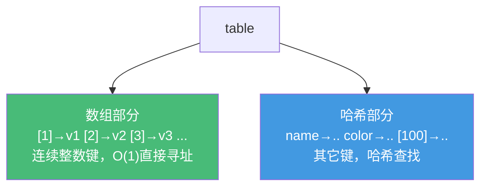

# 精通 Lua 表(table)底层结构

> 课程编号：L05
> 路线图来源：Lua 全场景深度课程 — 唯一的数据结构
> 难度：⭐⭐⭐⭐
> 预计阅读时间：55 分钟
> 📅 内容基准：**Lua 5.4.8** + **LuaJIT 2.1**

---

## 引言：一个结构统治一切

```lua
-- 1) 这个表的"长度"是多少？
local t = {10, 20, 30, nil, 50}
print(#t)                -- ?（可能不止一个答案）

-- 2) 这两次赋值后表里有几个元素？
local u = {}
u[1] = "a"; u[3] = "c"
print(#u)                -- ?

-- 3) 数组还是字典？
local v = {1, 2, 3, x = "a", y = "b"}
print(#v, v.x)           -- ?

-- 4) 表是值还是引用？
local function clear(tbl) tbl = {} end
local w = {1, 2, 3}
clear(w)
print(#w)                -- ?
```

答案：① `#t` 是 `5` **或** `3`——含 nil 洞的表，`#` 返回值是**未定义的边界**（实现可能给 3 也可能给 5）；② `#u` 是 `1`（`u[2]` 是 nil 洞，`#` 只保证到 1）；③ `3  a`（表同时是数组 `{1,2,3}` 和字典 `{x,y}`）；④ `3`——`clear` 里 `tbl = {}` 只是让局部参数指向新表，**不影响外部 `w`**（表按引用传递，但重新赋值参数不改变实参）。

表（table）是 Lua **唯一的复合数据结构**。数组、字典、对象、模块、命名空间、集合——全用它。理解它的内部"数组部分 + 哈希部分"双结构，能解释 `#` 的诡异、性能特征、以及一大类隐藏 bug。

---

## 第一章：一个表，多重身份

### 1.1 表能当什么

```lua
-- 数组（连续整数键 1..n）
local arr = {10, 20, 30}
print(arr[1], arr[3])       -- 10  30

-- 字典（任意键）
local dict = {name = "Lua", year = 1993}
print(dict.name, dict["year"])

-- 混合
local mix = {1, 2, 3, color = "red"}

-- 对象（+ 元表，见 L11）
-- 命名空间/模块（见 L10）
local M = {}; function M.f() end

-- 集合（值放键上）
local set = { apple = true, banana = true }
print(set.apple)            -- true（O(1) 判断成员）
```

`t.name` 是 `t["name"]` 的语法糖（键是字符串 `"name"`）。`t[name]` 用变量 `name` 的值作键——两者完全不同。

### 1.2 构造器语法

```lua
local t = {
    10, 20, 30,             -- 位置元素 → t[1],t[2],t[3]
    x = 1,                  -- 命名 → t.x
    ["with space"] = 2,     -- 表达式键
    [100] = "h",            -- 显式整数键
}
-- 位置元素和命名元素可混排，但位置计数只算"裸值"
```

---

## 第二章：内部结构——数组部分 + 哈希部分

### 2.1 双部分设计

Lua 表内部由**两块**组成：

- **数组部分（array part）**：存连续整数键 `1, 2, 3, ...` 的值，像 C 数组一样紧凑、按下标直接寻址，**快且省内存**。
- **哈希部分（hash part）**：存其它所有键（字符串、非连续整数、浮点、表……），开放寻址 + 链式（Brent 变体）的哈希表。



```lua
local t = {1, 2, 3, name = "x", [100] = "y"}
-- 1,2,3 进数组部分；name、[100] 进哈希部分（100 不连续）
```

这套设计让"纯数组"用法极快、极省内存，又不牺牲字典的灵活性。

### 2.2 rehash：动态调整

当表增长、某部分装满，Lua 触发 **rehash**：重新计算数组部分与哈希部分的理想大小并搬迁数据。rehash 会遍历所有键、做一次代价为 O(n) 的重建——但均摊下来插入仍是 O(1)。

**性能影响**：频繁让表在"数组/哈希边界"反复横跳会触发多次 rehash。预分配能缓解（见 2.3）。

### 2.3 预分配

PUC-Lua 没有公开的预分配 API（C 层有 `lua_createtable`）。LuaJIT 提供 `table.new(narr, nhash)`：

```lua
-- LuaJIT
local new = require("table.new")
local t = new(1000, 0)     -- 预分配 1000 个数组槽，避免反复 rehash
for i = 1, 1000 do t[i] = i end
```

OpenResty 里处理大数组时 `table.new` 是常见优化（见 L17/L19）。PUC-Lua 5.4 可用 `table.create`（部分构建版本提供）或直接构造器一次给定。

---

## 第三章：长度运算符 `#` 与"序列"

### 3.1 `#` 只对"序列"有明确定义

**序列（sequence）**：键恰好是 `1, 2, ..., n` 连续整数、无 nil 洞的表。对序列，`#t` 返回 `n`。

```lua
print(#{10, 20, 30})       -- 3（标准序列）
print(#"hello")            -- 5（字符串长度）
```

### 3.2 含 nil 洞 → `#` 未定义

```lua
local t = {10, 20, 30, nil, 50}
print(#t)                  -- 3 或 5，实现相关，未定义！
```

`#` 的规范只保证：返回一个"边界 n"，使得 `t[n] ~= nil` 且 `t[n+1] == nil`。**含洞表有多个这样的边界**，`#` 可能返回任意一个（实现用二分查找，结果取决于内部布局）。

**铁律**：**不要依赖含 nil 洞表的 `#`**。要么保证表是连续序列，要么显式记录长度。

### 3.3 正确判断"表是否为空"

```lua
local t = {}
print(#t == 0)             -- true，但仅对"无洞"可靠
print(next(t) == nil)      -- true，永远可靠（next 取任意一个键）
```

判断表非空用 `next(t) ~= nil`，不要用 `#t > 0`（字典型表 `#` 恒为 0）：

```lua
local d = {a = 1, b = 2}
print(#d)                  -- 0！（没有整数键 1）
print(next(d) ~= nil)      -- true（确实非空）
```

---

## 第四章：table 库

| 函数 | 作用 |
|---|---|
| `table.insert(t, v)` / `(t, pos, v)` | 尾部/指定位插入 |
| `table.remove(t[, pos])` | 移除并返回（默认末尾） |
| `table.concat(t, sep, i, j)` | 拼接为字符串（见 L04） |
| `table.sort(t[, cmp])` | 原地排序（快排，**不稳定**） |
| `table.unpack(t[, i, j])` | 表 → 多值（5.1 是 `unpack`） |
| `table.pack(...)` | 多值 → 表（含 `.n` 字段记录个数） |
| `table.move(a1, f, e, t[, a2])` | 区间搬移（5.3+） |

```lua
local t = {3, 1, 2}
table.sort(t)                          -- {1, 2, 3}
table.sort(t, function(a, b) return a > b end)  -- 降序 {3, 2, 1}

table.insert(t, 99)                    -- 尾部加
table.insert(t, 1, 0)                  -- 头部插入（后面元素全后移，O(n)）
local last = table.remove(t)           -- 弹出末尾

print(table.unpack({1, 2, 3}))         -- 1  2  3
local packed = table.pack(1, nil, 3)
print(packed.n)                        -- 3（pack 用 .n 正确记录含 nil 的个数！）
```

### 4.1 `table.pack` 解决 nil 洞计数

`table.pack` 的 `.n` 字段是处理"含 nil 的变长参数"的正解（`#` 不可靠）：

```lua
local function count_args(...)
    local args = table.pack(...)
    return args.n           -- 即使含 nil 也准确
end
print(count_args(1, nil, 3))   -- 3
```

### 4.2 排序的稳定性与比较函数

`table.sort` 是**不稳定**排序，且比较函数必须是**严格弱序**——返回 `a < b`，不能写 `a <= b`（会触发 `invalid order function` 错误）：

```lua
table.sort(t, function(a, b) return a <= b end)  -- ❌ 可能报错
table.sort(t, function(a, b) return a < b end)   -- ✅
```

---

## 第五章：引用语义

### 5.1 表按引用传递与比较

```lua
local a = {1, 2}
local b = a                -- b 和 a 指向同一个表
b[1] = 99
print(a[1])                -- 99（同一个表！）

print({1} == {1})          -- false（不同表，比较的是引用）
print(a == b)              -- true（同一引用）
```

要"复制"表必须显式深/浅拷贝：

```lua
local function shallow_copy(t)
    local r = {}
    for k, v in pairs(t) do r[k] = v end
    return r
end
```

### 5.2 表作为键

任何值（除 nil 和 NaN）都能作表键，包括**表本身**：

```lua
local key1 = {}
local cache = {}
cache[key1] = "data"       -- 用表作键（按引用，每个表是唯一键）
print(cache[key1])         -- data
print(cache[{}])           -- nil（不同的空表，不同的键）
```

表作键按**引用身份**，常用于"对象 → 元数据"的关联（配合弱表，见 L12）。

### 5.3 遍历：`pairs` vs `ipairs`

```lua
local t = {10, 20, 30, name = "x"}

-- ipairs：从 1 连续到第一个 nil，只走数组部分
for i, v in ipairs(t) do print(i, v) end   -- 1 10 / 2 20 / 3 30（不含 name）

-- pairs：遍历所有键，顺序不保证！
for k, v in pairs(t) do print(k, v) end     -- 含 name，顺序任意
```

⚠️ **`pairs` 不保证顺序**（哈希部分无序）。需要有序遍历得自己收集键再 `table.sort`。`ipairs` 遇 nil 即停（见 L02 练习）。

### 5.4 遍历时修改表的规则

```lua
for k in pairs(t) do
    t[k] = nil             -- ✅ 允许：删除当前键
    t[newkey] = v          -- ❌ 未定义行为：遍历中新增键
end
```

遍历中**可以删除已存在的键**，但**不能新增键**（行为未定义）。需要新增就先收集再处理。

---

## 第六章：常见陷阱清单

### ❌ 陷阱 1：依赖含洞表的 `#`

```lua
local t = {1, 2, nil, 4}
for i = 1, #t do print(t[i]) end   -- #t 可能是 2 或 4，行为不定
```
修正：避免洞，或用 `table.pack().n` / 显式长度。

### ❌ 陷阱 2：用 `#t == 0` 判断字典空

```lua
local cfg = {debug = true}
if #cfg == 0 then print("空") end   -- 永远成立！字典 #=0
```
修正：`if next(cfg) == nil then`。

### ❌ 陷阱 3：以为 `t = {}` 能清空实参

```lua
local function reset(t) t = {} end   -- 只改局部引用，外部不变
```
修正：清空内容 `for k in pairs(t) do t[k]=nil end`，或返回新表。

### ❌ 陷阱 4：`table.remove` 在循环中移位

```lua
for i = 1, #t do
    if cond(t[i]) then table.remove(t, i) end  -- 移除后索引错位，漏元素
end
```
修正：**倒序遍历** `for i = #t, 1, -1 do`，或用新表收集保留项。

### ❌ 陷阱 5：`pairs` 顺序当有序

```lua
local cfg = {z = 1, a = 2, m = 3}
for k in pairs(cfg) do io.write(k) end   -- 顺序任意，不是 a m z
```
修正：收集键 `table.sort` 后遍历。

### ❌ 陷阱 6：浮点键与整型键混淆

```lua
t[1] = "a"; t[1.0] = "b"   -- 同一个键（见 L03）！b 覆盖 a
```

---

## 第七章：练习题

**练习 1**：`#` 各是多少？
```lua
print(#{1, 2, 3})
print(#{[1]=1, [2]=2, [4]=4})
print(#{x=1, y=2})
```

**练习 2**：找 bug（删除偶数）：
```lua
local t = {1, 2, 3, 4, 5, 6}
for i = 1, #t do
    if t[i] % 2 == 0 then table.remove(t, i) end
end
```

**练习 3**：实现一个安全的"表非空"判断函数，对数组和字典都成立。

**练习 4**：输出？
```lua
local a = {1, 2}
local b = {a, a}
b[1][1] = 99
print(b[2][1])
```

**练习 5**：用表实现集合的并集 `union(s1, s2)`。

---

## 参考答案与解析

**练习 1**：`3`；`2`（连续到 [2]，[4] 不连续，边界 2）；`0`（无整数键）。

**练习 2**：移位 bug。`table.remove` 后元素前移，`i` 继续递增会跳过元素，且 `#t` 在变。如 `{1,2,3,4,5,6}` 删 2 后变 `{1,3,4,5,6}`，i=3 指向 4……漏删。修正：倒序 `for i = #t, 1, -1 do`。

**练习 3**：
```lua
local function is_empty(t) return next(t) == nil end
```
`next` 取表中任意一对，空表返回 nil。对数组和字典都正确。

**练习 4**：`99`。`b = {a, a}` 里 `b[1]` 和 `b[2]` 是**同一个表 a 的引用**。`b[1][1] = 99` 改的就是 `a[1]`，所以 `b[2][1]` 也是 99。

**练习 5**：
```lua
local function union(s1, s2)
    local r = {}
    for k in pairs(s1) do r[k] = true end
    for k in pairs(s2) do r[k] = true end
    return r
end
```

---

## 小结

| 知识点 | 关键记忆 |
|---|---|
| 唯一结构 | 表 = 数组/字典/对象/模块/集合 |
| 内部 | 数组部分（连续整数键，快）+ 哈希部分（其它键）；rehash 均摊 O(1) |
| `#` | 仅对**无洞序列**有定义；含洞未定义；字典恒 0 |
| 判空 | 用 `next(t) == nil`，别用 `#t == 0` |
| 引用语义 | 表按引用传/比；`{}=={}` 为 false；拷贝要显式 |
| 遍历 | `ipairs` 走数组遇 nil 停；`pairs` 全键**无序**；遍历中可删不可增 |
| table 库 | sort 不稳定 + 严格弱序；pack 的 `.n` 解决 nil 计数；删除倒序遍历 |

---

## 📅 2026 现状/更新

- 表的双部分结构与 rehash 机制自始稳定；5.4 在 GC 与表收缩上有微调（见 L12）。
- **LuaJIT 的 `table.new`/`table.clear`** 是 OpenResty 高性能代码的标配，PUC-Lua 对应能力有限。
- 处理大数据/高频路径时，预分配 + 避免 rehash + 用 `table.concat` 仍是三板斧。

---

> 🔁 下一篇 **L06 — 精通 Lua 元表与元方法**：表的"超能力"来源。`__index`/`__newindex` 如何实现默认值、只读、继承；运算符重载 `__add`/`__eq`/`__lt`；`__call`/`__tostring`/`__gc`/`__close`；以及 `rawget`/`rawset` 何时绕过元方法。
>
> 反馈：把"数组部分 vs 哈希部分"的心智模型建立起来，后面 GC、性能、OpenResty 都会用到。
