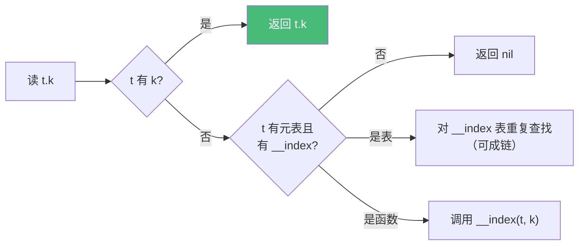

# 精通 Lua 元表与元方法

> 课程编号：L06
> 路线图来源：Lua 全场景深度课程 — 表的"超能力"
> 难度：⭐⭐⭐⭐⭐
> 预计阅读时间：60 分钟
> 📅 内容基准：**Lua 5.4.8**（`__close` 为 5.4 新增）+ **LuaJIT 2.1**

---

## 引言：让表"活起来"的机制

```lua
-- 1) 输出？
local t = setmetatable({}, { __index = function(_, k) return k .. "!" end })
print(t.hello, t.world)

-- 2) 输出？
local Vec = {}
Vec.__add = function(a, b) return setmetatable({a[1]+b[1]}, Vec) end
local x = setmetatable({1}, Vec)
local y = setmetatable({2}, Vec)
print((x + y)[1])

-- 3) 这个"只读表"能被改吗？
local ro = setmetatable({}, { __newindex = function() error("只读!") end })
-- ro.x = 1   -- ?
ro2 = setmetatable({ existing = 1 }, { __newindex = function() error("只读!") end })
ro2.existing = 2   -- 报错吗？

-- 4) 输出？
local obj = setmetatable({}, { __tostring = function() return "我是对象" end })
print(obj)
```

答案：① `hello!  world!`（`__index` 函数为缺失键生成值）；② `3`（`__add` 重载了 `+`）；③ `ro.x = 1` 报错（新键触发 `__newindex`），但 `ro2.existing = 2` **不报错**——`__newindex` **只对"表中不存在的键"触发**，已存在的键直接改；④ `我是对象`（`__tostring` 定制了打印）。

元表（metatable）是 Lua 实现"机制而非策略"哲学的核心装置。它让你用普通表搭出**默认值、只读、继承、运算符重载、自定义打印、对象系统、资源管理**。这一章是 L11（OOP）、L12（`__gc`/弱表）、L25（`__close`）的总钥匙。

---

## 第一章：元表是什么

### 1.1 基本概念

每个表（以及其它类型）可以关联一张**元表**——一张普通的表，里面用特定名字的字段（**元方法 metamethod**，都以 `__` 开头）定义"当对这个表做某些操作时，该怎么办"。

```lua
local mt = {}                      -- 元表就是普通表
local t = {}
setmetatable(t, mt)                -- 给 t 关联元表 mt
print(getmetatable(t) == mt)       -- true
```

- `setmetatable(t, mt)` 返回 `t` 本身（可链式）。
- `getmetatable(t)` 取元表（若有 `__metatable` 字段则返回它，见 4.4）。

**元方法触发时机**：当你对表做"缺省行为无法完成"的操作（访问不存在的键、对表做加法、`tostring` 一个表……），Lua 去元表找对应元方法。

### 1.2 不同类型共享元表

- **每个 table 可有独立元表**。
- **字符串**有一个全类型共享的元表（`__index = string`，所以 `("x"):upper()` 能用，见 L04）。
- 其它类型（number、boolean）默认无元表，但可用 `debug.setmetatable` 设置（少见）。

---

## 第二章：`__index` —— 查找缺失键

`__index` 是最常用的元方法。当读取 `t[k]` 而 `k` **不在 t 中**时触发。

### 2.1 `__index` 为表：委托/继承

```lua
local base = { greet = function() return "hi" end, kind = "base" }
local t = setmetatable({}, { __index = base })

print(t.greet())    -- hi（t 没有 greet，去 __index 表 base 找）
print(t.kind)       -- base
t.kind = "child"    -- 写入 t 自身
print(t.kind)       -- child（t 现在有了，不再走 __index）
print(base.kind)    -- base（base 没被改）
```

`__index` 为表时，缺失键的查找**委托**给那张表——这正是继承的基础（L11）。注意：**只影响读，不影响写**（写默认落在 t 自身）。

### 2.2 `__index` 为函数：动态计算

```lua
local t = setmetatable({}, {
    __index = function(tbl, key)
        return "动态_" .. key       -- 任意逻辑生成值
    end
})
print(t.anything)   -- 动态_anything
```

函数形式可做：惰性加载、默认值、虚拟字段、代理。

### 2.3 默认值表

```lua
local function with_default(default)
    return setmetatable({}, { __index = function() return default end })
end
local scores = with_default(0)
scores.alice = 95
print(scores.alice, scores.bob)   -- 95  0（bob 不存在 → 默认 0）
```

### 2.4 查找链

`__index` 可以串成链（A 的 `__index` 是 B，B 的 `__index` 是 C……），实现多级继承。查找是**逐级 rawget**，找到即停：



---

## 第三章：`__newindex` —— 拦截新键写入

当写 `t[k] = v` 而 `k` **不在 t 中**时触发。**已存在的键直接赋值，不触发**（引言第 3 题的考点）。

### 3.1 只读表

```lua
local function readonly(t)
    return setmetatable({}, {
        __index = t,                          -- 读：转发到真实数据
        __newindex = function() error("只读表，禁止修改", 2) end,
        __metatable = "locked",               -- 防止 getmetatable 暴露/篡改
    })
end
local config = readonly({ host = "localhost", port = 8080 })
print(config.host)     -- localhost
-- config.host = "x"   -- ❌ error: 只读表
```

注意这里的技巧：**代理空表 + `__index` 转发读 + `__newindex` 拦截写**。因为真实数据放在被代理的表里，代理表本身永远是空的，所有写都是"新键"→ 都被拦截。

### 3.2 监控/默认填充

```lua
local logged = setmetatable({}, {
    __newindex = function(t, k, v)
        print("设置", k, "=", v)
        rawset(t, k, v)        -- 必须用 rawset，否则无限递归！
    end
})
logged.x = 1   -- 打印"设置 x = 1"
```

⚠️ 在 `__newindex` 里要真正写入表，必须用 **`rawset`**——直接 `t[k]=v` 会再次触发 `__newindex`，无限递归。

---

## 第四章：运算符与其它元方法

### 4.1 算术元方法

| 元方法 | 运算符 |
|---|---|
| `__add` `__sub` `__mul` `__div` | `+ - * /` |
| `__mod` `__pow` `__unm` | `% ^` 一元负 |
| `__idiv` | `//`（5.3+） |
| `__band` `__bor` `__bxor` `__bnot` `__shl` `__shr` | 位运算（5.3+） |
| `__concat` | `..` |
| `__len` | `#` |

```lua
local Vec = {}
Vec.__index = Vec
function Vec.new(x, y) return setmetatable({x = x, y = y}, Vec) end
function Vec.__add(a, b) return Vec.new(a.x + b.x, a.y + b.y) end
function Vec.__tostring(v) return ("(%g, %g)"):format(v.x, v.y) end
function Vec.__eq(a, b) return a.x == b.x and a.y == b.y end

local a, b = Vec.new(1, 2), Vec.new(3, 4)
print(a + b)           -- (4, 6)
print(a == Vec.new(1, 2))   -- true
```

### 4.2 比较元方法

| 元方法 | 运算符 |
|---|---|
| `__eq` | `==`（仅当两操作数**同类型且都是表/userdata**、且原始不等时触发） |
| `__lt` | `<`（`>` 由 `<` 反向推出） |
| `__le` | `<=`（5.4 起不再自动用 `not __lt` 推导，须显式定义） |

⚠️ `__eq` 只在**两个操作数类型相同**（都是表或都是 userdata）且引用不同时才触发。`table == number` 永远是 false，不会调 `__eq`。

### 4.3 `__call` —— 让表可调用

```lua
local callable = setmetatable({}, {
    __call = function(self, a, b) return a + b end
})
print(callable(3, 4))   -- 7（表像函数一样被调用）
```

`__call` 用于"函子（functor）"、可配置的可调用对象、DSL。

### 4.4 `__tostring` / `__name` / `__metatable`

```lua
local obj = setmetatable({}, {
    __tostring = function() return "MyObject" end,
    __name = "MyObject",          -- 错误信息/默认 tostring 用的类型名
    __metatable = "protected",    -- getmetatable 返回它而非真元表，且禁止 setmetatable
})
print(obj)                  -- MyObject
print(getmetatable(obj))    -- protected（隐藏了真元表）
-- setmetatable(obj, {})    -- ❌ error: cannot change a protected metatable
```

`__metatable` 是保护元表的标准手段（只读库对象常用）。

### 4.5 `__gc` 与 `__close`（资源管理）

- **`__gc`**：对象被垃圾回收时调用的终结器（finalizer），用于释放外部资源（文件、socket、C 内存）。详见 L12。
- **`__close`（5.4 新增）**：配合 `<close>` 变量，在变量离开作用域时**确定性**调用——类似 RAII。详见 L25。

```lua
-- 5.4 to-be-closed 预览
local function resource()
    return setmetatable({}, { __close = function() print("释放!") end })
end
do
    local r <close> = resource()
    print("使用中")
end   -- 离开块 → 自动打印"释放!"
-- 输出：使用中 / 释放!
```

---

## 第五章：raw 系列 —— 绕过元方法

有时你需要**不触发元方法**地操作表（避免递归、检查真实内容）：

| 函数 | 绕过 |
|---|---|
| `rawget(t, k)` | `__index` |
| `rawset(t, k, v)` | `__newindex` |
| `rawequal(a, b)` | `__eq` |
| `rawlen(t)` | `__len` |

```lua
local t = setmetatable({}, { __index = function() return "fake" end })
print(t.x)            -- fake（走 __index）
print(rawget(t, "x")) -- nil（真实内容，绕过 __index）
```

最常见用途：在 `__newindex` 里用 `rawset` 写入（避免递归，见 3.2）；在 `__index` 里用 `rawget` 检查自身。

---

## 第六章：完整示例——一个带默认值的只读配置对象

把本章机制综合一下：

```lua
local function make_config(data, defaults)
    local store = {}
    for k, v in pairs(data) do store[k] = v end
    return setmetatable({}, {
        __index = function(_, k)
            local v = store[k]
            if v ~= nil then return v end
            return defaults[k]              -- 回退到默认
        end,
        __newindex = function(_, k) error("config 只读: " .. tostring(k), 2) end,
        __tostring = function() return "Config<" .. tostring(next(store)) .. "...>" end,
        __metatable = "config",
    })
end

local cfg = make_config({ port = 9000 }, { host = "0.0.0.0", port = 8080 })
print(cfg.port)    -- 9000（data 优先）
print(cfg.host)    -- 0.0.0.0（回退默认）
-- cfg.port = 1    -- ❌ 只读
```

---

## 第七章：常见陷阱清单

### ❌ 陷阱 1：`__newindex` 里直接赋值导致无限递归

```lua
__newindex = function(t, k, v) t[k] = v end   -- ❌ 再次触发自己 → 栈溢出
```
修正：`rawset(t, k, v)`。

### ❌ 陷阱 2：以为 `__index` 影响写

```lua
local t = setmetatable({}, { __index = base })
t.x = 1            -- 写到 t 自身，不影响 base
```
`__index` 只管读；写要用 `__newindex` 拦截。

### ❌ 陷阱 3：`__newindex` 对已存在键不触发

```lua
local t = setmetatable({existing = 1}, { __newindex = guard })
t.existing = 2     -- 不触发 guard！（键已存在）
t.new = 3          -- 触发
```
只读表要用"代理空表 + `__index` 转发"（见 3.1）。

### ❌ 陷阱 4：`__eq` 跨类型不触发

```lua
local n = setmetatable({}, { __eq = function() return true end })
print(n == 5)      -- false（类型不同，不调 __eq）
```

### ❌ 陷阱 5：5.4 的 `__le` 不再自动推导

```lua
-- 5.3 可由 __lt 推出 __le；5.4 起必须显式定义 __le
```

### ❌ 陷阱 6：忘了设 `__index = Class` 导致方法找不到

```lua
local Class = {}
function Class:method() end
local o = setmetatable({}, Class)   -- ❌ 漏了 Class.__index = Class
o:method()                          -- attempt to call nil（见 L11）
```
修正：`Class.__index = Class`。

---

## 第八章：练习题

**练习 1**：输出？
```lua
local t = setmetatable({1}, { __index = function(_, k) return k * 10 end })
print(t[1], t[2], t[3])
```

**练习 2**：实现一个"自动创建嵌套表"的结构（访问 `t.a.b.c = 1` 不报错）。

**练习 3**：下面会无限递归吗？为什么？
```lua
local t = setmetatable({}, {
    __index = function(self, k) return self[k] end
})
print(t.x)
```

**练习 4**：实现 `__concat` 让 `obj .. "x"` 和 `"x" .. obj` 都工作。

**练习 5**：用 `__call` 实现一个"记忆化（memoize）"包装器。

---

## 参考答案与解析

**练习 1**：`1  20  30`。`t[1]` 存在（=1）不走元方法；`t[2]`、`t[3]` 缺失 → `__index` 函数返回 `k*10` → 20、30。

**练习 2**：
```lua
local function auto()
    return setmetatable({}, { __index = function(t, k)
        local v = auto(); rawset(t, k, v); return v
    end })
end
local t = auto()
t.a.b.c = 1            -- 每级自动创建
print(t.a.b.c)         -- 1
```

**练习 3**：**会无限递归 → 栈溢出**。`t.x` 缺失触发 `__index`，里面 `self[k]` 又是 `t.x` 缺失，再触发 `__index`……要用 `rawget(self, k)` 才能终止。

**练习 4**：
```lua
local mt = { __concat = function(a, b) return tostring(a) .. tostring(b) end,
             __tostring = function() return "OBJ" end }
local o = setmetatable({}, mt)
print(o .. "x", "x" .. o)   -- OBJx  xOBJ
```
`..` 在任一操作数有 `__concat` 时触发，参数顺序保留。

**练习 5**：
```lua
local function memoize(f)
    local cache = {}
    return setmetatable({}, { __call = function(_, x)
        if cache[x] == nil then cache[x] = f(x) end
        return cache[x]
    end })
end
local slow = memoize(function(n) return n * n end)
print(slow(4), slow(4))   -- 16  16（第二次走缓存）
```

---

## 小结

| 元方法 | 触发时机 / 用途 |
|---|---|
| `__index` | 读缺失键；表→继承/委托，函数→动态/默认 |
| `__newindex` | 写**新**键；只读、监控（内部用 rawset） |
| `__add`/`__eq`/`__lt`/`__concat`/`__len` | 运算符重载（`__eq` 仅同类型表/userdata） |
| `__call` | 表可调用（函子、DSL、memoize） |
| `__tostring`/`__name`/`__metatable` | 定制打印 / 类型名 / 保护元表 |
| `__gc`/`__close` | 资源回收（L12）/ 确定性释放（5.4，L25） |
| raw* | `rawget/rawset/rawequal/rawlen` 绕过元方法 |

---

## 📅 2026 现状/更新

- **`__close`** 是 5.4 引入的确定性资源管理元方法，5.3 及 LuaJIT 不支持（见 L25）。
- 5.4 起 `__le` 不再由 `__lt` 自动推导，需显式定义。
- 元表是 Lua OOP（L11）、`lua-resty` 对象封装（L19）、Redis cjson/对象代理的统一底座；理解它等于拿到 Lua 抽象能力的总开关。

---

> 🔁 下一篇 **L07 — 精通 Lua 函数、闭包与 upvalue**：一等函数、多返回值的展开/截断规则、变长参数、闭包如何捕获 upvalue（多个闭包共享同一变量）、以及尾调用的栈复用。
>
> 反馈：元表是 Lua 的"魔法核心"，把第六章的综合示例自己默写一遍再继续。
